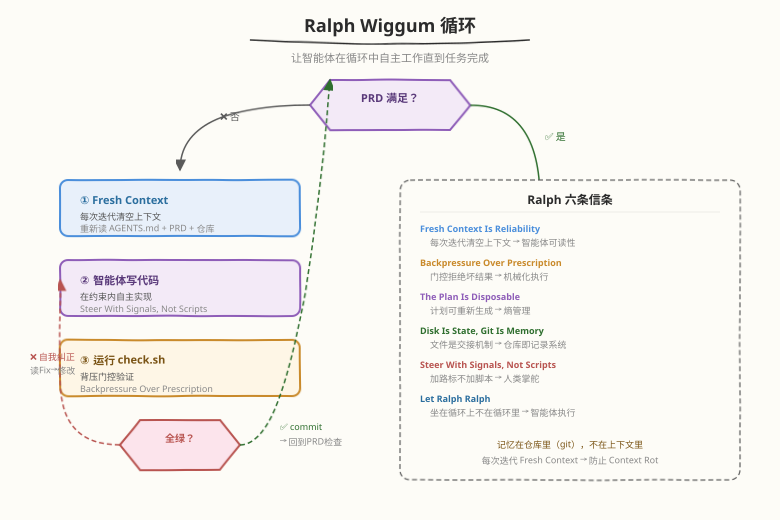
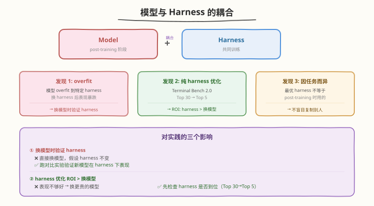
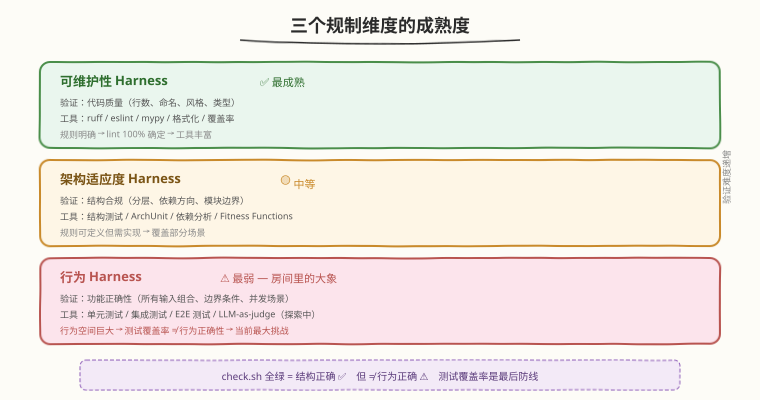

# Day 7：进阶专题与总结

## 🎯 目标

通过今天的学习，你将：

1. 理解 Ralph Wiggum 循环——Harness Engineering 的核心实战模式，以及六条信条如何映射到六大概念
2. 深入理解模型与 harness 的耦合关系——为什么换 harness 后模型表现可能暴跌，以及纯 harness 优化的巨大 ROI
3. 掌握三个规制维度的成熟度差异，认识行为 Harness 作为"房间里的大象"的当前挑战
4. 了解 Loop Engineering、自演化 harness、形式化验证等前沿方向，建立持续学习的路线图
5. 完成 10 道综合面试题复盘，覆盖六大概念 + 控制论基础 + 实战 tradeoff
6. 绘制本周知识图谱，把 Day 1-6 的所有知识点连成一张完整的认知网络

> 💡 **前置知识**：已完成 Day 1-6 全部学习，搭建了完整 harness 并完成对比实验
> ⚠️ **环境要求**：无新增——今天是理论总结与面试复盘

---

## 为什么学进阶专题

Day 1-6 我们从零搭建了一个完整的 harness：AGENTS.md + 机械化检查 + 背压门控 + 漂移扫描。这个 harness 能让智能体在约束内可靠地完成单个任务。

但真实的 Harness Engineering 不止于此。OpenAI 的 3 人团队用 5 个月产出 100 万行代码，靠的不是手动跑 `check.sh`——而是让智能体在**循环中自主工作 6+ 小时**，人类只在关键节点介入。这种模式就是 Ralph 循环。

Day 7 的目标是把视野从"单个任务的 harness"拓展到"长期自主运行的 harness"，并完成本周知识的系统化总结。

> 💡 **一句话总结**：Day 1-6 教你搭建 harness 的零件，Day 7 教你把这些零件组装成一个能长期自主运行的系统——并总结本周所学，形成可带走的认知框架。

---

## 核心概念

### 1.1 Ralph Wiggum 循环

#### 定义

Ralph 循环是 Harness Engineering 的核心实现模式：让智能体在循环中自主工作直到任务完成。



```
while PRD not fully satisfied:
    spawn AI agent (fresh context)        # 每次迭代清空上下文
    agent reads AGENTS.md + PRD + repo    # 重新读取所有状态
    agent writes code                      # 在约束内自主实现
    run backpressure checks (check.sh)     # 背压门控验证
    if checks pass:
        commit                             # 通过则提交
    else:
        agent self-corrects                # 按 Fix 指令自我纠正
```

#### 关键设计：Fresh Context

每次迭代都**清空上下文重新开始**——这是 Ralph 循环最反直觉但最重要的设计。

| 方式 | 上下文状态 | 效果 |
|------|-----------|------|
| 传统对话（保持上下文） | 越来越长 → Context Rot | 性能退化，进入 dumb zone |
| Ralph 循环（Fresh Context） | 每次从零开始 | 保持最佳推理能力 |

为什么 Fresh Context 可行？因为"记忆"不在上下文里——在**仓库**里：

```
上下文（易腐烂）→  仓库（持久化）
  对话历史      →    git log + 代码
  临时计划      →    docs/exec-plans/active/
  任务进度      →    PRD checklist + commit history
  决策记录      →    docs/design-docs/
```

> 💡 **关键洞察**：Disk Is State, Git Is Memory。文件是交接机制——每次迭代开始时，智能体重新读仓库就能恢复全部状态。不需要在上下文里"记住"任何东西。

#### Ralph 六条信条

Ralph 循环有六条核心信条，每条都映射到本周学的六大概念：

| 信条 | 含义 | Harness 对应 | 本周 Day |
|------|------|-------------|---------|
| Fresh Context Is Reliability | 每次迭代清空上下文 | 智能体可读性 | Day 4 |
| Backpressure Over Prescription | 不规定怎么做，门控拒绝坏结果 | 机械化执行 | Day 3-4 |
| The Plan Is Disposable | 计划可随时重新生成 | 熵管理 | Day 5 |
| Disk Is State, Git Is Memory | 文件是交接机制 | 仓库即记录系统 | Day 2 |
| Steer With Signals, Not Scripts | 加路标，不加脚本 | 人类掌舵 | Day 1 |
| Let Ralph Ralph | 坐在循环上，不坐在循环里 | 智能体执行 | Day 1 |

逐条解读：

**Fresh Context Is Reliability** — 每次迭代清空上下文重新读取。防止 Context Rot（Day 4），保持智能体最佳推理能力。记忆在仓库里，不在上下文里。

**Backpressure Over Prescription** — 不规定智能体"怎么做"（给自主权），但用 check.sh 门控拒绝坏结果（给约束）。对应 Day 3-4 的机械化执行 + 背压门控。

**The Plan Is Disposable** — 执行计划不是神圣不可改的文档，而是可以随时重新生成的临时工件。如果计划走不通，重新生成一个就行——成本只是一次 planning loop。对应 Day 5 的熵管理：计划本身也是需要"垃圾回收"的。

**Disk Is State, Git Is Memory** — 文件系统是状态，git 是记忆。智能体每次迭代通过读文件恢复状态，通过 git log 理解历史。对应 Day 2 的"仓库即记录系统"。

**Steer With Signals, Not Scripts** — 人类通过"信号"（AGENTS.md、黄金规则、check.sh 报错）引导智能体，而不是通过"脚本"（逐步指令）规定每一步怎么做。给目标，不规定路径（Day 3 的 Symphony 补充）。

**Let Ralph Ralph** — "坐在循环上，不坐在循环里"。人类监控循环的运行，在关键节点介入掌舵，但不深入到每一步执行中。这是"人类掌舵，智能体执行"的极致体现。

> 💡 **关键洞察**：如果你发现自己每天花大量时间审查 AI 的代码，说明你的 harness 不够强——缺的不是人力，而是约束。"Let Ralph Ralph"的意思是：信任约束系统，让智能体在约束内自主运行。

#### Ralph 的三个实现版本

| 项目 | 特点 | Stars |
|------|------|-------|
| [snarktank/ralph](https://github.com/snarktank/ralph) | 原版：bash 脚本反复启动 AI，每次迭代清空上下文 | 13.6k |
| [ralph-orchestrator](https://mikeyobrien.github.io/ralph-orchestrator/) | Rust 进化版：Hat 角色系统 + 事件驱动 + 多后端 | 2.3k |
| [bmad-ralph](https://github.com/qianxiaofeng/bmad-ralph) | BMAD 方法论 + Ralph：并行 worktree + 三层自愈 | 2 |

### 1.2 模型与 Harness 的耦合

#### LangChain 的关键发现

LangChain 在 Scaling Managed Agents 一文中揭示了一个深刻的关系：模型和 harness 不是独立的两层，它们**共同训练、相互耦合**。



| 发现 | 数据 | 启示 |
|------|------|------|
| 模型在 post-training 阶段与特定 harness 共同训练 | — | 模型和 harness 形成了耦合体 |
| 模型可能 overfit 到特定 harness | 换 harness 后表现暴跌 | 换模型时要验证 harness 是否还合适 |
| 纯 harness 优化收益巨大 | Terminal Bench 2.0：Top 30 → Top 5 | 投入 harness 优化的 ROI 可能高于换模型 |
| 最优 harness 因任务而异 | 不一定等于 post-training 时用的那个 | 不要盲目复制别人的 harness |

#### 对实践的三个影响

**影响 1：换模型时要验证 harness**

```
场景：从 Claude 4 切换到 GPT-5
❌ 直接换模型，假设 harness 不变
✅ 验证新模型在你的 harness 下表现是否正常
   → 跑对比实验（Day 6 的方法）
   → 如果表现下降，可能需要调整 harness 适配新模型
```

**影响 2：投入 harness 优化的 ROI 可能高于换模型**

```
场景：智能体表现不够好
❌ 思路：换更贵的模型（GPT-5 → Claude Opus）
✅ 思路：先检查 harness 是否到位
   → Terminal Bench 数据：纯 harness 优化 Top 30 → Top 5
   → harness 优化成本远低于换更贵的模型
```

**影响 3：不要盲目复制别人的 harness**

```
场景：看到某团队的 harness 效果很好
❌ 直接复制他们的 AGENTS.md / check.sh
✅ 理解他们为什么这样设计，根据自己的任务调整
   → 最优 harness 因任务而异
   → 你的模型、你的代码库、你的任务领域都不同
```

### 1.3 三个规制维度的成熟度

Day 4 和 Day 6 初步介绍了 Fowler 的三个规制维度。Day 7 做最终总结：



| 维度 | 成熟度 | 验证什么 | 工具 | 现状 |
|------|--------|---------|------|------|
| 可维护性 Harness | 最成熟 | 代码质量（行数、命名、风格） | lint / 格式化 / 类型检查 | 工具丰富，规则明确 |
| 架构适应度 Harness | 中等 | 结构合规（分层、依赖方向） | 结构测试 / 依赖分析 | Fitness Functions，规则可定义 |
| 行为 Harness | **最弱** | 功能正确性 | 单元测试 / 集成测试 / E2E | 房间里的大象 |

#### 为什么行为 Harness 是"房间里的大象"

| 维度 | 验证难度 | 原因 | 当前方案 | 缺口 |
|------|---------|------|---------|------|
| 可维护性 | 低 | "函数 ≤ 50 行"是明确规则 | lint 100% 确定 | 无 |
| 架构适应度 | 中 | "routes 不能调 database"可定义 | 结构测试覆盖 | 部分场景难覆盖 |
| 行为正确性 | 高 | 行为空间巨大（所有输入组合） | 单元测试覆盖有限 | 测试覆盖率 ≠ 行为正确性 |

> ⚠️ **注意**：你的 harness 能保证代码"结构正确"（lint 通过、类型正确、分层合规），但很难保证"行为正确"（功能真的对）。这就是为什么测试覆盖率仍然是最后的防线——但测试覆盖率 ≠ 行为正确性。一个 100% 覆盖率的代码仍可能有行为 bug（因为测试可能没覆盖到正确的场景）。

#### 前沿探索：LLM-as-judge

行为 Harness 的当前前沿是 **LLM-as-judge**——用 LLM 审查代码的行为正确性：

| 维度 | 计算性反馈（当前） | 推理性反馈（LLM-as-judge） |
|------|-------------------|--------------------------|
| 速度 | 快（毫秒级） | 慢（秒级到分钟级） |
| 成本 | 几乎为零 | 每次 API 调用花钱 |
| 可靠性 | 100%（确定性） | 概率性（可能误判） |
| 适合 | 结构性规则 | 行为正确性、语义合理性 |
| 成熟度 | 成熟 | 探索中 |

LLM-as-judge 是推理性反馈（Guides × Sensors 矩阵的右下象限），它补充了计算性反馈无法覆盖的"行为正确性"验证。但目前它太慢、太贵、太不可靠，无法替代计算性反馈的可靠性。

### 1.4 前沿方向

#### Loop Engineering

Addy Osmani 提出的 Loop Engineering 是 Harness Engineering 的延伸——关注**长期循环的编排**：

| 概念 | Harness Engineering | Loop Engineering |
|------|---------------------|------------------|
| 关注点 | 单个任务的约束系统 | 长期循环的编排与协调 |
| 时间跨度 | 单次任务（分钟到小时） | 长时自主（小时到天） |
| 核心问题 | 怎么让智能体可靠完成单个任务 | 怎么让循环持续运行不退化 |
| 关键组件 | AGENTS.md + check.sh + scan_drift | Ralph Loop + 状态持久化 + 自我验证 |

#### 自演化 Harness 与 RSI

Lilian Weng 在 Harness Engineering for Self-Improvement 中探讨了更前沿的方向——harness 本身能否**自我演化**？

| 阶段 | 谁改进 harness | 当前状态 |
|------|---------------|---------|
| 当前 | 人类工程师手动改进 | 成熟实践 |
| 近期 | 智能体建议改进（人类审批） | 探索中 |
| 远期 | harness 自动演化（RSI） | 理论探讨 |

RSI（Recursive Self-Improvement）的愿景：智能体不仅写业务代码，还改进自己的 harness——优化 lint 规则、更新黄金规则、调整背压门控。但这也带来了安全风险——自演化的 harness 可能偏离人类意图。

#### 形式化验证

对于安全关键场景，计算性反馈（lint/结构测试）可能不够——需要**形式化验证**：

| 验证方式 | 确定性 | 成本 | 适用场景 |
|----------|--------|------|---------|
| 单元测试 | 概率性（只覆盖测试的输入） | 低 | 一般业务代码 |
| 结构测试 | 确定性（结构规则） | 低 | 架构约束 |
| 形式化验证 | 100%（数学证明） | 极高 | 安全关键、不可逆操作 |

> 💡 **本周总结**：Day 1-7 的学习路径从"理解概念"到"动手实践"到"综合实战"到"进阶视野"。你已经具备了搭建完整 harness 的能力，并了解了前沿方向。继续学习的路线：深入 Ralph 循环实现、研究 LLM-as-judge、关注自演化 harness 的安全边界。

---

## 最小可运行示例

### 任务 1：模拟 Ralph 循环

用 bash 脚本模拟一个最小化的 Ralph 循环，理解它的工作原理：

```bash
cat > scripts/ralph_loop.sh << 'SCRIPT'
#!/bin/bash
# ralph_loop.sh —— 最小化 Ralph 循环模拟
# 用法: bash scripts/ralph_loop.sh "任务描述"
# 
# 这个脚本演示 Ralph 循环的核心逻辑：
# 1. Fresh Context：每次迭代都是独立调用
# 2. Backpressure：check.sh 作为门控
# 3. Disk Is State：状态在文件里，不在上下文里
# 4. Let Ralph Ralph：人类不介入每一步

set -euo pipefail

TASK="$1"
MAX_ITERATIONS=5
PRD_FILE="docs/exec-plans/active/ralph-task.md"

if [ -z "$TASK" ]; then
    echo "Usage: bash scripts/ralph_loop.sh \"任务描述\""
    exit 1
fi

# 创建 PRD（需求文档）
mkdir -p docs/exec-plans/active
cat > "$PRD_FILE" << EOF
# 任务：$TASK

## 验收标准
- [ ] 功能实现完成
- [ ] bash scripts/check.sh 全绿
- [ ] 测试覆盖率 > 80%

## 状态
- 迭代次数: 0
- 当前状态: 待开始
EOF

echo "🚀 Ralph 循环启动"
echo "   任务: $TASK"
echo "   PRD: $PRD_FILE"
echo "   最大迭代: $MAX_ITERATIONS"
echo "================================"
echo ""

for i in $(seq 1 $MAX_ITERATIONS); do
    echo "--- 迭代 $i/$MAX_ITERATIONS ---"
    echo "  📖 Fresh Context: 重新读取 AGENTS.md + PRD + 仓库状态"
    
    # 模拟智能体读取状态
    echo "  📝 AGENTS.md 行数: $(wc -l < AGENTS.md 2>/dev/null || echo 0)"
    echo "  📝 PRD 状态: $(grep '当前状态' $PRD_FILE 2>/dev/null || echo '未知')"
    
    echo "  🤖 智能体执行任务（Fresh Context）..."
    echo "     [模拟] AI 助手读取 AGENTS.md → 写代码 → 运行 check.sh"
    
    # 运行背压门控
    echo "  🔍 运行背压门控 (check.sh)..."
    if bash scripts/check.sh > /tmp/ralph_check_output.txt 2>&1; then
        echo "  ✅ check.sh 全绿！"
        
        # 更新 PRD
        sed -i "s/当前状态.*/当前状态: 完成（迭代 $i）/" "$PRD_FILE"
        sed -i "s/迭代次数.*/迭代次数: $i/" "$PRD_FILE"
        
        echo ""
        echo "🎉 任务完成！"
        echo "   迭代次数: $i"
        echo "   PRD 已更新: $PRD_FILE"
        exit 0
    else
        echo "  ❌ check.sh 失败"
        echo "  🔧 智能体读取 Fix 指令，自我纠正..."
        
        # 显示失败摘要
        grep -E "FAIL|ERROR|Fix:" /tmp/ralph_check_output.txt | head -3
        
        # 更新 PRD
        sed -i "s/当前状态.*/当前状态: 自我纠正中（迭代 $i）/" "$PRD_FILE"
        
        echo "  🔄 下一迭代将使用 Fresh Context 重新开始"
        echo ""
        
        # 在真实场景中，这里会调用 AI 助手修改代码
        # 为了模拟，我们假设第二次迭代能通过
        if [ "$i" -ge 2 ]; then
            echo "  [模拟] 假设自我纠正成功，跳过实际修改"
        fi
    fi
done

echo ""
echo "⚠️ 达到最大迭代次数 ($MAX_ITERATIONS)，任务未完成。"
echo "   人类介入点：检查 PRD 和 check.sh 输出，调整约束。"
exit 1
SCRIPT

chmod +x scripts/ralph_loop.sh
```

运行模拟：

```bash
bash scripts/ralph_loop.sh "添加 fibonacci 函数"
```

```text
# 预期输出
🚀 Ralph 循环启动
   任务: 添加 fibonacci 函数
   PRD: docs/exec-plans/active/ralph-task.md
   最大迭代: 5
================================

--- 迭代 1/5 ---
  📖 Fresh Context: 重新读取 AGENTS.md + PRD + 仓库状态
  📝 AGENTS.md 行数: 34
  📝 PRD 状态: 待开始
  🤖 智能体执行任务（Fresh Context）...
     [模拟] AI 助手读取 AGENTS.md → 写代码 → 运行 check.sh
  🔍 运行背压门控 (check.sh)...
  ✅ check.sh 全绿！

🎉 任务完成！
   迭代次数: 1
   PRD 已更新: docs/exec-plans/active/ralph-task.md
```

> 💡 **观察**：Ralph 循环的核心不是脚本的复杂度，而是**设计理念**：Fresh Context（每次重读）、Backpressure（check.sh 门控）、Disk Is State（PRD 在文件里）、Let Ralph Ralph（人类不介入每一步）。真实的 Ralph 实现会用 AI 助手替代模拟部分，但架构是一样的。

### 任务 2：审查你的 harness——三个规制维度

评估你的 harness 在三个规制维度上的覆盖度：

```bash
cd ~/harness-day1

echo "=== 三个规制维度审查 ==="
echo ""

echo "--- 1. 可维护性 Harness（最成熟）---"
echo "  工具:"
echo "    - ruff check src/ tests/"
ruff check src/ tests/ 2>&1 | tail -1
echo "    - mypy src/"
mypy src/ --ignore-missing-imports --no-error-summary 2>&1 | tail -1
echo "    - custom_checks.py (6 项)"
python scripts/custom_checks.py 2>&1 | tail -1
echo "  覆盖: 语法/风格/类型/命名/行数/print"
echo "  成熟度: ✅ 最成熟——规则明确，工具丰富"
echo ""

echo "--- 2. 架构适应度 Harness（中等）---"
echo "  工具:"
echo "    - test_structure.py (9 项)"
pytest tests/test_structure.py -q 2>&1 | tail -1
echo "  覆盖: AGENTS.md 存在/行数/导航/GR-1~GR-4/模块结构"
echo "  成熟度: 🟡 中等——Fitness Functions，规则可定义但需实现"
echo ""

echo "--- 3. 行为 Harness（最弱）---"
echo "  工具:"
echo "    - pytest + coverage"
pytest tests/ --ignore=tests/test_structure.py --cov=src --cov-report=term 2>&1 | grep TOTAL
echo "  覆盖: 功能正确性（仅覆盖测试的输入组合）"
echo "  成熟度: ⚠️ 最弱——行为空间巨大，测试覆盖率 ≠ 行为正确性"
echo "  缺口: 需要更多集成测试 / E2E 测试 / LLM-as-judge"
echo ""

echo "=== 审查完成 ==="
echo "可维护性: ✅ 成熟  |  架构适应度: 🟡 中等  |  行为: ⚠️ 最弱（房间里的大象）"
```

### 任务 3：整理知识图谱

将本周所学整理为一张完整的知识图谱，写入笔记：

```bash
cat > notes/knowledge_map.md << 'EOF'
# Harness Engineering 知识图谱

## 核心公式
Agent = Model + Harness
Harness = 模型之外的一切代码、配置和执行逻辑

## 六大概念 × 七天学习

| Day | 概念 | 核心要点 | 实践产出 |
|-----|------|---------|---------|
| 1 | 总览 | Agent=Model+Harness, 六大概念, Ashby定律 | 对比实验 |
| 2 | 概念1-2 | 仓库即记录系统, 地图而非手册 | AGENTS.md ≤60行 |
| 3 | 概念3 | 文档会腐烂, lint规则不会 | ruff + custom_checks + test_structure |
| 4 | 概念4 | 智能体可读性, Guides×Sensors矩阵 | check.sh背压门控 + Makefile |
| 5 | 概念5-6 | 熵管理=GC, 吞吐量改变合并理念 | golden-rules + scan_drift.py |
| 6 | 综合实战 | 完整harness, 对比实验, Harnessability | 完整harness + checklist |
| 7 | 进阶总结 | Ralph循环, 模型耦合, 行为Harness | 知识图谱 |

## 四层架构

知识传递层（前馈）
  AGENTS.md → ARCHITECTURE.md → golden-rules.md → coding-standards.md
  渐进式披露：≤60行入口 → 导航链接 → 子文档

机械化执行层（反馈）
  ruff（通用lint）→ custom_checks.py（项目约束）→ test_structure.py（架构测试）
  三段式报错：ERROR + Fix + Why

反馈回路层（背压门控）
  check.sh: lint → 类型 → 结构 → 单元 → 自定义（从快到慢，快速失败）
  自我纠正闭环：报错 → 读Fix → 修改 → 重跑 → 通过

熵管理层（漂移扫描）
  scan_drift.py: 定期审计 → JSON报告 → 智能体自动修复
  custom_checks（门卫/阻断）+ scan_drift（清洁工/报告）

## 控制论基础
Guides×Sensors 2×2矩阵
  前馈+反馈=闭环（缺一不可）
  计算性>推理性（能用确定性的就不用概率性的）
Ashby必要多样性定律
  约束削减输出多样性 → 调节器能覆盖 → "约束越严，自主性越强"

## Ralph六信条
Fresh Context Is Reliability → 智能体可读性
Backpressure Over Prescription → 机械化执行
The Plan Is Disposable → 熵管理
Disk Is State, Git Is Memory → 仓库即记录系统
Steer With Signals, Not Scripts → 人类掌舵
Let Ralph Ralph → 智能体执行

## 三个规制维度
可维护性 Harness: ✅ 最成熟（lint/类型/格式化）
架构适应度 Harness: 🟡 中等（结构测试/依赖分析）
行为 Harness: ⚠️ 最弱（单元测试覆盖有限，行为空间巨大）

## 模型与harness耦合
- 模型在post-training阶段与特定harness共同训练
- 模型可能overfit到特定harness
- 纯harness优化: Top 30 → Top 5（Terminal Bench 2.0）
- ROI: harness优化 > 换更贵的模型
EOF
```

### 任务 4：清理与最终提交

```bash
# 运行最终的完整检查
bash scripts/check.sh

# 运行漂移扫描
python scripts/scan_drift.py

# 提交
git add -A && git commit -m "feat: complete harness - Day 7 notes, ralph loop sim, knowledge map"
```

---

## 面试要点

以下是 10 道综合面试题，覆盖本周全部内容：

1. **什么是 Harness Engineering？它和传统工程有什么区别？**

<details>
<summary>点击查看答案</summary>

- Harness Engineering 是 OpenAI 在 2026 年 2 月提出的工程范式：工程师不再写代码，而是设计环境、明确意图、构建反馈回路，让 AI 智能体可靠地完成工作
- 核心转变：产出从代码变成约束系统（AGENTS.md / linter / 反馈回路）
- 与传统工程的区别：
  - 传统：人类写代码 → 机器执行代码
  - Harness：人类设计约束 → 智能体写代码 → 机器执行代码
- 总纲：人类掌舵，智能体执行
- 公式：Agent = Model + Harness

</details>

2. **Agent = Model + Harness 是什么意思？**

<details>
<summary>点击查看答案</summary>

- 裸模型只是文本输入/输出引擎，不能维护状态、执行代码、访问实时知识、搭建环境
- Harness = 模型之外的一切代码、配置和执行逻辑
- Harness 给模型补上：System Prompts（知识）、Tools & MCP（执行能力）、沙箱（环境）、Hooks（生命周期）、Back-Pressure（自我验证）、Sub-Agents（上下文防火墙）
- 当 harness 给模型状态、工具、反馈回路和可执行约束时，它才成为智能体

</details>

3. **什么是"仓库即记录系统"？为什么 Slack 讨论对智能体不存在？**

<details>
<summary>点击查看答案</summary>

- 核心原则：智能体在运行时无法访问的任何内容，对它来说不存在
- 智能体的"现实"只有一个：仓库。Slack、Google Docs、人脑中的知识对智能体不可见
- 原因：智能体在运行时只能访问它被赋予的工具（通常是文件系统和 Shell）
- 实践：一切决策、规范、计划必须以版本化工件提交到仓库
- Symphony 扩展：代码与文档放仓库；在飞工作放任务跟踪器。两者缺一不可

</details>

4. **为什么 AGENTS.md 要"地图而非手册"？巨型指令文件的三个死因是什么？**

<details>
<summary>点击查看答案</summary>

- AGENTS.md 是目录页（≤ 60 行），不是百科全书。渐进式披露——智能体从小入口开始，按需深入
- 三个死因：
  1. 挤占上下文：太长会挤占 context window，导致 Context Rot
  2. 无法维护：超过 200 行没人会持续更新
  3. 无法机械验证：自然语言规则无法被 linter 检查
- 60 行限制：HumanLayer 建议，平衡"信息量"与"推理空间"

</details>

5. **什么是"机械化执行"？为什么比文档好？错误信息为什么要内嵌修复指令？**

<details>
<summary>点击查看答案</summary>

- 机械化执行：通过强制执行不变量（lint/结构测试），而非对实施过程微观管理
- 比文档好：文档会腐烂（随时间与代码脱节），lint 规则不会（代码即文档，自动执行，不可绕过）
- 错误信息内嵌修复指令：错误信息的读者不只是人类，还有智能体。三段式 ERROR + Fix + Why → 智能体看到报错就能自我纠正，形成闭环
- 两类约束：架构约束（结构测试，验证分层依赖）+ 品味不变式（自定义 linter，验证风格标准）
- 哲学：中央强制边界，本地允许自主

</details>

6. **什么是背压（Back-Pressure）？它的工作流程是什么？**

<details>
<summary>点击查看答案</summary>

- 背压：智能体做完任务后，系统自动验证结果，不通过就拒绝
- "Backpressure Over Prescription"：不规定怎么做（给自主权），但门控拒绝坏结果（给约束）
- 工作流程：智能体读 AGENTS.md → 写代码 → 运行 check.sh → 全绿？完成 / 否→读Fix→修改→重跑→循环
- 五层检查：lint → 类型检查 → 结构测试 → 单元测试 → 自定义检查（从快到慢，快速失败）
- 在 AGENTS.md 中编码"完成任务后必须运行 check.sh"的指令

</details>

7. **什么是熵管理？为什么智能体会复现坏模式？技术债为什么是"高息贷款"？**

<details>
<summary>点击查看答案</summary>

- 智能体会复现仓库中已有的模式——包括坏模式。坏模式像病毒一样传播
- 熵管理三层方案：黄金规则编码 → 定期扫描偏差（scan_drift.py）→ 修复漂移（智能体自动修复）
- 技术债 = 高息贷款：✅ 每天小额偿还（持续垃圾回收），❌ 累积后大重构（成本巨大）
- custom_checks.py（门卫/阻断新偏差）+ scan_drift.py（清洁工/清理历史偏差）= 完整熵管理
- 品味传播：人类审查评论 → 文档更新 → lint 规则 → 自动应用于所有代码

</details>

8. **"吞吐量改变合并理念"是什么意思？快速合并的前提是什么？**

<details>
<summary>点击查看答案</summary>

- 核心转变：纠错成本低，等待成本高。智能体吞吐量远超人类注意力时，传统审查模式失效
- 传统：仔细审查慢慢合并，测试必须全绿，人类 Review 是质量门
- Harness：快速合并 + 快速纠错，偶发失败通过重跑解决，机械化检查是质量门
- 前提条件：必须有足够的背压机制（测试、lint、结构检查）。没有背压的快速合并 = 快速腐烂
- 区分可逆与不可逆：可快速纠错的变更可以快速合并，不可逆变更（schema/API/安全）需人类审查
- 智能体审查智能体：Ralph 循环让审查不受人类注意力限制

</details>

9. **Guides × Sensors 矩阵是什么？为什么前馈和反馈缺一不可？**

<details>
<summary>点击查看答案</summary>

| | 计算性（确定性） | 推理性（语义） |
|--|---------|---------|
| 引导器/前馈 | bootstrap 脚本、LSP、类型检查 | AGENTS.md、Skills、architecture.md |
| 传感器/反馈 | linter、结构测试、覆盖率 | AI code review、LLM-as-judge |

- 前馈（引导器）：行动前引导，增加首次成功率
- 反馈（传感器）：行动后观察，启用自我纠正
- 缺一不可：只有反馈 = 反复犯错（不知道该怎么做）；只有前馈 = 不知道是否生效
- 前馈 + 反馈 = 闭环
- 原则：能用计算性就不用推理性（快、便宜、100% 可靠）

</details>

10. **模型和 harness 的耦合关系是什么？对实践有什么启示？**

<details>
<summary>点击查看答案</summary>

- 模型在 post-training 阶段与特定 harness 共同训练，形成耦合体
- 模型可能 overfit 到特定 harness，换 harness 后表现暴跌
- Terminal Bench 2.0 数据：纯 harness 优化可以把排名从 Top 30 拉到 Top 5
- 三个启示：
  1. 换模型时要验证 harness 是否还合适
  2. 投入 harness 优化的 ROI 可能高于换更贵的模型
  3. 最优 harness 因任务而异，不要盲目复制别人的

</details>

---

## 今日总结

Day 7 是进阶专题与总结——把视野从"单个任务的 harness"拓展到"长期自主运行"，并完成系统化总结：

1. **Ralph 循环**：智能体在循环中自主工作直到任务完成。六条信条映射到六大概念。核心设计：Fresh Context（记忆在仓库不在上下文）、Backpressure（check.sh 门控）、Let Ralph Ralph（人类坐在循环上不坐在循环里）
2. **模型与 harness 耦合**：模型在 post-training 阶段与特定 harness 共同训练，可能 overfit。纯 harness 优化 Top 30 → Top 5。ROI：harness 优化 > 换更贵的模型
3. **三个规制维度**：可维护性（最成熟）→ 架构适应度（中等）→ 行为（最弱，房间里的大象）。行为 Harness 的前沿是 LLM-as-judge
4. **前沿方向**：Loop Engineering（长期循环编排）、自演化 harness 与 RSI（harness 自我改进）、形式化验证（安全关键场景）
5. **10 道面试题**：覆盖六大概念 + 控制论基础 + 模型耦合 + 实战 tradeoff
6. **知识图谱**：四层架构 + 控制论基础 + Ralph 六信条 + 三规制维度 + 模型耦合，形成完整认知网络

### 本周学习成果总览

| Day | 主题 | 核心产出 |
|-----|------|----------|
| 1 | 总览与核心范式 | 理解 Agent=Model+Harness，完成对比实验 |
| 2 | 仓库即记录系统 + 地图而非手册 | AGENTS.md ≤60行 + 文档结构 + 知识审计 |
| 3 | 机械化执行 | ruff + custom_checks.py(6项) + test_structure.py(9项) |
| 4 | 智能体可读性 + 反馈回路 | check.sh(5层) + Makefile + 背压门控验证 |
| 5 | 熵管理 + 吞吐量理念 | golden-rules.md(GR-1~6) + scan_drift.py |
| 6 | 综合实战 | 完整harness + 对比实验 + Harnessability评估 + Checklist |
| 7 | 进阶与总结 | Ralph循环模拟 + 知识图谱 + 10道面试题 |

> 💡 **下一步**：你已经具备了搭建完整 harness 的能力。继续深入的方向：①实现真实的 Ralph 循环（用 AI 助手替代模拟部分）②研究 LLM-as-judge 用于行为 Harness ③关注自演化 harness 的安全边界 ④把 harness 搭建 Checklist 应用到你的真实项目中。

---

## 推荐资源

| 资源 | 类型 | 优先级 | 说明 |
|------|------|--------|------|
| [OpenAI — Harness Engineering 原文](https://openai.com/zh-Hans-CN/index/harness-engineering/) | 官方 | ⭐ 必读 | 一切概念的源头，值得反复读 |
| [Mitchell Hashimoto: Engineer the Harness](https://mitchellh.com/writing/my-ai-adoption-journey#step-5-engineer-the-harness) | 博客 | ⭐ 必读 | "harness engineering" 命名出处 |
| [Martin Fowler — Harness Engineering 正式版](https://martinfowler.com/articles/harness-engineering.html) | 博客 | ⭐ 必读 | 控制论框架 + 三规制维度 + Harnessability |
| [snarktank/ralph](https://github.com/snarktank/ralph) | 开源项目 | ⭐ 必读 | Ralph 循环的原始实现，六条信条的来源 |
| [Lilian Weng — Harness Engineering for Self-Improvement](https://lilianweng.github.io/) | 博客 | 📌 推荐 | 自演化 harness 与 RSI 的前沿探讨 |
| [Addy Osmani — Loop Engineering](https://addyosmani.com/) | 博客 | 📌 推荐 | Loop Engineering 三部曲，长期循环编排 |
| [LangChain — Scaling Managed Agents](https://blog.langchain.dev/scaling-managed-agents/) | 博客 | 📌 推荐 | 模型与 harness 耦合 + Terminal Bench 数据 |
| [Anthropic — How We Contain Claude](https://www.anthropic.com/research/containment) | 官方 | 📌 推荐 | harness 的安全约束实践 |
| [harness-engineering 学习档案](https://github.com/deusyu/harness-engineering) | 社区 | 📎 参考 | 74 篇文章深度摘要 + 34 篇翻译 |
| [ralph-orchestrator](https://mikeyobrien.github.io/ralph-orchestrator/) | 开源项目 | 📎 参考 | Rust 进化版 Ralph，Hat 角色系统 |
