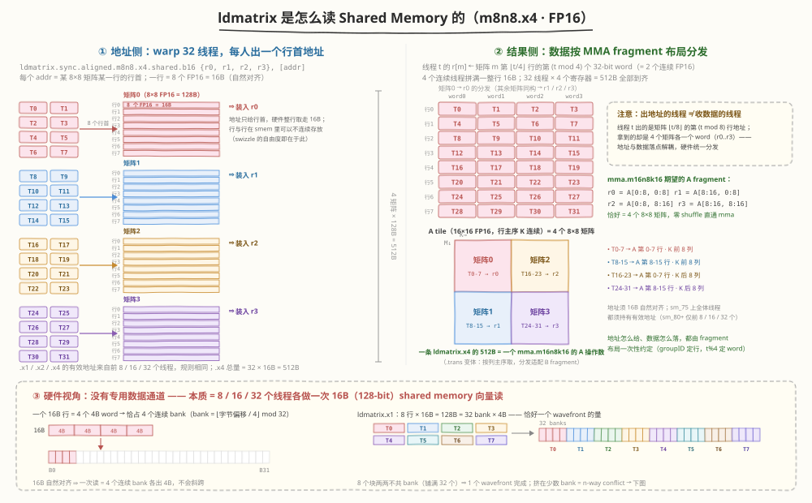
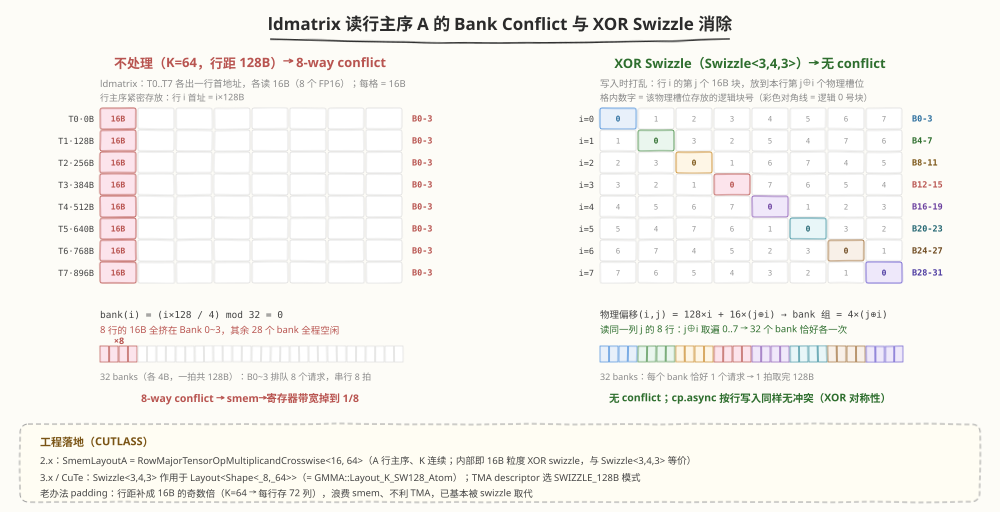

# 面试题精讲：ldmatrix 读行主序 A 的 shared memory bank conflict

> **题目**：ldmatrix 是从 shared memory 按行读取的，每个线程提供一行的起始地址，每行 8 个 FP16 即 16 字节。如果 A 矩阵在 shared memory 中按行紧密存放（行间距 16 字节的倍数），请分析 ldmatrix 读这 8 行时会不会发生 shared memory bank conflict？如果会，工程上（比如 CUTLASS）通常用什么手段消除？
>
> **考点**：shared memory bank 模型 / ldmatrix 语义 / swizzle 布局。这是 Tensor Core GEMM 面试里区分"背过 bank conflict 八股"和"真读过 CUTLASS"的一道题。

---

## 一句话结论

**会冲突，而且最典型的配置（BLOCK_K=64，行距 128B）恰好是最严重的 8-way conflict。**

判定只看行间距：设行间距 $P = 16m$ 字节（$m = P/16$）：

- $m$ 为奇数（$P \equiv 16 \pmod{32}$）→ 8 行恰好铺满 32 个 bank，**无冲突**
- $m$ 为偶数 → **冲突**，度数 $= 2^{\min(v_2(m),\,3)}$：$m=2$ → 2-way，$m=4$ → 4-way，$m \equiv 0 \pmod 8$ → 8-way

FP16 紧密存放时 $P = 2K$，所以等价说法是：**K ≡ 8 (mod 16) 侥幸无冲突；K=16/32/48/64/128 分别是 2/4/2/8/8-way**。而 K=64 正是 Ampere FP16 GEMM 最常用的 BLOCK_K（如 128×128×64 tile）。

工程上用 **XOR swizzle** 消除——写入 smem 时把每行的 16B 块按行号异或打乱（CUTLASS 2.x 的 `TensorOpMultiplicandCrosswise`、CuTe 的 `Swizzle<3,4,3>`、Hopper TMA 的 `SWIZZLE_128B` 都是它）。padding（行距补成 16B 奇数倍）是已被淘汰的老办法。

---

## 一、预备知识

### 1.1 ldmatrix 到底做了什么

```cpp
// PTX：一条指令为 warp 加载 1/2/4 个 8x8 的 b16 矩阵到寄存器 fragment
ldmatrix.sync.aligned.m8n8.x4.shared.b16 {r0, r1, r2, r3}, [addr];
```

| 变体 | 提供地址的线程 | 每个地址指向 | 总数据量 |
|------|--------------|-------------|---------|
| `.x1` | 前 8 个线程 | 一个 8×8 矩阵某一行的行首（16B） | 8 行 × 16B = 128B |
| `.x2` | 前 16 个线程 | 两个 8×8 的行首 | 256B |
| `.x4` | 全部 32 个线程 | 四个 8×8 的行首（T0-7 → 矩阵 0，T8-15 → 矩阵 1……） | 512B |

从 bank conflict 的角度看，ldmatrix **没有任何特殊硬件通道**，本质就是 8/16/32 个线程各做一次 16B（128-bit）的 shared memory 向量读取。对 `.x1`：8 × 16B = 128B，恰好等于一个 wavefront 的宽度（32 bank × 4B）。



上图的三个要点（面试时能画出来就赢了一半）：

- **地址侧**：线程 $t$ 提供矩阵 $\lfloor t/8 \rfloor$ 第 $(t \bmod 8)$ 行的行首地址；地址只给行首，硬件整行取走 16B，行与行在 smem 里**可以不连续**——swizzle 的自由度正在于此
- **结果侧**：线程 $t$ 的 $r[m]$ 收到矩阵 $m$ 第 $\lfloor t/4 \rfloor$ 行第 $(t \bmod 4)$ 个 32-bit word——出地址的线程 ≠ 收数据的线程，地址与数据落点解耦，硬件统一分发；一条 `.x4` 的 512B 恰好拼成 `mma.m16n8k16` 的 A fragment（$r_0 = A[0{:}8,0{:}8]$、$r_1 = A[8{:}16,0{:}8]$、$r_2 = A[0{:}8,8{:}16]$、$r_3 = A[8{:}16,8{:}16]$），零 shuffle 直通 mma
- **硬件视角**：每个 16B 行 = 4 个连续 4B word，恰占 4 个连续 bank；`.x1` 的 8 行若两两不共 bank（铺满 32 个）则 1 个 wavefront 完成，挤在少数 bank 就是 n-way conflict——这正是下一节的分析对象

### 1.2 shared memory bank 模型

- 32 个 bank，每个宽 4B；字节偏移 $o$ 落在 bank $\lfloor o/4 \rfloor \bmod 32$
- 一拍（wavefront）内每个 bank 只能响应一个 4B 地址；同一 bank 的**不同**地址 → n-way conflict，串行 n 拍（同一地址是 broadcast，不冲突）
- 一次 16B 向量读取横跨 **4 个连续 bank**

于是得到判定准则：

> **ldmatrix.x1 无冲突 ⟺ 8 行的 16B 块两两落在互不重叠的 bank 组 ⟺ 8 个块恰好铺满全部 32 个 bank。**

---

## 二、冲突分析

### 2.1 推导

设 A tile 行主序紧密存放在 smem，行间距 $P$ 字节（FP16、K 列时 $P = 2K$）。ldmatrix 读某个 8×8 tile：线程 $i$（$i=0..7$）读第 $i$ 行的一个 16B 块。以 16B 块为单位，第 $i$ 行被读块的位置（相对 tile 起点共 8 个槽位）：

$$\text{slot}(i) \equiv C + i \cdot d \pmod 8,\qquad d = P / 16 \ (\text{每行的 16B 块数})$$

每个槽位占 4 个 bank，所以 8 行无冲突 ⟺ $\{C + i\cdot d \bmod 8\}$ 取遍 $0..7$ ⟺ $\gcd(d, 8) = 1$ ⟺ **d 为奇数**。d 为偶数时每个被占槽位叠了 $\gcd(d,8)$ 行，即冲突度数 $=\gcd(d,8)=2^{\min(v_2(d),3)}$（最多 8 行，封顶 8-way）。

### 2.2 按常用 BLOCK_K 分类（FP16 紧密存放，P = 2K）

| BLOCK_K（FP16 列数） | 行距 P | d = P/16 | 结果 |
|:---:|:---:|:---:|---|
| 8 | 16B | 1 | 无冲突 |
| 16 | 32B | 2 | 2-way |
| 24 | 48B | 3 | 无冲突 |
| 32 | 64B | 4 | 4-way |
| 48 | 96B | 6 | 2-way |
| **64** | **128B** | **8** | **8-way（最常用，也最惨）** |
| 128 | 256B | 16 | 8-way |

**为什么 K=64 恰好最惨**：行距 128B = 32 个 4B word，正好绕 32 个 bank 一整圈——8 行的行首块全部落回 Bank 0~3，其余 28 个 bank 全程空闲，smem→寄存器带宽利用率只有 1/8。而 K ≡ 8 (mod 16)（如 K=8/24/40/56）时行距错开半个 bank 空间，侥幸无冲突——但这种"踩对尺寸"不可控，工程上不会指望它。



补充两点（面试时主动说出来是加分项）：

- **`.x4`**：32 个地址按 8 个一组（对应 4 个 8×8 矩阵）分拍处理，每组独立按上述规则判定，结论不变；A、B 两个操作数都不 swizzle 时，smem→RF 这条路会整体成为瓶颈
- **`ldmatrix.trans`**（读列主序 B 时用）：同样是 16B 行粒度的读取，bank 分析完全一样；sm90 的 `stmatrix`（epilogue 写回）同理

---

## 三、工程上怎么消除

### 3.1 XOR Swizzle（CUTLASS 的标准答案）

**思想**：写入 smem 时就把每行的 16B 块顺序按行号打乱——

$$\text{物理槽位}(i, j) = j \oplus (i \bmod 8)\qquad \text{（行 } i \text{ 的第 } j \text{ 个 16B 块，存到本行第 } j \oplus i \text{ 个槽位）}$$

为什么这一条 XOR 能让**读写两头都无冲突**（这是本题最漂亮的部分）：

- **ldmatrix 按列取块**（固定 $j$，$i=0..7$）：$j \oplus i$ 取遍 $0..7$ → 8 个块铺满 32 个 bank → 读无冲突
- **cp.async / 普通 store 按行写入**（固定 $i$，$j=0..7$）：$j \oplus i$ 同样取遍 $0..7$ → 写也无冲突
- 这也解释了**swizzle 粒度为什么选 16B**：与 ldmatrix / cp.async 的 128-bit 访问粒度对齐，两边共享同一套置换

**CUTLASS 2.x（Ampere）**：A 行主序（K 连续）时的 smem 布局（`include/cutlass/layout/tensor_op_multiplicand_sm75.h`）：

```cpp
using SmemLayoutA = cutlass::layout::RowMajorTensorOpMultiplicandCrosswise<
    16, 64>;   // 16bit 元素、crosswise=64：即 8 行 × 128B 的 swizzle atom

// 源码里的核心两行（TensorOpMultiplicand::operator()）就是这个 XOR：
//   permuted_vec_contiguous_within_partition =
//       partition_contiguous_residual ^ (partition_strided_residual % 4);
//   permuted_partition_contiguous_within_tile =
//       partition_contiguous_idx ^ (partition_strided_idx % 2);
// 两条拼起来 = j ^ (i mod 8)，与 CuTe 的 Swizzle<3,4,3> 完全等价
```

**CUTLASS 3.x / CuTe**（`include/cute/atom/mma_traits_sm90_gmma.hpp`）：

```cpp
// K-major A 的 128B swizzle 原子：8 行 × 64 列 FP16（每行 128B）
using SmemLayoutAtom = GMMA::Layout_K_SW128_Atom<cutlass::half_t>;
// = ComposedLayout<Swizzle<3,4,3>, smem_ptr_flag,
//                  Layout<Shape<_8,_64>, Stride<_64,_1>>>

auto sA = make_tensor(make_smem_ptr(smem),
                      tile_to_shape(SmemLayoutAtom{}, Shape<_128,_64>{}));
// copy(gA, sA) 写入自动 swizzle，ldmatrix/MMA 读取自动反解，用户无感
```

`Swizzle<3,4,3>` 的位运算含义：把字节偏移的 bit[7:10)（第几个 128B 行）XOR 进 bit[4:7)（行内第几个 16B 块）：

```cpp
uint32_t swizzle_128b(uint32_t off) {   // off 相对 1024B 对齐基址
    return off ^ ((off & 0x380) >> 3);  // 验证：128i + 16j → 128i + 16(j^i)
}
```

**自己手写 kernel** 时同样三行就能落地：

```cpp
constexpr int K = 64;                          // 行距 128B = 8 个 16B 块
__shared__ __align__(1024) uint4 sA[M][K / 8]; // 以 16B 块为单位

// 写入：逻辑块 (i, j) → 物理槽位 (i, j ^ (i & 7))
sA[i][j ^ (i & 7)] = ...;                     // cp.async 16B 粒度同理

// ldmatrix：读逻辑第 c 块的 8 行，线程 t 提供第 t 行地址（同样过 swizzle）
uint32_t addr = __cvta_generic_to_shared(&sA[t][c ^ (t & 7)]);
asm volatile("ldmatrix.sync.aligned.m8n8.x1.shared.b16 {%0}, [%1];"
             : "=r"(frag) : "r"(addr));
```

### 3.2 padding（朴素做法，已基本淘汰）

把行距补成 16B 的奇数倍：K=64 → 每行存 72 列（P=144B，d=9 为奇数）→ 无冲突。

- 优点：一行声明 `half tile[M][K + 8]` 就完事
- 缺点：浪费 12.5% smem（直接挤占 pipeline stage 数 / occupancy）；行不再 128B 对齐；与 TMA descriptor 要求的规整 swizzle 行距不兼容
- 面试话术：CUTLASS 1.x 时代用 padding，现代代码一律 swizzle——swizzle 不浪费一个字节，代价只是写入/读取地址各过一次 XOR

### 3.3 Hopper+：TMA + WGMMA 把 swizzle 做进硬件接口

- **WGMMA** 的 A/B 操作数直接从 smem 读（不再经 ldmatrix 搬寄存器），但 smem 布局同样要求无 bank conflict，解法还是 swizzle
- **TMA descriptor** 原生提供 swizzle 模式（`SWIZZLE_32B/64B/128B`，分别对应 `Swizzle<1/2/3,4,3>`）：global → smem 的搬运由硬件按 swizzle 后的地址落位
- 整条链路（TMA 写入 → WGMMA 读取）共用同一个 swizzle 布局，冲突问题在布局层一次性解决——这也是 CUTLASS 3.x 让用户"无感"的原因

---

## 四、面试官可能的追问

- **为什么同 bank 同地址不算冲突？** broadcast（一线程的值广播给全 warp）；但 ldmatrix 的 8 行地址互不相同，用不上
- **`.x2`/`.x4` 呢？** 32 个地址按 8 个一组、每组独立判定，结论同 `.x1`
- **B 矩阵呢？** B 列主序（K 连续）用 `ldmatrix.trans`，同为 16B 行粒度，分析与解法一致；A 列主序（M 连续）则用 Congruous 系列布局（另一种非对称 swizzle）
- **怎么验证？** Nsight Compute → Memory Workload Analysis → Shared Memory 面板的 bank conflict 计数；Ampere+ 有 LDSM 专属指标（如 `l1tex__data_pipe_lsu_wavefronts_mem_shared_op_ldsm`，各代架构名称略有差异）
- **为什么 swizzle 粒度是 16B 而不是 4B/32B？** 与 ldmatrix/cp.async 的 128-bit 访问粒度对齐——粒度更细（如按 4B word 打散）会破坏"连续 16B 的行"，ldmatrix 的地址就没法给了；粒度更粗（如 32B）则 8 个块只能落到 4 个位置，打散不充分仍有冲突
- **LDGSTS（cp.async）写 smem 有 conflict 吗？** 有同样的问题，所以 swizzle 必须同时照顾写（按行）和读（按列块）两个方向——这正是 XOR 对称性的价值

---

## 小结

1. ldmatrix = 每线程一次 16B 的 smem 向量读取，无任何避冲突的特殊硬件
2. 判定式：行间距 $P=16m$，$m$ 奇 → 无冲突；$m$ 偶 → $2^{\min(v_2(m),3)}$-way；典型 K=64（P=128B）→ 8-way，带宽 1/8
3. 消除：XOR swizzle（$j \to j \oplus i$）让按行写、按列读同时无冲突；CUTLASS 2.x `TensorOpMultiplicandCrosswise` ≡ CuTe `Swizzle<3,4,3>` ≡ TMA `SWIZZLE_128B`
4. padding 能消但浪费 smem、不利 TMA，现代代码不用

## 参考

- PTX ISA：`ldmatrix.sync.aligned.m8n8.x{1,2,4}.shared.b16`（含 `.trans` 变体）
- CUTLASS 2.x swizzle 实现：[tensor_op_multiplicand_sm75.h](https://github.com/NVIDIA/cutlass/blob/main/include/cutlass/layout/tensor_op_multiplicand_sm75.h)
- CuTe swizzle / GMMA 原子布局：[swizzle.hpp](https://github.com/NVIDIA/cutlass/blob/main/include/cute/swizzle.hpp)、[mma_traits_sm90_gmma.hpp](https://github.com/NVIDIA/cutlass/blob/main/include/cute/atom/mma_traits_sm90_gmma.hpp)（`Layout_K_SW128_Atom`）
- 相关笔记：[CUTLASS Day3 数据流](../../cutlass/day3.md)、[CuTe swizzle 消 bank conflict 图解](../../images/cute_swizzle_bank_conflict.svg)
