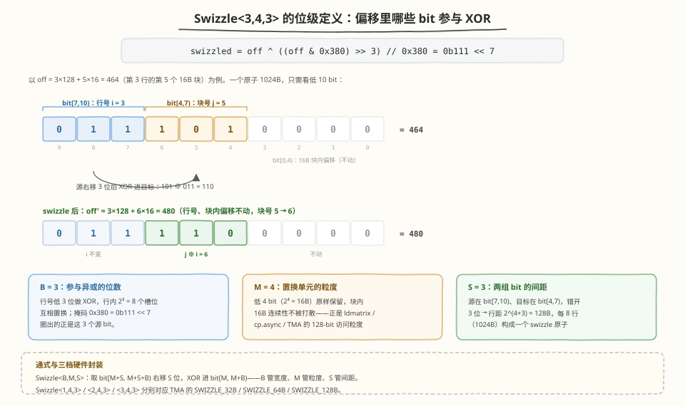
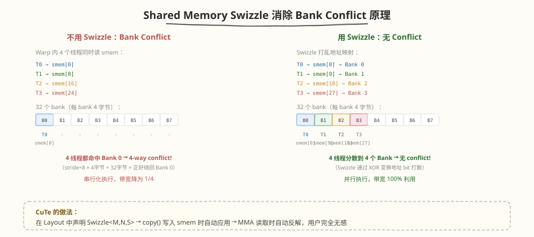
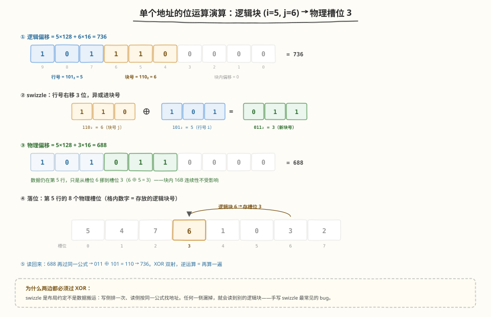
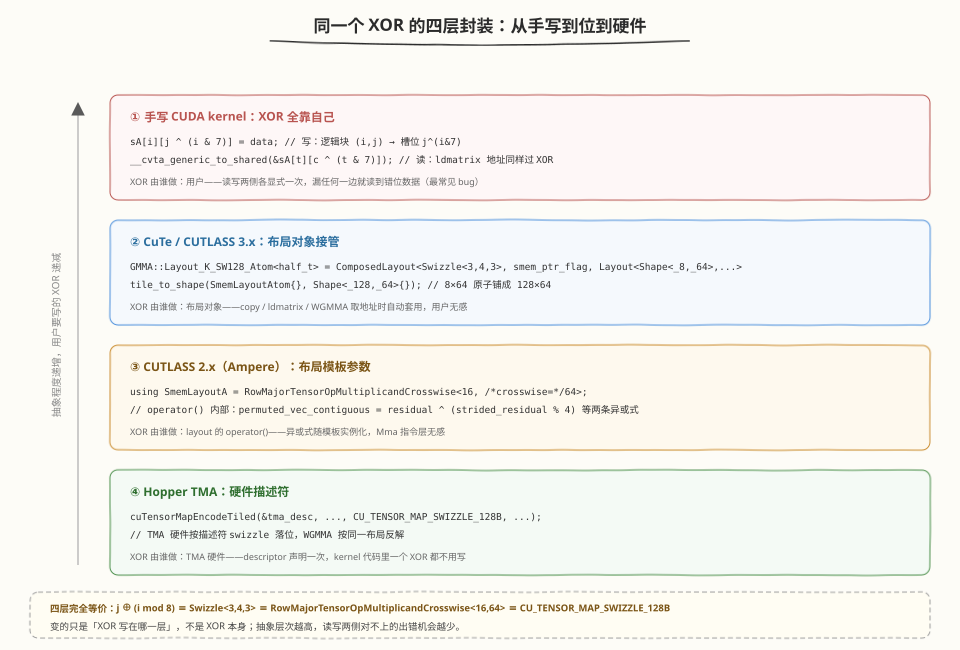
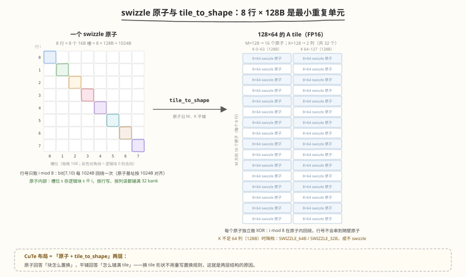

# Swizzle 机制详解：从 bank conflict 到 XOR 置换

> **导读**：swizzle（地址重排/打花）是 GPU 高性能 kernel 里消除 shared memory bank conflict 的标准手段。本文从问题出发，给出 swizzle 的形式化定义（CuTe `Swizzle<B, M, S>`），用具体数字完整演示一遍置换过程，并给出手写 CUDA、CuTe、CUTLASS 2.x、TMA 四个层次的代码实例。
>
> **前置阅读**：[ldmatrix 读行主序 A 的 bank conflict](ldmatrix_bank_conflict.md)——那篇讲"为什么会冲突"，这篇讲"swizzle 为什么能解决、具体怎么排"。

---

## 一句话结论

**Swizzle = 对 shared memory 地址做一次"按位 XOR"的双射置换**：写入时把第 `i` 行的第 `j` 个 16B 块存到本行第 `j ^ (i mod 8)` 个槽位。这一个 XOR 同时保证"按行写（cp.async）"和"按列读（ldmatrix / WGMMA）"两个方向都无 bank conflict，且零额外显存、零运行时开销（地址计算本来就在做）。CUTLASS 2.x 的 `TensorOpMultiplicandCrosswise`、CuTe 的 `Swizzle<3,4,3>`、Hopper TMA 的 `SWIZZLE_128B` 是同一件事的三种封装。

---

## 一、要解决的问题

回顾 shared memory 的硬件模型：

- 32 个 bank，每个 4B 宽；字节偏移 `o` 落在 bank `(o / 4) % 32`
- 一拍内同一 bank 只能服务一个不同地址；16B（128-bit）向量访问横跨 4 个连续 bank

以 FP16 GEMM 最常用的 tile 为例：**A tile 按行主序紧密存放，BLOCK_K = 64，行距 128B**。此时：

```
行 i 的起点 = i × 128B
128B = 32 个 4B word → 恰好绕 32 个 bank 一整圈
→ 第 0 行和第 1 行的同一列块落在完全相同的 bank 上
```

ldmatrix 按"列"取 8 行同一位置的 16B 块时，8 个地址全部挤在 Bank 0~3，其余 28 个 bank 空闲——**8-way conflict，带宽只剩 1/8**。根本原因是：**逻辑上规则的布局（行距是 128B 的幂次倍数）映射到物理 bank 时产生了共振**。

解决思路有两类：

| 方案 | 做法 | 代价 |
|------|------|------|
| padding | 行距补成 16B 的奇数倍（如 64 列存 72 列） | 浪费 12.5% smem，挤占 pipeline stage / occupancy；与 TMA 不兼容 |
| **swizzle** | 行内 16B 块按行号 XOR 重排 | 零显存开销，仅地址多一次 XOR |

现代代码（CUTLASS 2.x 之后）一律用 swizzle，padding 只作为理解对照存在。

---

## 二、Swizzle 的形式化定义

### 2.1 本质：一个双射置换

swizzle 不改数据量、不改 tile 形状，只是把"逻辑块 → 物理槽位"的映射从恒等换成一个**置换**：

$$\text{物理槽位}(i, j) = j \oplus (i \bmod 8)$$

其中 $i$ 是行号、$j$ 是行内 16B 块号。它有三个关键性质：

1. **双射**：XOR 可逆，$(j \oplus i) \oplus i = j$——行内块一一对应，不多占一个字节
2. **行内置换**：固定 $i$，$j \to j \oplus i$ 是 $\{0..7\}$ 的置换 → 按行连续写（cp.async 一次写一整行 128B）时 8 个块铺满 32 个 bank，**写无冲突**
3. **列内置换**：固定 $j$，$i \to j \oplus i$（$i=0..7$）同样是 $\{0..7\}$ 的置换 → ldmatrix 按列取 8 行时 8 个块也铺满 32 个 bank，**读无冲突**

性质 2 和 3 的对称性是 XOR 被选为标准答案的核心原因——**一个置换同时满足读写两个互相垂直的访问方向**。

### 2.2 CuTe 的位级定义：Swizzle\<B, M, S\>

CuTe 把这类 XOR 置换参数化为三个整数（`include/cute/swizzle.hpp`）：

```cpp
// Swizzle<B, M, S>：作用于字节偏移 offset
//   取 offset 的 bit [M+S, M+S+B) 共 B 位，
//   右移 S 位后 XOR 进 bit [M, M+B)
swizzled = offset ^ ((offset & (((1 << B) - 1) << (M + S))) >> S);
```

三个参数的含义：

| 参数 | 含义 | `Swizzle<3,4,3>` 取值 | 解释 |
|:---:|:---|:---:|:---|
| `B` | 参与 XOR 的位数 | 3 | $2^3 = 8$ 个槽位互相置换 |
| `M` | 置换单元的粒度 $\log_2$ 字节数 | 4 | $2^4 = 16$B = 128-bit 访问粒度 |
| `S` | 两组 bit 的间距 | 3 | $2^{4+3} = 128$B 行距，即每 8 行构成一个 swizzle 原子 |

代入得：

```cpp
uint32_t swizzle_128b(uint32_t off) {
    return off ^ ((off & 0x380) >> 3);   // 0x380 = 0b111 << 7
}
```

即：取偏移的 bit[7:10)（"第几个 128B 行"），XOR 进 bit[4:7)（"行内第几个 16B 块"）。对 `off = 128·i + 16·j` 验证：

$$128i + 16j \;\xrightarrow{\;\text{swizzle}\;}\; 128i + 16\,(j \oplus (i \bmod 8))$$

与 2.1 节的置换完全一致。这就是 **TMA `SWIZZLE_128B` / GMMA `Layout_K_SW128_Atom` 的底层公式**。

位分组与 XOR 的对应关系如下图（以第 3 行、块 5 为例，绿底是异或后的新块号；B/M/S 三个参数各管什么也标在图上）：



---

## 三、完整数字演示

### 3.1 场景设定

- FP16 A tile，$M \times K = 8 \times 64$ 的一个 swizzle 原子（8 行 × 128B = 1024B）
- 每行 64 个 FP16 = 8 个 16B 块，逻辑块号 $j = 0..7$
- 以 16B 块为单位观察，块 $s$ 占 bank $\{4s, 4s{+}1, 4s{+}2, 4s{+}3\}$

### 3.2 不 swizzle：列读全撞车

物理槽位 = 逻辑槽位。ldmatrix 读逻辑块 $j=0$ 的 8 行（线程 $t$ 读第 $t$ 行块 0）：

| 行 i | 逻辑块 j | 物理槽位 | 起始 bank |
|:---:|:---:|:---:|:---:|
| 0 | 0 | 0 | 0 |
| 1 | 0 | 0 | 0 |
| 2 | 0 | 0 | 0 |
| ... | 0 | 0 | 0 |
| 7 | 0 | 0 | 0 |

8 行全部落在 bank 0~3 → **8-way conflict**。

### 3.3 swizzle 后：行写列读都铺满

物理槽位 $= j \oplus i$。整个原子的槽位表（行 = 行号 $i$，列 = 逻辑块 $j$，表项 = 物理槽位）：

| i\j | 0 | 1 | 2 | 3 | 4 | 5 | 6 | 7 |
|:---:|:---:|:---:|:---:|:---:|:---:|:---:|:---:|:---:|
| 0 | **0** | 1 | 2 | 3 | 4 | 5 | 6 | 7 |
| 1 | **1** | 0 | 3 | 2 | 5 | 4 | 7 | 6 |
| 2 | **2** | 3 | 0 | 1 | 6 | 7 | 4 | 5 |
| 3 | **3** | 2 | 1 | 0 | 7 | 6 | 5 | 4 |
| 4 | **4** | 5 | 6 | 7 | 0 | 1 | 2 | 3 |
| 5 | **5** | 4 | 7 | 6 | 1 | 0 | 3 | 2 |
| 6 | **6** | 7 | 4 | 5 | 2 | 3 | 0 | 1 |
| 7 | **7** | 6 | 5 | 4 | 3 | 2 | 1 | 0 |

两个方向各检查一遍：

- **写（固定 $i$，cp.async 连续写整行 8 个块）**：第 $i$ 行的物理槽位是 $0..7$ 的置换 → 铺满 32 bank，无冲突
- **读（固定 $j$，ldmatrix 取 8 行）**：上表任意一列（如加粗的 $j=0$ 列 = 0,1,2,3,4,5,6,7）也是 $0..7$ 的置换 → 铺满 32 bank，**8-way → 0 conflict**

直观效果如下图所示（逻辑块号即颜色，左图同列全同色撞 bank，右图错位铺满）：



### 3.4 单个地址的位运算演算

逻辑坐标：第 5 行、第 6 个 16B 块（行主序基址对齐 1024B）。

```
逻辑偏移 = 5 × 128 + 6 × 16 = 736 = 0b10_111_0_0000
                                  bit: 9..7   6..4
                                     =101    =110   (第 5 行，块 6)

swizzle：bit[7:10) = 101 (=5)，右移 3 位 XOR 进 bit[4:7)：
  110 ^ 101 = 011 (=3)

物理偏移 = 5 × 128 + 3 × 16 = 688
```

即逻辑块 (5, 6) 实际存在第 5 行的槽位 3（$6 \oplus 5 = 3$，与上表一致）。读的时候同样用这套公式算地址，硬件/编译器做的事完全一样——**swizzle 是布局约定，不是数据变换，逆运算就是再用同一公式算一遍地址**。

整个演算过程（位分组 → XOR → 落位 → 读侧逆运算）如下图：



---

## 四、代码实例

四个层次做的是同一件事，差别只在"XOR 写在哪一层"：



### 4.1 手写 CUDA kernel

```cpp
constexpr int M = 128, K = 64;                    // 行距 128B = 8 个 16B 块
__shared__ __align__(1024) uint4 sA[M][K / 8];    // 直接以 16B 块为单位声明

// 写入（global → smem，也可用 cp.async 16B 粒度）：
// 逻辑块 (i, j) 写到物理槽位 (i, j ^ (i & 7))
int i = /* 本线程负责的行 */, j = /* 块号 */;
sA[i][j ^ (i & 7)] = *reinterpret_cast<const uint4*>(&gA[/* ... */]);

// ldmatrix 读取：取逻辑列块 c 的 8 行，线程 t 提供第 t 行地址，
// 同样要过一次 swizzle（行号即 t）
uint32_t addr = __cvta_generic_to_shared(&sA[t][c ^ (t & 7)]);
asm volatile("ldmatrix.sync.aligned.m8n8.x1.shared.b16 {%0}, [%1];"
             : "=r"(frag) : "r"(addr));
```

要点：**写和读用同一个 XOR，任何一侧漏掉都会读到错位的数据**——这是手写 swizzle 最常见的 bug。

### 4.2 CuTe（CUTLASS 3.x）：布局对象自动处理

```cpp
#include <cute/tensor.hpp>
using namespace cute;

// K-major FP16 的 128B swizzle 原子（mma_traits_sm90_gmma.hpp 中的定义）：
//   GMMA::Layout_K_SW128_Atom<half_t>
// = ComposedLayout<Swizzle<3,4,3>, smem_ptr_flag,
//                  Layout<Shape<_8,_64>, Stride<_64,_1>>>
using SmemLayoutAtom = GMMA::Layout_K_SW128_Atom<cutlass::half_t>;

// tile_to_shape 把 8×64 的原子铺到 128×64，swizzle 嵌在布局里
auto sA = make_tensor(make_smem_ptr(smem_a),
                      tile_to_shape(SmemLayoutAtom{}, Shape<_128,_64>{}));

// copy / ldmatrix / WGMMA 的地址全部经过布局对象，用户看不到 XOR
copy(gmem_tiled_copy, gA, sA);
```

CuTe 把 swizzle 表达为 `ComposedLayout`：外层 `Swizzle<3,4,3>` 作用于偏移，内层普通行主序 layout 负责坐标→偏移。取地址 = 先算线性偏移、再过 swizzle 位运算，与 4.1 手写的两步完全同构。

### 4.3 CUTLASS 2.x（Ampere）：模板参数选择布局

```cpp
// include/cutlass/layout/tensor_op_multiplicand_sm75.h
using SmemLayoutA = cutlass::layout::RowMajorTensorOpMultiplicandCrosswise<
    16,   // 元素位宽
    64>;  // crosswise = 64 个元素 = 128B，即 8 行 × 128B 的 swizzle 原子

// operator() 里的核心就是两条 XOR（等价于 j ^ (i mod 8)）：
//   permuted_vec_contiguous_within_partition =
//       partition_contiguous_residual ^ (partition_strided_residual % 4);
//   permuted_partition_contiguous_within_tile =
//       partition_contiguous_idx ^ (partition_strided_idx % 2);
```

### 4.4 Hopper：TMA 把 swizzle 做进硬件描述符

```cpp
// 建 TMA descriptor 时声明 swizzle 模式（三档，对应三个 S 参数）：
//   CU_TENSOR_MAP_SWIZZLE_32B  ↔  Swizzle<1,4,3>
//   CU_TENSOR_MAP_SWIZZLE_64B  ↔  Swizzle<2,4,3>
//   CU_TENSOR_MAP_SWIZZLE_128B ↔  Swizzle<3,4,3>
CUtensorMap tma_desc;
cuTensorMapEncodeTiled(&tma_desc, CU_TENSOR_MAP_DATA_TYPE_FLOAT16,
                       /*rank=*/2, gmem_ptr, globalDim, globalStrides,
                       boxDim, elementStrides,
                       CU_TENSOR_MAP_INTERLEAVE_NONE,
                       CU_TENSOR_MAP_SWIZZLE_128B,   // ← 硬件按 swizzle 落位
                       CU_TENSOR_MAP_L2_PROMOTION_L2_128B,
                       CU_TENSOR_MAP_FLOAT_OOB_FILL_NONE);
```

global → smem 的搬运由 TMA 硬件按 swizzle 后的地址直接落位；WGMMA 从 smem 读操作数时按同一布局反解。整条链路在描述符层面统一，kernel 代码里一个 XOR 都不用写。

---

## 五、几个设计细节

### 5.1 为什么置换粒度是 16B，不是 4B 或 32B？

- **更细（4B）**：ldmatrix 每行要读"连续 16B"，粒度细于 16B 会把行打散，地址给不出来；cp.async 的 16B 向量写同理
- **更粗（32B）**：128B 行只有 4 个 32B 块，8 行只能落到 4 个位置，置换不充分，仍有 2-way 冲突
- **16B** 恰好等于 ldmatrix / cp.async / TMA 的 128-bit 访问粒度，读写两边共享同一置换——这是"约定凑出来的最优"，不是巧合

### 5.2 为什么 XOR，而不是加法置换（j + i mod 8）？

- 加法置换同样双射、同样能铺满 bank，早期文献里也出现过
- XOR 的优势：**零进位、纯位运算**，地址生成和掩码逻辑最简；且 $j \oplus j = 0$，对角线自然归零，便于和 swizzle 原子的对齐基址组合
- 工程上 XOR 已成为事实标准（CUTLASS / CuTe / TMA 三处全是 XOR）

### 5.3 原子大小与 tile 的关系

swizzle 原子固定为 **8 行 × 128B**（`SWIZZLE_128B`）。当 tile 的 K 方向超过 64 列 FP16（128B）时，逻辑上按 64 列分块、原子沿 M 和 K 平铺（`tile_to_shape`）；K 不足 64 时降级用 `SWIZZLE_64B/32B` 或不用 swizzle。这就是为什么 CuTe 里布局写成"原子 + tile_to_shape"两层。

原子与 tile 的关系如下图（左侧是一个原子的置换模式，右侧是 `tile_to_shape` 铺出的 128×64 tile）：



### 5.4 GEMM 之外的 swizzle

同一个词在 GPU 编程里还指另一件事，注意区分：

- **L2 cache / thread block swizzle**：重排 CTA 的调度顺序（如把 (bx, by) 映射成沿对角线发射），让同时活跃的 block 访问的 gmem 区域更局部化，提高 L2 命中率——改的是 block 调度顺序，与 bank 无关（参见 triton 笔记中的 L2 swizzle 图）
- **本文的 smem swizzle**：改的是 smem 内部数据摆放，目的是 bank conflict

面试时先确认对方问的是哪一个。

---

## 六、如何验证效果

- **Nsight Compute**：Memory Workload Analysis → Shared Memory 面板看 `l1tex__data_pipe_lsu_wavefronts_mem_shared_op_{ld,st}` 的 conflict 计数；Ampere+ 有 LDSM 专属指标（如 `l1tex__data_pipe_lsu_wavefronts_mem_shared_op_ldsm`）
- **正确性自测**：写一个小的 host 端模拟——按 swizzle 公式生成槽位表，断言"每行、每列都是 0..7 的置换"即可覆盖两个方向的无冲突性
- **对拍**：swizzle 版 kernel 与 padding 版/无 swizzle 版数值结果必须 bit 级一致——swizzle 只动地址不动数据

---

## 小结

1. swizzle = 对 smem 地址做 XOR 双射置换，逻辑块 $(i, j)$ 存到物理槽位 $(i,\; j \oplus (i \bmod 8))$，零显存开销
2. XOR 的对称性让"按行写、按列读"两个垂直方向同时铺满 32 个 bank，8-way conflict 一次清零
3. 统一公式：`swizzle(off) = off ^ ((off & 0x380) >> 3)`，即 CuTe `Swizzle<3,4,3>` ≡ CUTLASS 2.x `TensorOpMultiplicandCrosswise<16,64>` ≡ TMA `SWIZZLE_128B`
4. 粒度选 16B 是与 ldmatrix / cp.async / TMA 的 128-bit 访问粒度对齐的结果
5. 手写时唯一的坑：读写两侧必须用同一个 XOR

## 参考

- CuTe swizzle 实现：[swizzle.hpp](https://github.com/NVIDIA/cutlass/blob/main/include/cute/swizzle.hpp)（`Swizzle<B,M,S>` 定义与 `ComposedLayout`）
- CUTLASS 2.x 布局：[tensor_op_multiplicand_sm75.h](https://github.com/NVIDIA/cutlass/blob/main/include/cutlass/layout/tensor_op_multiplicand_sm75.h)
- GMMA 原子布局：[mma_traits_sm90_gmma.hpp](https://github.com/NVIDIA/cutlass/blob/main/include/cute/atom/mma_traits_sm90_gmma.hpp)（`Layout_K_SW128_Atom`）
- CUDA Driver API：`cuTensorMapEncodeTiled` 的 `CUtensorMapSwizzle` 枚举
- 相关笔记：[ldmatrix bank conflict 精讲](ldmatrix_bank_conflict.md)、[CUTLASS Day3 数据流](../../cutlass/day3.md)
