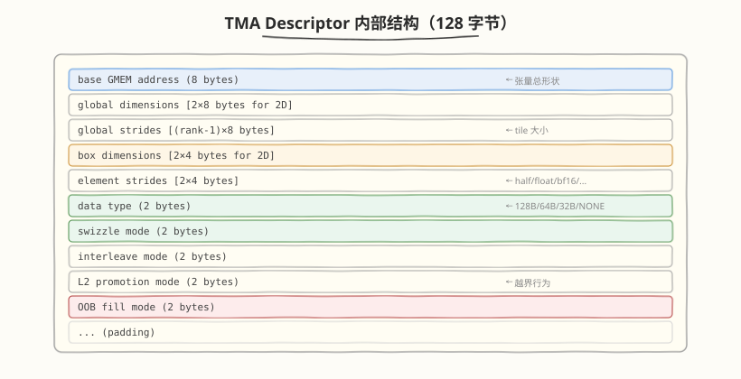
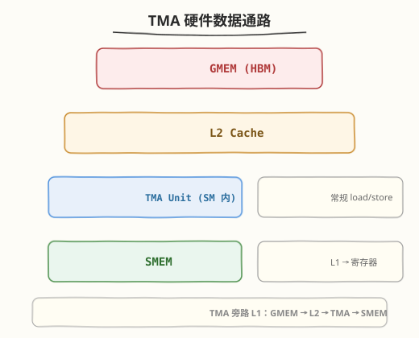

# TMA：Hopper 的张量内存加速器

## 🎯 目标

通过本教程，你将：

1. 理解传统 CUDA 访存的痛点——手动地址计算、向量化、边界 mask、寄存器浪费
2. 掌握 TMA 的核心机制——TMA descriptor 预计算 + 一条指令搬整个多维 tile
3. 能用 `cuTensorMapEncodeTiled` 创建 TMA descriptor，用 `cp.async.bulk.tensor` PTX 指令发起异步搬运
4. 理解 TMA 与 mbarrier 的配合——`expect_tx` 机制如何自动追踪搬运完成
5. 能回答"TMA vs cp.async 有什么区别"、"TMA 的边界处理怎么做"、"为什么 TMA 能省寄存器"

> 💡 **前置知识**：CUDA 内存模型（GMEM/SMEM/寄存器）、`cp.async` 异步拷贝、Shared Memory bank conflict、Swizzle 布局
> ⚠️ **环境要求**：TMA 需要 Hopper（sm_90a）及以上。Ampere 及以下只有 `cp.async`（warp 级异步拷贝），没有 TMA 单元。

---

## 为什么需要 TMA

### 传统访存的痛点

写一个 GEMM kernel 时，加载 A 矩阵的一个 `128×16` tile 到 SMEM，传统做法：

```cuda
// 传统方式：每个 thread 手动算地址 + 逐元素 load
int row = threadIdx.x / 16;   // tile 内行号
int col = threadIdx.x % 16;   // tile 内列号
int gm_row = block_m * 128 + row;
int gm_col = k_iter * 16 + col;

// 1. 手动算全局地址
float4* a_ptr = (float4*)(A + gm_row * K + gm_col);
// 2. 逐 thread 发起向量化 load（需要 128/4=32 个 thread 各 load 一个 float4）
float4 a_val = *a_ptr;
// 3. 手动写 SMEM（还要处理 bank conflict / swizzle）
((float4*)smem_a)[row * 16 / 4 + col / 4] = a_val;
// 4. 如果 tile 超出矩阵边界，还要手动 mask
if (gm_row < M && gm_col < K) { ... } else { ... }
```

痛点清单：

| 问题 | 说明 |
|------|------|
| **地址计算开销** | 每 thread 要算 row/col/全局偏移/SMEM 偏移，消耗 ALU 指令 |
| **寄存器浪费** | 地址指针占用大量寄存器（一个 GEMM kernel 的 A/B 指针可能占 8-16 个寄存器） |
| **向量化靠手工** | 程序员要手动用 `float4` / `int4` 做向量化，不同 dtype 要不同处理 |
| **边界处理繁琐** | 矩阵不是 tile 整数倍时，每个 thread 都要判边界，代码又长又易错 |
| **bank conflict 靠手工** | SMEM 写入的 stride 要避开 32 的倍数，需要手写 swizzle 或 padding |
| **load 是同步的** | `ld.global` 要等数据到达，thread 卡住；`cp.async` 虽异步但仍是 per-thread 发起 |

### TMA 的解法

TMA 把以上所有痛点**一次性解决**——用一条 PTX 指令搬整个多维 tile：

```cuda
// TMA 方式：一条指令搬 128×16 的 tile，硬件自动处理一切
cp.async.bulk.tensor.2d.shared::cluster.global.mbarrier::complete_tx::bytes \
    [smem_a], [tma_desc_a, offset_m, offset_k], [mbarrier];
// 发起后立即返回，硬件自动：算地址、向量化、边界 padding、写 SMEM（含 swizzle）
```

对比：

| 维度 | 传统 `ld.global` / `cp.async` | TMA |
|------|------|------|
| 粒度 | per-thread（每个 thread 搬一小块） | per-instruction（一条指令搬整个 tile） |
| 地址计算 | 每 thread 手算 | 预计算到 descriptor，kernel 内零地址算术 |
| 向量化 | 手写 `float4` | 硬件自动最优向量化 |
| 边界处理 | 手写 mask 分支 | 硬件自动 padding（越界读返回 0） |
| SMEM 布局 | 手写 swizzle / padding | descriptor 内置 swizzle 模式 |
| 寄存器占用 | 地址指针占 8-16 个寄存器 | 零地址寄存器 |
| 同步 | `ld.global` 同步 / `cp.async` + `cp.async.wait` | `mbarrier` 异步通知 |

> 💡 **一句话总结**：TMA 把"搬数据"这件事从 thread 级手工活变成了 tile 级声明式操作——你声明"搬哪个 tile"，硬件自动搬完，thread 在搬运期间自由做别的。

---

## 核心概念

### 1. TMA Descriptor（张量映射）

TMA 的核心是**预计算**——在 kernel launch 前把张量的形状、stride、tile 大小、swizzle 模式等信息编码成一个 128 字节的 descriptor，kernel 内只需传坐标偏移。

#### 创建 descriptor（CUDA Driver API）

```cuda
// create_tma_desc.cu —— 创建 TMA descriptor

#include <cuda.h>
#include <cuda_runtime.h>

// 1. 定义张量参数
CUtensorMap desc_a;
int rank = 2;                    // 2D 张量
void* gmem_ptr = A;              // GMEM 基地址
cuuint64_t globalDim[2] = {K, M}; // 全局维度（注意：维度顺序是反的，最快变维度在前）
cuuint64_t globalStride[1] = {K * sizeof(half)}; // stride（rank-1 个，第一个维度不需要）
cuuint32_t boxDim[2] = {16, 128}; // tile 大小（box_dim），同样反序
cuuint32_t elementStride[2] = {1, 1}; // 元素步长（通常都是 1）

// 2. 编码 descriptor
CUresult res = cuTensorMapEncodeTiled(
    &desc_a,
    CU_TENSOR_MAP_DATA_TYPE_FLOAT16,
    rank,
    gmem_ptr,
    globalDim,
    globalStride,
    boxDim,
    elementStride,
    CU_TENSOR_MAP_INTERLEAVE_NONE,        // 无交错
    CU_TENSOR_MAP_SWIZZLE_128B,           // 128B swizzle（消除 bank conflict）
    CU_TENSOR_MAP_L2_PROMOTION_NONE,      // 无 L2 提升
    CU_TENSOR_MAP_FLOAT_OOB_FILL_NONE     // 越界填 0
);

// 3. 将 descriptor 传给 kernel（通常放 const memory 或通过参数传入）
```

#### Descriptor 内部结构



> ⚠️ **维度顺序**：descriptor 中维度是**反序**的——最快变维度（列）在前，最慢变维度（行）在后。即 `globalDim = {K, M}` 对应一个 `M×K` 的矩阵。这是 TMA 编程中最容易搞错的点。

### 2. TMA Load / Store 指令

TMA 提供两类 PTX 指令：

#### Load（GMEM → SMEM，异步 + mbarrier 通知）

```cuda
// PTX：2D TMA load，搬完后通知 mbarrier
cp.async.bulk.tensor.2d.shared::cluster.global.mbarrier::complete_tx::bytes \
    [smem_dst],                // 目标 SMEM 地址
    [desc, coord_dim0, coord_dim1],  // descriptor + 坐标偏移
    [mbar];                     // 完成后通知的 mbarrier

// 支持的维度：1D / 2D / 3D / 4D / 5D
// cp.async.bulk.tensor.5d.shared::cluster.global.mbarrier::complete_tx::bytes \
//     [smem], [desc, c0, c1, c2, c3, c4], [mbar];
```

#### Store（SMEM → GMEM，异步但无需 mbarrier）

```cuda
// PTX：2D TMA store，从 SMEM 写回 GMEM
cp.async.bulk.tensor.2d.shared::cluster.global \
    [gmem_dst],                // 目标 GMEM 地址（通过 descriptor 计算）
    [desc, coord_dim0, coord_dim1],
    [smem_src];                // 源 SMEM 地址
```

#### Reduce（SMEM → GMEM，带原子操作）

```cuda
// PTX：2D TMA reduce（atomic add），适用于 scatter-add 等场景
cp.async.bulk.tensor.2d.shared::cluster.global.add \
    [gmem_dst], [desc, c0, c1], [smem_src];
```

### 3. mbarrier 的 `expect_tx` 机制

TMA 与 mbarrier 的配合是**自动化的**——mbarrier 能追踪 TMA 的搬运字节数：

```cuda
// 1. Producer：设置 mbarrier 预期接收的字节数
mbarrier.arrive.expect_tx.b64 mbar, expected_bytes;
// expected_bytes = tile_M * tile_K * sizeof(half) = 128 * 16 * 2 = 4096

// 2. 发起 TMA load（硬件在搬完后自动 signal mbarrier）
cp.async.bulk.tensor.2d.shared::cluster.global.mbarrier::complete_tx::bytes \
    [smem], [desc, m_offset, k_offset], [mbar];

// 3. Consumer：等 mbarrier（expected_bytes 全部到位后自动解锁）
mbarrier.wait.parity.b64 _, mbar, phase;
```

关键点：`expect_tx` 让 mbarrier 知道"要等多少字节到达"——TMA 搬完 `expected_bytes` 后，mbarrier 自动翻转 phase，consumer 的 `wait` 解除阻塞。**不需要手动计数**。

### 4. 边界处理（OOB Fill）

传统方式需要每个 thread 判断 `if (row < M && col < K)`，TMA 在 descriptor 中声明越界行为：

| OOB Fill 模式 | 行为 |
|---------------|------|
| `CU_TENSOR_MAP_FLOAT_OOB_FILL_NONE` | 越界读返回 0.0（对 GEMM 无影响，因为 0 乘任何数 = 0） |
| `CU_TENSOR_MAP_FLOAT_OOB_FILL_NAN_REQUEST_ZERO_FMA` | 越界读返回 NaN，但 FMA 时当作 0 处理 |

> 💡 **为什么 OOB 填 0 就够了**：GEMM 中 $C = A \times B$，如果 A 的越界位置填 0，则 $0 \times B_{ij} = 0$，对累加结果无影响——天然处理了矩阵不是 tile 整数倍的情况，无需任何分支。

### 5. Swizzle 模式

TMA 在 descriptor 中内置 swizzle，写入 SMEM 时自动按 swizzle 重排地址，消除 bank conflict：

| Swizzle 模式 | 含义 | 适用场景 |
|--------------|------|---------|
| `CU_TENSOR_MAP_SWIZZLE_NONE` | 无 swizzle | SMEM 访问无 bank conflict 时 |
| `CU_TENSOR_MAP_SWIZZLE_32B` | 32 字节粒度 swizzle | 小 tile |
| `CU_TENSOR_MAP_SWIZZLE_64B` | 64 字节粒度 swizzle | 中 tile |
| `CU_TENSOR_MAP_SWIZZLE_128B` | 128 字节粒度 swizzle | 大 tile（最常用） |

Swizzle 的原理是 XOR 重排 SMEM 地址的高位和低位，让相邻 thread 访问的不同 bank，避免 32-bank 冲突。传统方式需要程序员手写 swizzle 函数，TMA 在 descriptor 里声明即可——**硬件自动在搬运时应用 swizzle**。

---

## 最小可运行示例

以下示例展示 TMA 的完整使用流程：创建 descriptor → kernel 内 TMA load → mbarrier 等待：

```cuda
// tma_gemm_demo.cu —— TMA 最小可运行示例（伪代码 + 关键 API）

#include <cuda.h>
#include <cuda_runtime.h>
#include <cuda/barrier>
#include <cooperative_groups.h>
namespace cg = cooperative_groups;

#define BLOCK_M 128
#define BLOCK_K 16
#define NUM_STAGES 3

// ===== Host 端：创建 TMA descriptor =====
void create_tma_descriptors(CUtensorMap& desc_a, CUtensorMap& desc_b,
                            half* A, half* B, int M, int N, int K) {
    // A: M×K 矩阵，tile = 128×16
    cuuint64_t globalDimA[2] = {(cuuint64_t)K, (cuuint64_t)M};
    cuuint64_t globalStrideA[1] = {(cuuint64_t)(K * sizeof(half))};
    cuuint32_t boxDimA[2] = {BLOCK_K, BLOCK_M};
    cuTensorMapEncodeTiled(&desc_a, CU_TENSOR_MAP_DATA_TYPE_FLOAT16, 2,
        A, globalDimA, globalStrideA, boxDimA, {1, 1},
        CU_TENSOR_MAP_INTERLEAVE_NONE,
        CU_TENSOR_MAP_SWIZZLE_128B,
        CU_TENSOR_MAP_L2_PROMOTION_NONE,
        CU_TENSOR_MAP_FLOAT_OOB_FILL_NONE);

    // B: K×N 矩阵，tile = 16×256（省略，同理）
    // ...
}

// ===== Device 端：TMA load kernel =====
__global__ void tma_gemm_kernel(
    const __grid_constant__ CUtensorMap desc_a,
    const __grid_constant__ CUtensorMap desc_b,
    half* C, int M, int N, int K)
{
    // 1. 声明 SMEM buffer + mbarrier
    extern __shared__ __align__(128) char smem[];
    half* smem_a = (half*)smem;                         // A tile buffer
    half* smem_b = smem_a + NUM_STAGES * BLOCK_M * BLOCK_K;  // B tile buffer

    // mbarrier：每个 stage 一个 load barrier
    __shared__ cuda::barrier<cuda::thread_scope_block> bar[NUM_STAGES];
    if (threadIdx.x == 0) {
        for (int s = 0; s < NUM_STAGES; s++)
            init(&bar[s], blockDim.x);
    }
    __syncthreads();

    // 2. 只让 thread 0 发起 TMA（TMA 是 per-CTA 的，一个 thread 发起即可）
    int block_m = blockIdx.x * BLOCK_M;
    int block_n = blockIdx.y * BLOCK_N;

    for (int k_iter = 0; k_iter < K / BLOCK_K; k_iter++) {
        int slot = k_iter % NUM_STAGES;

        // 3. TMA load A tile：一条指令搬 128×16 的 half tile
        if (threadIdx.x == 0) {
            // 设置预期字节数 + arrive
            cuda::device::barrier_arrive_tx(bar[slot], 1,
                BLOCK_M * BLOCK_K * sizeof(half) +  // A tile 字节数
                BLOCK_K * BLOCK_N * sizeof(half));   // B tile 字节数

            // 发起 TMA load A（PTX 内联或用 CuTe wrapper）
            // cp.async.bulk.tensor.2d.shared::cluster.global
            //     .mbarrier::complete_tx::bytes
            //     [smem_a + slot*...], [desc_a, k_iter*BLOCK_K, block_m], [bar[slot]];

            // 发起 TMA load B
            // cp.async.bulk.tensor.2d.shared::cluster.global
            //     .mbarrier::complete_tx::bytes
            //     [smem_b + slot*...], [desc_b, block_n, k_iter*BLOCK_K], [bar[slot]];
        }

        // 4. 所有 thread 等 mbarrier（TMA 搬完后自动解锁）
        bar[slot].arrive_and_wait();

        // 5. 此时 smem_a[slot] / smem_b[slot] 数据就绪，可以做 WGMMA 或 mma
        // ... compute ...

        // 6. 下一轮迭代重用 slot（mbarrier 自动 phase 翻转）
    }
}

// ===== Launch =====
// create_tma_descriptors(desc_a, desc_b, A, B, M, N, K);
// tma_gemm_kernel<<<grid, block, smem_size>>>(desc_a, desc_b, C, M, N, K);
```

### 运行条件

```bash
# 需要 Hopper (sm_90a) 硬件
nvcc -arch=sm_90a -std=c++17 -rdc=true \
     tma_gemm_demo.cu -o tma_gemm

# 如果没有 Hopper 硬件，可参考 CUTLASS 官方 example：
# ${CUTLASS_ROOT}/examples/55_hopper_gemm_with_rasterization
```

> ⚠️ 上例为教学伪代码，省略了 B 矩阵 descriptor、WGMMA 计算、边界处理等。PTX 内联汇编部分用注释表示，实际可用 CuTe 的 `cute::SM90_TMA_LOAD` wrapper 替代手写 PTX。完整可编译实现参考 [CUTLASS 3.x SM90 GEMM](https://github.com/NVIDIA/cutlass/tree/main/examples/55_hopper_gemm_with_rasterization)。

---

## 深入原理

### TMA 的硬件数据通路

TMA 不是经过常规的 L1 cache，而是一条专用数据通路：



面试常问的"TMA 是否经过 L1"——**不经过 L1**。TMA 数据通路是 `GMEM → L2 → TMA Unit → SMEM`，旁路了 L1 cache。这带来两个好处：
1. 不污染 L1 cache（TMA 搬的 tile 数据不挤占 L1 空间）
2. 不与 L1 的常规 load 竞争端口

> 💡 **面试要点**：TMA 旁路 L1（不经过 L1 cache），数据通路是 GMEM → L2 → TMA → SMEM。这是牛客网面经的高频题（[小厂面经](https://www.nowcoder.com/feed_main/detail/166e576d5afa4a298cf9492ed51bed04)："Hopper TMA 的优点、调用方式、是否需要经过 L1"）。

### 多维坐标到线性地址的映射

TMA 内部的地址计算：给定 descriptor + 坐标 `(c0, c1, ...)`，硬件自动算出线性地址：

$$
\text{addr} = \text{base} + \sum_{i=0}^{\text{rank}-1} c_i \times \text{stride}_i
$$

但 descriptor 中存的是**预计算好的 stride**，且考虑了 swizzle——硬件只需做简单的乘加 + XOR 即可得到最终 SMEM 地址，比 thread 手算快得多。

### TMA 的吞吐特性

| 特性 | 说明 |
|------|------|
| 最大 tile 大小 | 单次最多搬 16384 字节（128KB / 8 stages） |
| 维度支持 | 1D / 2D / 3D / 4D / 5D |
| 数据类型 | FP16, BF16, FP32, FP64, INT8, INT16, INT32, INT64, FP8 |
| 带宽 | 接近 GMEM 峰值带宽（H100 上 ~3 TB/s） |
| 并发 | 每 SM 可同时发起多个 TMA（受 mbarrier 数量限制） |

### TMA Store 的特殊用法：Epilogue Fusion

TMA store 不只用于写回结果——CUTLASS 3.x 用 TMA store 实现 **epilogue fusion**，在写回 C 矩阵时同时做：

```cuda
// CUTLASS epilogue：TMA store + bias add + activation
// 传统：C = MMA(A, B); C += bias; C = relu(C); store(C);  （4 步）
// TMA epilogue：compute C+bias+relu in registers → TMA store  （2 步）
```

TMA store 把"从 SMEM 写回 GMEM"这件事也变成了一条指令，配合 CUTLASS 的 EVT（Epilogue Visitor Tree）可以实现复杂的 fusion 而不增加 kernel launch。

---

## TMA vs cp.async 深度对比

这是面试最核心的对比题：

| 维度 | `cp.async` (Ampere, sm_80) | TMA (Hopper, sm_90) |
|------|---------------------------|---------------------|
| **粒度** | per-thread（每个 thread 搬 4/8/16 字节） | per-tile（一条指令搬整个 tile，最大 128KB） |
| **发起者** | 每个 thread 各自发起 | 一个 thread 代表整个 CTA 发起 |
| **地址计算** | thread 内运行时计算 | host 端预计算到 descriptor |
| **向量化** | 手写 `cp.async.cg.shared.global [smem], [gmem], 16` | 硬件自动最优向量化 |
| **边界处理** | 手写 mask + 条件分支 | descriptor 声明 OOB fill，硬件自动 padding |
| **SMEM swizzle** | 手写 swizzle 函数 | descriptor 内置 swizzle 模式 |
| **同步方式** | `cp.async.wait_group` / `cp.async.wait_all` | `mbarrier` + `expect_tx` 自动追踪 |
| **寄存器占用** | 地址指针占寄存器 | 零地址寄存器 |
| **数据通路** | GMEM → L2 → L1 → SMEM | GMEM → L2 → TMA → SMEM（旁路 L1） |
| **维度** | 1D（要手动展开多维） | 原生 1D-5D |
| **store 方向** | 无异步 store（用 `st.global`） | `cp.async.bulk.tensor` store（异步） |
| **性能** | baseline | 1.5-3× faster（取决于 tile 大小） |

> 💡 **面试一句话**：`cp.async` 是 Ampere 的 per-thread 异步拷贝——thread 还是要算地址、做向量化、判边界；TMA 是 Hopper 的 per-tile 异步搬运——一条指令搬整个多维 tile，硬件自动处理地址、向量化、边界、swizzle，且旁路 L1 不污染 cache。

---

## TMA in CuTe / CUTLASS

实际工程中很少手写 PTX，通常通过 CuTe 或 CUTLASS 间接使用 TMA：

### CuTe 中的 TMA

```cuda
// CuTe 封装：用 CuTe 原语发起 TMA load
using TmaCopyA = cute::SM90_TMA_LOAD;
using TmaCopyB = cute::SM90_TMA_LOAD;

// 1. 创建 CuTe TMA descriptor（host 端）
auto tma_a = make_tma_copy(SM90_TMA_LOAD{}, gA_tensor, SmemLayoutA{});
// CuTe 自动从 gA_tensor 的 shape/stride 推导 TMA descriptor 参数

// 2. kernel 内发起 TMA load（一行代码）
copy(tma_a.with(mbarrier), gA_tensor(_, _, k_iter), smem_a(_, _, slot));
// 等价于：
//   1. mbarrier.expect_tx(tile_size_bytes)
//   2. cp.async.bulk.tensor.2d ... [smem_a], [desc_a, ...], [mbar]
//   3. mbarrier.arrive()
```

### CUTLASS 3.x 中的 TMA

CUTLASS 3.x 的 `CollectiveBuilder` 自动选择 TMA：

```cuda
// CUTLASS 3.x：CollectiveBuilder 自动用 TMA + WGMMA
using CollectiveMainloop = typename cutlass::gemm::collective::CollectiveBuilder<
    cutlass::arch::Sm90,                    // Hopper
    cutlass::arch::OpClassTensorOp,
    cutlass::arch::OpClassTensorOp,
    half, half, float,                      // A, B, C dtype
    cutlass::arch::OpClassTensorOp,
    Shape<128, 256, 16>,                    // tile shape
    Shape<1, 1, 1>,                         // cluster shape
    cutlass::gemm::collective::StageCountAuto,
    cutlass::gemm::collective::KernelScheduleAuto
>::CollectiveOp;
// CollectiveBuilder 自动：
//   1. 检测 sm_90 → 用 TMA load A/B
//   2. 检测 sm_90 → 用 WGMMA compute
//   3. 自动设置 mbarrier + pipeline stages
```

> 💡 **实践建议**：面试能说清 TMA 原理即可，工程中用 CuTe/CUTLASS 封装。只有需要极致定制（如自定义 epilogue fusion、非标准 tile 形状）才手写 PTX。

---

## 常见陷阱与最佳实践

### 陷阱 1：维度顺序搞反

**错误**：`globalDim = {M, K}`（行在前），导致 TMA 搬错数据。

```cuda
// ❌ 错误：维度顺序正序
cuuint64_t globalDim[2] = {M, K};  // 行在前

// ✅ 正确：维度顺序反序（最快变维度在前）
cuuint64_t globalDim[2] = {K, M};  // 列在前，行在后
```

TMA descriptor 的维度顺序是**最快变维度在前**（column-major 顺序），即 `globalDim = {K, M}` 对应一个 `M×K` 的 row-major 矩阵。搞反了 TMA 会按错误的 stride 计算地址，搬出乱序数据。

### 陷阱 2：忘记 `expect_tx` 或字节数算错

**错误**：只 arrive 不 expect_tx，mbarrier 永远等不到 TMA 完成信号。

```cuda
// ❌ 错误：只 arrive，TMA 完成后 mbarrier 不会解锁
bar[slot].arrive();
cp.async.bulk.tensor.2d ... [smem], [desc, ...], [bar];  // mbarrier 收不到信号
bar[slot].wait();  // 死锁

// ✅ 正确：arrive + expect_tx 告知预期字节数
cuda::device::barrier_arrive_tx(bar[slot], 1, tile_bytes);
cp.async.bulk.tensor.2d ... [smem], [desc, ...], [bar];  // 搬完字节数后自动解锁
bar[slot].wait();  // 正确解锁
```

### 陷阱 3：SMEM 地址未对齐

**错误**：SMEM buffer 地址没有 128 字节对齐，TMA 指令报错或性能下降。

```cuda
// ❌ 错误：默认对齐（通常 16 字节）
__shared__ half smem_a[NUM_STAGES * BLOCK_M * BLOCK_K];

// ✅ 正确：显式 128 字节对齐
__shared__ __align__(128) half smem_a[NUM_STAGES * BLOCK_M * BLOCK_K];
```

### 陷阱 4：多个 TMA 共用一个 mbarrier 时字节数累加

**正确做法**：多个 TMA load（如 A 和 B）共用一个 mbarrier 时，`expect_tx` 的字节数是**两者之和**：

```cuda
// A tile: 128×16×2 = 4096 bytes
// B tile: 16×256×2 = 8192 bytes
// 合计: 12288 bytes
cuda::device::barrier_arrive_tx(bar[slot], 1,
    BLOCK_M * BLOCK_K * sizeof(half) +   // A
    BLOCK_K * BLOCK_N * sizeof(half));    // B
// 然后 A 和 B 两条 TMA 指令都指向同一个 mbarrier
```

### 陷阱 5：TMA descriptor 放错内存

**错误**：descriptor 放在 GMEM 普通区域，kernel 读取时延迟高。

```cuda
// ❌ descriptor 在普通 GMEM，每次读取有延迟
CUtensorMap* desc = (CUtensorMap*)malloc(sizeof(CUtensorMap));

// ✅ 用 __grid_constant__ 限定符，编译器放 const memory
__global__ void kernel(const __grid_constant__ CUtensorMap desc_a, ...) {
    // desc_a 通过 const cache 高速读取
}
```

---

## 面试要点

**Q1：TMA 是什么？解决了什么问题？**

TMA（Tensor Memory Accelerator）是 Hopper 架构引入的硬件单元，用于在 GMEM 和 SMEM 之间异步搬运多维张量块。它解决了传统访存的三个痛点：① thread 级地址计算开销大、寄存器浪费 ② 手工向量化和边界处理繁琐 ③ 同步 load 导致访存/计算无法重叠。TMA 用一条指令搬整个 tile，硬件自动算地址、向量化、边界 padding、SMEM swizzle，且异步返回不阻塞 thread。

**Q2：TMA 是否经过 L1 cache？**

不经过 L1。TMA 的数据通路是 `GMEM → L2 → TMA Unit → SMEM`，旁路了 L1 cache。好处是不污染 L1（TMA 搬的 tile 不挤占 L1 空间），不与常规 load 竞争 L1 端口。这也是牛客面经的高频题。

**Q3：TMA 和 cp.async 有什么区别？**

`cp.async` 是 Ampere 的 per-thread 异步拷贝，每个 thread 搬 4-16 字节，仍需手动算地址、做向量化、判边界。TMA 是 Hopper 的 per-tile 异步搬运，一条指令搬整个多维 tile（最大 128KB），硬件自动处理地址计算、向量化、边界 padding、SMEM swizzle，且数据通路旁路 L1。TMA 的吞吐通常比 cp.async 快 1.5-3 倍。

**Q4：TMA descriptor 是什么？为什么要预计算？**

TMA descriptor 是一个 128 字节的结构，编码了张量的基地址、形状、stride、tile 大小、数据类型、swizzle 模式、越界填充策略。在 kernel launch 前由 host 端 `cuTensorMapEncodeTiled` 创建。预计算的意义是：把地址计算从 kernel 内移到 launch 前——kernel 内只需传坐标偏移 `(m, k)`，硬件用 descriptor 中的 stride 直接算出线性地址，省去了 thread 内的地址算术和寄存器占用。

**Q5：TMA 的边界处理怎么做？为什么 OOB 填 0 就够了？**

TMA 在 descriptor 中声明 OOB Fill 模式，越界读取自动返回 0（`CU_TENSOR_MAP_FLOAT_OOB_FILL_NONE`）。对 GEMM 来说，越界位置填 0 不影响结果——因为 $0 \times B_{ij} = 0$，对累加无贡献。这天然处理了矩阵不是 tile 整数倍的情况，无需任何运行时分支判断。传统方式需要每个 thread 写 `if (row < M && col < K)` 分支，既慢又易错。

**Q6：TMA 的 mbarrier `expect_tx` 是怎么工作的？**

TMA load 指令关联一个 mbarrier，搬运完成后硬件自动通知该 mbarrier。`expect_tx` 让 mbarrier 知道预期接收的字节数——当 TMA 搬完这么多字节后，mbarrier 自动翻转 phase，consumer 的 `wait` 解除阻塞。多个 TMA load 共用一个 mbarrier 时，`expect_tx` 的字节数是所有 TMA 的总和。这比 `cp.async.wait_group` 的手动计数更精确、更高效。

**Q7：TMA 支持哪些维度和数据类型？**

维度：1D / 2D / 3D / 4D / 5D（对应 PTX 指令 `cp.async.bulk.tensor.{1d,2d,3d,4d,5d}`）。数据类型：FP16, BF16, FP32, FP64, INT8, INT16, INT32, INT64, FP8（E4M3/E5M2）。单次最大搬运 16384 字节（128KB / 8 stages）。Swizzle 模式：NONE / 32B / 64B / 128B 四种粒度。

**Q8：Triton 在 Hopper 上用 TMA 了吗？**

Triton 3.0+ 在 Hopper 上部分使用 TMA——编译器会自动将 `tl.load` 生成 TMA 指令（当 tile 形状和 dtype 满足 TMA 要求时）。但 Triton 的 TMA 支持仍有局限：① 自定义 swizzle 模式不如手写灵活 ② 与 WGMMA 的配合不如 CUTLASS 精细 ③ 某些复杂边界场景可能回退到 `cp.async`。这正是"Triton 滞后 1-2 架构周期"的典型体现。

---

## 推荐资源

- ⭐ [NVIDIA Hopper Whitepaper](https://resources.nvidia.com/en-us-tensor-core) — TMA 架构设计说明
- ⭐ [PTX ISA: cp.async.bulk.tensor](https://docs.nvidia.com/cuda/parallel-thread-execution/) — TMA 指令完整参考
- ⭐ [CUDA Driver API: cuTensorMapEncodeTiled](https://docs.nvidia.com/cuda/cuda-driver-api/) — descriptor 创建 API
- 📌 [CUTLASS 3.x SM90 GEMM Example](https://github.com/NVIDIA/cutlass/tree/main/examples/55_hopper_gemm_with_rasterization) — 官方可编译 TMA + WGMMA example
- 📌 [CuTe TMA Tutorial](https://github.com/NVIDIA/cutlass/tree/main/examples/cute) — CuTe 原语级 TMA 用法
- 📎 [NVIDIA Blog: Hopper Memory Architecture](https://developer.nvidia.com/blog/) — TMA 数据通路深度分析
- 📎 [牛客面经：Hopper TMA 的优点、调用方式、是否经过 L1](https://www.nowcoder.com/feed_main/detail/166e576d5afa4a298cf9492ed51bed04) — 面试真题

---

> 🔗 **相关内容**：[Warp Specialization 深入教程](warp_specialization.md)（TMA 的主要使用场景） | [CuTe 专题 Day 6：TMA 与 Warp Specialization](../cute/day6.md) | [CUTLASS 专题 Day 3：Collective Mainloop](../cutlass/README.md)
