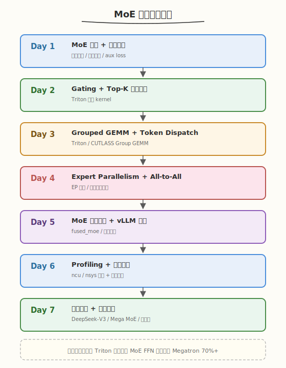
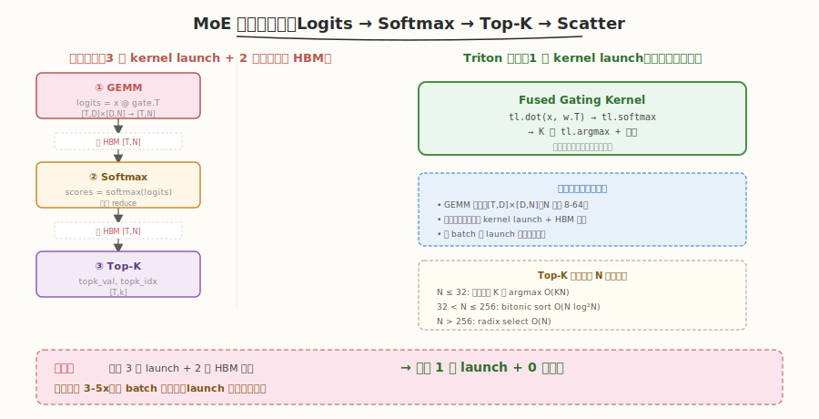
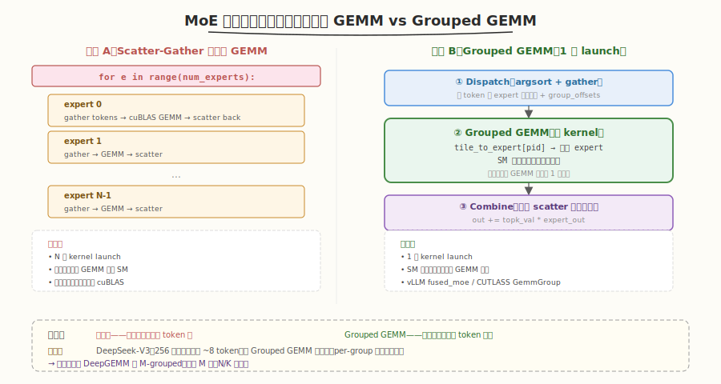

# MoE 一周学习计划

> **适用对象**：已完成 [CUTLASS 专题](../cutlass/README.md) Day 3（3.x GEMM）与 Day 7（Group GEMM），掌握 GEMM Tiling、Tensor Core、CollectiveBuilder；建议读过 [DeepSeek-V2 论文精读](../../paper/deepseek_v2/README.md) 对 DeepSeekMoE 有基本认知
> **本周目标**：理解 MoE（Mixture-of-Experts）的算法原理与系统瓶颈，能用 Triton/CUTLASS 写出 Gating、Top-K、Grouped GEMM 等核心算子，掌握 Expert Parallelism 的 all-to-all 通信模式，最终用 vLLM/Triton 组装一个可运行的 MoE 层并完成性能调优
> **时间投入**：工作日每天 2.5h（早间 1.5h + 晚间 1h），周末每天 5h，周计 22.5h
> **周日里程碑**：用 Triton 实现一个 Top-2 路由的 MoE FFN 层（含 Gating + Grouped GEMM + Combine），性能达到 Megatron-LM 参考实现 70%+，产出 ncu 性能报告

---

## 本周总览

| 维度 | 内容 |
|------|------|
| **整体目标** | 掌握 MoE 算法（稀疏路由、负载均衡）、核心算子（Gating/Top-K/Grouped GEMM/Scatter-Gather）、EP 通信（all-to-all）、推理优化（动态路由、专家预取、共享专家） |
| **核心产出** | ① Triton Gating + Top-K 融合 kernel ② CUTLASS/Triton Grouped GEMM ③ All-to-all token dispatch demo ④ Triton MoE FFN 层 ⑤ ncu 性能报告 ⑥ 源码精读笔记（vLLM `fused_moe`、Megatron `MoE`） |
| **验收标准** | ① 能画出 MoE 前向数据流（输入 → 门控 → 分派 → 专家 → combine） ② Gating+Top-K kernel 在 4096×8 专家上达到纯 PyTorch 5x+ ③ Grouped GEMM 达到逐专家调用 cuBLAS 90%+ ④ 能解释 EP 的 all-to-all token dispatch 时序 ⑤ 能用 ncu 定位 MoE 层的通信/计算占比 |
| **面试准备** | 积累 10-12 道 MoE 面试题，覆盖路由算法、负载均衡、Grouped GEMM、EP 通信、DeepSeek-MoE 细粒度专家、推理优化 |

### 本专题与 [CUTLASS 专题](../cutlass/README.md) 的边界

| 维度 | CUTLASS 专题（Day 7 Group GEMM） | 本 MoE 专题 |
|------|----------------------------------|-------------|
| **视角** | 算子层——Group GEMM 作为一种 GEMM 变体 | 系统层——Group GEMM 只是 MoE 的一环 |
| **范围** | 固定/变长 problem size 的批量 GEMM | 完整 MoE 层：Gating → Dispatch → Grouped GEMM → Combine → 负载均衡 |
| **通信** | 不涉及 | Expert Parallelism 的 all-to-all 是核心 |
| **算法** | 不涉及 | Top-K 路由、auxiliary loss、容量因子、共享专家 |
| **产出** | 调 `cutlass::gemm::device::GemmGroup` | 用 Triton 拼出完整 MoE FFN 层 |

> 💡 **一句话总结**：CUTLASS 专题教你"算" MoE 里的 Grouped GEMM，本专题教你"组装"整个 MoE 层——前者是后者的子问题。掌握本专题后，再读 vLLM 的 `fused_moe.py` 或 Megatron 的 `transformer/moe.py` 会如读散文。

### 本周知识图谱



### 前置准备清单

#### 硬件/软件验证
- [ ] GPU Compute Capability >= 8.0（Ampere 及以上，需 Tensor Core）
- [ ] CUDA Toolkit >= 12.0，PyTorch >= 2.1
- [ ] Triton >= 2.1（`python3 -c "import triton; print(triton.__version__)"`）
- [ ] CUTLASS >= 3.5（Day 3 的 Grouped GEMM 用到）
- [ ] NCCL >= 2.18（Day 4 的 all-to-all 用到），单机多卡即可
- [ ] Nsight Compute / Nsight Systems 可用

#### 验证命令
```bash
# 验证 GPU 与多卡（Day 4 all-to-all 至少 2 卡）
nvidia-smi --query-gpu=compute_cap,name --format=csv
nvidia-smi --query-gpu=index --format=csv | wc -l   # >= 2

# 验证 Triton
python3 -c "import triton, torch; print('triton', triton.__version__, 'torch', torch.__version__)"

# 验证 NCCL all-to-all 可用
python3 -c "import torch.distributed as dist; print('nccl', dist.is_nccl_available())"
```

#### 必读资源（本周会反复用到）
- ⭐ [DeepSeek-V2 论文精读](../../paper/deepseek_v2/README.md) — DeepSeekMoE 细粒度专家 + 共享专家 + 设备受限路由
- ⭐ [Outrageously Large Neural Networks: The Sparsely-Gated Mixture-of-Experts Layer](https://arxiv.org/abs/1701.06538) — Shazeer 2017，MoE 门控奠基
- ⭐ [GShard](https://arxiv.org/abs/2006.16668) — 专家并行 + top-2 路由 + 容量因子
- 📌 [Switch Transformer](https://arxiv.org/abs/2101.03961) — top-1 路由 + 负载均衡损失
- 📌 [Mixtral 8x7B](https://arxiv.org/abs/2401.04088) — 开源 MoE 标杆
- 📌 [vLLM `fused_moe.py`](https://github.com/vllm-project/vllm) — 工程级 MoE 推理实现

---

## Day 1（周一）：MoE 总览与算法原理

> **今日目标**：理解 MoE 的定位与设计动机，掌握稀疏门控的数学形式，能区分 Token-Choice / Expert-Choice / 共享专家三类路由范式
> **面试考察度**：⭐⭐⭐⭐⭐ 核心考点，"MoE 是什么、为什么稀疏激活能省算力"必问

---

### 学习任务 1：MoE 是什么——从 Dense FFN 到稀疏专家（45 分钟）

#### 阅读内容
- **论文**：[Sparsely-Gated MoE Layer](https://arxiv.org/abs/1701.06538) §1-3（Shazeer 2017）
- **论文**：[GShard](https://arxiv.org/abs/2006.16668) §2-3（Lepikhin 2021）
- **复习**：[DeepSeek-V2 论文精读](../../paper/deepseek_v2/README.md) §5.3 DeepSeekMoE

#### 核心要点

MoE（Mixture-of-Experts）把 Transformer 的 FFN 层替换为"门控 + 多专家"结构：每个 token 只激活少数专家，**总参数量与每 token 计算量解耦**。

$$y(x) = \sum_{i=1}^{N} g_i(x) \cdot E_i(x), \qquad g(x) = \mathrm{TopK}(\mathrm{softmax}(W_g \, x))$$

| 维度 | Dense FFN | 稠密 MoE | 稀疏 MoE（Top-K） |
|------|-----------|----------|-------------------|
| 每 token 激活参数 | 全部 | 全部 | $K/N$（如 Mixtral 2/8 = 25%） |
| 总参数量 | 固定 | 固定 | 可扩到百亿/千亿 |
| 计算量 | $\propto$ 参数量 | $\propto$ 参数量 | $\propto$ 激活参数（省算力） |
| 显存 | $\propto$ 参数量 | $\propto$ 参数量 | $\propto$ 总参数（显存仍贵） |
| 代表 | GPT-3 175B | — | Mixtral 8x7B、DeepSeek-V3 671B/37B |

> 💡 **一句话总结**：MoE 的核心交易是"用显存换算力"——把参数量扩到千亿但每 token 只算几十亿，训练/推理 FLOPs 大幅下降，代价是显存与通信。这也是为什么 MoE 几乎总是和专家并行、KV Cache 优化、量化绑定出现。

#### 三种路由范式

| 范式 | 决策者 | 代表 | 特点 |
|------|--------|------|------|
| **Token-Choice** | token 选 expert（top-k） | GShard / Switch / Mixtral / DeepSeek | 主流，可能负载不均 |
| **Expert-Choice** | expert 选 token（top-k 反向） | EC-MoE（Zhou 2022） | 负载天然均衡，但破坏因果性 |
| **Shared Expert** | 部分 expert 必过 + 其余 top-k | DeepSeekMoE | 缓解专家冗余，装通用知识 |

### 学习任务 2：负载均衡——为什么 MoE 训练容易崩（45 分钟）

#### 路由崩塌现象

不加约束时，门控会迅速收敛到"少数专家垄断所有 token"——其他专家收不到梯度，退化为死专家。

#### Auxiliary Loss（GShard / Switch）

$$L_{\text{aux}} = N \cdot \sum_{i=1}^{N} f_i \cdot P_i$$

- $f_i = \frac{1}{T}\sum_{t=1}^{T} \mathbb{1}[\text{token } t \text{ 选了专家 } i]$：每个专家收到的 token 比例（不可导的硬统计）
- $P_i = \frac{1}{T}\sum_{t=1}^{T} \text{softmax}(W_g x_t)_i$：每个专家的平均门控概率（可导）
- 乘积形式让不可导的 $f_i$ 通过可导的 $P_i$ 反传梯度

> ⚠️ **面试高频坑**：$f_i$ 和 $P_i$ 必须分开计算——$f_i$ 用 `argmax` 硬统计（stop gradient），$P_i$ 用 softmax 软概率。直接用 $\sum P_i^2$ 会让所有 token 挤向概率最高的专家，反而加剧不均衡。

#### 容量因子（Capacity Factor）

每个专家有一个容量上限 $C = \frac{T}{N} \times \text{cap\_factor}$，超出的 token 被丢弃。GShard 用 cap=1.25，Switch 用 cap=1.0-1.5。

| cap_factor | 训练效率 | 负载均衡 | 推理 |
|------------|----------|----------|------|
| < 1.0 | 高（省算力） | 差（丢 token 多） | 一般不用 |
| 1.0-1.5 | 中 | 训练常用 | 推理不丢 |
| > 2.0 | 低 | 几乎不丢 | 不推荐 |

### 学习任务 3：环境搭建与参考实现（30 分钟）

```bash
# 克隆 vLLM（本周 Day 5 精读其 fused_moe）
git clone https://github.com/vllm-project/vllm.git
# 关键文件：vllm/model_executor/layers/fused_moe/fused_moe.py

# 克隆 Megatron-LM（本周 Day 4 精读其 MoE 通信）
git clone https://github.com/NVIDIA/Megatron-LM.git
# 关键文件：megatron/core/transformer/moe/moe_layer.py
```

#### PyTorch 朴素 MoE 参考实现

```python
# naive_moe.py —— 朴素 MoE FFN（仅前向，无负载均衡）
import torch
import torch.nn as nn
import torch.nn.functional as F

class NaiveMoE(nn.Module):
    def __init__(self, d_model, d_ff, num_experts=8, top_k=2):
        super().__init__()
        self.gate = nn.Linear(d_model, num_experts, bias=False)
        self.experts_w1 = nn.Parameter(torch.randn(num_experts, d_ff, d_model))
        self.experts_w2 = nn.Parameter(torch.randn(num_experts, d_model, d_ff))
        self.top_k = top_k

    def forward(self, x):                       # x: [T, d_model]
        logits = self.gate(x)                   # [T, num_experts]
        scores = F.softmax(logits, dim=-1)
        topk_val, topk_idx = scores.topk(self.top_k, dim=-1)   # [T, k]
        out = torch.zeros_like(x)
        for t in range(x.shape[0]):
            for k in range(self.top_k):
                e = topk_idx[t, k].item()
                h = F.gelu(x[t] @ self.experts_w1[e].T)
                out[t] += topk_val[t, k] * (h @ self.experts_w2[e].T)
        return out
```

> ⚠️ **注意**：上面的双重 for 循环只是教学用，实际不可用（无并行、无向量化）。本周 Day 2-3 会逐步把它改成 Triton kernel。

### 今日检查清单

- [ ] 能写出 MoE 前向公式 $y = \sum g_i(x) E_i(x)$ 并解释 Top-K 门控
- [ ] 能说出 Dense FFN / 稠密 MoE / 稀疏 MoE 三者的计算量与显存差异
- [ ] 能解释 auxiliary loss 为什么用 $f_i \cdot P_i$ 乘积形式（不可导 + 可导）
- [ ] 能说出容量因子的作用与典型取值
- [ ] 跑通 `naive_moe.py`，确认前向输出 shape 正确

---

## Day 2（周二）：Gating 与 Top-K 路由算子

> **今日目标**：用 Triton 实现融合的 Gating + Softmax + Top-K kernel，理解 Top-K 选择的高效实现
> **面试考察度**：⭐⭐⭐⭐ 实践级，"MoE 的门控 kernel 怎么写"是高频题

---

### 学习任务 1：Gating kernel 的数据流（30 分钟）



#### 朴素实现的低效

```python
# 朴素三步：3 次 kernel launch，2 次中间 tensor 落盘 HBM
logits = x @ gate_weight.T        # [T, N]    —— GEMM
scores = softmax(logits, dim=-1)  # [T, N]    —— reduction
topk_val, topk_idx = scores.topk(k, dim=-1)  # [T, k]  —— 逐行 topk
```

每步都要把 `[T, N]` 写回 HBM 再读出。当 `T=4096, N=8` 时，中间 tensor 虽小，但 kernel launch 开销与 HBM 往返在小 batch 下占比极高。

#### 融合策略

| 融合层级 | kernel 数 | 适用场景 |
|----------|-----------|----------|
| 三步分离 | 3 | 调试用 |
| GEMM + Softmax 融合 | 2 | Triton `tl.dot` + `tl.softmax` |
| 全融合（GEMM+Softmax+TopK） | 1 | 极致优化，Top-K 在寄存器内做 |

> 💡 **一句话总结**：MoE 门控的 GEMM 很小（`[T, d_model] × [d_model, N]`，N 通常 8-64），瓶颈不是算力而是 kernel launch + HBM 往返——所以融合的收益远大于优化 GEMM 本身。

### 学习任务 2：Triton 实现 Gating + Softmax 融合（60 分钟）

```python
# triton_gating.py —— Gating + Softmax 融合 kernel
# 运行: python3 triton_gating.py
import triton
import triton.language as tl
import torch

@triton.jit
def gating_softmax_kernel(
    x_ptr, w_ptr, out_ptr,
    T, D: tl.constexpr, N: tl.constexpr,
    BLOCK_T: tl.constexpr,
):
    pid = tl.program_id(0)                      # 沿 T 维分块
    offs_t = pid * BLOCK_T + tl.arange(0, BLOCK_T)
    offs_d = tl.arange(0, D)
    offs_n = tl.arange(0, N)

    mask_t = offs_t < T
    # 加载 x: [BLOCK_T, D]
    x = tl.load(x_ptr + offs_t[:, None] * D + offs_d[None, :], mask=mask_t[:, None], other=0.0)
    # 加载 w: [N, D]（完整加载到寄存器，N 通常很小）
    w = tl.load(w_ptr + offs_n[:, None] * D + offs_d[None, :])
    # GEMM: [BLOCK_T, D] @ [D, N] -> [BLOCK_T, N]
    logits = tl.dot(x, tl.trans(w))
    # 行内 softmax（数值稳定）
    m = tl.max(logits, axis=1, keep_dims=True)
    e = tl.exp(logits - m)
    s = e / tl.sum(e, axis=1, keep_dims=True)
    # 写回 [BLOCK_T, N]
    tl.store(out_ptr + offs_t[:, None] * N + offs_n[None, :],
             s, mask=mask_t[:, None])

def triton_gating(x, w):
    T, D = x.shape
    N = w.shape[0]
    out = torch.empty(T, N, device=x.device, dtype=torch.float32)
    BLOCK_T = 64
    gating_softmax_kernel[(triton.cdiv(T, BLOCK_T),)](
        x, w, out, T, D=D, N=N, BLOCK_T=BLOCK_T)
    return out
```

### 学习任务 3：Top-K 选择的高效实现（45 分钟）

Top-K 在 GPU 上的难点：`[T, N]` 每行选 K 个最大值。当 N 较小（8-64）时，**寄存器内排序**比 heap 快。

```python
# triton_topk.py —— 小 N 的寄存器内 Top-K
@triton.jit
def topk_kernel(scores_ptr, val_ptr, idx_ptr,
                T, N: tl.constexpr, K: tl.constexpr,
                BLOCK_T: tl.constexpr):
    pid = tl.program_id(0)
    offs_t = pid * BLOCK_T + tl.arange(0, BLOCK_T)
    offs_n = tl.arange(0, N)
    mask_t = offs_t < T

    scores = tl.load(scores_ptr + offs_t[:, None] * N + offs_n[None, :],
                     mask=mask_t[:, None], other=-float('inf'))
    # 当 N 小（<=64）时，逐轮选最大值：K 轮，每轮 argmax + 屏蔽
    for k in tl.static_range(K):
        m = tl.max(scores, axis=1)                          # [BLOCK_T]
        idx = tl.argmax(scores, axis=1)                     # [BLOCK_T]
        # 写回第 k 个结果
        tl.store(val_ptr + offs_t * K + k, m, mask=mask_t)
        tl.store(idx_ptr + offs_t * K + k, idx, mask=mask_t)
        # 屏蔽已选位置
        scores = tl.where(offs_n[None, :] == idx[:, None], -float('inf'), scores)
```

| N 大小 | 推荐 Top-K 策略 | 复杂度 |
|--------|-----------------|--------|
| N <= 32 | 寄存器内 K 轮 argmax | $O(KN)$ |
| 32 < N <= 256 | bitonic sort 后取前 K | $O(N \log^2 N)$ |
| N > 256 | radix select / libcudart `topK` | $O(N)$ |

> ⚠️ **注意**：DeepSeek-V3 的 N=256（细粒度专家），Top-K=8，用寄存器内 K 轮 argmax 仍可行（8×256=2048 次比较/行）。但 Mixtral 的 N=8 K=2 用此法极快。

### 学习任务 4：动手实践（30 分钟）

在 `kernels/` 下创建 `triton_gating.py`（合并上面两段），并写一个 benchmark：

```python
# benchmark：对比 朴素 PyTorch vs Triton 融合
T, D, N, K = 4096, 4096, 8, 2
x = torch.randn(T, D, device='cuda')
w = torch.randn(N, D, device='cuda')

# 朴素：3 次 launch
def naive(x, w):
    logits = x @ w.T
    scores = logits.softmax(dim=-1)
    return scores.topk(K, dim=-1)

# Triton 融合 + 寄存器 topk
def fused(x, w):
    scores = triton_gating(x, w)
    return triton_topk(scores, K)

# 用 torch.utils.benchmark.Timer 对比
```

### 今日检查清单

- [ ] 能解释为什么 Gating kernel 的瓶颈是 kernel launch 而非 GEMM
- [ ] `triton_gating.py` 编译运行通过，结果与 PyTorch 一致
- [ ] 能说出 N<=32 / N>256 时 Top-K 的不同策略
- [ ] benchmark 显示 Triton 融合版比朴素 PyTorch 快 3x+
- [ ] 记录了融合前后 kernel launch 数量（用 `nsys stats`）

---

## Day 3（周三）：Grouped GEMM 与 Token Dispatch

> **今日目标**：实现 MoE 的核心计算——把分派后的 token 喂给各专家做 FFN，掌握 Grouped GEMM 与 Scatter-Gather 两种实现路径
> **面试考察度**：⭐⭐⭐⭐⭐ 核心考点，"MoE 的专家计算怎么高效做"必问

---

### 学习任务 1：两种实现路径对比（30 分钟）



#### 路径 A：Scatter-Gather + 逐专家 GEMM

```python
# 把 token 按 expert 分组，每个专家单独 GEMM
for e in range(num_experts):
    mask = (topk_idx == e).any(dim=-1)         # 哪些 token 去了专家 e
    tokens_e = x[mask]                          # gather
    h = F.gelu(tokens_e @ w1[e].T)              # 专家 e 的 FFN
    out[mask] += (h @ w2[e].T) * scores_e       # scatter 回去
```

- 优点：实现简单，每个 GEMM 是标准 cuBLAS 调用
- 缺点：`num_experts` 次 kernel launch；专家负载不均时小 GEMM 浪费 SM

#### 路径 B：Grouped GEMM（一次 launch）

```python
# 把所有专家的 GEMM 打包成一次调用
# 输入：[total_tokens, d_model]，total_tokens = T * K（每 token 去 K 个专家）
# 输出：[total_tokens, d_model]
out = grouped_gemm(x_dispatched, w1_all, num_groups=num_experts, group_sizes=...)
```

- 优点：1 次 kernel launch，SM 均衡分配
- 缺点：需要变长 group 支持（各专家 token 数不同）

| 维度 | Scatter-Gather | Grouped GEMM |
|------|----------------|--------------|
| kernel launch | $O(N)$ 次 | 1 次 |
| 负载均衡 | 差（小专家浪费 SM） | 好（SM 跨专家调度） |
| 实现复杂度 | 低 | 中-高 |
| 代表实现 | 早期 Megatron | vLLM `fused_moe`、CUTLASS `GemmGroup` |

> 💡 **一句话总结**：MoE 专家计算的工程核心就是把"逐专家 GEMM"换成"Grouped GEMM"——这是 vLLM 推理比朴素实现快数倍的关键。

### 学习任务 2：CUTLASS Grouped GEMM 回顾（30 分钟）

复习 [CUTLASS 专题 Day 7](../cutlass/day7.md) 的 Group GEMM：

```cpp
// CUTLASS 3.x 的 Group GEMM：一次 launch 处理多个不同尺寸的 GEMM
using GroupGemm = cutlass::gemm::device::GemmGroup<
    /* MmaType, AccType, Layout... */
>;

// host 端传入 problem_size 数组（每个专家的 token 数不同）
std::vector<cutlass::gemm::GemmCoord> problem_sizes = {
    {532, 4096, 4096},   // 专家 0 收到 532 个 token
    {498, 4096, 4096},   // 专家 1 收到 498 个 token
    {511, 4096, 4096},   // 专家 2 收到 511 个 token
    // ...
};
```

> ⚠️ **注意**：CUTLASS Group GEMM 适合"专家数少、每专家 token 多"的场景。DeepSeek-V3 的 256 专家 + 每 expert 平均 8 token 的情况下，CUTLASS Group GEMM 的 per-group 开销会摊薄收益——此时更适合用 Triton 的 `m_grouped` GEMM 或变长 tile 调度。

### 学习任务 3：Triton 实现 Grouped GEMM（60 分钟）

Triton 的 `tl.dot` + `pid` 重映射可以实现 Grouped GEMM。核心思路：把所有 expert 的 GEMM 拼成一个大 GEMM，用 group offset 数组定位每个 expert 的起点。

```python
# triton_grouped_gemm.py —— Triton 变长 Grouped GEMM
import triton
import triton.language as tl

@triton.jit
def grouped_gemm_kernel(
    x_ptr, w_ptr, out_ptr,
    group_offsets_ptr,        # [num_experts + 1]，前缀和，专家 i 的 token 范围
    TOTAL_TILES: tl.constexpr,
    D: tl.constexpr, K_DIM: tl.constexpr,
    BLOCK_M: tl.constexpr, BLOCK_K: tl.constexpr,
):
    pid = tl.program_id(0)
    # 通过 pid 反查属于哪个 expert + expert 内的 tile id
    # （实际实现用 binary search 或预计算的 tile_to_expert 表）
    expert_id, tile_m = lookup_tile(group_offsets_ptr, pid, ...)

    # 加载该 expert 的权重
    w = tl.load(w_ptr + expert_id * K_DIM * D + ...)
    # 标准 GEMM tile
    acc = tl.zeros((BLOCK_M, D), dtype=tl.float32)
    for k in range(0, K_DIM, BLOCK_K):
        a = tl.load(...)
        b = tl.load(...)
        acc += tl.dot(a, b)
    tl.store(out_ptr + ..., acc)
```

完整的 Grouped GEMM 实现可参考 vLLM 的 [`fused_moe.py`](https://github.com/vllm-project/vllm) 中的 `fused_experts` 函数——它把 dispatch + GEMM + combine 融合成一组 Triton kernel，是本周 Day 5 的精读目标。

### 学习任务 4：Token Dispatch 的索引计算（30 分钟）

Grouped GEMM 要求输入是"按 expert 连续排列"的 token，因此需要一个 dispatch 步骤：

```python
# 给定 topk_idx: [T, K]，构造 dispatch 后的 token 顺序
# 例：T=4, K=2, num_experts=4
# topk_idx = [[0, 2], [1, 2], [0, 3], [2, 3]]
# 展开后 8 个 (token, expert) 对，按 expert 排序：
#   expert 0: token 0, token 2
#   expert 1: token 1
#   expert 2: token 0, token 1, token 3
#   expert 3: token 2, token 3

def dispatch_tokens(x, topk_idx, topk_val):
    T, K = topk_idx.shape
    # 展开成 [T*K, 1]
    flat_idx = topk_idx.reshape(-1)
    flat_val = topk_val.reshape(-1)
    # 每个 token 重复 K 次
    token_ids = torch.arange(T, device=x.device).repeat_interleave(K)
    # 按 expert 排序，得到 dispatch 顺序
    sort_order = flat_idx.argsort()
    dispatched_x = x[token_ids[sort_order]]            # [T*K, d_model]
    dispatched_w = flat_val[sort_order]
    # 计算 group_offsets（前缀和）
    counts = flat_idx.bincount(minlength=num_experts)
    group_offsets = torch.cumsum(counts, dim=0)        # [num_experts]
    return dispatched_x, dispatched_w, group_offsets
```

> 💡 **关键洞察**：dispatch 的本质是一次 `argsort` + `gather`——把 `[T, K]` 的稀疏路由展开成 `[T*K]` 的连续 token 序列。这步在训练里是 gather 操作，在 EP 推理里则是 all-to-all 通信（Day 4）。

### 今日检查清单

- [ ] 能说出 Scatter-Gather 与 Grouped GEMM 两条路径的优劣
- [ ] 能解释为什么 DeepSeek-V3（256 专家、每专家少 token）对 Grouped GEMM 不友好
- [ ] `triton_grouped_gemm.py` 跑通，结果与逐专家 cuBLAS 一致
- [ ] 能手写 `dispatch_tokens` 函数，正确构造 group_offsets
- [ ] 用 `nsys` 对比逐专家 GEMM vs Grouped GEMM 的 kernel launch 数

---

## Day 4（周四）：Expert Parallelism 与 All-to-All 通信

> **今日目标**：理解 Expert Parallelism（EP）的通信模式，掌握 all-to-all token dispatch 的时序，能解释 EP / TP / DP 的组合策略
> **面试考察度**：⭐⭐⭐⭐⭐ 核心考点，"MoE 怎么做多卡并行"必问

---

### 学习任务 1：为什么需要 Expert Parallelism（30 分钟）

#### MoE 的并行选择

| 并行策略 | 切分对象 | 通信 | 适用 |
|----------|----------|------|------|
| DP（数据并行） | 输入 batch | 梯度 all-reduce | 小模型 |
| TP（张量并行） | 权重矩阵 | 每层 all-reduce | 稠密大模型 |
| **EP（专家并行）** | 专家 | **all-to-all** | MoE 专属 |

#### EP 的核心思想

把 $N$ 个专家分散到 $D$ 张卡上，每卡 $\frac{N}{D}$ 个专家。每个 token 算完门控后，根据 top-k 结果 **发送到目标专家所在的卡**，算完再发回来。

```
GPU 0: 专家 0, 1, 2, 3     GPU 1: 专家 4, 5, 6, 7
         ↑ 收 token 0,2,5            ↑ 收 token 1,3,4,7
         | 算 FFN                     | 算 FFN
         ↓ 发回原卡                    ↓ 发回原卡
```

> 💡 **一句话总结**：EP 的通信是两次 all-to-all——dispatch 时把 token 按路由发到专家卡，combine 时把结果发回原卡。这两次 all-to-all 是 MoE 训练/推理的核心通信开销，也是 DeepSeek 提出"设备受限路由"压制的目标。

### 学习任务 2：All-to-All 通信时序（45 分钟）


#### EP 前向完整时序

```
时间 →
GPU 0:  [门控] --dispatch all-to-all--> [专家 FFN] --combine all-to-all--> [加权求和]
GPU 1:  [门控] --dispatch all-to-all--> [专家 FFN] --combine all-to-all--> [加权求和]
                                         ↑↑↑
                              通信与计算可 overlap（pipeline）
```

#### NCCL all-to-all API

```python
import torch.distributed as dist

# 每张卡有 send/recv 计数表：send_counts[i] = 要发给卡 i 的 token 数
# dispatch 阶段
dist.all_to_all_single(
    output_tensor=recv_buffer,    # [recv_total, d_model]
    input_tensor=send_buffer,     # [send_total, d_model]
    output_split_sizes=recv_counts,   # 每张卡发给本卡多少
    input_split_sizes=send_counts,    # 本卡发给每张卡多少
    group=ep_group,
)
```

> ⚠️ **注意**：`all_to_all_single` 要求 `send_counts` 和 `recv_counts` 在所有卡上**预先通过 allgather 同步**——因为 NCCL 需要知道每对 (src, dst) 的数据量才能调度。这步额外的 allgather 在 token 数动态变化时是隐式开销。

### 学习任务 3：设备受限路由（DeepSeek-V2）（45 分钟）

复习 [DeepSeek-V2 论文精读](../../paper/deepseek_v2/README.md) §5.4 的设备受限路由。

#### 问题：EP 的 all-to-all 规模

设 $D$ 张卡，每 token 激活 $K_r$ 个专家。朴素 EP 下，每个 token 可能发往 $K_r$ 个不同设备——all-to-all 通信量为 $O(K_r \cdot D)$ 的 scatter pattern。

#### DeepSeek 的限制：每 token 最多发往 $M$ 台设备

$$M < K_r \cdot \frac{N}{D}$$

DeepSeek-V2 取 $M=3$，$K_r=6$，$N=160$，$D=8$：原本每 token 最坏发 6 台设备，限制到 3 台。代价是部分专家被"截断"——超出 $M$ 台的专家选择被丢弃。

| 策略 | 通信量 / token | 负载均衡 | 丢弃率 |
|------|----------------|----------|--------|
| 朴素 EP | $O(K_r)$ | 依赖 aux loss | 0 |
| 设备受限路由（M） | $O(M)$ | 设备级均衡损失 | >0 |

#### 三级负载均衡损失

DeepSeek-V2 用三层 aux loss 同时约束：专家级（每专家 token 数）、设备级（每设备 token 数）、通信级（每对设备 token 数）。详见 [DeepSeek-V2 论文精读](../../paper/deepseek_v2/README.md) §5.4。

### 学习任务 4：动手实现 2 卡 EP demo（60 分钟）

```python
# ep_demo.py —— 2 卡 Expert Parallelism 最小 demo
# 运行: torchrun --nproc_per_node=2 ep_demo.py
import os
import torch
import torch.distributed as dist
import torch.nn.functional as F

def main():
    dist.init_process_group('nccl', rank=int(os.environ['RANK']),
                            world_size=int(os.environ['WORLD_SIZE']))
    rank = dist.get_rank()
    torch.cuda.set_device(rank)

    T, D, N, K = 16, 64, 4, 2      # 2 卡各持 2 专家
    experts_per_gpu = N // 2
    local_experts = torch.randn(experts_per_gpu, D, D, device='cuda')

    x = torch.randn(T, D, device='cuda')
    gate = torch.randn(D, N, device='cuda')

    # 1. 门控（每卡独立算）
    scores = F.softmax(x @ gate, dim=-1)
    topk_val, topk_idx = scores.topk(K, dim=-1)

    # 2. 计算 send_counts: 本卡要发给每张卡多少 (token, expert) 对
    #    expert e 在卡 e // experts_per_gpu 上
    target_gpu = topk_idx // experts_per_gpu           # [T, K]
    send_counts = torch.bincount(target_gpu.reshape(-1), minlength=2)

    # 3. allgather recv_counts
    recv_counts = torch.empty_like(send_counts)
    dist.all_to_all_single(recv_counts, send_counts)

    # 4. dispatch all-to-all（省略 pack/unpack 细节）
    send_buf = pack_tokens(x, topk_idx, topk_val, target_gpu)
    recv_buf = torch.empty(recv_counts.sum().item(), D, device='cuda')
    dist.all_to_all_single(recv_buf, send_buf,
                           output_split_sizes=recv_counts.tolist(),
                           input_split_sizes=send_counts.tolist())

    # 5. 本地专家计算
    out_local = recv_buf @ local_experts[local_expert_ids].T

    # 6. combine all-to-all（反向）
    # ... 类似 dispatch，把结果发回原卡 ...

if __name__ == '__main__':
    main()
```

### 今日检查清单

- [ ] 能说出 EP / TP / DP 三种并行切分的对象与通信模式
- [ ] 能画出 EP 前向的两次 all-to-all 时序图
- [ ] 能解释 DeepSeek 设备受限路由为什么把通信从 $O(K_r)$ 降到 $O(M)$
- [ ] `ep_demo.py` 在 2 卡上跑通，结果与单卡一致
- [ ] 用 `nsys` 抓出 all-to-all 的通信耗时占比

---

## Day 5（周五）：MoE 推理优化与 vLLM `fused_moe` 精读

> **今日目标**：理解 MoE 推理的特殊性（动态路由 + KV cache + 专家预取），精读 vLLM 的 `fused_moe.py` 工程实现
> **面试考察度**：⭐⭐⭐⭐ 实践级，能说清推理与训练的 MoE 差异

---

### 学习任务 1：MoE 推理的特殊性（30 分钟）

| 维度 | 训练 | 推理 |
|------|------|------|
| batch size | 大（千 token） | 小（1）/ 动态 |
| 容量因子 | 1.0-1.5（丢 token） | 不丢（必须服务所有请求） |
| 路由 | 每 token 独立 top-k | 同上，但需考虑 prefill/decode |
| 通信 | EP all-to-all | EP all-to-all，但 decode 阶段 batch 小 |
| KV cache | 不涉及 | 与 MoE 层交织 |

#### Prefill vs Decode 的 MoE 差异

- **Prefill**：大 batch（万 token），Grouped GEMM 高效，all-to-all 通信占比低
- **Decode**：batch 小（每步 1 token/请求），专家计算变成小 GEMM，通信占比飙升

> 💡 **关键洞察**：MoE 推理的 decode 阶段是性能杀手——每步只算几个 token，专家 GEMM 退化为 `d_model × d_ff` 的瘦 GEMM，SM 利用率极低。vLLM 的做法是跨请求合并 batch + 专家预取。

### 学习任务 2：vLLM `fused_moe` 精读（60 分钟）

阅读 [`vllm/model_executor/layers/fused_moe/fused_moe.py`](https://github.com/vllm-project/vllm) 的核心函数 `fused_experts`：

```python
# vLLM fused_experts 核心结构（简化）
def fused_experts(x, w1, w2, topk_idx, topk_val, ...):
    # 1. 按 expert 重新排列 token（dispatch）
    x_dispatched, group_offsets = moe_align_block_size(topk_idx, ...)
    # 2. 第一层 GEMM（Grouped GEMM: x @ w1.T）
    h = grouped_gemm(x_dispatched, w1, group_offsets, ...)
    # 3. 激活
    h = act_fn(h)
    # 4. 第二层 GEMM（Grouped GEMM: h @ w2.T）
    out = grouped_gemm(h, w2, group_offsets, ...)
    # 5. 加权 combine 回原 token 顺序
    return moe_combine(out, topk_idx, topk_val, ...)
```

#### 关键优化点

| 优化 | 位置 | 收益 |
|------|------|------|
| `moe_align_block_size` | dispatch | 用 Triton kernel 把 token 按 expert 排序 + padding 到 BLOCK 对齐 |
| Grouped GEMM（Triton） | 两个 GEMM | 1 次 launch 处理所有专家 |
| 激活融合 | GEMM 之间 | SiLU/GELU 与第二层 GEMM 的 epilogue 融合 |
| `moe_combine` | combine | 加权求和与 scatter 回原顺序融合 |

### 学习任务 3：DeepSeek-MoE 的推理优化（45 分钟）

复习 [DeepSeek-V2 论文精读](../../paper/deepseek_v2/README.md) 中推理相关内容，重点关注：

1. **共享专家不参与路由**：2 个共享专家对所有 token 必过，可以与路由专家的 Grouped GEMM 并行做（一个大 GEMM + 一个 Grouped GEMM）
2. **细粒度专家的负载更均衡**：256 个小专家天然分散，decode 阶段即使 1 token 也能激活 8 个专家，SM 利用率比 8 大专家高
3. **MLA + MoE 的交织**：KV Cache 压缩后，MoE 层的显存占比相对升高，量化（FP8/INT4）更激进

### 学习任务 4：专家预取与计算-通信 overlap（30 分钟）

EP 推理时，next layer 的门控可以与当前 layer 的专家计算 overlap：

```
时间 →
Layer N:   [门控 N+1] --dispatch--> [专家 N] --combine-->
Layer N+1:               [门控 N+2] --dispatch--> [专家 N+1] ...
                         ↑ overlap 区间
```

Megatron-LM 的 `transformer/moe/moe_layer.py` 实现了这种 overlap——用 CUDA stream 把门控计算与上一层 combine 放在不同 stream。

### 今日检查清单

- [ ] 能说出 MoE 推理在 prefill / decode 阶段的不同瓶颈
- [ ] 读完 vLLM `fused_experts` 的主流程，能画出 5 个步骤
- [ ] 能解释 DeepSeek 共享专家为何可与路由专家并行
- [ ] 能说出专家预 fetch 的 overlap 原理
- [ ] 在本地跑一个 vLLM MoE 推理 demo（Mixtral 或 DeepSeek-V3）

---

## Day 6（周六）：Profiling 与性能调优

> **今日目标**：用 ncu/nsys 分析 MoE 层的性能瓶颈，对比朴素实现 / Triton / vLLM 三版本，产出性能报告
> **面试考察度**：⭐⭐⭐⭐ 实践级，能解读 ncu 指标并定位 MoE 瓶颈

---

### 学习任务 1：nsys 抓 MoE 层时序（45 分钟）

```bash
# 用 nsys 抓 vLLM 或自实现 MoE 的 timeline
nsys profile -o moe_profile \
    --trace=cuda,nvtx,nccl \
    python3 benchmark/run_moe.py
nsys stats moe_profile.nsys-rep
```

#### 关键观察点

| 观察对象 | 期望 | 异常信号 |
|----------|------|----------|
| GEMM kernel 与 all-to-all 的交替 | 计算/通信 overlap | 长串连续 all-to-all（无 overlap） |
| 单个 Grouped GEMM 耗时 | 占 MoE 层 60%+ | 占比过低说明 dispatch/combine 开销大 |
| all-to-all 等待时间 | < GEMM 耗时 | 等待长 → 通信 bound |
| 专家负载分布 | 各专家 token 数接近均值 | 长尾专家 >> 均值 → 负载不均 |

### 学习任务 2：ncu 分析 Grouped GEMM kernel（45 分钟）

```bash
# profile Triton Grouped GEMM kernel
ncu --set full \
    --kernel-name "grouped_gemm" \
    --launch-skip 3 --launch-count 1 \
    -o grouped_gemm.ncu-rep \
    python3 benchmark/run_grouped_gemm.py
```

#### 关键指标

| 指标 | 含义 | MoE 目标 |
|------|------|----------|
| `sm__throughput.avg.pct_of_peak_sustained_elapsed` | SM 吞吐 | > 60%（Grouped GEMM 难达 80%+） |
| `dram__throughput.avg.pct_of_peak_sustained_elapsed` | DRAM 带宽 | < 50%（应计算 bound） |
| `smsp__inst_executed_pipe_tensor_op_hmma.avg.pct_of_peak_sustained_active` | Tensor Core 利用率 | > 50% |
| `launch__occupancy_limit_registers.avg.pct_of_peak_sustained_active` | 寄存器占用 | < 80% |
| `stall_long_sb` | 长延迟 stall | 排查 smem bank conflict |

### 学习任务 3：性能对比 Benchmark（45 分钟）

在 `benchmark/` 下创建对比脚本：

```python
# benchmark/compare_moe.py —— MoE 性能对比
import torch, time
from kernels.naive_moe import NaiveMoE
from kernels.triton_moe import TritonMoE

CONFIGS = [
    # (T, d_model, d_ff, num_experts, top_k)
    (1024, 4096, 14336, 8, 2),     # Mixtral 配置
    (4096, 5120, 8192, 64, 6),     # 类 DeepSeek
    (8192, 4096, 14336, 8, 2),
]

def bench(fn, *args, n=100, warmup=10):
    for _ in range(warmup): fn(*args)
    torch.cuda.synchronize()
    t0 = time.perf_counter()
    for _ in range(n): fn(*args)
    torch.cuda.synchronize()
    return (time.perf_counter() - t0) / n * 1000   # ms

for cfg in CONFIGS:
    naive = NaiveMoE(*cfg).cuda()
    triton = TritonMoE(*cfg).cuda()
    x = torch.randn(cfg[0], cfg[1], device='cuda')
    t_naive = bench(naive, x)
    t_triton = bench(triton, x)
    print(f"{cfg}: naive={t_naive:.2f}ms triton={t_triton:.2f}ms "
          f"speedup={t_naive/t_triton:.2f}x")
```

### 学习任务 4：调参实验（45 分钟）

| 实验 | 变量 | 预期 |
|------|------|------|
| 1 | top_k: 1 vs 2 vs 4 vs 6 | k 越大，Grouped GEMM 越大，dispatch 开销摊薄 |
| 2 | num_experts: 8 vs 64 vs 256 | 专家越多，每专家 token 越少，Grouped GEMM 越碎 |
| 3 | BLOCK_M: 16 vs 32 vs 64 vs 128 | 找 Triton kernel 最优 tile |
| 4 | 负载不均：均匀 vs Zipf 分布 | 长尾专家拖慢整体 |

### 今日检查清单

- [ ] 用 `nsys` 抓出 MoE 层的 GEMM/all-to-all 交替时序图
- [ ] 用 `ncu` 记录 Grouped GEMM 的 5 个关键指标
- [ ] `compare_moe.py` 跑出 3 种配置的 naive vs Triton 对比
- [ ] 完成 2 个调参实验并记录结论
- [ ] 性能报告写入 `benchmark/report.md`

---

## Day 7（周日）：进阶专题与面试复盘

> **今日目标**：了解 MoE 前沿方向（auxiliary-loss-free 均衡、Llama-4 / DeepSeek-V3 架构、多 token 预测），完成面试复盘
> **面试考察度**：⭐⭐⭐ 了解级，能说出进阶方向

---

### 学习任务 1：进阶专题速览（60 分钟）

#### Auxiliary-Loss-Free 负载均衡（DeepSeek-V3）

DeepSeek-V3 抛弃了 V2 的三级 aux loss，改用**偏置项调整**：给门控 logits 加一个可学习的 bias $b_i$，bias 不参与前向计算只影响 argmax 路由，根据专家负载动态增减。

| 维度 | V2 三级 aux loss | V3 bias 调整 |
|------|------------------|--------------|
| 梯度通路 | 通过 $P_i$ 反传 | 无梯度，纯控制信号 |
| 超参 | 多个 loss 系数 | 单一 bias 更新率 |
| 性能 | aux loss 占总 loss 一定比例 | 零额外计算 |

#### DeepSeek-V3 的其他创新

- **FP8 训练**：MoE 专家权重的 FP8 GEMM，配合细粒度量化
- **多 Token 预测（MTP）**：一次预测多个 token，与 MoE 路由结合做投机解码
- **671B 总参 / 37B 激活**：256 路由专家 + 1 共享专家，Top-8

#### Llama-4 / Qwen-MoE 架构要点

| 模型 | 总参 | 激活 | 专家数 | 路由 | 特色 |
|------|------|------|--------|------|------|
| Mixtral 8x7B | 47B | 13B | 8 | Top-2 | 开源标杆 |
| DeepSeek-V3 | 671B | 37B | 256+1 | Top-8 | 细粒度 + 共享 + FP8 |
| Qwen-MoE | 14B | 2.7B | 60 | Top-4 | 共享专家 + 细粒度 |

### 学习任务 2：面试题复盘（60 分钟）

#### 高频面试题

1. **MoE 为什么能省算力？代价是什么？**
   - 每 token 只激活 K/N 个专家，计算量 $\propto$ 激活参数而非总参数
   - 代价：显存仍随总参数线性增长；专家并行引入 all-to-all 通信；负载不均需额外机制

2. **Top-1 和 Top-2 路由的优劣？**
   - Top-1（Switch）：算力最省，但路由抖动大，训练不稳
   - Top-2（GShard/Mixtral）：算力稍多，但更稳，是当前主流

3. **负载均衡损失为什么用 $f_i \cdot P_i$？**
   - $f_i$ 是硬统计不可导，$P_i$ 是软概率可导
   - 乘积让不可导的负载信号通过可导的门控概率反传梯度

4. **Grouped GEMM 比逐专家 GEMM 快在哪？**
   - 减少 kernel launch（$O(N)$ → 1）
   - SM 跨专家调度，负载均衡
   - 适合专家数多、每专家 token 中等的场景

5. **MoE 的 EP 通信为什么是 all-to-all 而不是 all-reduce？**
   - EP 把专家分散到不同卡，token 需发往目标专家卡 → 通信模式是"每对卡都有不同数据" → all-to-all
   - TP 是把权重切分，每卡算部分结果后合并 → all-reduce

6. **DeepSeek 的设备受限路由解决什么问题？**
   - 朴素 EP 下每 token 可能发往 $K_r$ 台设备，通信量 $O(K_r \cdot D)$
   - 限制到 $M$ 台后通信量 $O(M)$，代价是丢弃超出 $M$ 的专家选择

7. **DeepSeek-V3 为什么去掉 auxiliary loss？**
   - aux loss 占总 loss 一部分，可能干扰主任务梯度
   - bias 调整无梯度，纯控制信号，不污染主损失
   - 实验显示负载均衡效果相当甚至更好

8. **MoE 推理的 decode 阶段为什么是性能杀手？**
   - decode 每步 batch 小（1 token/请求），专家 GEMM 退化为瘦 GEMM
   - SM 利用率低，通信占比飙升
   - 解决：跨请求合并 batch、专家预取、共享专家并行

9. **MoE 的共享专家有什么用？**
   - 所有 token 必过，装通用知识
   - 缓解路由专家间的知识冗余（不同专家不必重复学通用模式）
   - 可与路由专家的 Grouped GEMM 并行做

10. **Triton 实现 Grouped GEMM 的关键点？**
    - 用 `pid` 反查 expert + tile id（预计算 tile_to_expert 表）
    - 各专家 tile 数不同，需要变长调度
    - BLOCK_M 选择需平衡小专家（tile 少）与大专家（tile 多）

11. **CUTLASS Group GEMM 与 Triton Grouped GEMM 的取舍？**
    - CUTLASS：C++ 模板，编译期优化，适合专家少、每专家 token 多
    - Triton：Python DSL，灵活，适合专家多、每专家 token 少（DeepSeek 细粒度场景）
    - vLLM 选 Triton 主因是 DeepSeek 系的 256 专家场景

12. **MoE 与投机解码（speculative decoding）如何结合？**
    - 草稿模型可以是共享专家子集（小 GEMM）
    - 验证阶段用完整 MoE，利用多 token 预测（MTP）加速
    - DeepSeek-V3 的 MTP 本质是把投机解码训练化

### 学习任务 3：总结与知识图谱（30 分钟）

#### 本周知识图谱

```
                        MoE（Mixture-of-Experts）
                       /          |             \
                 算法              算子              系统
                /  |  \          /  |  \          /  |  \
        稀疏门控  负载均衡  容量   Gating  Grouped  Dispatch  EP   推理    通信
          |       |        |    TopK    GEMM     Scatter   all-to-all
        Top-K    aux loss  cap   |       |        |          |
        Token   f*P 乘积  1.25   Triton  CUTLASS  argsort   NCCL
        Choice   |              融合     GemmGroup + gather  |
        Expert   bias(V3)       kernel           |          设备受限
        Shared                  |               group_offsets 路由(M)
          |                     |                 |          |
          +---------------------+-----------------+----------+
                                |
                        vLLM fused_moe / Megatron MoE
                                |
                        ncu/nsys 调优
                                |
                DeepSeek-V3 / Llama-4 / Mixtral
```

#### 推荐资源

| 资源 | 类型 | 优先级 |
|------|------|--------|
| [DeepSeek-V2 论文精读](../../paper/deepseek_v2/README.md)（本仓库） | 论文 | ⭐ 必读 |
| [Sparsely-Gated MoE Layer](https://arxiv.org/abs/1701.06538) Shazeer 2017 | 论文 | ⭐ 必读 |
| [GShard](https://arxiv.org/abs/2006.16668) | 论文 | ⭐ 必读 |
| [Switch Transformer](https://arxiv.org/abs/2101.03961) | 论文 | 📌 推荐 |
| [Mixtral 8x7B](https://arxiv.org/abs/2401.04088) | 论文 | 📌 推荐 |
| [DeepSeek-V3 技术报告](https://arxiv.org/abs/2412.19437) | 论文 | 📌 推荐 |
| [vLLM `fused_moe.py`](https://github.com/vllm-project/vllm) | 源码 | ⭐ 必读 |
| [Megatron-LM MoE](https://github.com/NVIDIA/Megatron-LM) `megatron/core/transformer/moe/` | 源码 | 📌 推荐 |
| [CUTLASS 专题 Day 7](../cutlass/day7.md) Group GEMM | 教程 | 📎 复习前置 |
| [Week6 Day1 LeetGPU MoE Top-K Gating 题解](../../daily/week6/day1/README.md) | 练习 | 📎 参考 |

---

## 目录结构

```
aiinfra/topics/moe/
├── README.md                    # 本文件（一周学习计划）
├── kernels/                     # 可编译代码示例
│   ├── naive_moe.py             # Day 1: 朴素 PyTorch MoE
│   ├── triton_gating.py         # Day 2: Triton Gating + Top-K 融合
│   ├── triton_grouped_gemm.py   # Day 3: Triton Grouped GEMM
│   ├── ep_demo.py               # Day 4: 2 卡 Expert Parallelism demo
│   └── triton_moe.py            # Day 6: 完整 Triton MoE FFN
├── notes/                       # 源码精读笔记
│   ├── vllm_fused_moe.md        # Day 5: vLLM fused_moe 精读
│   ├── megatron_moe.md          # Day 4: Megatron MoE 通信
│   └── deepseek_moe.md          # Day 1/7: DeepSeekMoE 算法笔记
└── benchmark/                   # 性能对比
    ├── compare_moe.py           # Day 6: MoE 性能对比脚本
    └── report.md                # Day 6: 性能报告
```

> 💡 **后续延伸**：完成本专题后，建议结合 [CUTLASS 专题](../cutlass/README.md) Day 7 的 Group GEMM 与本专题 Day 4 的 EP 通信，进一步研究 DeepSeek-V3 的训练系统（FP8 + EP + PP 三维并行）。MoE 是当前大模型规模化的核心架构，掌握本周内容后再读 V3/R1 的工程报告会有"豁然开朗"的感觉。
