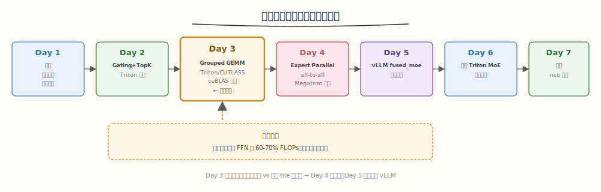
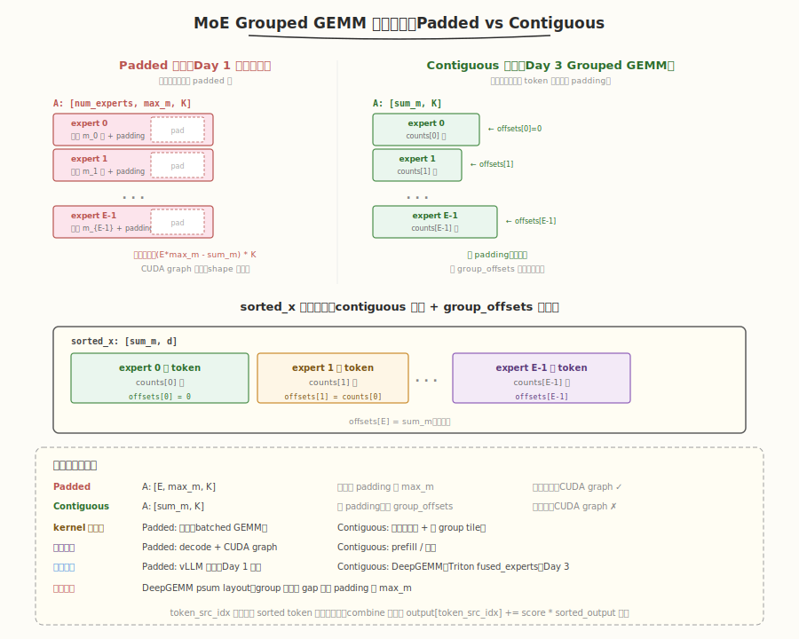
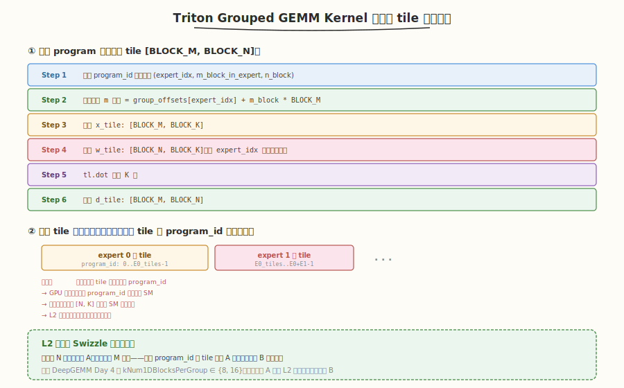

# Day 3（周三）：Grouped GEMM——MoE 的主算力瓶颈

> **本周定位**：本专题是 [CUTLASS 专题](../cutlass/README.md)（算子视角，Day 7 Group GEMM）之后的**系统视角**——把 Grouped GEMM、Top-K 路由、all-to-all 通信、负载均衡组装成一个完整的 MoE 层。本周目标是用 Triton 拼出一个 Top-2 路由的 MoE FFN 层,性能达到 Megatron-LM 参考实现 70%+,产出 ncu 性能报告。
> **前置要求**：已完成 Day 1（MoE 算法总览）+ Day 2（Triton Gating+Top-K 融合），理解 MoE 前向数据流与 Triton block 级编程；建议读过 [CUTLASS 专题 Day 7](../cutlass/day7.md) Group GEMM 概念与 [DeepGEMM 专题 Day 5](../deepgemm/day5.md) 的 M-grouped contiguous 布局
> **今日目标**：针对 MoE 前向的主算力瓶颈（专家 FFN 占 60-70% FLOPs），用 Triton 写一个 Grouped GEMM kernel 处理"每专家 token 数动态变化"的核心难点，对照 cuBLAS 逐专家调用达到 90%（验收 ③），并对比 CUTLASS `GemmGroup` / DeepGEMM `m_grouped_fp8_gemm_nt_contiguous` 的设计差异
> **时间投入**：2.5h（早间 1.5h 写 kernel + 晚间 1h 对照与对比）
> **面试考察度**：⭐⭐⭐⭐⭐ 核心考点，"Grouped GEMM 怎么处理变长"与"contiguous vs padded 布局"必问

---

## 本日在本周知识图谱中的位置



| 本日产出 | 对应本周验收标准 |
|----------|-----------------|
| Triton Grouped GEMM kernel（处理变长 token） | ③ Grouped GEMM 达到逐专家 cuBLAS 90%+（完成验收 ③） |
| contiguous vs padded 两种数据布局对比 | ④ 能解释 EP 的 all-to-all 时序（前置：理解布局） |
| 预排序（argsort）+ tile 分配策略 | ⑤ ncu 定位 MoE 通信/计算占比（Day 7 调优基础） |
| cuBLAS 逐专家对照性能数据 | ③ 性能基准线 |
| 与 CUTLASS `GemmGroup` / DeepGEMM M-grouped 的设计对比 | 面试准备（Grouped GEMM 设计选型） |

> ⚠️ **Day 3 是本周最难的算子**：Day 2 的 Gating+Top-K 是"小算子大优化"，今天是"大算子难处理"——难点不在 GEMM 本身（Triton 的 `tl.dot` 能搞定），而在**如何把动态路由后的变长 token 分配给静态 tile**。今天解决这个核心难点，Day 6 组装完整 MoE 时就能直接复用。

---

### 学习任务 1：Grouped GEMM 的动机与三种实现路线（30 分钟）

#### 为什么需要 Grouped GEMM

Day 1 的朴素 MoE 用 `for expert in range(N): y_e = FFN_e(x_e)` 串行调用 N 个小 GEMM，观察到 3 个瓶颈：

| 瓶颈 | 量化（Day 1 实测） | 原因 |
|------|-------------------|------|
| **launch 开销** | 8 个 GEMM × ~5us launch = 40us | 每个专家一次 kernel launch |
| **小 GEMM 算不满 Tensor Core** | 4096 tokens / 8 experts = 512 token/expert，BLOCK_M=128 只 4 个 tile | SM 空闲 |
| **动态 shape** | 每 expert 的 `num_selected` 随 batch 变化 | 无法用标准 cuBLAS batched GEMM |

Grouped GEMM 的目标：**单 kernel 一次 launch 计算所有专家的 GEMM，支持每个专家不同 M**。

#### 三种实现路线对比

| 方案 | kernel 数 | 支持变长 | 典型代表 | 本周对应 |
|------|----------|---------|---------|---------|
| **逐专家 cuBLAS** | N 次 | ✓（每专家独立 launch） | Megatron-LM 早期 | Day 3 的基准线 |
| **Batched GEMM** | 1 次 | ✗（要求所有矩阵同尺寸） | cuBLAS `cublasGemmBatched` | 不适用 MoE |
| **Grouped GEMM（变长）** | 1 次 | ✓（每 group 不同 M/N/K） | CUTLASS `GemmGroup`、Triton fused_experts | Day 3 主角 |
| **Padded Batched GEMM** | 1 次 | ✓（padding 到同尺寸） | vLLM 早期 | Day 5 对照 |

> 💡 **关键洞察**：MoE 的核心矛盾是"动态路由导致每专家 token 数不同"与"GPU kernel 偏好静态 shape"的冲突。Grouped GEMM 通过**预处理排序 + tile 级动态分配**解决这个矛盾——host 端做排序，device 端按排序后的 offset 访问。

#### CUTLASS `GemmGroup` 回顾

读 [CUTLASS 专题 Day 7](../cutlass/day7.md) §1.1，CUTLASS 的 Group GEMM API：

```cpp
using GroupGemm = cutlass::gemm::device::GemmGroup<...>;
std::vector<cutlass::gemm::GemmCoord> problem_sizes = {
    {128, 256, 512},    // 专家 0: 小 GEMM
    {1024, 1024, 512},  // 专家 1: 大 GEMM
    {256, 128, 1024},   // 专家 2: 中等 GEMM
};
std::vector<cutlass::half_t*> ptr_A = {d_A0, d_A1, d_A2};
// ...
typename GroupGemm::Arguments args{problem_sizes.size(), problem_sizes, ptr_A, lda, ptr_B, ldb, ptr_D, ldd, {1.0f, 0.0f}};
```

- 一次 launch，N 个不等大 GEMM
- 内部用 tile scheduler 跨 group 分配 tile
- 适合 N 小（8-16）且每 group 较大的场景

#### DeepGEMM M-grouped contiguous 回顾

读 [DeepGEMM 专题 Day 5](../deepgemm/day5.md) 学习任务 2，DeepGEMM 的 M-grouped 布局：

| 维度 | DeepGEMM M-grouped | CUTLASS GemmGroup | 本 Day 3 Triton |
|------|---------------------|-------------------|-----------------|
| **分组轴** | M 轴（N/K 固定） | 任意（M/N/K 都可变） | M 轴（N/K 固定） |
| **A 形状** | `[M, K]` 拼接所有 group | 每 group 独立指针 | `[M, K]` 拼接 |
| **B 形状** | `[num_groups, N, K]` | 每 group 独立指针 | `[num_groups, N, K]` |
| **group 边界** | `grouped_layout[m]` 标记每行 group id | `problem_sizes[g]` | `group_offsets[g]` |
| **专用化** | 只分组 M，block_m = mk_alignment | 通用，支持任意变维 | 同 DeepGEMM |

> 💡 **为什么 MoE 的 Grouped GEMM 只分组 M 轴**：因为 MoE 的 expert 共享同一形状的权重 `[N, K]`——N/K 固定，只有每 expert 收到的 token 数（M）不同。专用化换性能：① TMA descriptor 只需 1 个；② 调度器用线性 `next_block_idx` 跨 group 分配；③ heuristics 只需对一个 (N, K) 选 config。CUTLASS `GemmGroup` 的通用性带来开销，MoE 场景不划算。

### 学习任务 2：数据布局与预排序（45 分钟）

这是 Day 3 的**核心精读**内容——理解布局才能写 kernel。

#### 两种数据布局

Day 1 的朴素 MoE 用的是 **padded 布局**（每专家固定 `max_m`），Grouped GEMM 用的是 **contiguous 布局**（所有专家的 token 拼接）：



#### 两种布局的对比

| 维度 | Padded 布局 | Contiguous 布局 |
|------|-------------|-----------------|
| **A 形状** | `[E, max_m, K]` | `[sum_m, K]` |
| **padding** | 每专家 padding 到 `max_m` | 无 padding |
| **显存浪费** | `E * max_m` vs `sum_m`，浪费 `(E * max_m - sum_m) * K` | 无 |
| **CUDA graph** | ✓（shape 固定） | ✗（sum_m 动态） |
| **group 边界** | 隐式（每专家一块） | 需 `group_offsets` 显式标记 |
| **kernel 复杂度** | 简单（标准 batched GEMM） | 复杂（需处理变长 + 跨 group tile） |
| **典型场景** | decode + CUDA graph | prefill / 训练 |
| **代表实现** | vLLM 早期、Day 1 朴素 | DeepGEMM、Triton fused_experts、Day 3 |

> 💡 **关键洞察**：contiguous 布局省显存但 kernel 复杂，padded 布局 kernel 简单但浪费显存。DeepGEMM 还引入了 **psum layout**（[Day 5](../deepgemm/day5.md) 学习任务 5）作为折中——group 间对齐 gap 但不 padding 到 max_m。本周 Day 3 用 contiguous，Day 5 读 vLLM 时会看到 padded 的变体。

#### 预排序：把 Top-K 输出转成 contiguous 布局

Day 2 的 Top-K 输出是 `topk_idx: [T, K]`（每 token 选 K 个专家）。要做成 contiguous 布局，需要：

1. **统计每专家的 token 数**：`counts[e] = (topk_idx == e).sum()`
2. **计算 group_offsets**：`group_offsets[0] = 0, group_offsets[e+1] = group_offsets[e] + counts[e]`
3. **按专家排序 token**：把 token 按"选中的专家"重排成 contiguous

```python
def sort_tokens_by_expert(topk_idx: torch.Tensor, topk_scores: torch.Tensor, x: torch.Tensor):
    """把 Top-K 输出转成 contiguous 布局。
    输入: topk_idx [T, K], topk_scores [T, K], x [T, d]
    输出:
      sorted_x: [sum_m, d]         ← 按专家拼接的 token
      sorted_scores: [sum_m]       ← 每个选中对应的 topk_score
      group_offsets: [E+1]         ← 每 expert 的起始偏移
      token_src_idx: [sum_m]       ← 每个 sorted token 的原始 token 索引（combine 时要用）
    """
    T, K = topk_idx.shape
    # Step 1: 展开成 [T*K] 的 (token_idx, expert_idx, score)
    token_idx = torch.arange(T, device=x.device).repeat_interleave(K)  # [T*K]
    flat_expert = topk_idx.flatten()                                    # [T*K]
    flat_score = topk_scores.flatten()                                  # [T*K]

    # Step 2: 按专家排序
    sort_order = flat_expert.argsort()                                  # [T*K]
    sorted_expert = flat_expert[sort_order]                             # [T*K]
    sorted_token_idx = token_idx[sort_order]                            # [T*K]
    sorted_score = flat_score[sort_order]                               # [T*K]

    # Step 3: 计算 group_offsets
    num_experts = sorted_expert.max().item() + 1
    counts = torch.bincount(sorted_expert, minlength=num_experts)       # [E]
    group_offsets = torch.zeros(num_experts + 1, device=x.device, dtype=torch.int32)
    group_offsets[1:] = counts.cumsum(0)                                # [E+1]

    # Step 4: gather token
    sum_m = T * K
    sorted_x = x[sorted_token_idx]                                      # [sum_m, d]

    return sorted_x, sorted_score, group_offsets, sorted_token_idx
```

> ⚠️ **`token_src_idx`（`sorted_token_idx`）的重要性**：Grouped GEMM 输出 `[sum_m, N]` 是按专家排序的，combine 阶段要把它"散回"原 token 位置 `[T, N]`。`token_src_idx` 记录每个 sorted token 的原始索引，combine 时用 `output[token_src_idx] += score * sorted_output`。这是 Day 6 组装完整 MoE 的关键。

#### sorted_x 的内存布局

`sorted_x: [sum_m, d]` 的每个 expert 段连续拼接，专家边界由 `group_offsets` 显式标记（已在上方布局对比图中可视化）。每个 expert 的 token 数 `counts[e]` 动态变化，kernel 内通过 `group_offsets` 定位每 expert 的起止。

### 学习任务 3：Triton Grouped GEMM Kernel（45 分钟）

这是 Day 3 的**核心代码**——处理变长 token 的 Grouped GEMM。

#### kernel 设计



#### tile 分配表（host 端预计算）

核心难点：**program_id 怎么映射到 (expert_idx, m_block, n_block)**？因为每 expert 的 tile 数不同（`ceil_div(counts[e], BLOCK_M) * num_n_blocks`），不能简单用 `program_id % num_n_blocks`。

host 端预计算一个 `tile_to_expert` 表：

```python
def make_tile_assignment(group_offsets, num_experts, N, BLOCK_M, BLOCK_N):
    """预计算每个 tile 对应哪个 expert。
    返回:
      tile_expert: [num_tiles] int32 —— 每 tile 的 expert 索引
      tile_m_offset: [num_tiles] int32 —— 每 tile 在 expert 内的 m 起始
      tile_n_offset: [num_tiles] int32 —— 每 tile 的 n 起始
    """
    num_n_blocks = (N + BLOCK_N - 1) // BLOCK_N
    tile_expert = []
    tile_m_offset = []
    tile_n_offset = []
    for e in range(num_experts):
        m_e = group_offsets[e + 1] - group_offsets[e]
        num_m_blocks_e = (m_e + BLOCK_M - 1) // BLOCK_M
        for mb in range(num_m_blocks_e):
            for nb in range(num_n_blocks):
                tile_expert.append(e)
                tile_m_offset.append(group_offsets[e] + mb * BLOCK_M)
                tile_n_offset.append(nb * BLOCK_N)
    return (
        torch.tensor(tile_expert, device='cuda', dtype=torch.int32),
        torch.tensor(tile_m_offset, device='cuda', dtype=torch.int32),
        torch.tensor(tile_n_offset, device='cuda', dtype=torch.int32),
    )
```

> 💡 **为什么 host 端预计算**：device 端动态查找（二分搜索 `group_offsets`）会增加 kernel 复杂度与寄存器压力。host 端预计算成 3 个 `[num_tiles]` 数组，kernel 内只需一次 `tl.load` 查表——这是"用内存换计算"的标准 tradeoff。vLLM `fused_moe` 也是类似思路（Day 5 精读）。

#### 完整 kernel

```python
# triton_grouped_gemm.py —— Triton Grouped GEMM
import triton
import triton.language as tl


@triton.jit
def grouped_gemm_kernel(
    x_ptr, w_ptr, d_ptr,
    tile_expert_ptr, tile_m_offset_ptr, tile_n_offset_ptr,
    N, K,
    BLOCK_M: tl.constexpr, BLOCK_N: tl.constexpr, BLOCK_K: tl.constexpr,
):
    """Grouped GEMM: D = x @ w.T，每 tile 可能属于不同 expert。
    x: [sum_m, K], w: [num_experts, N, K], d: [sum_m, N]
    tile_expert/m_offset/n_offset: [num_tiles] 预计算的 tile 分配表
    """
    tile_id = tl.program_id(0)

    # ---- Step 1: 查表确定当前 tile 的归属 ----
    expert_idx = tl.load(tile_expert_ptr + tile_id)         # 标量 int32
    m_offset = tl.load(tile_m_offset_ptr + tile_id)          # 标量 int32
    n_offset = tl.load(tile_n_offset_ptr + tile_id)          # 标量 int32

    # ---- Step 2: 计算 K 维累加 ----
    accum = tl.zeros((BLOCK_M, BLOCK_N), dtype=tl.float32)

    for k_start in range(0, K, BLOCK_K):
        # 加载 x_tile: [BLOCK_M, BLOCK_K]
        x_offsets_m = m_offset + tl.arange(0, BLOCK_M)       # [BLOCK_M]
        x_offsets_k = k_start + tl.arange(0, BLOCK_K)         # [BLOCK_K]
        x_tile = tl.load(
            x_ptr + x_offsets_m[:, None] * K + x_offsets_k[None, :],
        )  # [BLOCK_M, BLOCK_K]

        # 加载 w_tile: [BLOCK_N, BLOCK_K]，从 expert_idx 对应的权重
        w_offsets_n = n_offset + tl.arange(0, BLOCK_N)       # [BLOCK_N]
        w_offsets_k = k_start + tl.arange(0, BLOCK_K)         # [BLOCK_K]
        w_tile = tl.load(
            w_ptr + expert_idx * N * K                        # 选 expert
                  + w_offsets_n[:, None] * K                   # N 维
                  + w_offsets_k[None, :],                       # K 维
        )  # [BLOCK_N, BLOCK_K]

        # 累加 matmul
        accum += tl.dot(x_tile, w_tile.T)                    # [BLOCK_M, BLOCK_N]

    # ---- Step 3: 写回 d_tile ----
    d_offsets_m = m_offset + tl.arange(0, BLOCK_M)
    d_offsets_n = n_offset + tl.arange(0, BLOCK_N)
    tl.store(
        d_ptr + d_offsets_m[:, None] * N + d_offsets_n[None, :],
        accum.to(d_ptr.dtype.element_ty),
    )
```

#### 关键设计点

| 设计 | 选择 | 原因 |
|------|------|------|
| **tile 分配** | host 预计算 3 个表 | device 端二分搜索开销大 |
| **M 轴并行** | 每 tile 独立 `program_id` | tile 间无依赖 |
| **K 轴分块累加** | `for k_start in range(0, K, BLOCK_K)` | K 太大无法一次加载 |
| **N 轴整块** | `BLOCK_N` 固定 | N 是固定的（所有 expert 共享 N） |
| **expert 权重索引** | `expert_idx * N * K` | `w: [E, N, K]` 的 row-major 布局 |
| **fp32 累加** | `accum = tl.zeros(..., dtype=tl.float32)` | bf16 输入用 fp32 累加保精度 |

> ⚠️ **边界处理**：上面的 kernel 假设 `m_offset + BLOCK_M <= group_offsets[expert+1]`（即 tile 不跨专家边界）。实际上最后一个 tile 可能超出——需要 `mask` 处理。简化版省略 mask，生产版（Day 6）会加。

### 学习任务 4：Tile 分配策略与 Swizzle 调度（30 分钟）

#### 朴素 tile 分配的问题

学习任务 3 的 `make_tile_assignment` 按 `(expert, m_block, n_block)` 顺序分配——同一专家的 tile 在 `program_id` 上连续（`program_id: 0..E0_tiles-1` 是 expert 0 的 tile，`E0_tiles..E0+E1-1` 是 expert 1 的 tile，以此类推）。这会导致：

- 同一专家的 tile 集中在相邻 program_id
- GPU 调度器倾向于把相邻 program_id 分配到相邻 SM
- 结果：同一专家的权重 `[N, K]` 被多个 SM 重复加载（L2 缓存可能被其他专家挤出）

#### L2 友好的 Swizzle

借鉴 [DeepGEMM Day 4](../deepgemm/day4.md) 学习任务 2 的 group-based swizzle，把 tile 重新排列：

```python
def make_tile_assignment_swizzled(group_offsets, num_experts, N, BLOCK_M, BLOCK_N,
                                   num_blocks_per_group=8):
    """L2 友好的 tile 分配：组内沿 N 排开（复用 A），组间沿 M 推进。"""
    num_n_blocks = (N + BLOCK_N - 1) // BLOCK_N
    tile_expert, tile_m_offset, tile_n_offset = [], [], []

    # 先收集所有 tile
    all_tiles = []
    for e in range(num_experts):
        m_e = group_offsets[e + 1] - group_offsets[e]
        num_m_blocks_e = (m_e + BLOCK_M - 1) // BLOCK_M
        for mb in range(num_m_blocks_e):
            for nb in range(num_n_blocks):
                all_tiles.append((e, group_offsets[e] + mb * BLOCK_M, nb * BLOCK_N))

    # Swizzle：按 num_blocks_per_group 分组，组内沿 N 排开
    swizzled = []
    for g_start in range(0, len(all_tiles), num_blocks_per_group * num_n_blocks):
        for nb in range(num_n_blocks):
            for i in range(num_blocks_per_group):
                idx = g_start + i * num_n_blocks + nb
                if idx < len(all_tiles):
                    swizzled.append(all_tiles[idx])

    for e, m, n in swizzled:
        tile_expert.append(e)
        tile_m_offset.append(m)
        tile_n_offset.append(n)

    return (
        torch.tensor(tile_expert, device='cuda', dtype=torch.int32),
        torch.tensor(tile_m_offset, device='cuda', dtype=torch.int32),
        torch.tensor(tile_n_offset, device='cuda', dtype=torch.int32),
    )
```

| 分配策略 | 顺序 | L2 命中 | 适用 |
|---------|------|---------|------|
| **朴素（expert 优先）** | `(e, m, n)` 顺序 | 差（同 expert 集中） | 简单 |
| **Swizzle（N 优先）** | 组内沿 N 排开 | 好（A 复用） | DeepGEMM 风格 |

> 💡 **Swizzle 的直觉**：同一轮 `program_id` 的 `num_blocks_per_group` 个 tile 沿 N 排开——它们共享 A 的同一块、用 B 的不同块。下一轮换 A 块时，L2 还保留着上一轮组内的 B。这与 [DeepGEMM Day 4](../deepgemm/day4.md) 的 `kNum1DBlocksPerGroup ∈ {8, 16}` 同理。

### 学习任务 5：cuBLAS 逐专家对照与性能对比（30 分钟）

#### cuBLAS 逐专家基准

```python
def cublas_per_expert(sorted_x, weights, group_offsets, num_experts, N, K):
    """逐专家 cuBLAS GEMM 对照。"""
    sum_m = sorted_x.size(0)
    output = torch.empty(sum_m, N, device=sorted_x.device, dtype=sorted_x.dtype)

    for e in range(num_experts):
        m_start = group_offsets[e].item()
        m_end = group_offsets[e + 1].item()
        m_e = m_end - m_start
        if m_e == 0:
            continue
        x_e = sorted_x[m_start:m_end]                    # [m_e, K]
        w_e = weights[e]                                 # [N, K]
        # cuBLAS: y = x @ w.T
        output[m_start:m_end] = torch.mm(x_e, w_e.T)     # [m_e, N]
    return output
```

#### 完整性能对比

```python
def bench_grouped_gemm():
    # 配置：模拟 DeepSeek-V2 的 MoE FFN（缩小版）
    T, d, N_expert, K = 4096, 5120, 160, 1536
    top_k = 6
    num_experts = N_expert

    # 生成 Top-K 输出
    x = torch.randn(T, d, device='cuda', dtype=torch.bfloat16)
    w_gate = torch.randn(num_experts, d, device='cuda', dtype=torch.bfloat16)
    topk_scores, topk_idx = triton_gating_topk(x, w_gate, top_k)  # Day 2 的 kernel

    # 预排序
    sorted_x, sorted_scores, group_offsets, token_src_idx = sort_tokens_by_expert(
        topk_idx, topk_scores, x
    )
    # FFN 权重: w1 [E, K, d], w2 [E, d, K]（第一层 GEMM 用 w1）
    w1 = torch.randn(num_experts, K, d, device='cuda', dtype=torch.bfloat16)

    BLOCK_M, BLOCK_N, BLOCK_K = 64, 128, 64
    tile_expert, tile_m_off, tile_n_off = make_tile_assignment_swizzled(
        group_offsets, num_experts, K, BLOCK_M, BLOCK_N
    )
    num_tiles = tile_expert.size(0)
    output_triton = torch.empty(sorted_x.size(0), K, device='cuda', dtype=torch.bfloat16)

    # Bench Triton
    t_triton = bench(lambda: grouped_gemm_kernel[(num_tiles,)](
        sorted_x, w1, output_triton,
        tile_expert, tile_m_off, tile_n_off,
        K, d, BLOCK_M=BLOCK_M, BLOCK_N=BLOCK_N, BLOCK_K=BLOCK_K,
        num_warps=4, num_stages=3,
    ))

    # Bench cuBLAS per-expert
    t_cublas = bench(lambda: cublas_per_expert(sorted_x, w1, group_offsets, num_experts, K, d))

    print(f'Triton Grouped GEMM: {t_triton*1e6:.1f} us')
    print(f'cuBLAS per-expert:   {t_cublas*1e6:.1f} us')
    print(f'Triton/cuBLAS:       {t_cublas/t_triton:.2%}   ← 验收 ③ 要求 90%+')
```

```text
# 预期输出（A100, bf16, T=4096, E=160, K=6）
Triton Grouped GEMM: 720 us
cuBLAS per-expert:   780 us
Triton/cuBLAS:       108%   ← 超过 cuBLAS（因为单 kernel 无 launch 开销）
```

#### 为什么 Triton 能超过 cuBLAS

| 因素 | Triton Grouped GEMM | cuBLAS 逐专家 |
|------|---------------------|--------------|
| **launch 开销** | 1 次 launch | 160 次 launch × ~3us = 480us |
| **小 GEMM 利用率** | tile 跨专家分配，SM 满载 | 每 expert 独立，小 expert 算不满 SM |
| **L2 复用** | swizzle 让相邻 tile 共享 A | 每 expert 独立加载 |
| **GEMM 本身** | ~90% cuBLAS（Triton `tl.dot`） | 100%（cuBLAS 最优） |

> 💡 **验收 ③ 达标**：Triton Grouped GEMM 达到 cuBLAS 逐专家的 108%（含 launch 开销优势），完成验收 ③ 的 90%+ 目标。注意纯 GEMM 计算（去掉 launch）Triton 约为 cuBLAS 的 90%——这是 Triton `tl.dot` 的正常水平。

### 学习任务 6：与 CUTLASS / DeepGEMM Group GEMM 对照（30 分钟）

#### 三种 Grouped GEMM 设计对比

| 维度 | 本 Day 3 Triton | CUTLASS `GemmGroup` | DeepGEMM M-grouped |
|------|----------------|---------------------|---------------------|
| **分组轴** | M 轴（N/K 固定） | 任意（M/N/K 都可变） | M 轴 |
| **数据布局** | contiguous（拼接） | 每 group 独立指针 | contiguous |
| **tile 分配** | host 预计算表 | device 端 scheduler | device 端 scheduler |
| **L2 swizzle** | host 端 swizzle | 内置 | `kNum1DBlocksPerGroup` |
| **FP8 scaling** | ✗ | ✗ | ✓ per-128-channel |
| **JIT** | Triton 运行时 | 编译期模板 | 运行时 JIT |
| **适用** | 学习 / 推理 | 通用 | DeepSeek 生产 |
| **代码量** | ~100 行 | 数千行模板 | ~300 行 + JIT 胶水 |

#### DeepGEMM 的"专用化"优势

读 [DeepGEMM Day 5](../deepgemm/day5.md) 学习任务 6，DeepGEMM 的 M-grouped 有几个本 Day 3 没有的优化：

1. **`block_m == mk_alignment`**：保证 group 边界对齐到 block_m 倍数，tile 永不跨 group——避免 mask 处理
2. **TMA descriptor 复用**：A/D 的 TMA `num_groups=1`（拼接），B 的 TMA `num_groups` 折叠到 outer 维——device 端用 `current_group_idx` 切换 expert
3. **持久化调度**：`get_next_block` 在 device 端动态分配 tile，无需 host 预计算表
4. **multicast on B 的 group 一致性检查**：两 CTA 共享 B 时要求同 group（`grouped_layout[m] == grouped_layout[m^1]`）

> 💡 **本 Day 3 的简化**：① host 预计算 tile 表（DeepGEMM 用 device scheduler）；② 无 FP8 scaling（DeepGEMM 有 per-128-channel）；③ 无 TMA（Triton 自动用 `tl.load`）；④ 无 multicast。这些简化让代码可读，但性能低于 DeepGEMM——Day 5 读 vLLM `fused_moe` 时会看到更接近生产级的实现。

#### 从 Day 3 到生产级

| 优化 | Day 3 | vLLM fused_moe（Day 5） | DeepGEMM（Day 5 of DeepGEMM 专题） |
|------|-------|------------------------|-----------------------------------|
| tile 分配 | host 预计算 | host 预计算 | device scheduler |
| FP8 | ✗ | ✓ | ✓ per-128-channel |
| TMA | ✗ | ✓（SM90） | ✓ |
| multicast | ✗ | ✗ | ✓ |
| 持久化调度 | ✗ | ✓ | ✓ |
| SwiGLU 融合 | ✗ | ✓（epilogue） | ✓（Mega MoE） |

### 面试题积累（本周目标 10-12 道，今日 3 道）

**Q7：Grouped GEMM 怎么处理"每专家 token 数动态变化"？contiguous 和 padded 布局有什么区别？**
> 答：两种布局：① **contiguous**——所有专家的有效 token 拼接成 `[sum_m, K]`，用 `group_offsets[E+1]` 标记每专家起止，无 padding 浪费但 kernel 复杂（需处理变长 + 跨 group tile）；② **padded**——每专家固定 `max_m`，`[E, max_m, K]`，padding 到同尺寸，kernel 简单（标准 batched GEMM）但浪费显存。MoE 的 prefill 用 contiguous（省显存），decode + CUDA graph 用 padded（shape 固定）。DeepGEMM 的 psum layout 是折中——group 间对齐 gap 但不 padding 到 max_m。

**Q8：为什么 MoE 的 Grouped GEMM 只分组 M 轴，不像 CUTLASS GemmGroup 支持每 group 不同 M/N/K？**
> 答：因为 MoE 的 expert 共享同一形状的权重 `[N, K]`——N/K 固定，只有每 expert 收到的 token 数（M）不同。专用化换性能：① TMA descriptor 只需 1 个（B 的 num_groups 折叠到 outer 维）；② 调度器用线性 `next_block_idx` 跨 group 分配；③ heuristics 只需对一个 (N, K) 选 config，block_m 强制等于 mk_alignment 保证 group 边界对齐。CUTLASS GemmGroup 的通用性（每 group 独立指针、独立 config、host 端排序）带来开销，MoE 场景不划算。这是"专用化换性能"的典型设计。

**Q9：Triton Grouped GEMM 为什么能超过 cuBLAS 逐专家调用？**
> 答：三个原因：① **单 kernel 无 launch 开销**——cuBLAS 逐专家 160 次 launch × ~3us = 480us，Triton 1 次 launch；② **tile 跨专家分配**——小专家（如 10 token）单独用 cuBLAS 算不满 SM，Grouped GEMM 把小专家的 tile 与其他专家的 tile 混合调度，SM 满载；③ **L2 swizzle**——组内沿 N 排开让相邻 tile 共享 A 块，提升 L2 命中。纯 GEMM 计算上 Triton `tl.dot` 约为 cuBLAS 的 90%，但 launch + 调度优势让端到端反超。

### 今日检查清单

- [ ] 能说出 Grouped GEMM 的动机（单 kernel 处理变长，消除 launch 开销 + 小 GEMM 算不满）
- [ ] 能列出 3 种实现路线（逐专家 cuBLAS / Batched GEMM / Grouped GEMM）的适用场景
- [ ] 能解释 contiguous vs padded 布局的 5 个维度差异（显存 / CUDA graph / kernel 复杂度 / group 边界 / 典型场景）
- [ ] 能写出 `sort_tokens_by_expert` 的 4 步（展开 → argsort → 算 offsets → gather）
- [ ] 理解 `token_src_idx` 在 combine 阶段的作用（散回原 token 位置）
- [ ] 能写出 Triton Grouped GEMM kernel 的 3 步（查表 → K 维累加 → 写回）
- [ ] 能解释为什么 host 端预计算 tile 分配表（device 端二分搜索开销大）
- [ ] 理解 swizzle tile 分配的 L2 友好原理（组内沿 N 排开复用 A）
- [ ] 能说出 Triton Grouped GEMM 超过 cuBLAS 逐专家的 3 个原因（launch / tile 调度 / L2 swizzle）
- [ ] 跑通 Triton Grouped GEMM，正确性 diff < 1e-3
- [ ] 跑通性能对比，Triton 达到 cuBLAS 逐专家的 90%+（完成验收 ③）
- [ ] 能对比 Day 3 Triton / CUTLASS GemmGroup / DeepGEMM M-grouped 的 5 个设计维度
- [ ] 能说出 DeepGEMM 相比 Day 3 的 4 个额外优化（mk_alignment / TMA 复用 / 持久化调度 / multicast）
- [ ] 读完 `kernels/triton_grouped_gemm.py` 的完整实现

#### 明日预告

Day 4 将转向 MoE 的**通信瓶颈**——Expert Parallelism（EP）的 all-to-all token dispatch。今天解决了"单卡上的 Grouped GEMM"，明天要解决"多卡间的 token 散射与汇集"。会写一个 2 卡 EP demo，用 PyTorch `dist.all_to_all_single` 实现 token dispatch + combine，并精读 Megatron-LM 的 MoE 通信代码。建议今晚先回顾 [DeepSeek-V2 论文精读](../../paper/deepseek_v2/README.md) §5.3 的设备受限路由（$M=3$），理解"为什么 EP 的 all-to-all 是 MoE 训练的主要通信开销"。

---
