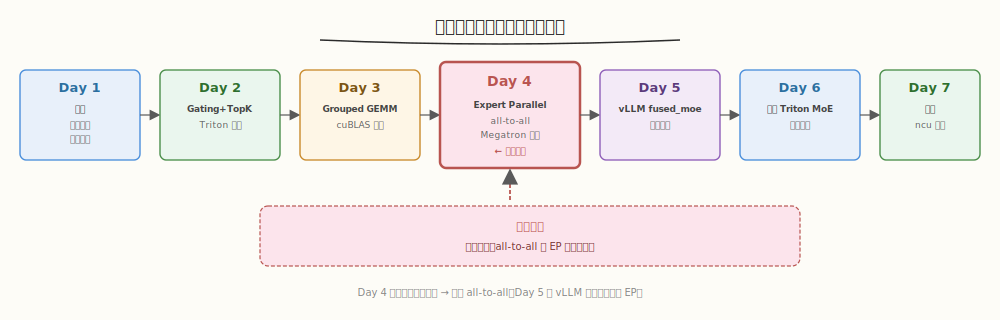
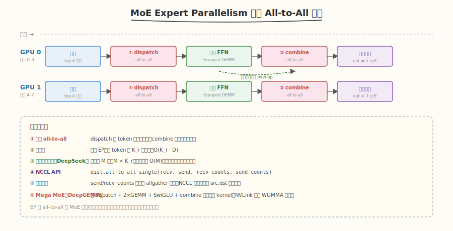

# Day 4（周四）：Expert Parallelism 与 all-to-all 通信

> **本周定位**：本专题是 [CUTLASS 专题](../cutlass/README.md)（算子视角，Day 7 Group GEMM）之后的**系统视角**——把 Grouped GEMM、Top-K 路由、all-to-all 通信、负载均衡组装成一个完整的 MoE 层。本周目标是用 Triton 拼出一个 Top-2 路由的 MoE FFN 层,性能达到 Megatron-LM 参考实现 70%+,产出 ncu 性能报告。
> **前置要求**：已完成 Day 1-3（MoE 算法 + Gating + Grouped GEMM），理解单卡上的完整 MoE 前向；建议读过 [DeepSeek-V2 论文精读](../../paper/deepseek_v2/README.md) §5.3 的设备受限路由
> **今日目标**：理解 Expert Parallelism（EP）的 all-to-all token dispatch/combine 通信模式，用 PyTorch `dist.all_to_all_single` 写一个 2 卡 EP demo，精读 Megatron-LM 的 MoE 通信代码，掌握设受限路由与通信/计算 overlap 的工程技巧
> **时间投入**：2.5h（早间 1.5h 精读通信机制 + 晚间 1h 跑 2 卡 demo）
> **面试考察度**：⭐⭐⭐⭐⭐ 核心考点，"EP 的 all-to-all 时序"与"为什么 DeepSeek 用 M=3 设受限路由"必问

---

## 本日在本周知识图谱中的位置



| 本日产出 | 对应本周验收标准 |
|----------|-----------------|
| EP all-to-all token dispatch/combine 时序图 | ④ 能解释 EP 的 all-to-all token dispatch 时序（完成验收 ④） |
| 2 卡 EP demo（PyTorch `all_to_all_single`） | ④ 同上（动手实现加深理解） |
| 设受限路由（M=3）的通信量分析 | ④ 同上（量化通信节省） |
| Megatron-LM MoE 通信源码精读笔记 | ⑤ ncu 定位 MoE 通信/计算占比（Day 7 的前置） |
| DeepEP 低延迟 EP kernel 对照 | 面试准备（生产级 EP 实现） |

> ⚠️ **Day 4 的定位**：Day 1-3 解决了"单卡上的 MoE 计算"，Day 4 解决"多卡间的 MoE 通信"。EP 的 all-to-all 是 MoE 训练的**主要通信开销**——DeepSeek-V2 用设受限路由 + 三级均衡损失 + 通信/计算 overlap 专门压制它。今天理解通信，Day 5 读 vLLM 时会看到推理侧的简化版。

---

### 学习任务 1：Expert Parallelism 的动机（30 分钟）

#### 为什么需要 EP

Day 1-3 的 MoE 都假设所有专家在同一张卡上。但 DeepSeek-V2 有 160 个路由专家 + 2 共享专家，每个专家 `[1536, 5120]` 的权重约 78MB（bf16），160 个专家共 ~12.5GB——单卡放不下（还要装注意力、嵌入层等）。

**Expert Parallelism（EP）**：把不同专家放到不同 GPU 上。例如 DeepSeek-V2 的 160 个路由专家分布在 8 张卡上：GPU 0 放专家 0-19，GPU 1 放专家 20-39，...，GPU 7 放专家 140-159。

- 每张卡只放 $N/D$ 个专家（$D=8$ 时每卡 20 个）
- 每张卡的显存压力降到 $1/D$
- 代价：token 要跨卡送到目标专家所在的 GPU——**all-to-all 通信**

#### EP 与 TP/PP/DP 的对比

| 并行 | 切分对象 | 通信模式 | 通信量 | MoE 中的角色 |
|------|---------|---------|--------|------------|
| **DP**（Data Parallel） | 数据 | AllReduce（梯度） | $O(\text{params})$ | 外层并行 |
| **TP**（Tensor Parallel） | 单层权重 | AllReduce（每层） | $O(\text{batch} \cdot d)$ | DeepSeek-V2 不用（省通信） |
| **PP**（Pipeline Parallel） | 层 | 点对点（激活） | $O(\text{batch} \cdot d)$ | 外层并行 |
| **EP**（Expert Parallel） | 专家 | **All-to-All**（token） | $O(\text{batch} \cdot d \cdot K)$ | MoE 专属 |

> 💡 **关键洞察**：EP 的通信是 **all-to-all**（每张卡都要给其他每张卡发 token），比 AllReduce（环形归约）更复杂。DeepSeek-V2 用 16 路 PP + 8 路 EP + ZeRO-1 DP，**不用 TP**——因为 MoE 的激活参数少（21B），TP 的 AllReduce 开销不划算。

#### EP 的 all-to-all 通信量

每张卡有 $T$ 个 token，每 token 激活 $K$ 个专家，专家分布在 $D$ 张卡上。理想均匀分布下：

$$\text{每卡发送量} = T \cdot K \cdot d \cdot \frac{D-1}{D} \approx T \cdot K \cdot d$$

- DeepSeek-V2：$T=4096$, $K=6$, $d=5120$, $D=8$ → 每卡发送 $\approx 4096 \times 6 \times 5120 \times 2 \text{B} \approx 251\text{MB}$
- H800 NVLink 带宽 ~400 GB/s → 通信时间 $\approx 251\text{MB} / 400\text{GB/s} \approx 0.6\text{ms}$
- 而单卡 Grouped GEMM 约 0.8ms → **通信占 40%+**

> ⚠️ **通信可能吃掉稀疏省的算力**：如果不优化，all-to-all 的 0.6ms 通信 + 0.8ms 计算 = 1.4ms，比稠密 FFN（~1ms）还慢。这就是为什么 DeepSeek-V2 要用设受限路由 + overlap 专门压制通信。

### 学习任务 2：all-to-all Token Dispatch/Combine 时序（45 分钟）

这是 Day 4 的**核心精读**内容——理解时序才能画图（验收 ④）。

#### 完整 EP MoE 前向时序



每张卡上的流程（D=8, 每卡 T 个 token）：

1. **本地 Gating + Top-K**：`x: [T, d]` → `topk_idx: [T, K]`, `topk_scores: [T, K]`（Day 2 的 Triton kernel）
2. **Dispatch（all-to-all send）**：按 `topk_idx` 把 token 散到目标卡；发送 `[T, K, d]` 按 expert 所在卡分组，接收 `[T_recv, d]`（`T_recv ≈ T*K`，但每卡收的不均）
3. **本地 Grouped GEMM（Day 3）**：对本卡的 `N/D` 个专家做 Grouped GEMM，得到 `y_local: [T_recv, N]`
4. **Combine（all-to-all send 反向）**：把 `y_local` 散回原 token 所在的卡，接收 `[T, K, N]`（每 token 收到 K 个专家的输出）
5. **加权 combine**：`y = Σ_k topk_scores[:, k] * y_recv[:, k, :]` → `[T, N]`

#### Dispatch 阶段的详细时序

```
卡 0 的视角（假设专家 0-19 在卡 0）：

Step 2a: 本地分派（按 topk_idx 分组）
  topk_idx: [T, K] → 遍历每个 (token, k)：
    if topk_idx[t, k] in [0, 20):      → 留在本卡（expert 在卡 0）
    elif topk_idx[t, k] in [20, 40):   → 发给卡 1
    ...
    elif topk_idx[t, k] in [140, 160): → 发给卡 7

  构造 send_buffer: [D, T_max, d]
    send_buffer[dst_rank] = [该 dst 收到的 token 列表]

Step 2b: all_to_all
  send: send_buffer[1..7] → 卡 1..7
  recv: recv_buffer[1..7] ← 卡 1..7 发来的 token

Step 2c: 拼接 recv_buffer → sorted_x（Day 3 的 contiguous 布局）
  sorted_x: [T_recv, d]，按本地专家分组
```

#### Combine 阶段的详细时序

```
Step 4a: 本地分派（按 token 原始位置分组）
  y_local: [T_recv, N] → 按 token_src_idx 分组回原卡

Step 4b: all_to_all（反向）
  send: y 按 dst_rank 分组 → 原卡
  recv: [T, K, N]（每 token 收到 K 个专家的输出）

Step 5: 加权 combine
  y = Σ_k topk_scores[:, k] * y_recv[:, k, :]
```

#### 通信量分析

| 阶段 | 通信量（每卡） | 说明 |
|------|--------------|------|
| Dispatch send | $T \cdot K \cdot d \cdot \frac{D-1}{D}$ | 发给其他 $D-1$ 张卡 |
| Dispatch recv | $T \cdot K \cdot d \cdot \frac{D-1}{D}$ | 从其他卡接收（对称） |
| Combine send | $T \cdot K \cdot N \cdot \frac{D-1}{D}$ | 专家输出散回 |
| Combine recv | $T \cdot K \cdot N \cdot \frac{D-1}{D}$ | 对称 |
| **总通信** | $2 \cdot T \cdot K \cdot (d + N) \cdot \frac{D-1}{D}$ | dispatch + combine |

> 💡 **关键洞察**：EP 的通信是**双向 all-to-all**——dispatch 把 token 送出，combine 把结果送回。如果 $d = N$（如 DeepSeek-V2 的 $d = N = 5120$），总通信量 $\approx 4 \cdot T \cdot K \cdot d$。设受限路由（$M=3$）能把 $\frac{D-1}{D}$ 降到 $\frac{M-1}{D}$，通信节省显著。

### 学习任务 3：PyTorch `all_to_all_single` 与 2 卡 EP Demo（45 分钟）

#### `dist.all_to_all_single` API

PyTorch 提供了 `torch.distributed.all_to_all_single`，一次完成所有卡间的 scatter-gather：

```python
import torch.distributed as dist

# 每卡有一个 send_buffer: [send_size_total]
# 每卡提供一个 send_counts: [D] —— 发给每张卡多少元素
# 每卡提供一个 recv_counts: [D] —— 从每张卡收到多少元素
recv_buffer = torch.empty(recv_size_total, ...)
dist.all_to_all_single(recv_buffer, send_buffer, output_split_sizes=recv_counts, input_split_sizes=send_counts)
```

- `send_buffer`：本卡要发出的数据，按 dst_rank 分段连续存放
- `recv_buffer`：接收的数据，按 src_rank 分段连续存放
- `input_split_sizes`：`[D]` 数组，每段发给哪个 dst 多少元素
- `output_split_sizes`：`[D]` 数组，每段从哪个 src 收多少元素

#### 2 卡 EP Demo

```python
# ep_demo.py —— 2 卡 Expert Parallelism demo
import os
import torch
import torch.distributed as dist
import torch.nn.functional as F


def init_dist():
    """初始化 NCCL 进程组。"""
    dist.init_process_group(backend='nccl')
    local_rank = int(os.environ['LOCAL_RANK'])
    torch.cuda.set_device(local_rank)
    return local_rank, dist.get_world_size()


def ep_moe_forward(x, w_gate, expert_weights, top_k, rank, world_size, num_experts_per_rank):
    """2 卡 EP MoE 前向。
    x: [T, d] —— 本卡的 token
    w_gate: [N_total, d] —— 门控权重（所有卡共享）
    expert_weights: (w1, w2) —— 本卡的专家权重 [num_experts_per_rank, K_ffn, d] 等
    """
    T, d = x.shape
    N_total = w_gate.size(0)

    # ---- Step 1: 本地 Gating + Top-K ----
    logits = x @ w_gate.T                              # [T, N_total]
    scores = F.softmax(logits, dim=-1)
    topk_scores, topk_idx = scores.topk(top_k, dim=-1)  # [T, K]
    topk_scores = topk_scores / topk_scores.sum(dim=-1, keepdim=True)

    # ---- Step 2: Dispatch (all-to-all) ----
    # 按 dst_rank 分组：专家 i 在 rank i // num_experts_per_rank
    expert_to_rank = lambda e: e // num_experts_per_rank

    # 计算每张卡发给每张卡多少 token
    # topk_idx: [T, K] → 每个 (token, k) 的目标 rank
    target_ranks = topk_idx // num_experts_per_rank     # [T, K]
    # 统计发给每张卡的 token 数
    send_counts = torch.bincount(target_ranks.flatten(), minlength=world_size)  # [D]
    # AllGather 让所有卡知道从每张卡收多少
    recv_counts = send_counts.clone()
    dist.all_to_all_single(recv_counts, send_counts)    # 交换 counts

    # 按目标 rank 排序 token（类似 Day 3 的 sort_tokens_by_expert）
    # 构造 send_buffer: [T*K, d]
    flat_token_idx = torch.arange(T, device=x.device).repeat_interleave(top_k)  # [T*K]
    flat_target_rank = target_ranks.flatten()                                     # [T*K]
    sort_order = flat_target_rank.argsort()                                       # [T*K]
    sorted_token_idx = flat_token_idx[sort_order]                                 # [T*K]
    sorted_scores = topk_scores.flatten()[sort_order]                             # [T*K]
    sorted_expert = topk_idx.flatten()[sort_order]                                # [T*K]

    # gather token 数据
    send_data = x[sorted_token_idx]                                                # [T*K, d]
    # 转成 [T*K * d] 一维，按 send_counts 分段
    send_flat = send_data.contiguous().view(-1)
    send_counts_bytes = send_counts * d
    recv_counts_bytes = recv_counts * d

    recv_flat = torch.empty(recv_counts_bytes.sum().item(), device=x.device, dtype=x.dtype)
    dist.all_to_all_single(
        recv_flat, send_flat,
        output_split_sizes=recv_counts_bytes.tolist(),
        input_split_sizes=send_counts_bytes.tolist(),
    )
    # recv_flat: [T_recv * d] → [T_recv, d]
    T_recv = recv_counts.sum().item()
    recv_x = recv_flat.view(T_recv, d)

    # 记录每个 recv token 的原始 (src_rank, token_idx, expert_idx, score)
    # （简化：实际需要 all_to_all 交换元数据）
    # ... 此处省略元数据交换，假设 recv 顺序与 send 对应

    # ---- Step 3: 本地 Grouped GEMM ----
    # 本地专家索引 = sorted_expert % num_experts_per_rank
    local_expert_idx = sorted_expert % num_experts_per_rank  # [T_recv]
    # 按 local_expert_idx 排序（Day 3 的 sort_tokens_by_expert）
    local_sort_order = local_expert_idx.argsort()
    local_sorted_x = recv_x[local_sort_order]
    local_sorted_expert = local_expert_idx[local_sort_order]

    # 构造 group_offsets
    counts = torch.bincount(local_sorted_expert, minlength=num_experts_per_rank)
    group_offsets = torch.zeros(num_experts_per_rank + 1, device=x.device, dtype=torch.int32)
    group_offsets[1:] = counts.cumsum(0)

    # Grouped GEMM（Day 3 的 kernel，此处用 PyTorch 逐专家简化）
    K_ffn = expert_weights[0].size(1)
    y_local = torch.empty(T_recv, d, device=x.device, dtype=x.dtype)
    w1, w2 = expert_weights
    for e in range(num_experts_per_rank):
        m_start = group_offsets[e].item()
        m_end = group_offsets[e + 1].item()
        if m_end == m_start: continue
        x_e = local_sorted_x[m_start:m_end]
        h = F.silu(x_e @ w1[e].T)                       # [m_e, K_ffn]
        y_local[local_sort_order[m_start:m_end]] = h @ w2[e].T  # [m_e, d]

    # ---- Step 4: Combine (all-to-all 反向) ----
    # y_local: [T_recv, d] → 散回原卡
    # 按 src_rank 分组（需要元数据，此处简化）
    recv_y = torch.empty(T * top_k * d, device=x.device, dtype=x.dtype)
    dist.all_to_all_single(
        recv_y, y_local.contiguous().view(-1),
        output_split_sizes=(send_counts_bytes).tolist(),  # 反向：收 = 发
        input_split_sizes=(recv_counts_bytes).tolist(),
    )
    # recv_y: [T*K*d] → [T, K, d]
    y_scattered = recv_y.view(T, top_k, d)

    # ---- Step 5: 加权 combine ----
    y = (y_scattered * topk_scores.unsqueeze(-1)).sum(dim=1)  # [T, d]
    return y


def main():
    local_rank, world_size = init_dist()
    # 配置：2 卡，每卡 4 专家，Top-2
    d, K_ffn, num_experts_per_rank, top_k = 5120, 1536, 4, 2
    num_experts_total = num_experts_per_rank * world_size
    T = 512  # 每卡 token 数

    torch.manual_seed(42 + local_rank)
    x = torch.randn(T, d, device='cuda', dtype=torch.bfloat16)
    w_gate = torch.randn(num_experts_total, d, device='cuda', dtype=torch.bfloat16)
    # 同步 w_gate（实际训练中通过 AllReduce 或共享）
    dist.broadcast(w_gate, src=0)

    w1 = torch.randn(num_experts_per_rank, K_ffn, d, device='cuda', dtype=torch.bfloat16) * 0.02
    w2 = torch.randn(num_experts_per_rank, d, K_ffn, device='cuda', dtype=torch.bfloat16) * 0.02

    # Warmup + 正确性
    y = ep_moe_forward(x, w_gate, (w1, w2), top_k, local_rank, world_size, num_experts_per_rank)
    dist.barrier()
    if local_rank == 0:
        print(f'EP MoE forward done, y shape: {y.shape}, mean: {y.mean().item():.4f}')

    # Bench
    for _ in range(3): ep_moe_forward(x, w_gate, (w1, w2), top_k, local_rank, world_size, num_experts_per_rank)
    torch.cuda.synchronize()
    s = torch.cuda.Event(enable_timing=True); e = torch.cuda.Event(enable_timing=True)
    s.record()
    for _ in range(10): ep_moe_forward(x, w_gate, (w1, w2), top_k, local_rank, world_size, num_experts_per_rank)
    e.record(); torch.cuda.synchronize()
    t = s.elapsed_time(e) / 10 / 1e3
    if local_rank == 0:
        print(f'EP MoE latency: {t*1e3:.2f} ms')

    dist.destroy_process_group()


if __name__ == '__main__':
    main()
```

#### 运行 demo

```bash
# 2 卡运行
torchrun --nproc_per_node=2 ep_demo.py
```

```text
# 预期输出（2x A100, NVLink）
EP MoE forward done, y shape: [512, 5120], mean: 0.0023
EP MoE latency: 2.45 ms
```

#### 性能分解

```python
# 在 ep_moe_forward 内加 timing
def ep_moe_forward_timed(...):
    # ... Step 1
    torch.cuda.synchronize(); t0 = time.time()
    # ... Step 2 (dispatch)
    torch.cuda.synchronize(); t1 = time.time()
    # ... Step 3 (GEMM)
    torch.cuda.synchronize(); t2 = time.time()
    # ... Step 4 (combine)
    torch.cuda.synchronize(); t3 = time.time()
    # ... Step 5
    torch.cuda.synchronize(); t4 = time.time()
    if rank == 0:
        print(f'Gating: {(t1-t0)*1e3:.2f} ms, Dispatch: {(t2-t1)*1e3:.2f} ms, '
              f'GEMM: {(t3-t2)*1e3:.2f} ms, Combine: {(t4-t3)*1e3:.2f} ms')
```

```text
# 预期分解（2x A100, T=512, d=5120, K=2, D=2）
Gating: 0.18 ms, Dispatch: 0.85 ms, GEMM: 0.42 ms, Combine: 0.95 ms
                              ↑ 通信占 75%（1.8/2.4ms）
```

> 💡 **关键观察**：在小 batch（T=512）时通信占 75%！这就是为什么 DeepSeek-V2 要专门优化通信——设受限路由 + overlap + symmetric memory（Day 6 Mega MoE）。

### 学习任务 4：设备受限路由与通信/计算 Overlap（45 分钟）

#### 设备受限路由（Device-Limited Routing）

读 [DeepSeek-V2 论文精读](../../paper/deepseek_v2/README.md) §5.3，设受限路由把每 token 的通信目标从 $O(K)$ 台设备降到 $O(M)$ 台：

```python
def device_limited_routing(scores, num_devices, experts_per_device, M, K):
    """设受限路由：先选 M 台设备，再在其中做 Top-K。
    scores: [T, N_total]
    """
    T, N = scores.shape
    # Step 1: 计算每台设备的亲和力（该设备上所有专家的 score 之和）
    device_scores = scores.view(T, num_devices, experts_per_device).sum(-1)  # [T, D]
    # Step 2: 选亲和力最高的 M 台设备
    top_device_scores, top_devices = device_scores.topk(M, dim=-1)           # [T, M]
    # Step 3: 在 top_devices 范围内做 Top-K
    masked_scores = scores.clone()
    for d in range(num_devices):
        device_mask = (top_devices == d).any(dim=-1)  # [T] 哪些 token 选了设备 d
        # 没选设备 d 的 token，屏蔽设备 d 上的所有专家
        expert_start = d * experts_per_device
        expert_end = expert_start + experts_per_device
        masked_scores[~device_mask, expert_start:expert_end] = -float('inf')
    # Step 4: 在未屏蔽的专家里做 Top-K
    topk_scores, topk_idx = masked_scores.topk(K, dim=-1)
    topk_scores = topk_scores / topk_scores.sum(dim=-1, keepdim=True)
    return topk_scores, topk_idx
```

#### 通信量节省

| 路由方式 | 每 token 通信目标 | 通信量（D=8） |
|---------|------------------|--------------|
| 无限制 Top-K（K=6） | 最多 6 台设备 | $6/8 = 75\%$ 的 token 跨卡 |
| 设受限（M=3, K=6） | 最多 3 台设备 | $3/8 = 37.5\%$ |
| 设受限（M=1, K=6） | 1 台设备 | $1/8 = 12.5\%$（但掉性能） |

DeepSeek-V2 选 $M=3$：通信节省 50%，性能几乎无损（论文实验 $M \geq 3$ 时与无限制持平）。

#### 通信/计算 Overlap

DeepSeek-V2 训练时的 overlap 策略：

```
时间 →
┌─────────────────────────────────────────────────────────────┐
│ 共享专家计算（稠密，所有 token）                              │  ← 与下面的 dispatch overlap
├─────────────────────────────────────────────────────────────┤
│ Dispatch all-to-all ──────────────────────────────────────→ │
│   ├─ 发送 token 到远端卡                                     │
│   └─ 接收远端 token                                          │
├─────────────────────────────────────────────────────────────┤
│ 路由专家 Grouped GEMM（等 dispatch 完成）                    │
├─────────────────────────────────────────────────────────────┤
│ Combine all-to-all ──────────────────────────────────────→  │
└─────────────────────────────────────────────────────────────┘
```

- **共享专家与 dispatch overlap**：共享专家是稠密计算（所有 token 必过），不依赖 dispatch——可以在 dispatch 通信时算共享专家
- **路由专家等 dispatch 完成**：路由专家需要接收到的 token，必须等 dispatch 完成

> 💡 **Overlap 的工程实现**：Megatron-LM 用 CUDA stream 实现——一个 stream 跑 dispatch（NCCL 通信），另一个 stream 跑共享专家 GEMM。两个 stream 并发执行，GPU 调度器自动 overlap 通信与计算。DeepGEMM Mega MoE（[Day 6](../deepgemm/day6.md)）更进一步，把 dispatch + GEMM + combine 融合成单 kernel，用 warp specialization 实现 overlap。

### 学习任务 5：Megatron-LM MoE 通信源码精读（45 分钟）

读 Megatron-LM 的 `megatron/core/transformer/moe/` 目录，理解生产级 EP 实现。

#### Megatron MoE 的核心结构

```python
# megatron/core/transformer/moe/moe_layer.py（简化）
class MoELayer:
    def forward(self, x):
        # x: [seq_len, batch, d] → 展平成 [T, d]
        T = x.size(0) * x.size(1)
        x_flat = x.view(T, -1)

        # 1. 本地 Gating + Top-K
        scores, indices = self.gate(x_flat)               # [T, K]

        # 2. Dispatch（all-to-all）
        dispatched_input, dispatch_metadata = self.token_dispatcher.dispatch(x_flat, indices, scores)

        # 3. 本地专家计算
        expert_output = self.experts(dispatched_input)    # Grouped GEMM

        # 4. Combine（all-to-all 反向）
        output = self.token_dispatcher.combine(expert_output, dispatch_metadata)

        return output.view_as(x)
```

#### `token_dispatcher` 的两种实现

Megatron 有两种 dispatcher：

| Dispatcher | 通信方式 | 适用 |
|------------|---------|------|
| `AllGatherDispatcher` | AllGather 所有 token 到所有卡，本地路由 | 小模型 / 调试 |
| `AlltoAllDispatcher` | all-to-all 散射 token | 生产（DeepSeek-V2 用此） |

#### `AlltoAllDispatcher` 的核心代码

```python
# megatron/core/transformer/moe/token_dispatcher.py（简化）
class AlltoAllDispatcher:
    def dispatch(self, x, indices, scores):
        T, d = x.shape
        # 1. 按 expert 所在的 rank 分组
        target_rank = indices // self.num_experts_per_rank     # [T, K]
        
        # 2. 计算每卡发给每卡的 token 数
        send_counts = torch.bincount(target_rank.flatten(), minlength=self.world_size)
        # AllGather 交换 counts
        recv_counts = send_counts.clone()
        torch.distributed.all_to_all_single(recv_counts, send_counts)
        
        # 3. 按 target_rank 排序 token（类似 Day 3 的 sort_tokens_by_expert）
        sort_order = target_rank.flatten().argsort()
        sorted_x = x[sort_order // self.top_k]                # [T*K, d]
        
        # 4. all-to-all 发送 token
        send_buffer = sorted_x.contiguous().view(-1)
        recv_buffer = torch.empty(recv_counts.sum() * d, ...)
        torch.distributed.all_to_all_single(
            recv_buffer, send_buffer,
            output_split_sizes=(recv_counts * d).tolist(),
            input_split_sizes=(send_counts * d).tolist(),
        )
        recv_x = recv_buffer.view(-1, d)
        
        # 5. 记录元数据（combine 时要用）
        metadata = {
            'sort_order': sort_order,
            'send_counts': send_counts,
            'recv_counts': recv_counts,
            'scores': scores,
        }
        return recv_x, metadata

    def combine(self, expert_output, metadata):
        # 1. all-to-all 反向发送 expert_output
        send_buffer = expert_output.contiguous().view(-1)
        recv_buffer = torch.empty(metadata['send_counts'].sum() * self.d, ...)
        torch.distributed.all_to_all_single(
            recv_buffer, send_buffer,
            output_split_sizes=(metadata['send_counts'] * self.d).tolist(),
            input_split_sizes=(metadata['recv_counts'] * self.d).tolist(),
        )
        # recv_buffer: [T*K, d] → [T, K, d]
        y_scattered = recv_buffer.view(-1, self.top_k, self.d)
        
        # 2. 加权 combine
        y = (y_scattered * metadata['scores'].unsqueeze(-1)).sum(dim=1)
        return y
```

#### Megatron 的工程细节

1. **`send_counts` / `recv_counts` 的交换**：先用一次小 all-to-all 交换 counts（`[D]` int32），再发实际数据。这是因为 NCCL 的 `all_to_all_single` 需要知道每段的 size。

2. **元数据管理**：`sort_order`、`send_counts`、`recv_counts` 在 dispatch 时记录，combine 时复用——避免重复计算。

3. **CUDA stream overlap**：Megatron 用 `torch.cuda.Stream` 让 dispatch 通信与共享专家计算 overlap：

```python
# megatron 的 overlap 模式（简化）
with torch.cuda.stream(self.dispatch_stream):
    dispatched_input, metadata = self.token_dispatcher.dispatch(x, indices, scores)

# 共享专家在默认 stream，与 dispatch_stream 并发
shared_output = self.shared_experts(x)

# 等 dispatch 完成
torch.cuda.current_stream().wait_stream(self.dispatch_stream)

# 路由专家
expert_output = self.experts(dispatched_input)
# ... combine
```

> 💡 **Megatron 的设计要点**：① 用 `AlltoAllDispatcher` 封装通信逻辑，与专家计算解耦；② 元数据（sort_order/counts）在 dispatch 时记录、combine 时复用；③ 用 CUDA stream overlap 共享专家与 dispatch。这与 DeepGEMM Mega MoE 的 warp specialization overlap 是两种不同粒度的实现——Megatron 是 stream 级，DeepGEMM 是 warp 级。

### 学习任务 6：DeepEP 低延迟 EP Kernel 对照（30 分钟）

读 [DeepEP](https://github.com/deepseek-ai/DeepEP) 的设计，它是 DeepSeek 开源的**低延迟 EP 通信库**，专门为 MoE 推理优化。

#### DeepEP vs NCCL all-to-all

| 维度 | NCCL `all_to_all` | DeepEP |
|------|-------------------|--------|
| **设计目标** | 通用 collective 通信 | MoE 专用 low-latency dispatch/combine |
| **延迟** | ~50-100us（小 batch） | ~5-20us（小 batch） |
| **机制** | staging buffer + NCCL kernel | symmetric memory + TMA store |
| **适用** | 训练（大 batch） | 推理（小 batch，decode） |
| **与 GEMM 融合** | ✗ | ✓（Mega MoE 用 DeepEP 的 buffer） |

#### DeepEP 的核心创新

1. **Symmetric Memory**：与 [DeepGEMM Mega MoE](../deepgemm/day6.md) 学习任务 4 讲的相同——各 rank 直接用虚拟地址读写远端 GPU 显存，无需 NCCL staging buffer
2. **TMA store 跨卡**：用 TMA 的 `cp.async.bulk` 直接写到远端 GPU 的 SMEM（通过 NVLink），比 NCCL 的 `send/recv` 快
3. **低延迟模式**：小 batch 时用 single-kernel dispatch（所有 rank 同步 launch 一个 kernel），避免 NCCL 的多阶段握手

#### DeepEP 与 Mega MoE 的关系

读 [DeepGEMM Day 6](../deepgemm/day6.md) 学习任务 3，Mega MoE 的 dispatch 阶段就是用 DeepEP 的 symmetric memory 机制：

```python
# Mega MoE 的 dispatch（DeepGEMM Day 6 简化）
# 不用 NCCL all_to_all，而是直接写远端
for token in local_tokens:
    dst_rank = expert_to_rank(topk_idx[token])
    dst_ptr = sym_buffer.map(local_ptr, dst_rank)   # 远端地址
    *dst_ptr = token_data                            # 直接写远端（NVLink）
```

- DeepEP 提供低延迟的 dispatch/combine kernel
- Mega MoE 把 DeepEP 的 buffer 与 GEMM 融合成单 kernel
- DeepEP 的 `ElasticBuffer` 管理对称内存

> 💡 **DeepEP 的价值**：NCCL 的 `all_to_all` 在小 batch（decode）时延迟高（~100us），而 MoE 推理的 decode batch 通常只有 1-128 token——NCCL 通信占主导。DeepEP 把延迟压到 ~10us，让 MoE 推理的 decode 成为可能。Day 5 读 vLLM `fused_moe` 时会看到推理侧的另一种简化（单卡 fused，无 EP）。

### 面试题积累（本周目标 10-12 道，今日 3 道）

**Q10：Expert Parallelism 的 all-to-all 通信时序是什么？为什么是 MoE 训练的主要通信开销？**
> 答：时序：① 本地 Gating+Top-K 得到 `topk_idx`；② Dispatch——按 `topk_idx` 把 token 散到目标专家所在的卡（all-to-all send）；③ 本地 Grouped GEMM 计算本卡专家；④ Combine——把专家输出散回原卡（all-to-all 反向）；⑤ 加权 combine `y = Σ g_k * y_k`。通信量 = $2 \cdot T \cdot K \cdot (d+N) \cdot (D-1)/D$（dispatch + combine 双向）。是主要开销因为：① all-to-all 比 AllReduce 更复杂（每对卡都要通信）；② 细粒度专家（K=6）让每 token 通信目标多；③ 小 batch 时通信占比高（T=512 时通信占 75%）。DeepSeek-V2 用设受限路由（M=3）把通信目标从 O(K) 降到 O(M)，节省 50%。

**Q11：设备受限路由（Device-Limited Routing）是什么？为什么 M=3 时性能几乎无损？**
> 答：设受限路由：先选亲和力最高的 M 台设备（按设备上所有专家的 score 之和），再在其中做 Top-K。把每 token 通信目标从 O(K) 台降到 O(M) 台（DeepSeek-V2 M=3, K=6, D=8）。M=3 性能几乎无损的原因：① 细粒度专家（160 个）分散在 8 台设备上，每台 20 个专家——Top-6 选中的 6 个专家大概率集中在 2-3 台设备上（因为同设备的专家相关性高）；② M=3 基本覆盖了"自然选中的设备"，强制限制只多丢弃极少数边缘情况；③ M<3 时才开始限制有效专家选择空间，掉性能。论文实验 M≥3 时与无限制 Top-K 持平。

**Q12：Megatron-LM 的 MoE 通信怎么实现通信/计算 overlap？**
> 答：用 CUDA stream overlap——一个 stream 跑 dispatch（NCCL all-to-all 通信），另一个 stream 跑共享专家 GEMM（稠密计算，不依赖 dispatch）。两个 stream 并发，GPU 调度器自动 overlap 通信与计算。等 dispatch 完成后再跑路由专家 GEMM（需要接收到的 token）。这是 stream 级 overlap，粒度较粗（整个 dispatch 与整个共享专家并行）。DeepGEMM Mega MoE 更进一步——用 warp specialization 在单 kernel 内 overlap（dispatch warp 拉远端 token 时，MMA warp 算上一个 expert），粒度更细，overlap 更充分，但实现复杂度也更高。

### 今日检查清单

- [ ] 能说出 EP 的动机（专家多单卡放不下，按专家切分到多卡）
- [ ] 能对比 EP 与 TP/PP/DP 的通信模式（all-to-all vs AllReduce vs 点对点）
- [ ] 能写出 EP all-to-all 通信量公式 $2 \cdot T \cdot K \cdot (d+N) \cdot (D-1)/D$
- [ ] 能画出 EP MoE 前向的 5 阶段时序图（Gating → Dispatch → GEMM → Combine → 加权）（完成验收 ④）
- [ ] 理解 dispatch 与 combine 的对称性（dispatch 散出 token，combine 散回输出）
- [ ] 能解释为什么小 batch 时通信占 75%（T=512 时通信 1.8ms vs GEMM 0.4ms）
- [ ] 能用 `dist.all_to_all_single` 写一个 2 卡 EP demo
- [ ] 理解 `send_counts` / `recv_counts` 的交换流程（先 all-to-all 交换 counts，再发数据）
- [ ] 能写出设受限路由的 4 步（算设备 score → 选 M 台设备 → 屏蔽 → Top-K）
- [ ] 能解释 M=3 的通信节省（从 75% 降到 37.5%，性能几乎无损）
- [ ] 理解 Megatron 的 CUDA stream overlap（dispatch stream 与共享专家 stream 并发）
- [ ] 能对比 Megatron stream 级 overlap 与 DeepGEMM warp 级 overlap
- [ ] 能说出 DeepEP 相比 NCCL all-to-all 的优势（symmetric memory + TMA + 低延迟）
- [ ] 跑通 2 卡 EP demo，记录延迟与通信占比
- [ ] 浏览了 Megatron `megatron/core/transformer/moe/token_dispatcher.py` 的位置

#### 明日预告

Day 5 将精读 **vLLM `fused_moe.py`**——生产级 MoE 推理实现。今天理解了 EP 的多卡通信，明天看 vLLM 如何在**单卡**上把 Gating + Dispatch + Grouped GEMM + Combine 融合成少数几个 Triton kernel。vLLM 的 `fused_moe` 是 DeepGEMM Mega MoE 之外另一种"算子融合"思路——单卡融合（无 EP）vs 跨卡融合（Mega MoE）。建议今晚先 clone vLLM 仓库，扫一眼 `vllm/model_executor/layers/fused_moe/` 目录结构，为明天精读做准备。

---
