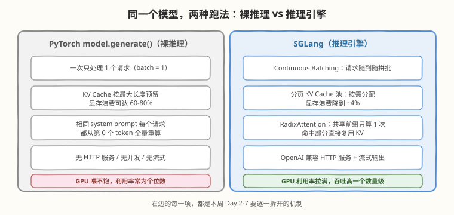
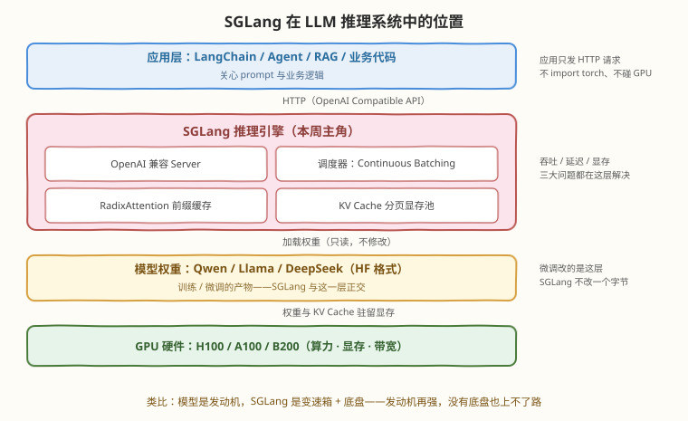

# Day 1：认识 SGLang —— 它是什么、解决什么问题

> **本周计划**：本日是 [SGLang 一周入门学习计划](notes/SGLang一周入门学习计划.md)的第 1 天。全周目标：建立完整认知框架 + 跑通 SGLang + 理解核心机制（而不是读完所有源码）
> **今日成败标准**：能用自己的话回答三个问题——"为什么直接用 PyTorch + Transformers 跑大模型推理不行？""为什么需要推理引擎？""SGLang 和 vLLM 有什么不同？"
> **时间投入**：2.5h（理论 40 分钟 + 实践 60 分钟 + 阅读 50 分钟 + 总结 30 分钟）
> **面试考察度**：⭐⭐⭐ "为什么需要推理引擎"是推理方向面试的送分题——答不好直接出局，答好了后面所有机制问题才有入场券

---

## 🎯 目标

通过今天的学习，你将：

1. 理解 `model.generate()` 裸推理撑不起真实服务的四个原因，能对着一次生成的耗时结构说出"慢在哪、浪费在哪"
2. 掌握推理引擎存在的三大理由——**吞吐、延迟、显存利用率**——以及各自对应的机制（Continuous Batching / 分页 KV Cache / 前缀缓存）
3. 建立 SGLang 的定位认知：高性能 LLM **推理服务框架**（不是模型、不是训练框架），位于"模型权重"之上、"应用代码"之下
4. 了解 SGLang 的发展背景：LMSYS 出身、NeurIPS 2024 论文、RadixAttention 的设计动机、xAI / DeepSeek 等生产采用
5. 跑一段"裸推理"基线脚本并记录耗时——这是 Day 6 做 Benchmark 对比的对照组

> 💡 **前置知识**：无硬性前置；若已完成 [Week 6 推理系统基础与 KV Cache](../../daily/week6/README.md) 与 [Week 7 Batching 与调度](../../daily/week7/README.md)（或 [vLLM 专题](../vllm/README.md)），今天的概念会更亲切——SGLang 与 vLLM 共享同一套"通用内功"，差异在独门招式
> ⚠️ **环境要求**：任务 A 需要 Linux + NVIDIA GPU（显存 ≥ 8GB，用 Qwen3-0.6B 这类小模型）+ `pip install transformers torch`；没有 GPU 也能完成全部理论学习与任务 B（侦察）

---

## 为什么第一天不急着装 SGLang

学推理引擎最常见的失败路径有两种：要么直接打开源码仓库被几十万行代码劝退，要么 `pip install` 跑通 demo 就以为学会了——面试被问"Scheduler 在哪一层"立刻卡住。今天的安排是**先建立问题意识，再动手**：

| 学习方式 | 问题 | 今天的做法 |
|----------|------|------------|
| 直接读源码 | 没有全局地图，淹没在细节里 | 先拿一张"SGLang 在 LLM 系统中的位置图" |
| 只跑 demo | 知其然不知其所以然 | 先跑**没有引擎的**裸推理，体会引擎优化了什么 |
| 只看文档对比 | 背下一堆名词，分不清主次 | 只抓一个核心差异（前缀缓存机制），其余留到后面 |

> 💡 **一句话总结**：Day 1 的目标不是"学会 SGLang"，而是拿到两样东西——一张位置图 + 一条"没有引擎时有多慢"的基线数据。后面 6 天的每个机制，都要能挂回今天的问题框架上。

---

## 核心概念

### 1.1 朴素推理的体感：`model.generate()` 到底在做什么

LLM 是**自回归**模型：每一步只输出"下一个 token"的概率分布，把采样出的 token 拼回输入，再算下一步。`model.generate(max_new_tokens=100)` 的本质是这个循环：

```python
# model.generate() 的本质（伪代码）
for _ in range(100):                      # 要 100 个新 token
    logits = model.forward(input_ids)     # 一次前向传播，搬一遍全部权重
    next_token = sample(logits[-1])       # 只用最后一个位置预测下一个 token
    input_ids = input_ids + [next_token]  # 拼回输入，进入下一轮
```

> ⚠️ **注意**：串行依赖是**原理性的**，不是实现偷懒——第 n+1 个 token 的输入里包含第 n 个 token，而它要等第 n 次前向结束才知道。所以"一次生成全部"做不到，例外只有投机解码（小模型先猜、大模型并行验证，见 [Week 8](../../daily/week8/README.md)）。prompt 部分没有这个依赖，可以一次并行算完——这正是 prefill 与 decode 性质相反的根源，Day 4 展开。

这个朴素循环用在真实服务里会撞上四堵墙：

| 问题 | 现象 | 根源 |
|------|------|------|
| **吞吐极低** | 一次只能服务 1 个请求 | 没有 continuous batching，decode 阶段 GPU 大量空转 |
| **显存浪费** | KV Cache 按最大长度预留 | 生成前不知道实际长度，只能保守预分配连续显存（浪费可达 60-80%） |
| **重复计算** | 相同 system prompt 每个请求从头算 | 没有跨请求的 KV 复用（前缀缓存） |
| **不是服务** | 没有 HTTP API、并发、流式 | `generate()` 本来只是研究 API，为易用性而非吞吐设计 |



> 💡 **一句话总结**：`model.generate()` 的问题不是"算得慢"，而是"喂不饱 + 装不下 + 白重算"——这三件事都不是模型的问题，是**系统**的问题，所以需要的是推理引擎而不是更好的模型。

### 1.2 推理引擎存在的意义：吞吐 / 延迟 / 显存

把上面四堵墙收敛成三大痛点，每条痛点对应推理引擎的一类机制——这张表是整个专题的"总目录"：

| 痛点 | 引擎的解法 | SGLang 中的对应机制 | 深入日 |
|------|-----------|---------------------|--------|
| 吞吐低 | **Continuous Batching**：每步 decode 后重组 batch，请求随到随拼 | 零开销调度器（CPU 调度与 GPU 计算 overlap） | Day 4 / 5 |
| 显存浪费 | **分页 KV Cache**：像 OS 虚拟内存一样按需分配物理块 | token 显存池 + 基数树索引 + LRU 淘汰 | Day 4 / 5 |
| 重复计算 | **前缀缓存**：命中部分直接复用 KV，只算新增尾巴 | RadixAttention（token 级匹配，默认开启） | Day 5 |
| 延迟高 / 无服务 | 服务化：常驻进程 + 流式输出 + OpenAI 兼容 API | HTTP Server + Chunked Prefill | Day 2 / 3 / 5 |

#### 深入：为什么"把 batch 开大"近乎免费

这是今天唯一需要咬碎的硬概念，值得多花五分钟：

- decode 每一步都要把**全部模型权重**从显存搬到计算单元，却只算出 1 个 token——**搬运成本 ∝ 权重大小，与 batch 无关**；增加 batch 只增加计算量
- "推理是 Memory Bound"意味着瓶颈在搬运（带宽）而不是计算（算力）——计算单元本来就大量闲置
- 所以 batch 从 1 → 64：搬运量不变、计算仍远未触及算力上限，**单步耗时几乎不变，单步产出 ×64**——吞吐近乎免费地涨
- 免费午餐直到 batch 大到让瓶颈从带宽转移到算力或 KV 显存容量为止（Day 6 的并发阶梯实验会亲眼看到这个拐点）

> 💡 **一句话总结**：GPU 贵在搬不动权重、闲着算力；推理引擎的全部故事，就是想办法让"搬一次权重"顺便服务尽可能多的请求。

### 1.3 SGLang 在 LLM 推理系统中的位置



| 层 | 谁负责 | 关心什么 |
|----|--------|---------|
| 应用层 | LangChain / Agent / RAG / 业务代码 | prompt 怎么写、业务逻辑 |
| ↓ HTTP | OpenAI Compatible API（行业标准协议） | 请求 / 响应格式 |
| **推理引擎层** | **SGLang：Server + 调度器 + RadixAttention + KV 池** | **吞吐 / 延迟 / 显存** |
| 模型层 | Qwen / Llama / DeepSeek 权重（HF 格式） | Transformer 结构本身 |
| 硬件层 | NVIDIA / AMD GPU | SM、显存、带宽 |

两个关键认知：

1. **应用只发 HTTP 请求**——不 `import torch`、不碰 GPU。这就是"服务化"的含义：把"模型权重"变成"一个高并发、低延迟的在线推理服务"
2. **SGLang 与模型层正交**——它加载权重但不修改权重。换更好的模型、做微调，发生在模型层；把模型高效地跑起来，发生在引擎层

> 💡 **变速箱类比**：模型是发动机，推理引擎是变速箱 + 底盘。发动机再强，没有底盘也上不了路；SGLang 是一台**特别擅长复用重复计算（前缀缓存）**的高性能变速箱。

### 1.4 发展背景：为什么 LMSYS 要造 SGLang

| 时间 | 事件 |
|------|------|
| 2024 年初 | LMSYS Org（UC Berkeley / 斯坦福 Sky Computing Lab）发布 SGLang，同期提出 RadixAttention |
| 2024 年 | 论文《SGLang: Efficient Execution of Structured Language Model Programs》被 **NeurIPS 2024** 接收 |
| 2024-2025 | DeepSeek-V3/R1 引发热潮，SGLang 成为官方推荐推理方案之一；生态快速扩张 |
| 2026 年 8 月 | 最新稳定版 v0.5.18——**本专题以 v0.5.x 为基准** |

**设计动机**（论文的出发点）：真实 LLM 应用——Agent、多轮对话、RAG——中存在**大量重复的 prompt 前缀**：system prompt、工具定义、检索文档、多轮历史。传统引擎每个请求都从第 0 个 token 重算。SGLang 把"前缀复用"做成引擎的**一等公民**：RadixAttention 基数树缓存，默认开启、零配置。

| 生产采用方 | 用法 |
|-----------|------|
| DeepSeek | V3 / R1 官方推荐推理方案之一，MoE 大模型服务表现一流 |
| xAI | Grok 的推理服务 |
| NVIDIA / AMD | 官方参与贡献与优化，多硬件平台支持 |

> ⚠️ **名字澄清**：SGLang 最初指它的前端**结构化生成语言**（Structured Generation Language）；如今大家日常说的 "SGLang" 更多指它的推理运行时（SGLang Runtime，SRT）。本专题聚焦后者，前端 DSL 留给进阶。

### 1.5 SGLang vs vLLM：核心差异与选型

两者都是主流开源推理引擎，表层能力已趋同（Continuous Batching、分页 KV、FP8 量化、OpenAI API 都有），**真正的分水岭是前缀缓存的匹配机制**：

| 维度 | vLLM | SGLang |
|------|------|--------|
| 出身 | UC Berkeley，PagedAttention 论文（SOSP 2023） | LMSYS，SGLang 论文（NeurIPS 2024） |
| KV 管理 | PagedAttention：逻辑块 → block table → 物理块 | 分页 token 池 + 基数树索引 |
| 前缀缓存 | APC：**block 级哈希匹配**（V0 需 `--enable-prefix-caching`，V1 起默认开启） | RadixAttention：**token 级基数树最长前缀匹配**，一直默认开启 |
| 调度 | V1 引擎（overlap 调度） | 零开销调度器（CPU 调度与 GPU 计算 overlap） |
| 模型覆盖 | 400+ 架构，最广，"安全默认项" | 主流架构齐全，DeepSeek 系 MoE 一流 |
| 结构化输出 | 支持（guided decoding） | xgrammar 约束解码，开销更低 |
| 生态定位 | 覆盖广度 + Blackwell 新硬件首发支持 | 高前缀重叠 / MoE 场景的性能选项 |

> ⚠️ **版本提示**：vLLM 的 prefix caching 在 V0 引擎时代需手动开启，V1 引擎起默认开启——网上老教程两种说法都有，以所用版本文档为准。两引擎的核心差异是**匹配机制**（block 哈希 vs token 级基数树）而非开关状态：block 级匹配前缀边界不对齐时会整块失配，粒度粗一档；token 级则精确到单个 token。

**工程选型速记**：

- prompt 前缀重叠率 > 60%（RAG、多轮 Agent、固定 system prompt）→ **优先试 SGLang**，实测吞吐可高出 20-40%
- 追求模型覆盖广度、新硬件首发支持 → vLLM
- 负载无共享前缀时两者接近——**永远用 PoC 数据说话，不要信仰站队**

---

## 动手实践

### 任务 A：感受"裸推理"（30 分钟）

用最原始的方式跑一次生成，为之后理解"引擎优化了什么"建立体感：

```python
# naive_generate.py —— 裸推理基线：为 Day 6 的引擎 Benchmark 留对照组
# 运行: pip install transformers torch accelerate && python3 naive_generate.py

from transformers import AutoModelForCausalLM, AutoTokenizer
import time

model_id = "Qwen/Qwen3-0.6B"   # 显存紧张就用这个小模型
tok = AutoTokenizer.from_pretrained(model_id)
model = AutoModelForCausalLM.from_pretrained(model_id, device_map="cuda", torch_dtype="auto")

prompt = "用三句话解释什么是 KV Cache："
inputs = tok(prompt, return_tensors="pt").to("cuda")

t0 = time.time()
out = model.generate(**inputs, max_new_tokens=100)
t1 = time.time()

print(tok.decode(out[0], skip_special_tokens=True))
print(f"生成 100 个 token 耗时：{t1 - t0:.2f} 秒")
```

```bash
python3 naive_generate.py
```

```text
# 预期输出（具体文本因模型而异；耗时因 GPU 而异，通常数秒级）
KV Cache（键值缓存）是大语言模型推理中的一项优化技术。它的核心思想是……
生成 100 个 token 耗时：4.87 秒
```

**观察点**（比跑通更重要）：

1. **把耗时记下来**——抄进笔记，Day 6 在 SGLang 服务上跑同模型的单请求生成，对比引擎优化的量级
2. 生成期间另开终端盯 `nvidia-smi`：SM 利用率经常只有个位数百分比——"GPU 喂不饱"的直接证据
3. 想一遍：这 100 个 token = 100 次串行前向，**每次前向都把全部权重从显存搬一遍**——这就是 1.2 节 memory-bound 的体感
4. 若输出包含 `<think>` 思考段属正常（Qwen3 的思考模式特性），不影响计时结论

### 任务 B：浏览式侦察（30 分钟）

只侦察、不深读。打开 [github.com/sgl-project/sglang](https://github.com/sgl-project/sglang) 与 [docs.sglang.ai](https://docs.sglang.ai)，把下表填进笔记（明天直接用）：

| 侦察项 | 在哪看 | 我的记录 |
|--------|--------|----------|
| star 数 / release 版本号 | GitHub 首页 | |
| 安装命令（pip / uv / Docker 三选一） | README Quick Start | |
| 服务启动命令（含 `--model-path` / `--port`） | 官方文档 Get Started | |
| 默认端口 | 文档或 README | |
| Roadmap / 近期大特性 | README 或博客 | |

**侦察要点**：Quick Start 命令里每个参数看懂含义即可，不要深入安装细节——那是明天的主战场。

### 学习时间安排（共 2.5 小时）

| 时长 | 内容 |
|---|---|
| 40 分钟 | 理论：推理引擎为什么存在、SGLang 背景（本文 1.1-1.5 节） |
| 30 分钟 | 实践 A：裸推理脚本 + 记录耗时 |
| 50 分钟 | 阅读：SGLang README + 文档首页 + vLLM 对比资料 |
| 30 分钟 | 实践 B：侦察记录 + 写一页"我理解的 SGLang"总结 |

**"我理解的 SGLang"总结模板**（5 行以内，用自己的话）：

```text
SGLang 是 __________，它解决的问题是 __________。
它位于 ______ 和 ______ 之间。
它和 vLLM 最大的差异是 __________。
今天我在裸推理实验里观察到 __________。
我还没搞懂、明天想验证的是 __________。
```

---

## 常见误解澄清

| 误解 | 事实 |
|------|------|
| "SGLang 是一个模型" | 它是推理引擎 / 服务框架，跑的是 Qwen / Llama / DeepSeek 等**别人训练好的**模型 |
| "SGLang 和模型微调有什么关系" | 完全正交：微调改权重（训练侧），SGLang 不改一个字节的权重，只负责把权重高效地跑起来 |
| "用了 SGLang 显存就省了" | 引擎省的是 KV Cache 的**碎片与重复**；模型权重该多大还是多大，显存下限由权重决定 |
| "SGLang 比 vLLM 快 20-40%" | 只在**高前缀重叠负载**下成立；无共享前缀时两者接近——先测再选 |
| "装好 SGLang 就能高并发" | 引擎给的是能力上限，实际并发还受显存能装多少 KV、生成长度分布制约（Day 6 量化） |

---

## 面试要点

**Q1：为什么 `model.generate()` 循环生成 100 个 token 要执行 100 次前向传播？能不能一次生成全部？**
> 自回归依赖：第 n+1 个 token 的输入包含第 n 个 token，而它要等第 n 次前向的输出才知道——串行依赖是原理性的。要"一次出多个"只能靠投机解码（小模型先猜若干个、大模型一次前向并行验证），属于进阶优化。注意 prompt 部分没有这种依赖，可以一次并行算完——这就是 prefill（并行、compute-bound）与 decode（串行、memory-bound）性质相反的根源。

**Q2："推理是 Memory Bound"，那"把 batch 开大"为什么能提高吞吐而不明显增加延迟？**
> decode 每步都要把全部权重从显存搬到计算单元，搬运量与 batch 无关；加大 batch 只增加计算量，而 memory-bound 意味着计算单元本来就闲置。batch 1→64：搬运成本不变、计算仍远未触及算力上限，单步耗时几乎不变、产出 ×64。免费午餐吃到瓶颈从带宽转移到算力或 KV 显存容量为止。

**Q3：客服机器人，所有请求共享一段 2000 token 的系统提示词。仅凭这一点，SGLang 和 vLLM 哪个更值得先试？**
> SGLang。共享前缀是 RadixAttention 的主场：token 级基数树匹配 + 默认开启，2000 token 的 system prompt 只 prefill 一次，后续请求全部命中缓存。这类高前缀重叠负载（RAG / 多轮 Agent / 固定 system prompt）实测吞吐可高出 20-40%。vLLM 的 APC（V1 起默认开启）也能吃到前缀复用收益，但 block 级哈希匹配在前缀边界不对齐时会整块失配，粒度粗一档。

**Q4：领导问"SGLang 和模型微调有什么关系"，怎么一句话纠正？**
> 微调是训练——修改模型权重让模型变强；SGLang 是推理——权重一个字节都不动，把训练好的模型变成高并发、低延迟的在线服务。两者正交，组合起来是"微调出更好的模型，再用 SGLang 高效地服务它"。

**Q5：SGLang 的出身和核心贡献是什么？**
> LMSYS（UC Berkeley / 斯坦福 Sky Computing Lab）2024 年发布，论文被 NeurIPS 2024 接收。核心贡献是把前缀缓存做成引擎一等公民的 RadixAttention（基数树 + 最长前缀匹配 + LRU 淘汰）和零开销调度器（CPU 调度与 GPU 计算 overlap）。生产采用：DeepSeek 官方推荐、xAI（Grok）、NVIDIA / AMD。

---

## 今日小结

| 收获 | 具体内容 |
|------|----------|
| SGLang 是什么 | 高性能 LLM 推理服务框架：把"模型权重"变成"高并发、低延迟的在线服务" |
| 引擎存在的理由 | 吞吐（Continuous Batching）、显存（分页 KV Cache）、重复计算（前缀缓存）三大痛点 |
| 关键直觉 | decode 是 memory-bound：搬一次权重服务一个请求和 64 个请求几乎一样贵——batch 是免费午餐 |
| 位置与边界 | 应用 → OpenAI API → SGLang → 模型权重 → GPU；SGLang 不修改权重，与微调正交 |
| vs vLLM | 核心差异在前缀缓存匹配机制：token 级基数树（默认开）vs block 级哈希；前缀重叠 > 60% 优先试 SGLang |

**自测清单**（能答出才算过关）：

- [ ] 不看笔记说出推理引擎解决的三大痛点及各自对应的机制名
- [ ] 解释为什么 decode 是 memory-bound，以及为什么 batch 开大近乎免费
- [ ] 画出 SGLang 在 LLM 系统中的五层位置图（应用 / API / 引擎 / 权重 / 硬件）
- [ ] 说出 SGLang vs vLLM 的核心差异与选型结论
- [ ] 裸推理基线耗时已记录（Day 6 Benchmark 对比用）

**📦 今日产出**：理解 SGLang 在 LLM 推理系统中的位置 + 一段可运行的裸推理基线脚本及耗时记录。

---

> 📌 **明日预告**：Day 2 环境搭建——pip / uv / Docker 三种安装路径的取舍，启动你的第一个 SGLang 服务（`python -m sglang.launch_server`），并逐行读懂启动日志里的显存分配与 `KV Cache is allocated. #tokens: xxxxxx`——那个数字是 Day 4 讲 KV Cache 时的关键伏笔。
