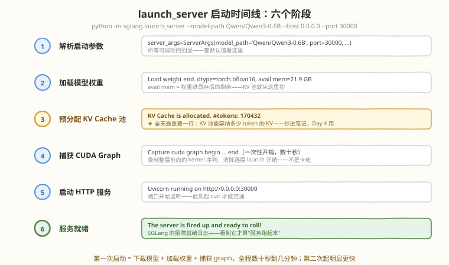
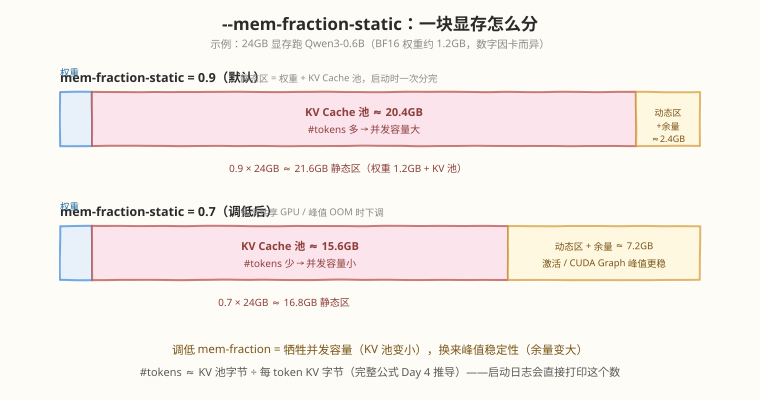

# Day 2：环境搭建 —— 安装并启动 SGLang

> **本周计划**：本日是 [SGLang 一周入门学习计划](notes/SGLang一周入门学习计划.md)的第 2 天。今天独立完成 SGLang 安装，成功启动一个模型推理服务进程，并确认服务正常监听端口
> **今日成败标准**：只有一个——**服务跑起来**。装不上机制讲得再好都是零，跑起来了今天的任务就完成了 90%
> **时间投入**：2.5h（理论 20 分钟 + 实践 90 分钟 + 日志精读 20 分钟 + 总结 20 分钟）
> **面试考察度**：⭐⭐⭐ "为什么预分配显存 / mem-fraction 怎么调"是推理部署方向的高频工程题

---

## 🎯 目标

通过今天的学习，你将：

1. 用一张清单确认硬件/软件环境（GPU 显存、Python 3.10+、CUDA 12.x/13.0、PyTorch 2.x），避免"装完发现跑不动"
2. 掌握 **pip（uv）与 Docker** 两条安装路径的取舍——前者轻快、后者免踩依赖坑，后者也是生产部署的真实形态
3. 用 `python -m sglang.launch_server` 启动第一个服务，看懂启动命令的每个参数
4. 逐行读懂启动日志的六个阶段，**把 `KV Cache is allocated. #tokens: xxxxxx` 这个数字抄进笔记**——Day 4 讲 KV Cache 时的关键伏笔
5. 掌握 `/health`、`/get_model_info`、`/v1/models` 三个验证端点，以及 FlashInfer 报错 / OOM / 端口占用三类故障的排查套路

> 💡 **前置知识**：[Day 1 认识 SGLang](day1.md)——知道推理引擎解决吞吐/延迟/显存三大问题即可
> ⚠️ **环境要求**：Linux + NVIDIA GPU（学习阶段建议显存 ≥ 8GB，跑 Qwen3-0.6B 这类 0.6B～8B 小模型）；SGLang 也支持 AMD ROCm / TPU，但入门阶段强烈建议 NVIDIA——生态文档、镜像、踩坑资料都最全

---

## 为什么今天只干一件事

环境是新手最大的坑：SGLang 依赖 FlashInfer 等 CUDA 算子库，**CUDA / PyTorch / 算子库三者版本错配**产生的报错往往深不见底。今天把坑集中踩完，后面 5 天才能专注机制本身：

| 心态 | 问题 | 今天的做法 |
|------|------|-----------|
| 环境差不多就开装 | CUDA 与 PyTorch 版本错配，报错看不懂 | 先跑完 2.1 的检查清单再动手 |
| 只求装上 | 装完不知道怎么验证服务活着 | 起服务必 curl 健康检查（任务 D） |
| 把日志当噪音滚过去 | 丢掉 `#tokens` 等关键信息 | 按 2.3 的地图逐行读日志，关键数字抄进笔记 |

> 💡 **一句话总结**：今天产出的"能跑起来的服务"是后面 5 天全部实验的载体；日志里抄下来的数字，是 Day 4/5/6 做实验的原材料。

---

## 核心概念

### 2.1 环境要求：一张清单查完

| 项目 | 要求 | 检查命令 | 说明 |
|------|------|---------|------|
| GPU | NVIDIA，显存 ≥ 8GB 起步 | `nvidia-smi` | 显存决定能跑多大的模型：0.6B/1.5B/7B/8B 依次需要约 2/4/15/17GB 起步（BF16 权重 + KV 池） |
| Python | 3.10+ | `python3 --version` | v0.5.x 硬性要求 |
| CUDA | 12.x / 13.0 | `nvcc --version`（或看 `nvidia-smi` 右上角） | 驱动版本 ≥ CUDA runtime 即可 |
| PyTorch | 2.x | `python3 -c "import torch; print(torch.__version__)"` | `sglang[all]` 会自动带上匹配版本 |
| 磁盘 | ≥ 20GB 空闲 | `df -h ~/.cache/huggingface` | 模型权重 + 编译缓存 |
| 网络 | 能访问 HuggingFace | 首次下载模型时 | 国内可设 `export HF_ENDPOINT=https://hf-mirror.com` 镜像 |

> ⚠️ **显存账要提前算**：权重 BF16 约 `参数量 × 2 字节`——7B 模型光权重就 ~14GB，8GB 的卡连权重都放不下（此时只能上量化版本或换卡）。**显存下限由权重决定，引擎优化的是权重之上的 KV 空间**（Day 1 的边界认知，在这里兑现）。

### 2.2 四种安装方式：选哪条路

| 方式 | 命令要点 | 隔离性 | 适用场景 |
|------|---------|--------|---------|
| **pip / uv** | `uv pip install "sglang[all]" --system` | 弱（装进当前 Python 环境） | 干净的 GPU 机器、快速起步；uv 比 pip 快数倍 |
| **Docker**（官方镜像） | `lmsysorg/sglang:latest` | 强（整个环境打包） | 环境乱的机器、公司共用机器、要可复现；**生产部署的真实形态** |
| 源码 | `git clone` + `pip install -e "python[all]"` | 弱 | 要改源码/读最新代码时（进阶，本周不用） |

学习阶段在**前两条**里二选一即可：

- 机器干净、有 root、想省磁盘 → **uv/pip**
- 环境说不清、多卡服务器、不想碰 CUDA 版本地狱 → **Docker**（一行命令拿到配好 FlashInfer 的完整环境）

> ⚠️ **依赖地狱的本质**：SGLang 的性能来自 FlashInfer 等**预编译 CUDA 算子库**，这些库与本地 CUDA / PyTorch 版本强绑定——本地装错的典型症状是 `import` 时报 `undefined symbol` 或 JIT 编译失败。官方 Docker 镜像把整套版本关系打包好了，这是它"最省心"的根本原因。

### 2.3 启动服务时发生了什么：六个阶段



标准启动命令（今天只需要看懂前三个参数）：

```bash
python -m sglang.launch_server \
  --model-path Qwen/Qwen3-0.6B \
  --host 0.0.0.0 \
  --port 30000
```

| 参数 | 作用 | 默认值 | 备注 |
|------|------|--------|------|
| `--model-path` | HF 模型 id 或本地路径 | 必填 | 首次运行自动下载权重 |
| `--host` / `--port` | 监听地址与端口 | `127.0.0.1` / `30000` | 容器外/远程访问必须 `--host 0.0.0.0`，否则 curl 不通 |
| `--mem-fraction-static` | 静态显存占比 | ~0.9（多卡时自动下调） | 见 2.4，今天先会用默认值 |
| `--tp` | 张量并行度 | 1 | 多卡切模型用，Day 5+ 再碰 |
| `--enable-metrics` | 暴露 `/metrics` 端点 | 关 | Day 5/6 观测缓存命中率用 |

对着上面的时间线图读日志（任务 C 的原文，先预习一遍）：

```text
server_args=ServerArgs(model_path='Qwen/Qwen3-0.6B', port=30000, mem_fraction_static=0.88, ...)
Load weight start. path=Qwen/Qwen3-0.6B, ...
Load weight end. type=Qwen3ForCausalLM, dtype=torch.bfloat16, avail mem=21.9 GB
KV Cache is allocated. #tokens: 170432          ← ★ 抄进笔记
Capture cuda graph begin. ... (数十秒，一次性)
Capture cuda graph end.
Uvicorn running on http://0.0.0.0:30000
The server is fired up and ready to roll!      ← 看到它才算就绪
```

三个必懂的日志事实：

1. **`avail mem`**：权重进显存后的剩余量——KV 池就从这里切出来
2. **`KV Cache is allocated. #tokens: N`**：N 是 KV 池**能容纳多少个 token 的 KV**，不是字节数。它除以模型的 context length，约等于"同时能装下几条满长度的请求"（如 170432 ÷ 4096 ≈ 41 条）——Day 4 会推它的公式
3. **`Capture cuda graph` 慢是正常的**：它在录制整个前向的 kernel 发射序列，用来消除每步上百次 kernel launch 的 CPU 开销；第一次启动还要加上模型下载时间，全程数十秒到几分钟都不算卡死

### 2.4 显存是怎么被切分的：`--mem-fraction-static`

SGLang 启动时把整卡显存切成**静态区 + 动态区**，这个参数控制静态区的比例：



$$\text{KV pool} \approx \text{mem\_fraction} \times \text{VRAM} - W_{\text{weights}} - W_{\text{overhead}}$$

即：KV Cache 池 ≈ 静态区配额（比例 × 总显存）− 权重 − 框架开销。

| 取值 | 得到 | 牺牲 | 适用 |
|------|------|------|------|
| 0.9（默认） | 大 KV 池 → `#tokens` 多 → 并发容量大 | 动态区只剩 ~10%，大 batch / 长上下文 / CUDA Graph 峰值时可能 OOM | 独占整卡跑服务 |
| 0.7 | 余量充足，峰值稳定 | KV 池缩水 → `#tokens` 少 → 并发容量下降 | 与其他进程共享 GPU、OOM 排查 |

> 💡 **一句话总结**：`mem-fraction-static` 是"并发容量 vs 峰值稳定性"的旋钮——启动后 `nvidia-smi` 看到显存占满是**预分配的设计行为，不是泄漏**（与 [vLLM 专题](../vllm/README.md) 的 `gpu_memory_utilization` 同一思想）。

---

## 动手实践

### 任务 A：环境检查（10 分钟）

```bash
nvidia-smi            # 确认 GPU、显存、驱动版本
python3 --version     # 3.10+
nvcc --version        # CUDA 12.x / 13.0
docker --version      # 如走 Docker 路线
df -h ~               # 磁盘余量 ≥ 20GB
```

### 任务 B：安装 SGLang（二选一，40 分钟）

**方式一：uv / pip（环境干净的机器）**：

```bash
pip install uv
uv pip install "sglang[all]" --system

# 验证：能 import 且版本为 v0.5.x
python3 -c "import sglang; print(sglang.__version__)"
```

**方式二：Docker（环境乱 / 想隔离 / 追求可复现）**：

```bash
docker pull lmsysorg/sglang:latest

docker run --gpus all -it --rm \
  --shm-size 32g \
  -p 30000:30000 \
  -v ~/.cache/huggingface:/root/.cache/huggingface \
  lmsysorg/sglang:latest bash
```

每个 flag 的含义（面试可能问到）：

| flag | 作用 |
|------|------|
| `--gpus all` | 把宿主机 GPU 直通进容器 |
| `--shm-size 32g` | 扩容 `/dev/shm` 共享内存——默认 64MB，多卡 TP 通信时进程间要走大块共享内存，不足会 Bus error / segfault |
| `-p 30000:30000` | 宿主机 30000 → 容器 30000 的端口映射 |
| `-v ~/.cache/huggingface:...` | 挂载 HF 缓存——模型只下载一次，容器重建不重下 |

预期结果：方式一 `import sglang` 不报错、打印 v0.5.x；方式二进入容器 shell，容器内自带配好的 CUDA / PyTorch / FlashInfer。

> ⚠️ **版本提示**：SGLang 迭代极快（月均多个版本），具体安装命令以 [docs.sglang.ai](https://docs.sglang.ai) 当前文档为准；需要特定版本时 Docker 镜像用 `v0.5.x-cu130-runtime` 这类标签锁定。

### 任务 C：启动你的第一个 SGLang 服务（40 分钟）

```bash
python -m sglang.launch_server \
  --model-path Qwen/Qwen3-0.6B \
  --host 0.0.0.0 --port 30000
```

预期结果：日志依次出现**模型加载 → `KV Cache is allocated. #tokens: xxxxxx` → CUDA graph 捕获 → `The server is fired up and ready to roll!`**。

**必做动作**：把 `#tokens` 的数字抄进笔记，并算一下 `#tokens ÷ 4096 ≈ 能同时容纳多少条满长对话`。Day 4 讲 KV Cache 时，这个数字就是你的实验材料。

> 💡 **观察点**：启动瞬间盯 `nvidia-smi`，能看到显存在"加载权重"和"分配 KV 池"两个阶段阶梯式上涨，最后稳定在接近 `mem-fraction-static × 总显存`——静态预分配的直观证据。

### 任务 D：服务健康检查（10 分钟）

另开一个终端：

```bash
curl -s -o /dev/null -w "%{http_code}\n" http://localhost:30000/health
# 预期输出：200

curl -s http://localhost:30000/get_model_info
# 预期输出：模型元信息 JSON（model_path、max_total_num_tokens 等字段，示意如下）
```

```json
{
  "model_path": "Qwen/Qwen3-0.6B",
  "max_total_num_tokens": 170432,
  "is_generation": true
}
```

```bash
# 第三个端点：OpenAI 兼容的模型列表（明天的接口预览）
curl -s http://localhost:30000/v1/models
```

> ⚠️ **注意**：`get_model_info` 返回的具体字段随版本变化，不必背——重点是**用哪个端点回答哪个问题**：`/health` 答"活着吗"，`/get_model_info` 答"跑的是什么、KV 池多大"，`/v1/models` 答"OpenAI 客户端能看到什么"。

### 排障速查

| 症状 | 可能原因 | 处理 |
|------|---------|------|
| FlashInfer 编译/加载报错（`undefined symbol` 等） | CUDA 与 PyTorch / 算子库版本不匹配 | 最省心：换官方 Docker 镜像 |
| `CUDA out of memory`（启动期） | `mem-fraction-static` 太高 / 模型太大 / 同卡有其他进程 | 先算权重账；权重放得下再降 `--mem-fraction-static 0.7` |
| `Address already in use` | 30000 被占 | 换 `--port 30001` |
| 模型下载慢 / 超时 | 网络问题 | `export HF_ENDPOINT=https://hf-mirror.com` 后重试 |
| 容器内多卡跑挂（Bus error / segfault） | `/dev/shm` 太小 | `--shm-size 32g` |
| 卡在 `Capture cuda graph` 不动 | 不是卡死，是一次性录制开销 | 等待；调试期可加 `--disable-cuda-graph` 跳过 |

### 学习时间安排（共 2.5 小时）

| 时长 | 内容 |
|---|---|
| 20 分钟 | 理论：环境要求、安装方式对比（本文 2.1-2.2） |
| 90 分钟 | 实践：任务 A～D（含踩坑时间——踩坑本身就是今天的学习内容） |
| 20 分钟 | 阅读：对着 2.3 的地图逐行精读自己的启动日志 |
| 20 分钟 | 总结：把启动命令、日志关键行（含 `#tokens`）整理进环境笔记 |

---

## 常见误解澄清

| 误解 | 事实 |
|------|------|
| "8GB 显存能跑 8B 模型" | 8B BF16 权重就 ~16GB，连加载都过不去——显存下限由权重决定，引擎救不了 |
| "启动后 `nvidia-smi` 占满 = 显存泄漏" | `mem-fraction-static` 预分配的设计行为，占用稳定不变才是健康状态 |
| "卡在加载 / graph 捕获 = 服务死了" | 权重磁盘→显存搬运 + CUDA Graph 录制都是一次性开销，第二次启动明显更快 |
| "服务起了但 curl 不通 = 安装失败" | 多半是 `--host` 默认绑 `127.0.0.1`：容器外/远程机器访问必须 `--host 0.0.0.0`，再查防火墙和端口映射 |
| "OOM 了调低 mem-fraction 一定能救" | 若权重本身就放不下，调比例没用；先算权重账，再谈 KV 池的分配 |

---

## 面试要点

**Q1：为什么 SGLang 启动时要"预分配"一大块 KV Cache 显存，而不是按需向 CUDA 申请？**
> 两个原因：① **cudaMalloc 开销大**——它是同步操作，且伴随设备间通信，运行中频繁申请会拖慢每个 decode step；② **碎片化**——请求长短不一、随到随走，反复分配/释放不同大小的块会产生外部碎片，最终"总显存够但没有连续大块"而 OOM。预分配一次大池子，运行时全部用 tensor 切片/偏移管理，零 cudaMalloc 调用——本质是把操作系统的内存管理从 CUDA 驱动层接管到引擎层（PagedAttention 的分页、SGLang 的 token 池都是这个思路）。

**Q2：`--mem-fraction-static 0.9` 和 `0.7` 分别意味着什么？调低它牺牲什么、换来什么？**
> 这个参数划出"静态区 = 权重 + KV Cache 池"占整卡显存的比例。0.9：KV 池大 → `#tokens` 多 → 并发容量大，但激活、CUDA Graph、采样 buffer 等动态开销只剩 10%，峰值时易 OOM；0.7：余量充足、运行稳定，代价是 KV 池缩水、并发容量下降。它是"并发容量 vs 峰值稳定性"的旋钮：独占卡用默认高值，共享 GPU 或排查 OOM 时下调。

**Q3：服务报 `CUDA out of memory`，但 `nvidia-smi` 显示显存还有空余，可能是什么原因？（至少两种）**
> ① **配额性 OOM**：`mem-fraction-static` 太高，静态区（权重+KV 池）占满后，动态区（激活/CUDA Graph 峰值）超出预留——引擎内部分配失败，而 `nvidia-smi` 看到的"空余"其实是留给动态区的部分或系统余量；② **碎片化**：剩余总量够但没有足够大的连续块；③ **同卡其他进程**在启动后动态抢占（`nvidia-smi` 的瞬时读数未必反映分配时刻）；④ **dtype 意外**：`auto` 精度加载出 BF16/FP32 与预期不符，权重占用翻倍。排查顺序：先看进程列表排除抢占，再算权重账，最后降 mem-fraction 复现。

**Q4：在没有公网的内网机器上部署 SGLang，交付物应该包含什么？**
> ① 模型权重完整目录（HF 格式：config.json、tokenizer、safetensors 分片）；② 运行环境——`docker save` 导出的镜像 tar 包，或离线 wheel + 依赖清单（`pip download` 全量打包）；③ 启动脚本（含全部参数与注释）+ 前置检查脚本（驱动 `nvidia-smi`、磁盘、内核）；④ 冒烟验证脚本（health check + 一次最小推理）；⑤ 版本对应表（镜像 ↔ 模型 ↔ 驱动）。核心原则：内网不能触发任何下载和 JIT，一切依赖预打包。

**Q5：官方 Docker 命令里 `--shm-size 32g` 是干什么的？为什么默认值会出事？**
> `/dev/shm` 是 Linux 的共享内存 tmpfs，Docker 默认只给 64MB。多卡张量并行（TP）时进程间通信、PyTorch 的部分数据搬运都要走共享内存，块的大小远超 64MB，会触发 Bus error 或 segfault——且报错位置常常离真正的病因很远，是经典的"隐形坑"。32g 是官方给出的稳妥值；单卡学习场景即使不设也大概率没事，但养成习惯。

---

## 今日小结

| 收获 | 具体内容 |
|------|----------|
| 标准入口 | `python -m sglang.launch_server --model-path <模型> --host 0.0.0.0 --port 30000` |
| 两条安装路径 | uv/pip（干净机器、轻快）vs Docker（免依赖地狱、可复现、生产形态）；`--shm-size 32g` 的原因 |
| 日志三关键行 | `Load weight end`（avail mem）→ `KV Cache is allocated. #tokens: N`（KV 池容量，Day 4 伏笔）→ `The server is fired up and ready to roll!`（就绪） |
| 显存切分 | `mem-fraction-static`：静态区（权重+KV 池）比例；调低 = 牺牲并发容量换峰值稳定 |
| 验证与排障 | `/health`、`/get_model_info`、`/v1/models` 三端点；FlashInfer 报错→Docker、OOM→先算权重账再降比例、端口占→换 port |

**自测清单**（能答出才算过关）：

- [ ] 不看笔记写出完整启动命令（含 host/port 参数及原因）
- [ ] 说出默认端口 30000 和 `/health` 端点的作用
- [ ] 解释 `mem-fraction-static` 调低牺牲什么、换来什么
- [ ] 从自己的日志里指出 `#tokens` 行，说出它除以 context length 的含义
- [ ] 说出 pip 与 Docker 各自的适用场景，以及 `--shm-size 32g` 存在的理由

**📦 今日产出**：成功启动的 SGLang 服务 + 一份记录启动命令、日志关键行（含 KV cache `#tokens` 数）的环境笔记。

---

> 📌 **明日预告**：Day 3 基本使用——用三种方式调你今天起的服务：curl 原生 `/generate`、OpenAI SDK（只改 `base_url`）、Python 离线 `sglang.Engine`。流式输出时留意"第一个字出现得很快、后续匀速"——那就是 TTFT + TPOT 的体感，Day 4 讲原理。
