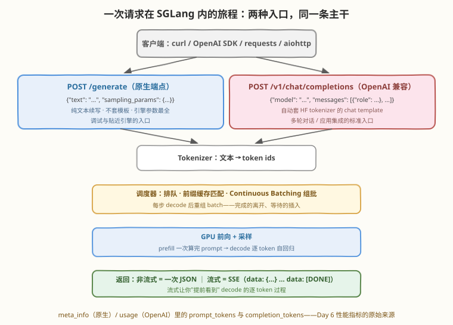
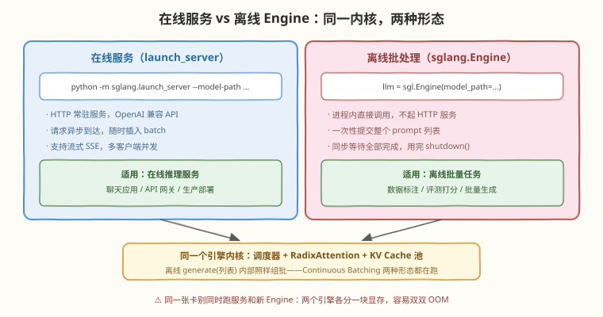

# Day 3：基本使用 —— API 调用与 OpenAI Compatible API

> **本周计划**：本日是 [SGLang 一周入门学习计划](notes/SGLang一周入门学习计划.md)的第 3 天。熟练使用三种方式调用 SGLang：curl 原生 API、OpenAI SDK、Python 离线 Engine，并理解 OpenAI Compatible API 为什么成为行业标准
> **今日成败标准**：四种调用方式（curl / OpenAI SDK / 流式 / 离线 Engine）各跑通一次，留下一份可复用的 `chat_client.py`——它们是后面 4 天所有实验的"遥控器"
> **时间投入**：2.5h（理论 30 分钟 + 实践 100 分钟 + 阅读 20 分钟）
> **面试考察度**：⭐⭐ "OpenAI 兼容意味着什么 / 在线离线怎么选"是工程岗常考题；今天的体感观察（TTFT/TPOT）直接为 Day 4/6 铺路

---

## 🎯 目标

通过今天的学习，你将：

1. 用 curl 调通原生 `/generate` 端点，看懂返回里的 `text` 与 `meta_info`（prompt/completion token 数——Day 6 指标的原始来源）
2. 用 OpenAI SDK 调通 `/v1/chat/completions`——理解"只改 `base_url` 就能迁移"背后的兼容层设计
3. 说清 `/generate` 与 `/v1/chat/completions` 的本质区别：**chat template 由谁套**（引擎视角下两者是同一个引擎的两个门）
4. 掌握 `temperature` / `top_p` / `max_tokens` 三个采样参数的语义，理解"同一模型 + 不同参数 = 不同产品性格"
5. 用离线 `sgl.Engine` 做批量推理，建立"在线服务 vs 离线批处理"的选型判断

> 💡 **前置知识**：[Day 2 环境搭建](day2.md)——今天的所有实践都对着你昨天启动的服务发请求（任务 D 除外）
> ⚠️ **环境要求**：Day 2 的服务正在运行（`/health` 返回 200）+ `pip install openai`；浏览器能访问 `http://localhost:30000/docs`（SGLang 自带的 Swagger UI）

---

## 为什么 API 形态值得专门学一天

推理引擎的产出就是一个 API——**不会调它，后面所有机制实验都无从做起**。常见的能力缺口：

| 只会一种方式 | 问题 | 今天的做法 |
|-------------|------|-----------|
| 只会 curl | 不会用 SDK 生态（LangChain、重试、流式封装） | 四种方式全打通，各知其位 |
| 只会 OpenAI SDK | 不知道原生端点参数最全、不知道引擎内部发生了什么 | 先 curl 原生端点，再上 SDK |
| 只会离线 Engine | 不理解服务化（并发、流式、常驻）的价值 | 对比在线/离线两种形态 |
| 把 API 当黑盒 | 流式时"首字快、后续匀速"视而不见 | 每个任务带观察点，攒 Day 4/6 的素材 |

> 💡 **一句话总结**：API 是引擎的全部对外表面。今天把它摸熟，明天开始拆引擎内部时，你知道每一层对应你发出的哪个请求字段。

---

## 核心概念

### 3.1 一次请求的旅程：两种入口，同一条主干



把这张图从上到下走一遍，就回答了"程序如何问模型问题"：

1. **客户端**发出 HTTP 请求（curl / OpenAI SDK / requests / aiohttp 都只是不同的"嘴"）
2. **入口分岔**：`/generate` 收纯文本，不做任何模板处理；`/v1/chat/completions` 收 `messages` 列表，由服务端**自动套用 HF tokenizer 自带的 chat template**（可用 `--chat-template` 覆盖），把多轮对话渲染成模型期望的格式
3. **Tokenizer** 把文本变成 token ids
4. **调度器**排队、做前缀缓存匹配、组批（Continuous Batching）
5. **GPU 前向 + 采样**：prefill 一次算完 prompt，decode 逐 token 自回归（明天主角）
6. **返回**：非流式一次 JSON；流式走 SSE（`data: {...}` 逐块推送，`data: [DONE]` 结束）

> 💡 **一句话总结**：两种入口在 chat template 处分岔，之后汇入同一条主干——**它们不是两套引擎，是同一个引擎的两个门**。这也是 SGLang 与 vLLM 可以"无缝互换"的原因：两家的 `/v1` 门长得一模一样（对照 [vLLM 专题](../vllm/README.md) Day 1）。

### 3.2 原生 `/generate` 端点：最贴近引擎的接口

```json
POST /generate
{
  "text": "北京是中国的首都，上海是",
  "sampling_params": {"max_new_tokens": 32, "temperature": 0.7}
}
```

返回结构（示意，字段以版本为准）：

```json
{
  "text": "北京是中国的首都，上海是中国最大的经济中心城市……",
  "meta_info": {
    "prompt_tokens": 12,
    "completion_tokens": 32,
    "finish_reason": {"type": "length", "length": 32}
  }
}
```

三个实用细节：

| 细节 | 说明 |
|------|------|
| `text` 包含 prompt | 原生端点返回的是"prompt + 续写"的累积文本——与 OpenAI 端点只返回新增内容**不同**，拼接日志时注意别重复 |
| `meta_info` 是宝藏 | `prompt_tokens` / `completion_tokens` 就是 Day 6 性能指标的原始数据；`finish_reason` 告诉你是自然停止（`stop`）还是到长度上限（`length`） |
| 参数命名 | 生成长度上限叫 `max_new_tokens`（OpenAI 端点叫 `max_tokens`）——**同一个语义，两个名字** |

**什么时候用它**：调试（响应最"裸"）、续写类任务（不需要对话格式）、想用引擎全部参数时（原生端点暴露的 sampling 参数最全）。

### 3.3 OpenAI Compatible API：为什么它是行业标准

SGLang 在 `/v1` 下实现了与 OpenAI 官方一致的接口族：

| 端点 | 作用 | 常用度 |
|------|------|--------|
| `/v1/chat/completions` | 对话补全（messages 格式，多轮） | ⭐ 最常用 |
| `/v1/completions` | 文本补全（prompt 格式） | 常用 |
| `/v1/models` | 模型列表（SDK 初始化时探测用） | 常用 |
| `/v1/embeddings` | 向量化（需模型支持） | 按需 |
| `/v1/responses` | 新版 Responses API 风格 | 按需 |

**为什么"兼容"这么值钱**：

| 价值 | 解释 |
|------|------|
| 迁移成本趋近于零 | 任何为 OpenAI 写的客户端（LangChain、各语言 SDK），改 `base_url` + `api_key` 两个参数就能指向自部署模型 |
| 消除供应商锁定 | 代码不绑死任何一家——今天指向 SGLang，明天切 vLLM 或官方 API，应用层不动 |
| 生态免费复用 | 流式解析、重试、观测、计费逻辑全部现成 |

对接三要素（今天实践 B 的全部秘密）：

```python
client = OpenAI(
    base_url="http://localhost:30000/v1",  # 你的 SGLang 服务 + /v1
    api_key="EMPTY",                       # 任意非空字符串；服务默认不鉴权
)
# model 名必须与启动时的 --model-path 一致（大小写也要对）
```

> ⚠️ **"兼容"的边界**：接口 schema 一致 ≠ 行为完全一致——model 名必须对上、上下文长度受你所跑模型限制、function calling / tool calls 的支持度取决于引擎与模型组合。迁移真实应用前要跑回归（见面试 Q4）。
>
> 💡 **侦察利器**：浏览器打开 `http://localhost:30000/docs`——SGLang 自带 Swagger UI，所有端点、参数、返回 schema 都能在线查看和试调；`/redoc` 是另一种排版，`/openapi.json` 是机器可读的规范。

### 3.4 Sampling 参数：同一模型的不同"性格"

| 参数 | 语义 | 典型取法 |
|------|------|---------|
| `temperature` | 0 = 贪心解码（argmax，确定）；越大越随机 | 客服/代码 0～0.3；创意写作 0.7+ |
| `top_p` | 核采样：只在累计概率前 p 的 token 里采样 | 0.9 / 0.95；与 temperature 一般只调一个 |
| `max_tokens`（原生叫 `max_new_tokens`） | 生成长度上限，**不含 prompt** | 按业务截断，防失控 |

关键认知两条：

1. **每次请求独立指定**——同一个服务、同一个模型，客服业务发 `temperature=0.1`、创意业务发 `temperature=1.0`，互不干扰
2. `temperature=0` 让输出**基本**可复现（调试期首选），但并发 batch 下的 kernel 级非确定性仍可能带来偶发差异——"完全确定性"是做不到的

### 3.5 在线服务 vs 离线 Engine：同一内核的两种形态



| 维度 | 在线：`launch_server` | 离线：`sgl.Engine` |
|------|----------------------|---------------------|
| 形态 | HTTP 常驻服务 | 进程内直接调用，无 HTTP |
| 请求模式 | 随时异步到达，随时插入 batch | 一次性提交列表，同步等全部完成 |
| 流式输出 | 支持（SSE） | 不支持（一次返回全部） |
| 底层 | 调度器 + RadixAttention + KV 池 | **完全相同** |
| 典型场景 | 聊天应用、API 服务、生产部署 | 数据标注、评测打分、批量生成 |

> ⚠️ **两个易错点**：① 离线模式**不是**"for 循环逐条 generate"——`llm.generate(prompts)` 接收列表，内部照样组批（Continuous Batching 两种形态都在跑），所以批量任务远快于逐条；② 同一张卡**别同时**跑在线服务和新建 Engine——两个引擎各预分配一块显存，容易双双 OOM，跑任务 D 前先停掉服务。

---

## 动手实践

### 任务 A：curl 调用原生 API（20 分钟）

```bash
curl http://localhost:30000/generate \
  -H "Content-Type: application/json" \
  -d '{
    "text": "北京是中国的首都，上海是",
    "sampling_params": {"max_new_tokens": 32, "temperature": 0.7}
  }'
```

```text
# 预期输出（示意）
{"text":"北京是中国的首都，上海是中国最大的经济中心城市……",
 "meta_info":{"prompt_tokens":12,"completion_tokens":32,"finish_reason":{"type":"length","length":32}}}
```

**观察点**：

1. 对比返回 `text` 的开头与你发的 prompt——原生端点返回的是"prompt + 续写"（见 3.2）
2. 抄下 `meta_info` 里的两个 token 数——**今天记录的这组数字，就是明天讲 TTFT/TPOT、Day 6 算吞吐的原始素材**
3. 再发一次 `temperature: 0` 的相同请求，多跑几遍，看输出是否稳定（3.4 的第 2 条认知）

### 任务 B：OpenAI SDK 调用（30 分钟）

```bash
pip install openai
```

```python
# chat_client.py —— 可复用的 OpenAI 兼容客户端（Day 7 Mini Project 的零件）
# 运行: python3 chat_client.py

from openai import OpenAI

client = OpenAI(base_url="http://localhost:30000/v1", api_key="EMPTY")

resp = client.chat.completions.create(
    model="Qwen/Qwen3-0.6B",   # 必须与启动时的 --model-path 一致
    messages=[
        {"role": "system", "content": "你是一个简洁的助手。"},
        {"role": "user", "content": "用一句话解释什么是 Continuous Batching。"},
    ],
    temperature=0.7,
    max_tokens=128,
)
print(resp.choices[0].message.content)
print("用量：", resp.usage)
```

```text
# 预期输出（具体文本因模型而异）
Continuous Batching 是一种推理调度技术：每个解码步结束后重组批次……
用量： CompletionUsage(completion_tokens=41, prompt_tokens=27, total_tokens=68, ...)
```

**观察点**：

1. `usage` 里的 token 数与任务 A 的 `meta_info` 对应——同一个数据，两种接口的呈现
2. 若输出里出现 `<think>…</think>`：那是 Qwen3 思考模式的模型行为，不是 API 用错了（Day 1 已见过）
3. 顺手用浏览器打开 `http://localhost:30000/docs`，找到你刚调用的两个端点，看看 schema 里还有哪些参数

### 任务 C：流式输出（20 分钟）

把任务 B 的调用加上 `stream=True`，逐 chunk 打印：

```python
# chat_stream.py —— 流式调用：体验 TTFT 与 TPOT 的体感
# 运行: python3 chat_stream.py

from openai import OpenAI

client = OpenAI(base_url="http://localhost:30000/v1", api_key="EMPTY")

stream = client.chat.completions.create(
    model="Qwen/Qwen3-0.6B",
    messages=[{"role": "user", "content": "讲一个 50 字的小故事"}],
    stream=True,
)
for chunk in stream:
    delta = chunk.choices[0].delta.content
    if delta:
        print(delta, end="", flush=True)
print()
```

**观察点**（今天的重点体感）：**第一个字出现得很快，之后匀速地"蹦"出来**——等待首字的那段是 prefill + 排队（决定 TTFT），之后每个字的间隔是 decode 的节奏（决定 TPOT）。记住这个体感，明天讲两阶段原理时对号入座，Day 6 用数字量化它。

> ⚠️ **注意**：流式和非流式的**生成速度完全一样**——变的只是传输方式（边生成边推 vs 攒齐再发）。流式的价值是让用户提前看到首字，降低感知延迟。

### 任务 D：离线 Engine 批量推理（30 分钟）

先停掉 Day 2 的服务（Ctrl-C），释放显存——两个引擎不能共享一张卡：

```python
# offline_engine.py —— 离线批量推理：不起 HTTP 服务
# 运行: python3 offline_engine.py

import sglang as sgl

llm = sgl.Engine(model_path="Qwen/Qwen3-0.6B")

prompts = [
    "中国的首都是",
    "法国的货币是",
    "1 + 1 =",
] * 10   # 30 个请求，观察批量处理速度

outs = llm.generate(prompts, {"max_new_tokens": 16, "temperature": 0})
for o in outs[:3]:
    print(o["text"])
llm.shutdown()
```

```text
# 预期输出（示意；注意运行总耗时——远小于"逐条调用 × 30"）
中国的首都是北京。…
法国的货币是欧元。…
1 + 1 = 2…
```

**观察点**：30 个请求几乎"同时"完成——它们被组进同一个 batch，一次前向同时推进所有请求的 decode。**这个加速来自 Continuous Batching，明天原理课的主角**。用完记得 `llm.shutdown()`（或直接退出进程），显存才释放。

### 排障速查

| 症状 | 可能原因 | 处理 |
|------|---------|------|
| `Connection refused` | 服务没起 / 端口不对 / `--host` 没绑 `0.0.0.0`（容器/远程） | 先 `curl /health` 确认服务活着 |
| 404 / `model not found` | `model` 字段与 `--model-path` 不一致（大小写也要对） | 对齐模型名，或 `curl /v1/models` 看服务认的名字 |
| 任务 D 启动即 OOM | 服务还占着显存，又起了 Engine | 停服务再跑；或 Engine 传 `mem_fraction_static=0.5` |
| 输出全是 `<think>` | Qwen3 思考模式（模型行为） | 不是 bug；想关在 prompt 末尾加 `/no_think` |
| `max_tokens` 报错/截断 | 超出模型上下文上限（prompt + 生成长度） | 减小 `max_tokens` 或换长上下文模型 |

### 学习时间安排（共 2.5 小时）

| 时长 | 内容 |
|---|---|
| 30 分钟 | 理论：请求旅程、OpenAI 兼容的意义、sampling 参数（本文 3.1-3.5） |
| 100 分钟 | 实践：任务 A～D（含观察点记录——观察点比跑通更重要） |
| 20 分钟 | 阅读：Swagger UI（`/docs`）里翻端点列表，看还支持哪些参数 |

---

## 常见误解澄清

| 误解 | 事实 |
|------|------|
| "OpenAI 兼容 = 和 OpenAI 行为一模一样" | 只是**接口 schema** 一致；model 名、上下文长度、function calling 支持度仍取决于你的引擎与模型 |
| "`/generate` 和 `/v1` 是两套引擎" | 同一个引擎——差别只在入口有没有套 chat template，之后汇入同一条调度与前向主干 |
| "流式输出比非流式生成得快" | 生成速度一样，只是边生成边推送；流式降低的是**感知**延迟（首字提前出现） |
| "离线 Engine 快是因为没有 HTTP" | HTTP 开销相对推理本身微不足道；批量快的真正原因是列表被组进 batch（Continuous Batching） |
| "temperature=0 就能完全复现" | 只能"基本"复现——并发 batch 下 kernel 级非确定性仍可能造成偶发 token 差异 |

---

## 面试要点

**Q1：为什么流式输出时"第一个 token"和"后续 token"的等待感受完全不同？背后对应推理的哪两个阶段？**
> 首 token 的等待 = 排队 + **prefill**（把整个 prompt 一次性并行算完，计算密集，prompt 越长等得越久）；之后每个 token 的间隔 = **decode** 的节奏（逐 token 自回归，每步前向只出 1 个 token）。两个等待感受对应 TTFT 与 TPOT 两个指标——流式输出把这条时间结构直接"播放"给了用户。

**Q2：任务 D 中 30 个请求批量完成远快于逐个串行。如果 batch 无限大，吞吐会无限涨吗？瓶颈在哪里出现？**
> 不会。decode 是 memory-bound，batch 增大前期近乎免费（搬一次权重服务更多请求），但有三个天花板：① **KV 显存容量**——Day 2 日志里的 `#tokens` 是池子上限，batch 大到装不下就要排队/抢占；② **算力上限**——batch 继续增大后单步计算时间显著上升，延迟恶化；③ 调度与采样开销。所以吞吐曲线会饱和甚至回落，存在拐点——Day 6 的并发阶梯实验就是去找它。

**Q3：线上要同时接"实时聊天"和"每晚批量生成日报"两种业务，怎么部署？**
> 负载隔离 + 错峰。两类负载特征相反：实时要低延迟（小 batch 优先、并发受控），批量要吞吐（大 batch 灌满）。方案：① 两份权重两个实例——白天在线服务常驻，夜间批量用独立的离线 Engine 或专用服务实例跑；② 至少错峰调度，别让批量任务和实时请求抢同一个 KV 池与并发额度。反模式是单实例混跑：批量大 batch 会把在线用户的 TPOT/TTFT 打爆。

**Q4：一个为 OpenAI GPT 写的应用想切换到本地模型，除了 `base_url` 还可能有哪些不兼容点？**
> ① **model 名**——必须与 `--model-path` 一致，涉及路由/计费的逻辑要改；② **上下文长度**——超长请求会直接报错或截断，GPT 的 token 预算逻辑要重估；③ **function calling / tool calls / JSON mode** 的支持度与行为差异；④ **tokenizer 不同**——token 计数、截断、按 token 计费的逻辑全部漂移；⑤ 高级参数（seed、logit_bias 等）支持程度不一。工程结论：迁移必须带回归测试集，不能只改一行就上线。

**Q5：`/generate` 和 `/v1/chat/completions` 的本质区别是什么？各自适合什么场景？**
> 引擎视角：同一个引擎的两个入口。区别在——`/generate` 收纯文本、不套模板、返回累积文本（含 prompt）、参数最全（`max_new_tokens` 等原生命名）；`/v1/chat/completions` 收 messages、由服务端自动套 HF chat template、只返回新增内容 + 标准 usage、命名与 OpenAI 一致。场景：调试、续写任务、要引擎全参数 → 原生；应用集成、多轮对话、生态复用 → OpenAI 端点。

---

## 今日小结

| 收获 | 具体内容 |
|------|----------|
| 请求旅程 | 客户端 → 入口（原生不套模板 / OpenAI 端点套 chat template）→ tokenize → 调度组批 → 前向采样 → JSON/SSE 返回 |
| 两种入口的关系 | 同一引擎的两个门：`/generate` 最裸最全，`/v1` 是行业标准兼容层（base_url + api_key + model 三要素） |
| 原生端点细节 | `text` 含 prompt；`meta_info` 的 prompt/completion tokens 是性能分析原始数据 |
| 采样参数 | temperature（0=贪心）/ top_p / max_tokens（=max_new_tokens，不含 prompt）；每请求独立 |
| 在线 vs 离线 | launch_server（常驻、异步、流式）vs sgl.Engine（进程内、批量、同步）——内核完全相同；同卡互斥 |

**自测清单**（能答出才算过关）：

- [ ] 不看笔记用 curl 调通 `/generate`，说出 `meta_info` 两个字段的含义
- [ ] 写出 OpenAI SDK 对接三要素，解释 model 名的约束
- [ ] 说出 `/generate` 与 `/v1/chat/completions` 的两点本质区别（模板、返回内容）
- [ ] 解释流式输出"首字快、后续匀速"对应的两阶段与两个指标
- [ ] 说出在线/离线两种形态各自适合的场景，以及为什么不能同卡混跑

**📦 今日产出**：成功通过 curl / OpenAI SDK / 流式 / 离线 Engine 四种方式调用 SGLang + 一份可复用的 `chat_client.py`。

---

> 📌 **明日预告**：Day 4 推理基础——Prefill / Decode / KV Cache / Continuous Batching 四个通用内功。今天攒下的三样东西明天全部要用：流式输出里"首字快、后续匀速"的体感（两阶段的证据）、任务 D 批量加速的疑问（Continuous Batching 的证据）、Day 2 抄下的 `#tokens` 数字（KV Cache 池容量）。
