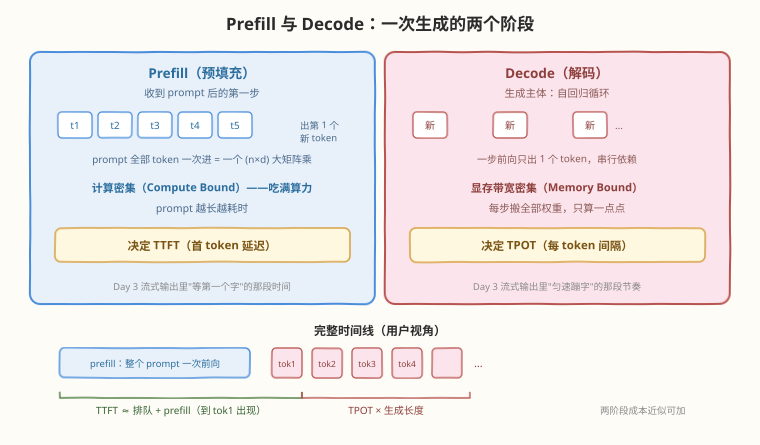
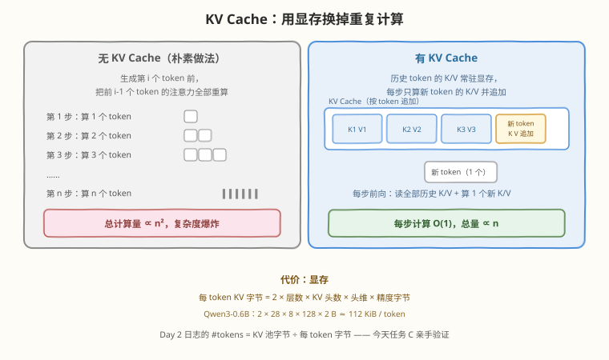
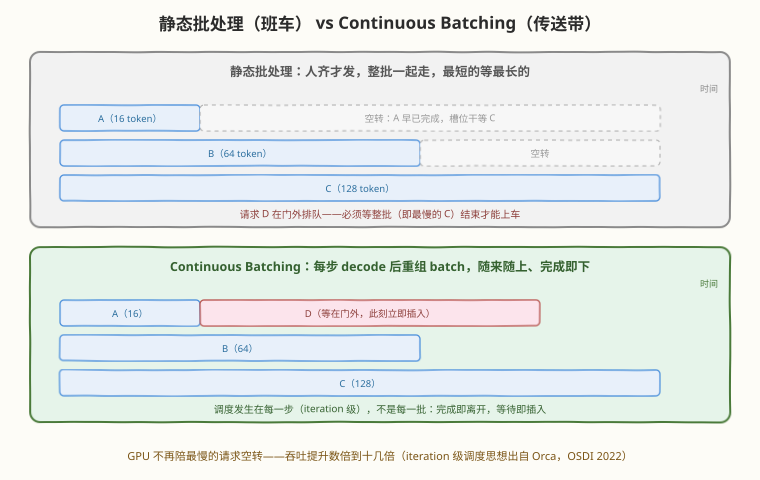

# Day 4：LLM 推理基础 —— Prefill / Decode / KV Cache / Continuous Batching

> **本周计划**：本日是 [SGLang 一周入门学习计划](notes/SGLang一周入门学习计划.md)的第 4 天。今天讲推理引擎的"通用内功"——这些概念不属于 SGLang 独有，但不理解它们就无法理解 SGLang 的任何优化
> **今日成败标准**：不看资料画出"一次请求在引擎内的完整旅程"图，并能解释图上每个环节为什么存在
> **时间投入**：3h（理论 60 分钟 + 实践 100 分钟 + 总结 20 分钟）——**全周理论最重的一天**，明天开始回落
> **面试考察度**：⭐⭐⭐⭐ KV Cache 与 Continuous Batching 是推理方向面试出现频率最高的两个考点，几乎必问

---

## 🎯 目标

通过今天的学习，你将：

1. 说清 **Prefill 与 Decode** 在计算内容、资源瓶颈、对应指标上的三点差异，并解释差异的根源（自回归依赖作用在哪个位置）
2. 推导 **KV Cache 的显存公式**，用 Day 2 记录的 `#tokens` 亲手验证估算，理解"省计算、费显存"这笔交易
3. 理解 **Continuous Batching** 的调度时机——在"每一步"而不是"每一批"——以及它消除的两种浪费
4. 用两个实验"看见"抽象概念：TTFT 随 prompt 长度变化（prefill 成本的证据）、短请求不等长请求（continuous batching 的证据）
5. 建立 **Memory Bound / Compute Bound** 的判断力，顺带理解 PD 分离架构的动机（了解即可）

> 💡 **前置知识**：[Day 3 基本使用](day3.md)——今天的实验对着你的服务发请求；Day 3 流式输出的"首字快、后续匀速"体感和批量加速疑问，今天全部揭晓
> ⚠️ **环境要求**：Day 2 的服务正在运行（任务 A/B）+ Day 2 抄下的 `#tokens` 数字（任务 C 的原材料）

---

## 为什么今天理论最重

今天讲的四个概念是所有推理引擎（vLLM / TensorRT-LLM / SGLang）共同的地基。跳过它们直奔 SGLang 特性，会在每一个特性上翻车：

| 今天不搞懂 | 后面会怎样 |
|-----------|-----------|
| Prefill 是什么 | 明天的 RadixAttention 是"缓存 prefill 的结果"——不知道在缓存什么 |
| Decode 的成本结构 | 明天的 Chunked Prefill 是"切开 prefill 别阻塞 decode"——不知道在平衡什么 |
| KV Cache 的显存代价 | Day 2 的 `#tokens` 永远只是一串数字；看不懂任何显存问题 |
| Continuous Batching | Day 6 的所有并发/吞吐曲线都变成玄学 |

> 💡 **一句话总结**：Day 1～3 你在"用"引擎，今天开始"懂"引擎——SGLang 的每个独门优化，都是在这四个概念上做文章。

---

## 核心概念

### 4.1 Token：一切计量的单位

模型不看"字"也不看"词"，看 **token** 序列：

- 1 个 token ≈ 0.5～1 个汉字 / 0.75 个英文单词（分词器决定，粗略即可）
- **所有性能指标都按 token 计**：TTFT 是"到第一个 token 的时间"、吞吐是"每秒多少 token"、计费按 token
- **所有显存账也按 token 计**：KV Cache 的占用 = token 数 × 每 token 字节数（今天 4.3 的公式）
- 上下文长度（context length）的单位也是 token——Day 2 的 `#tokens ÷ 4096` 里那个 4096 就是它

### 4.2 Prefill 与 Decode：性质相反的两阶段



| 维度 | Prefill（预填充） | Decode（解码） |
|------|------------------|----------------|
| 计算内容 | 一次性并行处理 prompt 的**全部** token | 每次前向只算** 1 个**新 token |
| 为什么能/不能并行 | prompt 在生成开始前**全部已知**，无输出依赖，拼成 (n×d) 矩阵一次算 | 第 i+1 个 token 的输入包含第 i 个 token 的**输出**——必须等它出来 |
| 资源瓶颈 | **Compute Bound**（算力）——大矩阵乘吃满 tensor core | **Memory Bound**（显存带宽）——每步把全部权重搬一遍，只算一点点 |
| 决定的指标 | **TTFT**（首 token 延迟 = 排队 + prefill） | **TPOT**（每 token 间隔） |
| 优化方向 | 前缀缓存（Day 5）、chunked prefill（Day 5）、PD 分离 | 批处理（4.4）、CUDA Graph、投机解码 |

**关键洞察**：两阶段成本近似**可加**——一次请求的总耗时 ≈ prefill（看 prompt 长度）+ n × 每步 decode（看生成长度）。这条加法式就是今天任务 A 要验证的东西，也是"白天聊天 / 夜里摘要"两类负载瓶颈判断（面试 Q4）的依据。

> 💡 **对照 Day 3 的体感**：流式输出时"等第一个字"的那段 = 排队 + prefill；之后"匀速蹦字"的节奏 = decode 的 TPOT。你已经感受过这两个阶段，今天只是给体感配上名字。

### 4.3 KV Cache：用显存换掉重复计算

注意力计算需要每个 token 的 **Key / Value 投影**。生成第 i 个 token 时，它要"看"前面所有 token 的 K/V——这些 K/V 每步都要用，但内容**永远不变**。KV Cache 就是把它们存进显存，避免每步重算：



**这笔交易的账**：

- **买到的**：没有缓存时，生成第 i 个 token 要重算前 i-1 个 token 的注意力——生成 n 个 token 的总计算量 $\propto n^2$；有缓存后每步只算 1 个新 token 的 K/V，总量 $\propto n$。**计算量从平方降到线性**
- **付出的**：显存。每 token 的 KV 字节数：

$$\text{KV bytes per token} = 2 \times L \times H_{kv} \times d_{head} \times b$$

| 符号 | 含义 | Qwen3-0.6B 取值 |
|------|------|-----------------|
| 2 | K 和 V 两份 | 2 |
| $L$ | 层数（`num_hidden_layers`） | 28 |
| $H_{kv}$ | **KV 头数**（`num_key_value_heads`） | 8 |
| $d_{head}$ | 每头维度（`head_dim`） | 128 |
| $b$ | 精度字节数（BF16 = 2） | 2 |

代入：$2 \times 28 \times 8 \times 128 \times 2 = 114{,}688$ B ≈ **112 KiB / token**。

> ⚠️ **GQA 就藏在这个公式里**：Qwen3-0.6B 有 16 个注意力头（Q 头），但只有 **8 个 KV 头**——多个 Q 头共享一组 KV，KV Cache 直接减半。这就是 GQA（分组查询注意力）省显存的直接体现；DeepSeek 的 MLA 更进一步，把整个 KV 压成一个低秩 latent（详见 [Week 6](../../daily/week6/README.md)）。算 KV 账永远用 $H_{kv}$，不是注意力头数——高频面试坑。

**跟 Day 2 对账**：启动日志的 `KV Cache is allocated. #tokens: N` 说的就是——

$$N = \frac{\text{pool bytes}}{\text{KV bytes per token}}$$

即 `#tokens` = KV 池字节 ÷ 每 token KV 字节。

拿 Day 2 的示例数字验算：170432 × 114,688 B ≈ 19.5 GB，与日志 `avail mem = 21.9 GB` 同量级（差额是 CUDA Graph、激活等开销）——公式没记错。**任务 C 会让你用自己的模型重算一遍。**

### 4.4 Batch：decode 的"免费午餐"从哪来

Day 1 给过直觉（"搬一次权重服务 1 个和 64 个请求几乎一样贵"），现在从 decode 的机制层面把账算细：

1. decode 每步前向的成本大头是**把全部模型权重从显存搬到计算单元**——搬运量 ∝ 权重大小，**与 batch 里的请求数无关**
2. 增大 batch 只增加计算量；而 decode 是 Memory Bound，计算单元本来就闲置——增加的计算免费塞进等待搬运的空隙里
3. 所以 batch 1 → 64：单步耗时几乎不变，单步产出 ×64——**吞吐近似免费地涨**

免费午餐的边界（Day 6 实测拐点）：

- **KV 显存容量**：batch 里每个请求都占 KV——池子（`#tokens`）满了就得排队或抢占
- **算力上限**：batch 继续增大后，单步计算时间显著上升，延迟开始恶化
- 本质：batch 增大让瓶颈从"带宽"逐步移向"算力 + KV 容量"

### 4.5 Continuous Batching：在"每一步"调度

有了 batch 的概念，下一个问题是**怎么组批**：



| 维度 | 静态批处理 | Continuous Batching |
|------|-----------|---------------------|
| 调度时机 | **每一批**：凑齐一批一起跑，整批结束才放下一批 | **每一步**：每个 decode step 结束后重组 batch |
| 短请求的命运 | 干等同批最长的请求（GPU 槽位空转） | 完成即离开，槽位立刻给等待队列里的新请求 |
| 新请求的命运 | 门口排队，等整批结束 | 随到随插（下一步就进 batch） |
| 类比 | 班车：人齐才发 | 传送带：随来随上、完成即下 |
| 吞吐 | 大量空转 | **提升数倍到十几倍** |

两个值得记住的点：

1. **思想出处**：iteration 级调度来自 Orca 论文（OSDI 2022，[本地 PDF](../../paper/orca/orca.pdf)）——vLLM 和 SGLang 都是站在它肩上
2. **它消除的两种浪费**：请求内浪费（短请求陪长请求空转）+ 请求间浪费（GPU 空闲时新请求进不来）

> 💡 **跟 Day 3 任务 D 对账**：30 个请求"几乎同时完成"、远快于逐条串行——那是 Continuous Batching 把它们组进了同一步前向。今天任务 B 会再给你一个更精细的证据：**短请求不会等长请求**。

### 4.6 Memory Bound vs Compute Bound：一张判断尺子

| | Memory Bound（带宽受限） | Compute Bound（算力受限） |
|--|------------------------|--------------------------|
| 瓶颈 | 搬数据（显存带宽） | 算数据（FLOPS） |
| 识别特征 | 计算单元利用率低，时间 ∝ 数据搬运量 | 计算单元打满，时间 ∝ 计算量 |
| 推理中的映射 | **decode**（每步搬全部权重只算 1 个 token） | **prefill**（大矩阵乘吃满算力） |
| 优化思路 | 增大 batch 摊薄搬运、量化压缩权重 | 更快的 kernel、更大算力的卡 |

**两个阶段性质相反**，是推理系统一系列高级设计的总动机：

- 同一张卡上，prefill 想"猛灌算力"、decode 想"细水长流"——混跑时一个长 prefill 会卡住所有在线用户的 decode（明天 Chunked Prefill 解决的就是它）
- 极致方案是 **PD 分离**（Prefill/Decode 分机器部署，各自按阶段特性配置硬件）——DeepSeek、xAI 等大规模部署采用，本周只需知道存在（进阶计划第 3 周展开）

---

## 动手实践

### 任务 A：用日志"看见" prefill 和 decode（40 分钟）

写一个脚本，对比"短 prompt + 长生成"和"长 prompt + 短生成"的耗时结构：

```python
# observe_phases.py —— 用 TTFT 体检 prefill 与 decode 的成本结构
# 运行: python3 observe_phases.py（服务需在 30000 端口运行中）

import time, json, requests

URL = "http://localhost:30000/generate"

def timed(prompt, max_new_tokens, label):
    t0 = time.time()
    r = requests.post(URL, json={
        "text": prompt,
        "sampling_params": {"max_new_tokens": max_new_tokens, "temperature": 0},
        "stream": True,
    }, stream=True)
    ttft = None
    for line in r.iter_lines():
        line = line.decode("utf-8")
        if not line.startswith("data:"):
            continue
        if line[5:].strip() == "[DONE]":   # Day 3 学过的 SSE 结束标记
            break
        if ttft is None:
            ttft = time.time() - t0        # 第一个数据块 ≈ 首 token 到达
    total = time.time() - t0
    print(f"[{label}]  TTFT≈{ttft:.3f}s   总耗时≈{total:.3f}s")

timed("你好", 200, "短prompt+长生成")
timed("请阅读以下文本：" + "人工智能" * 500, 8, "长prompt+短生成")
timed("请阅读以下文本：" + "人工智能" * 500, 200, "长prompt+长生成(对照)")
```

```text
# 预期输出（示意，数字因机器而异）
[短prompt+长生成]          TTFT≈0.02s   总耗时≈3.8s
[长prompt+短生成]          TTFT≈1.05s   总耗时≈1.15s
[长prompt+长生成(对照)]    TTFT≈1.06s   总耗时≈4.9s
```

**观察点**（对着 4.2 的表逐条验证）：

1. 短 prompt：TTFT 毫秒级，总耗时几乎全是 decode——**decode 主导**
2. 长 prompt：TTFT 明显上升（prefill 要一次算完上千 token），但只生成 8 个所以总耗时短——**prefill 主导**
3. 对照组：TTFT 与第二组接近（**prefill 成本只看 prompt 长度**），总耗时 ≈ TTFT + 200 步 decode——**两阶段成本近似可加**
4. 工程翻译：prompt 长度买 TTFT，生成长度买 TPOT × n——"白天聊天 / 夜里摘要"的瓶颈判断（面试 Q4）就是这条观察

### 任务 B：观察 Continuous Batching（40 分钟）

同时发 8 个"生成长度各不相同"的请求，记录各自的完成时间：

```python
# observe_batching.py —— 验证短请求不等长请求
# 运行: pip install aiohttp && python3 observe_batching.py

import asyncio, aiohttp, time

URL = "http://localhost:30000/generate"

async def one(session, n):
    t0 = time.time()
    async with session.post(URL, json={
        "text": "写一首诗：",
        "sampling_params": {"max_new_tokens": n, "temperature": 0.8},
    }) as r:
        await r.read()
    return n, time.time() - t0

async def main():
    async with aiohttp.ClientSession() as s:
        lengths = [16, 32, 64, 128, 16, 64, 32, 128]
        results = await asyncio.gather(*[one(s, n) for n in lengths])
        for n, dt in sorted(results):
            print(f"max_new_tokens={n:4d}  耗时 {dt:.2f}s")

asyncio.run(main())
```

```text
# 预期输出（示意）
max_new_tokens=  16  耗时 0.31s
max_new_tokens=  16  耗时 0.33s
max_new_tokens=  32  耗时 0.61s
max_new_tokens=  32  耗时 0.62s
max_new_tokens=  64  耗时 1.19s
max_new_tokens=  64  耗时 1.21s
max_new_tokens= 128  耗时 2.38s
max_new_tokens= 128  耗时 2.40s
```

**观察点**：

1. 耗时与**自身**生成长度大致成正比——16-token 的请求没有陪 128-token 的等到最后。若是静态批处理，8 个请求会在几乎同一时刻（最慢者的完成时刻）才一起返回
2. 机制：每个 decode step 结束后，调度器重组 batch——完成的离开、等待的插入（iteration 级调度）
3. 留个悬念：8 个请求共用同一个 prompt "写一首诗："——第一个请求算完 prefill 后，后面 7 个的 prompt KV 直接复用，不用重算（这个 prompt 太短，效果还不明显；换成上千 token 的共享前缀，收益会大到肉眼可见——明天 RadixAttention 揭晓）

### 任务 C：估算你的 KV Cache 池（20 分钟）

拿你自己的模型和 Day 2 的数字，把 4.3 的公式跑一遍：

1. **读模型配置**：打开模型的 `config.json`（HF 页面或 `~/.cache/huggingface` 本地目录），抄下 `num_hidden_layers`、`num_key_value_heads`、`head_dim`（没有就 `hidden_size ÷ num_attention_heads`）
2. **算每 token KV**：代入公式 $2 \times L \times H_{kv} \times d_{head} \times b$
3. **对账验证**：用 Day 2 抄的 `#tokens` 反推池子大小（`#tokens × 每 token 字节`），与日志里的 `avail mem` 比量级——对得上说明公式用对了
4. **容量估算**：`#tokens ÷ 4096` ≈ 同时容纳几条满长对话；再按你的真实平均对话长度（如 512）算一遍——这才是**实际并发容量**

把三行结果写进笔记：

```text
模型：Qwen/Qwen3-0.6B
每 token KV = 2 × 28 × 8 × 128 × 2 B = 114,688 B ≈ 112 KiB
Day 2 #tokens = 170432 → 反推池子 ≈ 19.5 GB（avail mem 21.9 GB，差额 = graph/激活开销）
并发容量：满长 4096 → ≈41 条；平均 512 → ≈332 条
```

### 收尾练习：手绘"一次请求的完整旅程"（20 分钟）

合上所有资料，画一张"一次请求在引擎内的旅程"图。自检清单——图上必须有这 7 个环节，且每个环节能说出瓶颈与对应指标：

- [ ] ① tokenize（文本 → token ids）
- [ ] ② 排队 + 调度（continuous batching 的决策点）
- [ ] ③ prefill（吃整个 prompt，**写** KV Cache）
- [ ] ④ 采样出首 token（TTFT 到此为止）
- [ ] ⑤ decode 循环（读全部 KV、写新 KV、每步后重组 batch）
- [ ] ⑥ 完成条件（stop token / max_tokens）
- [ ] ⑦ 返回（流式 SSE / 非流式 JSON）

画不出来就回去翻对应小节——这张图是本周剩余 3 天的"挂图"，每天的机制都往上挂。

### 学习时间安排（共 3 小时）

| 时长 | 内容 |
|---|---|
| 60 分钟 | 理论：7 个核心概念（今天理论最重，明天开始回落） |
| 100 分钟 | 实践：任务 A～C |
| 20 分钟 | 总结：手绘"一次请求在引擎内的旅程"图 |

---

## 常见误解澄清

| 误解 | 事实 |
|------|------|
| "prefill 和 decode 是两个模型 / 两套代码" | 同一个模型的同一条前向——区别只在输入形状：一次喂 n 个 token（可并行）vs 一次喂 1 个（串行） |
| "KV Cache 缓存的是生成的文本" | 缓存的是每层注意力的 **K/V 投影张量**——文本只是它的索引方式；缓存文本不省任何计算 |
| "batch 越大越好" | 受 KV 池容量（`#tokens` 上限）与延迟 SLO 双重约束，存在拐点——Day 6 并发阶梯实验实测它 |
| "Continuous Batching 的 batch 大小是个配置项" | batch 是**动态组成**的，每个 step 都在变——调度器逐步决策，没有固定值 |
| "上下文长度设得越大越好" | KV 随 token 数线性吃显存；一条 32K 的长请求能吃掉几十条短请求的容量——并发与长度是一对 tradeoff |

---

## 面试要点

**Q1：为什么 prefill 可以并行处理整个 prompt，而 decode 必须逐 token 串行？（提示：自回归依赖）**
> 看"依赖指向哪里"。prefill 的输入是 prompt 的全部 token——它们在生成开始前就全部已知，彼此之间没有输出依赖，可以拼成一个 (n×d) 矩阵一次前向（等价于一个大 GEMM，吃满算力，所以 compute-bound）。decode 的第 i+1 个 token 的输入里包含第 i 个 token 的**输出**——必须等上一步前向结束才知道输入是什么，串行是自回归原理决定的。唯一"绕开"方式是投机解码：小模型先猜若干个，大模型一次前向并行验证（Day 1 检查题的老朋友）。

**Q2：如果关掉 KV Cache，生成 100 个 token 的计算量大约变成原来的多少倍？（量级估算即可）**
> 无缓存时生成第 i 个 token 要对前 i-1 个 token 重算注意力：总 token-前向量 ≈ $\sum_{i=1}^{n} i = n(n+1)/2$，n=100 时约 5050；有缓存时每步只算 1 个新 token，共 100。**约 50 倍**，且 prompt 越长差距越大（O(n²) vs O(n)）。代价方向反过来：显存从 0 涨到 n × 每 token KV 字节——这就是"用显存换计算"，也是 KV Cache 成为推理标配的原因。

**Q3：Continuous Batching 中，一个请求生成完毕后，它释放的显存和算力立刻给谁用？调度器需要知道哪些信息才能做插入决策？**
> 释放的 KV 显存和 batch 槽位在**同一步的重组**中立刻交给等待队列里的请求。调度器做决策需要：① 剩余 KV 池空间（`#tokens` 预算）；② 新请求的 prompt 长度（能否放得下的预算检查）；③ batch 并发上限（槽位）；④ 各请求的状态（waiting / running / 完成）；⑤ 优先级与前缀缓存命中信息——SGLang 是 cache-aware 调度，能命中缓存的请求优先跑（明天展开）。

**Q4：白天聊天（短 prompt 长生成）、夜里文档摘要（长 prompt 短生成），两类负载的瓶颈分别在哪？能用同一组引擎参数同时优化两者吗？**
> 聊天：瓶颈在 decode（TPOT 与吞吐）——优化靠 batch 并发摊薄搬运成本。摘要：瓶颈在 prefill（TTFT）——优化靠前缀缓存（文档前缀复用）和 chunked prefill（别阻塞别人）。同一组参数很难两头最优：偏向 prefill 的配置（如更大的 chunked-prefill 尺寸）会加剧 decode 卡顿，反之亦然。工程解法：① 参数折中 + 按时段错峰调参；② 负载隔离（分实例）；③ 架构级方案就是 PD 分离——两阶段分机器部署，各自按特性配硬件。

**Q5：KV Cache 每 token 占多少显存？为什么 GQA 能省一半？**
> 公式：$2 \times L \times H_{kv} \times d_{head} \times b$（K/V 两份 × 层数 × KV 头数 × 头维 × 精度字节）。GQA 让多个 Q 头**共享**一组 KV 头（$H_{kv} < H_{q}$），KV Cache 按 $H_{kv}$ 线性缩小——如 Qwen3-0.6B 的 16 Q 头共享 8 组 KV，直接省一半。MLA（DeepSeek）更激进：把 K/V 联合压缩成一个低秩 latent 向量，每 token 只存一份。这个公式直接决定 Day 2 日志的 `#tokens` = 池字节 ÷ 每 token 字节——面试时能现场推出这个数，比背概念有说服力得多。

---

## 今日小结

| 收获 | 具体内容 |
|------|----------|
| 两阶段 | Prefill（并行、compute-bound、决定 TTFT）vs Decode（串行、memory-bound、决定 TPOT）；成本近似可加 |
| KV Cache | 缓存每层注意力的 K/V 投影；计算量从 O(n²) 降到 O(n)；代价 = 显存，公式 $2LH_{kv}d_{head}b$，与 Day 2 的 `#tokens` 对上账 |
| Batch 免费午餐 | decode 每步搬全部权重、与 batch 无关——增大 batch 只加计算不加搬运，直到撞上 KV 容量或算力 |
| Continuous Batching | 在每一步（不是每一批）调度：完成即离开、等待即插入；消除请求内与请求间两种空转（Orca, OSDI 2022） |
| 判断尺子 | Memory Bound vs Compute Bound；两阶段性质相反 → chunked prefill / PD 分离的总动机 |

**自测清单**（能答出才算过关）：

- [ ] 不看笔记画出两阶段对比表（计算内容 / 瓶颈 / 指标 / 优化方向）
- [ ] 现场推导 KV 每 token 字节公式，并解释 GQA 为什么体现在 $H_{kv}$ 上
- [ ] 用自己的 `#tokens` 算出"满长 / 平均"两种并发容量
- [ ] 解释静态批处理浪费在哪、continuous batching 在哪一步做调度决策
- [ ] 解释为什么"batch 越大吞吐越高"最终会失效（两个天花板）
- [ ] 手绘的"一次请求旅程"图包含 7 个环节

**📦 今日产出**：理解 KV Cache 和 Continuous Batching + 两个可运行的观察实验脚本及其结果记录 + 一张手绘请求旅程图。

---

> 📌 **明日预告**：Day 5 SGLang 核心机制——RadixAttention 与调度优化。今天留的三个钩子全部揭晓：任务 B 里"共用 prompt 的 prefill 几乎免费"（基数树前缀命中）、KV 池里的 KV 在请求结束后去哪了（留在树上等下一个请求复用）、每步重组 batch 的 CPU 开销怎么不打断 GPU（零开销调度器）。还会做"开/关前缀缓存"的对照实验，亲眼量化它的收益。
