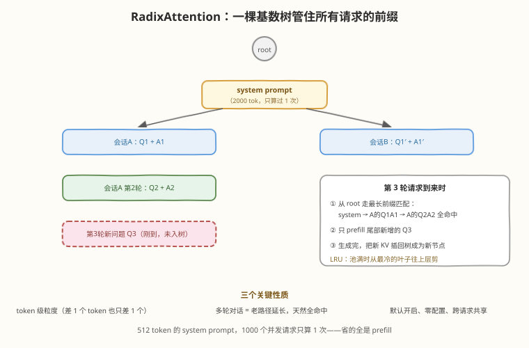
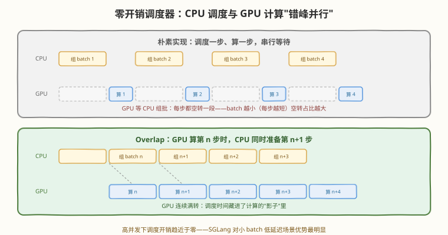
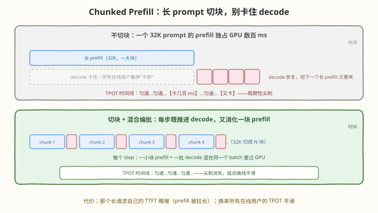

# Day 5：SGLang 核心机制 —— RadixAttention 与调度优化

> **本周计划**：本日是 [SGLang 一周入门学习计划](notes/SGLang一周入门学习计划.md)的第 5 天。理解 SGLang 区别于其他引擎的"独门武功"：RadixAttention / Prefix Cache / Chunked Prefill / 零开销调度
> **今日成败标准**：每个机制都能按"问题 → 传统方案 → 问题 → SGLang 方案 → 收益来源"五段式讲一遍；并拿出一份"开/关前缀缓存"的对照实验数据表
> **时间投入**：3h（理论 50 分钟 + 实践 110 分钟 + 总结 20 分钟）
> **面试考察度**：⭐⭐⭐⭐⭐ "RadixAttention 和 vLLM 的前缀缓存有什么区别"是 SGLang 相关面试的必问题——今天的全部内容

---

## 🎯 目标

通过今天的学习，你将：

1. 按五段式吃透 **RadixAttention**：真实应用的前缀重复问题 → 传统全量重算/block 级匹配的缺陷 → 基数树 + 最长前缀匹配 + LRU 淘汰 → 收益全部来自省掉的 prefill
2. 理解 **基数树** 数据结构为什么天然适配多轮对话（老路径延长 = 天然全命中），能画一棵 3 个请求的小树
3. 掌握 **Chunked Prefill**（长 prompt 切块与 decode 混编）和**零开销调度器**（CPU 调度与 GPU 计算重叠）各自解决的问题
4. 会做机制验证：`--disable-radix-cache` 对照实验、`/metrics` 端点看 `cache_hit_rate`——**用数据而不是信仰说服别人**
5. 学会一条工程常识：prompt 结构决定缓存命运——不变的内容放前面，可变的内容放后面

> 💡 **前置知识**：[Day 4 推理基础](day4.md)——今天的每个机制都挂在昨天的"请求旅程图"上：前缀缓存作用在 prefill 环节，chunked prefill 作用在调度环节，零开销调度器作用在"每步重组 batch"的 CPU 开销上
> ⚠️ **环境要求**：Day 2 的服务运行中；任务 B 需要重启服务两次（开/关缓存），记得预留重启时间

---

## 为什么今天讲的是"独门武功"

Day 4 的四个概念（prefill/decode/KV cache/continuous batching）是所有引擎共享的通用内功；今天讲的是 SGLang 把自己和其他引擎区分开的东西。理解顺序很重要——**先有问题，再有方案**：

| 机制 | 一句话问题 | 一句话方案 |
|------|-----------|-----------|
| RadixAttention | 相同前缀每个请求都重算，浪费算力、拉高 TTFT | 基数树缓存 KV，命中部分直接复用 |
| 零开销调度器 | 调度跑在 CPU 上，赶上 GPU 一步的耗时就拖慢 GPU | CPU 准备第 n+1 步与 GPU 跑第 n 步重叠 |
| Chunked Prefill | 长 prefill 独占 GPU，在线用户的 decode 集体卡顿 | 长 prefill 切块，与 decode 混合编批 |

> 💡 **一句话总结**：三个机制分别优化"重算的浪费"、"调度的空隙"、"长 prompt 的霸道"——全部是围绕 Day 4 那张请求旅程图做的局部手术。

---

## 核心概念

### 5.1 RadixAttention：五段式拆解（今天的主角）

**① 问题是什么**：真实 LLM 应用中，大量请求共享相同的 prompt 前缀——多轮对话每轮都带完整历史、RAG 每次都带检索文档、Agent 每次都带 system prompt 和工具定义。传统引擎每个请求都从第 0 个 token 重算 prefill。

**② 传统方案怎么做**：要么不缓存（全量重算）；要么像 vLLM APC 那样把 KV 切成**固定大小的 block**、按 block 内容哈希匹配（V1 起默认开启）。

**③ 传统方案的问题**：重算浪费算力、拉高 TTFT；block 级匹配粒度粗——前缀边界与 block 边界不对齐时（例如共享段长度不是 block size 的整数倍），边界所在的整块失配，块内可复用的部分也丢了。

**④ SGLang 如何解决**：用一棵**基数树（Radix Tree）**组织所有请求的 KV Cache。每个节点存一段 token 序列的 KV，从根到叶的路径就是一条完整 prompt。新请求到来时做**最长前缀匹配**：命中部分直接复用 KV、只 prefill 不命中的尾部；请求结束后新 KV 插回树中；池满时 LRU 淘汰最冷的节点。**token 级粒度、默认开启、零配置。**

**⑤ 收益来自哪里**：省掉的**全部是共享前缀的 prefill 计算**——所以直接收益是 TTFT，间接收益是吞吐（省下的算力拿去服务别的请求）。论文报告共享前缀负载下最高 6.4× 加速；工程实测中前缀重叠率 60% 以上时 TTFT 降低 20%～40%，RAG / 多轮 Agent 场景吞吐提升 20%～40%。

**关键直觉**：512 token 的 system prompt，1000 个并发请求只算 1 次。

> ⚠️ **对照 Day 4 任务 B 的悬念**：8 个请求共用"写一首诗："，第一个请求把它的 KV 写进树后，后 7 个请求命中——但 prompt 太短看不出差距。今天任务 A 把 system prompt 拉长到上千 token，差距就量化出来了。

### 5.2 基数树：看图理解最长前缀匹配



对着图走一遍多轮对话的完整生命周期：

1. **第 1 轮**：请求 `system + Q1` 到来。树上只有 root → 匹配 0 → 全量 prefill → 生成完，KV 按路径插回树：root → [system] → [Q1 + A1]
2. **第 2 轮**：请求 `system + Q1 + A1 + Q2`。从 root 走最长前缀匹配：`[system]` 命中、`[Q1 + A1]` 命中（**上轮的对话历史免费复用**）→ 只 prefill 尾部的 Q2 → 完成后 `[Q2 + A2]` 挂为新的叶子
3. **第 3 轮**：同样——前两轮的路径全部命中，只算新问题
4. **并发会话**：会话 A、B 共享 system prompt（树上的公共路径），各自的问题在不同子树上分叉，互不干扰
5. **淘汰**：池满时，LRU 从**最冷的叶子**往上剪枝——为什么从叶子开始？见面试 Q3

| 性质 | 含义 |
|------|------|
| token 级粒度 | 命中长度精确到 token——差 1 个 token 的前缀只差 1 个 token 的计算 |
| 路径即前缀 | 多轮对话 = 老路径的延长，**天然全命中**（Day 4 的"历史 KV 在轮次间自然保留"兑现） |
| 默认开启 | 零配置拿收益；`--disable-radix-cache` 关掉做对照（今天任务 B） |
| 引用计数 | 正在被运行的请求使用的节点不会被淘汰 |

> 💡 **名字拆解**：Radix Tree（基数树）= 压缩前缀树（Trie）：每条边存一段 token 而不是单个 token；RadixAttention = 用这棵树管理 Attention 的 KV Cache。名字 intimidating，思想就是"把公共前缀存成公共路径"。

### 5.3 零开销调度器：把调度藏进计算的影子里

Day 4 说过 continuous batching 在**每一步**重组 batch——这个调度跑在 **CPU** 上：检查完成的请求、挑新请求、整理输入张量。问题：如果调度耗时赶上 GPU 一步 decode 的耗时（小 batch 时 GPU 一步只有几毫秒），GPU 就要停下来等 CPU——**调度开销吃掉 batch 收益**。



SGLang 的方案：**重叠（overlap）**——GPU 跑第 n 步时，CPU 同时准备第 n+1 步的 batch。效果：

- GPU 连续满转，调度时间藏进了计算的"影子"
- 高并发下调度开销趋近于零——**零开销调度器**的名字来自这里
- 对小 batch 低延迟场景（在线服务最敏感的区间）优势最明显

> ⚠️ **对照 vLLM**：vLLM V1 引擎同样做了 overlap 调度——这个点上两家已经趋同。面试时把它说成"SGLang 独有"是老黄历；正确的表述是"SGLang 较早提出并工程化，现已是主流引擎标配"。

### 5.4 Chunked Prefill：切开霸道的长 prefill

**问题**：一个 32K token 的长 prompt 进来，prefill 要独占 GPU 数百毫秒——期间**所有**在线用户的 decode 全部卡住，表现为集体"卡顿"（TPOT 出现周期性尖刺）。

**SGLang 方案**：把长 prefill 切成若干 chunk（默认大小可用 `--chunked-prefill-size` 调），与 decode 请求**混合编批**：每个 step 既推进若干 decode，又消化一块 prefill。



| 视角 | 得到 | 付出 |
|------|------|------|
| 在线用户 | TPOT 平滑，无周期性尖刺 | 无 |
| 长请求自己 | 最终 TTFT 不变（总计算量一样） | 单独看 TTFT 略增（prefill 被拉长、切块之间穿插了别人的 decode） |
| 全局 | 延迟曲线平滑、公平 | 少许调度复杂度 |

> 💡 **一句话总结**：chunked prefill 用长请求的"一点 TTFT"换所有人的"TPOT 平滑"——典型的公平性 vs 个别延迟的 tradeoff。思想来自 Sarathi-Serve（[本地 PDF](../../paper/sarathi_serve/sarathi_serve.pdf)），vLLM 的同类实现叫其默认的调度策略之一。

### 5.5 调度与 KV 管理总览：把三个机制拼起来

现在把 Day 4 的"请求旅程图"升级成 SGLang 版：

| 环节 | 机制 | 一句话职责 |
|------|------|-----------|
| 入队后 | **cache-aware 调度** | 优先调度能命中前缀缓存的请求（命中多的先跑，收益最大化） |
| prefill 前 | **RadixAttention** | 最长前缀匹配，只算不命中的尾部 |
| 组批时 | **零开销调度器** | CPU 准备下一步与 GPU 跑当前步重叠 |
| 长 prompt | **Chunked Prefill** | 切块与 decode 混编，不阻塞在线用户 |
| KV 池 | **分页池 + 引用计数 + LRU** | token 显存池按需分配，树上冷节点自动淘汰 |

---

## 动手实践

### 任务 A：多轮对话前缀复用实验（50 分钟）

模拟 5 轮对话，每轮把完整历史发给服务，观察每轮 TTFT 的变化：

```python
# multi_turn_cache.py —— 多轮对话的前缀缓存收益
# 运行: python3 multi_turn_cache.py

import time
from openai import OpenAI

client = OpenAI(base_url="http://localhost:30000/v1", api_key="EMPTY")
history = [{"role": "system", "content": "你是一名历史老师。" + "请严谨作答。" * 100}]  # 故意加长前缀（约 600 token）

questions = ["讲讲秦朝。", "它怎么灭亡的？", "和隋朝有什么共同点？", "对后世影响最大的是什么？", "用一句话总结。"]

for i, q in enumerate(questions, 1):
    history.append({"role": "user", "content": q})
    t0 = time.time()
    resp = client.chat.completions.create(
        model="Qwen/Qwen3-0.6B", messages=history, max_tokens=64, temperature=0)
    t1 = time.time()
    history.append({"role": "assistant", "content": resp.choices[0].message.content})
    print(f"第{i}轮: prompt_tokens={resp.usage.prompt_tokens:5d}, 耗时={t1-t0:.2f}s")
```

```text
# 预期输出（示意）
第1轮: prompt_tokens=  612, 耗时=0.42s
第2轮: prompt_tokens=  685, 耗时=0.35s
第3轮: prompt_tokens=  761, 耗时=0.36s
第4轮: prompt_tokens=  830, 耗时=0.34s
第5轮: prompt_tokens=  893, 耗时=0.35s
```

**观察点**：

1. **prompt_tokens 每轮递增，但耗时几乎持平**——增长的历史部分全部命中了缓存（每轮只 prefill 新问题 + 生成）
2. 第 1 轮最慢（全量 prefill 600 token），第 2 轮起只剩尾部增量
3. 若观察到耗时随轮次**同比**变长——说明缓存没命中，检查下一节的"命中率始终为 0"排障项

### 任务 B：开/关 Radix Cache 对照实验（40 分钟）

量化缓存的收益，拿出一张对比表：

1. **关缓存重启**服务：

```bash
python -m sglang.launch_server --model-path Qwen/Qwen3-0.6B \
  --host 0.0.0.0 --port 30000 --disable-radix-cache
```

2. 重跑任务 A 的脚本，记录每轮耗时
3. **恢复正常启动**（去掉 `--disable-radix-cache`），再跑一遍
4. 填表：

| 轮次 | prompt_tokens | 开缓存耗时 | 关缓存耗时 | 加速比 |
|------|--------------|-----------|-----------|--------|
| 1 | | | | |
| 2 | | | | |
| 3 | | | | |
| 4 | | | | |
| 5 | | | | |

**预期结论**：关缓存后，后几轮耗时随历史变长**显著上升**（每轮全量重算整个 prompt）；开缓存则基本持平。第 5 轮的加速比最直观——prompt 最长、命中最多。

> 💡 **这就是"用数据说话"**：把这张表放进笔记。它同时是 Day 6 benchmark 的预告——今天证明机制存在，明天量化它在标准负载下的收益。

### 任务 C：看 metrics（20 分钟）

启动服务时加 `--enable-metrics`，然后：

```bash
python -m sglang.launch_server --model-path Qwen/Qwen3-0.6B \
  --host 0.0.0.0 --port 30000 --enable-metrics

# 另开终端
curl http://localhost:30000/metrics | grep -i cache
```

```text
# 预期输出（示意）
# TYPE sglang_cache_hit_rate gauge
sglang_cache_hit_rate 0.6345
# TYPE sglang_token_usage gauge
...
```

**观察点**：

1. 跑一遍任务 A 的脚本，再查一次 `cache_hit_rate`——数字应该明显上升
2. `cache_hit_rate` ≈ 命中的 prompt token 占比——它就是你业务"前缀重叠率"的**在线测量**（Day 1 说的"重叠率 > 60% 优先 SGLang"，这个指标就是裁判）
3. 学会用指标说话，是明天 Benchmark 的基础

### 排障速查

| 症状 | 可能原因 | 处理 |
|------|---------|------|
| 缓存命中率始终为 0 | prompt 开头就分叉（如开头带时间戳/请求 ID） | 把可变内容挪到 prompt 末尾（面试 Q4） |
| 对照实验两组数字一样 | 服务没重启成功 / 脚本打到了旧进程 | 重启后先 `curl /health` 确认；对照实验唯一变量是 `--disable-radix-cache` |
| 命中率时高时低 | 树被 LRU 频繁剪枝（池太小、并发太大） | 看 Day 2 的 `#tokens` 是否偏小；业务上增大前缀稳定性 |
| metrics 端点 404 | 启动时没加 `--enable-metrics` | 重启加参数 |

### 学习时间安排（共 3 小时）

| 时长 | 内容 |
|---|---|
| 50 分钟 | 理论：RadixAttention 五段式 + Chunked Prefill + 调度器（本文 5.1-5.5） |
| 110 分钟 | 实践：任务 A～C（任务 B 含两次服务重启） |
| 20 分钟 | 总结：用自己的话写一段"RadixAttention 为什么快"（不超过 200 字） |

---

## 常见误解澄清

| 误解 | 事实 |
|------|------|
| "前缀缓存加速了 decode" | 不——省的全是 **prefill 计算**，直接收益是 TTFT；decode 每 token 的速度（TPOT）不变 |
| "缓存的是上一次的回答文本" | 缓存的是 KV 张量（Day 4 的边界认知）；文本只是树的索引方式 |
| "零开销调度器是 SGLang 独有" | SGLang 较早工程化，vLLM V1 等已跟进——overlap 调度现已是主流引擎标配 |
| "chunked prefill 让长请求更快" | 恰恰相反：长请求自己的 TTFT 略增；收益属于**其他**在线用户（TPOT 平滑） |
| "命中率低是引擎的 bug" | 缓存命运由 **prompt 结构**决定：开头一个时间戳就能让命中归零——先查自己的 prompt |

---

## 面试要点

**Q1：为什么 Radix Tree 比"哈希表存固定 block"更适合多轮对话场景？考虑第 3 轮对话在历史末尾追加新内容的模式。**
> 多轮对话的 prompt 是**尾部追加**模式：第 n 轮 = 第 n-1 轮的完整路径再延长一节。Radix Tree 上这表现为"新请求沿老路径走到叶子，只差最后一段新内容"——前缀全部命中，匹配开销与命中长度成正比，粒度是 token。block 哈希方案把 KV 切成定长块、逐块算哈希链：① 粒度是块——共享段长度不是块大小整数倍时，边界块整块失配，块内可复用部分丢失；② 哈希链是"前缀依赖"的（第 k 块的哈希包含前 k-1 块），跨请求共享时要求块边界从第 0 个 token 起完全对齐；③ 分叉场景（多个会话共享 system prompt 后各奔东西）radix tree 用公共路径天然表达，哈希方案则各自独立成链、共享粒度同样受对齐限制。一句话：**树是按内容动态分裂的结构，哈希是按位置静态对齐的结构**——前者天然适配"共享前缀 + 个性化后缀"的真实负载。

**Q2：RadixAttention 的收益大小取决于什么负载特征？什么情况下它几乎零收益（但也几乎零损失）？**
> 取决于**前缀重叠率**（可复用 token 占 prompt 的比例）和**重算成本**（prefill 是 compute-bound 的，token 越多省得越多）。高收益场景：固定 system prompt、多轮对话（历史逐轮复用）、RAG（文档被反复检索）、Agent（工具定义 + 少样本示例）。零收益场景：一次性随机 prompt、开头带时间戳/用户 ID 等每请求必变的内容——命中率为 0。但"零收益"不等于"有损失"：树的匹配开销是轻量的（内存中的路径遍历，微秒级），未命中时退化为全量 prefill，与不开缓存无异。所以它是"免费期权"——这也是 SGLang 敢默认开启的原因。

**Q3：KV Cache 池满了会发生什么？LRU 淘汰树上节点时，为什么不能随便删中间节点？（提示：想想子节点依赖）**
> 池满的三层反应：① LRU 淘汰最冷的叶子节点，释放 KV；② 还不够 → 新请求在队列里**等待**（等现有请求完成释放）；③ 极端情况 → **抢占**（preemption）：把某些 running 请求的 KV 整体逐出，被抢占的请求之后重算（回到 waiting，从头 prefill）。不能删中间节点的原因：radix tree 的父节点是子节点路径的**前缀**——子节点上的会话要访问父节点的 KV；删掉中间节点，子树的路径就断了（或者子节点引用的 KV 悬空）。所以淘汰必须**从叶子往上剪**（先剪没有子孙、没有引用的最冷叶子）；且被正在运行的请求持有的节点受**引用计数**保护，绝不能删。这与操作系统的分页 + 引用计数思想一脉相承。

**Q4：RAG 系统把检索到的文档放 prompt 最前、system prompt 放最后，缓存命中率很低。怎么调整 prompt 结构提升命中率？为什么？**
> 调整为"稳定在前、多变在后"：system prompt（最稳定）→ 少样本示例/工具定义（次稳定）→ 检索文档（按会话变化）→ 用户问题（每请求必变）。原因：前缀缓存从 prompt **开头**开始匹配——开头一致才有命中。原结构里最前面的是每次都不同的检索文档，每个请求从第 0 个 token 就分叉，命中率归零；system prompt 放在最后意味着最稳定的内容处在永远无法被匹配的位置。调整后：system prompt 全量命中（所有请求共享），高频文档对同一文档的重复查询部分命中，只有尾部真正的增量需要 prefill。配套优化：给文档排序时把**高频文档放前面**（同会话内的多次查询共享更长的稳定前缀）；监控 `cache_hit_rate` 验证调整效果（任务 C 学的指标）。

---

## 今日小结

| 收获 | 具体内容 |
|------|----------|
| RadixAttention | 基数树 + 最长前缀匹配 + LRU 淘汰；token 级粒度、默认开启；省的是共享前缀的 prefill，收益是 TTFT（直接）+ 吞吐（间接） |
| vs block 哈希 | 树按内容动态分裂、天然表达"共享前缀 + 个性后缀"；哈希按位置静态对齐、边界失配丢整块 |
| 零开销调度 | CPU 准备第 n+1 步与 GPU 跑第 n 步重叠；调度开销藏进计算影子；小 batch 低延迟区间受益最大（现已是主流标配） |
| Chunked Prefill | 长 prefill 切块与 decode 混编；牺牲长请求一点 TTFT，换来全员 TPOT 平滑 |
| 工程常识 | prompt 结构决定缓存命运：稳定在前、多变在后；`cache_hit_rate` 是业务前缀重叠率的在线测量 |

**自测清单**（能答出才算过关）：

- [ ] 不看笔记讲一遍 RadixAttention 五段式（问题→传统→缺陷→方案→收益来源）
- [ ] 画一棵 3 轮对话的基数树，标出第 3 轮请求的命中路径和需要 prefill 的部分
- [ ] 解释为什么淘汰必须从叶子往上剪、引用计数保护什么
- [ ] 说出零开销调度器解决的时间矛盾（CPU 调度 vs GPU 步长）
- [ ] 解释 chunked prefill 谁受益、谁付出（公平性 tradeoff）
- [ ] 用自己的话写完"RadixAttention 为什么快"（≤200 字）
- [ ] 拿出任务 B 的对照实验数据表

**📦 今日产出**：理解 RadixAttention + 一份"开/关前缀缓存"的对照实验数据表。

---

> 📌 **明日预告**：Day 6 性能与工程实践——把前 5 天的机制换成数字：TTFT / TPOT / Throughput 三大指标，官方 `sglang.bench_serving` 的规范用法，并发阶梯实验找吞吐拐点，再用 `generated-shared-prefix` 数据集量化 Day 5 的缓存收益。Day 1 裸推理的基线耗时，明天也要拿出来对账了。
