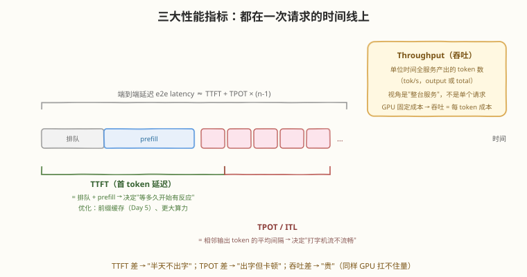
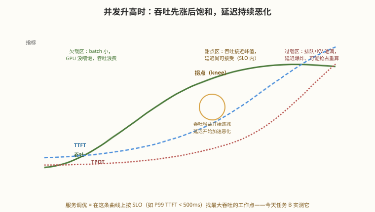

# Day 6：性能与工程实践 —— 指标与 Benchmark

> **本周计划**：本日是 [SGLang 一周入门学习计划](notes/SGLang一周入门学习计划.md)的第 6 天。掌握推理服务的性能语言（TTFT / TPOT / Throughput），会用官方工具跑一个规范的 Benchmark，并理解 batch size、并发、前缀缓存三个变量对性能的影响
> **今日成败标准**：跑完一次完整性能测试，产出含**并发阶梯表**和**缓存对照表**的一页性能观察报告——数字、对比、结论三样齐全
> **时间投入**：3h（理论 30 分钟 + 实践 140 分钟 + 总结 10 分钟）
> **面试考察度**：⭐⭐⭐⭐ "吞吐为什么饱和 / 指标之间怎么权衡"是性能岗的核心考题；能报出自己测过的具体数字，是简历上"做过推理服务"与"跑过 demo"的分水岭

---

## 🎯 目标

通过今天的学习，你将：

1. 定义并区分 **TTFT / TPOT（ITL）/ Throughput** 三个指标——各自衡量什么、对应哪个推理阶段、被什么机制优化
2. 理解**延迟 vs 吞吐的权衡曲线**：为什么并发升吞吐先涨后饱和、延迟持续恶化、存在"甜点区"工作点
3. 掌握 **Benchmark 方法学**：固定模型与负载分布、一次只改一个变量、看分位数（p50/p95/p99）而不是只看均值
4. 熟练使用官方 **`sglang.bench_serving`**：跑通随机负载、并发阶梯、共享前缀数据集三组实验
5. 完成三笔对账：前缀缓存的收益量化（对 Day 5）、引擎优化的量级（对 Day 1 裸推理）、理论拐点（对 Day 4 的两个天花板）

> 💡 **前置知识**：[Day 5 核心机制](day5.md)——任务 C 直接量化昨天的 RadixAttention；Day 4 的"batch 免费午餐的两个天花板"今天用曲线验证
> ⚠️ **环境要求**：服务以 `--enable-metrics` 启动（任务 C 要看命中率）；跑 benchmark 的机器与被测服务之间网络延迟要低（同机或同机房——否则你测的是网络不是引擎）

---

## 为什么今天开始"用数字说话"

前 5 天建立了机制认知，但机制认知在工程世界里**不构成论证**。"我感觉加了缓存快多了"和"c=50 时共享前缀负载 TTFT p95 从 812ms 降到 336ms"是两种职业素养：

| 只有体感 | 有数字 |
|---------|--------|
| "SGLang 挺快的" | "这台卡上这个模型，甜点区在 c≈32" |
| "缓存有收益" | "重叠率 70% 的负载，TTFT 降 58%，吞吐升 35%" |
| "并发再开大点" | "过 c=64 后 P99 TTFT 破 SLO，不可接受" |
| 选型靠信仰 | 选型靠 PoC 报告 |

> 💡 **一句话总结**：今天把前 5 天的每个机制换成数字——机制解释"为什么"，benchmark 证明"多少"。

---

## 核心概念

### 6.1 三大指标：都在一次请求的时间线上



| 指标 | 定义 | 决定什么 | 被什么优化 |
|------|------|---------|-----------|
| **TTFT**（Time To First Token） | 发出请求 → 收到第一个 token | 用户"等多久开始有反应" | 前缀缓存（Day 5）、排队调度、prefill 算力 |
| **TPOT**（Time Per Output Token） | decode 阶段平均每 token 间隔 | "打字机"流不流畅 | batch 摊薄、CUDA Graph、量化；另有 **ITL**（Inter-Token Latency）看间隔的**分布**——抖动（尖刺）比均值更能暴露 chunked prefill 之类的问题 |
| **Throughput**（吞吐） | 单位时间**全服务**产出的 token 数（tok/s） | 服务的"产能"、每 token 成本 | 并发 batch 开大、所有机制的合力 |

三个关键认知：

1. **视角不同**：TTFT/TPOT 是单请求视角（延迟），吞吐是整机视角（产能）——同一时刻两者常常互相打架（见 6.2）
2. **端到端延迟可拆**：e2e ≈ TTFT + TPOT × (n−1)——Day 4"两阶段成本可加"的指标版
3. **分位数比均值诚实**：p50 说"典型体验"，p99 说"最差的那 1% 用户"——SLO（服务等级目标）几乎总是写给分位数的（如"P99 TTFT < 500ms"）

> ⚠️ **为什么 GPU 贵要盯吞吐**：GPU 是固定成本（租卡/买卡按时间计费），吞吐越高 = 每 token 成本越低——**吞吐是商业指标，延迟是体验指标**，生产服务要同时立 SLO。

### 6.2 延迟 vs 吞吐：一条必须选工作点的曲线

Day 4 证明了"batch 开大近乎免费"，但也预告了两个天花板（KV 池容量、算力上限）。把并发从 1 拉到过载，三个指标的行为：



| 区段 | 吞吐 | 延迟 | 发生了什么 |
|------|------|------|-----------|
| 欠载区 | 低（浪费） | 极好 | batch 小，GPU 没喂饱——延迟好但产能浪费 |
| 甜点区 | 接近峰值 | 可接受 | batch 足够大摊薄搬运；**服务该工作在这里** |
| 过载区 | 饱和甚至回落 | 爆炸 | 排队堆积 + KV 池满 → 抢占重算（Day 5 面试 Q3）→ 干了活还得重干 |

**饱和点由什么决定**：先撞上哪个天花板——① KV 池容量（`#tokens` ÷ 平均序列长度 ≈ 并发上限，Day 4 任务 C 算过）；② 算力（batch 大到单步计算时间显著上升）；③ 调度/采样开销。

> 💡 **一句话总结**：服务调优 = 在这条曲线上按 SLO 找**最大吞吐的工作点**——不是"越快越好"，是"在延迟不违约的前提下产能最大"。

### 6.3 Benchmark 方法学：让数字可信的五条纪律

| 纪律 | 反例 | 正解 |
|------|------|------|
| 固定模型与硬件 | 换卡前后两组数据混着比 | 同一模型、同一卡、同 mem-fraction |
| 固定负载分布 | 一组 512 进 128 出，另一组 8 进 1024 出 | input/output 长度分布一致（长度直接决定各指标） |
| 一次只改一个变量 | 同时改并发和缓存 | 对照实验控制变量——任务 B/C 的设计原则 |
| 报告分位数 | 只报均值（被长尾掩盖） | p50 + p95/p99，SLO 绑分位数 |
| 预热 | 把首次请求（含 JIT/编译）算进数据 | 先跑几十个请求预热再计量 |

**数据集要贴近真实负载**：输入/输出长度分布、共享前缀比例——这两件事完全改变结论。`bench_serving` 内置了 `random`（无共享前缀）和 `generated-shared-prefix`（高共享前缀）两个极端，你的真实业务在两者之间。

### 6.4 `sglang.bench_serving`：官方压测工具

```bash
python -m sglang.bench_serving \
  --backend sglang-oai-chat \
  --model Qwen/Qwen3-0.6B \
  --host localhost --port 30000 \
  --dataset-name random \
  --random-input-len 512 --random-output-len 128 \
  --num-prompts 100 \
  --request-rate 8
```

核心参数速查：

| 参数 | 作用 | 备注 |
|------|------|------|
| `--backend` | 客户端协议 | `sglang-oai-chat`（OpenAI chat 格式，最常用） |
| `--model` | 模型名 | 必须与服务启动的 `--model-path` 一致 |
| `--dataset-name` | 负载类型 | `random`（无前缀重叠）/ `generated-shared-prefix`（高重叠，任务 C 用） |
| `--random-input-len` / `--random-output-len` | 输入/输出长度 | 固定负载分布的核心旋钮 |
| `--num-prompts` | 总请求数 | 太小则分位数不稳；学习期 100 起步 |
| `--request-rate` | 发压速率（req/s） | 并发阶梯的"档位"——任务 B 的自变量 |

输出报告（节选）：

```text
Successful requests: 100
Benchmark duration (s): 41.3
Total input tokens: 51200
Total generated tokens: 12736
Request throughput (req/s): 2.42
Output token throughput (tok/s): 308.2
Mean TTFT (ms): 812.4
Median TTFT (ms): 690.1
P99 TTFT (ms): 2105.7
Mean TPOT (ms): 45.3
Mean ITL (ms): 44.1
```

> ⚠️ **解读示范**：上表说明——平均每 45ms 出一个字（TPOT），首字平均等 812ms，最差 1% 的用户等 2.1s（P99）。若 SLO 是"P99 TTFT < 500ms"，当前工作点**不达标**——要么降 request-rate，要么上优化（缓存/扩容）。这就是"把数字翻译成工程结论"。

---

## 动手实践

### 任务 A：官方 Benchmark 工具初体验（40 分钟）

用 6.4 的命令跑第一组基线（随机负载、c=8）。**把整份报告存进笔记**——它是任务 B/C 的对照组。

**观察点**：

1. 区分三个吞吐口径：`Request throughput`（req/s）、`Output token throughput`（tok/s）、Total（含 input）——**对比口径必须一致**，业内常用 output tok/s
2. 对比 P99 与 Mean TTFT 的差距——长尾离均值有多远，体会"只报均值"的欺骗性
3. 跑完立即 `curl localhost:30000/metrics | grep -i "cache\|running"`：此刻 `cache_hit_rate` 接近 0——**random 数据集本来就没有可共享前缀**（这是设计，不是故障）

### 任务 B：并发阶梯实验（50 分钟）

把 `--request-rate` 分别设为 **1 / 4 / 16 / 64**，其他参数全部不动，各跑一次，填表：

| 并发 | TTFT p50 | TTFT p99 | TPOT p50 | 总吞吐 (tok/s) |
|------|----------|----------|----------|----------------|
| 1 | | | | |
| 4 | | | | |
| 16 | | | | |
| 64 | | | | |

**预期结论**（对照 6.2 的曲线）：

1. 吞吐随并发上升但**趋于饱和**——1→4 的增益远大于 16→64 的增益
2. TTFT/TPOT 随并发**持续恶化**，高并发档位开始加速（排队效应）
3. **找到你这台机器的拐点**：吞吐增益明显递减、且延迟尚未爆掉的档位——写下"这台卡跑这个模型的甜点区在 c≈?"，这就是选型/扩容决策的依据

> ⚠️ **纪律自查**：五组实验之间改过别的参数吗？服务重启过吗？`--num-prompts` 一致吗？——任何一个"是"都会让表格失去可比性。

### 任务 C：前缀缓存对 Benchmark 的影响（40 分钟）

用工具内置的共享前缀数据集，做 Day 5 机制的标准化量化：

1. **开缓存**（正常启动）跑一遍：

```bash
python -m sglang.bench_serving \
  --backend sglang-oai-chat \
  --model Qwen/Qwen3-0.6B \
  --host localhost --port 30000 \
  --dataset-name generated-shared-prefix \
  --random-input-len 512 --random-output-len 128 \
  --num-prompts 100 --request-rate 8
```

2. **关缓存**重启服务（`--disable-radix-cache`），同参数再跑一遍
3. 对比两次报告的 **Mean/Median TTFT** 与 **吞吐**

**预期结论**：开缓存时 TTFT 显著更低、吞吐更高——这是 Day 5 任务 B（手造负载）在**标准负载**下的量化验证。把两个数字的差值记下来："重叠率高的负载，缓存带来 TTFT ↓ xx%"。

> 💡 **对账**：跑完开缓存那组，再查一次 `/metrics` 的 `cache_hit_rate`——它应该明显高于任务 A 的 random 数据集。同一台服务，两个数据集，两种命中率，两档性能——**负载特征决定缓存收益**的完整证据链。

### 任务 D（可选加分）：与 Day 1 裸推理对账（10 分钟）

回看 Day 1 记录的 `model.generate()` 裸推理耗时（100 token 数秒级），与今天单请求档位（c=1）的 TPOT × 100 对比：

```text
裸推理（Day 1）：100 token ≈ 4.9s
SGLang c=1（今天）：TPOT ≈ 25ms → 100 token ≈ 2.5s
SGLang 甜点区（任务 B）：吞吐 ≈ 300 tok/s（裸推理的 60 倍产能）
```

两倍的单请求提速来自 CUDA Graph、kernel 优化、无 Python 循环开销；**量级的产能差距来自 batch**——Day 4"免费午餐"的终极兑现。

### 排障速查

| 症状 | 可能原因 | 处理 |
|------|---------|------|
| 报错 connection refused / 404 | 服务没起 / `--model` 名不一致 | 先 `curl /health`，再对齐模型名 |
| 分位数波动巨大 | `--num-prompts` 太小 / 服务冷启动 | 加大请求数；先预热几十个请求 |
| 两组对照数字一样 | 关缓存后没重启成功 / 打到了旧进程 | 每组实验前 `curl /health` + 确认启动日志 |
| request-rate 高档位大量超时 | 进入过载区（本来就是实验目的之一） | 记录现象即可；确认服务没崩（health 200） |
| 客户端报错比服务端慢半拍 | 压测机与服务不同机，网络延迟污染数据 | 同机压测或在服务端看 `/metrics` 的服务端指标 |

### 学习时间安排（共 3 小时）

| 时长 | 内容 |
|---|---|
| 30 分钟 | 理论：指标体系 + benchmark 方法学（本文 6.1-6.4） |
| 140 分钟 | 实践：任务 A～C（+D） |
| 10 分钟 | 总结：把三张表整理成一页"性能观察报告" |

---

## 常见误解澄清

| 误解 | 事实 |
|------|------|
| "看均值就够了" | 长尾被均值掩盖——P99 才是"最差 1% 用户"的真实体验，SLO 绑分位数 |
| "吞吐越高服务越好" | 吞吐是过载前提下的产能；过了甜点区，吞吐的代价是延迟爆炸 |
| "benchmark 就是跑个分" | 方法学纪律（固定分布/控制变量/预热/分位数）决定数字可信度——乱跑的分不如不跑 |
| "缓存对 random 数据集没用 = 缓存没用" | 收益取决于**负载特征**——你的真实业务更接近哪个数据集？先测 `cache_hit_rate` |
| "input token 也算吞吐里的水分" | 口径要声明（output-only 还是 total）——对比时口径不一致是常见坑 |

---

## 面试要点

**Q1：一个服务 TTFT 很好但 TPOT 很差，瓶颈更可能在哪里？反过来呢？**
> TTFT 好、TPOT 差：prefill 没问题、decode 有问题——典型原因是 **decode 侧算力/带宽被挤压**：batch 太大（每步计算量过高）、chunked prefill 混编过量（每步被 prefill 分走算力）、或权重带宽不足（量化/更快的显存可解）。反过来 TPOT 好、TTFT 差：decode 健康、**prefill 或排队**是瓶颈——长 prompt 负载（prefill 计算量大）、并发高导致排队堆积、或缺少前缀缓存（共享前缀反复重算）。诊断顺序：先看排队时间占比（TTFT − prefill 时间），就能分清"排队问题"还是"prefill 计算问题"。

**Q2：为什么吞吐随并发上升最终会饱和甚至下降？饱和点由什么资源决定？**
> 三层机制：① 前期免费——decode 是 memory-bound，搬一次权重的成本与 batch 无关，batch 增大只加计算不加搬运（Day 4 免费午餐）；② 饱和——单步计算量随 batch 线性涨，涨到计算时间赶上搬运时间后（算力天花板），单步变慢开始吃掉增益；③ 回落——KV 池装不下（`#tokens` 上限）触发排队甚至**抢占重算**：被逐出的请求之后从头 prefill，干了活还得重干，吞吐净下降。饱和点由"先撞上的天花板"决定：`#tokens ÷ 平均序列长度` 的并发容量，或算力上限——哪个先到看负载形状（长序列先撞显存，大 batch 短序列先撞算力）。

**Q3：前缀缓存命中为什么主要改善 TTFT 而不是 TPOT？**
> 缓存省掉的是**共享前缀的 prefill 计算**——prefill 是 TTFT 的组成部分，所以 TTFT 直接受益（命中越多，等首字越短）。TPOT 是 decode 阶段每 token 的间隔，由"每步搬权重 + 算 batch"决定——历史 KV 命中与否不改变 decode 每步的计算量（该读的 KV 一样要读，只是不用重新**算**出来）。间接收益存在：省下的 prefill 算力让 GPU 有更多步数跑 decode、减少排队，从而轻微改善并发下的 TPOT 与吞吐——但主收益始终在 TTFT 一侧。

**Q4：老板要求"P99 TTFT < 500ms，同时吞吐最大化"。如何设计实验找到满足条件的最大并发？**
> 二分搜索 + 阶梯验证：① 固定模型/负载分布（真实业务的长度分布与前缀重叠率），从 Day 6 的方法学出发；② 跑并发阶梯（如 4/8/16/32/64），每组记录 P99 TTFT 与吞吐；③ 找到 P99 TTFT 仍在 500ms 内的最大档位 c*；④ 在 c* 附近二分细化（如 32→40→48），因为拐点附近曲线陡，档位粗会漏掉最优点；⑤ 用 c* + 10% 的压力做**稳定性验证**（跑 10 分钟看分位数漂移——过载初期的退化是渐进的）；⑥ 报告：工作点 c*、对应吞吐、P99 余量（如 480ms，离 SLO 还剩 4%——太贴线就要降档或扩容）。关键认知：SLO 约束下的最优点通常在拐点**左侧附近**，不是吞吐峰值处。

**Q5：benchmark 时为什么要预热？分位数看哪几个？**
> 预热排除一次性开销：首次请求触发 JIT 编译、CUDA Graph 相关初始化、缓存冷启动（第一波请求必然全量 prefill，TTFT 虚高）——不预热则首组数据系统性偏慢。分位数：p50 报"典型体验"、p95 报"较差体验的边界"、p99 对齐 SLO 与"最差 1% 用户"；三个一起报才能同时看到位置（典型值）和形状（长尾有多长）。只报 mean 的报告在长尾重的推理负载下基本没有决策价值。

---

## 今日小结

| 收获 | 具体内容 |
|------|----------|
| 三大指标 | TTFT（排队+prefill）、TPOT/ITL（decode 节奏与抖动）、Throughput（整机产能）——视角不同、优化不同 |
| 权衡曲线 | 吞吐先涨后饱和、延迟持续恶化；甜点区 = SLO 内最大吞吐的工作点；饱和点由 KV 容量/算力/抢占决定 |
| 方法学 | 固定分布、控制变量、预热、分位数（p50/p95/p99）、声明口径 |
| 工具 | `sglang.bench_serving`：`--dataset-name`（random / generated-shared-prefix）、`--request-rate`（并发档位）、`--num-prompts`（样本量） |
| 三笔对账 | 缓存收益量化（Day 5）、引擎量级（Day 1 裸推理 60×）、拐点实测（Day 4 两个天花板） |

**自测清单**（能答出才算过关）：

- [ ] 在时间线上指出 TTFT / TPOT / ITL 各自的起止点，说出各自对应的推理阶段
- [ ] 解释曲线三区（欠载/甜点/过载）各自的成因与特征
- [ ] 说出吞吐饱和与回落的三个机制（算力、KV 池、抢占重算）
- [ ] 复述 benchmark 五条纪律，解释"只报均值"为什么危险
- [ ] 拿出并发阶梯表 + 缓存对照表，报出自己机器的甜点区档位

**📦 今日产出**：完成一次完整性能测试 + 一页含并发阶梯表和缓存对照表的性能观察报告。

---

> 📌 **明日预告**：Day 7 Mini Project——把 6 天的技能串成一个完整项目 `mini-llm-service`：Docker 或 pip 环境、SGLang 服务、封装的客户端类、asyncio 并发测试、自写 benchmark（今天的指标与分位数方法学直接复用）、一页 RESULTS.md 性能报告。今天的三张表，就是明天报告的雏形。
