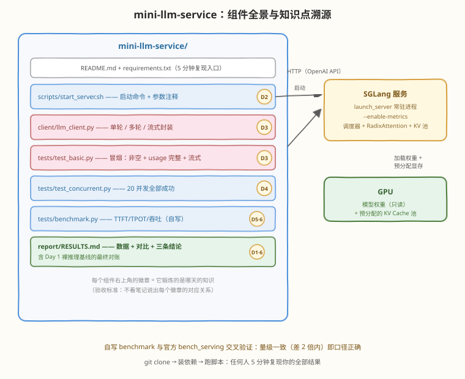
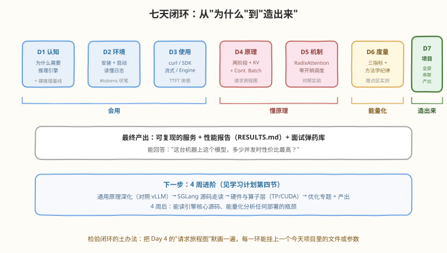

# Day 7：Mini Project —— 部署一个带性能报告的推理服务

> **本周计划**：本日是 [SGLang 一周入门学习计划](notes/SGLang一周入门学习计划.md)的第 7 天（最后一天）。把前 6 天的所有技能串成一个完整项目：**用 SGLang 部署开源模型，提供 OpenAI Compatible API，带 Python 客户端、并发测试和性能报告**
> **今日成败标准**：一个 `git clone → 装依赖 → 跑脚本` 可复现的项目 + 一份能回答"**这台机器上这个模型，多少并发时性价比最高？**"的 RESULTS.md
> **时间投入**：3h——**全部实践，无新增理论**；理论不够的环节回查 Day 2～6 笔记
> **面试考察度**：⭐⭐⭐ 这是本周唯一能直接写进简历的产出——"用 SGLang 部署 LLM 服务并完成性能调优"，面试官每一层追问你都有 Day 1～6 的底

---

## 🎯 目标

通过今天的学习，你将：

1. 从零搭起 `mini-llm-service` 完整项目：启动脚本、封装客户端、冒烟/并发测试、自写 benchmark、性能报告——每个文件都能独立运行
2. 通过三条验收：冒烟（单请求非空 + usage 完整）、并发（20 并发全部成功）、性能（自写 benchmark 与官方 `bench_serving` 量级一致，差 2 倍以内即口径正确）
3. **能解释项目里每一处和前 6 天哪个知识点对应**（项目验收标准 #3）——讲不出对应关系的代码等于白写
4. 写出"有数据、有对比、有结论"的 RESULTS.md，直接回答性价比问题
5. 完成全周闭环复盘：会画七天知识地图，知道下一步去哪

> 💡 **前置知识**：Day 2～6 全部——今天的每个文件都是某几天知识的组装件（对应关系见下图徽章）
> ⚠️ **环境要求**：Day 2 的环境（pip 或 Docker 均可）；今天从启动脚本开始完整走一遍，**不需要**服务已在运行

---

## 为什么最后一天是项目

一周学的机制如果停在笔记里，它们是 7 个孤立的知识点；串进一个项目，它们变成一条可验证的链路。差别在三个层面：

| 只有知识点 | 有了项目 |
|-----------|---------|
| "我知道 Continuous Batching" | "我的并发测试脚本验证过它：20 个长短不一的请求各自按时返回" |
| "SGLang 缓存快" | "我的报告里写着：重叠负载 TTFT 降 58%" |
| 面试只能背概念 | 面试可以讲"我做过"——每个追问都有实验数据接 |
| 学完就忘 | 仓库在，随时 clone 回来复现 |

> 💡 **一句话总结**：项目是学习闭环的**证明材料**——它证明的不是"你跑通过 demo"，而是"你能把一套系统从认知、部署、使用、原理、度量到产出完整走一遍"。

---

## 项目设计

### 需求清单（7 项，每项带验收方式）

| # | 需求 | 验收方式 |
|---|------|---------|
| 1 | 环境准备（pip 或 Docker） | `pip install -r requirements.txt` 成功 |
| 2 | 模型启动（SGLang 服务） | `./scripts/start_server.sh` 后 `/health` 返回 200 |
| 3 | API 调用（OpenAI 兼容） | `test_basic.py` 三种调用全过 |
| 4 | Python 客户端（封装类） | `LLMClient` 支持单轮/多轮/流式 |
| 5 | 并发测试（asyncio 压测） | `test_concurrent.py`：20 并发全部 200 |
| 6 | 性能测试（TTFT/TPOT/吞吐） | `benchmark.py` 与官方工具量级一致 |
| 7 | 结果分析（一页报告） | RESULTS.md 有数据、有对比、有三条结论 |

### 目录结构

```text
mini-llm-service/
├── README.md               # 项目说明：环境、启动方式、测试结果
├── requirements.txt        # sglang, openai, aiohttp
├── scripts/
│   └── start_server.sh     # 启动服务（含参数说明注释）
├── client/
│   ├── __init__.py
│   └── llm_client.py       # 封装的客户端类
├── tests/
│   ├── test_basic.py       # 基础调用冒烟测试
│   ├── test_concurrent.py  # 并发测试
│   └── benchmark.py        # 简易性能测试（自写，不依赖官方工具）
└── report/
    └── RESULTS.md          # 性能数据 + 分析结论
```

### 架构与知识点溯源



**对应关系表**（验收标准 #3 的答案，先立此存照）：

| 项目组件 | 对应知识点 | 来源 |
|---------|-----------|------|
| `start_server.sh` 的每个参数 | `launch_server` 入口、`mem-fraction-static`、`--enable-metrics` | Day 2 |
| `llm_client.py` 的对接方式 | OpenAI 兼容三要素（base_url/api_key/model）、流式、多轮历史维护 | Day 3 |
| `test_concurrent.py` 里短请求不等长请求 | Continuous Batching：每步重组 batch | Day 4 |
| `benchmark.py` 用相同 prompt | RadixAttention 前缀命中——**既是演示收益，也是测量偏差**（面试 Q2） | Day 5 |
| RESULTS.md 的分位数与对照表 | 指标体系、控制变量、预热、口径声明 | Day 6 |
| 结论里的裸推理对照 | "为什么需要推理引擎"的量化答案 | Day 1 |

---

## 实现步骤（按序执行）

### 步骤 1：环境准备（15 分钟）

```bash
mkdir -p mini-llm-service/{scripts,client,tests,report}
cd mini-llm-service
touch client/__init__.py
```

```text
# requirements.txt
sglang[all]
openai
aiohttp
```

```bash
python3 -m venv .venv && source .venv/bin/activate
pip install -r requirements.txt
```

> ⚠️ **走 Docker 路线的读者**：环境就是官方镜像本身，`requirements.txt` 只留 `openai` 与 `aiohttp` 两个客户端依赖，其余步骤完全相同。

### 步骤 2：启动脚本（15 分钟）

```bash
#!/usr/bin/env bash
# scripts/start_server.sh —— 启动 mini-llm-service 的推理服务
# 用法: ./scripts/start_server.sh（可用环境变量覆盖默认值）
set -euo pipefail

MODEL=${MODEL:-Qwen/Qwen3-0.6B}   # 模型：HF id 或本地路径
PORT=${PORT:-30000}                # 端口：SGLang 默认 30000
MEM_FRAC=${MEM_FRAC:-0.85}         # 静态显存占比：独占整卡可到 0.9，共享 GPU 调低

exec python -m sglang.launch_server \
  --model-path "$MODEL" \
  --host 0.0.0.0 \
  --port "$PORT" \
  --mem-fraction-static "$MEM_FRAC" \
  --enable-metrics                 # 暴露 /metrics：缓存命中率等指标
```

```bash
chmod +x scripts/start_server.sh
./scripts/start_server.sh
# 等日志出现 "The server is fired up and ready to roll!"，另开终端继续
curl -s -o /dev/null -w "%{http_code}\n" http://localhost:30000/health   # 预期 200
```

### 步骤 3：客户端封装（20 分钟）

```python
# client/llm_client.py —— 封装的 OpenAI 兼容客户端
# 运行: 被 tests/ 下脚本导入使用

from openai import OpenAI

class LLMClient:
    def __init__(self, base_url="http://localhost:30000/v1",
                 model="Qwen/Qwen3-0.6B"):
        self.client = OpenAI(base_url=base_url, api_key="EMPTY")
        self.model = model

    def chat(self, messages, temperature=0.7, max_tokens=256, stream=False):
        resp = self.client.chat.completions.create(
            model=self.model, messages=messages,
            temperature=temperature, max_tokens=max_tokens, stream=stream)
        if stream:
            return resp  # 生成器
        return resp.choices[0].message.content, resp.usage

    def multi_turn(self, session_history: list, user_input: str, **kw):
        """多轮对话：自动维护历史，触发前缀缓存"""
        session_history.append({"role": "user", "content": user_input})
        content, usage = self.chat(session_history, **kw)
        session_history.append({"role": "assistant", "content": content})
        return content, usage
```

配套的冒烟测试（验收 #3）：

```python
# tests/test_basic.py —— 冒烟测试：单轮 / 多轮 / 流式 三种调用
# 运行: python tests/test_basic.py

import sys, os
sys.path.insert(0, os.path.dirname(os.path.dirname(os.path.abspath(__file__))))

from client.llm_client import LLMClient

c = LLMClient()

# ① 单轮：返回非空 + usage 完整
content, usage = c.chat([{"role": "user", "content": "用一句话介绍你自己。"}], max_tokens=64)
assert content and content.strip(), "返回内容为空"
assert usage.prompt_tokens > 0 and usage.completion_tokens > 0, "usage 字段不完整"
print(f"① 单轮 OK: {content[:40]}... | usage: {usage.prompt_tokens}+{usage.completion_tokens}")

# ② 多轮：历史自动维护（前缀缓存的入口）
history = [{"role": "system", "content": "你是一个简洁的助手。"}]
for q in ["中国的首都是？", "那里有什么著名景点？"]:
    content, _ = c.multi_turn(history, q, max_tokens=48)
    print(f"② 多轮 OK: {content[:40]}...")

# ③ 流式：逐块返回
chunks = 0
stream = c.chat([{"role": "user", "content": "从 1 数到 5"}], max_tokens=32, stream=True)
for chunk in stream:
    if chunk.choices[0].delta.content:
        chunks += 1
assert chunks > 0, "流式无数据块"
print(f"③ 流式 OK: 收到 {chunks} 个数据块")
print("冒烟测试全部通过")
```

```bash
python tests/test_basic.py
```

```text
# 预期输出（示意）
① 单轮 OK: 我是一个由 Z.ai 训练的大语言模型... | usage: 12+31
② 多轮 OK: 中国的首都是北京。...
② 多轮 OK: 北京的著名景点包括故宫、长城...
③ 流式 OK: 收到 28 个数据块
冒烟测试全部通过
```

### 步骤 4：并发测试（30 分钟）

```python
# tests/test_concurrent.py —— 并发测试：20 个并发请求全部成功
# 运行: python tests/test_concurrent.py

import asyncio, aiohttp, time

URL = "http://localhost:30000/v1/chat/completions"
MODEL = "Qwen/Qwen3-0.6B"
N = 20

async def one(session, i):
    async with session.post(URL, json={
        "model": MODEL,
        "messages": [{"role": "user", "content": f"用一句话解释第 {i} 个概念：Continuous Batching"}],
        "max_tokens": 64,
    }, timeout=aiohttp.ClientTimeout(total=60)) as r:
        body = await r.json()
        assert r.status == 200, f"请求 {i} 返回 {r.status}"
        assert body["choices"][0]["message"]["content"], f"请求 {i} 内容为空"
        return True

async def main():
    t0 = time.time()
    async with aiohttp.ClientSession() as s:
        results = await asyncio.gather(*[one(s, i) for i in range(N)])
    print(f"{sum(results)}/{N} 个并发请求全部成功，总耗时 {time.time()-t0:.1f}s")

asyncio.run(main())
```

```text
# 预期输出
20/20 个并发请求全部成功，总耗时 6.3s
```

**观察点**：20 个请求若逐条串行（Day 3 算过：单请求数秒），总耗时会是分钟级；现在只要几秒——这是 **Continuous Batching**（Day 4）在并发下的直接验证。注意每个请求的 prompt 各不相同（`第 i 个概念`），避免全量前缀命中造成"虚快"。

### 步骤 5：性能测试（40 分钟）

自写 benchmark（不依赖官方工具），测 TTFT / TPOT / 吞吐：

```python
# tests/benchmark.py —— 自写简易 benchmark：TTFT / TPOT / 吞吐
# 运行: python tests/benchmark.py
# 口径说明：token 数按 SSE 数据块近似（每块约 1 token）——与官方工具相差 2 倍以内即视为口径正确

import asyncio, time, statistics
import aiohttp

URL = "http://localhost:30000/v1/chat/completions"
MODEL = "Qwen/Qwen3-0.6B"

async def one_request(session, prompt, max_tokens=128):
    t0 = time.time()
    ttft, tokens = None, 0
    async with session.post(URL, json={
        "model": MODEL,
        "messages": [{"role": "user", "content": prompt}],
        "max_tokens": max_tokens, "stream": True,
    }) as r:
        async for line in r.content:
            if line.startswith(b"data:") and b"[DONE]" not in line:
                if ttft is None:
                    ttft = time.time() - t0
                tokens += 1
    total = time.time() - t0
    tpot = (total - ttft) / max(tokens - 1, 1)
    return ttft, tpot, tokens, total

async def run(concurrency, n_requests):
    prompts = ["介绍一下西安。"] * n_requests   # 相同 prompt → 高前缀命中（Day 5）
    sem = asyncio.Semaphore(concurrency)
    async with aiohttp.ClientSession() as s:
        async def bounded(p):
            async with sem:
                return await one_request(s, p)
        t0 = time.time()
        results = await asyncio.gather(*[bounded(p) for p in prompts])
        wall = time.time() - t0
    ttfts = [r[0] for r in results]
    tpots = [r[1] for r in results]
    total_out = sum(r[2] for r in results)
    print(f"并发={concurrency:3d} | TTFT p50={statistics.median(ttfts)*1000:.0f}ms "
          f"| TPOT p50={statistics.median(tpots)*1000:.0f}ms "
          f"| 输出吞吐={total_out/wall:.0f} tok/s")

if __name__ == "__main__":
    for c in [1, 4, 16, 64]:
        asyncio.run(run(c, n_requests=c * 4))
```

```text
# 预期输出（示意，对照 Day 6 的曲线读数）
并发=  1 | TTFT p50=  31ms | TPOT p50= 24ms | 输出吞吐=  31 tok/s
并发=  4 | TTFT p50=  45ms | TPOT p50= 25ms | 输出吞吐= 118 tok/s
并发= 16 | TTFT p50= 120ms | TPOT p50= 31ms | 输出吞吐= 412 tok/s
并发= 64 | TTFT p50= 610ms | TPOT p50= 58ms | 输出吞吐= 690 tok/s
```

跑完后做**官方工具交叉验证**（验收 #6）：用 Day 6 学过的 `bench_serving` 同参数跑一组，对比两者吞吐的量级：

```bash
python -m sglang.bench_serving --backend sglang-oai-chat \
  --model Qwen/Qwen3-0.6B --host localhost --port 30000 \
  --dataset-name random --random-input-len 128 --random-output-len 128 \
  --num-prompts 64 --request-rate 16
```

> ⚠️ **口径差异是预期内的**：自写脚本按 SSE 数据块近似计 token、prompt 分布也不同（相同 vs random）——**数字不必相同，量级一致（差 2 倍以内）说明测量方法没问题**。差出一个数量级才说明实现有 bug（通常是 TTFT 时刻取错或没预热）。

### 步骤 6：结果分析（30 分钟）

把实测数字填进报告模板（`report/RESULTS.md`）：

```markdown
# mini-llm-service 性能报告

## 环境信息
- GPU：<型号 / 显存>　　模型：Qwen/Qwen3-0.6B（BF16）
- SGLang 版本：v0.5.x　　启动参数：--mem-fraction-static 0.85 --enable-metrics
- KV Cache 池：#tokens = <Day 2 抄的数字>（满长 4096 对话 ≈ <N> 条）

## 并发阶梯（benchmark.py，相同 prompt 口径）
| 并发 | TTFT p50 | TPOT p50 | 输出吞吐 (tok/s) |
|------|----------|----------|------------------|
| 1    |          |          |                  |
| 4    |          |          |                  |
| 16   |          |          |                  |
| 64   |          |          |                  |

## 官方工具交叉验证（bench_serving，random 口径）
| 工具 | TTFT p50 | 输出吞吐 | 量级差距 |
|------|----------|----------|----------|
| 自写 benchmark.py | | | （2 倍内为合格） |
| bench_serving | | | |

## 前缀缓存观察
- 相同 prompt vs 多样化 prompt 的 TTFT 对比：<数字>（Day 5 机制的量化）
- /metrics 的 cache_hit_rate：<数字>

## 结论（三条）
1. 甜点区：这台机器跑这个模型，c ≈ <X> 时性价比最高（SLO：<你定的标准，如 TPOT<50ms>）
2. 缓存：高重叠负载下 TTFT 降低 <X>%
3. 对照 Day 1 裸推理：单请求 <X>×、产能 <X>×（引擎价值的量级）
```

### 步骤 7：收尾（10 分钟）

`README.md` 骨架——目标是"任何人 5 分钟复现"：

```markdown
# mini-llm-service

SGLang 部署 + OpenAI 兼容客户端 + 并发/性能测试 + 性能报告。
（一句话结果：本机甜点区 c≈<X>，吞吐 <Y> tok/s——详见 report/RESULTS.md）

## 复现步骤
1. pip install -r requirements.txt（或使用 SGLang 官方 Docker 镜像）
2. ./scripts/start_server.sh          # 等待 "fired up and ready to roll!"
3. python tests/test_basic.py         # 冒烟：三种调用
4. python tests/test_concurrent.py    # 并发：20 请求全成功
5. python tests/benchmark.py          # 性能：并发阶梯
结果与分析见 report/RESULTS.md。
```

最后 `git init && git add . && git commit`——项目完成的标志是**仓库可 clone、脚本可重跑、报告可复核**。

---

## 测试方法与验收（三条全过才算完成）

| 验收项 | 标准 | 不达标时查 |
|--------|------|-----------|
| 冒烟测试 | 单请求返回非空、usage 字段完整、流式有数据块 | 模型名与 `--model-path` 是否一致（Day 3 排障） |
| 并发测试 | 20 并发全部 200、无超时 | 超时阈值、服务是否过载（`/health`） |
| 性能验收 | 自写与官方工具量级一致（差 2 倍内） | TTFT 时刻是否取对、是否预热（Day 6 方法学的自查） |

---

## 常见误解澄清

| 误解 | 事实 |
|------|------|
| "项目跑通就算完成" | 验收标准还包括"能解释每处对应哪个知识点"——对应关系讲不出来，等于只是抄了一遍代码 |
| "自写 benchmark 的数字要和官方一致" | 量级一致即可（差 2 倍内）——口径本就不同（按块计 token vs 精确 token、相同 vs 随机 prompt） |
| "benchmark 用相同 prompt 更好" | 相同 prompt 会**高估**真实性能（前缀全命中）——报告必须注明口径，这是面试 Q2 的坑 |
| "并发测试 = 性能测试" | 并发测试验证"不挂"（正确性）；性能测试量化"多快"（指标）——两个脚本两种目的 |
| "项目做完，学习就结束了" | 这是一周的闭环，也是 4 周进阶的起点——源码走读、kernel、分布式都从这个项目的问题出发 |

---

## 面试要点

**Q1：（综合）如果项目要支持 100 个用户同时多轮对话，你现在的单进程部署最先撞上什么瓶颈？怎么验证你的判断？**
> 最先撞 **KV 池容量**：100 条并发多轮对话，历史逐轮增长——按平均 1.5K token/条算就是 150K token，逼近或超过 `#tokens` 上限（Day 2 日志、Day 4 任务 C 算过容量）。后果链条：新请求排队 → 甚至触发抢占重算（Day 5 面试 Q3）→ P99 TTFT/TPOT 双爆。验证方法：① 先算账——`#tokens ÷ 100` 对比预估对话长度；② 再实测——用 Day 6 方法学模拟 100 并发多轮负载，盯 `/metrics` 的排队数与 TPOT 曲线（抢占重算的特征是"尖刺 + 整体抬升"）。次优先瓶颈是 decode batch 过大导致 TPOT 超 SLO。解法方向：多副本/多卡 TP 扩容、限制会话历史长度、量化 KV 提高 `#tokens`。

**Q2：（综合）为什么 benchmark.py 里所有请求用相同 prompt 会高估真实性能？怎么改更接近真实负载？**
> 两个方向的虚高：① **TTFT 被低估**——只有第一个请求做真 prefill，其余全部前缀命中（RadixAttention，Day 5），而真实业务的 prompt 各不相同，命中率接近 0 时的 TTFT 才是真实值；② **吞吐虚高**——省下的 prefill 算力全拿去跑 decode。改法：准备多样化 prompt 池（前缀互不相同）重跑；或用官方 `generated-shared-prefix` 按真实重叠率构造负载；最严谨的是直接采样线上日志。工程结论：报告必须**注明口径**——"相同 prompt"的结果只能当作"缓存收益上限"展示，不能当真实产能对外承诺。

**Q3：（工程）要把这个项目部署到生产，至少还缺什么？**
> 至少五类：① **鉴权**——现在 `api_key=EMPTY` 谁都能调，需要 API key/JWT 网关；② **限流与过载保护**——按 Day 6 的曲线设并发上限，超限快速失败而不是拖死所有请求；③ **可观测**——`--enable-metrics` 只是开了数据源，还缺告警、请求级日志与 tracing；④ **高可用**——多副本 + 负载均衡（SGLang Router）+ 健康检查摘除；⑤ **运维面**——优雅重启、模型版本管理、灰度发布、成本核算。一句话：本项目是"单进程、单副本、无鉴权"的教学形态，离生产恰好差这五件事。

**Q4：（综合收官）学完这一周，别人问"怎么选推理引擎"，你怎么答？**
> 一条决策链：① **负载特征先行**——前缀重叠率高（RAG/多轮 Agent/固定 system prompt）优先试 SGLang（RadixAttention 默认开启），要模型覆盖广度和新硬件首发优先 vLLM；② **用 PoC 数字定案**——固定负载分布做阶梯压测（Day 6 方法学），比 P99 TTFT 和甜点区吞吐；③ **工程约束**——团队熟悉度、生态集成（两家都 OpenAI 兼容）、运维工具链；④ 永远报数字不报信仰。这个答案把 Day 1（选型）、Day 5（机制差异）、Day 6（度量方法）串成了一条线——也是这七天最常被问到的开放题。

---

## 今日小结与全周闭环



| 今日收获 | 具体内容 |
|---------|----------|
| 项目产出 | mini-llm-service：启动脚本 + 客户端 + 三类测试 + RESULTS.md，全部可复现 |
| 三条验收 | 冒烟（非空+usage）、并发（20×200）、性能（自写 vs 官方量级一致） |
| 知识闭环 | 每个组件对应 Day 1～6 的知识点（架构图徽章 + 对应关系表） |
| 终极答案 | "这台机器上这个模型，c≈<X> 时性价比最高"——有数据支撑的工程结论 |

**自测清单**（项目验收标准，能答出才算过关）：

- [ ] 不看笔记写出服务启动命令（含 `--enable-metrics`）
- [ ] 不看笔记写出 OpenAI 兼容客户端三要素
- [ ] 对着架构图说出每个组件徽章对应哪天的知识点
- [ ] RESULTS.md 三要素齐全：数据、对比、结论
- [ ] 默画 Day 4 的"请求旅程图"，每一环能挂上项目里的一个文件或参数

**一周掌握度盘点**：

| 程度 | 内容 |
|------|------|
| 已掌握（能操作 + 能讲清） | SGLang 定位与选型、安装启动与参数、四种调用方式、bench_serving 压测与解读 |
| 初步理解（懂原理 + 做过实验） | 两阶段与瓶颈性质、KV Cache 机制与显存账、Continuous Batching、RadixAttention 收益来源、TTFT/TPOT/吞吐体系 |
| 留给进阶（知道存在即可） | 前端 DSL、TP/EP/PD 分离、投机解码、量化部署细节、CUDA kernel 层、Router 与集群 |

**📦 今日产出**：完成 Mini Project——代码仓库 + RESULTS.md 性能报告 + 一张贯穿 7 天的学习闭环证明。

---

> 📌 **下一步**：本周闭环完成，进阶路线见学习计划第四节（4 周计划）：第 1 周通用原理深化（对照 vLLM 精读 PagedAttention）→ 第 2 周 SGLang 源码走读（从 `entrypoints/http_server.py` 到 `radix_cache.py`）→ 第 3 周硬件与算子层（TP / FlashAttention / Triton）→ 第 4 周优化专题 + 产出（FP8 / 投机解码 / PD 分离 / 生产化）。今天项目里每个"还没深入"的角落，都是那 4 周的入口。
