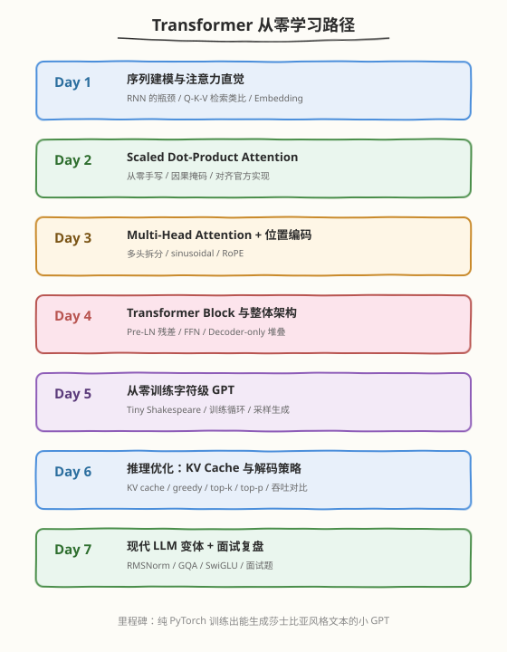
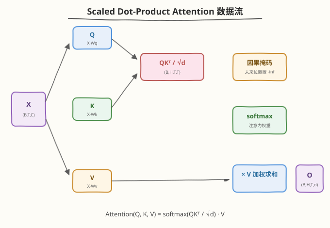
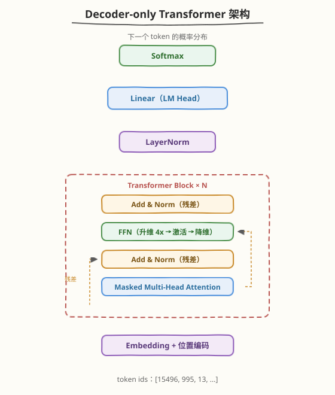

# Transformer 从零开始：一周手写 GPT 学习计划

> **适用对象**：有 Python 基础和最基本的 PyTorch 经验（会写 `nn.Module`、知道 `loss.backward()` 即可），**无需任何 CUDA/系统背景**；适合想从 0 理解 Transformer、后续再深入 AI Infra 方向的同学
> **本周目标**：从注意力的直觉出发，从零手写 Scaled Dot-Product Attention → Multi-Head Attention → Transformer Block → 完整 Decoder-only GPT，并在 Tiny Shakespeare 上训练出能生成"莎士比亚风格"文本的小模型；理解 KV Cache、解码策略与现代 LLM 架构变体（RoPE / RMSNorm / GQA / SwiGLU）
> **时间投入**：工作日每天 2h（理论 1h + 动手 1h），周末每天 4h，周计 18h
> **周日里程碑**：不用 `nn.Transformer`，纯手写一个字符级 GPT（~1M 参数）并在 Tiny Shakespeare 上训练，val loss 降到 1.5 以下，采样生成的文本有明显的英文戏剧腔

---

## 本周总览

| 维度 | 内容 |
|------|------|
| **整体目标** | 理解注意力机制的数学本质（Q/K/V、缩放、掩码、softmax），掌握 Transformer Block 的完整组装（MHA + FFN + 残差 + LayerNorm），能独立训练与推理一个小 GPT，说清每个设计决策背后的"为什么" |
| **核心产出** | ① 手写 attention（与 `F.scaled_dot_product_attention` 误差 < 1e-6） ② 手写 MHA + 位置编码 ③ 完整 GPT 模型代码 ④ Tiny Shakespeare 训练曲线 ⑤ 带 KV Cache 的 generate 函数 + 加速比测量 ⑥ 现代 LLM 架构变体笔记 |
| **验收标准** | ① 能在白板上默写 attention 公式并解释每一项 ② 能徒手算出给定配置下的参数量、FLOPs、KV Cache 显存 ③ 能讲清 causal mask、Pre-LN、残差连接各自解决什么问题 ④ 训练 loss 正常下降、采样文本可读 ⑤ KV Cache 版本与 naive 版本输出完全一致且更快 |
| **面试准备** | 积累 8-10 道 Transformer 面试题，覆盖注意力原理、位置编码、归一化、推理优化、架构变体 |

### 本专题与其他专题的边界

| 维度 | 本 Transformer 专题 | [CUDA 专题](../cuda/README.md) / [Triton 专题](../triton/README.md) / [MoE 专题](../moe/README.md) |
|------|---------------------|-----------------------------------------------------------|
| **视角** | 算法层——理解模型本身 | 系统层——把模型里的算子写快 |
| **语言/工具** | 纯 PyTorch，CPU 即可 | CUDA / Triton，需要 GPU |
| **问题** | "Transformer 为什么长这样" | "attention/GEMM/MoE 怎么在 GPU 上跑快" |
| **关系** | 本周是它们的前置 | 学完本周再去写 kernel 会事半功倍 |

> 💡 **一句话总结**：本专题回答"Transformer 是什么、为什么有效、怎么从零训出来"；后续专题回答"怎么让它在 GPU 上跑得飞快"。先懂算法，再谈优化。

### 本周知识图谱



### 前置准备清单

#### 硬件/软件验证
- [ ] Python >= 3.9，PyTorch >= 2.0（**CPU 即可**，有 GPU 更快但非必需）
- [ ] 内存 >= 8GB（字符级小模型很轻量）
- [ ] （可选）一张 GPU 能把 Day 5 的训练从 ~1h 压缩到 ~5min

#### 验证命令
```bash
# 验证 PyTorch 可用（CPU 版即可）
python3 -c "import torch; print(torch.__version__, torch.cuda.is_available())"

# 验证官方 attention 实现存在（PyTorch >= 2.0 内置）
python3 -c "import torch.nn.functional as F; print(hasattr(F, 'scaled_dot_product_attention'))"

# 下载 Day 5 训练数据（Tiny Shakespeare，~1MB）
wget https://raw.githubusercontent.com/karpathy/char-rnn/master/data/tinyshakespeare/input.txt
```

#### 必读资源（本周会反复用到）
- ⭐ [Attention Is All You Need](https://arxiv.org/abs/1706.03762) — 原始论文，只需读 §1-§3
- ⭐ [The Illustrated Transformer](https://jalammar.github.io/illustrated-transformer/) — Jay Alammar 的经典图解
- ⭐ [nanoGPT](https://github.com/karpathy/nanoGPT) — Karpathy 的最小 GPT 实现，本专题的参照系
- 📌 [Let's build GPT: from scratch, in code](https://www.youtube.com/watch?v=kCc8FmEb1nY) — Karpathy 2 小时视频，Day 5 的对照
- 📌 [The Illustrated GPT-2](https://jalammar.github.io/illustrated-gpt2/) — Decoder-only 架构图解
- 📎 [CS224n 2024 Lecture: Transformers](https://web.stanford.edu/class/cs224n/) — 想补理论深度时看

---

## 为什么学 Transformer

2017 年《Attention Is All You Need》之后，Transformer 几乎统一了序列建模：GPT、BERT、LLaMA、Claude、DeepSeek 全是它的变体；ViT、Whisper、Sora 把它推广到了图像、语音、视频。对 AI Infra 工程师来说，**几乎所有性能优化工作（FlashAttention、KV Cache、量化、MoE、投机采样）都建立在对这个架构的深刻理解之上**——不知道 attention 在算什么，就看不懂 FlashAttention 为什么能省显存；不知道 KV Cache 缓存的是什么，就看不懂 PagedAttention 在解决什么。

与 RNN/LSTM 的对比最能说明 Transformer 解决了什么痛点：

| 维度 | RNN / LSTM | Transformer |
|------|-----------|-------------|
| 序列依赖 | 逐步串行，$t$ 必须等 $t-1$ 算完 | 所有位置并行计算 |
| 长程依赖 | 梯度要穿过 $T$ 步，易消失 | 任意两位置直接相连，路径长度为 1 |
| 训练效率 | 无法并行，GPU 利用率低 | 矩阵乘法为主，吃满 GPU |
| 上下文长度 | 实际有效上下文短 | 轻松上千，现代模型达百万 |

> 💡 **一句话总结**：RNN 是"排队一个一个传话"，Transformer 是"所有人同时开会、任意两人直接对话"——并行性换来了可扩展性，这就是大模型时代的地基。

---

## 一周学习路线

| 天数 | 主题 | 核心产出 |
|------|------|----------|
| Day 1 | 序列建模与注意力直觉 | Embedding 语义实验 + 注意力权重热力图 |
| Day 2 | Scaled Dot-Product Attention | 手写 attention，与官方实现对齐 |
| Day 3 | Multi-Head Attention + 位置编码 | MHA 模块 + sinusoidal/RoPE 实验 |
| Day 4 | Transformer Block 与整体架构 | 完整 decoder-only block（Pre-LN + 残差 + FFN） |
| Day 5 | 从零训练字符级 GPT | 训练循环 + loss 曲线 + 采样生成 |
| Day 6 | 推理优化：KV Cache 与解码策略 | 带 cache 的 generate + 吞吐对比 |
| Day 7 | 现代 LLM 变体 + 面试复盘 | LLaMA 结构笔记 + 面试题清单 |

### Day 1：序列建模与注意力直觉

- **任务**：理解"下一个 token 预测"这个任务设定；跑通 tokenization → embedding lookup；用"查词典"类比建立 Q/K/V 直觉
- **关键问题**：为什么 one-hot 不够、embedding 为什么能承载语义？注意力为什么是"软检索"？
- **动手**：用预训练 embedding（或随机初始化后训练几分钟）观察相近词的余弦相似度；用 3 行 PyTorch 算一个 toy attention 权重矩阵并画热力图
- **验收**：能用一句话向不懂的人解释"注意力就是每个词决定自己该多看哪些词"

### Day 2：Scaled Dot-Product Attention

- **任务**：推导并手写 $\text{softmax}(QK^\top / \sqrt{d_k}) V$，理解缩放因子和因果掩码
- **动手**：完成 [kernels/attention_from_scratch.py](kernels/attention_from_scratch.py)，与 `F.scaled_dot_product_attention` 对齐到 1e-6
- **验收**：能解释为什么除以 $\sqrt{d_k}$（点积方差随 $d$ 线性增长，不缩放则 softmax 饱和、梯度消失）；能解释 causal mask 为什么填 $-\infty$ 而不是 0

### Day 3：Multi-Head Attention + 位置编码

- **任务**：把单头注意力扩展为多头；理解为什么 attention 本身对顺序不敏感、必须注入位置信息
- **动手**：实现 `MultiHeadAttention`（d_model 切分为 H 个头，各自注意力后拼接投影）；实现 sinusoidal 位置编码并可视化不同频率的波形
- **验收**：能解释"多头 = 在多个子空间并行地做不同模式的检索"；能解释 RoPE 相对 sinusoidal 的优势（相对位置、长度外推）

### Day 4：Transformer Block 与整体架构

- **任务**：组装完整 block：MHA → 残差 → FFN → 残差，配 Pre-LN；堆叠 N 层成 decoder-only 模型
- **关键决策**：Pre-LN vs Post-LN（深层训练稳定性）、FFN 为什么升维 4 倍、残差连接为什么不可少
- **动手**：写 `Block` 和 `GPT` 两个 `nn.Module`，打印参数量并与手算结果核对
- **验收**：能画出完整数据流图（token ids → embedding → N×block → LN → LM head → logits）

### Day 5：从零训练字符级 GPT

- **任务**：在 Tiny Shakespeare 上训练 ~1M 参数的小模型
- **动手**：数据加载（随机截取 block_size 窗口）、AdamW + warmup、训练/验证 loss 记录、`generate` 采样
- **参考配置**：`block_size=128, n_layer=4, n_head=4, d_model=128`，CPU 上 ~1h，GPU 上 ~5min
- **验收**：val loss < 1.5，采样文本出现单词级连贯（不要求语义正确）；loss 曲线平滑下降无发散

### Day 6：推理优化：KV Cache 与解码策略

- **任务**：理解自回归推理的冗余计算，给 `generate` 加 KV Cache
- **动手**：naive 版（每步重算整个前缀）vs cache 版（每步只算新 token），验证输出逐位一致并测加速比（T 步生成理论上省约 $T/2$ 倍的 attention 计算）
- **解码策略**：greedy / temperature / top-k / top-p 各试一遍，观察生成多样性差异
- **验收**：能默写 KV Cache 显存公式 $2 \times L \times T \times d_{\text{model}} \times 2\,\text{bytes}$（2 = K 和 V，L = 层数），并算出 7B 模型 4k 上下文占多少显存

### Day 7：现代 LLM 变体 + 面试复盘

- **任务**：对照本周手写的小 GPT，认识 LLaMA 式现代架构的四个改动：RMSNorm（换掉 LayerNorm）、RoPE（换掉 learned/sinusoidal 位置编码）、SwiGLU（换掉 GELU FFN）、GQA（换掉 MHA）
- **动手**：把 Day 4 的 block 逐条改造成 LLaMA 风格（每条 ~10 行改动），感受"现代 LLM 离你的手写 GPT 只有四步之遥"
- **复盘**：完成下方 [面试要点](#面试要点) 全部问答，能脱稿讲 5 分钟"Transformer 从注意力到 GPT"

---

## 核心概念

### 2.1 注意力：一次"软检索"

把每个 token 想象成在图书馆查资料的人：

- **Query（查询）**："我现在需要什么样的信息？"
- **Key（键）**："我能提供什么样的信息？"——相当于每本书的索引卡片
- **Value（值）**："我实际携带的信息内容"

每个位置用自己的 Q 去和所有位置的 K 算相似度（点积），softmax 归一化成权重，再对所有 V 加权求和。**相似度决定"看谁"，V 决定"看到什么"**。和查词典的唯一区别是：词典是精确匹配（hard retrieval），注意力是可微的软匹配（soft retrieval）——因此可以反向传播、可以学习。

### 2.2 缩放点积注意力



$$\text{Attention}(Q, K, V) = \text{softmax}\!\left(\frac{QK^\top}{\sqrt{d_k}}\right) V$$

逐步拆解（设序列长度 $T$，头维度 $d_k$）：

1. $QK^\top$：$(T, d_k) \times (d_k, T) \to (T, T)$，第 $(i,j)$ 个元素是位置 $i$ 对位置 $j$ 的"关注分数"
2. 除以 $\sqrt{d_k}$：$Q$、$K$ 各分量独立同分布时点积的方差 $\propto d_k$，不缩放则 $d_k$ 大时分数数值过大，softmax 进入饱和区、梯度趋近于 0
3. （decoder 专用）因果掩码：把 $j > i$ 的位置填 $-\infty$，softmax 后权重恰为 0——位置 $i$ 不允许"偷看未来"
4. softmax：每行归一化为和为 1 的权重分布
5. 乘 $V$：$(T, T) \times (T, d_k) \to (T, d_k)$，加权求和得到输出

#### 深入：为什么掩码填 $-\infty$ 而不是 0？

填 0 只是把分数"归零"，softmax 后这些位置仍有 $\exp(0)=1$ 的非零权重，未来信息照样泄漏。填 $-\infty$ 后 $\exp(-\infty)=0$，权重精确为 0。实现上用 `masked_fill(mask, float('-inf'))`，softmax 内部做 max 减去归一化，不会产生 NaN（前提是每行至少保留一个可见位置——因果掩码天然满足）。

### 2.3 Multi-Head Attention

单头注意力只能学一种"关注模式"。MHA 把 $d_{\text{model}}$ 切成 $H$ 个头（每头 $d_k = d_{\text{model}} / H$），各自独立做注意力，再拼接投影：

$$\text{MHA}(X) = \text{Concat}(\text{head}_1, \dots, \text{head}_H)\, W^O, \quad \text{head}_h = \text{Attention}(XW_h^Q, XW_h^K, XW_h^V)$$

直觉：有的头关注语法（主语找谓语），有的头关注指代（代词找先行词），有的头关注位置（看相邻词）。**总计算量与单头相当**（$H \times d_k = d_{\text{model}}$），但表达能力是多种模式的组合。

### 2.4 位置编码：注意力不知道顺序

注意力对输入是**置换等变**的：打乱输入顺序，输出只是同样打乱——它本身完全不知道谁前谁后。必须显式注入位置信息：

| 方案 | 做法 | 优点 | 缺点 |
|------|------|------|------|
| Sinusoidal（原论文） | 固定正弦/余弦函数，$PE_{(pos,2i)} = \sin(pos / 10000^{2i/d})$ | 零参数、可外推 | 不可学习 |
| Learned（GPT-2） | 可学习的位置 embedding 表 | 简单有效 | 长度受限于训练时的 max_len |
| **RoPE**（现代主流） | 按位置旋转 Q/K 的二维子空间，内积只依赖相对距离 $m-n$ | 相对位置、外推性好 | 实现略复杂 |

### 2.5 Transformer Block：残差 + 归一化 + FFN



现代主流（Pre-LN，GPT-2 之后的事实标准）：

$$x \leftarrow x + \text{MHA}(\text{LN}(x)), \qquad x \leftarrow x + \text{FFN}(\text{LN}(x))$$

- **残差连接**：让梯度有"高速公路"直通浅层，百层网络可训练；没有它，深层 Transformer 直接发散
- **Pre-LN vs Post-LN**：原论文用 Post-LN（LN 在残差之后），深层时需要精心 warmup 否则不稳；Pre-LN 把 LN 移进分支内部，残差路径恒等，训练显著更稳——现代模型全用 Pre-LN
- **FFN**：$\text{FFN}(x) = W_2\, \sigma(W_1 x)$，先把维度升 4 倍再降回来。注意力负责"信息混合"，FFN 负责"逐位置的非线性变换/知识存储"，两者分工明确

### 2.6 Encoder / Decoder / Encoder-Decoder

| 架构 | 掩码 | 代表 | 适用 |
|------|------|------|------|
| Encoder-only | 无（双向可见） | BERT | 理解类任务：分类、NER、检索 |
| **Decoder-only** | 因果掩码 | GPT、LLaMA、DeepSeek | 生成类任务：语言模型 |
| Encoder-Decoder | encoder 双向 + decoder 因果 + cross-attention | T5、原始 Transformer | 翻译、摘要等 seq2seq |

当前大模型清一色 decoder-only：结构最简单、统一于"下一个 token 预测"单一目标、scale 最顺。

---

## 最小可运行示例

完整文件：[kernels/attention_from_scratch.py](kernels/attention_from_scratch.py)（CPU 可跑，仅依赖 PyTorch）

```python
# attention_from_scratch.py —— 手写缩放点积注意力（核心 15 行）
import math
import torch
import torch.nn.functional as F

def scaled_dot_product_attention(q, k, v, causal=False):
    """q, k, v: (B, H, T, d)；causal: 是否加因果掩码"""
    d = q.size(-1)
    scores = q @ k.transpose(-2, -1)          # (B,H,T,T) 关注分数
    scores = scores / math.sqrt(d)            # 缩放，防 softmax 饱和
    if causal:                                # 因果掩码：不许看未来
        T = q.size(-2)
        mask = torch.triu(torch.ones(T, T, dtype=torch.bool), diagonal=1)
        scores = scores.masked_fill(mask, float("-inf"))
    attn = F.softmax(scores, dim=-1)          # 归一化为权重
    return attn @ v                           # 加权求和
```

运行：

```bash
python3 kernels/attention_from_scratch.py
```

预期输出（与 PyTorch 官方实现对齐 + 因果性验证 + MHA 模块冒烟测试）：

```text
max abs diff vs F.scaled_dot_product_attention: 2.38e-07
causal check (first 5 positions unchanged): True
MHA output shape: torch.Size([2, 10, 64])
```

> ⚠️ **注意**：`causal check` 一项把未来位置的 K/V 改成 ±100 这种极端值，验证前 5 个位置的输出完全不变——这是检验掩码正确性最直接的办法，面试手写 attention 时加上这一手会很加分。

---

## 深入原理：参数量、FLOPs 与显存

手算能力是面试高频考点。以 GPT-2 small 配置（$L{=}12$ 层，$d{=}768$，$H{=}12$，词表 $V{=}50257$，FFN 升维 4 倍）为例：

### 每层参数量

| 模块 | 参数 | 数量 |
|------|------|------|
| QKV 投影 | $d \times 3d$ | $3d^2$ |
| 输出投影 | $d \times d$ | $d^2$ |
| FFN（升 4x 再降回） | $d \times 4d + 4d \times d$ | $8d^2$ |
| LN（两个，可忽略） | $2 \times 2d$ | $\approx 0$ |
| **合计** | | $12d^2 \approx 7.1\text{M}$ |

12 层共 $85\text{M}$，加 embedding $V \times d \approx 38.6\text{M}$，总计约 **124M**——与 GPT-2 small 官方数字一致。规律：**Attention 占 $4d^2$，FFN 占 $8d^2$，FFN 是参数大头（2/3）**。

### 前向 FLOPs（每 token 每层，近似）

- Attention 投影 + 输出：$4 \times 2d^2 = 8d^2$
- 注意力分数与加权：$2 \times 2Td = 4Td$（随序列长度线性增长）
- FFN：$2 \times 8d^2 = 16d^2$

矩阵乘法 $A_{m \times k} \times B_{k \times n}$ 的 FLOPs 记为 $2mkn$。序列短时 FFN 主导；$T$ 接近 $6d$ 量级时注意力项开始反超——这就是长上下文昂贵的根源，也是 FlashAttention、稀疏/线性注意力的存在意义。

### KV Cache 显存

推理时缓存每层的 K、V：每层 $2 \times T \times d$ 个元素（2 = K 和 V），FP16 下：

$$\text{KV Cache} = 2 \times L \times T \times d \times 2\ \text{bytes}$$

7B 模型（$L{=}32, d{=}4096$）单条请求 4k 上下文：$2 \times 32 \times 4096 \times 4096 \times 2 \approx 2.1\ \text{GB}$——**和模型权重本身（~14GB）相比已经不可忽略**，batch 一大就成为显存瓶颈。GQA（多个 Q 头共享一组 K/V）就是为此而生：8 组 KV 头直接把 cache 缩 4 倍。

---

## 常见陷阱与最佳实践

### 1. 忘记除以 $\sqrt{d_k}$

```python
# ❌ 错误：d 大时 softmax 饱和，梯度消失，训练初期就停滞
scores = q @ k.transpose(-2, -1)
# ✅ 正确
scores = (q @ k.transpose(-2, -1)) / math.sqrt(q.size(-1))
```

症状：loss 下降极慢，注意力权重一开始就接近 one-hot。

### 2. 掩码填 0 而不是 -inf

```python
# ❌ 错误：softmax 后未来位置仍有 exp(0)=1 的权重，信息泄漏
scores = scores.masked_fill(mask, 0)
# ✅ 正确
scores = scores.masked_fill(mask, float("-inf"))
```

症状：训练 loss 异常地低（模型在"抄答案"），推理时却一塌糊涂——训练/推理行为不一致是掩码泄漏的典型信号。

### 3. 掩码广播维度写错

因果掩码是 $(T, T)$，scores 是 $(B, H, T, T)$，依赖广播对齐**最后两维**。如果构造出 $(T, 1)$ 或 $(1, T)$ 的 mask，会广播到错误的轴上且不报错。写完务必用"改未来值、看过去输出是否变化"的方法验证（见最小示例）。

### 4. Post-LN 深层不 warmup 直接训

原论文 Post-LN 架构在层数加深后对学习率 warmup 极度敏感，前几百 step 学习率过大直接发散。新写代码一律用 **Pre-LN**；读老代码（BERT 时代）遇到 Post-LN 要知道这个坑。

### 5. generate 时忘记 `model.eval()` 和 `torch.no_grad()`

```python
# ❌ 错误：Dropout 仍生效 + 反向图一直在建，又慢又占显存
logits = model(idx)
# ✅ 正确
model.eval()
with torch.no_grad():
    logits = model(idx)
```

### 6. 训练时忘记梯度裁剪

Transformer 训练早期梯度尖峰常见，`torch.nn.utils.clip_grad_norm_(model.parameters(), 1.0)` 是标配，不写常常前几百 step loss 突然 NaN。

---

## 面试要点

**Q：为什么 attention 要除以 $\sqrt{d_k}$？**
  假设 $q$、$k$ 各分量独立、均值为 0 方差为 1，则点积 $q \cdot k = \sum_i q_i k_i$ 的方差为 $d_k$。不缩放时，$d_k$ 越大分数数值越大，softmax 进入饱和区（输出接近 one-hot），梯度趋近 0，训练停滞。除以 $\sqrt{d_k}$ 把方差归一到 1，与维度无关。

**Q：为什么用多头而不是一个"大"单头？**
  计算量相同（$H \times d_k = d_{\text{model}}$），但单头只能学一种关注模式，多头在 $H$ 个正交子空间并行学习不同模式（语法、指代、位置等），表达能力更强。实验上去掉多头退化明显。

**Q：位置编码为什么必需？RoPE 好在哪？**
  注意力是置换等变的——打乱输入顺序输出只是同样打乱，模型本身不知道顺序。必须注入位置信息。RoPE 把 Q/K 按位置做旋转变换，使内积只依赖相对距离 $m-n$：相对位置建模更合理，且长度外推性优于 learned 绝对位置编码，是 LLaMA 等现代模型的标配。

**Q：Pre-LN 和 Post-LN 的区别？为什么现在都用 Pre-LN？**
  Post-LN：$x + \text{Sublayer}(x)$ 之后再 LN，LN 在残差路径上，深层时梯度不稳定，需要精细 warmup。Pre-LN：LN 移进分支内部 $x + \text{Sublayer}(\text{LN}(x))$，残差路径是恒等映射，梯度直通，百层可稳定训练。代价是理论上表示能力略损，实践中稳定性收益远大于代价。

**Q：KV Cache 缓存的是什么？省了多少计算？**
  自回归生成第 $t$ 个 token 时，前 $t-1$ 个位置的 K、V 与之前每一步算出的完全相同——缓存下来，每步只需为新 token 算 1 个位置的 Q/K/V 和它与缓存的注意力，attention 计算量从每步 $O(t^2 d)$ 降到 $O(td)$。代价是显存：$2 \times L \times T \times d \times 2$ bytes（FP16）。

**Q：注意力对序列长度的复杂度？FlashAttention 优化了什么？**
  时间 $O(T^2 d)$，naive 实现显存 $O(T^2)$（要存 $(T,T)$ 的分数矩阵）。FlashAttention 不改变数学结果，通过分块（tiling）+ online softmax 把显存降到 $O(T)$，并大幅减少 HBM 读写——它优化的是 **IO 而非 FLOPs**，是典型的 memory-bound 优化。

**Q：FFN 为什么升维 4 倍？它参数比 attention 多吗？**
  每层 FFN 参数 $8d^2$，attention $4d^2$，FFN 占 2/3。升维提供高维非线性空间，被解释为模型的"知识存储"（attention 混合信息，FFN 加工信息）。4 倍是原论文的经验值，现代模型用 SwiGLU 时常改为约 8/3 倍以保持总参数相当。

**Q：LayerNorm 和 BatchNorm 的区别？为什么 NLP 用 LN？**
  BN 沿 batch 维归一化，依赖 batch 统计量，序列变长、batch 小、推理 batch=1 时都不稳；LN 沿特征维对每个样本独立归一化，与 batch 无关，天然适合变长序列和自回归推理。

---

## 推荐资源

- ⭐ [Attention Is All You Need](https://arxiv.org/abs/1706.03762) — 原始论文，配合手推公式读 §3
- ⭐ [nanoGPT](https://github.com/karpathy/nanoGPT) — Day 5 的参照实现，读完你写的代码再读它会有"原来如此"的感觉
- ⭐ [The Illustrated Transformer](https://jalammar.github.io/illustrated-transformer/) — 最好的可视化入门
- 📌 [Let's build GPT: from scratch, in code](https://www.youtube.com/watch?v=kCc8FmEb1nY) — Karpathy 逐行敲一个 GPT，与 Day 5 完全对应
- 📌 [RoFormer (RoPE) 论文](https://arxiv.org/abs/2104.09864) — Day 7 深入 RoPE 时读
- 📌 [FlashAttention 论文](https://arxiv.org/abs/2205.14135) — 通往 [CUDA 专题](../cuda/README.md) 和 [Triton 专题](../triton/README.md) 的桥梁
- 📎 [minGPT](https://github.com/karpathy/minGPT) — 另一个教学级实现，代码更"教科书"

---

## 目录结构

```
aiinfra/topics/transformer/
├── README.md                          # 本文件（一周学习计划）
├── day1.md                            # Day 1: 序列建模与注意力直觉
├── day2.md                            # Day 2: Scaled Dot-Product Attention
└── kernels/                           # 可运行代码示例
    ├── attention_intuition.py         # Day 1: embedding 语义 + toy 注意力热力图
    └── attention_from_scratch.py      # Day 2: 手写 attention，与官方实现对齐
```

> 💡 **后续延伸**：完成本专题后，推荐两条路线——① 偏系统：接 [Triton 专题](../triton/README.md) Day 5 的 FlashAttention，亲手把 Day 2 写的 attention 变成 GPU kernel；② 偏架构：接 [MoE 专题](../moe/README.md)，看现代大模型如何把 FFN 换成稀疏专家继续 scale。两条路的起点都是你本周手写的这个小 GPT。
