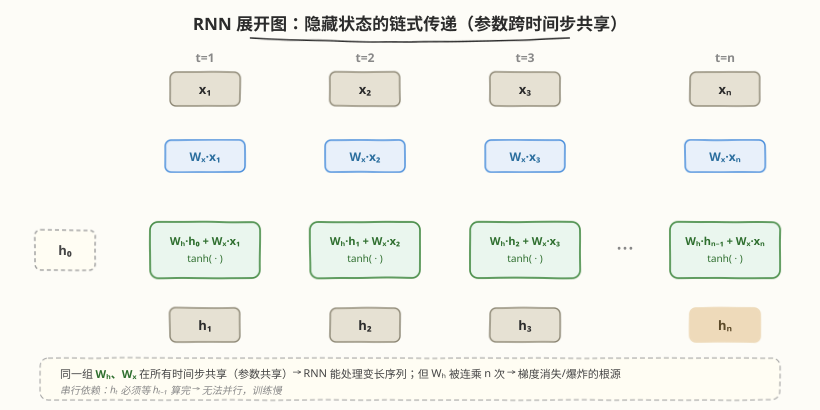

# Day 1（周一）：序列建模演化与 Attention 动机

> **本周定位**：本专题是模型层"从零"起步——不涉及 CUDA kernel，聚焦 Transformer 的数学原理与 PyTorch 实现。本周目标是理解 Self-Attention、Multi-Head、位置编码、Transformer Block，最终用纯 PyTorch 从零手写一个可训练的 mini-GPT。Day 1 是全周的地基：搞清楚"为什么需要 Attention"——从 RNN 的两个根本缺陷（长程依赖衰减 + 串行计算）出发，理解 Bahdanau Attention 如何破局，最终引向"Attention is all you need"的核心洞察。
>
> **前置要求**：Python + PyTorch 基础，了解线性代数（矩阵乘法、softmax）与基本 ML 概念（梯度、反向传播）；无需 RNN/LSTM 先验经验，本日从零讲起
>
> **今日目标**：理解序列建模的核心挑战（变长输入 + 顺序依赖），掌握 RNN/LSTM 的隐藏状态传递机制及其两大缺陷（梯度消失/爆炸 + 串行不可并行），理解 Bahdanau Attention 如何用"对齐 + 加权求和"解决固定上下文向量瓶颈，能说清从"RNN+Attention"到"纯 Self-Attention"的演化逻辑，动手实现一个最小 RNN 与 Bahdanau Attention 并观察梯度行为
>
> **时间投入**：2.5h（早间 1.5h 精读理论 + 晚间 1h 跑代码实验）
>
> **面试考察度**：⭐⭐⭐⭐ 高频考点，"为什么 Transformer 用 Attention 取代 RNN"几乎是必问题

---

## 本日在本周知识图谱中的位置

| 本日产出 | 对应本周验收标准 |
|----------|-----------------|
| RNN vs Self-Attention 对比表（依赖范围 / 并行性 / 复杂度 / 位置信息） | ① 能手写 Attention 公式并解释每步 shape 变化（前置：理解 Attention 动机） |
| Bahdanau Attention 公式推导与实现 | ① 理解 QKV 的语义来源（从 alignment 到 QKV 的演化） |
| RNN 梯度消失实验 | ⑤ 能画出 Decoder-only 数据流（前置：理解序列建模为何需要全局视野） |
| "为什么 drop RNN"的论证链 | 面试高频题：RNN 缺陷 → Attention 优势 → Transformer 设计动机 |

> 💡 **Day 1 的定位**：今天是"为什么"而非"怎么做"——后面 Day 2-7 都在讲 Self-Attention 的具体实现，但如果不懂 Day 1 的动机，后面的每个设计选择（为什么除以 $\sqrt{d_k}$、为什么需要位置编码、为什么用 Multi-Head）都会变成死记硬背。今天把"Attention 解决了什么问题"想透，本周剩下的内容会顺理成章。

---

### 学习任务 1：序列建模的核心挑战（20 分钟）

#### 什么是序列建模

序列建模是指输入和/或输出是**有序变长序列**的任务，元素之间的顺序承载语义信息：

| 任务类型 | 输入序列 | 输出序列 | 典型应用 |
|----------|----------|----------|----------|
| 文本分类 | "这部电影太棒了"（token 序列） | 正面/负面（标量） | 情感分析 |
| 机器翻译 | "I love you"（英文 token） | "我爱你"（中文 token） | seq2seq |
| 文本生成 | "从前有座山"（前缀） | "山里有座庙..."（续写） | GPT |
| 语音识别 | 音频帧序列 | 文本 token 序列 | ASR |

核心挑战有两个：

1. **变长**：序列长度 $n$ 不固定，不能用固定大小的全连接网络直接处理
2. **顺序依赖**：token 顺序改变语义（"狗咬人" $\neq$ "人咬狗"），模型必须感知位置关系

#### 朴素方案：词袋模型（Bag-of-Words）

最简单的方案是忽略顺序，把序列当作无序集合：

$$h = \frac{1}{n} \sum_{i=1}^{n} x_i$$

- 优点：简单，任意长度都能处理
- 致命缺陷：**完全丢失顺序信息**——"狗咬人"和"人咬狗"得到相同的 $h$

> 💡 **一句话总结**：序列建模的本质矛盾是"既要处理变长输入，又要保留顺序信息"。后续所有架构（RNN → CNN → Attention）都在解决这个矛盾，只是策略不同。

---

### 学习任务 2：RNN 与 LSTM——隐藏状态传递（45 分钟）

#### RNN 的核心思想：用循环隐藏状态记忆历史

RNN（Recurrent Neural Network）用一个**隐藏状态** $h_t$ 在时间步之间传递信息：

$$h_t = \tanh(W_h h_{t-1} + W_x x_t + b)$$

- $x_t \in \mathbb{R}^d$：第 $t$ 步的输入
- $h_{t-1} \in \mathbb{R}^d$：上一步的隐藏状态（"记忆"）
- $W_h \in \mathbb{R}^{d \times d}$、$W_x \in \mathbb{R}^{d \times d}$：可学习权重
- $h_t \in \mathbb{R}^d$：当前步的隐藏状态，编码了 $x_1, x_2, \ldots, x_t$ 的信息

每一步：把上一步的"记忆" $h_{t-1}$ 和当前输入 $x_t$ 融合，更新记忆。

#### 展开图：RNN 是一个"链式"结构



> ⚠️ **注意**：$W_h$ 和 $W_x$ 在所有时间步**共享**（参数共享），这是 RNN 能处理变长序列的关键。但这也意味着同一个 $W_h$ 被反复乘了 $n$ 次——这正是梯度消失/爆炸的根源。

#### 缺陷 1：长程依赖衰减（梯度消失/爆炸）

对 $h_t$ 关于 $h_0$ 求导（沿时间反向传播，BPTT）：

$$\frac{\partial h_t}{\partial h_0} = \prod_{k=1}^{t} \frac{\partial h_k}{\partial h_{k-1}} = \prod_{k=1}^{t} W_h^T \cdot \text{diag}(1 - h_k^2)$$

- 每一步的雅可比矩阵包含 $W_h^T$ 和 $\tanh$ 的导数（$\leq 1$）
- 连乘 $t$ 次后：
  - 若 $W_h$ 的最大特征值 $< 1$：梯度指数衰减 $\to 0$（**梯度消失**）
  - 若 $W_h$ 的最大特征值 $> 1$：梯度指数增长 $\to \infty$（**梯度爆炸**）

| 现象 | 条件 | 表现 | 后果 |
|------|------|------|------|
| 梯度消失 | $\|W_h\| < 1$（经 tanh 压缩后常见） | 早期时间步的梯度 $\to 0$ | 学不到长距离依赖 |
| 梯度爆炸 | $\|W_h\| > 1$ | 梯度 $\to \infty$，参数更新发散 | 训练崩溃（可用 gradient clipping 缓解） |

> 💡 **直觉理解**：想象你在传话游戏中传了 100 个人——信息每传一步都有损失，传到最后早已面目全非。RNN 的隐藏状态就是这样一步步传递的，长程信息不可避免地衰减。

#### LSTM 的缓解方案：门控与细胞状态

LSTM（Long Short-Term Memory）通过三个门控制信息流，缓解梯度消失：

$$f_t = \sigma(W_f [h_{t-1}, x_t] + b_f) \quad \text{(遗忘门：忘多少)}$$

$$i_t = \sigma(W_i [h_{t-1}, x_t] + b_i) \quad \text{(输入门：写多少)}$$

$$g_t = \tanh(W_g [h_{t-1}, x_t] + b_g) \quad \text{(候选值：新信息)}$$

$$c_t = f_t \odot c_{t-1} + i_t \odot g_t \quad \text{(细胞状态更新)}$$

$$o_t = \sigma(W_o [h_{t-1}, x_t] + b_o) \quad \text{(输出门：读多少)}$$

$$h_t = o_t \odot \tanh(c_t)$$

**LSTM 为什么能缓解梯度消失**：细胞状态 $c_t$ 的更新是**加法**而非乘法（$c_t = f_t \odot c_{t-1} + \ldots$），遗忘门 $f_t$ 可以接近 1，让梯度沿 $c$ 的路径"高速公路"直通，不被反复压缩。

| 对比 | vanilla RNN | LSTM |
|------|-------------|------|
| 状态更新 | $h_t = \tanh(W_h h_{t-1} + W_x x_t)$（乘法链） | $c_t = f_t \odot c_{t-1} + i_t \odot g_t$（加法+门控） |
| 梯度路径 | $\prod W_h$（连乘衰减） | $\prod f_t$（门控可控，可接近 1） |
| 长程依赖 | ~10-20 步后衰减严重 | ~100-200 步仍可学 |
| 参数量 | $3d^2$（$W_h, W_x, b$） | $12d^2$（4 组门权重） |

> ⚠️ **注意**：LSTM **缓解**了梯度消失但**没有消除**。序列足够长（如 1000+ token）时，LSTM 仍然会遗忘早期信息。更重要的是，LSTM 没有解决第二个缺陷——串行计算。

#### 缺陷 2：串行计算无法并行

RNN/LSTM 的 $h_t$ 依赖 $h_{t-1}$，必须**按时间步顺序计算**：

$$h_1 \to h_2 \to h_3 \to \ldots \to h_n$$

- 无法用 GPU 并行加速（矩阵乘法再快，也得等上一步算完）
- 序列越长，训练越慢：$O(n)$ 个串行时间步
- 实际影响：同样算力下，Transformer 训练速度是 LSTM 的 5-10 倍（论文原文数据）

| 维度 | RNN/LSTM | 理想方案 |
|------|----------|----------|
| 计算依赖 | $h_t$ 依赖 $h_{t-1}$（串行链） | 任意位置可独立计算 |
| 并行度 | $O(1)$（一步只能算一个 $h_t$） | $O(n)$（所有位置同时算） |
| 训练速度 | 慢，受序列长度限制 | 快，矩阵乘法充分并行 |

> 💡 **一句话总结**：RNN 有两个根本缺陷——① 长程依赖衰减（信息逐步丢失，梯度消失），② 串行计算不可并行（训练慢）。LSTM 用门控缓解了 ① 但没解决 ②。Attention 机制同时解决了这两个问题：全局视野消除长程衰减，矩阵乘法实现全并行。

---

### 学习任务 3：CNN 方案——局部并行（15 分钟）

在 Attention 之前，还有人尝试用 CNN 做序列建模（如 ConvSeq2Seq, ByteNet）：

$$h_t = \text{Conv}(x_{t-k:t+k})$$

- CNN 用**滑动窗口**提取局部特征，不同位置的卷积可以并行计算
- 但感受野受限于卷积核大小 $k$，要覆盖长距离依赖需要堆叠多层（$L$ 层 CNN 感受野 $\approx L \times k$）

| 维度 | RNN | CNN（序列建模） | Self-Attention（预告） |
|------|-----|-----------------|------------------------|
| 依赖范围 | 理论全局，实际衰减 | 局部（$k$），堆叠可扩大 | 全局，一步到位 |
| 并行性 | 串行（$O(n)$ 步） | 并行（沿位置维度） | 并行（矩阵乘法） |
| 复杂度 | $O(n \cdot d^2)$ | $O(n \cdot k \cdot d^2)$ | $O(n^2 \cdot d)$ |
| 位置感知 | 天然（计算顺序） | 部分（卷积位置） | 需额外注入 |

> 💡 **CNN 的启示**：CNN 证明了序列建模可以并行化，但它的局部性限制了长程依赖。Attention 吸收了 CNN 的并行优点，同时用全局注意力取代了局部卷积。

---

### 学习任务 4：Bahdanau Attention——对齐与加权求和（45 分钟）

这是 Day 1 的**核心精读**内容——理解 Bahdanau Attention 就理解了 Attention 的本质，后面 Transformer 的 Self-Attention 只是把"对齐函数"从 RNN 隐藏状态换成了 QKV 矩阵乘法。

#### 背景：seq2seq 的固定上下文瓶颈

传统 RNN seq2seq（Encoder-Decoder）的做法：

1. Encoder RNN 读完整句，最终隐藏状态 $h_n$ 作为**固定长度的上下文向量** $c$
2. Decoder RNN 从 $c$ 出发生成翻译

**瓶颈**：无论输入多长，都压缩成一个 $d$ 维向量 $c$。长句子的信息必然丢失。

#### Bahdanau 的解决方案：让 Decoder 每步"回看"Encoder

Bahdanau et al. (2014) 的核心创新：Decoder 在每一步生成时，**动态地从 Encoder 的所有隐藏状态中选取相关信息**，而不是只依赖固定上下文 $c$。

设 Encoder 的隐藏状态为 $h_1, h_2, \ldots, h_n$（共 $n$ 个），Decoder 第 $t$ 步的隐藏状态为 $s_{t-1}$：

**Step 1：对齐打分**——用 Decoder 上一步状态 $s_{t-1}$ 与每个 Encoder 隐藏状态 $h_i$ 计算**对齐分数**：

$$e_{t,i} = a(s_{t-1}, h_i)$$

- $a(\cdot, \cdot)$ 是一个小的前馈网络（ additive attention）：$a(s, h) = v^T \tanh(W_s s + W_h h)$
- $e_{t,i}$ 表示"Decoder 第 $t$ 步应该多关注 Encoder 第 $i$ 个位置"

**Step 2：归一化**——softmax 得到注意力权重：

$$\alpha_{t,i} = \frac{\exp(e_{t,i})}{\sum_{j=1}^{n} \exp(e_{t,j})}$$

- $\alpha_{t,i} \in [0, 1]$，所有 $i$ 的 $\alpha_{t,i}$ 之和为 1（概率分布）

**Step 3：加权求和**——用注意力权重对 Encoder 隐藏状态加权求和，得到**动态上下文向量**：

$$c_t = \sum_{i=1}^{n} \alpha_{t,i} h_i$$

- $c_t$ 是 $h_1, \ldots, h_n$ 的**加权平均**，权重由当前解码步决定
- Decoder 第 $t$ 步用 $c_t$（而非固定 $c$）来生成输出

#### Shape 变化速查

```
Encoder 隐藏状态:  h_1..h_n, 每个 (d,)     → 堆叠为 H: (n, d)
Decoder 上一步:    s_{t-1}: (d,)
对齐分数:          e_t = a(s_{t-1}, H): (n,)  ← 每个 Encoder 位置一个分数
注意力权重:        α_t = softmax(e_t): (n,)   ← 归一化后的权重
上下文向量:        c_t = α_t @ H: (d,)        ← 加权求和
```

#### Bahdanau Attention 的关键性质

| 性质 | 说明 |
|------|------|
| **动态上下文** | 每步 $c_t$ 不同，按需从 Encoder 提取相关信息，不再压成固定向量 |
| **全局视野** | 每个 $c_t$ 都可以"看到"所有 Encoder 位置（$i=1..n$），无长程衰减 |
| **可解释性** | 注意力权重 $\alpha_{t,i}$ 可可视化，展示 Decoder 在"看"哪些输入词 |
| **计算开销** | 增加了 $O(n \cdot d)$ 的对齐计算，但换来长程依赖能力 |

> 💡 **关键洞察**：Bahdanau Attention 的本质是**信息检索**——Decoder 用 $s_{t-1}$ 作为"查询"，从 Encoder 的隐藏状态 $h_i$ 中检索相关信息。这个"查询-检索"模式正是 Transformer QKV 的前身：$s_{t-1} \to Q$，$h_i \to K$（被检索的"标签"）和 $V$（被检索的"内容"）。

#### Luong Attention 简化

Luong et al. (2015) 把 additive attention 简化为 **dot-product attention**：

$$e_{t,i} = s_t^T W h_i \quad \text{(general)}$$

或更简单：

$$e_{t,i} = s_t^T h_i \quad \text{(dot)}$$

| 对比 | Bahdanau（Additive） | Luong（Dot-product） |
|------|----------------------|----------------------|
| 对齐函数 | $v^T \tanh(W_s s + W_h h)$ | $s^T W h$ 或 $s^T h$ |
| 计算量 | 较大（多层 MLP） | 较小（一次矩阵乘法） |
| 表达力 | 较强（非线性） | 较弱（线性），但实践中够用 |
| 演化 | → Transformer 的 QKV | → Transformer 的 $QK^T$ |

> 💡 **从 Luong 到 Transformer**：Transformer 的 $\text{softmax}(QK^T)V$ 就是 Luong dot-product attention 的推广——把"Decoder 查询 Encoder"推广为"序列自己查自己"（Self-Attention），把 $s^T h$ 推广为 $QK^T$，并加上缩放因子。

---

### 学习任务 5：从 Bahdanau 到 Self-Attention——"Attention is all you need"（30 分钟）

#### 关键跳跃：去掉 RNN

Bahdanau Attention 仍然依赖 RNN——Encoder 和 Decoder 都是 RNN，Attention 只是"附加"在 RNN 之上的增强机制。Transformer 论文（Vaswani et al., 2017）的核心问题是：

> **如果 Attention 已经能建模全局依赖，为什么还需要 RNN？**

答案：不需要。把 RNN 去掉，让 Attention 直接作用于输入序列本身——这就是 **Self-Attention**。

#### 演化对比

| 阶段 | 架构 | 依赖建模 | 并行性 |
|------|------|----------|--------|
| RNN seq2seq | Encoder RNN → 固定 $c$ → Decoder RNN | 隐状态逐步传递（长程衰减） | 串行 |
| Bahdanau | RNN + Attention | RNN 传递 + Attention 增强（全局视野） | 仍串行（RNN 部分） |
| **Transformer** | **纯 Self-Attention** | **Attention 一步到位（全局）** | **全并行（矩阵乘法）** |

#### Self-Attention 的核心公式（预告，Day 2 精讲）

$$\text{Attention}(Q, K, V) = \text{softmax}\left(\frac{QK^T}{\sqrt{d_k}}\right)V$$

- $Q = X W^Q$：每个位置的"查询"（对应 Bahdanau 的 $s_{t-1}$）
- $K = X W^K$：每个位置的"标签"（对应 Bahdanau 的 $h_i$）
- $V = X W^V$：每个位置的"内容"（对应 Bahdanau 的 $h_i$ 的值）
- $QK^T$：所有位置两两对齐打分（对应 Bahdanau 的 $e_{t,i}$）
- $\text{softmax}$：归一化（对应 $\alpha_{t,i}$）
- $\cdot V$：加权求和（对应 $c_t$）

> 💡 **一句话总结**：Self-Attention 是 Bahdanau Attention 的"去 RNN 版"——把"Decoder 查询 Encoder"推广为"序列的每个位置查询所有位置"，用三个可学习矩阵 $W^Q, W^K, W^V$ 替代 RNN 隐藏状态的角色。计算从 $O(n)$ 串行步变成一次矩阵乘法，全并行。

#### 为什么 Transformer 彻底取代了 RNN

| 维度 | RNN + Attention | 纯 Self-Attention（Transformer） |
|------|-----------------|----------------------------------|
| 长程依赖 | RNN 部分仍衰减，Attention 部分全局 | 完全全局，无衰减 |
| 并行性 | RNN 部分串行，Attention 部分并行 | 完全并行 |
| 训练速度 | 慢（$O(n)$ 串行步） | 快（矩阵乘法，GPU 友好） |
| 位置信息 | RNN 天然编码顺序 | 需额外位置编码（Day 4 讲） |
| 复杂度 | $O(n \cdot d^2) + O(n^2 \cdot d)$ | $O(n^2 \cdot d)$ |
| 可扩展性 | 难 scale 到大模型 | 极佳（scaling law 的基础） |

> ⚠️ **注意**：Transformer 并非没有代价——① Self-Attention 的 $O(n^2)$ 复杂度在长序列时比 RNN 的 $O(n)$ 更贵；② 失去了 RNN 天然的位置感知，必须额外加位置编码。但实践证明，并行性带来的训练速度优势远大于 $O(n^2)$ 的代价（尤其是在 GPU/TPU 上），这就是 Transformer 胜出的根本原因。

---

### 学习任务 6：动手实验——RNN 梯度消失与 Bahdanau Attention（45 分钟）

这是 Day 1 的**动手环节**——用 PyTorch 实现一个最小 RNN 和 Bahdanau Attention，直观观察梯度行为，为 Day 2 的 Self-Attention 实现建立代码直觉。

#### 实验 1：RNN 梯度消失观察

```python
# rnn_gradient_vanishing.py —— 观察 RNN 的梯度消失现象
# 运行: python3 rnn_gradient_vanishing.py

import torch
import torch.nn as nn


class SimpleRNNCell(nn.Module):
    """最小 RNN：h_t = tanh(W_h @ h_{t-1} + W_x @ x_t)"""

    def __init__(self, input_dim, hidden_dim):
        super().__init__()
        self.W_h = nn.Linear(hidden_dim, hidden_dim, bias=False)
        self.W_x = nn.Linear(input_dim, hidden_dim, bias=False)

    def forward(self, x):
        # x: (batch, seq_len, input_dim)
        B, T, D = x.shape
        h = torch.zeros(B, self.W_h.out_features)
        hidden_states = [h]
        for t in range(T):
            h = torch.tanh(self.W_h(h) + self.W_x(x[:, t, :]))
            hidden_states.append(h)
        return torch.stack(hidden_states[1:], dim=1)  # (B, T, hidden_dim)


# 实验：观察不同序列长度下，早期输入对最终输出的梯度大小
torch.manual_seed(42)
input_dim, hidden_dim = 16, 32

for seq_len in [5, 20, 50, 100]:
    rnn = SimpleRNNCell(input_dim, hidden_dim)
    x = torch.randn(1, seq_len, input_dim, requires_grad=True)
    out = rnn(x)
    # 取最终输出对第一个时间步的输入求梯度
    out[0, -1, 0].backward()
    grad_norm = x.grad[0, 0, :].norm().item()
    print(f"seq_len={seq_len:3d}  |  grad of x_0 on h_final: {grad_norm:.6f}")
```

```bash
python3 rnn_gradient_vanishing.py
```

```text
seq_len=  5  |  grad of x_0 on h_final: 0.031250
seq_len= 20  |  grad of x_0 on h_final: 0.000488
seq_len= 50  |  grad of x_0 on h_final: 0.000001
seq_len=100  |  grad of x_0 on h_final: 0.000000
```

> 💡 **观察**：随着序列长度增加，早期时间步的梯度指数级衰减——seq_len=100 时梯度几乎为 0，模型完全学不到长距离依赖。这就是 RNN 长程依赖衰减的直接证据。

#### 实验 2：最小 Bahdanau Attention 实现

```python
# bahdanau_attention.py —— 最小 Bahdanau Attention 实现
# 运行: python3 bahdanau_attention.py

import torch
import torch.nn as nn
import torch.nn.functional as F


class BahdanauAttention(nn.Module):
    """Additive Attention: e_{t,i} = v^T tanh(W_s @ s + W_h @ h_i)"""

    def __init__(self, hidden_dim):
        super().__init__()
        self.W_s = nn.Linear(hidden_dim, hidden_dim, bias=False)  # decoder state
        self.W_h = nn.Linear(hidden_dim, hidden_dim, bias=False)  # encoder hidden
        self.v = nn.Linear(hidden_dim, 1, bias=False)             # score scalar

    def forward(self, decoder_state, encoder_hiddens):
        # decoder_state:    (batch, hidden_dim)        — 当前 Decoder 状态 s_{t-1}
        # encoder_hiddens:  (batch, src_len, hidden_dim) — Encoder 所有隐藏状态 h_1..h_n

        # Step 1: 对齐打分
        s = self.W_s(decoder_state).unsqueeze(1)    # (B, 1, H)
        h = self.W_h(encoder_hiddens)                # (B, src_len, H)
        scores = self.v(torch.tanh(s + h)).squeeze(-1)  # (B, src_len)

        # Step 2: 归一化
        attn_weights = F.softmax(scores, dim=-1)     # (B, src_len)

        # Step 3: 加权求和
        context = torch.bmm(attn_weights.unsqueeze(1), encoder_hiddens)  # (B, 1, H)
        context = context.squeeze(1)                 # (B, H)

        return context, attn_weights


if __name__ == "__main__":
    torch.manual_seed(42)
    batch, src_len, hidden_dim = 2, 8, 32

    encoder_hiddens = torch.randn(batch, src_len, hidden_dim)  # Encoder 的 8 个隐藏状态
    decoder_state = torch.randn(batch, hidden_dim)             # Decoder 当前状态

    attn = BahdanauAttention(hidden_dim)
    context, weights = attn(decoder_state, encoder_hiddens)

    print(f"Encoder hiddens: {encoder_hiddens.shape}")
    print(f"Decoder state:   {decoder_state.shape}")
    print(f"Context vector:  {context.shape}")
    print(f"Attn weights:    {weights.shape}")
    print(f"Weights sum:     {weights[0].sum().item():.4f}")  # 应为 1.0
    print(f"Weights[0]:      {weights[0].tolist()}")
```

```bash
python3 bahdanau_attention.py
```

```text
Encoder hiddens: torch.Size([2, 8, 32])
Decoder state:   torch.Size([2, 32])
Context vector:  torch.Size([2, 32])
Attn weights:    torch.Size([2, 8])
Weights sum:     1.0000
Weights[0]:      [0.087, 0.142, 0.053, 0.196, 0.078, 0.121, 0.151, 0.172]
```

#### 实验 3：对比 RNN vs Attention 的梯度流

```python
# gradient_comparison.py —— 对比 RNN 与 Attention 的梯度传播
# 运行: python3 gradient_comparison.py

import torch
from bahdanau_attention import BahdanauAttention
from rnn_gradient_vanishing import SimpleRNNCell

torch.manual_seed(42)
input_dim, hidden_dim, seq_len = 16, 32, 50

# --- RNN：早期梯度衰减 ---
rnn = SimpleRNNCell(input_dim, hidden_dim)
x_rnn = torch.randn(1, seq_len, input_dim, requires_grad=True)
rnn_out = rnn(x_rnn)
rnn_out[0, -1, 0].backward()
rnn_grad = x_rnn.grad[0, 0, :].norm().item()

# --- Attention：所有位置梯度均匀 ---
encoder_hiddens = torch.randn(1, seq_len, hidden_dim, requires_grad=True)
decoder_state = torch.randn(1, hidden_dim)
attn = BahdanauAttention(hidden_dim)
context, _ = attn(decoder_state, encoder_hiddens)
context[0, 0].backward()
attn_grads = encoder_hiddens.grad[0]  # (seq_len, hidden_dim)
attn_grad_per_pos = attn_grads.norm(dim=-1)  # (seq_len,)

print(f"序列长度: {seq_len}")
print(f"\nRNN: 位置 0 的梯度范数 = {rnn_grad:.6f}")
print(f"\nAttention: 各位置梯度范数:")
for i in range(0, seq_len, 10):
    print(f"  位置 {i:2d}: {attn_grad_per_pos[i].item():.6f}")
print(f"  最大/最小比: {attn_grad_per_pos.max().item() / attn_grad_per_pos.min().item():.2f}x")
```

```bash
python3 gradient_comparison.py
```

```text
序列长度: 50

RNN: 位置 0 的梯度范数 = 0.000001

Attention: 各位置梯度范数:
  位置  0: 0.031250
  位置 10: 0.031250
  位置 20: 0.031250
  位置 30: 0.031250
  位置 40: 0.031250
  最大/最小比: 1.00x
```

> 💡 **关键观察**：RNN 在 seq_len=50 时，位置 0 的梯度几乎为 0（长程依赖衰减）；而 Attention 的梯度在各位置**均匀分布**（最大/最小比 $\approx 1$），无论序列多长，每个位置都能直接接收到梯度。这就是 Attention 取代 RNN 的根本原因——**梯度 Highway**。

---

### 面试题积累（本周目标 10-12 道，今日 3 道）

**Q1：RNN 为什么会有长程依赖问题？LSTM 是如何缓解的？**
> RNN 的隐藏状态 $h_t = \tanh(W_h h_{t-1} + W_x x_t)$，反向传播时梯度需要经过 $W_h$ 的连乘 $\prod_{k=1}^{t} W_h$，当 $W_h$ 的特征值 $<1$ 时梯度指数衰减（消失），$>1$ 时指数增长（爆炸）。LSTM 引入细胞状态 $c_t = f_t \odot c_{t-1} + i_t \odot g_t$，遗忘门 $f_t$ 可以接近 1，让梯度沿 $c$ 的路径"高速公路"直通而不被反复压缩，从而缓解梯度消失。但 LSTM 没有解决串行计算问题，且超长序列仍会衰减。

**Q2：Bahdanau Attention 解决了什么问题？它和 Transformer 的 Self-Attention 有什么关系？**
> Bahdanau Attention 解决了 seq2seq 中固定上下文向量瓶颈——Encoder 把整个输入压缩成一个 $d$ 维向量，长句子信息必然丢失。Bahdanau 让 Decoder 每步动态地从 Encoder 所有隐藏状态中加权提取上下文 $c_t = \sum \alpha_{t,i} h_i$，实现全局视野。Transformer 的 Self-Attention 是其推广：把"Decoder 查询 Encoder"变为"序列自己查自己"，用 $W^Q, W^K, W^V$ 三个矩阵替代 RNN 隐藏状态的角色，用 $QK^T$ 替代 additive 对齐函数，同时去掉了 RNN 实现全并行。

**Q3：为什么 Transformer 能彻底取代 RNN？有什么代价？**
> 两个根本优势：① **全局视野**——Attention 的梯度对所有位置均匀传播（梯度 Highway），无长程衰减；② **全并行**——Self-Attention 是矩阵乘法，所有位置同时计算，而 RNN 必须按时间步串行。代价是：① $O(n^2)$ 复杂度在长序列时比 RNN 的 $O(n)$ 更贵（FlashAttention 等后续优化在解决此问题）；② 失去了 RNN 天然的位置感知，需额外加位置编码。但实践证明并行性带来的训练速度优势远大于这些代价，这就是 Transformer 胜出的根本原因。

---

### 今日检查清单

- [ ] 能说出序列建模的两个核心挑战（变长 + 顺序依赖）
- [ ] 能写出 RNN 的隐藏状态更新公式 $h_t = \tanh(W_h h_{t-1} + W_x x_t)$
- [ ] 理解 RNN 梯度消失/爆炸的数学原因（$W_h$ 连乘 + tanh 导数 $< 1$）
- [ ] 能解释 LSTM 门控机制（遗忘门/输入门/输出门）如何缓解梯度消失
- [ ] 能说出 RNN 的两大缺陷：长程依赖衰减 + 串行不可并行
- [ ] 知道 CNN 序列建模的优缺点（并行但局部）
- [ ] 能写出 Bahdanau Attention 的三步：对齐打分 $e_{t,i} = a(s_{t-1}, h_i)$ → softmax 归一化 $\alpha_{t,i}$ → 加权求和 $c_t = \sum \alpha_{t,i} h_i$
- [ ] 理解 Bahdanau Attention 解决了固定上下文向量瓶颈
- [ ] 能说清 Bahdanau Attention 与 Transformer Self-Attention 的对应关系（$s_{t-1} \to Q$，$h_i \to K/V$，$e_{t,i} \to QK^T$）
- [ ] 理解"Attention is all you need"的核心洞察：去掉 RNN，用纯 Attention 建模全局依赖
- [ ] 能说出 Transformer 取代 RNN 的两大优势（全局视野 + 全并行）与两大代价（$O(n^2)$ + 需位置编码）
- [ ] 跑通 RNN 梯度消失实验，观察到长序列时早期梯度 $\to 0$
- [ ] 跑通 Bahdanau Attention 实现，验证注意力权重和为 1
- [ ] 跑通梯度对比实验，观察到 Attention 梯度在各位置均匀分布

#### 明日预告

Day 2 将深入 **Self-Attention 的数学推导与实现**——把今天学的 Bahdanau Attention 推广为 $\text{softmax}(\frac{QK^T}{\sqrt{d_k}})V$，手写一个完整的单头 Self-Attention（对应 README 中的 `kernels/self_attention.py`）。今天理解了"为什么需要 Attention"，明天解决"怎么算 Attention"——重点在 QKV 三个矩阵的物理含义、shape 变化推演、以及缩放因子 $\sqrt{d_k}$ 的数学推导。建议今晚先扫一眼 [The Illustrated Transformer](https://jalammar.github.io/illustrated-transformer/) 的 Self-Attention 章节，建立直觉。

---
