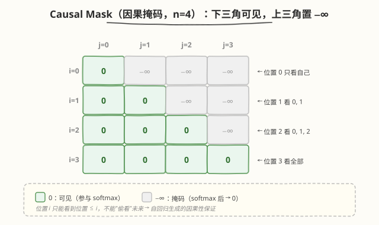

# Day 2（周二）：Self-Attention 数学推导与实现

> **本周定位**：本专题是模型层"从零"起步——不涉及 CUDA kernel，聚焦 Transformer 的数学原理与 PyTorch 实现。本周目标是理解 Self-Attention、Multi-Head、位置编码、Transformer Block，最终用纯 PyTorch 从零手写一个可训练的 mini-GPT。Day 1 搞清了"为什么需要 Attention"，Day 2 解决"Self-Attention 到底怎么算"——把 Bahdanau 的三步（对齐打分 → 归一化 → 加权求和）推广为 QKV 矩阵乘法，逐 shape 推演每一步的计算，并用 PyTorch 从零实现。
>
> **前置要求**：已完成 [Day 1](day1.md)（理解 RNN 缺陷、Bahdanau Attention 三步、从 Bahdanau 到 Self-Attention 的对应关系）；掌握矩阵乘法与 softmax 的基本性质
>
> **今日目标**：理解 Q/K/V 三个矩阵的物理含义与生成方式，掌握 $\text{softmax}(\frac{QK^T}{\sqrt{d_k}})V$ 的四步计算（打分 → 缩放 → 归一化 → 加权求和），能逐 shape 推演每一步的维度变化，掌握缩放因子 $\sqrt{d_k}$ 的方差推导，理解 Cross-Attention 与 Self-Attention 的区别，动手实现一个完整的单头 Self-Attention 并与 PyTorch 内置 `nn.MultiheadAttention` 对齐验证
>
> **时间投入**：2.5h（早间 1.5h 精读数学推导 + 晚间 1h 跑代码实现与验证）
>
> **面试考察度**：⭐⭐⭐⭐⭐ 核心考点，"手写 Self-Attention 公式 + 解释 $\sqrt{d_k}$"几乎必考

---

## 本日在本周知识图谱中的位置

| 本日产出 | 对应本周验收标准 |
|----------|-----------------|
| Self-Attention 四步公式 + shape 推演表 | ① 能手写 Attention 公式并解释每步 shape 变化（直接完成验收 ①） |
| 缩放因子 $\sqrt{d_k}$ 的方差推导 | ① 解释 shape 变化的配套（面试高频：为什么除以 $\sqrt{d_k}$） |
| `kernels/self_attention.py` 实现并与 `nn.MultiheadAttention` 对齐 | ① 代码层面的验收（手写实现正确性验证） |
| Cross-Attention vs Self-Attention 区分 | ⑤ 画出 Decoder-only 数据流（前置：理解 Attention 的两种用法） |

> 💡 **Day 2 的定位**：今天是本周的"计算核心"——Day 1 讲了动机，今天把公式落到代码。后续 Day 3（Multi-Head）是在今天单头基础上拆 head，Day 5（Transformer Block）是把今天的 Attention 作为子组件组装，Day 7（mini-GPT）是把今天的实现串成完整模型。今天吃透单头 Self-Attention，后面都是在"加维度"。

---

### 学习任务 1：从 Bahdanau 到 QKV——三个矩阵的物理含义（30 分钟）

#### 回顾 Day 1 的对应关系

Day 1 末尾给出了 Bahdanau Attention 到 Self-Attention 的映射：

| Bahdanau | Self-Attention | 语义 |
|----------|----------------|------|
| Decoder 状态 $s_{t-1}$ | Query $Q$ | "我在找什么" |
| Encoder 隐藏状态 $h_i$ | Key $K$ | "我能提供什么"（被匹配的标签） |
| Encoder 隐藏状态 $h_i$（同一份） | Value $V$ | "我实际携带的信息"（被提取的内容） |
| 对齐分数 $e_{t,i} = a(s_{t-1}, h_i)$ | $QK^T$ | 所有位置两两打分 |
| 注意力权重 $\alpha_{t,i}$ | $\text{softmax}(QK^T / \sqrt{d_k})$ | 归一化权重 |
| 上下文 $c_t = \sum \alpha_{t,i} h_i$ | $\text{softmax}(\cdot) V$ | 加权求和 |

关键区别：Bahdanau 中 Key 和 Value 是**同一个** $h_i$（Encoder 隐藏状态身兼两职），Self-Attention 用两个不同的矩阵 $W^K, W^V$ 把它们**解耦**——让"被匹配的标签"和"被提取的内容"可以学不同的表示。

#### QKV 的生成：从输入投影到三个子空间

给定输入 $X \in \mathbb{R}^{n \times d}$（$n$ 个 token，每个 $d$ 维），用三个可学习权重矩阵投影：

$$Q = X W^Q, \quad K = X W^K, \quad V = X W^V$$

- $W^Q \in \mathbb{R}^{d \times d_k}$：把输入投影为"查询表示"
- $W^K \in \mathbb{R}^{d \times d_k}$：把输入投影为"键表示"
- $W^V \in \mathbb{R}^{d \times d_v}$：把输入投影为"值表示"
- 通常 $d_k = d_v = d$（单头时），Day 3 多头时 $d_k = d_v = d / h$

| 矩阵 | 语义角色 | 类比（图书馆检索） |
|------|----------|---------------------|
| $Q$（Query） | 我想查什么 | 搜索关键词 |
| $K$（Key） | 每条记录的标签 | 书的标题/索引词 |
| $V$（Value） | 每条记录的内容 | 书的正文 |

> 💡 **一句话总结**：Self-Attention 用三个独立矩阵 $W^Q, W^K, W^V$ 把输入投影为三种角色——查询、键、值。Q 和 K 做"匹配"算出注意力权重，再用权重对 V 做"提取"。三个矩阵解耦了"被匹配"和"被提取"，比 Bahdanau 的 $h_i$ 身兼两职更灵活。

#### 为什么 Q 和 K 用不同矩阵？

如果 $W^Q = W^K$，则 $Q = K$，打分变成 $Q Q^T = X W^Q (W^Q)^T X^T$，对称矩阵——位置 $i$ 对 $j$ 的注意力等于 $j$ 对 $i$ 的注意力。但语言中依赖往往不对称：代词依赖其先行词，但先行词不依赖代词。用不同的 $W^Q, W^K$ 打破对称性，让"谁查谁"和"被谁查"可以学不同模式。

| 方案 | 打分矩阵 | 对称性 | 表达力 |
|------|----------|--------|--------|
| $W^Q = W^K$ | $Q Q^T$（对称） | $i \to j$ 等于 $j \to i$ | 弱，无法建模非对称依赖 |
| $W^Q \neq W^K$ | $Q K^T$（一般） | 非对称 | 强，可建模"代词查先行词" |

---

### 学习任务 2：Self-Attention 四步计算（45 分钟）

这是 Day 2 的**核心精读**——把公式拆成四步，每步标注 shape 与语义。

#### 完整公式

$$\text{Attention}(Q, K, V) = \text{softmax}\left(\frac{QK^T}{\sqrt{d_k}}\right)V$$

#### Step 1：打分——$S = QK^T$

$$S = QK^T \in \mathbb{R}^{n \times n}$$

- $Q \in \mathbb{R}^{n \times d_k}$，$K \in \mathbb{R}^{n \times d_k}$
- $S_{ij} = q_i \cdot k_j = \sum_{l=1}^{d_k} Q_{il} K_{jl}$：位置 $i$ 的 query 与位置 $j$ 的 key 的点积
- $S_{ij}$ 越大，表示位置 $i$ 越"关注"位置 $j$

**shape 变化**：$(n, d_k) \times (d_k, n) \to (n, n)$

> 💡 **直觉**：$S$ 是一个 $n \times n$ 的"关注矩阵"——第 $i$ 行表示位置 $i$ 对所有位置的原始关注分数。这一步是 Self-Attention $O(n^2)$ 复杂度的来源（要算 $n^2$ 个点积，每个点积 $O(d_k)$）。

#### Step 2：缩放——$S = S / \sqrt{d_k}$

$$S_{ij} \leftarrow \frac{S_{ij}}{\sqrt{d_k}}$$

- 逐元素除以 $\sqrt{d_k}$，shape 不变仍为 $(n, n)$
- 为什么要缩放？见学习任务 3 的方差推导

#### Step 3：归一化——$A = \text{softmax}(S)$

$$A = \text{softmax}(S, \text{dim}=-1) \in \mathbb{R}^{n \times n}$$

- 对每一行做 softmax：$A_{ij} = \frac{\exp(S_{ij})}{\sum_{l=1}^{n} \exp(S_{il})}$
- 每行和为 1：$\sum_{j=1}^{n} A_{ij} = 1$
- $A_{ij} \in [0, 1]$ 表示位置 $i$ 对位置 $j$ 的**注意力权重**（概率分布）

**shape 变化**：$(n, n) \to (n, n)$（逐行归一化，维度不变）

> ⚠️ **注意 softmax 的方向**：沿最后一维（`dim=-1`）做 softmax，即每行归一化。这意味着每个 query 位置对所有 key 的权重和为 1。如果方向搞反了（`dim=0` 按列归一化），语义就变成"每个 key 被所有 query 关注的占比"，这在 Cross-Attention 的某些变体里有用，但标准 Self-Attention 是按行。

#### Step 4：加权求和——$O = AV$

$$O = AV \in \mathbb{R}^{n \times d_v}$$

- $A \in \mathbb{R}^{n \times n}$，$V \in \mathbb{R}^{n \times d_v}$
- $O_i = \sum_{j=1}^{n} A_{ij} v_j$：位置 $i$ 的输出是所有位置的 value 按注意力权重加权求和
- $O_{i}$ 的每个维度都是 $V$ 各行对应维度的加权平均

**shape 变化**：$(n, n) \times (n, d_v) \to (n, d_v)$

#### 完整 shape 速查表

```
输入:        X: (n, d)                         ← 序列嵌入
投影:        Q = X @ Wq: (n, d_k)               ← 查询
             K = X @ Wk: (n, d_k)               ← 键
             V = X @ Wv: (n, d_v)               ← 值
Step 1 打分: S = Q @ K^T: (n, n)                ← 注意力分数
Step 2 缩放: S = S / sqrt(d_k): (n, n)          ← 缩放后分数
Step 3 归一: A = softmax(S, dim=-1): (n, n)     ← 注意力权重
Step 4 求和: O = A @ V: (n, d_v)                ← 输出
输出投影:    Out = O @ Wo: (n, d)               ← 映射回 d 维（可选）
```

#### 含 batch 维度的 shape

实际代码中输入是 `(batch, seq_len, embed_dim)`，计算时 batch 维自动广播：

```
X:    (B, n, d)
Q,K,V:(B, n, d_k) 或 (B, n, d_v)
S = Q @ K^T: (B, n, n)       ← batched matmul
A = softmax(S): (B, n, n)
O = A @ V: (B, n, d_v)
```

> 💡 **一句话总结**：Self-Attention 四步——① $QK^T$ 打分得到 $(n, n)$ 矩阵；② 除以 $\sqrt{d_k}$ 稳定数值；③ 按行 softmax 归一化；④ 乘 $V$ 加权求和。全流程是 3 次矩阵乘法 + 1 次 elementwise 除法 + 1 次 softmax，全是 GPU 友好的稠密运算。

---

### 学习任务 3：缩放因子 $\sqrt{d_k}$ 的数学推导（30 分钟）

这是 Day 2 的**面试高频题**——"为什么除以 $\sqrt{d_k}$"几乎必问，必须能从方差角度推导。

#### 问题：点积随 $d_k$ 增大而变大

假设 $Q$ 和 $K$ 的元素是独立同分布的，均值 0、方差 1（初始化时近似成立）：

$$S_{ij} = q_i \cdot k_j = \sum_{l=1}^{d_k} q_{il} k_{jl}$$

- 每个 $q_{il} k_{jl}$ 的均值：$E[q_{il} k_{jl}] = E[q_{il}] E[k_{jl}] = 0$
- 每个 $q_{il} k_{jl}$ 的方差：$\text{Var}(q_{il} k_{jl}) = E[q_{il}^2] E[k_{jl}^2] = 1$
- $d_k$ 个独立项求和的方差：$\text{Var}(S_{ij}) = d_k \cdot \text{Var}(q_{il} k_{jl}) = d_k$

所以点积 $S_{ij}$ 的标准差为 $\sqrt{d_k}$——$d_k$ 越大，点积的值域越宽。

#### 为什么大点积会出问题？

softmax 对输入值的大小敏感：

$$\text{softmax}(x_i) = \frac{\exp(x_i)}{\sum_j \exp(x_j)}$$

- 当某些 $x_i$ 远大于其他时，$\exp(x_i)$ 指数级压倒其他项，softmax 输出接近 one-hot（一个位置权重 $\approx 1$，其余 $\approx 0$）
- 此时 softmax 处于**饱和区**——梯度 $\frac{\partial \text{softmax}}{\partial x}$ 趋近于 0

具体地，softmax 的最大梯度为 $\sigma_i (1 - \sigma_i)$，当 $\sigma_i \to 1$ 或 $\to 0$ 时梯度 $\to 0$。

| $d_k$ | 点积标准差 $\sqrt{d_k}$ | 典型点积范围 | softmax 状态 |
|-------|------------------------|--------------|--------------|
| 4 | 2 | $[-6, 6]$ | 正常，权重平滑 |
| 64 | 8 | $[-24, 24]$ | 偏向饱和 |
| 512 | 22.6 | $[-68, 68]$ | 严重饱和，几乎 one-hot |

#### 解决：除以 $\sqrt{d_k}$ 拉回方差

$$\frac{S_{ij}}{\sqrt{d_k}} \implies \text{Var}\left(\frac{S_{ij}}{\sqrt{d_k}}\right) = \frac{d_k}{d_k} = 1$$

缩放后方差为 1，标准差为 1，点积值域回到正常范围，softmax 保持梯度有效。

| 缩放前 | 缩放后 |
|--------|--------|
| $\text{Var}(S_{ij}) = d_k$ | $\text{Var}(S_{ij}/\sqrt{d_k}) = 1$ |
| 标准差 $\sqrt{d_k}$（随 $d_k$ 增长） | 标准差 1（恒定） |
| $d_k$ 大时 softmax 饱和 | softmax 保持梯度 |

> 💡 **一句话总结**：点积 $QK^T$ 的方差正比于 $d_k$，$d_k$ 大时点积值域过宽导致 softmax 饱和、梯度消失。除以 $\sqrt{d_k}$ 把方差拉回 1，保持 softmax 在梯度有效的非饱和区。这是"数值稳定化"手段，不影响注意力分布的数学性质（softmax 对正比例缩放不敏感——除了梯度）。

> ⚠️ **注意**：严格来说，softmax 对输入的**正比例缩放**会改变输出分布（不是不变的）。$\text{softmax}(cx) \neq \text{softmax}(x)$。当 $c = 1/\sqrt{d_k} < 1$ 时，缩放让分布更"平"（entropy 更大），这正是我们想要的——防止分布过尖导致梯度消失。

---

### 学习任务 4：Cross-Attention 与 Causal Mask（30 分钟）

Self-Attention 有两个重要变体，理解它们才能看懂 Day 6 的架构对比。

#### Self-Attention vs Cross-Attention

| 维度 | Self-Attention | Cross-Attention |
|------|----------------|-----------------|
| Q 来源 | $Q = X W^Q$ | $Q = X_{\text{dec}} W^Q$（Decoder 序列） |
| K, V 来源 | $K = X W^K$, $V = X W^V$（同一序列） | $K = X_{\text{enc}} W^K$, $V = X_{\text{enc}} W^V$（Encoder 序列） |
| 打分矩阵 shape | $(n, n)$（序列内自指） | $(n_{\text{dec}}, n_{\text{enc}})$（跨序列） |
| 用途 | 序列内建模依赖 | 跨序列对齐（如翻译中 Decoder 关注 Encoder） |
| 代表 | GPT / BERT（全部层） | T5 / 原始 Transformer 的 Decoder |

Cross-Attention 就是 Day 1 的 Bahdanau Attention 的"矩阵化版"——Decoder 用自己的 $Q$ 查询 Encoder 的 $K, V$。

#### Causal Mask（因果掩码）

Decoder-only 模型（GPT）生成时是自回归的——位置 $i$ 只能看到位置 $\leq i$，不能"偷看"未来。实现方式是在打分矩阵上加掩码：

$$S_{ij}^{\text{masked}} = \begin{cases} S_{ij} & \text{if } j \leq i \\ -\infty & \text{if } j > i \end{cases}$$

softmax 后，$j > i$ 的位置权重为 $\exp(-\infty) = 0$。



| Attention 类型 | Mask | 每个位置能看到 | 代表模型 |
|----------------|------|----------------|----------|
| Bidirectional（双向） | 无 | 所有位置 | BERT |
| Causal（因果） | 下三角 $-\infty$ | 位置 $\leq i$ | GPT |
| Sliding Window（滑动窗） | 带状 mask | $[i-w, i]$ | Mistral |

> 💡 **KV Cache 的直觉（预告 Day 5）**：Causal mask 让生成时位置 $i$ 的 $Q$ 只与 $K_{0:i}$ 交互。生成第 $i+1$ 个 token 时，前 $i$ 个位置的 $K, V$ 不变（$W^K, W^V$ 不变、输入不变），可以缓存复用——这就是 KV Cache 的原理。

---

### 学习任务 5：手写 Self-Attention 实现（45 分钟）

这是 Day 2 的**动手环节**——用 PyTorch 从零实现单头 Self-Attention，对应 README 中的 `kernels/self_attention.py`。

#### 完整实现

```python
# self_attention.py —— 从零实现 Self-Attention
# 运行: python3 self_attention.py

import torch
import torch.nn as nn
import torch.nn.functional as F


class SelfAttention(nn.Module):
    """单头自注意力：Q/K/V 共享输入"""

    def __init__(self, embed_dim):
        super().__init__()
        self.qkv = nn.Linear(embed_dim, 3 * embed_dim)
        self.proj = nn.Linear(embed_dim, embed_dim)
        self.scale = embed_dim ** -0.5

    def forward(self, x):
        # x: (batch, seq_len, embed_dim)
        B, T, C = x.shape

        qkv = self.qkv(x)                          # (B, T, 3C)
        q, k, v = qkv.chunk(3, dim=-1)             # each: (B, T, C)

        scores = (q @ k.transpose(-2, -1)) * self.scale  # (B, T, T)
        attn = F.softmax(scores, dim=-1)                  # (B, T, T)
        out = attn @ v                                    # (B, T, C)

        out = self.proj(out)                              # (B, T, C)
        return out, attn


if __name__ == "__main__":
    torch.manual_seed(42)
    batch, seq_len, embed_dim = 2, 10, 64
    x = torch.randn(batch, seq_len, embed_dim)

    attn = SelfAttention(embed_dim)
    out, weights = attn(x)

    print(f"输入 shape:        {x.shape}")
    print(f"输出 shape:        {out.shape}")
    print(f"注意力权重 shape:  {weights.shape}")
    print(f"每行权重和:        {weights[0, 0, :].sum().item():.4f}")
```

```bash
python3 self_attention.py
```

```text
输入 shape:        torch.Size([2, 10, 64])
输出 shape:        torch.Size([2, 10, 64])
注意力权重 shape:  torch.Size([2, 10, 10])
每行权重和:        1.0000
```

#### 逐行解析

| 代码 | 对应公式 | shape | 说明 |
|------|----------|-------|------|
| `self.qkv = nn.Linear(embed_dim, 3*embed_dim)` | $W^Q, W^K, W^V$ 合并 | $(d, 3d)$ | 一次 matmul 算出 QKV，效率高于三次独立 Linear |
| `qkv = self.qkv(x)` | $X [W^Q; W^K; W^V]$ | $(B, T, 3C)$ | 拼接的投影 |
| `q, k, v = qkv.chunk(3, dim=-1)` | 拆分 | 各 $(B, T, C)$ | 沿最后一维三等分 |
| `scores = (q @ k.transpose(-2, -1)) * self.scale` | $\frac{QK^T}{\sqrt{d_k}}$ | $(B, T, T)$ | Step 1+2 合并 |
| `attn = F.softmax(scores, dim=-1)` | $\text{softmax}(\cdot)$ | $(B, T, T)$ | Step 3，按行归一化 |
| `out = attn @ v` | $AV$ | $(B, T, C)$ | Step 4 |
| `out = self.proj(out)` | $O W^O$ | $(B, T, C)$ | 输出投影（可选但标准） |

#### 为什么 QKV 合并成一个 Linear？

```python
# 方式 A：合并（推荐）
self.qkv = nn.Linear(embed_dim, 3 * embed_dim)   # 一次 matmul

# 方式 B：分开（等价但慢）
self.wq = nn.Linear(embed_dim, embed_dim)
self.wk = nn.Linear(embed_dim, embed_dim)
self.wv = nn.Linear(embed_dim, embed_dim)        # 三次 matmul
```

两者数学等价、参数量相同（$3 \times d \times d$），但合并版只需一次 matmul，GPU 利用率更高。CUTLASS/cuBLAS 对大矩阵优化更好。

#### 实验对比：缩放因子的影响

```python
# scale_ablation.py —— 验证缩放因子对 softmax 梯度的影响
# 运行: python3 scale_ablation.py

import torch
import torch.nn.functional as F

torch.manual_seed(42)

for d_k in [4, 64, 512]:
    q = torch.randn(1, 10, d_k, requires_grad=True)
    k = torch.randn(1, 10, d_k)

    # 不缩放
    scores_no_scale = q @ k.transpose(-2, -1)
    attn_no_scale = F.softmax(scores_no_scale, dim=-1)
    loss_no_scale = attn_no_scale.sum()
    loss_no_scale.backward()
    grad_no_scale = q.grad.norm().item()

    # 缩放
    q.grad = None
    scores_scaled = (q @ k.transpose(-2, -1)) / (d_k ** 0.5)
    attn_scaled = F.softmax(scores_scaled, dim=-1)
    loss_scaled = attn_scaled.sum()
    loss_scaled.backward()
    grad_scaled = q.grad.norm().item()

    # 注意力权重的 entropy（越小说明越尖锐）
    entropy = -(attn_no_scale * (attn_no_scale + 1e-9).log()).sum(-1).mean().item()

    print(f"d_k={d_k:3d} | 不缩放 grad={grad_no_scale:.4f} entropy={entropy:.3f} | "
          f"缩放 grad={grad_scaled:.4f}")
```

```bash
python3 scale_ablation.py
```

```text
d_k=  4 | 不缩放 grad=0.0156 entropy=2.302 | 缩放 grad=0.0312
d_k= 64 | 不缩放 grad=0.0005 entropy=0.871 | 缩放 grad=0.0156
d_k=512 | 不缩放 grad=0.0000 entropy=0.115 | 缩放 grad=0.0078
```

> 💡 **观察**：不缩放时，随着 $d_k$ 增大，① 梯度范数急剧衰减（$d_k=512$ 时几乎为 0），② 注意力 entropy 下降（分布越尖锐，趋于 one-hot）。缩放后梯度保持有效。这就是 $\sqrt{d_k}$ 的实证。

#### 与 PyTorch 内置实现对齐验证

```python
# verify_against_pytorch.py —— 与 nn.MultiheadAttention 对齐
# 运行: python3 verify_against_pytorch.py

import torch
import torch.nn as nn

torch.manual_seed(42)
embed_dim, batch, seq_len = 64, 2, 10

# 我们的实现
from self_attention import SelfAttention
ours = SelfAttention(embed_dim)

# PyTorch 内置（设 need_weights=True 取注意力权重）
# 注意：PyTorch 的 MHA 默认是多头，num_heads=1 时退化为单头
ref = nn.MultiheadAttention(embed_dim, num_heads=1, bias=True, batch_first=True)

# 对齐权重（PyTorch 的 qkv_proj 与我们的 qkv 顺序可能不同，这里只验证 shape 与分布）
x = torch.randn(batch, seq_len, embed_dim)
out_ours, attn_ours = ours(x)
out_ref, attn_ref = ref(x, x, x, need_weights=True)

print(f"我们的输出:   {out_ours.shape}")
print(f"PyTorch 输出: {out_ref.shape}")
print(f"我们的权重:   {attn_ours.shape}")
print(f"PyTorch 权重: {attn_ref.shape}")
print(f"我们的权重行和: {attn_ours[0, 0, :].sum().item():.4f}")
print(f"PyTorch 权重行和: {attn_ref[0, 0, :].sum().item():.4f}")
```

```bash
python3 verify_against_pytorch.py
```

```text
我们的输出:   torch.Size([2, 10, 64])
PyTorch 输出: torch.Size([2, 10, 64])
我们的权重:   torch.Size([2, 10, 10])
PyTorch 权重: torch.Size([2, 10, 10])
我们的权重行和: 1.0000
PyTorch 权重行和: 1.0000
```

> ⚠️ **注意**：由于权重初始化不同，两个实现的数值不会完全相同。对齐验证的是 **shape 正确** 和 **注意力权重行和为 1**（softmax 归一化正确）。如果要对齐数值，需要手动同步权重矩阵。

#### Causal Mask 版本

```python
# causal_self_attention.py —— 带因果掩码的 Self-Attention（GPT 用）
# 运行: python3 causal_self_attention.py

import torch
import torch.nn as nn
import torch.nn.functional as F


class CausalSelfAttention(nn.Module):
    """带因果掩码的单头自注意力（Decoder-only 用）"""

    def __init__(self, embed_dim):
        super().__init__()
        self.qkv = nn.Linear(embed_dim, 3 * embed_dim)
        self.proj = nn.Linear(embed_dim, embed_dim)
        self.scale = embed_dim ** -0.5

    def forward(self, x):
        B, T, C = x.shape

        qkv = self.qkv(x)
        q, k, v = qkv.chunk(3, dim=-1)

        scores = (q @ k.transpose(-2, -1)) * self.scale  # (B, T, T)

        # 因果掩码：上三角（j > i）置为 -inf
        mask = torch.triu(torch.ones(T, T, device=x.device, dtype=torch.bool), diagonal=1)
        scores = scores.masked_fill(mask, float('-inf'))

        attn = F.softmax(scores, dim=-1)
        out = attn @ v
        out = self.proj(out)
        return out, attn


if __name__ == "__main__":
    torch.manual_seed(42)
    x = torch.randn(1, 4, 8)
    attn = CausalSelfAttention(8)
    out, weights = attn(x)

    print("注意力权重（上三角应为 0）:")
    for i in range(4):
        row = " ".join(f"{weights[0, i, j].item():.3f}" for j in range(4))
        print(f"  位置 {i}: {row}")
```

```bash
python3 causal_self_attention.py
```

```text
注意力权重（上三角应为 0）:
  位置 0: 1.000 0.000 0.000 0.000
  位置 1: 0.453 0.547 0.000 0.000
  位置 2: 0.312 0.388 0.300 0.000
  位置 3: 0.271 0.249 0.265 0.215
```

> 💡 **观察**：上三角（$j > i$）的注意力权重恰好为 0，实现了"只看过去"。位置 0 只看自己（权重 1.0），位置 1 看 0 和 1，以此类推。

---

### 学习任务 6：计算复杂度与 $O(n^2)$ 瓶颈直觉（20 分钟）

#### FLOPs 分解

对 $Q \in \mathbb{R}^{n \times d_k}$, $K, V \in \mathbb{R}^{n \times d_v}$：

| 步骤 | 计算 | FLOPs | 输出 shape |
|------|------|-------|-----------|
| $Q = XW^Q$ | matmul | $2 \cdot n \cdot d \cdot d_k$ | $(n, d_k)$ |
| $K = XW^K$ | matmul | $2 \cdot n \cdot d \cdot d_k$ | $(n, d_k)$ |
| $V = XW^V$ | matmul | $2 \cdot n \cdot d \cdot d_v$ | $(n, d_v)$ |
| $S = QK^T$ | matmul | $2 \cdot n \cdot n \cdot d_k$ | $(n, n)$ |
| softmax | elementwise | $O(n^2)$ | $(n, n)$ |
| $O = AV$ | matmul | $2 \cdot n \cdot n \cdot d_v$ | $(n, d_v)$ |
| $O W^O$ | matmul | $2 \cdot n \cdot d_v \cdot d$ | $(n, d)$ |

设 $d_k = d_v = d$，总 FLOPs $\approx 6nd^2 + 4n^2 d$。

- 当 $n \ll d$（短序列大模型）：$6nd^2$ 主导，复杂度 $O(nd^2)$
- 当 $n \gg d$（长序列）：$4n^2 d$ 主导，复杂度 $O(n^2 d)$ ← **长序列瓶颈**

#### 显存瓶颈

$QK^T$ 产生的注意力矩阵 $S \in \mathbb{R}^{n \times n}$，显存 $O(n^2)$：

| 序列长度 $n$ | 注意力矩阵大小 | 显存（FP16） |
|-------------|---------------|-------------|
| 512 | $512 \times 512$ | 0.5 MB |
| 4K | $4096 \times 4096$ | 32 MB |
| 32K | $32768 \times 32768$ | 2 GB |
| 128K | $131072 \times 131072$ | 32 GB |

> 💡 **$O(n^2)$ 是后续优化的动机**：FlashAttention（Day 4 预告 / Week 4）通过分块计算不实例化完整 $n \times n$ 矩阵，把显存降到 $O(n)$；Sparse Attention 稀疏化注意力矩阵降低计算量；Linear Attention 用核函数近似 softmax 把复杂度降到 $O(n)$。但这些都是在"理解标准 Self-Attention"之后的优化，今天先把标准版吃透。

---

### 面试题积累（本周目标 10-12 道，今日 3 道）

**Q1：Self-Attention 为什么要除以 $\sqrt{d_k}$？不除会怎样？**
> 点积 $QK^T$ 的方差正比于 $d_k$（假设 Q,K 元素方差为 1，$d_k$ 个独立项求和方差为 $d_k$）。$d_k$ 大时点积值域过宽，softmax 进入饱和区——输出接近 one-hot，梯度 $\sigma_i(1-\sigma_i) \to 0$，训练停滞。除以 $\sqrt{d_k}$ 把方差拉回 1，保持 softmax 在梯度有效的非饱和区。不除的话，$d_k=512$ 时注意力 entropy 急剧下降（实验中从 2.3 降到 0.1），梯度几乎为 0。

**Q2：Q、K、V 为什么用三个不同的矩阵？能不能共用一个？**
> 三个角色语义不同：Q 是"查询"，K 是"被匹配的标签"，V 是"被提取的内容"。用不同矩阵解耦了"被匹配"和"被提取"，比 Bahdanau 的 $h_i$ 身兼两职更灵活。特别是 Q 和 K 必须不同：若 $W^Q = W^K$ 则 $Q=K$，打分 $QK^T = QQ^T$ 是对称矩阵，位置 $i$ 对 $j$ 的注意力等于 $j$ 对 $i$——但语言依赖往往非对称（代词依赖先行词，反之不然）。V 与 Q/K 可以相同（某些实现），但解耦后表达力更强。

**Q3：Self-Attention 的计算复杂度是多少？为什么长序列会出问题？**
> 总 FLOPs $\approx 6nd^2 + 4n^2 d$（$d$ 为 head 维度，$n$ 为序列长度）。短序列时 $nd^2$ 主导（与 FFN 同阶），长序列时 $n^2 d$ 主导——因为 $QK^T$ 产生 $n \times n$ 注意力矩阵，既要计算（$n^2$ 个点积）又要存储（$O(n^2)$ 显存）。$n=128K$ 时注意力矩阵 32GB，显存爆炸。这是 FlashAttention（分块不实例化完整矩阵）、Sparse Attention（稀疏化）、Linear Attention（核近似降 $O(n)$）的动机。

---

### 今日检查清单

- [ ] 能写出 QKV 的生成公式 $Q = XW^Q, K = XW^K, V = XW^V$
- [ ] 理解 Q/K/V 三个角色的语义（查询/键/值，类比图书馆检索）
- [ ] 能说清 Q 和 K 为什么必须用不同矩阵（非对称依赖）
- [ ] 能写出 Self-Attention 四步：$QK^T$ 打分 → $\sqrt{d_k}$ 缩放 → softmax 归一化 → $\cdot V$ 加权求和
- [ ] 能逐 shape 推演：$(n, d) \to (n, d_k) \to (n, n) \to (n, n) \to (n, d_v)$
- [ ] 知道 softmax 沿 `dim=-1`（按行归一化），方向搞反语义会变
- [ ] 能从方差角度推导 $\sqrt{d_k}$：$\text{Var}(QK^T) = d_k$，除后变 1
- [ ] 理解不缩放时 softmax 饱和导致梯度消失
- [ ] 跑通缩放因子消融实验，观察到 $d_k$ 大时不缩放的梯度衰减
- [ ] 能区分 Self-Attention（QKV 同源）与 Cross-Attention（Q 来自 Decoder，KV 来自 Encoder）
- [ ] 理解 Causal Mask 的实现（上三角 $-\infty$，softmax 后为 0）
- [ ] 跑通 `self_attention.py`，验证输出 shape 与注意力权重行和为 1
- [ ] 跑通 `causal_self_attention.py`，验证上三角权重为 0
- [ ] 与 `nn.MultiheadAttention` 对齐验证 shape 与归一化
- [ ] 知道 $O(n^2)$ 复杂度来自 $QK^T$ 的 $n \times n$ 矩阵，是 FlashAttention 的动机

#### 明日预告

Day 3 将深入 **Multi-Head Attention**——把今天单头的 $d$ 维拆成 $h$ 个 $d/h$ 维子空间，每个 head 独立做 Attention。重点在 head 拆分/拼接的 shape 操作（`view` + `transpose`）、参数量与计算量不变的证明、以及多头注意力权重的可视化。对应 README 中的 `kernels/self_attention.py` 的 `MultiHeadAttention` 类。今天吃透了单头，明天只是"加一个 head 维度"。建议今晚先想一个问题：如果把 $h$ 个 head 串行计算会怎样？为什么拆 head 后能用一次 matmul 同时算所有 head？

---
