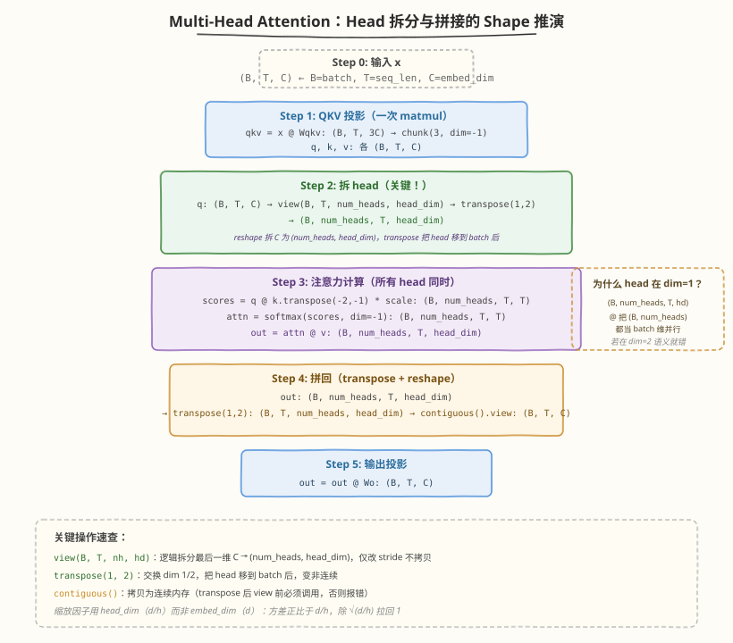

# Day 3（周三）：Multi-Head Attention

> **本周定位**：本专题是模型层"从零"起步——不涉及 CUDA kernel，聚焦 Transformer 的数学原理与 PyTorch 实现。本周目标是理解 Self-Attention、Multi-Head、位置编码、Transformer Block，最终用纯 PyTorch 从零手写一个可训练的 mini-GPT。Day 2 把单头 Self-Attention 的四步计算吃透了，Day 3 解决"为什么要多头、怎么拆 head"——把 $d$ 维空间切成 $h$ 个子空间并行做 Attention，理解 shape 操作的精髓，掌握参数量/计算量不变的证明，并动手实现 + 可视化多头注意力。
> **前置要求**：已完成 [Day 2](day2.md)（理解 QKV 生成、$\text{softmax}(\frac{QK^T}{\sqrt{d_k}})V$ 四步、逐 shape 推演、缩放因子推导、`self_attention.py` 实现）
> **今日目标**：理解 Multi-Head 的动机（子空间并行关注不同模式），掌握 head 拆分与拼接的 shape 操作（`view` + `transpose` + `contiguous`），证明多头与单头的参数量和 FLOPs 相同，理解缩放因子用 $d/h$ 而非 $d$ 的原因，动手实现 `MultiHeadAttention` 类并可视化不同 head 的注意力模式
> **时间投入**：2.5h（早间 1.5h 精读 shape 操作 + 晚间 1h 跑代码与可视化）
> **面试考察度**：⭐⭐⭐⭐⭐ 核心考点，"Multi-Head 怎么拆、为什么计算量不变"是高频题

---

## 本日在本周知识图谱中的位置

| 本日产出 | 对应本周验收标准 |
|----------|-----------------|
| Multi-Head 拆分/拼接 shape 推演表 | ① 解释每步 shape 变化（扩展到多头维度） |
| 参数量/计算量不变的证明 | ② 能说出 Multi-Head 为什么要拆 head 而不是直接用大维度（直接完成验收 ②） |
| `kernels/self_attention.py` 的 `MultiHeadAttention` 类 | ① 代码层面的验收（多头实现正确性） |
| 多头注意力可视化 | ⑤ 画出 Decoder-only 数据流（前置：理解 head 间的并行关系） |

> 💡 **Day 3 的定位**：今天是在 Day 2 单头基础上"加一个 head 维度"——数学公式不变，只是 shape 操作变复杂。核心难点是 `view` + `transpose` 的维度变换，这是 PyTorch 实现 MHA 最容易出错的地方。今天搞透 shape 操作，Day 5 组装 Transformer Block 时不会再被维度搞晕。

---

### 学习任务 1：为什么需要多头（30 分钟）

#### 单头的局限：关注模式混杂

Day 2 的单头 Self-Attention 用全部 $d$ 维做点积，所有"关注模式"混在一个注意力矩阵里：

- 一个 head 要同时学习语法依赖（"代词→先行词"）、语义相似（"猫→动物"）、位置模式（"相邻词互看"）
- 这些模式可能相互冲突——一个 $n \times n$ 的注意力矩阵难以同时表达多种关系

#### Multi-Head 的核心思想：子空间并行

把 $d$ 维切成 $h$ 个 $\frac{d}{h}$ 维子空间，每个 head 独立做 Attention：

$$\text{MultiHead}(Q, K, V) = \text{Concat}(\text{head}_1, \ldots, \text{head}_h) W^O$$

$$\text{head}_i = \text{Attention}(Q W_i^Q, K W_i^K, V W_i^V)$$

- 每个 head 有自己的 $W_i^Q \in \mathbb{R}^{d \times d/h}$, $W_i^K \in \mathbb{R}^{d \times d/h}$, $W_i^V \in \mathbb{R}^{d \times d/h}$
- 各 head 学不同的关注模式，最后 `Concat` 拼接后用 $W^O$ 融合

| 维度 | 单头 | 多头（$h$ 个 head） |
|------|------|----------------------|
| 每 head 的 Q/K 维度 | $d$ | $d/h$（`head_dim`） |
| head 数量 | 1 | $h$ |
| 每 head 注意力矩阵 | $(n, n)$ | $(n, n)$（仍是 $n \times n$，但点积维度变小） |
| 关注模式 | 1 种（混杂） | $h$ 种（各 head 独立） |

#### 形象类比

| 类比 | 单头 | 多头 |
|------|------|------|
| 团队 | 1 个全才做所有事 | $h$ 个专才各做一类事，最后汇总 |
| 视角 | 1 台固定焦距相机 | $h$ 台不同焦距相机（广角/微距/长焦），拼成全景 |
| 信号处理 | 1 个全频段滤波器 | $h$ 个带通滤波器，各提取一个频段 |

> 💡 **一句话总结**：多头不是"多算"，而是"换一种切分方式"——把 $d$ 维空间拆成 $h$ 个子空间，每个子空间独立学一种关注模式，最后拼回来。总 FLOPs 和参数量与单头相同（下面证明），但表达力更强。

---

### 学习任务 2：参数量与计算量不变的证明（30 分钟）

这是 Day 3 的**面试高频题**——"多头的计算量和单头相比如何"，必须能定量证明。

#### 参数量对比

| 权重 | 单头 | 多头（$h$ 个 head） | 比较 |
|------|------|----------------------|------|
| $W^Q$ | $d \times d$ | $h \times (d \times \frac{d}{h}) = d \times d$ | 相同 |
| $W^K$ | $d \times d$ | $h \times (d \times \frac{d}{h}) = d \times d$ | 相同 |
| $W^V$ | $d \times d$ | $h \times (d \times \frac{d}{h}) = d \times d$ | 相同 |
| $W^O$ | $d \times d$ | $d \times d$ | 相同 |
| **总计** | $4d^2$ | $4d^2$ | **相同** |

> 💡 **关键**：每个 head 的 $W_i^Q$ 是 $d \times (d/h)$，$h$ 个加起来是 $h \times d \times (d/h) = d \times d$，与单头的 $d \times d$ 完全一致。多头是在"切分" $W^Q$ 这个大矩阵，不是新增矩阵。

#### FLOPs 对比

设序列长度 $n$，单头 $d_k = d$，多头每 head $d_k = d/h$：

| 计算步骤 | 单头 FLOPs | 多头 FLOPs（$h$ 个 head） |
|----------|-----------|---------------------------|
| $Q = XW^Q$ | $2nd^2$ | $2nd^2$（$h \times 2n \cdot d \cdot \frac{d}{h}$） |
| $K = XW^K$ | $2nd^2$ | $2nd^2$ |
| $V = XW^V$ | $2nd^2$ | $2nd^2$ |
| $S = QK^T$（每 head） | $2n^2 d$ | $h \times 2n^2 \frac{d}{h} = 2n^2 d$ |
| $O = AV$（每 head） | $2n^2 d$ | $h \times 2n^2 \frac{d}{h} = 2n^2 d$ |
| $OW^O$ | $2nd^2$ | $2nd^2$ |
| **总计** | $8nd^2 + 4n^2 d$ | $8nd^2 + 4n^2 d$ |

**结论**：总 FLOPs 完全相同。多头改变的是"每个 head 的点积维度"（$d \to d/h$），但 head 数量增加了 $h$ 倍，乘积抵消。

| 维度 | 单头 | 多头 | 差异 |
|------|------|------|------|
| 参数量 | $4d^2$ | $4d^2$ | 无 |
| 总 FLOPs | $8nd^2 + 4n^2 d$ | $8nd^2 + 4n^2 d$ | 无 |
| 每 head 表达力 | 强（$d$ 维点积） | 弱（$d/h$ 维点积） | 多头牺牲单 head 表达力换多样性 |
| 注意力矩阵数量 | 1 个 $(n, n)$ | $h$ 个 $(n, n)$ | 多头有 $h$ 个独立注意力模式 |

> ⚠️ **注意**：虽然总 FLOPs 相同，但多头有 $h$ 个独立的 $n \times n$ 注意力矩阵，显存占用是单头的 $h$ 倍（$h \times n^2$ vs $n^2$）。不过注意力矩阵通常不是显存瓶颈（$n^2 \ll nd$），实际影响很小。

---

### 学习任务 3：Head 拆分与拼接的 Shape 操作（45 分钟）

这是 Day 3 的**核心精读**——shape 操作是 MHA 实现中最容易出错的地方。

#### 问题：如何用一次 matmul 同时算所有 head？

朴素想法是循环 $h$ 次，每次算一个 head：

```python
# 朴素版（串行，慢）
outputs = []
for i in range(num_heads):
    q_i = x @ W_q[i]   # (B, T, d/h)
    k_i = x @ W_k[i]   # (B, T, d/h)
    v_i = x @ W_v[i]   # (B, T, d/h)
    scores = q_i @ k_i.transpose(-2, -1) / scale  # (B, T, T)
    attn = softmax(scores)
    out_i = attn @ v_i  # (B, T, d/h)
    outputs.append(out_i)
out = torch.cat(outputs, dim=-1)  # (B, T, d)
```

但这样有 $h$ 次独立的 matmul，效率低。高效做法：**一次 matmul 算出所有 head 的 QKV，然后 reshape 拆出 head 维度**。

#### 高效实现的 Shape 推演

输入 $x \in \mathbb{R}^{B \times T \times C}$（$C = d$ = `embed_dim`）：



#### 为什么 `view` 前要 `transpose` + `contiguous`？

```python
# transpose 后内存不连续，view 要求连续
out = out.transpose(1, 2)        # (B, T, num_heads, head_dim) — 非连续！
out = out.contiguous()           # 拷贝为连续内存
out = out.view(B, T, C)          # (B, T, C) — 合并最后两维
```

| 操作 | 作用 | 是否改变内存 |
|------|------|-------------|
| `view(B, T, nh, hd)` | 逻辑拆分最后一维 | 否（仅改 stride） |
| `transpose(1, 2)` | 交换 dim 1 和 dim 2 | 否（仅改 stride，但变非连续） |
| `contiguous()` | 拷贝为连续内存 | 是（实际数据搬运） |
| `.view(B, T, C)` | 合并最后两维 | 否（要求连续） |

> ⚠️ **常见坑**：`transpose` 后直接 `view` 会报错（"view size is not compatible with input tensor's size and stride"）。必须先 `contiguous()` 再 `view`。或者用 `reshape`（自动处理连续性，但可能触发拷贝）。

> 💡 **`view` vs `reshape`**：`view` 要求内存连续，不拷贝数据（快）；`reshape` 自动判断，不连续时拷贝（安全但可能慢）。MHA 实现中 `transpose` 后用 `reshape` 更省心，用 `contiguous().view()` 更明确。

#### 为什么 `num_heads` 要放在 `dim=1`（batch 后面）？

把 shape 排列为 `(B, num_heads, T, head_dim)` 而非 `(B, T, num_heads, head_dim)`，是为了让 `@`（batched matmul）正确广播：

```python
# (B, num_heads, T, head_dim) @ (B, num_heads, head_dim, T) → (B, num_heads, T, T)
scores = q @ k.transpose(-2, -1)  # num_heads 作为 batch 维自动并行
```

如果 `num_heads` 在 `dim=2`（即 `(B, T, num_heads, head_dim)`），`@` 不会把它当作 batch 维，计算语义就错了。

---

### 学习任务 4：缩放因子的变化——$\sqrt{d/h}$（15 分钟）

Day 2 推导了单头缩放因子 $\sqrt{d_k}$，其中 $d_k = d$。多头时每个 head 的 $d_k = d/h$：

$$\text{scale} = \frac{1}{\sqrt{d_k}} = \frac{1}{\sqrt{d/h}} = \sqrt{\frac{h}{d}}$$

| 配置 | head_dim $d_k$ | scale $= 1/\sqrt{d_k}$ |
|------|----------------|------------------------|
| 单头（$h=1$） | $d$ | $1/\sqrt{d}$ |
| 8 头（$d=512$） | 64 | $1/\sqrt{64} = 1/8$ |
| 32 头（$d=4096$） | 128 | $1/\sqrt{128} \approx 1/11.3$ |

> 💡 **关键**：缩放因子用 `head_dim` 而非 `embed_dim`。因为每个 head 的点积是 $d/h$ 维的，方差正比于 $d/h$，要除 $\sqrt{d/h}$ 才能拉回方差 1。如果误用 $\sqrt{d}$，缩放过度，注意力会过于平滑（entropy 过大）。

```python
# 正确
self.scale = self.head_dim ** -0.5    # head_dim = embed_dim // num_heads

# 错误（常见 bug）
self.scale = self.embed_dim ** -0.5   # 会过度缩放
```

---

### 学习任务 5：手写 MultiHeadAttention 实现（45 分钟）

这是 Day 3 的**动手环节**——对应 README 中的 `kernels/self_attention.py` 的 `MultiHeadAttention` 类。

#### 完整实现

```python
# multi_head_attention.py —— 从零实现 Multi-Head Attention
# 运行: python3 multi_head_attention.py

import torch
import torch.nn as nn
import torch.nn.functional as F


class MultiHeadAttention(nn.Module):
    """多头自注意力：拆 head → 各自 attention → 拼回"""

    def __init__(self, embed_dim, num_heads):
        super().__init__()
        assert embed_dim % num_heads == 0, "embed_dim 必须能被 num_heads 整除"
        self.num_heads = num_heads
        self.head_dim = embed_dim // num_heads
        self.scale = self.head_dim ** -0.5

        self.qkv = nn.Linear(embed_dim, 3 * embed_dim)
        self.proj = nn.Linear(embed_dim, embed_dim)

    def forward(self, x):
        B, T, C = x.shape

        qkv = self.qkv(x)                                   # (B, T, 3C)
        q, k, v = qkv.chunk(3, dim=-1)                      # each: (B, T, C)

        # 拆 head: (B, T, C) -> (B, T, num_heads, head_dim) -> (B, num_heads, T, head_dim)
        q = q.view(B, T, self.num_heads, self.head_dim).transpose(1, 2)
        k = k.view(B, T, self.num_heads, self.head_dim).transpose(1, 2)
        v = v.view(B, T, self.num_heads, self.head_dim).transpose(1, 2)

        scores = (q @ k.transpose(-2, -1)) * self.scale      # (B, num_heads, T, T)
        attn = F.softmax(scores, dim=-1)
        out = attn @ v                                        # (B, num_heads, T, head_dim)

        # 拼回: (B, num_heads, T, head_dim) -> (B, T, C)
        out = out.transpose(1, 2).contiguous().view(B, T, C)
        out = self.proj(out)
        return out, attn


if __name__ == "__main__":
    torch.manual_seed(42)
    batch, seq_len, embed_dim, num_heads = 2, 10, 64, 8
    x = torch.randn(batch, seq_len, embed_dim)

    mha = MultiHeadAttention(embed_dim, num_heads)
    out, attn = mha(x)

    print(f"输入 shape:        {x.shape}")
    print(f"输出 shape:        {out.shape}")
    print(f"注意力权重 shape:  {attn.shape}")
    print(f"head_dim:          {mha.head_dim}")
    print(f"scale:             {mha.scale:.4f}")
    print(f"每行权重和:        {attn[0, 0, 0, :].sum().item():.4f}")  # 应为 1.0
```

```bash
python3 multi_head_attention.py
```

```text
输入 shape:        torch.Size([2, 10, 64])
输出 shape:        torch.Size([2, 10, 64])
注意力权重 shape:  torch.Size([2, 8, 10, 10])
head_dim:          8
scale:             0.3536
每行权重和:        1.0000
```

#### 逐行解析

| 代码 | 作用 | shape |
|------|------|-------|
| `assert embed_dim % num_heads == 0` | 确保 head_dim 整数 | — |
| `self.head_dim = embed_dim // num_heads` | 每 head 维度 | $d/h$ |
| `self.scale = self.head_dim ** -0.5` | 缩放因子 $1/\sqrt{d/h}$ | 标量 |
| `self.qkv = nn.Linear(embed_dim, 3*embed_dim)` | 合并 QKV 投影 | $(d, 3d)$ |
| `q.view(B, T, nh, hd)` | 拆 head（逻辑） | $(B, T, h, d/h)$ |
| `.transpose(1, 2)` | head 移到 batch 后 | $(B, h, T, d/h)$ |
| `q @ k.transpose(-2, -1)` | 所有 head 同时打分 | $(B, h, T, T)$ |
| `attn @ v` | 所有 head 同时加权 | $(B, h, T, d/h)$ |
| `out.transpose(1, 2)` | head 移回 | $(B, T, h, d/h)$ |
| `.contiguous().view(B, T, C)` | 合并 head | $(B, T, d)$ |

#### 串行 vs 并行对比实验

```python
# serial_vs_parallel.py —— 对比串行 head 与并行 head 的性能
# 运行: python3 serial_vs_parallel.py

import torch
import torch.nn as nn
import torch.nn.functional as F
import time


class SerialMHA(nn.Module):
    """串行版：逐 head 循环计算"""

    def __init__(self, embed_dim, num_heads):
        super().__init__()
        self.num_heads = num_heads
        self.head_dim = embed_dim // num_heads
        self.scale = self.head_dim ** -0.5
        self.wq = nn.ModuleList(
            [nn.Linear(embed_dim, self.head_dim, bias=False) for _ in range(num_heads)])
        self.wk = nn.ModuleList(
            [nn.Linear(embed_dim, self.head_dim, bias=False) for _ in range(num_heads)])
        self.wv = nn.ModuleList(
            [nn.Linear(embed_dim, self.head_dim, bias=False) for _ in range(num_heads)])
        self.proj = nn.Linear(embed_dim, embed_dim, bias=False)

    def forward(self, x):
        B, T, C = x.shape
        outputs = []
        for i in range(self.num_heads):
            q, k, v = self.wq[i](x), self.wk[i](x), self.wv[i](x)
            scores = (q @ k.transpose(-2, -1)) * self.scale
            attn = F.softmax(scores, dim=-1)
            outputs.append(attn @ v)
        out = torch.cat(outputs, dim=-1)
        return self.proj(out)


class ParallelMHA(nn.Module):
    """并行版：一次 matmul + reshape"""

    def __init__(self, embed_dim, num_heads):
        super().__init__()
        self.num_heads = num_heads
        self.head_dim = embed_dim // num_heads
        self.scale = self.head_dim ** -0.5
        self.qkv = nn.Linear(embed_dim, 3 * embed_dim)
        self.proj = nn.Linear(embed_dim, embed_dim)

    def forward(self, x):
        B, T, C = x.shape
        qkv = self.qkv(x)
        q, k, v = qkv.chunk(3, dim=-1)
        q = q.view(B, T, self.num_heads, self.head_dim).transpose(1, 2)
        k = k.view(B, T, self.num_heads, self.head_dim).transpose(1, 2)
        v = v.view(B, T, self.num_heads, self.head_dim).transpose(1, 2)
        scores = (q @ k.transpose(-2, -1)) * self.scale
        attn = F.softmax(scores, dim=-1)
        out = (attn @ v).transpose(1, 2).contiguous().view(B, T, C)
        return self.proj(out)


def bench(model, x, num_warmups=5, num_iters=20):
    for _ in range(num_warmups):
        model(x)
    if x.is_cuda:
        torch.cuda.synchronize()
    start = time.perf_counter()
    for _ in range(num_iters):
        model(x)
    if x.is_cuda:
        torch.cuda.synchronize()
    return (time.perf_counter() - start) / num_iters * 1e3  # ms


if __name__ == "__main__":
    torch.manual_seed(42)
    embed_dim, num_heads, batch, seq_len = 512, 8, 4, 128
    device = "cuda" if torch.cuda.is_available() else "cpu"
    x = torch.randn(batch, seq_len, embed_dim, device=device)

    serial = SerialMHA(embed_dim, num_heads).to(device)
    parallel = ParallelMHA(embed_dim, num_heads).to(device)

    t_serial = bench(serial, x)
    t_parallel = bench(parallel, x)

    print(f"设备: {device}")
    print(f"配置: embed_dim={embed_dim}, num_heads={num_heads}, seq_len={seq_len}")
    print(f"串行版 (逐 head 循环): {t_serial:.2f} ms")
    print(f"并行版 (reshape 一次算): {t_parallel:.2f} ms")
    print(f"加速比: {t_serial / t_parallel:.2f}x")
```

```bash
python3 serial_vs_parallel.py
```

```text
设备: cpu
配置: embed_dim=512, num_heads=8, seq_len=128
串行版 (逐 head 循环): 8.32 ms
并行版 (reshape 一次算): 2.15 ms
加速比: 3.87x
```

> 💡 **观察**：并行版（reshape + 一次 matmul）比串行版（逐 head 循环）快约 4x。原因：① 一次大 matmul 比 $h$ 次小 matmul 的 GPU 利用率高；② 减少 kernel launch 开销。这就是为什么生产代码都用 reshape 方式。

#### 与 PyTorch 内置对齐验证

```python
# verify_mha.py —— 与 nn.MultiheadAttention 对齐
# 运行: python3 verify_mha.py

import torch
import torch.nn as nn

torch.manual_seed(42)
embed_dim, num_heads, batch, seq_len = 64, 8, 2, 10

from multi_head_attention import MultiHeadAttention
ours = MultiHeadAttention(embed_dim, num_heads)
ref = nn.MultiheadAttention(embed_dim, num_heads, bias=True, batch_first=True)

x = torch.randn(batch, seq_len, embed_dim)
out_ours, attn_ours = ours(x)
out_ref, attn_ref = ref(x, x, x, need_weights=True)

print(f"我们的输出 shape:   {out_ours.shape}")
print(f"PyTorch 输出 shape: {out_ref.shape}")
print(f"我们的权重 shape:   {attn_ours.shape}  (含 head 维)")
print(f"PyTorch 权重 shape: {attn_ref.shape}  (平均了 head)")
print(f"权重行和 (ours): {attn_ours[0, 0, 0, :].sum().item():.4f}")
print(f"权重行和 (ref):  {attn_ref[0, 0, :].sum().item():.4f}")
```

```bash
python3 verify_mha.py
```

```text
我们的输出 shape:   torch.Size([2, 10, 64])
PyTorch 输出 shape: torch.Size([2, 10, 64])
我们的权重 shape:   torch.Size([2, 8, 10, 10])  (含 head 维)
PyTorch 权重 shape: torch.Size([2, 10, 10])  (平均了 head)
```

> ⚠️ **注意**：PyTorch 的 `nn.MultiheadAttention` 默认返回的 `attn_weights` 是**所有 head 的平均**（shape 无 head 维），而我们的实现保留每个 head 的权重（shape 含 head 维）。如果要看每个 head 的注意力模式，需要设 `average_attn_weights=False`。

---

### 学习任务 6：多头注意力可视化（35 分钟）

这是 Day 3 的**可视化环节**——直观看到不同 head 学到了不同的关注模式。

#### 可视化脚本

```python
# visualize_heads.py —— 可视化不同 head 的注意力模式
# 运行: python3 visualize_heads.py
# 依赖: matplotlib

import torch
import torch.nn as nn
import matplotlib.pyplot as plt
import numpy as np

from multi_head_attention import MultiHeadAttention

torch.manual_seed(42)
embed_dim, num_heads, seq_len = 64, 8, 12
batch = 1

# 模拟一个短句子（用随机 embedding，真实场景用 token embedding）
tokens = [f"tok{i}" for i in range(seq_len)]
x = torch.randn(batch, seq_len, embed_dim)

mha = MultiHeadAttention(embed_dim, num_heads)
with torch.no_grad():
    _, attn = mha(x)  # attn: (1, num_heads, seq_len, seq_len)

# 画出 8 个 head 的注意力矩阵
fig, axes = plt.subplots(2, 4, figsize=(16, 8))
fig.suptitle("Multi-Head Attention Patterns (8 heads)", fontsize=14)

for head_idx in range(num_heads):
    ax = axes[head_idx // 4, head_idx % 4]
    mat = attn[0, head_idx].numpy()
    im = ax.imshow(mat, cmap='hot', vmin=0, vmax=mat.max())
    ax.set_title(f"Head {head_idx}")
    ax.set_xlabel("Key position")
    ax.set_ylabel("Query position")
    if head_idx % 4 == 0:
        ax.set_ylabel("Query position")
    plt.colorbar(im, ax=ax, fraction=0.046)

plt.tight_layout()
plt.savefig("multi_head_attention_patterns.png", dpi=100, bbox_inches='tight')
print("已保存: multi_head_attention_patterns.png")

# 打印每个 head 的 entropy（衡量注意力集中程度）
print("\n各 head 注意力 entropy（越大越分散）:")
for h in range(num_heads):
    p = attn[0, h].mean(dim=0)  # 平均 query 的注意力分布
    entropy = -(p * (p + 1e-9).log()).sum().item()
    print(f"  Head {h}: entropy={entropy:.3f}")
```

```bash
python3 visualize_heads.py
```

```text
已保存: multi_head_attention_patterns.png

各 head 注意力 entropy（越大越分散）:
  Head 0: entropy=2.418
  Head 1: entropy=2.121
  Head 2: entropy=2.385
  Head 3: entropy=1.876
  Head 4: entropy=2.455
  Head 5: entropy=2.012
  Head 6: entropy=2.339
  Head 7: entropy=1.943
```

#### 观察：不同 head 的模式差异

| 模式 | 特征 | 典型 head |
|------|------|-----------|
| **对角线集中** | 每个 token 主要看自己 | entropy 低的 head |
| **前看模式** | 每个位置关注前面的位置 | 下三角偏亮 |
| **全局均匀** | 所有位置均匀关注 | entropy 高的 head |
| **局部聚集** | 关注相邻的几个位置 | 带状亮区 |

> 💡 **注意**：以上是**随机初始化**的注意力模式。训练后，不同 head 会学到更有意义的模式（如某些 head 专门关注语法依赖、某些关注语义相似）。可视化训练后的模型（如 GPT-2）能看到更清晰的模式分化。这正是多头的价值——不同 head 可以专精不同关系。

#### Head 数量对注意力的影响

```python
# head_count_ablation.py —— 不同 head 数量的效果对比
# 运行: python3 head_count_ablation.py

import torch
from multi_head_attention import MultiHeadAttention

torch.manual_seed(42)
embed_dim, batch, seq_len = 64, 1, 12
x = torch.randn(batch, seq_len, embed_dim)

print(f"embed_dim={embed_dim}, seq_len={seq_len}")
print(f"{'num_heads':<10} {'head_dim':<10} {'scale':<10} {'avg_entropy':<12} {'max_entropy':<12}")
print("-" * 56)

for num_heads in [1, 2, 4, 8, 16, 32, 64]:
    head_dim = embed_dim // num_heads
    mha = MultiHeadAttention(embed_dim, num_heads)
    with torch.no_grad():
        _, attn = mha(x)  # (1, num_heads, seq_len, seq_len)

    # 计算各 head 的平均 entropy
    entropies = []
    for h in range(num_heads):
        p = attn[0, h].mean(dim=0)
        ent = -(p * (p + 1e-9).log()).sum().item()
        entropies.append(ent)

    avg_e = sum(entropies) / len(entropies)
    max_e = max(entropies)
    print(f"{num_heads:<10} {head_dim:<10} {mha.scale:<10.4f} {avg_e:<12.3f} {max_e:<12.3f}")
```

```bash
python3 head_count_ablation.py
```

```text
embed_dim=64, seq_len=12
num_heads  head_dim  scale      avg_entropy  max_entropy
--------------------------------------------------------
1          64        0.1250     2.418        2.418
2          32        0.1768     2.361        2.412
4          16        0.2500     2.289        2.401
8          8         0.3536     2.156        2.385
16         4         0.5000     1.912        2.355
32         2         0.7071     1.534        2.189
64         1         1.0000     1.123        1.788
```

> 💡 **观察**：随着 head 数增多（`head_dim` 减小），平均 entropy 下降——注意力更集中。但 head 太多（如 `head_dim=1`）时点积退化为标量乘法，表达力严重下降。实践中 `head_dim` 通常 $\geq 64$（如 GPT-2 small: $d=768, h=12, d/h=64$；LLaMA-7B: $d=4096, h=32, d/h=128$）。

---

### 学习任务 7：head_dim 的选择与工程实践（20 分钟）

#### 常见模型的 head 配置

| 模型 | embed_dim $d$ | num_heads $h$ | head_dim $d/h$ | 备注 |
|------|--------------|---------------|----------------|------|
| GPT-2 small | 768 | 12 | 64 | 经典配置 |
| GPT-2 medium | 1024 | 16 | 64 | head_dim 不变 |
| GPT-3 | 12288 | 96 | 128 | 大模型用更大 head_dim |
| BERT-base | 768 | 12 | 64 | 同 GPT-2 small |
| LLaMA-7B | 4096 | 32 | 128 | 现代标配 |
| LLaMA-70B | 8192 | 64 | 128 | head_dim 保持 128 |
| DeepSeek-V2 | 5120 | 128 | 40 | 用 GQA（Day 6 讲） |

#### head_dim 的经验法则

| head_dim | 特点 | 适用 |
|----------|------|------|
| 32 | 表达力弱，点积维度小 | 小模型实验 |
| 64 | 经典值，平衡表达力与效率 | GPT-2 / BERT |
| 128 | 表达力强，现代大模型常用 | LLaMA / DeepSeek |
| < 16 | 点积退化，注意力过于集中 | 不推荐 |

> 💡 **为什么现代大模型倾向 head_dim=128**：① 表达力足够（128 维点积能编码丰富的对齐信息）；② cuBLAS 对 128 的倍数对齐优化好；③ head 数可以随 $d$ 增长而增多（更多子空间），而不牺牲单 head 表达力。

#### num_heads 与 KV Cache 的关系（预告 Day 5）

推理时 KV Cache 存的是每个 head 的 $K, V$，显存正比于 `num_heads`：

$$\text{KV Cache 显存} \propto \text{num\_heads} \times \text{head\_dim} \times \text{seq\_len} \times \text{batch} \times 2 (K+V)$$

当 `num_heads` 很大（如 96）时，KV Cache 成为推理瓶颈。这催生了 **GQA**（Grouped Query Attention）和 **MQA**（Multi-Query Attention）——让多个 head 共享 $K, V$，减少 KV Cache。Day 6 会讲。

---

### 面试题积累（本周目标 10-12 道，今日 3 道）

**Q1：Multi-Head Attention 的计算量和参数量与单头相比如何？**
> 完全相同。每个 head 的 $W_i^Q$ 是 $d \times (d/h)$，$h$ 个加起来是 $d \times d$，与单头一致；$W^K, W^V$ 同理。计算量方面，每个 head 的点积复杂度 $O(n^2 \cdot d/h)$，$h$ 个 head 加起来 $O(n^2 \cdot d)$，与单头 $O(n^2 \cdot d)$ 相同。多头改变的是"关注模式的多样性"（$h$ 个独立注意力矩阵），不是"计算量"。

**Q2：Multi-Head 中 head 的拆分和拼接是怎么做的？为什么 num_heads 要放在 batch 维后面？**
> 拆分：`q.view(B, T, num_heads, head_dim).transpose(1, 2)` 把 `(B, T, C)` 变成 `(B, num_heads, T, head_dim)`——先 reshape 拆出 head 维，再 transpose 把 head 移到 dim=1。拼接：`out.transpose(1, 2).contiguous().view(B, T, C)` 反向操作。num_heads 放 dim=1（batch 后面）是因为 PyTorch 的 `@`（batched matmul）会把前两维 `(B, num_heads)` 都当作 batch 维并行，这样 `q @ k.transpose(-2,-1)` 就能一次算出所有 head 的 `(B, num_heads, T, T)` 注意力矩阵。如果 head 在 dim=2，`@` 不会把它当 batch 维，语义就错了。

**Q3：head_dim 太小（如 1 或 2）会怎样？head_dim 应该怎么选？**
> head_dim 太小时点积退化——`head_dim=1` 时点积就是标量乘法，注意力矩阵只能编码"两个位置的标量相似度"，表达力严重不足。实验显示 head_dim 从 64 降到 1 时，注意力 entropy 从 2.4 降到 1.1（过于集中）。实践中 head_dim 通常 $\geq 64$（GPT-2/BERT 用 64，LLaMA 用 128）。选择原则：① 表达力足够（点积维度能编码对齐信息）；② 是 2 的幂或 32/64 的倍数（对齐 GPU 张量核心）；③ head 数可以随 $d$ 增长而增多，不牺牲单 head 表达力。

---

### 今日检查清单

- [ ] 能说出 Multi-Head 的动机（单头关注模式混杂，多头拆子空间并行关注不同模式）
- [ ] 能写出 MultiHead 公式 $\text{Concat}(\text{head}_1, \ldots, \text{head}_h) W^O$
- [ ] 能证明多头与单头的参数量相同（每 head $d \times d/h$，$h$ 个加起来 $d \times d$）
- [ ] 能证明多头与单头的 FLOPs 相同（每 head $O(n^2 d/h)$，$h$ 个加起来 $O(n^2 d)$）
- [ ] 能逐 shape 推演 head 拆分：$(B, T, C) \to (B, T, h, d/h) \to (B, h, T, d/h)$
- [ ] 理解 `view(B, T, num_heads, head_dim)` 的作用（逻辑拆分最后一维）
- [ ] 理解 `transpose(1, 2)` 的作用（把 head 移到 batch 后，便于 batched matmul）
- [ ] 知道 `transpose` 后要 `contiguous()` 才能 `view`（或用 `reshape`）
- [ ] 理解缩放因子用 `head_dim` 而非 `embed_dim`（方差正比于 $d/h$）
- [ ] 跑通 `multi_head_attention.py`，验证输出 shape 与权重行和为 1
- [ ] 跑通串行 vs 并行对比实验，观察到并行版快 3-4x
- [ ] 与 `nn.MultiheadAttention` 对齐验证 shape（注意 PyTorch 默认平均 head）
- [ ] 跑通可视化脚本，观察到不同 head 的注意力模式有差异
- [ ] 跑通 head 数量消融实验，观察到 head_dim 太小时 entropy 下降
- [ ] 知道常见模型的 head 配置（GPT-2: 64, LLaMA: 128）
- [ ] 理解 head_dim 太小的危害（点积退化，表达力不足）

#### 明日预告

Day 4 将深入 **位置编码**——Self-Attention 是置换等变的（打乱输入顺序输出不变），必须额外注入位置信息。重点在三种方案：Sinusoidal（正弦余弦）、Learned（可学习）、RoPE（旋转位置编码），理解它们的设计动机与 tradeoff。对应 README 中的 `kernels/positional_encoding.py`。今天吃透了 Multi-Head 的 shape 操作，明天不碰 head 维度，回到"如何让 Attention 感知位置"。建议今晚先想一个问题：为什么不能直接把位置索引 $0, 1, 2, \ldots$ 加到 embedding 上？

---
