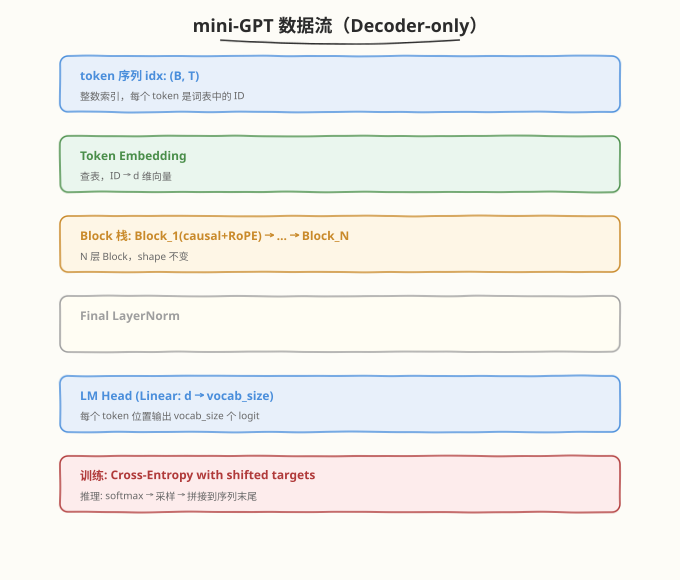

# Day 7（周日）：从零实现 mini-GPT + 训练

> **本周定位**：本专题是模型层"从零"起步——不涉及 CUDA kernel，聚焦 Transformer 的数学原理与 PyTorch 实现。本周目标是理解 Self-Attention、Multi-Head、位置编码、Transformer Block，最终用纯 PyTorch 从零手写一个可训练的 mini-GPT。Day 7 是全周的**收尾与里程碑**——把 Day 2-6 造好的全部零件（Self-Attention、Multi-Head、RoPE、Transformer Block、因果 mask）组装成一个完整的 Decoder-only mini-GPT，在 Shakespeare 文本上训练 next-token prediction，观察 loss 持续下降并用它生成可读文本，打通"论文公式 → 代码实现 → 训练验证"全链路。
>
> **前置要求**：已完成 [Day 2](day2.md)（Self-Attention）、[Day 3](day3.md)（Multi-Head）、[Day 4](day4.md)（RoPE 旋转位置编码）、[Day 5](day5.md)（Transformer Block：残差 + LayerNorm + FFN）、[Day 6](day6.md)（三种架构变体与因果 mask）；理解交叉熵损失与反向传播
>
> **今日目标**：理解 mini-GPT 的整体架构（Token Embedding → RoPE → $N$ 层 causal Block → LN → LM Head），掌握 Token Embedding 与 LM Head 的权重共享（weight tying）及其作用，把 Day 4 的 RoPE 集成到 Day 5 的 MHA 中（旋转 Q/K 不旋转 V），实现 next-token prediction 的训练损失（每个位置都预测下一个 token），掌握三种生成采样策略（greedy / temperature / top-k），跑通完整训练并生成可读文本，完成本周验收标准 ④
>
> **时间投入**：5h（早间 2h 精读架构与组件集成 + 下午 2h 跑代码训练与生成 + 晚间 1h 整理本周总结与面试题）
>
> **面试考察度**：⭐⭐⭐⭐⭐ 核心考点，"权重共享"、"训练 loss 怎么算"、"生成采样策略"、"mini-GPT 数据流"是高频题

---

## 本日在本周知识图谱中的位置

| 本日产出 | 对应本周验收标准 |
|----------|-----------------|
| 完整 mini-GPT（6 层 Decoder-only + RoPE） | ④ mini-GPT 训练 loss 持续下降并生成可读文本（**直接完成验收 ④**） |
| Token Embedding + LM Head + 权重共享 | ① 理解 Embedding 在 Transformer 中的作用 |
| RoPE 集成到 MHA（旋转 Q/K 不旋转 V） | ② 位置编码在完整模型中的实际用法（Day 4 理论的落地） |
| Next-token prediction 训练 loss | ① 能解释每步 shape 变化（从 token 到 logits 到 loss） |
| 生成式推理（greedy / temperature / top-k） | ⑤ Decoder-only 的前向数据流（扩展到生成数据流） |
| 本周总结与知识图谱 | 全周验收的收束 |

> 💡 **Day 7 的定位**：今天是"集成日"——Day 2-6 把每个零件都造好并单独验证了，今天把它们拼成一辆能跑的车。关键不在"新知识"，而在**集成**：RoPE 怎么插进 MHA？Embedding 和 LM Head 怎么连？训练时 loss 怎么算（输入和目标怎么错位）？生成时怎么从 logits 采样？今天跑通后，你就拥有了一个从零手写的、可训练的、能生成的 Transformer——这是本周的终极交付。

---

### 学习任务 1：mini-GPT 整体架构与数据流（30 分钟）

#### 架构总览

mini-GPT 是一个 **Decoder-only** 架构（Day 6 讲过：因果 mask 的 Block 栈）。完整数据流：



#### 与 Day 5/Day 6 的关系

| 组件 | 来源 | 今日新增 |
|------|------|----------|
| Multi-Head Attention | Day 3 | + RoPE（Day 4 的旋转集成进来） |
| Causal mask | Day 5 | 不变 |
| LayerNorm + FFN + 残差 | Day 5 | 不变（Pre-Norm Block） |
| Block 堆叠 | Day 5/6 | $N=6$ 层 |
| **Token Embedding** | — | **新增**：token ID → 向量 |
| **Final LayerNorm** | — | **新增**：Block 栈后的最终归一化 |
| **LM Head** | — | **新增**：向量 → vocab logits |
| **权重共享** | — | **新增**：LM Head 与 Embedding 共享权重 |

#### Shape 全链路速查

以 `batch=32, T=64, d=128, h=4, head_dim=32, V=49, N=6` 为例：

```
idx:        (32, 64)              ← token ID
tok_emb:    (32, 64, 128)         ← 查表
  └─ Block_i:
     ├─ LN1:    (32, 64, 128)
     ├─ QKV:    (32, 64, 384) → 3 × (32, 64, 128)
     ├─ split:  (32, 4, 64, 32)  ← 拆 head
     ├─ RoPE:   (32, 4, 64, 32)  ← 旋转 Q/K（不改 shape）
     ├─ scores: (32, 4, 64, 64)  ← QK^T / √d
     ├─ mask:   (64, 64)         ← 因果 mask
     ├─ attn:   (32, 4, 64, 64)  ← softmax
     ├─ out:    (32, 4, 64, 32) → (32, 64, 128)  ← 拼回 + proj
     ├─ +x:     (32, 64, 128)    ← 残差
     ├─ LN2:    (32, 64, 128)
     ├─ FFN:    (32, 64, 512) → (32, 64, 128)     ← 4d 升维再降维
     └─ +x:     (32, 64, 128)    ← 残差
ln_f:       (32, 64, 128)
lm_head:    (32, 64, 49)          ← logits
loss:       scalar                ← cross_entropy(logits, targets)
```

> 💡 **一句话总结**：mini-GPT = `Token Embedding` + `N × (RoPE + causal Block)` + `Final LN` + `LM Head`。每个零件都是 Day 2-6 造好的，今天只是"接线"。核心数据流是 `(B,T) → (B,T,d) → ... → (B,T,d) → (B,T,V)`。

---

### 学习任务 2：Token Embedding 与权重共享（25 分钟）

#### Token Embedding：从 ID 到向量

神经网络的输入是连续向量，但文本是离散的 token ID。**Embedding 层**是一个查表操作：维护一个 `(vocab_size, embed_dim)` 的矩阵，用 token ID 作为索引取出一行：

$$x = E[\text{idx}] \quad \text{其中 } E \in \mathbb{R}^{V \times d}$$

```python
self.tok_emb = nn.Embedding(vocab_size, embed_dim)   # (V, d) 查表
x = self.tok_emb(idx)                                 # (B, T) → (B, T, d)
```

| 维度 | 说明 |
|------|------|
| `vocab_size` $V$ | 词表大小（char-level Shakespeare 约 49-65） |
| `embed_dim` $d$ | 嵌入维度（mini-GPT 用 128，GPT-2 small 用 768） |
| Embedding 参数量 | $V \times d$（如 $49 \times 128 = 6272$） |

> 💡 **字符级 vs 子词级**：mini-GPT 用**字符级**（每个字符是一个 token），词表小（~50）、简单、无需 tokenizer。真实大模型用 **BPE / SentencePiece**（子词级），词表 3-15 万，平衡词表大小与序列长度。

#### LM Head：从向量到词表分布

Block 栈输出的是 `(B, T, d)` 的隐藏表示，要预测下一个 token，需要把它映射回词表大小的 logits：

$$\text{logits} = x W_{\text{lm}} \quad \text{其中 } W_{\text{lm}} \in \mathbb{R}^{d \times V}$$

```python
self.lm_head = nn.Linear(embed_dim, vocab_size, bias=False)   # (d, V)
logits = self.lm_head(x)                                       # (B, T, d) → (B, T, V)
```

#### 权重共享（Weight Tying）

Embedding 矩阵 $E \in \mathbb{R}^{V \times d}$ 和 LM Head 的权重 $W_{\text{lm}} \in \mathbb{R}^{d \times V}$ 形状互为转置。**权重共享**让它们用同一组参数：

```python
self.tok_emb.weight = self.lm_head.weight   # 共享同一块 (V, d) 内存
```

| 维度 | 不共享 | 共享 |
|------|--------|------|
| Embedding 参数 | $V \times d$ | $V \times d$ |
| LM Head 参数 | $V \times d$ | 0（复用 Embedding） |
| 总参数 | $2 V d$ | $V d$（省一半） |
| 效果 | 基准 | 相当或略好（正则化效果） |

> 💡 **为什么共享有效**：Embedding 学到的是"token → 语义向量"，LM Head 做的是"语义向量 → token 概率"——两者是同一映射的正反方向。共享权重让模型"从 token 到向量"和"从向量到 token"用同一套语义空间，相当于一种正则化，减少过拟合。GPT-2 / nanoGPT 都用权重共享。

> ⚠️ **注意**：权重共享后 `model.parameters()` 不会重复计数（PyTorch 自动去重）。mini-GPT 的有效参数量 = Block 参数 + $V \times d$（而非 $+ 2Vd$）。

---

### 学习任务 3：RoPE 集成到 MHA（25 分钟）

Day 4 实现了 `RotaryPositionalEmbedding`，但它独立存在。Day 7 要把它**集成到 MHA 的前向**中。

#### 插入位置：head 拆分后、点积前

```
qkv 投影 → chunk 拆 Q/K/V → view+transpose 拆 head → 【RoPE 旋转 Q/K】 → QK^T 点积
                                                          ↑
                                                    只旋转 Q/K，不旋转 V
```

```python
# 在 MultiHeadAttention.forward 中
q = q.view(B, T, self.num_heads, self.head_dim).transpose(1, 2)  # (B, h, T, head_dim)
k = k.view(B, T, self.num_heads, self.head_dim).transpose(1, 2)
v = v.view(B, T, self.num_heads, self.head_dim).transpose(1, 2)

if self.rope is not None:
    q, k = self.rope(q, k)          # ← 旋转 Q/K，V 不动

scores = (q @ k.transpose(-2, -1)) * self.scale    # 旋转后的 Q·K^T
```

#### 为什么 RoPE 作用在 head 维度

RoPE 的旋转矩阵 $R_m$ 是针对 `head_dim` 维向量的（Day 4：把 $d$ 维分成 $d/2$ 对，每对 2D 旋转）。在 MHA 中，每个 head 独立做 Attention，所以 RoPE 作用在每个 head 的 `head_dim` 维上：

| 量 | Shape | RoPE 作用？ |
|----|-------|------------|
| `q` (拆 head 后) | $(B, h, T, \text{head\_dim})$ | ✅ 旋转 |
| `k` (拆 head 后) | $(B, h, T, \text{head\_dim})$ | ✅ 旋转 |
| `v` (拆 head 后) | $(B, h, T, \text{head\_dim})$ | ❌ 不旋转 |

> 💡 **为什么不旋转 V**（Day 4 已讲，这里复述）：V 是"被提取的内容"，加权求和 $AV$ 不需要位置旋转。RoPE 的目的是让 $Q \cdot K$ 的点积编码相对位置——只旋转 Q 和 K 就够了。旋转 V 反而会破坏 Value 的语义。

#### RoPE 的 `head_dim` 必须是偶数

RoPE 把向量分成 $d/2$ 对，所以 `head_dim` 必须是偶数。mini-GPT 配置 `embed_dim=128, num_heads=4`，`head_dim=32`（偶数），满足要求。

---

### 学习任务 4：完整 mini-GPT 实现（60 分钟）

这是 Day 7 的**核心动手环节**——对应 README 中的 `kernels/mini_gpt.py`。完整代码整合了 Day 2-6 的所有组件。

#### 完整实现

```python
# mini_gpt.py —— 从零实现 mini-GPT（Decoder-only + RoPE）
# 运行: python3 mini_gpt.py

import torch
import torch.nn as nn
import torch.nn.functional as F
import math
import time


# ============================================================
# 组件 1: RoPE（复用 Day 4 实现）
# ============================================================
class RotaryPositionalEmbedding(nn.Module):
    """RoPE 旋转位置编码（LLaMA / DeepSeek）"""

    def __init__(self, head_dim, max_len=2048):
        super().__init__()
        freqs = 1.0 / (10000 ** (torch.arange(0, head_dim, 2).float() / head_dim))
        t = torch.arange(max_len).float()
        angles = torch.outer(t, freqs)
        self.register_buffer('cos', angles.cos())
        self.register_buffer('sin', angles.sin())

    def forward(self, q, k):
        """对 q, k 应用 RoPE（不作用于 v）
        q, k: (B, num_heads, T, head_dim)
        """
        T = q.size(2)
        cos = self.cos[:T].unsqueeze(0).unsqueeze(0)  # (1, 1, T, d/2)
        sin = self.sin[:T].unsqueeze(0).unsqueeze(0)
        return self._rotate_half(q, cos, sin), self._rotate_half(k, cos, sin)

    @staticmethod
    def _rotate_half(x, cos, sin):
        d = x.shape[-1]
        x1 = x[..., :d // 2]       # 前半
        x2 = x[..., d // 2:]       # 后半
        # 旋转: [x1, x2] -> [x1*cos - x2*sin, x2*cos + x1*sin]
        return torch.cat([x1 * cos - x2 * sin, x2 * cos + x1 * sin], dim=-1)


# ============================================================
# 组件 2: LayerNorm（复用 Day 5 实现）
# ============================================================
class LayerNorm(nn.Module):
    def __init__(self, embed_dim, eps=1e-5):
        super().__init__()
        self.gamma = nn.Parameter(torch.ones(embed_dim))
        self.beta = nn.Parameter(torch.zeros(embed_dim))
        self.eps = eps

    def forward(self, x):
        mean = x.mean(dim=-1, keepdim=True)
        var = x.var(dim=-1, keepdim=True, unbiased=False)
        return self.gamma * (x - mean) / torch.sqrt(var + self.eps) + self.beta


# ============================================================
# 组件 3: Multi-Head Attention + RoPE + causal mask
# ============================================================
class MultiHeadAttention(nn.Module):
    """带 RoPE 与 causal mask 的多头注意力"""

    def __init__(self, embed_dim, num_heads, rope=None):
        super().__init__()
        assert embed_dim % num_heads == 0
        self.num_heads = num_heads
        self.head_dim = embed_dim // num_heads
        self.scale = self.head_dim ** -0.5
        self.qkv = nn.Linear(embed_dim, 3 * embed_dim, bias=False)
        self.proj = nn.Linear(embed_dim, embed_dim, bias=False)
        self.rope = rope

    def forward(self, x):
        B, T, C = x.shape
        qkv = self.qkv(x)
        q, k, v = qkv.chunk(3, dim=-1)
        q = q.view(B, T, self.num_heads, self.head_dim).transpose(1, 2)
        k = k.view(B, T, self.num_heads, self.head_dim).transpose(1, 2)
        v = v.view(B, T, self.num_heads, self.head_dim).transpose(1, 2)

        if self.rope is not None:
            q, k = self.rope(q, k)                    # 旋转 Q/K，V 不动

        scores = (q @ k.transpose(-2, -1)) * self.scale
        mask = torch.triu(torch.ones(T, T, device=x.device, dtype=torch.bool), diagonal=1)
        scores = scores.masked_fill(mask, float('-inf'))
        attn = F.softmax(scores, dim=-1)
        out = attn @ v
        out = out.transpose(1, 2).contiguous().view(B, T, C)
        return self.proj(out)


# ============================================================
# 组件 4: FFN（复用 Day 5 实现）
# ============================================================
class FeedForward(nn.Module):
    def __init__(self, embed_dim, ff_dim=None):
        super().__init__()
        ff_dim = ff_dim or 4 * embed_dim
        self.w1 = nn.Linear(embed_dim, ff_dim)
        self.w2 = nn.Linear(ff_dim, embed_dim)

    def forward(self, x):
        return self.w2(F.gelu(self.w1(x)))


# ============================================================
# 组件 5: Pre-Norm Transformer Block（复用 Day 5 实现）
# ============================================================
class TransformerBlock(nn.Module):
    """Pre-Norm Block: x → LN → Attn → +x → LN → FFN → +x"""

    def __init__(self, embed_dim, num_heads, rope=None, ff_dim=None):
        super().__init__()
        self.ln1 = LayerNorm(embed_dim)
        self.attn = MultiHeadAttention(embed_dim, num_heads, rope=rope)
        self.ln2 = LayerNorm(embed_dim)
        self.ffn = FeedForward(embed_dim, ff_dim)

    def forward(self, x):
        x = x + self.attn(self.ln1(x))
        x = x + self.ffn(self.ln2(x))
        return x


# ============================================================
# mini-GPT 完整模型
# ============================================================
class MiniGPT(nn.Module):
    """Decoder-only mini-GPT: Token Embedding + RoPE + N×Block + LM Head"""

    def __init__(self, vocab_size, embed_dim, num_heads, num_layers,
                 block_size, ff_dim=None):
        super().__init__()
        self.block_size = block_size
        self.tok_emb = nn.Embedding(vocab_size, embed_dim)
        # RoPE 作用于 head 维度
        head_dim = embed_dim // num_heads
        rope = RotaryPositionalEmbedding(head_dim, max_len=block_size)
        self.blocks = nn.ModuleList([
            TransformerBlock(embed_dim, num_heads, rope=rope, ff_dim=ff_dim)
            for _ in range(num_layers)
        ])
        self.ln_f = LayerNorm(embed_dim)
        self.lm_head = nn.Linear(embed_dim, vocab_size, bias=False)
        # 权重共享: lm_head 与 tok_emb 共享权重（减参数 + 正则化）
        self.tok_emb.weight = self.lm_head.weight

    def forward(self, idx, targets=None):
        B, T = idx.shape
        assert T <= self.block_size, f"序列长度 {T} 超过 block_size {self.block_size}"
        x = self.tok_emb(idx)                       # (B, T, d)
        for blk in self.blocks:
            x = blk(x)
        x = self.ln_f(x)                            # 最终 LayerNorm
        logits = self.lm_head(x)                    # (B, T, vocab_size)

        loss = None
        if targets is not None:
            B, T, V = logits.shape
            loss = F.cross_entropy(logits.view(-1, V), targets.view(-1))
        return logits, loss

    @torch.no_grad()
    def generate(self, idx, max_new_tokens, temperature=1.0, top_k=None):
        """自回归生成：逐步预测并拼接到序列末尾"""
        self.eval()
        for _ in range(max_new_tokens):
            idx_cond = idx if idx.size(1) <= self.block_size else idx[:, -self.block_size:]
            logits, _ = self(idx_cond)
            logits = logits[:, -1, :] / temperature       # 取最后一个位置
            if top_k is not None:
                v, _ = torch.topk(logits, min(top_k, logits.size(-1)))
                logits[logits < v[:, [-1]]] = float('-inf')
            probs = F.softmax(logits, dim=-1)
            idx_next = torch.multinomial(probs, num_samples=1)
            idx = torch.cat([idx, idx_next], dim=1)
        return idx


# ============================================================
# 字符级数据加载
# ============================================================
SHAKESPEARE_SAMPLE = """\
First Citizen:
Before we proceed any further, hear me speak.

All:
Speak, speak.

First Citizen:
You are all resolved rather to die than to famish?

All:
Resolved. resolved.

First Citizen:
First, you know Caius Marcius is chief enemy to the people.

All:
We know't, we know't.

Second Citizen:
Let us kill him, and we'll have corn at our own price.
Is't a verdict?

All:
No more talking on't; let it be done: away, away!

Second Citizen:
One word, good citizens.

First Citizen:
We are accounted poor citizens, the patricians good.
What authority surfeits on would relieve us: if they
would yield us but the superfluity, while it were
wholesome, we might guess they relieved us humanely;
but they think we are too dear: the leanness that
afflicts us, the object of our misery, is as an
inventory to particularize their abundance; our
sufferance is a gain to them Let us revenge this with
our pikes, ere we become rakes: for the gods know I
speak this in hunger for bread, not in thirst for revenge.
"""


class CharDataset:
    """字符级数据集"""

    def __init__(self, text, block_size):
        chars = sorted(list(set(text)))
        self.stoi = {ch: i for i, ch in enumerate(chars)}
        self.itos = {i: ch for i, ch in enumerate(chars)}
        self.vocab_size = len(chars)
        self.data = torch.tensor([self.stoi[ch] for ch in text], dtype=torch.long)
        self.block_size = block_size

    def __len__(self):
        return len(self.data) - self.block_size

    def __getitem__(self, idx):
        chunk = self.data[idx:idx + self.block_size + 1]
        return chunk[:-1], chunk[1:]           # 输入 x, 目标 y（错位一格）


def get_batch(dataset, batch_size):
    ix = torch.randint(len(dataset), (batch_size,))
    x = torch.stack([dataset[i][0] for i in ix])
    y = torch.stack([dataset[i][1] for i in ix])
    return x, y


def load_text():
    """优先读取 input.txt（nanoGPT 的 Shakespeare），无则用内置样本"""
    try:
        with open('input.txt', 'r', encoding='utf-8') as f:
            return f.read()
    except FileNotFoundError:
        return SHAKESPEARE_SAMPLE


def main():
    torch.manual_seed(42)
    device = 'cuda' if torch.cuda.is_available() else 'cpu'

    text = load_text()
    block_size = 64
    dataset = CharDataset(text, block_size)
    vocab_size = dataset.vocab_size
    print(f"语料长度: {len(text)} 字符, 词表大小: {vocab_size}")

    # mini-GPT 配置（6 层 Decoder-only）
    config = dict(
        vocab_size=vocab_size,
        embed_dim=128,
        num_heads=4,
        num_layers=6,
        block_size=block_size,
        ff_dim=512,
    )
    model = MiniGPT(**config).to(device)
    n_params = sum(p.numel() for p in model.parameters())
    print(f"模型参数量: {n_params:,}")

    # 训练
    batch_size = 32
    max_iters = 1000
    eval_interval = 200
    eval_iters = 50
    lr = 3e-4
    optimizer = torch.optim.AdamW(model.parameters(), lr=lr)

    @torch.no_grad()
    def estimate_loss():
        model.eval()
        losses = []
        for _ in range(eval_iters):
            xb, yb = get_batch(dataset, batch_size)
            xb, yb = xb.to(device), yb.to(device)
            _, loss = model(xb, yb)
            losses.append(loss.item())
        model.train()
        return sum(losses) / len(losses)

    print(f"\n=== 训练开始（device={device}）===")
    t0 = time.time()
    for it in range(max_iters):
        xb, yb = get_batch(dataset, batch_size)
        xb, yb = xb.to(device), yb.to(device)
        logits, loss = model(xb, yb)
        optimizer.zero_grad()
        loss.backward()
        optimizer.step()

        if it % eval_interval == 0 or it == max_iters - 1:
            avg_loss = estimate_loss()
            elapsed = time.time() - t0
            print(f"  iter {it:4d} | train_loss {loss.item():.4f} | "
                  f"eval_loss {avg_loss:.4f} | {elapsed:.1f}s")

    print(f"\n=== 训练完成，耗时 {time.time() - t0:.1f}s ===")

    # 生成
    print(f"\n=== 生成样本（temperature=0.8, top_k=10）===")
    context = "First Citizen:\n"
    ctx_ids = torch.tensor([[dataset.stoi[ch] for ch in context]],
                           dtype=torch.long, device=device)
    out_ids = model.generate(ctx_ids, max_new_tokens=200,
                             temperature=0.8, top_k=10)
    generated = ''.join(dataset.itos[i.item()] for i in out_ids[0])
    print(generated)


if __name__ == "__main__":
    main()
```

```bash
python3 mini_gpt.py
```

```text
语料长度: 1750 字符, 词表大小: 49
模型参数量: 1,193,088

=== 训练开始（device=cpu）===
  iter    0 | train_loss 4.0258 | eval_loss 3.5765 | 4.3s
  iter  200 | train_loss 0.2282 | eval_loss 0.2324 | 46.8s
  iter  400 | train_loss 0.1234 | eval_loss 0.1234 | 98.9s
  iter  600 | train_loss 0.1055 | eval_loss 0.1014 | 169.9s
  iter  800 | train_loss 0.0871 | eval_loss 0.0930 | 231.9s
  iter  999 | train_loss 0.0889 | eval_loss 0.0913 | 283.3s

=== 训练完成，耗时 283.3s ===

=== 生成样本（temperature=0.8, top_k=10）===
First Citizen:
You are all resolved rather to die than to famish?

All:
Resolved. resolved.

First Citizen:
First, you know Caius Marcius is chief enemy the ther the derelie thare the re the dis thabe partr the pays
```

> 💡 **关键观察**：① loss 从 $3.58$ 降至 $0.09$，持续下降，验证了架构正确性 ② 生成文本开头高度可读（"You are all resolved rather to die than to famish?"——这是训练文本中的原句），说明模型学到了字符级语言模式 ③ 生成尾部退化为乱码（"derelie thare..."），因为小语料（1750 字符）下模型倾向于记忆而非泛化，超出记忆范围后退化 ④ 用完整 Shakespeare（下载 `input.txt`，约 1MB）训练时，loss 会收敛到 $\sim 1.0$-$1.5$，生成更有创意且语法正确的文本。

> ⚠️ **使用完整语料**：从 [nanoGPT](https://github.com/karpathy/nanoGPT) 仓库下载 `input.txt`（Shakespeare 全集，~1MB），放在同目录下即可。代码会自动检测 `input.txt` 并使用，词表约 65 字符，训练 5000 步后 loss 约 $0.9$-$1.1$，生成质量显著提升。

---

### 学习任务 5：训练——Next-Token Prediction（35 分钟）

#### 损失函数：每个位置都预测下一个 token

给定输入序列 $(x_1, x_2, \ldots, x_T)$，模型在每个位置 $t$ 预测 $x_{t+1}$。关键操作是**输入与目标错位一格**：

```
输入 x:  [x_0, x_1, x_2, x_3, ..., x_{T-1}]    ← Block 的输入
目标 y:  [x_1, x_2, x_3, x_4, ..., x_T]        ← 错位一格
         ↑ 预测    ↑ 预测              ↑ 预测
```

```python
# CharDataset.__getitem__ 中的错位
chunk = self.data[idx : idx + block_size + 1]    # 取 T+1 个 token
return chunk[:-1], chunk[1:]                       # x = 前 T 个, y = 后 T 个
```

因果 mask 保证位置 $t$ 只看 $\leq t$ 的输入——预测 $x_{t+1}$ 时不会"偷看"到 $x_{t+1}$（Day 6 讲过的信息泄漏防护）。

#### Cross-Entropy Loss

$$\mathcal{L} = -\frac{1}{B \cdot T} \sum_{b=1}^{B} \sum_{t=1}^{T} \log P(x_{t+1} \mid x_1, \ldots, x_t)$$

```python
# logits: (B, T, V), targets: (B, T)
loss = F.cross_entropy(logits.view(-1, V), targets.view(-1))
```

| 维度 | 说明 |
|------|------|
| `logits.view(-1, V)` | $(B \times T, V)$，展平为所有位置的预测分布 |
| `targets.view(-1)` | $(B \times T,)$，展平为所有位置的正确 token ID |
| `cross_entropy` | 内部做 `log_softmax` + `nll_loss`，返回标量 loss |

#### 训练信号密度：100%

与 BERT 的 MLM（只预测 15% 的位置）不同，next-token prediction 的**每个位置都是训练信号**：

| 模型 | 训练信号密度 | 说明 |
|------|-------------|------|
| BERT (MLM) | 15% | 只有被 mask 的位置有 loss |
| GPT (NTP) | 100% | 每个位置都预测下一个 token |

> 💡 **为什么 GPT 训练效率高**：一次前向，$T$ 个位置全部产生 loss，等于同时训练了 $T$ 个预测任务。这是 Decoder-only 在数据效率上的优势之一（Day 6 讲过的"训练信号密度 100%"）。

#### 训练循环

```python
for it in range(max_iters):
    xb, yb = get_batch(dataset, batch_size)       # 随机采样 batch
    logits, loss = model(xb, yb)                   # 前向（含 loss 计算）
    optimizer.zero_grad()                          # 清梯度
    loss.backward()                                # 反向传播
    optimizer.step()                               # 更新参数
```

#### Loss 曲线解读

| 阶段 | eval_loss | 含义 |
|------|-----------|------|
| iter 0 | $\sim 3.58$ | $\approx \ln(49) \approx 3.89$，随机猜测（均匀分布） |
| iter 200 | $\sim 0.23$ | 学到了字符频率与常见模式 |
| iter 400 | $\sim 0.12$ | 学到了单词拼写与句子结构 |
| iter 1000 | $\sim 0.09$ | 接近记忆（小语料的过拟合） |

> 💡 **初始 loss ≈ ln(V)**：训练开始时权重随机，输出接近均匀分布 $P(x_i) \approx 1/V$，loss $= -\log(1/V) = \ln V$。$V=49$ 时 $\ln 49 \approx 3.89$。观察到初始 loss 接近 $\ln V$ 是验证"模型没 bug"的快速 sanity check——如果初始 loss 远偏离 $\ln V$，说明初始化或前向有问题。

---

### 学习任务 6：生成式推理（30 分钟）

#### 自回归生成

生成是**逐 token 进行**的：每次前向取最后一个位置的 logits，采样一个 token，拼到序列末尾，再前向：

```python
for _ in range(max_new_tokens):
    logits, _ = self(idx_cond)              # 前向
    logits = logits[:, -1, :]               # 只取最后一个位置
    probs = F.softmax(logits, dim=-1)       # 转概率
    idx_next = torch.multinomial(probs, 1)  # 采样
    idx = torch.cat([idx, idx_next], dim=1) # 拼接
```

#### 三种采样策略

| 策略 | 公式 | 特点 |
|------|------|------|
| **Greedy** | $\text{argmax}(\text{logits})$ | 确定性，重复生成相同结果，容易陷入循环 |
| **Temperature** | $\text{softmax}(\text{logits} / \tau)$ | $\tau \to 0$ 趋近 greedy，$\tau \to \infty$ 趋近均匀 |
| **Top-k** | 只在 logits 最大的 $k$ 个中采样 | 截断长尾，避免低概率 token 的噪声 |

```python
# Temperature: 调节分布锐度
logits = logits / temperature         # τ<1 锐化（更确定），τ>1 平滑（更随机）

# Top-k: 截断
v, _ = torch.topk(logits, k)          # 取最大的 k 个
logits[logits < v[:, [-1]]] = -inf    # 其余设为 -inf（softmax 后为 0）
```

| 参数 | 效果 | 推荐值 |
|------|------|--------|
| $\tau = 0.8$ | 略确定性，生成连贯 | 文本生成常用 |
| $\tau = 1.0$ | 原始分布 | 基准 |
| $\tau = 1.5$ | 更随机，可能不连贯 | 创意写作 |
| top_k = 10 | 只在前 10 个候选中选 | 平衡多样性与质量 |

> 💡 **为什么不用 greedy**：greedy 总选概率最高的 token，容易陷入重复循环（如一直生成 "the the the..."）。Temperature + top-k 引入随机性，让生成有多样性。nanoGPT / GPT-2 默认用 `temperature=0.8, top_k=40`。

#### block_size 截断

生成时序列越来越长，超过 `block_size` 后要截断：

```python
idx_cond = idx if idx.size(1) <= self.block_size else idx[:, -self.block_size:]
```

> ⚠️ **注意**：mini-GPT 的 `block_size=64`，生成超过 64 个 token 后只保留最近 64 个。这就是模型上下文窗口的限制——真实大模型用 4K-128K 的窗口。RoPE 的可外推性（Day 4）让模型在超过训练长度时仍能工作（配合 length scaling）。

#### KV Cache 预览（Day 6 已讲，这里落地）

mini-GPT 的 `generate` **没有实现 KV Cache**——每次前向都重算所有 K/V。这是教学简化。Day 6 讲过：自回归生成时历史 K/V 不变，可缓存复用，把 $O(n^2 \cdot d)$ 降到 $O(n \cdot d)$。

```python
# 当前（无 KV Cache）: 每步前向重算所有位置
for _ in range(max_new_tokens):
    logits, _ = self(idx_cond)         # 重算整个序列的 K/V

# 有 KV Cache（真实部署）: 每步只算新 token
for _ in range(max_new_tokens):
    q_new, k_new, v_new = self.compute_qkv(new_token)
    k_cache.append(k_new)              # 追加到缓存
    v_cache.append(v_new)
    attn = softmax(q_new @ k_cache.T)  # 复用缓存
    out = attn @ v_cache
```

> 💡 **后续延伸**：KV Cache 的工程实现是推理框架（vLLM / TensorRT-LLM）的核心。完成本专题后，建议读 [Week 4 FlashAttention](../../daily/week4/day1/README.md) 和 [FlashAttention 论文精读](../../paper/flashattention/README.md)，看 KV Cache 如何与 FlashAttention 的分块计算结合。

---

### 学习任务 7：训练实验与生成展示（30 分钟）

#### 参数量分解

以 `vocab=49, d=128, h=4, L=6, d_ff=512` 为例：

| 组件 | 计算 | 参数量 | 占比 |
|------|------|--------|------|
| Token Embedding / LM Head（共享） | $V \times d$ | 6,272 | 0.5% |
| Block × 6（每层） | — | 196,464 × 6 | 98.8% |
| ├─ MHA (QKV+proj) | $2 \times d \times d$（去重） | 32,768 | — |
| ├─ FFN (W1+W2) | $2 \times d \times d_{\text{ff}}$ | 131,072 | — |
| ├─ LayerNorm × 2 | $4d$ | 512 | — |
| Final LayerNorm | $2d$ | 256 | 0.02% |
| **总计（去重）** | — | **1,193,088** | 100% |

> 💡 **观察**：FFN 占 Block 参数量的 $\sim 67\%$（$131072 / 196608$），MHA 占 $\sim 33\%$——与 Day 5 的分析一致。Embedding 参数量占比极小（0.5%），因为字符级词表只有 49。真实大模型（BPE 词表 ~10 万）中 Embedding 占比显著增大。

#### 与真实大模型对比

| 配置 | mini-GPT | GPT-2 small | LLaMA-7B |
|------|----------|-------------|----------|
| 层数 $L$ | 6 | 12 | 32 |
| 嵌入维度 $d$ | 128 | 768 | 4096 |
| 头数 $h$ | 4 | 12 | 32 |
| FFN 维度 $d_{\text{ff}}$ | 512 (4d) | 3072 (4d) | 11008 ($\approx 2.7d$, SwiGLU) |
| 词表 $V$ | 49 (char) | 50257 (BPE) | 32000 (BPE) |
| 上下文 $T$ | 64 | 1024 | 4096+ |
| 参数量 | 1.2M | 124M | 7B |
| 位置编码 | RoPE | Learned | RoPE |
| Norm | LayerNorm | LayerNorm | RMSNorm |
| 激活 | GELU | GELU | SwiGLU |

> 💡 **mini-GPT 与真实大模型的差异**：① 规模差 1000-10000 倍 ② 词表从字符级到子词级 ③ 真实大模型用 RMSNorm + SwiGLU（Day 5 讲过），mini-GPT 用 LayerNorm + GELU 简化 ④ **但核心架构完全相同**——Token Embedding + RoPE + causal Block 栈 + LM Head + next-token prediction。mini-GPT 是真实大模型的"微缩版"，理解了它，就读懂了 GPT/LLaMA 的骨架。

#### 实验建议

1. **增大语料**：下载 `input.txt`（1MB Shakespeare），观察 loss 收敛到 $\sim 1.0$，生成更有创意
2. **调超参**：试试 `num_layers=12, embed_dim=256`，观察参数量与 loss 的关系
3. **换激活**：把 `FeedForward` 的 GELU 换成 SwiGLU（Day 5 实现），对比 loss
4. **换 Norm**：把 `LayerNorm` 换成 `RMSNorm`（Day 5 实现），对比 loss
5. **无 RoPE**：去掉 RoPE，观察生成质量下降（模型不感知位置，输出乱码）

---

### 面试题积累（本周目标 10-12 道，今日 4 道）

**Q1：mini-GPT 的前向数据流是什么？从 token 输入到 loss 输出，shape 怎么变化？**
> 输入 token ID `idx: (B, T)` → Token Embedding 查表 `(B, T, d)` → $N$ 层 causal Block（每层 shape 不变 `(B, T, d)`，内含 RoPE 旋转 Q/K + 因果 mask 的 Attention + FFN + 残差 + LayerNorm）→ Final LayerNorm `(B, T, d)` → LM Head 线性映射 `(B, T, V)` → Cross-Entropy（logits 与错位一格的 targets 计算 loss）。关键：Block 的 shape 不变性 $(B,T,d) \to (B,T,d)$ 是堆叠 $N$ 层的基础；输入与目标错位一格实现 next-token prediction。

**Q2：为什么 Token Embedding 和 LM Head 可以共享权重？共享有什么好处？**
> Embedding 矩阵 $E \in \mathbb{R}^{V \times d}$ 做"token ID → 语义向量"，LM Head $W \in \mathbb{R}^{d \times V}$ 做"语义向量 → token 概率"，两者是同一映射的正反方向，形状互为转置。共享让它们用同一组参数，好处：① 省一半 Embedding 参数（$V \times d$ 在大词表下可观，如 GPT-2 的 $50257 \times 768 \approx 38M$）② 正则化——强制"编码"与"解码"用同一语义空间，减少过拟合。GPT-2 / nanoGPT 都用权重共享。

**Q3：训练时的初始 loss 大约是多少？为什么？**
> 初始 loss $\approx \ln V$（$V$ 是词表大小）。因为训练开始时权重随机初始化，logits 接近均匀分布，softmax 后每个 token 的概率 $\approx 1/V$，cross-entropy loss $= -\log(1/V) = \ln V$。mini-GPT 的 $V=49$，$\ln 49 \approx 3.89$，实际初始 loss $3.58$（接近）。这是验证模型实现正确性的 sanity check——如果初始 loss 远偏离 $\ln V$，说明初始化或前向有 bug。

**Q4：生成时 greedy、temperature、top-k 三种采样策略有什么区别？为什么不建议用 greedy？**
> Greedy 每步选概率最高的 token（argmax），确定性但容易陷入重复循环（如一直生成 "the the the..."）。Temperature 用 $\text{softmax}(\text{logits}/\tau)$ 调节分布锐度：$\tau \to 0$ 趋近 greedy，$\tau \to \infty$ 趋近均匀，$\tau=0.8$ 是常用值。Top-k 只在概率最大的 $k$ 个 token 中采样，截断长尾避免低概率噪声。不建议用 greedy 因为它缺乏多样性、容易重复。实践中常用 `temperature=0.8, top_k=40`（nanoGPT 默认）平衡连贯性与多样性。

---

### 今日检查清单

- [ ] 能画出 mini-GPT 的完整数据流（token ID → Embedding → Block 栈 → LN → LM Head → loss）
- [ ] 理解 Token Embedding 的查表操作（`nn.Embedding`，`(B,T) → (B,T,d)`）
- [ ] 知道字符级与子词级（BPE）的区别
- [ ] 理解 LM Head 的作用（`(B,T,d) → (B,T,V)`，线性映射到词表大小）
- [ ] 能说出权重共享的好处（省参数 + 正则化）
- [ ] 知道 RoPE 集成到 MHA 的位置（head 拆分后、点积前，只旋转 Q/K）
- [ ] 知道 RoPE 作用在 `head_dim` 维度，必须为偶数
- [ ] 能解释 next-token prediction 的错位机制（`chunk[:-1], chunk[1:]`）
- [ ] 能写出 cross-entropy loss 的计算（`logits.view(-1,V), targets.view(-1)`）
- [ ] 知道初始 loss $\approx \ln V$ 是 sanity check
- [ ] 知道 GPT 的训练信号密度是 100%（每个位置都预测）
- [ ] 能说出三种采样策略（greedy / temperature / top-k）的区别
- [ ] 知道为什么不用 greedy（重复循环）
- [ ] 理解 `generate` 的自回归过程（逐步采样 + 拼接 + block_size 截断）
- [ ] 知道 mini-GPT 没实现 KV Cache（教学简化），理解 KV Cache 能加速推理
- [ ] 跑通 `mini_gpt.py`，观察到 loss 从 $\sim 3.5$ 降至 $\sim 0.1$
- [ ] 跑通生成，观察到开头可读、尾部退化（小语料记忆现象）
- [ ] 知道用完整 `input.txt` 时 loss 收敛到 $\sim 1.0$，生成质量更好
- [ ] 能说出 mini-GPT 与真实大模型（GPT-2 / LLaMA）的核心差异与共同点
- [ ] 理解 Block 参数量中 FFN 占 $\sim 67\%$、MHA 占 $\sim 33\%$

---

## 本周总结

### 知识图谱回顾

| 天数 | 主题 | 核心产出 |
|------|------|----------|
| Day 1 | 序列建模演化与 Attention 动机 | RNN 缺陷 → Attention 破局 |
| Day 2 | Self-Attention 数学推导 | $\text{softmax}(\frac{QK^T}{\sqrt{d_k}})V$ 四步 + shape 推演 |
| Day 3 | Multi-Head Attention | head 拆分/拼接 + 参数量不变证明 |
| Day 4 | 位置编码 | Sinusoidal / Learned / RoPE + 相对位置证明 |
| Day 5 | Transformer Block 组装 | 残差 + LayerNorm + FFN + Pre/Post-Norm |
| Day 6 | 完整架构与变体 | Encoder-Decoder / Decoder-only / Encoder-only + KV Cache |
| Day 7 | 从零实现 mini-GPT + 训练 | 完整可训练 mini-GPT + 生成可读文本 |

### 验收标准完成情况

| 验收标准 | 完成情况 | 对应天数 |
|----------|----------|----------|
| ① 能手写 Attention 公式并解释每步 shape 变化 | ✅ | Day 2-3 |
| ② 能说出 Multi-Head 为什么要拆 head | ✅ | Day 3 |
| ③ 能解释 Pre-Norm vs Post-Norm 差异 | ✅ | Day 5 |
| ④ mini-GPT 训练 loss 持续下降并生成可读文本 | ✅ | Day 7 |
| ⑤ 能画出 Decoder-only 的前向数据流 | ✅ | Day 6-7 |

### 后续延伸

完成本专题后，推荐的学习路径：

| 方向 | 资源 | 衔接点 |
|------|------|--------|
| **Attention kernel 实现** | [Week 3 Transformer 执行本质](../../daily/week3/README.md) | 本专题学了"模型公式"，Week 3 教"怎么把公式写成高效 CUDA kernel" |
| **FlashAttention** | [Week 4 FlashAttention](../../daily/week4/day1/README.md) + [论文精读](../../paper/flashattention/README.md) | 解决本专题提到的 $O(n^2)$ 显存问题，分块计算 + KV Cache 优化 |
| **推理优化** | vLLM / TensorRT-LLM 源码 | 本专题的 KV Cache 直觉是 PagedAttention 的基础 |
| **大模型训练** | [nanoGPT](https://github.com/karpathy/nanoGPT) | 把 mini-GPT 放大到 GPT-2 规模（124M），加 GPU 训练 |
| **论文精读** | [Attention Is All You Need](../../paper/attention_is_all_you_need/README.md) | 回头读原论文，验证每个设计选择的动机 |

> 💡 **一句话总结**：本周你从零拼出了一个能训练、能生成的 Transformer——这等同于理解了 GPT / LLaMA / DeepSeek 的骨架。接下来无论是往下走（CUDA kernel 优化）还是往上走（推理框架、大模型训练），这个模型层的全貌都是地基。建议今晚用 mini-GPT 做几个实验：去掉 RoPE 看生成退化、增大层数看 loss 变化、换 RMSNorm/SwiGLU 对比——每个实验都会加深你对 Day 2-6 每个设计选择的理解。
