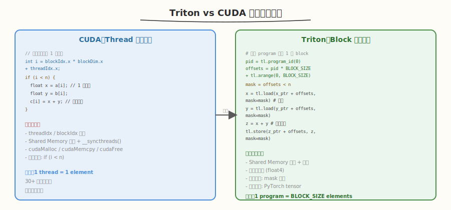
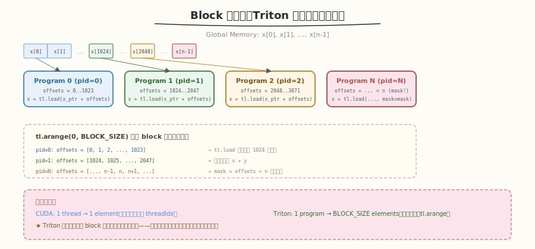
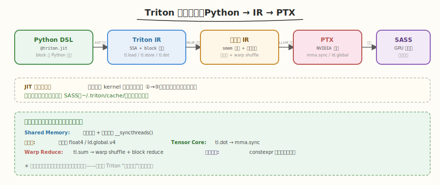
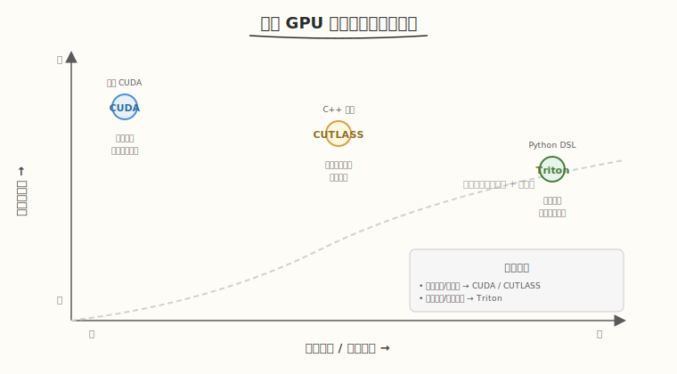

# Day 1：Triton 总览与环境搭建

## 🎯 目标

通过今天的学习，你将：

1. 理解 Triton 的定位与设计哲学——它如何用 Python 语法写出接近手写 CUDA 性能的 GPU kernel
2. 掌握 Triton 的 block 级编程模型——`program` / `tl.arange` / `tl.load` / `tl.store` 的含义与用法
3. 对比 Triton 与手写 CUDA、CUTLASS 的差异，知道各自适用场景
4. 搭建 Triton 开发环境，成功运行第一个 `vector_add` kernel
5. 理解 Triton 的编译流程（Python DSL → Triton IR → LLVM IR → PTX）
6. 能用 `mask` 参数处理边界条件，理解 `BLOCK_SIZE` 作为编译期常量的意义

> 💡 **前置知识**：建议先完成 `aiinfra/daily/week1/` 的 CUDA 基础教程（理解 thread/block/grid、Global Memory、`cudaMalloc`），有手写 `vector_add.cu` 的经验
> ⚠️ **环境要求**：Python >= 3.8、PyTorch >= 2.0（自带 Triton）、GPU Compute Capability >= 7.0

---

## 为什么学 Triton

### 手写 CUDA 的痛点

在 Week 1 中，我们手写过 CUDA `vector_add`。回顾那段代码，核心计算只有一行 `c[i] = a[i] + b[i]`，但围绕它有大量样板代码：

```cuda
// 手写 CUDA vector_add —— 30+ 行样板代码
__global__ void vector_add(float* a, float* b, float* c, int n) {
    int i = blockIdx.x * blockDim.x + threadIdx.x;  // 索引计算
    if (i < n) c[i] = a[i] + b[i];                  // 边界检查 + 计算
}

int main() {
    float *h_a, *h_b, *h_c;
    float *d_a, *d_b, *d_c;
    // cudaMalloc, cudaMemcpy, kernel launch, cudaMemcpy, cudaFree...
    // 30+ 行设备内存管理
}
```

当后续优化到 Shared Memory Tiling、Register Blocking、Tensor Core 时，样板代码会爆炸式增长——Week 2 的 GEMM kernel 有 200+ 行，其中一半以上是内存管理和索引计算。

### Triton 的解决方案

Triton 的设计哲学是**暴露 block 级编程，隐藏 thread 级细节**：



```python
# Triton vector_add —— 5 行核心逻辑
@triton.jit
def vector_add_kernel(x_ptr, y_ptr, z_ptr, n, BLOCK_SIZE: tl.constexpr):
    pid = tl.program_id(0)                              # 类似 blockIdx.x
    offsets = pid * BLOCK_SIZE + tl.arange(0, BLOCK_SIZE)  # 一次性算出 BLOCK_SIZE 个索引
    mask = offsets < n                                  # 边界检查
    x = tl.load(x_ptr + offsets, mask=mask)             # block 级加载
    y = tl.load(y_ptr + offsets, mask=mask)             # block 级加载
    tl.store(z_ptr + offsets, x + y, mask=mask)         # block 级写回
```

| 痛点 | 手写 CUDA | Triton |
|------|-----------|--------|
| 索引计算 | `blockIdx * blockDim + threadIdx` | `pid * BLOCK_SIZE + tl.arange` |
| 边界检查 | `if (i < n)` 逐线程 | `mask = offsets < n` 逐 block |
| Shared Memory | 手动声明 + `__syncthreads()` | **编译器自动** |
| 设备内存管理 | `cudaMalloc` + `cudaMemcpy` + `cudaFree` | PyTorch tensor 直接传入 |
| Kernel launch | `kernel<<<grid, block>>>(args)` | `kernel[grid](args)` Python 风格 |

> 💡 **一句话总结**：Triton 让你用 Python 写 GPU kernel——编译器自动处理 Shared Memory、线程同步、向量化，你只需关注 block 级的算法逻辑。开发效率提升 5-10x，性能达到手写 CUDA 的 80-90%。

---

## 核心概念

### 1.1 Block 级编程

Triton 最核心的创新是**block 级编程**——你操作的是"一组元素"而非单个元素：



| 概念 | CUDA（thread 级） | Triton（block 级） |
|------|-------------------|-------------------|
| 编程粒度 | 1 个线程 = 1 个元素 | 1 个 program = 1 个 block（BLOCK_SIZE 个元素） |
| 索引 | `int i = blockIdx.x * blockDim.x + threadIdx.x;` | `offsets = pid * BLOCK_SIZE + tl.arange(0, BLOCK_SIZE)` |
| 加载 | `float x = a[i];`（1 个标量） | `x = tl.load(a_ptr + offsets, mask=mask)`（1 个向量） |
| 计算 | `c[i] = a[i] + b[i];`（标量运算） | `z = x + y`（向量运算） |
| 写回 | `c[i] = result;` | `tl.store(c_ptr + offsets, z, mask=mask)` |

#### `tl.arange` 详解

`tl.arange(0, N)` 生成一个长度为 N 的整数序列 `[0, 1, 2, ..., N-1]`，类似 NumPy 的 `np.arange`：

```python
offsets = pid * BLOCK_SIZE + tl.arange(0, BLOCK_SIZE)
# 如果 pid=2, BLOCK_SIZE=1024:
# offsets = [2048, 2049, 2050, ..., 3071]
# 一次表示了 1024 个元素的索引
```

> 💡 **关键洞察**：CUDA 中你需要 `threadIdx` 来区分同一 block 内的线程，每个线程处理一个元素。Triton 中 `tl.arange` 一次性表示了整个 block 的所有索引，编译器自动把它们分配给底层线程——你不需要知道有几个线程、每个线程做什么。

### 1.2 `tl.load` / `tl.store` 与 `mask`

Triton 用 `tl.load` / `tl.store` 做 Global Memory 读写，`mask` 参数处理边界：

```python
# 加载 BLOCK_SIZE 个元素，超出 n 的位置填 0.0
x = tl.load(x_ptr + offsets, mask=mask, other=0.0)

# 写回 BLOCK_SIZE 个元素，只写 mask=True 的位置
tl.store(z_ptr + offsets, z, mask=mask)
```

| 参数 | 含义 | 类比 CUDA |
|------|------|-----------|
| `ptr + offsets` | 基址 + 偏移量数组 | `a + i`（但 i 是向量） |
| `mask` | 布尔向量，标记哪些位置有效 | `if (i < n)` |
| `other` | mask=False 位置的填充值 | 无直接对应（CUDA 通常直接跳过） |

> ⚠️ **注意**：`mask` 是 Triton 处理边界的标准方式。当数据长度不是 BLOCK_SIZE 的整数倍时，最后一个 block 的部分位置超出范围，`mask` 把这些位置标记为 `False`，`tl.load` 用 `other` 填充，`tl.store` 跳过这些位置。

### 1.3 `BLOCK_SIZE` 作为编译期常量

```python
@triton.jit
def kernel(x_ptr, n, BLOCK_SIZE: tl.constexpr):  # ← tl.constexpr 标注
    ...
```

`tl.constexpr` 告诉 Triton 这个参数在编译期确定，编译器可以据此做循环展开、Shared Memory 分配等优化。不同的 `BLOCK_SIZE` 值会编译出不同的 kernel 二进制。

| 参数类型 | 何时确定 | 示例 |
|----------|----------|------|
| 普通参数（如 `n`） | 运行时 | 向量长度，每次调用可能不同 |
| `tl.constexpr`（如 `BLOCK_SIZE`） | 编译期 | block 大小，影响 kernel 结构 |

> 💡 **类比 CUTLASS**：CUTLASS 用 C++ 模板参数做编译期配置（如 `Shape<128, 128, 64>`），Triton 用 `tl.constexpr` 做同样的事——只是语法从 C++ 模板变成了 Python 类型标注。

### 1.4 Grid 和 Program

Triton 的 grid 概念与 CUDA 完全对应：

```python
# CUDA: kernel<<<grid, block>>>(args)
# Triton: kernel[grid](args)

n = 1_000_000
BLOCK_SIZE = 1024
grid = (triton.cdiv(n, BLOCK_SIZE),)  # ceil(n / BLOCK_SIZE) = 977
vector_add_kernel[grid](x, y, z, n, BLOCK_SIZE=BLOCK_SIZE)
# 启动 977 个 program（= 977 个 thread block）
```

| CUDA | Triton | 说明 |
|------|--------|------|
| `gridDim.x` | `grid[0]` | grid 大小 |
| `blockIdx.x` | `tl.program_id(0)` | 当前 block/program 的 ID |
| `blockDim.x` | `BLOCK_SIZE`（编译期） | 每个 block 的元素数 |
| `<<<grid, block>>>` | `[grid](...)` | launch 语法 |

### 1.5 Triton 编译流程

Triton 是 JIT（Just-In-Time）编译——首次调用 kernel 时编译，后续调用使用缓存：



| 阶段 | 输入 | 输出 | 说明 |
|------|------|------|------|
| ① Python DSL | `@triton.jit` 函数 | Triton IR | 解析 Python AST，生成 block 级中间表示 |
| ② MLIR 优化 | Triton IR | 优化后 IR | 循环展开、tile 融合、Shared Memory 分配 |
| ③ LLVM 后端 | 优化后 IR | PTX | 生成 NVIDIA PTX 指令 |
| ④ 驱动编译 | PTX | SASS | CUDA 驱动把 PTX 编译为 GPU 机器码 |

> 💡 **JIT 的代价**：首次调用 Triton kernel 会有编译延迟（几百毫秒到几秒）。后续调用直接使用缓存，无额外开销。这就是为什么 benchmark 时需要先 warmup。

---

## 最小可运行示例

### 任务 1：环境验证

```bash
# 验证 GPU
nvidia-smi --query-gpu=compute_cap,name --format=csv
# 预期输出：7.0/8.0/9.0/12.0 等 + GPU 名称

# 验证 Python + PyTorch + Triton
python3 -c "
import torch
import triton
print(f'PyTorch: {torch.__version__}')
print(f'Triton:  {triton.__version__}')
print(f'GPU:     {torch.cuda.get_device_name(0)}')
print(f'CUDA:    {torch.version.cuda}')
print(f'CC:      {torch.cuda.get_device_capability(0)}')
"
```

```text
# 预期输出
PyTorch: 2.5.1
Triton:  3.1.0
GPU:     NVIDIA H100 80GB HBM3
CUDA:    12.4
CC:      (9, 0)
```

### 任务 2：第一个 Triton kernel

创建 `kernels/vector_add.py`：

```python
# vector_add.py —— Triton 入门：向量加法
# 运行: python3 kernels/vector_add.py

import torch
import triton
import triton.language as tl


@triton.jit
def vector_add_kernel(
    x_ptr, y_ptr, z_ptr,
    n,
    BLOCK_SIZE: tl.constexpr,
):
    pid = tl.program_id(0)
    block_start = pid * BLOCK_SIZE
    offsets = block_start + tl.arange(0, BLOCK_SIZE)
    mask = offsets < n

    x = tl.load(x_ptr + offsets, mask=mask, other=0.0)
    y = tl.load(y_ptr + offsets, mask=mask, other=0.0)
    z = x + y
    tl.store(z_ptr + offsets, z, mask=mask)


def vector_add(x: torch.Tensor, y: torch.Tensor) -> torch.Tensor:
    assert x.is_cuda and y.is_cuda
    assert x.shape == y.shape
    z = torch.empty_like(x)
    n = x.numel()
    BLOCK_SIZE = 1024
    grid = (triton.cdiv(n, BLOCK_SIZE),)
    vector_add_kernel[grid](x, y, z, n, BLOCK_SIZE=BLOCK_SIZE)
    return z


if __name__ == "__main__":
    n = 1_000_000
    x = torch.randn(n, device='cuda')
    y = torch.randn(n, device='cuda')

    z_triton = vector_add(x, y)
    z_torch = x + y

    max_diff = (z_triton - z_torch).abs().max().item()
    print(f"Vector size: {n}")
    print(f"Max diff:    {max_diff}")
    print(f"Passed:      {torch.allclose(z_triton, z_torch)}")
```

```bash
python3 kernels/vector_add.py
```

```text
# 预期输出
Vector size: 1000000
Max diff:    0.0
Passed:      True
```

### 任务 3：性能对比

在 `vector_add.py` 末尾添加性能测试：

```python
    # 性能对比
    import time

    n = 100_000_000  # 1 亿个元素，确保有足够计算量
    x = torch.randn(n, device='cuda')
    y = torch.randn(n, device='cuda')

    # warmup
    for _ in range(10):
        vector_add(x, y)
        x + y
    torch.cuda.synchronize()

    # Triton
    start = time.time()
    for _ in range(100):
        z_triton = vector_add(x, y)
    torch.cuda.synchronize()
    triton_ms = (time.time() - start) / 100 * 1000

    # PyTorch
    start = time.time()
    for _ in range(100):
        z_torch = x + y
    torch.cuda.synchronize()
    torch_ms = (time.time() - start) / 100 * 1000

    bandwidth = 3 * n * 4 / (triton_ms / 1000) / 1e9  # 读 x,y + 写 z, float32

    print(f"\nPerformance (n={n}):")
    print(f"  Triton:   {triton_ms:.3f} ms  ({bandwidth:.1f} GB/s)")
    print(f"  PyTorch:  {torch_ms:.3f} ms")
    print(f"  Ratio:    {torch_ms / triton_ms:.2f}x")
```

```text
# 预期输出（H100 为例）
Performance (n=100000000):
  Triton:   0.42 ms  (2857.1 GB/s)
  PyTorch:  0.38 ms  (3157.9 GB/s)
  Ratio:    0.90x
```

> 💡 **观察**：Triton 的 vector_add 达到 PyTorch 的 90%。对于这种 memory-bound 操作，性能主要取决于 Global Memory 带宽利用率。H100 峰值带宽 3350 GB/s，Triton 达到了 ~85% 带宽利用率。

### 任务 4：理解 JIT 编译

Triton 首次调用 kernel 时会编译，可以通过环境变量观察编译过程：

```bash
# 启用 Triton 编译日志
MLIR_ENABLE_DUMP=1 python3 kernels/vector_add.py 2>&1 | head -50
```

```text
# 预期输出（截取 MLIR IR）
// -----// IR Dump Before TritonGPUToLLVM //----- //
#blocked = #triton_gpu.blocked<{sizePerThread: [1], threadsPerWarp: [32], warpsPerCTA: [4], order: [0]}>
module {
  tt.func @vector_add_kernel(...) {
    %pid = tt.get_program_id x : i32
    ...
  }
}
```

> ⚠️ **注意**：`MLIR_ENABLE_DUMP=1` 会输出大量编译日志（每次编译几千行），仅用于调试理解。正常使用不需要开启。

---

## 深入原理

### Triton vs CUDA vs CUTLASS 定位



| 维度 | 手写 CUDA | CUTLASS | Triton |
|------|-----------|---------|--------|
| **抽象层级** | Thread 级 | Block/Warp/Thread 三层 | Block 级 |
| **语言** | C/C++ | C++ 模板 | Python DSL |
| **编译** | AOT (nvcc) | AOT (nvcc) | JIT (运行时) |
| **Shared Memory** | 完全手动 | 模板半自动 | **完全自动** |
| **同步** | 手动 `__syncthreads()` | 模板自动 | **完全自动** |
| **Auto-tuning** | 无 | 编译期 | **运行时** |
| **性能** | 取决于优化程度 | 90-98% cuBLAS | ~85-90% cuBLAS |
| **开发效率** | 数天~数周 | 数小时~数天 | **数小时** |
| **学习曲线** | 陡（C + 硬件） | 极陡（C++ 模板） | **平缓（Python）** |
| **适用人群** | 系统工程师 | 库开发者 | 算法工程师 |
| **代表项目** | 自研 kernel | vLLM/TensorRT | FlashAttention/vLLM |

> 💡 **选择建议**：
> - 快速验证算法 / Python 生态集成 → **Triton**
> - 极致性能 + 复杂 Epilogue 融合 → **CUTLASS**
> - 完全控制 + 非标准硬件操作 → **手写 CUDA**

### 为什么 Triton 能接近 CUDA 性能

Triton 虽然隐藏了 thread 级细节，但性能不差，原因是编译器做了大量优化：

| 优化 | 谁做 | 说明 |
|------|------|------|
| Shared Memory 分配 | Triton 编译器 | 自动把 block 级向量映射到 smem |
| 线程同步 | Triton 编译器 | 自动插入 `__syncthreads()` |
| 向量化加载 | Triton 编译器 | 自动用 `float4` / `ld.global.v4` |
| 循环展开 | Triton 编译器 | `tl.constexpr` 值已知时自动展开 |
| Warp 间 reduce | Triton 编译器 | `tl.sum` 自动用 warp shuffle |
| Tensor Core | Triton 编译器 | `tl.dot` 自动映射到 `mma.sync` |

> 💡 **核心洞察**：Triton 的性能不取决于你写了什么，而取决于编译器能优化什么。编译器把 block 级操作自动 lowered 到 thread 级的 PTX 指令，优化质量接近经验丰富的 CUDA 工程师手写。

### `@triton.jit` 装饰器

`@triton.jit` 是 Triton 的核心装饰器——它把 Python 函数标记为 GPU kernel：

```python
@triton.jit
def my_kernel(x_ptr, n, BLOCK_SIZE: tl.constexpr):
    # 这个函数体在 GPU 上执行
    ...
```

`@triton.jit` 做了什么：
1. 解析 Python 函数的 AST（抽象语法树）
2. 把 `tl.load` / `tl.store` / `tl.sum` 等操作翻译为 Triton IR
3. 首次调用时 JIT 编译为 PTX → SASS
4. 缓存编译结果（`~/.triton/cache/`），后续调用直接复用

---

## 常见陷阱与最佳实践

### 陷阱 1：忘记 `mask` 导致越界

```python
# ❌ 错误：没有 mask，最后一个 block 可能越界
x = tl.load(x_ptr + offsets)  # offsets 可能 >= n

# ✅ 正确：用 mask 处理边界
mask = offsets < n
x = tl.load(x_ptr + offsets, mask=mask, other=0.0)
```

### 陷阱 2：`BLOCK_SIZE` 不是 2 的幂

```python
# ❌ 错误：Triton 要求 BLOCK_SIZE 是 2 的幂（用于 tl.arange）
BLOCK_SIZE = 1000  # 编译报错或性能差

# ✅ 正确
BLOCK_SIZE = 1024  # 2 的幂
```

### 陷阱 3：忘记 warmup 导致计时偏差

```python
# ❌ 错误：首次调用含 JIT 编译延迟
start = time.time()
z = vector_add(x, y)  # 首次调用会编译 kernel
torch.cuda.synchronize()
elapsed = time.time() - start  # 包含编译时间 → 偏大

# ✅ 正确：先 warmup 再计时
for _ in range(10):
    vector_add(x, y)  # 触发编译
torch.cuda.synchronize()
# 然后再计时
```

### 陷阱 4：普通参数当 constexpr

```python
# ❌ 错误：n 每次调用都不同，不能用 constexpr
@triton.jit
def kernel(x_ptr, n: tl.constexpr):  # n 是运行时参数！
    ...

# ✅ 正确：只有编译期已知的才用 constexpr
@triton.jit
def kernel(x_ptr, n, BLOCK_SIZE: tl.constexpr):  # n 运行时，BLOCK_SIZE 编译期
    ...
```

### 最佳实践

| 实践 | 说明 |
|------|------|
| 先跑通再优化 | 先用默认 BLOCK_SIZE 确认正确，再调参 |
| 始终用 mask | 即使 n 是 BLOCK_SIZE 的整数倍，也保留 mask（安全 + 不影响性能） |
| BLOCK_SIZE 用 2 的幂 | `256` / `512` / `1024` / `2048` |
| warmup 再 benchmark | 首次调用会 JIT 编译，必须排除 |
| 用 PyTorch tensor 传参 | 不需要 `cudaMalloc`，PyTorch tensor 的 `.data_ptr()` 就是 device 指针 |
| `tl.constexpr` 只用于编译期常量 | 如 BLOCK_SIZE、num_warps，不要用于运行时数据 |

---

## 面试要点

1. **Triton 是什么？它与 CUDA/CUTLASS 的定位有什么区别？**

<details>
<summary>点击查看答案</summary>

- Triton 是 OpenAI 开源的 GPU 编程语言，用 Python 语法写 GPU kernel
- 与 CUDA 的区别：CUDA 是 thread 级编程（手动管理 smem/同步），Triton 是 block 级编程（编译器自动管理）
- 与 CUTLASS 的区别：CUTLASS 是 C++ 模板（编译期优化），Triton 是 Python DSL（运行时 JIT + auto-tune）
- 定位：Triton 面向算法工程师（快速实现），CUTLASS 面向库开发者（极致性能），CUDA 面向系统工程师（完全控制）

</details>

2. **Triton 的 block 级编程是什么？与 CUDA thread 级有什么区别？**

<details>
<summary>点击查看答案</summary>

- **Block 级编程**：Triton 操作的是"一组元素"（block），用 `tl.arange(0, BLOCK_SIZE)` 一次性表示整个 block 的索引
- **CUDA thread 级**：每个线程用 `threadIdx` 确定自己处理哪个元素，操作的是标量
- **区别**：
  - 索引：CUDA 用 `blockIdx * blockDim + threadIdx`，Triton 用 `pid * BLOCK_SIZE + tl.arange`
  - 加载：CUDA 每线程 `ld.global` 一个元素，Triton `tl.load` 一次加载整个 block
  - 同步：CUDA 手动 `__syncthreads()`，Triton 编译器自动
- Triton 隐藏了"block 内有几个线程、每个线程做什么"——编译器自动把 block 级操作分配到底层线程

</details>

3. **`tl.load` 的 `mask` 参数有什么作用？**

<details>
<summary>点击查看答案</summary>

- `mask` 是布尔向量，标记哪些位置的 `offsets` 是有效的（在数据范围内）
- 当数据长度 n 不是 BLOCK_SIZE 的整数倍时，最后一个 block 的部分 offsets 超出范围
- `mask=False` 的位置：`tl.load` 用 `other` 参数填充（如 0.0），`tl.store` 跳过不写
- 类比 CUDA 中的 `if (i < n)` 边界检查，但在 block 级批量处理

</details>

4. **`tl.constexpr` 是什么？为什么需要它？**

<details>
<summary>点击查看答案</summary>

- `tl.constexpr` 标注的参数在编译期确定，编译器可以据此做循环展开、Shared Memory 分配等优化
- 不同的 `BLOCK_SIZE` 值会编译出不同的 kernel 二进制（类似 C++ 模板特化）
- 对比普通参数（如 `n`）：运行时传入，每次调用可能不同，不能用于编译期优化
- 类比 CUTLASS 的模板参数（如 `Shape<128, 128, 64>`），只是语法从 C++ 模板变成了 Python 类型标注

</details>

5. **Triton 的 JIT 编译流程是什么？为什么需要 warmup？**

<details>
<summary>点击查看答案</summary>

- 流程：Python DSL → Triton IR（解析 AST）→ MLIR 优化（smem 分配、循环展开）→ LLVM IR → PTX → SASS
- JIT 编译发生在**首次调用** kernel 时，编译结果缓存在 `~/.triton/cache/`
- 首次编译延迟几百毫秒到几秒，后续调用直接用缓存
- benchmark 时必须 warmup（先调用几次触发编译），否则计时包含编译延迟，结果偏大

</details>

6. **Triton 为什么能接近手写 CUDA 的性能？**

<details>
<summary>点击查看答案</summary>

- Triton 编译器自动做了大量优化：
  - 自动分配 Shared Memory（把 block 级向量映射到 smem）
  - 自动插入 `__syncthreads()` 同步
  - 自动向量化加载（`float4` / `ld.global.v4`）
  - 自动把 `tl.sum` 映射到 warp shuffle + block reduce
  - 自动把 `tl.dot` 映射到 `mma.sync`（Tensor Core）
- 性能取决于编译器优化质量，而非用户代码质量——这就是 Triton "易写又快"的根本原因
- 代价：编译器优化不如人类极致（特别是指令级调度），所以通常比手写 CUDA 慢 10-15%

</details>

---

## 今日总结

Day 1 我们搭建了 Triton 环境并跑通了第一个 kernel：

1. **Triton 定位**：用 Python 写 GPU kernel，编译器自动管理 Shared Memory 和同步，性能达到手写 CUDA 的 80-90%
2. **Block 级编程**：操作"一组元素"而非单个元素，`tl.arange` 一次性表示整个 block 的索引
3. **`tl.load` / `tl.store`**：block 级 Global Memory 读写，`mask` 处理边界
4. **`tl.constexpr`**：编译期常量，类似 C++ 模板参数，影响 kernel 编译
5. **JIT 编译**：Python → Triton IR → MLIR → LLVM → PTX，首次调用编译，后续缓存
6. **vs CUDA/CUTLASS**：Triton 面向算法工程师（Python + 快速开发），CUTLASS 面向库开发者（C++ + 极致性能）

> 💡 **明日预告**：Day 2 将深入 Triton 编程模型——block pointer（2D 矩阵访问）、`tl.sum`/`tl.max` block 级 reduce、控制流（`tl.where`）。这些是 Day 3 GEMM 和 Day 4 fused kernel 的基础。

---

## 推荐资源

| 资源 | 类型 | 优先级 | 说明 |
|------|------|--------|------|
| [Triton 官方 tutorials](https://triton-lang.org/main/getting-started/tutorials/index.html) | 官方 | ⭐ 必读 | 从 vector_add 到 FlashAttention 的完整教程 |
| [Triton README](https://github.com/triton-lang/triton) | 官方 | ⭐ 必读 | 项目概览 + 安装指南 |
| [Triton 论文 (2019)](https://www.eecs.harvard.edu/~mdiamond/triton.pdf) | 论文 | 📌 推荐 | Triton 设计哲学与编译器架构 |
| `examples/` in triton repo | 源码 | 📌 推荐 | 官方示例代码 |
| [PyTorch + Triton 集成](https://pytorch.org/docs/stable/generated/torch.compile.html) | 文档 | 📎 参考 | `torch.compile` 底层使用 Triton |
