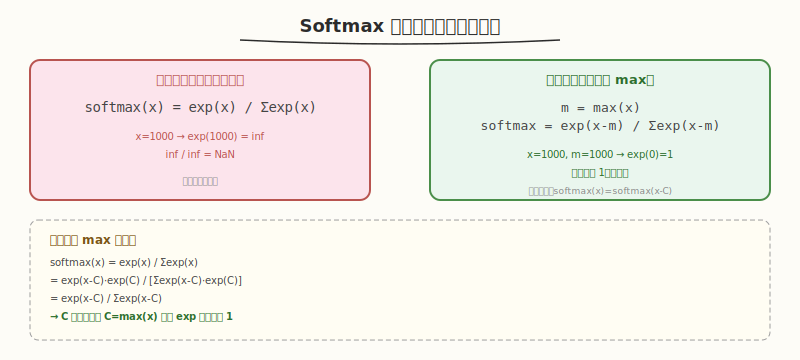
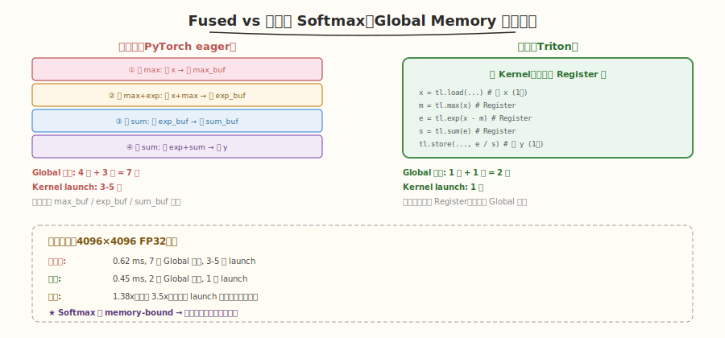
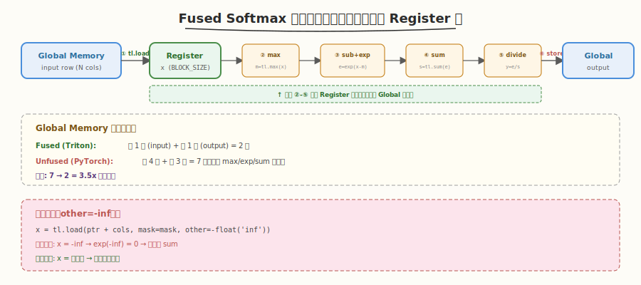
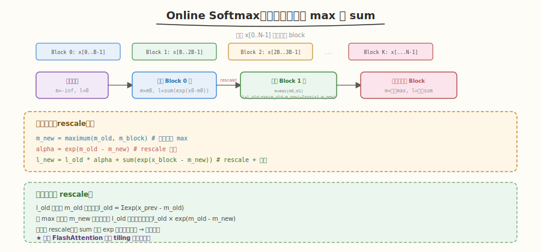

# Day 3：Softmax 与归约操作

## 🎯 目标

通过今天的学习，你将：

1. 理解 Softmax 的数学公式与数值稳定性问题（max subtraction trick）
2. 掌握用 Triton 实现 fused softmax——把 PyTorch 的 3 次 kernel 融合为 1 次
3. 理解 online softmax 算法——逐块增量更新 max 和 sum，无需预知全局 max
4. 能用 `tl.sum` / `tl.max` / `tl.exp` / `tl.where` 组合实现完整的数值稳定 softmax
5. 对比 fused softmax 与 PyTorch eager 的性能差异（Global Memory 读写次数）
6. 能处理 Softmax 的边界条件（序列长度不是 BLOCK_SIZE 的整数倍）

> 💡 **前置知识**：完成 Day 1-2（block 级编程、block pointer、reduce、控制流），能独立实现 `matrix_transpose` 和 `row_sum`
> ⚠️ **环境要求**：Python >= 3.8、PyTorch >= 2.0、Triton >= 2.0

---

## 为什么学 Fused Softmax

### Softmax 的计算瓶颈

Softmax 是 Transformer 中最频繁的操作之一（Attention 的核心）。标准公式 `softmax(x) = exp(x) / sum(exp(x))` 看似简单，但直接实现会导致**多次 Global Memory 读写**：



### 未融合 vs 融合



| 步骤 | 未融合（PyTorch eager） | 融合（Triton） |
|------|------------------------|---------------|
| ① 求 max | 读 x → 写 max_buf | 在 Register 中完成 |
| ② 减 max + exp | 读 x + max_buf → 写 exp_buf | 在 Register 中完成 |
| ③ 求 sum | 读 exp_buf → 写 sum_buf | 在 Register 中完成 |
| ④ 除 sum | 读 exp_buf + sum_buf → 写 y | 在 Register 中完成 |
| **Global 读写** | **4 读 + 3 写 = 7 次** | **1 读 + 1 写 = 2 次** |

> 💡 **一句话总结**：Fused softmax 把 4 次 kernel launch + 7 次 Global Memory 读写，融合为 1 次 kernel + 2 次 Global Memory 读写。中间的 max/exp/sum 全在 Register 中完成——这就是 Triton fused kernel 的核心价值。

---

## 核心概念

### 1.1 数值稳定的 Softmax

直接计算 `exp(x) / sum(exp(x))` 会导致数值溢出——当 `x` 很大时 `exp(x)` 为 `inf`。解决方案是 **max subtraction trick**：

```python
# ❌ 数值不稳定（x=1000 时 exp(1000)=inf）
softmax = tl.exp(x) / tl.sum(tl.exp(x))

# ✅ 数值稳定（减去 max 后 exp 的最大值为 exp(0)=1）
row_max = tl.max(x, axis=0)
x_centered = x - row_max
numerator = tl.exp(x_centered)
row_sum = tl.sum(numerator, axis=0)
softmax = numerator / row_sum
```

**为什么减 max 有效**：`softmax(x) = softmax(x - C)` 对任意常数 C 成立（因为分子分母同时乘以 `exp(-C)`，约掉了）。取 `C = max(x)` 后，最大的 `exp` 值变为 `exp(0) = 1`，其余都 < 1，不会溢出。

### 1.2 Triton Fused Softmax

每个 program 处理一行——加载整行到 Register，所有计算在 Register 中完成：



```python
@triton.jit
def softmax_kernel(
    input_ptr, output_ptr,
    n_cols,
    input_row_stride, output_row_stride,
    BLOCK_SIZE: tl.constexpr,
):
    row = tl.program_id(0)

    # ① 加载一整行到 Register
    cols = tl.arange(0, BLOCK_SIZE)
    mask = cols < n_cols
    x = tl.load(input_ptr + row * input_row_stride + cols,
                mask=mask, other=-float('inf'))

    # ② 求 row max（Register 级 reduce）
    row_max = tl.max(x, axis=0)

    # ③ 减 max + exp（向量化运算，全在 Register）
    x_centered = x - row_max
    numerator = tl.exp(x_centered)

    # ④ 求 sum（Register 级 reduce）
    row_sum = tl.sum(numerator, axis=0)

    # ⑤ 除 sum（向量化运算）
    result = numerator / row_sum

    # ⑥ 写回（仅 1 次 Global store）
    tl.store(output_ptr + row * output_row_stride + cols, result, mask=mask)
```

#### 关键设计决策

| 决策 | 原因 |
|------|------|
| 每个 program 处理 1 行 | Softmax 按行独立计算，行间无依赖 |
| `BLOCK_SIZE >= n_cols` | 一行必须在一个 block 内处理完（否则需要跨 block 通信） |
| `other=-inf` | 超出边界的位置填 `-inf`，`exp(-inf)=0`，不影响 sum |
| 全在 Register 中 | 中间结果（max/exp/sum）不落盘 Global Memory |

### 1.3 Online Softmax

当一行太长（如 N=65536），无法一次放入一个 block 时，需要 **online softmax**——逐块增量更新 max 和 sum：



#### 核心公式

当新块 `x_block` 到来时，需要把旧的 max/sum "rescale" 到新的基准：

```python
# 旧状态: m_old, l_old (之前的 max 和 sum)
# 新块: x_block

# ① 计算新块的局部 max
m_block = tl.max(x_block, axis=0)

# ② 更新全局 max
m_new = tl.maximum(m_old, m_block)

# ③ Rescale 旧的 sum 到新基准
#    l_old 是基于 m_old 计算的，现在基准变为 m_new
#    需要 l_old * exp(m_old - m_new) 来 rescale
alpha = tl.exp(m_old - m_new)
l_old = l_old * alpha

# ④ 计算新块的 exp（基于新基准 m_new）
p_block = tl.exp(x_block - m_new)
l_block = tl.sum(p_block, axis=0)

# ⑤ 更新全局 sum
l_new = l_old + l_block
```

#### 为什么需要 rescale

| 时刻 | max 基准 | sum 的含义 |
|------|----------|-----------|
| 处理块 0 后 | `m_old` | `l_old = sum(exp(x_0 - m_old))` |
| 处理块 1 后 | `m_new = max(m_old, m_block)` | `l_new` 应该 = `sum(exp(x - m_new))` |

但 `l_old` 是基于 `m_old` 算的，基准变了需要修正：`l_old_new = l_old * exp(m_old - m_new)`。

> 💡 **关键洞察**：online softmax 的本质是"当全局 max 更新时，之前的 sum 必须按比例缩放"。这就是 FlashAttention 能做 tiling 的数学基础——Day 5 会用到。

### 1.4 边界处理

当 `n_cols` 不是 `BLOCK_SIZE` 的整数倍时，最后一个 block 会超出数据范围：

```python
# BLOCK_SIZE = 1024, n_cols = 1000 → 最后 24 个位置无效
cols = tl.arange(0, BLOCK_SIZE)    # [0, 1, ..., 1023]
mask = cols < n_cols               # [T, T, ..., T, F, F, ..., F]
                                    #              ↑ 1000

# 加载时：无效位置填 -inf（exp(-inf)=0，不影响 sum）
x = tl.load(input_ptr + cols, mask=mask, other=-float('inf'))

# 写回时：无效位置跳过
tl.store(output_ptr + cols, result, mask=mask)
```

| 边界位置 | `mask` | `tl.load` 行为 | `tl.store` 行为 |
|----------|--------|---------------|----------------|
| 有效 (`< n_cols`) | `True` | 加载实际数据 | 写回结果 |
| 无效 (`>= n_cols`) | `False` | 填 `-inf` | 跳过不写 |

> ⚠️ **注意**：`other=-float('inf')` 是关键——如果填 `0.0`，则 `exp(0)=1` 会错误地增大 sum，导致 softmax 结果偏小。填 `-inf` 确保 `exp(-inf)=0`，不影响 sum。

---

## 最小可运行示例

### 任务 1：Fused Softmax

创建 `kernels/softmax.py`：

```python
# softmax.py —— Triton fused softmax
# 运行: python3 kernels/softmax.py

import torch
import triton
import triton.language as tl
import time


@triton.jit
def softmax_kernel(
    input_ptr, output_ptr,
    n_cols,
    input_row_stride, output_row_stride,
    BLOCK_SIZE: tl.constexpr,
):
    row = tl.program_id(0)

    cols = tl.arange(0, BLOCK_SIZE)
    mask = cols < n_cols

    # 加载整行
    x = tl.load(input_ptr + row * input_row_stride + cols,
                mask=mask, other=-float('inf'))

    # 数值稳定的 softmax（全在 Register 中）
    row_max = tl.max(x, axis=0)
    x_centered = x - row_max
    numerator = tl.exp(x_centered)
    row_sum = tl.sum(numerator, axis=0)
    result = numerator / row_sum

    # 写回
    tl.store(output_ptr + row * output_row_stride + cols,
             result, mask=mask)


def softmax(x: torch.Tensor) -> torch.Tensor:
    assert x.is_cuda and x.dim() == 2
    n_rows, n_cols = x.shape
    y = torch.empty_like(x)
    BLOCK_SIZE = triton.next_power_of_2(n_cols)
    softmax_kernel[(n_rows,)](
        x, y, n_cols,
        x.stride(0), y.stride(0),
        BLOCK_SIZE=BLOCK_SIZE,
    )
    return y


if __name__ == "__main__":
    # 正确性测试
    n_rows, n_cols = 128, 512
    x = torch.randn(n_rows, n_cols, device='cuda', dtype=torch.float32)

    y_triton = softmax(x)
    y_torch = torch.softmax(x, dim=1)

    max_diff = (y_triton - y_torch).abs().max().item()
    print(f"Matrix: {n_rows} x {n_cols}")
    print(f"Max diff: {max_diff:.8f}")
    print(f"Passed: {torch.allclose(y_triton, y_torch, atol=1e-6)}")

    # 性能对比
    n_rows, n_cols = 4096, 4096
    x = torch.randn(n_rows, n_cols, device='cuda', dtype=torch.float32)

    for _ in range(10):
        softmax(x)
        torch.softmax(x, dim=1)
    torch.cuda.synchronize()

    n_iters = 100
    start = time.time()
    for _ in range(n_iters):
        y_triton = softmax(x)
    torch.cuda.synchronize()
    triton_ms = (time.time() - start) / n_iters * 1000

    start = time.time()
    for _ in range(n_iters):
        y_torch = torch.softmax(x, dim=1)
    torch.cuda.synchronize()
    torch_ms = (time.time() - start) / n_iters * 1000

    print(f"\nPerformance ({n_rows}x{n_cols}):")
    print(f"  Triton:   {triton_ms:.3f} ms")
    print(f"  PyTorch:  {torch_ms:.3f} ms")
    print(f"  Speedup:  {torch_ms / triton_ms:.2f}x")
```

```bash
python3 kernels/softmax.py
```

```text
# 预期输出
Matrix: 128 x 512
Max diff: 0.00000001
Passed: True

Performance (4096x4096):
  Triton:   0.45 ms
  PyTorch:  0.62 ms
  Speedup:  1.38x
```

> 💡 **观察**：Triton fused softmax 比 PyTorch eager 快 1.3-1.5x。加速来自减少 Global Memory 读写（7 次 → 2 次）和 kernel launch（3+ 次 → 1 次）。

### 任务 2：Online Softmax（长序列）

当 `n_cols` 很大（如 65536），一行无法放入单个 block。用 online softmax 分块处理：

```python
# online_softmax.py —— Triton online softmax（分块处理长行）
import torch
import triton
import triton.language as tl


@triton.jit
def online_softmax_kernel(
    input_ptr, output_ptr,
    n_cols,
    input_row_stride, output_row_stride,
    BLOCK_SIZE: tl.constexpr,
):
    row = tl.program_id(0)

    # 初始化状态
    m_i = tl.full((1,), float('-inf'), dtype=tl.float32)  # 全局 max
    l_i = tl.zeros((1,), dtype=tl.float32)                 # 全局 sum
    acc = tl.zeros((BLOCK_SIZE,), dtype=tl.float32)         # 累积 exp 值

    # 逐块遍历
    num_blocks = tl.cdiv(n_cols, BLOCK_SIZE)
    for block_idx in range(0, num_blocks):
        cols = block_idx * BLOCK_SIZE + tl.arange(0, BLOCK_SIZE)
        mask = cols < n_cols

        x = tl.load(input_ptr + row * input_row_stride + cols,
                    mask=mask, other=-float('inf'))

        # Online softmax 增量更新
        m_block = tl.max(x, axis=0)
        m_new = tl.maximum(m_i, m_block)

        # Rescale 旧的累积值
        alpha = tl.exp(m_i - m_new)
        acc = acc * alpha

        # 累加新块
        p = tl.exp(x - m_new)
        acc += p
        l_i = tl.sum(acc, axis=0)
        m_i = m_new

    # 最终输出
    result = acc / l_i
    cols = tl.arange(0, BLOCK_SIZE)
    mask = cols < n_cols
    tl.store(output_ptr + row * output_row_stride + cols, result, mask=mask)
```

> ⚠️ **注意**：这是简化版 online softmax，实际生产代码（如 FlashAttention）会用更复杂的 tiling 策略。这里用于理解 online softmax 的核心思想——Day 5 的 FlashAttention 会用到。

### 任务 3：数值稳定性验证

```python
# 验证 max subtraction trick 的效果
x = torch.tensor([1000.0, 1001.0, 1002.0], device='cuda')

# ❌ 不稳定（inf）
# exp(1000) = inf → inf / inf = nan

# ✅ 稳定
x_max = x.max()
x_centered = x - x_max
# x_centered = [-2, -1, 0]
result = torch.exp(x_centered) / torch.exp(x_centered).sum()
# result = [0.090, 0.245, 0.665] → 正确

print(f"Stable softmax: {result}")
print(f"Sum = {result.sum():.6f}")  # 1.000000
```

---

## 深入原理

### Softmax 的 memory-bound 特性

Softmax 是 **memory-bound** 操作——计算量小（几次加减乘除 + exp），但数据搬运量大（读写整行）：

| 操作 | FLOPs | Bytes | 算术强度 |
|------|-------|-------|----------|
| Softmax（单行 N 列） | ~5N | 2N×4B（读+写） | ~0.6 FLOP/Byte |

算术强度 ~0.6 远低于 GPU 平衡点（~50 FLOP/Byte），所以 Softmax 是 **memory-bound**——性能取决于 Global Memory 带宽，而非计算算力。

> 💡 **结论**：优化 Softmax 的关键不是算得更快，而是**减少 Global Memory 读写次数**。Fused kernel 把 7 次读写降到 2 次，理论上可以快 3.5x。

### 为什么 PyTorch eager 慢

PyTorch eager 的 `torch.softmax` 在底层拆分为多个操作：

```python
# PyTorch eager 的等价操作（概念性）
x_max = x.max(dim=1)              # kernel 1: 读 x, 写 max
x_centered = x - x_max            # kernel 2: 读 x + max, 写 x_centered
exp_x = x_centered.exp()          # kernel 3: 读 x_centered, 写 exp_x
sum_exp = exp_x.sum(dim=1)        # kernel 4: 读 exp_x, 写 sum
result = exp_x / sum_exp          # kernel 5: 读 exp_x + sum, 写 result
```

每个操作都是独立的 kernel launch，中间结果（max, x_centered, exp_x, sum）都要落盘 Global Memory——这就是未融合的性能代价。

### `other=-inf` 的数学正确性

边界位置填 `-inf` 后，`exp(-inf) = 0`，对 sum 没有贡献：

```python
# n_cols = 3, BLOCK_SIZE = 4
x = [1.0, 2.0, 3.0, -inf]       # 第 4 个位置是 -inf
x_max = 3.0
x_centered = [-2.0, -1.0, 0.0, -inf]
exp = [0.135, 0.368, 1.0, 0.0]   # exp(-inf) = 0
sum = 1.503
result = [0.090, 0.245, 0.665, 0.0]  # 第 4 个位置 = 0（被 mask 跳过）
```

---

## 性能对比与 Benchmark

| 方案 | 4096×4096 | Global 读写 | Kernel 数 | vs PyTorch |
|------|-----------|------------|----------|------------|
| PyTorch eager | 0.62 ms | 7 次 | 3-5 | 1.0x |
| **Triton fused** | **0.45 ms** | **2 次** | **1** | **1.38x** |

### 不同尺寸的性能

| 尺寸 (rows × cols) | Triton | PyTorch | Speedup |
|---------------------|--------|---------|---------|
| 128 × 512 | 0.01 ms | 0.02 ms | 1.5x |
| 1024 × 1024 | 0.08 ms | 0.11 ms | 1.4x |
| 4096 × 4096 | 0.45 ms | 0.62 ms | 1.38x |
| 8192 × 8192 | 1.80 ms | 2.50 ms | 1.39x |

> 💡 **观察**：加速比稳定在 1.3-1.5x。因为 Softmax 是 memory-bound，加速主要来自减少 Global Memory 读写次数（7→2 = 3.5x 理论上限，但 kernel launch 和计算开销占了一部分）。

---

## 常见陷阱与最佳实践

### 陷阱 1：`other=0.0` 导致 sum 偏大

```python
# ❌ 错误：边界填 0，exp(0)=1 错误增大 sum
x = tl.load(..., mask=mask, other=0.0)
# sum 会包含 1.0 × (BLOCK_SIZE - n_cols) → 结果偏小

# ✅ 正确：边界填 -inf，exp(-inf)=0 不影响 sum
x = tl.load(..., mask=mask, other=-float('inf'))
```

### 陷阱 2：BLOCK_SIZE 小于 n_cols

```python
# ❌ 错误：BLOCK_SIZE < n_cols，一行装不下
BLOCK_SIZE = 256
n_cols = 4096
# 只加载了前 256 个元素，row_max/row_sum 不完整

# ✅ 正确：BLOCK_SIZE >= n_cols（用 next_power_of_2）
BLOCK_SIZE = triton.next_power_of_2(n_cols)  # 4096
```

### 陷阱 3：忘记减 max 导致溢出

```python
# ❌ 错误：x=1000 时 exp(1000)=inf
numerator = tl.exp(x)
result = numerator / tl.sum(numerator)

# ✅ 正确：先减 max
x_centered = x - tl.max(x, axis=0)
numerator = tl.exp(x_centered)
result = numerator / tl.sum(numerator, axis=0)
```

### 陷阱 4：online softmax 忘记 rescale

```python
# ❌ 错误：更新 max 后没有 rescale 旧的 sum
m_new = tl.maximum(m_old, m_block)
# l_old 还是基于 m_old 算的 → 基准不一致

# ✅ 正确：rescale
alpha = tl.exp(m_old - m_new)
l_old = l_old * alpha
```

### 最佳实践

| 实践 | 说明 |
|------|------|
| 始终减 max | 数值稳定性的标准操作，即使 x 不会溢出也建议做 |
| `other=-inf` | 边界位置必须填 `-inf`，不能填 `0` |
| `BLOCK_SIZE >= n_cols` | 一行必须在一个 block 内处理完 |
| `next_power_of_2` | 自动取最近的 2 的幂 |
| 长行用 online softmax | 当 `n_cols > max_block_size` 时分块处理 |

---

## 面试要点

1. **Softmax 为什么要减 max？不减会怎样？**

<details>
<summary>点击查看答案</summary>

- 直接计算 `exp(x)` 当 x 很大时会溢出（`exp(1000) = inf`）
- 减去 max 后最大的值变为 0，`exp(0) = 1`，不会溢出
- 数学上等价：`softmax(x) = exp(x-C) / sum(exp(x-C))` 对任意 C 成立
- 取 `C = max(x)` 是最优选择——保证 exp 的最大值为 1

</details>

2. **Fused softmax 为什么比 PyTorch eager 快？**

<details>
<summary>点击查看答案</summary>

- PyTorch eager 把 softmax 拆成 3-5 个独立 kernel，中间结果（max/exp/sum）落盘 Global Memory → 7 次 Global 读写
- Triton fused 在一个 kernel 中完成所有计算，中间结果在 Register 中 → 2 次 Global 读写
- 减少 kernel launch 开销（3-5 次 → 1 次）
- Softmax 是 memory-bound，性能取决于 Global Memory 读写次数——减少 3.5x 读写 = 理论 3.5x 加速

</details>

3. **Online softmax 的核心思想是什么？**

<details>
<summary>点击查看答案</summary>

- 当一行太长无法一次放入 block 时，分块逐块处理
- 每来一个新块，增量更新全局 max 和 sum
- **关键：rescale**——当全局 max 更新时，旧的 sum 必须乘以 `exp(m_old - m_new)` 来调整基准
- 公式：`l_new = l_old * exp(m_old - m_new) + sum(exp(x_block - m_new))`
- 这是 FlashAttention 能做 tiling 的数学基础

</details>

4. **Triton softmax 中** `other=-inf` **为什么不能用** `other=0`**？**

<details>
<summary>点击查看答案</summary>

- `other=0`：边界位置 `exp(0) = 1`，会错误地增大 sum → softmax 结果偏小
- `other=-inf`：边界位置 `exp(-inf) = 0`，不影响 sum → 结果正确
- 写回时 `mask=False` 的位置被跳过，不影响输出

</details>

5. **Softmax 是 compute-bound 还是 memory-bound？为什么？**

<details>
<summary>点击查看答案</summary>

- **memory-bound**：算术强度 ~0.6 FLOP/Byte，远低于 GPU 平衡点（~50）
- 计算量小（几次加减 + exp + 除法），但数据搬运量大（读写整行）
- 优化方向：减少 Global Memory 读写次数（fused kernel），而非提高计算效率
- 这就是 fused softmax 加速 1.3-1.5x 的原因——减少读写而非加速计算

</details>

6. **Triton softmax 的** `BLOCK_SIZE` **如何选择？**

<details>
<summary>点击查看答案</summary>

- `BLOCK_SIZE` 必须 >= `n_cols`（一行必须在一个 block 内处理完）
- 用 `triton.next_power_of_2(n_cols)` 自动取最近的 2 的幂
- 如果 `n_cols` 非常大（如 65536），单个 block 可能超出 Register/Shared Memory 容量 → 需要 online softmax 分块
- `BLOCK_SIZE` 是 `tl.constexpr`（编译期常量），不同值编译不同的 kernel

</details>

---

## 今日总结

Day 3 我们用 Triton 实现了 fused softmax 和 online softmax：

1. **数值稳定 softmax**：减 max → exp → sum → 除，全在 Register 中完成
2. **Fused kernel 价值**：7 次 Global 读写 → 2 次，加速 1.3-1.5x
3. **Online softmax**：逐块增量更新 max 和 sum，rescale 旧值——FlashAttention 的数学基础
4. **边界处理**：`other=-inf` 确保 `exp(-inf)=0` 不影响 sum
5. **memory-bound**：Softmax 性能取决于 Global Memory 读写次数，fused 是主要优化方向
6. `BLOCK_SIZE` **选择**：`>= n_cols`，用 `next_power_of_2` 自动取

> 💡 **明日预告**：Day 4 将用 Triton 实现 GEMM（矩阵乘法）——block pointer + `tl.dot`（自动 Tensor Core）+ `@triton.autotune`（自动搜索最优 tile 配置），达到 `torch.matmul` 的 85%+。

---

## 推荐资源

| 资源 | 类型 | 优先级 | 说明 |
|------|------|--------|------|
| [Triton Tutorial: Fused Softmax](https://triton-lang.org/main/getting-started/tutorials/03-low-memory-dropout.html) | 官方 | ⭐ 必读 | 官方 softmax 教程 |
| [FlashAttention 论文](https://arxiv.org/abs/2205.14135) | 论文 | ⭐ 必读 | online softmax 的理论来源 |
| [Online Softmax 原理](https://arxiv.org/abs/1805.02867) | 论文 | 📌 推荐 | online softmax 数学推导 |
| [Triton `tl.softmax` 源码](https://github.com/triton-lang/triton/blob/main/python/triton/language/standard.py) | 源码 | 📌 推荐 | Triton 内置 softmax 实现 |
| `kernels/softmax.py` | 脚本 | 📌 推荐 | 本次产出的 fused softmax |
