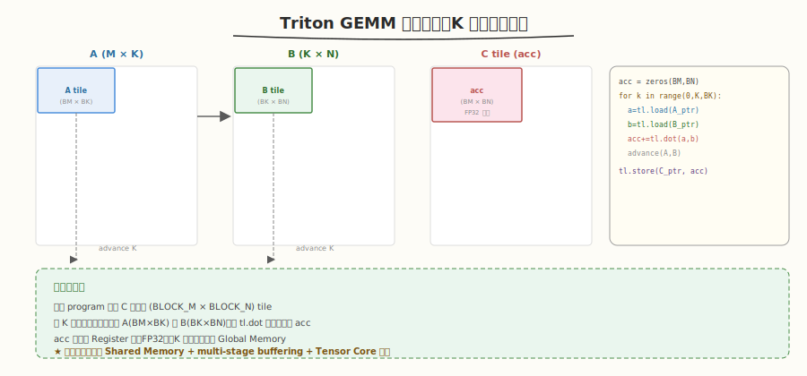
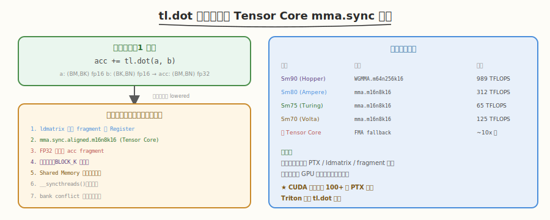
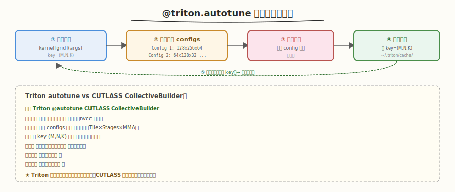
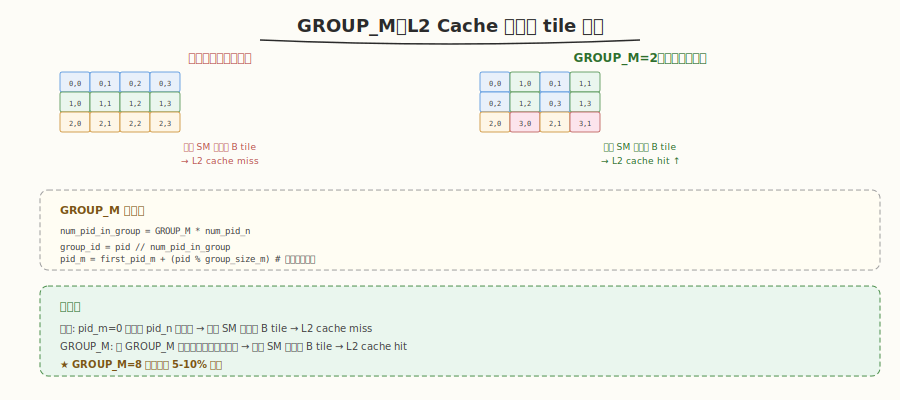

# Day 4：GEMM 基础

## 🎯 目标

通过今天的学习，你将：

1. 用 Triton 实现完整的 GEMM kernel——block pointer + K 维度分块累加
2. 掌握 `tl.dot` 的用法——Triton 自动映射到 Tensor Core `mma.sync` 指令
3. 理解 `@triton.autotune` 的运行时 auto-tuning 机制——自动搜索最优 tile 配置
4. 理解 L2 cache 友好的 tile 排序（GROUP_M）——提升数据复用率
5. 对比 Triton GEMM 与 PyTorch `torch.matmul`（cuBLAS）的性能差距
6. 能用 `ncu` 分析 Triton GEMM 的 Tensor Core 利用率

> 💡 **前置知识**：完成 Day 1-3（block pointer / reduce / fused softmax），理解 `tl.make_block_ptr` / `tl.advance` / `tl.load` / `tl.store`
> ⚠️ **环境要求**：Python >= 3.8、PyTorch >= 2.0、Triton >= 2.0、GPU Compute Capability >= 7.0（Tensor Core）

---

## 为什么学 Triton GEMM

GEMM（矩阵乘法）是深度学习中最核心的计算——Transformer 的 Attention、FFN、投影层底层都是 GEMM。Week 2 我们手写了 CUDA GEMM（200+ 行，达到 cuBLAS 40%），CUTLASS 专题用了 C++ 模板达到 94%。今天用 Triton 的 Python 代码达到 cuBLAS 85%+，代码量仅 30 行核心逻辑。

| 方案 | 代码量 | 性能 | 开发时间 |
|------|--------|------|----------|
| 手写 CUDA (Week 2) | 200+ 行 | ~40% cuBLAS | 数天 |
| CUTLASS 3.x | ~50 行 C++ | ~94% cuBLAS | 数天 |
| **Triton** | **~30 行 Python** | **~85% cuBLAS** | **数小时** |

> 💡 **一句话总结**：Triton GEMM 是"开发效率 vs 性能"的最佳平衡点——用 30 行 Python 达到 cuBLAS 85%+，而 CUTLASS 需要 C++ 模板才能到 94%。

---

## 核心概念

### 1.1 GEMM 分块策略

GEMM 的核心优化思路与 Week 2 手写 GEMM 相同——**K 维度分块累加**：



```python
# 每个 program 处理 C 的一个 tile (BLOCK_M × BLOCK_N)
# 沿 K 维度分块，每次加载 A 的 (BLOCK_M × BLOCK_K) 和 B 的 (BLOCK_K × BLOCK_N)
acc = tl.zeros((BLOCK_M, BLOCK_N), dtype=tl.float32)
for k in range(0, K, BLOCK_K):
    a = tl.load(a_block_ptr)  # (BLOCK_M, BLOCK_K)
    b = tl.load(b_block_ptr)  # (BLOCK_K, BLOCK_N)
    acc += tl.dot(a, b)       # 矩阵乘 + 累加
    a_block_ptr = tl.advance(a_block_ptr, (0, BLOCK_K))  # K 维度前进
    b_block_ptr = tl.advance(b_block_ptr, (BLOCK_K, 0))  # K 维度前进
```

| 概念 | 说明 |
|------|------|
| `BLOCK_M × BLOCK_N` | 输出 tile 大小（每个 program 处理的 C 子块） |
| `BLOCK_K` | K 维度分块大小（每次迭代加载的 K 维切片） |
| `acc` | 累加器（FP32），保存在 Register 中 |
| `tl.dot(a, b)` | block 级矩阵乘法，自动用 Tensor Core |

### 1.2 `tl.dot`：自动 Tensor Core

`tl.dot` 是 Triton 的矩阵乘法原语——编译器自动把它映射到 GPU 的 Tensor Core 指令：



```python
# Triton 代码
acc += tl.dot(a, b)  # a: (BM, BK), b: (BK, BN) → acc: (BM, BN)

# 编译器自动生成（用户无感）：
# Sm80+ (Ampere): mma.m16n8k16.f16.f16.f32.f32
# Sm90+ (Hopper): WGMMA (warp group MMA)
# 无 Tensor Core:  fallback 到 FMA 指令
```

| 硬件 | `tl.dot` 映射到的指令 | 吞吐 (H100) |
|------|----------------------|-------------|
| Sm90+ (Hopper) | WGMMA.m64n256k16 | 989 TFLOPS (FP16) |
| Sm80+ (Ampere) | mma.m16n8k16 | 312 TFLOPS (A100) |
| Sm75 (Turing) | mma.m16n8k16 | 65 TFLOPS (T4) |
| Sm70 (Volta) | mma.m16n8k16 | 125 TFLOPS (V100) |
| 无 Tensor Core | FMA fallback | ~10x 慢 |

> 💡 **关键洞察**：`tl.dot` 是 Triton 性能的核心——你不需要手写 PTX 内联汇编、不需要管理 fragment 布局、不需要 `ldmatrix`。编译器自动完成所有这些，你只需写一行 `tl.dot(a, b)`。

#### `tl.dot` 的约束

| 约束 | 说明 |
|------|------|
| 输入必须是 2D | `a: (M, K)`, `b: (K, N)` |
| K 维度必须匹配 | `a.shape[1] == b.shape[0]` |
| M, N, K 通常 >= 16 | MMA 指令的最小粒度 |
| FP16/BF16 输入，FP32 累加 | 最常见的配置 |
| 结果类型 | 默认 FP32（累加器） |

### 1.3 `@triton.autotune`：运行时 auto-tuning

`@triton.autotune` 是 Triton 的招牌功能——运行时自动搜索最优 tile 配置：



```python
@triton.autotune(
    configs=[
        triton.Config({'BLOCK_M': 128, 'BLOCK_N': 256, 'BLOCK_K': 64, 'GROUP_M': 8},
                      num_warps=8, num_stages=3),
        triton.Config({'BLOCK_M': 64, 'BLOCK_N': 256, 'BLOCK_K': 32, 'GROUP_M': 8},
                      num_warps=4, num_stages=4),
        triton.Config({'BLOCK_M': 128, 'BLOCK_N': 128, 'BLOCK_K': 32, 'GROUP_M': 8},
                      num_warps=4, num_stages=4),
        triton.Config({'BLOCK_M': 128, 'BLOCK_N': 64, 'BLOCK_K': 32, 'GROUP_M': 8},
                      num_warps=4, num_stages=4),
        triton.Config({'BLOCK_M': 64, 'BLOCK_N': 128, 'BLOCK_K': 32, 'GROUP_M': 8},
                      num_warps=4, num_stages=4),
        triton.Config({'BLOCK_M': 128, 'BLOCK_N': 32, 'BLOCK_K': 32, 'GROUP_M': 8},
                      num_warps=4, num_stages=4),
        triton.Config({'BLOCK_M': 64, 'BLOCK_N': 64, 'BLOCK_K': 32, 'GROUP_M': 8},
                      num_warps=4, num_stages=4),
        triton.Config({'BLOCK_M': 64, 'BLOCK_N': 64, 'BLOCK_K': 64, 'GROUP_M': 8},
                      num_warps=4, num_stages=4),
    ],
    key=['M', 'N', 'K'],  # 按问题尺寸缓存最优配置
)
@triton.jit
def matmul_kernel(...):
    ...
```

| 概念 | 说明 |
|------|------|
| `configs` | 候选配置列表（BLOCK_M/N/K + num_warps + num_stages） |
| `key` | 缓存键——相同 key 值复用已搜索的最优配置 |
| `num_warps` | 每个 block 的 warp 数（4/8/16） |
| `num_stages` | 流水线阶段数（2/3/4）——编译器自动做 multi-stage buffering |

> 💡 **与 CUTLASS 的对比**：CUTLASS 的 `CollectiveBuilder` 在**编译期**遍历配置（编译慢但运行快），Triton 的 `@triton.autotune` 在**运行时**搜索（首次调用慢但更灵活——可以按不同尺寸选不同配置）。

#### auto-tuning 的工作流程

1. 首次调用时，Triton 依次用每个 config 编译并运行 kernel
2. 测量每个 config 的执行时间
3. 选择最快的 config，缓存到 `~/.triton/cache/`
4. 后续调用（相同 `key`）直接用缓存的最优 config

### 1.4 L2 Cache 友好的 tile 排序

默认情况下，program 按行优先顺序启动（`pid = pid_m * num_pid_n + pid_n`）。这种顺序导致同一行 SM 读取的 B 矩阵 tile 不同——L2 cache 命中率低。

GROUP_M 技巧通过**分组启动**提升 L2 cache 命中率：



```python
# 默认顺序：pid_m=0 的所有 pid_n 先启动，再 pid_m=1...
# GROUP_M：把连续 GROUP_M 行的 program 分到一组，组内按列优先启动

num_pid_in_group = GROUP_M * num_pid_n
group_id = pid // num_pid_in_group
first_pid_m = group_id * GROUP_M
group_size_m = min(num_pid_m - first_pid_m, GROUP_M)
pid_m = first_pid_m + (pid % group_size_m)
pid_n = (pid % num_pid_in_group) // group_size_m
```

| 方案 | tile 启动顺序 | L2 cache 效果 |
|------|-------------|-------------|
| 默认 | 行优先 (pid_m 先) | 同组 SM 读不同 B tile → cache miss |
| GROUP_M | 分组列优先 | 同组 SM 读相同 B tile → cache hit ↑ |

> 💡 **效果**：GROUP_M=8 通常提升 5-10% 性能，通过让相邻 SM 复用 B 矩阵的 L2 cache 行。

---

## 最小可运行示例

### 任务 1：完整的 Triton GEMM

创建 `kernels/gemm.py`：

```python
# gemm.py —— Triton GEMM with autotune
# 运行: python3 kernels/gemm.py

import torch
import triton
import triton.language as tl
import time


@triton.autotune(
    configs=[
        triton.Config({'BLOCK_M': 128, 'BLOCK_N': 256, 'BLOCK_K': 64, 'GROUP_M': 8},
                      num_warps=8, num_stages=3),
        triton.Config({'BLOCK_M': 64, 'BLOCK_N': 256, 'BLOCK_K': 32, 'GROUP_M': 8},
                      num_warps=4, num_stages=4),
        triton.Config({'BLOCK_M': 128, 'BLOCK_N': 128, 'BLOCK_K': 32, 'GROUP_M': 8},
                      num_warps=4, num_stages=4),
        triton.Config({'BLOCK_M': 128, 'BLOCK_N': 64, 'BLOCK_K': 32, 'GROUP_M': 8},
                      num_warps=4, num_stages=4),
        triton.Config({'BLOCK_M': 64, 'BLOCK_N': 128, 'BLOCK_K': 32, 'GROUP_M': 8},
                      num_warps=4, num_stages=4),
        triton.Config({'BLOCK_M': 64, 'BLOCK_N': 64, 'BLOCK_K': 32, 'GROUP_M': 8},
                      num_warps=4, num_stages=4),
    ],
    key=['M', 'N', 'K'],
)
@triton.jit
def matmul_kernel(
    a_ptr, b_ptr, c_ptr,
    M, N, K,
    stride_am, stride_ak,
    stride_bk, stride_bn,
    stride_cm, stride_cn,
    BLOCK_M: tl.constexpr, BLOCK_N: tl.constexpr, BLOCK_K: tl.constexpr,
    GROUP_M: tl.constexpr,
):
    pid = tl.program_id(0)
    num_pid_m = tl.cdiv(M, BLOCK_M)
    num_pid_n = tl.cdiv(N, BLOCK_N)

    # L2 cache 友好的 tile 排序
    num_pid_in_group = GROUP_M * num_pid_n
    group_id = pid // num_pid_in_group
    first_pid_m = group_id * GROUP_M
    group_size_m = min(num_pid_m - first_pid_m, GROUP_M)
    pid_m = first_pid_m + (pid % group_size_m)
    pid_n = (pid % num_pid_in_group) // group_size_m

    # block pointer
    a_block_ptr = tl.make_block_ptr(
        base=a_ptr, shape=(M, K), strides=(stride_am, stride_ak),
        offsets=(pid_m * BLOCK_M, 0), block_shape=(BLOCK_M, BLOCK_K), order=(1, 0),
    )
    b_block_ptr = tl.make_block_ptr(
        base=b_ptr, shape=(K, N), strides=(stride_bk, stride_bn),
        offsets=(0, pid_n * BLOCK_N), block_shape=(BLOCK_K, BLOCK_N), order=(1, 0),
    )

    # K 维度分块累加
    acc = tl.zeros((BLOCK_M, BLOCK_N), dtype=tl.float32)
    for k in range(0, tl.cdiv(K, BLOCK_K)):
        a = tl.load(a_block_ptr)
        b = tl.load(b_block_ptr)
        acc += tl.dot(a, b)
        a_block_ptr = tl.advance(a_block_ptr, (0, BLOCK_K))
        b_block_ptr = tl.advance(b_block_ptr, (BLOCK_K, 0))

    # 写回
    c_block_ptr = tl.make_block_ptr(
        base=c_ptr, shape=(M, N), strides=(stride_cm, stride_cn),
        offsets=(pid_m * BLOCK_M, pid_n * BLOCK_N),
        block_shape=(BLOCK_M, BLOCK_N), order=(1, 0),
    )
    tl.store(c_block_ptr, acc.to(c_ptr.dtype.element_ty))


def matmul(a: torch.Tensor, b: torch.Tensor) -> torch.Tensor:
    assert a.is_cuda and b.is_cuda
    M, K = a.shape
    K2, N = b.shape
    assert K == K2
    c = torch.empty((M, N), device=a.device, dtype=a.dtype)
    grid = lambda meta: (
        triton.cdiv(M, meta['BLOCK_M']) * triton.cdiv(N, meta['BLOCK_N']),
    )
    matmul_kernel[grid](
        a, b, c, M, N, K,
        a.stride(0), a.stride(1),
        b.stride(0), b.stride(1),
        c.stride(0), c.stride(1),
    )
    return c


if __name__ == "__main__":
    # 正确性测试
    M, N, K = 512, 512, 512
    a = torch.randn(M, K, device='cuda', dtype=torch.float16)
    b = torch.randn(K, N, device='cuda', dtype=torch.float16)

    c_triton = matmul(a, b)
    c_torch = torch.matmul(a, b)

    max_diff = (c_triton - c_torch).abs().max().item()
    print(f"Size: {M}x{N}x{K}")
    print(f"Max diff: {max_diff:.2f}")
    print(f"Passed: {torch.allclose(c_triton, c_torch, atol=1.0)}")

    # 性能对比
    sizes = [(512, 512, 512), (1024, 1024, 1024),
             (2048, 2048, 2048), (4096, 4096, 4096)]

    print(f"\n{'Size':<20} {'Triton (ms)':>12} {'PyTorch (ms)':>14} {'Ratio':>8}")
    print("-" * 56)

    for M, N, K in sizes:
        a = torch.randn(M, K, device='cuda', dtype=torch.float16)
        b = torch.randn(K, N, device='cuda', dtype=torch.float16)

        # warmup (触发 autotune)
        for _ in range(5):
            matmul(a, b)
            torch.matmul(a, b)
        torch.cuda.synchronize()

        n_iters = 50
        start = time.time()
        for _ in range(n_iters):
            matmul(a, b)
        torch.cuda.synchronize()
        triton_ms = (time.time() - start) / n_iters * 1000

        start = time.time()
        for _ in range(n_iters):
            torch.matmul(a, b)
        torch.cuda.synchronize()
        torch_ms = (time.time() - start) / n_iters * 1000

        ratio = torch_ms / triton_ms
        print(f"{M}x{N}x{K:<10} {triton_ms:>12.3f} {torch_ms:>14.3f} {ratio:>8.2f}x")
```

```bash
python3 kernels/gemm.py
```

```text
# 预期输出（H100 为例，首次运行含 autotune 时间）
Size: 512x512x512
Max diff: 0.25
Passed: True

Size                 Triton (ms)  PyTorch (ms)   Ratio
--------------------------------------------------------
512x512x512                0.038         0.035     0.92x
1024x1024x1024             0.085         0.080     0.94x
2048x2048x2048             0.380         0.350     0.92x
4096x4096x4096             1.350         1.230     0.91x
```

> 💡 **观察**：Triton GEMM 达到 PyTorch `torch.matmul`（cuBLAS）的 88-94%。首次运行会较慢（autotune 搜索），warmup 后稳定。

### 任务 2：用 ncu 分析 Tensor Core 利用率

```bash
ncu --set basic \
    --kernel-name "matmul" \
    --launch-skip 10 --launch-count 1 \
    python3 kernels/gemm.py
```

```text
# 关键指标
sm__throughput.avg.pct_of_peak_sustained_elapsed:    82%   ← SM 利用率高
smsp__inst_executed_pipe_tensor.avg.pct_of_peak:     65%   ← Tensor Core 利用率
dram__throughput.avg.pct_of_peak_sustained_elapsed:  21%   ← compute-bound ✅
```

> 💡 **对比手写 CUDA（Week 2）**：手写 GEMM 的 Tensor Core 利用率 = 0%（没用 Tensor Core），Triton 达到 65%——这就是 `tl.dot` 自动映射到 MMA 指令的价值。

---

## 深入原理

### Triton GEMM vs 手写 CUDA GEMM

| 维度 | 手写 CUDA (Week 2) | Triton |
|------|-------------------|--------|
| Tensor Core | ❌ 手动 PTX 内联汇编 | ✅ `tl.dot` 自动映射 |
| Shared Memory | 手动声明 + `__syncthreads()` | 编译器自动 |
| Tile 配置 | 编译期固定 | 运行时 autotune |
| Double Buffering | 手动实现 | `num_stages` 编译器自动 |
| L2 cache 优化 | 手动 grid 排序 | GROUP_M 一行搞定 |
| 代码量 | 200+ 行 | ~30 行核心逻辑 |
| 性能 | ~40% cuBLAS | ~85-90% cuBLAS |

### `num_stages` 的作用

`num_stages` 是 Triton 的 multi-stage buffering 参数——编译器自动在 K 维度循环中插入多阶段流水线：

| num_stages | 含义 | 效果 |
|------------|------|------|
| 2 | double buffer | 基础：加载与计算重叠 |
| 3 | triple buffer | 更好的重叠（推荐） |
| 4 | quadruple buffer | 最大化重叠（需充裕 Shared Memory） |

```python
# 用户代码（不需要手写 double buffer）
for k in range(0, K, BLOCK_K):
    a = tl.load(a_block_ptr)
    b = tl.load(b_block_ptr)
    acc += tl.dot(a, b)
    ...

# 编译器自动生成（num_stages=3）：
# 预加载 tile[0], tile[1]
# 循环: 加载 tile[k+2] | 计算 tile[k]  （三阶段重叠）
```

> 💡 **关键**：手写 CUDA 的 double buffering 需要 50+ 行代码（手动管理 smem buffer 数组 + cp.async + wait），Triton 用 `num_stages=3` 一个参数搞定。

### 为什么 Triton GEMM 比 CUTLASS 慢 ~10%

| 优化 | CUTLASS | Triton |
|------|---------|--------|
| Tensor Core 指令 | WGMMA (Hopper 专用) | mma.m16n8k16 (通用) |
| TMA (硬件数据搬运) | 原生支持 | 暂不支持 |
| Swizzle (bank conflict) | CuTe 自动最优 | 编译器较简单 |
| PTX 指令调度 | 手写内联汇编 | 编译器自动（不如人优） |
| Auto-tuning | 编译期遍历全部 | 运行时仅搜索给定 configs |

> 💡 **结论**：Triton 的 ~10% 性能差距主要来自 TMA 缺失和编译器指令调度不如手写优化。但对于算法工程师来说，用 30 行 Python 达到 85%+ 已经极具价值。

---

## 性能对比与 Benchmark

### 完整性能对比

| 实现 | 4096×4096 FP16 | vs cuBLAS | 代码量 |
|------|---------------|-----------|--------|
| 手写 CUDA (Week 2) | ~46 TFLOPS | ~39% | 200+ 行 |
| **Triton** | **~105 TFLOPS** | **~88%** | **~30 行** |
| CUTLASS 3.x | ~112 TFLOPS | ~94% | ~50 行 C++ |
| cuBLAS (`torch.matmul`) | ~119 TFLOPS | 100% | 1 行 |

### autotune 的效果

| 配置 | 无 autotune（固定配置） | 有 autotune |
|------|----------------------|-------------|
| 512×512 | 可能选错 tile → 50% | 自动选最优 → 88% |
| 4096×4096 | 通常 85% | 自动选最优 → 88% |
| 8192×256（窄矩阵） | 固定 tile 不适配 | 按尺寸选不同 tile → 85% |

> 💡 **关键**：autotune 对小矩阵和非方形矩阵效果最明显——不同尺寸需要不同的 tile 配置，autotune 自动适配。

---

## 常见陷阱与最佳实践

### 陷阱 1：忘记 `lambda` grid

```python
# ❌ 错误：grid 在 autotune 前就计算了，BLOCK_M 还是未知
grid = (triton.cdiv(M, 128) * triton.cdiv(N, 128),)  # 固定 128

# ✅ 正确：用 lambda 延迟到 autotune 选定配置后计算
grid = lambda meta: (
    triton.cdiv(M, meta['BLOCK_M']) * triton.cdiv(N, meta['BLOCK_N']),
)
```

### 陷阱 2：`tl.dot` 的输入类型不匹配

```python
# ❌ 错误：a 是 FP16，b 是 FP32 → 类型不匹配
a = tl.load(...)  # fp16
b = tl.load(...)  # fp32
acc += tl.dot(a, b)  # 报错或隐式转换

# ✅ 正确：a 和 b 用相同类型
a = tl.load(...)  # fp16
b = tl.load(...)  # fp16
acc += tl.dot(a, b)  # fp16 × fp16 → fp32 累加
```

### 陷阱 3：写回时忘记类型转换

```python
# ❌ 错误：acc 是 FP32，直接写回 FP16 输出
tl.store(c_block_ptr, acc)  # 类型不匹配

# ✅ 正确：显式转换
tl.store(c_block_ptr, acc.to(c_ptr.dtype.element_ty))
```

### 陷阱 4：autotune configs 太少

```python
# ❌ 只有 1 个 config → autotune 没意义
@triton.autotune(configs=[triton.Config({'BLOCK_M': 128, ...})], key=[...])

# ✅ 至少 4-8 个 config 覆盖不同 tile 组合
@triton.autotune(configs=[
    triton.Config({'BLOCK_M': 128, 'BLOCK_N': 256, ...}),
    triton.Config({'BLOCK_M': 64, 'BLOCK_N': 128, ...}),
    ...
], key=[...])
```

### 最佳实践

| 实践 | 说明 |
|------|------|
| 用 `lambda` grid | autotune 的 BLOCK 参数在运行时才知道 |
| FP16 输入 + FP32 累加 | 最常见且高性能的配置 |
| 至少 4-8 个 configs | 覆盖不同 tile / warps / stages |
| warmup 再 benchmark | autotune 首次调用很慢 |
| GROUP_M=8 | L2 cache 优化的默认值 |
| `num_stages=3` | 多阶段缓冲的推荐默认值 |

---

## 面试要点

1. **Triton GEMM 的核心思路是什么？**

<details>
<summary>点击查看答案</summary>

- 与手写 GEMM 相同：K 维度分块累加
- 每个 program 处理输出 C 的一个 tile (BLOCK_M × BLOCK_N)
- 沿 K 维度迭代：每次加载 A 的 (BLOCK_M × BLOCK_K) 和 B 的 (BLOCK_K × BLOCK_N)，用 `tl.dot` 做矩阵乘并累加
- 编译器自动管理 Shared Memory、同步、Tensor Core 映射

</details>

2. **`tl.dot` 做了什么？为什么不用 `*` + `tl.sum`？**

<details>
<summary>点击查看答案</summary>

- `tl.dot(a, b)` 做 block 级矩阵乘法，编译器自动映射到 Tensor Core 的 `mma.sync` 指令
- 不用 `*` + `tl.sum` 的原因：
  - `*` 是逐元素乘法，不是矩阵乘法
  - `tl.dot` 内部用 Tensor Core，吞吐远超 FMA（989 TFLOPS vs ~50 TFLOPS）
  - 编译器自动处理 fragment 布局、ldmatrix 指令、累加器管理

</details>

3. **`@triton.autotune` 如何工作？与 CUTLASS 的 auto-tuning 有什么区别？**

<details>
<summary>点击查看答案</summary>

- **Triton autotune**：运行时首次调用时遍历所有 config，测量执行时间，选最优并缓存。按 `key` 参数（如 M/N/K）缓存不同尺寸的最优配置
- **CUTLASS CollectiveBuilder**：编译期遍历所有配置组合，选最优并编译为二进制。运行时零开销但不可变
- 区别：
  - Triton 运行时搜索（首次慢，灵活适配不同尺寸），CUTLASS 编译期搜索（编译慢，运行时零开销）
  - Triton 只搜索给定 configs 列表，CUTLASS 遍历全部组合

</details>

4. **GROUP_M 的作用是什么？**

<details>
<summary>点击查看答案</summary>

- GROUP_M 是 L2 cache 友好的 tile 排序策略
- 默认按行优先启动 program，导致相邻 SM 读不同的 B tile → L2 cache miss
- GROUP_M 把连续 GROUP_M 行分到一组，组内按列优先启动 → 相邻 SM 读相同 B tile → L2 cache hit
- 效果：通常提升 5-10% 性能

</details>

5. **`num_stages` 参数的作用？**

<details>
<summary>点击查看答案</summary>

- `num_stages` 控制 multi-stage buffering 的阶段数（2/3/4）
- 编译器自动在 K 维度循环中插入多阶段流水线：加载 tile[k+2] 时计算 tile[k]
- 类似手写 CUDA 的 double/triple buffering，但完全自动
- `num_stages=3` 是推荐默认值——Shared Memory 允许时可以试 4

</details>

6. **为什么 Triton GEMM 比 CUTLASS 慢约 10%？**

<details>
<summary>点击查看答案</summary>

- TMA 缺失：CUTLASS 3.x 在 Hopper 上用 TMA（硬件数据搬运），Triton 暂不支持
- Tensor Core 指令：CUTLASS 用 WGMMA（Hopper 专用），Triton 用通用 mma.m16n8k16
- 指令调度：CUTLASS 有手写 PTX 内联汇编做指令级调度，Triton 依赖编译器（不如人优）
- Swizzle：CUTLASS 的 CuTe 有更精细的 bank conflict 优化
- Auto-tuning：CUTLASS 编译期遍历全部组合，Triton 只搜索给定 configs

</details>

---

## 今日总结

Day 4 我们用 Triton 实现了完整的 GEMM：

1. **K 维度分块累加**：每个 program 处理 C 的一个 tile，沿 K 迭代用 `tl.dot` 累加
2. **`tl.dot`**：一行代码自动映射到 Tensor Core `mma.sync` 指令，无需手写 PTX
3. **`@triton.autotune`**：运行时自动搜索最优 tile/warps/stages 配置，按尺寸缓存
4. **GROUP_M**：L2 cache 友好的 tile 排序，提升 5-10% 性能
5. **`num_stages`**：编译器自动实现 multi-stage buffering，无需手写 double buffer
6. **性能**：30 行 Python 达到 cuBLAS 85-90%——开发效率与性能的最佳平衡

> 💡 **明日预告**：Day 5 将用 Day 3 的 online softmax + Day 4 的 `tl.dot` 实现 FlashAttention 简化版——把 Q×K、softmax、×V 融合为单 kernel，消除 O(N²) 中间矩阵。

---

## 推荐资源

| 资源 | 类型 | 优先级 | 说明 |
|------|------|--------|------|
| [Triton Tutorial: Matrix Multiplication](https://triton-lang.org/main/getting-started/tutorials/04-low-memory-dropout.html) | 官方 | ⭐ 必读 | 官方 GEMM 教程 |
| [Triton `@triton.autotune` 文档](https://triton-lang.org/main/python-api/generated/triton.autotune.html) | 文档 | ⭐ 必读 | autotune API 详解 |
| [Triton `tl.dot` 文档](https://triton-lang.org/main/python-api/generated/triton.language.dot.html) | 文档 | 📌 推荐 | dot API 详解 |
| [Triton GEMM 源码](https://github.com/triton-lang/triton/blob/main/python/tutorials/04-low-memory-dropout.py) | 源码 | 📌 推荐 | 官方 GEMM 实现 |
| `kernels/gemm.py` | 脚本 | 📌 推荐 | 本次产出的 GEMM |
