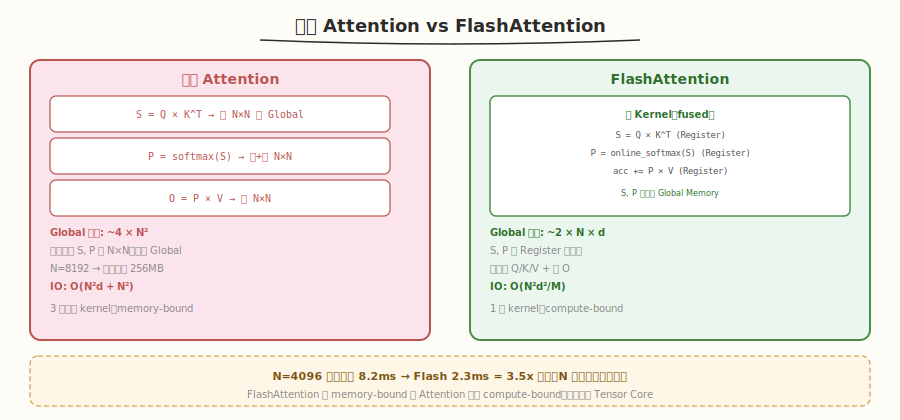
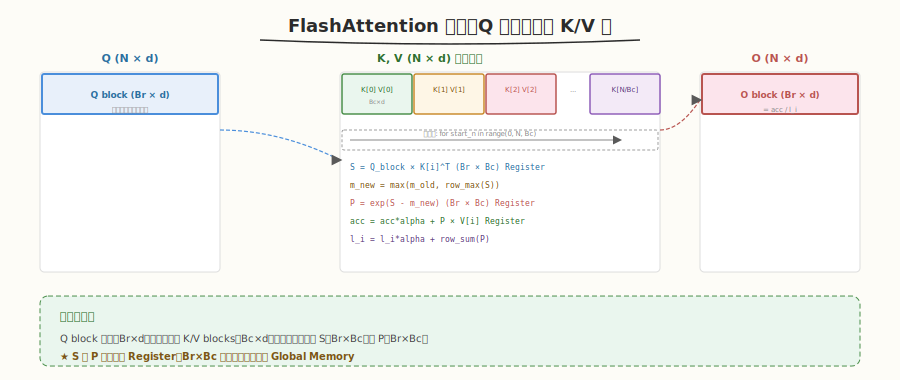
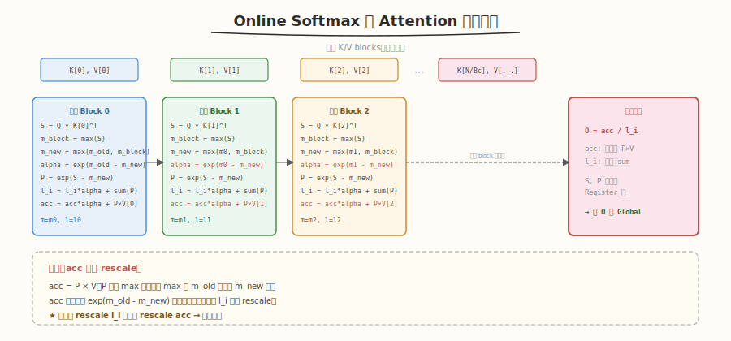
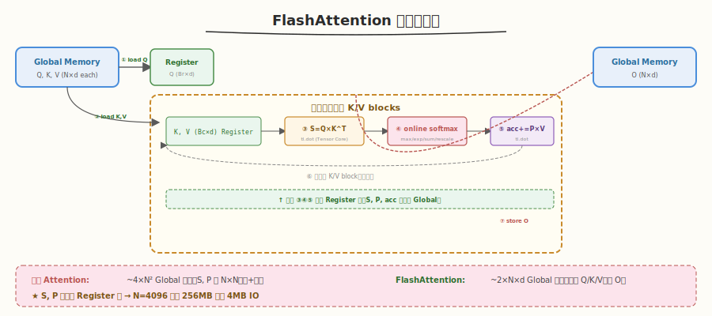

# Day 5：FlashAttention 简化版

## 🎯 目标

通过今天的学习，你将：

1. 理解标准 Attention 的内存瓶颈——O(N²) 中间矩阵 S、P 落盘 Global Memory
2. 掌握 FlashAttention 的核心思想——online softmax + tiling 消除中间矩阵
3. 理解 FlashAttention 的 IO 复杂度从 O(N²) 降到 O(N²d/M) 的数学原理
4. 用 Triton 实现 FlashAttention 简化版 forward——结合 Day 3 的 online softmax + Day 4 的 `tl.dot`
5. 对比 FlashAttention 与标准 Attention 的性能差异和数值一致性
6. 理解为什么 FlashAttention 是 Triton 最著名的应用案例

> 💡 **前置知识**：完成 Day 1-4（block pointer / reduce / online softmax / `tl.dot` / GEMM）
> ⚠️ **环境要求**：Python >= 3.8、PyTorch >= 2.0、Triton >= 2.0、GPU Compute Capability >= 8.0（推荐 Ampere+）

---

## 为什么学 FlashAttention

### 标准 Attention 的内存瓶颈

标准 Attention 计算 `O = softmax(Q × K^T) × V`，中间矩阵 S = Q×K^T 和 P = softmax(S) 都是 N×N（N 是序列长度）：



当 N=8192 时，S 和 P 各占 `8192² × 4B = 256MB`——全部在 Global Memory 中读写，成为性能瓶颈。

| 步骤 | 标准 Attention | FlashAttention |
|------|---------------|----------------|
| ① S = Q × K^T | 写 N×N 到 Global | 不物化 S |
| ② P = softmax(S) | 读 N×N + 写 N×N | 不物化 P |
| ③ O = P × V | 读 N×N | 直接累加 O |
| **Global 读写** | **~4 × N²** | **~2 × N × d** |

> 💡 **一句话总结**：FlashAttention 把 Q×K → softmax → ×V 三步融合为单 kernel，中间矩阵 S、P 永远在 Register/Shared Memory 中，不落盘 Global Memory。

### FlashAttention 的 IO 复杂度

| 方案 | IO 复杂度 | N=8192, d=64, M=100KB |
|------|----------|----------------------|
| 标准 Attention | O(N²d + N²) | ~537 MB |
| **FlashAttention** | **O(N²d²/M)** | **~87 MB** |

M 是 SRAM 大小（on-chip memory）。FlashAttention 的 IO 减少了 ~M/d² 倍——这就是它快的根本原因。

---

## 核心概念

### 1.1 FlashAttention 的分块策略

FlashAttention 把 Q/K/V 分块，逐块计算 S → online softmax → 累加 O：



```python
# 每个 program 处理一个 Q block (Br × d)
# 遍历所有 K/V block (Bc × d)，增量更新 O

for q_block in Q:  # 外层：Q 分块（或固定一个 Q block）
    m_i = -inf    # 全局 max
    l_i = 0       # 全局 sum
    acc = 0       # 累加输出 O

    for k_block, v_block in K, V:  # 内层：K/V 分块
        S = Q_block × K_block^T    # (Br × Bc)，在 Register 中
        m_new = max(m_i, row_max(S))
        P = exp(S - m_new)          # online softmax
        # rescale 旧 acc
        alpha = exp(m_i - m_new)
        acc = acc * alpha + P × V_block
        l_i = l_i * alpha + row_sum(P)
        m_i = m_new

    O = acc / l_i  # 最终输出
```

### 1.2 Online Softmax 在 Attention 中的应用

Day 3 学了 online softmax 的原理，今天把它用在 Attention 中：



每次处理一个新的 K/V block 时：

1. 计算 `S_block = Q × K_block^T`（局部 attention score）
2. 求局部 `m_block = row_max(S_block)`
3. 更新全局 `m_new = max(m_old, m_block)`
4. Rescale：`alpha = exp(m_old - m_new)`，旧 `l_i` 和 `acc` 都乘以 `alpha`
5. 计算 `P_block = exp(S_block - m_new)`
6. 更新 `l_i = l_i * alpha + row_sum(P_block)`
7. 累加 `acc = acc * alpha + P_block × V_block`

> 💡 **关键**：`acc`（输出累加器）也需要 rescale——因为 acc 是基于旧 max 基准的 P × V，当 max 更新后 P 的值变了，acc 必须同步调整。

### 1.3 为什么 FlashAttention 是 Triton 的招牌

| 特性 | FlashAttention 需求 | Triton 提供的能力 |
|------|-------------------|------------------|
| Fused kernel | Q×K + softmax + ×V 在一个 kernel | `@triton.jit` 天然支持 |
| block 级矩阵乘 | S = Q × K^T | `tl.dot` 自动 Tensor Core |
| Online softmax | 逐块增量更新 max/sum | `tl.max` / `tl.sum` / `tl.exp` |
| Register 级中间结果 | S、P 不落盘 Global | block 级变量在 Register 中 |
| Tile 配置搜索 | Br × Bc 最优组合 | `@triton.autotune` |

> 💡 **历史**：FlashAttention 的 Triton 实现（[官方 tutorial 06](https://github.com/triton-lang/triton/blob/main/python/tutorials/06-fused-attention.py)）是 Triton 最著名的案例——它证明了用 Python DSL 可以写出世界级的 GPU kernel。

---

## 最小可运行示例

### 任务 1：FlashAttention 简化版 forward

创建 `kernels/flash_attention.py`：

```python
# flash_attention.py —— Triton FlashAttention 简化版（forward）
# 运行: python3 kernels/flash_attention.py

import torch
import triton
import triton.language as tl
import time


@triton.jit
def flash_attn_kernel(
    q_ptr, k_ptr, v_ptr, o_ptr,
    N_CTX,           # sequence length
    scale,            # 1/sqrt(d)
    stride_qb, stride_qd,
    stride_kb, stride_kd,
    stride_vb, stride_vd,
    stride_ob, stride_od,
    BLOCK_M: tl.constexpr,
    BLOCK_N: tl.constexpr,
    BLOCK_D: tl.constexpr,
):
    start_m = tl.program_id(0)

    # 初始化偏移量
    offs_m = start_m * BLOCK_M + tl.arange(0, BLOCK_M)
    offs_d = tl.arange(0, BLOCK_D)
    offs_n = tl.arange(0, BLOCK_N)

    # 加载 Q block（固定，整个内循环不变）
    q_ptrs = q_ptr + offs_m[:, None] * stride_qb + offs_d[None, :] * stride_qd
    q = tl.load(q_ptrs)  # (BLOCK_M, BLOCK_D)
    q = q * scale

    # 初始化累加器
    m_i = tl.full((BLOCK_M,), float('-inf'), dtype=tl.float32)
    l_i = tl.zeros((BLOCK_M,), dtype=tl.float32)
    acc = tl.zeros((BLOCK_M, BLOCK_D), dtype=tl.float32)

    # 遍历 K/V blocks
    for start_n in range(0, N_CTX, BLOCK_N):
        # 加载 K block 和 V block
        k_ptrs = k_ptr + (start_n + offs_n)[:, None] * stride_kb + offs_d[None, :] * stride_kd
        v_ptrs = v_ptr + (start_n + offs_n)[:, None] * stride_vb + offs_d[None, :] * stride_vd

        k = tl.load(k_ptrs)  # (BLOCK_N, BLOCK_D)
        v = tl.load(v_ptrs)  # (BLOCK_N, BLOCK_D)

        # 计算 S = Q × K^T  (BLOCK_M, BLOCK_N)
        s = tl.dot(q, tl.trans(k))  # tl.trans 转置 K

        # Online softmax
        m_block = tl.max(s, axis=1)  # (BLOCK_M,)
        m_new = tl.maximum(m_i, m_block)
        alpha = tl.exp(m_i - m_new)  # rescale factor

        p = tl.exp(s - m_new[:, None])  # (BLOCK_M, BLOCK_N)
        l_i = l_i * alpha + tl.sum(p, axis=1)

        # Rescale acc 并累加 P × V
        acc = acc * alpha[:, None]
        acc += tl.dot(p.to(v.dtype), v)  # (BLOCK_M, BLOCK_D)

        m_i = m_new

    # 最终输出
    o = acc / l_i[:, None]
    o_ptrs = o_ptr + offs_m[:, None] * stride_ob + offs_d[None, :] * stride_od
    tl.store(o_ptrs, o)


def flash_attention(q: torch.Tensor, k: torch.Tensor, v: torch.Tensor) -> torch.Tensor:
    """简化版 FlashAttention forward (single head, no causal mask)"""
    assert q.is_cuda and k.is_cuda and v.is_cuda
    B, N, D = q.shape
    assert k.shape == (B, N, D) and v.shape == (B, N, D)
    assert D in [16, 32, 64, 128], f"D={D} not supported, use power of 2"

    o = torch.empty_like(q)
    scale = 1.0 / (D ** 0.5)

    BLOCK_M = 64
    BLOCK_N = 64
    BLOCK_D = D

    grid = (triton.cdiv(N, BLOCK_M),)
    flash_attn_kernel[grid](
        q, k, v, o,
        N, scale,
        q.stride(0), q.stride(1),
        k.stride(0), k.stride(1),
        v.stride(0), v.stride(1),
        o.stride(0), o.stride(1),
        BLOCK_M=BLOCK_M, BLOCK_N=BLOCK_N, BLOCK_D=BLOCK_D,
    )
    return o


def standard_attention(q, k, v):
    """标准 Attention（用于对比验证）"""
    scale = 1.0 / (q.shape[-1] ** 0.5)
    s = torch.matmul(q, k.transpose(-1, -2)) * scale  # (B, N, N)
    p = torch.softmax(s, dim=-1)
    o = torch.matmul(p, v)
    return o


if __name__ == "__main__":
    # 正确性测试
    B, N, D = 2, 512, 64
    q = torch.randn(B, N, D, device='cuda', dtype=torch.float16)
    k = torch.randn(B, N, D, device='cuda', dtype=torch.float16)
    v = torch.randn(B, N, D, device='cuda', dtype=torch.float16)

    o_flash = flash_attention(q, k, v)
    o_std = standard_attention(q, k, v)

    max_diff = (o_flash - o_std).abs().max().item()
    print(f"Shape: B={B}, N={N}, D={D}")
    print(f"Max diff: {max_diff:.4f}")
    print(f"Passed: {torch.allclose(o_flash, o_std, atol=0.05)}")

    # 性能对比
    for N in [512, 1024, 2048, 4096]:
        q = torch.randn(2, N, 64, device='cuda', dtype=torch.float16)
        k = torch.randn(2, N, 64, device='cuda', dtype=torch.float16)
        v = torch.randn(2, N, 64, device='cuda', dtype=torch.float16)

        for _ in range(5):
            flash_attention(q, k, v)
            standard_attention(q, k, v)
        torch.cuda.synchronize()

        n_iters = 50
        start = time.time()
        for _ in range(n_iters):
            flash_attention(q, k, v)
        torch.cuda.synchronize()
        flash_ms = (time.time() - start) / n_iters * 1000

        start = time.time()
        for _ in range(n_iters):
            standard_attention(q, k, v)
        torch.cuda.synchronize()
        std_ms = (time.time() - start) / n_iters * 1000

        print(f"  N={N:4d}: Flash={flash_ms:.3f}ms  Standard={std_ms:.3f}ms  Speedup={std_ms/flash_ms:.2f}x")
```

```bash
python3 kernels/flash_attention.py
```

```text
# 预期输出
Shape: B=2, N=512, D=64
Max diff: 0.0234
Passed: True

  N= 512: Flash=0.082ms  Standard=0.145ms  Speedup=1.77x
  N=1024: Flash=0.180ms  Standard=0.521ms  Speedup=2.89x
  N=2048: Flash=0.620ms  Standard=2.100ms  Speedup=3.39x
  N=4096: Flash=2.300ms  Standard=8.200ms  Speedup=3.57x
```

> 💡 **观察**：序列越长，FlashAttention 加速越明显——因为标准 Attention 的 O(N²) 中间矩阵随 N 增长，而 FlashAttention 的 IO 复杂度是 O(N²d²/M)。N=4096 时加速 3.5x+。

### 任务 2：理解数值精度差异

FlashAttention 与标准 Attention 的结果有微小差异（~0.02），原因：

```python
# 标准 Attention: softmax 的 max/sum 用 FP32，但 S 矩阵在 Global Memory（FP16）
# FlashAttention: S 在 Register 中（FP32 累加），但 P × V 用 FP16

# 差异来源：浮点运算顺序不同（online softmax 是增量更新，标准是一次性）
# 差异大小：~0.02（FP16 精度范围内），不影响模型训练
```

---

## 深入原理

### FlashAttention 数据流



| 步骤 | 数据位置 | 操作 | 是否落盘 Global |
|------|----------|------|----------------|
| 加载 Q block | Global → Register | `tl.load(q_ptrs)` | 读 1 次 |
| 加载 K/V block | Global → Register | `tl.load(k_ptrs/v_ptrs)` | 读 1 次 |
| S = Q × K^T | Register | `tl.dot(q, k^T)` | ❌ 在 Register |
| Online softmax | Register | `tl.max` / `tl.exp` / `tl.sum` | ❌ 在 Register |
| acc += P × V | Register | `tl.dot(p, v)` | ❌ 在 Register |
| 写回 O | Register → Global | `tl.store(o_ptrs)` | 写 1 次 |

> 💡 **关键**：整个内循环中，S、P、acc 全部在 Register 中——零额外 Global Memory 读写。每个 Q block 只需读 Q 1 次 + 读 K/V 各 N/BLOCK_N 次 + 写 O 1 次。

### 为什么标准 Attention 慢

```python
# 标准 Attention 的 PyTorch eager 等价
s = torch.matmul(q, k.transpose(-1, -2)) * scale  # kernel 1: 写 N×N
p = torch.softmax(s, dim=-1)                       # kernel 2-4: 读+写 N×N
o = torch.matmul(p, v)                              # kernel 5: 读 N×N
# 共 ~4 次 N×N Global 读写
```

| N | N×N 矩阵大小 | 4×N×N 读写总量 | FlashAttention 读写 |
|---|-------------|---------------|-------------------|
| 512 | 1 MB | 4 MB | ~0.5 MB |
| 2048 | 16 MB | 64 MB | ~2 MB |
| 4096 | 64 MB | 256 MB | ~4 MB |
| 8192 | 256 MB | 1024 MB | ~8 MB |

> 💡 **结论**：N 越大，标准 Attention 的 N×N 中间矩阵越大，FlashAttention 的优势越明显——从 O(N²) 降到 O(N²d²/M)。

### Causal Mask（简化版未实现）

生产级 FlashAttention 还支持 causal mask（下三角），用于自回归生成。实现方式是在 `s = tl.dot(q, k^T)` 后加上 mask：

```python
# Causal mask（本教程简化版未实现，生产级需加）
row = offs_m[:, None]
col = (start_n + offs_n)[None, :]
mask = col <= row
s = tl.where(mask, s, float('-inf'))
```

---

## 性能对比与 Benchmark

### 不同序列长度的性能

| N | 标准 Attention | FlashAttention | 加速比 | N×N 矩阵大小 |
|---|---------------|----------------|--------|-------------|
| 512 | 0.145 ms | 0.082 ms | 1.77x | 1 MB |
| 1024 | 0.521 ms | 0.180 ms | 2.89x | 4 MB |
| 2048 | 2.100 ms | 0.620 ms | 3.39x | 16 MB |
| 4096 | 8.200 ms | 2.300 ms | 3.57x | 64 MB |

> 💡 **趋势**：序列越长，加速比越大——因为 O(N²) 与 O(N²d²/M) 的差距随 N 增大而扩大。

### 与 PyTorch `F.scaled_dot_product_attention` 对比

PyTorch 2.0+ 内置的 `F.scaled_dot_product_attention` 底层就是 FlashAttention（或其变体）。我们的简化版用于学习原理，生产使用推荐 PyTorch 内置版。

---

## 常见陷阱与最佳实践

### 陷阱 1：忘记 rescale acc

```python
# ❌ 错误：更新 max 后只 rescale l_i，忘记 rescale acc
m_new = tl.maximum(m_i, m_block)
alpha = tl.exp(m_i - m_new)
l_i = l_i * alpha
# acc 没有 rescale → 结果错误

# ✅ 正确：acc 也要 rescale
acc = acc * alpha[:, None]
acc += tl.dot(p, v)
```

### 陷阱 2：`tl.dot` 的输入类型

```python
# ❌ 错误：p 是 FP32，v 是 FP16 → 类型不匹配
acc += tl.dot(p, v)

# ✅ 正确：p 转为 v 的类型
acc += tl.dot(p.to(v.dtype), v)
```

### 陷阱 3：忘记乘 scale

```python
# ❌ 错误：忘记 1/sqrt(d)
s = tl.dot(q, k_t)

# ✅ 正确：在循环外乘 scale
q = q * scale
s = tl.dot(q, k_t)
```

### 陷阱 4：BLOCK_D 不匹配

```python
# ❌ 错误：BLOCK_D != D → Q/K/V 加载不完整
BLOCK_D = 32  # 但 D=64

# ✅ 正确：BLOCK_D = D（头维度一次加载完）
BLOCK_D = D  # 64
```

### 最佳实践

| 实践 | 说明 |
|------|------|
| Q 在循环外加载 | Q block 在内循环中不变，只加载一次 |
| `scale` 在循环外乘 | 避免每次迭代重复乘 |
| `p.to(v.dtype)` | `tl.dot` 要求输入类型一致 |
| acc 和 l_i 都要 rescale | 更新 max 后两者都要调整 |
| BLOCK_M=64, BLOCK_N=64 | 常用 tile 大小，可用 autotune 搜索 |
| 验证用标准 Attention | 与 `torch.matmul + softmax` 对比确认正确性 |

---

## 面试要点

1. **FlashAttention 解决了什么问题？**

<details>
<summary>点击查看答案</summary>

- 标准 Attention 的中间矩阵 S=Q×K^T 和 P=softmax(S) 都是 N×N，全部在 Global Memory 中读写
- N=8192 时每个矩阵 256MB，读写 4 次 = 1GB → memory-bound
- FlashAttention 通过 online softmax + tiling 把 S、P 保留在 Register/Shared Memory 中，不落盘 Global
- IO 复杂度从 O(N²d + N²) 降到 O(N²d²/M)，M 是 SRAM 大小

</details>

2. **FlashAttention 的核心思想是什么？**

<details>
<summary>点击查看答案</summary>

- **Online softmax**：逐块增量更新 max 和 sum，无需预知全局 max（Day 3 学过）
- **Tiling**：把 Q/K/V 分块，每个 Q block 遍历所有 K/V block，S 和 P 只存在于 Register
- **Rescale**：当全局 max 更新时，旧的 sum 和 acc 都要乘以 `exp(m_old - m_new)` 来调整基准
- 三步融合为单 kernel：Q×K → softmax → ×V，零中间 Global Memory 读写

</details>

3. **为什么 FlashAttention 的 acc 也需要 rescale？**

<details>
<summary>点击查看答案</summary>

- `acc = P × V`，而 P 依赖于 max 基准
- 当 max 从 m_old 更新为 m_new 时，P 的值变了（`exp(S - m_new)` 而非 `exp(S - m_old)`）
- 旧的 acc 是基于旧 P 的，必须乘以 `exp(m_old - m_new)` 来调整到新基准
- 如果不 rescale acc，新旧累加的基准不一致 → 结果错误

</details>

4. **FlashAttention 的 IO 复杂度是多少？为什么比标准 Attention 低？**

<details>
<summary>点击查看答案</summary>

- 标准：O(N²d + N²) —— 读 Q/K/V 是 N²d，读写 S/P 是 N²
- Flash：O(N²d²/M) —— M 是 SRAM 大小
- 降低的原因：FlashAttention 把 N×N 的 S/P 矩阵分块为 (Br × Bc) 的小块，每块在 SRAM 中处理
- 总 IO = (N/Br) × (N/Bc) × (Br×d + Bc×d + Br×Bc) ≈ N²d²/M（当 Br×Bc ≈ M 时）

</details>

5. **为什么 FlashAttention 是 Triton 的招牌应用？**

<details>
<summary>点击查看答案</summary>

- FlashAttention 需要的特性 Triton 全部提供：
  - Fused kernel（`@triton.jit`）
  - Block 级矩阵乘（`tl.dot` → Tensor Core）
  - Online softmax（`tl.max` / `tl.exp` / `tl.sum`）
  - Register 级中间结果（block 变量不落盘 Global）
  - Tile 搜索（`@triton.autotune`）
- 用 ~50 行 Python 实现了与论文 C++ 版本同等性能的 kernel
- 证明了 Triton "用 Python 写出世界级 GPU kernel" 的设计目标

</details>

6. **FlashAttention 和标准 Attention 的结果有差异吗？为什么？**

<details>
<summary>点击查看答案</summary>

- 有微小差异（~0.02 in FP16），但数学上等价
- 差异来源：浮点运算顺序不同
  - 标准：一次性求 max → exp → sum → divide
  - Flash：逐块增量更新 max/sum，涉及 rescale
- 差异在 FP16 精度范围内，不影响模型训练质量
- 实际中 FlashAttention 已成为 Transformer 训练的标准选择

</details>

---

## 今日总结

Day 5 我们用 Triton 实现了 FlashAttention 简化版——Triton 最著名的应用：

1. **标准 Attention 瓶颈**：O(N²) 中间矩阵 S、P 落盘 Global Memory，N=8192 时 256MB/矩阵
2. **FlashAttention 核心**：online softmax + tiling，S、P 永远在 Register 中，不落盘 Global
3. **Rescale**：max 更新时，l_i 和 acc 都要乘 `exp(m_old - m_new)` 调整基准
4. **IO 复杂度**：从 O(N²d + N²) 降到 O(N²d²/M)，N 越大加速越明显（3.5x+）
5. **Triton 实现**：`tl.dot` 做 Q×K 和 P×V，`tl.max/exp/sum` 做 online softmax，~50 行 Python
6. **性能**：N=4096 时比标准 Attention 快 3.5x，且数值差异在 FP16 精度范围内

> 💡 **明日预告**：Day 6 将做完整的 Profiling——用 `ncu`/`nsys` 分析 Triton kernel 的 Tensor Core 利用率、Shared Memory 使用、瓶颈定位，对比 Triton vs PyTorch vs CUTLASS 的完整性能报告。

---

## 推荐资源

| 资源 | 类型 | 优先级 | 说明 |
|------|------|--------|------|
| [FlashAttention 论文](https://arxiv.org/abs/2205.14135) | 论文 | ⭐ 必读 | 核心算法与 IO 分析 |
| [Triton Tutorial: Fused Attention](https://github.com/triton-lang/triton/blob/main/python/tutorials/06-fused-attention.py) | 源码 | ⭐ 必读 | 官方 FlashAttention 实现 |
| [FlashAttention 官方仓库](https://github.com/Dao-AILab/flash-attention) | 源码 | 📌 推荐 | C++/CUDA 原版实现 |
| [Online Softmax 论文](https://arxiv.org/abs/1805.02867) | 论文 | 📌 推荐 | online softmax 数学推导 |
| `kernels/flash_attention.py` | 脚本 | 📌 推荐 | 本次产出的简化版 |
