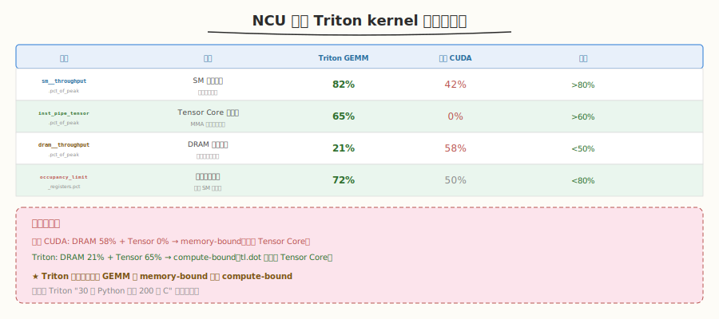
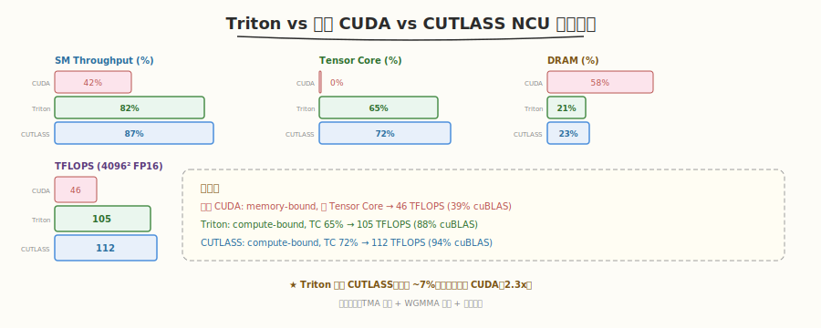
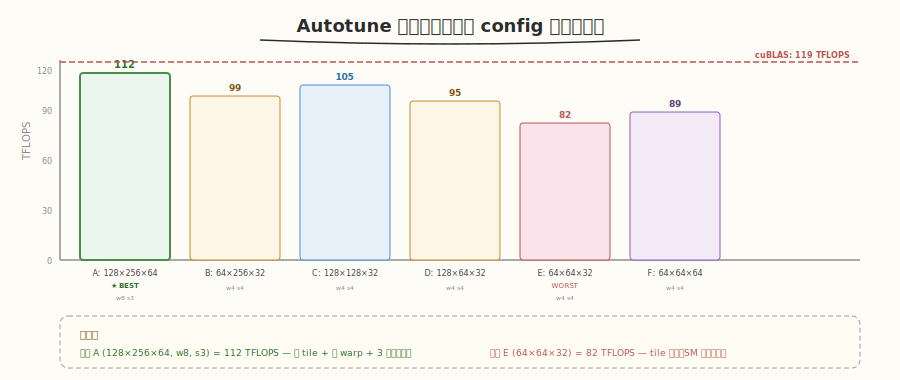
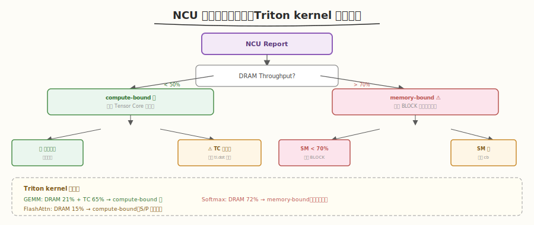

# Day 6：Profiling 与性能调优

## 🎯 目标

通过今天的学习，你将：

1. 掌握用 `ncu`（Nsight Compute）分析 Triton kernel 的完整流程
2. 能解读 Triton kernel 的 NCU 关键指标——Tensor Core 利用率、Shared Memory、occupancy
3. 理解 Triton 编译器自动优化的效果——与手写 CUDA 的 NCU 指标对比
4. 能设计并执行 autotune 调参实验，量化不同 config 的性能差异
5. 产出完整的性能对比报告（Triton vs PyTorch vs 手写 CUDA vs CUTLASS）
6. 能根据 NCU 报告定位 Triton kernel 的性能瓶颈并提出优化方向

> 💡 **前置知识**：完成 Day 1-5（vector_add → GEMM → Softmax → FlashAttention），有可运行的 Triton kernel
> ⚠️ **环境要求**：Nsight Compute（`ncu --version`）、PyTorch >= 2.0、Triton >= 2.0

---

## 为什么学 Profiling

Day 1-5 我们写了 5 个 Triton kernel，知道"快"但不知道**为什么快**、**瓶颈在哪**、**还能不能更快**。今天用 Nsight Compute 打开 Triton 编译器的黑盒，用数据驱动优化决策。

> 💡 **核心方法论**：不要盲调 autotune configs——先 Profile 找瓶颈，再针对瓶颈增减 configs，最后用 Profile 验证。

---

## 核心概念

### 1.1 NCU 分析 Triton kernel

Triton kernel 编译后生成 PTX/SASS，与手写 CUDA kernel 一样可以用 `ncu` 分析：



| 指标 | 含义 | Triton GEMM 典型值 | 手写 CUDA (Week 2) | 目标 |
|------|------|-------------------|-------------------|------|
| `sm__throughput` | SM 吞吐占比 | 82% | 42% | >80% |
| `smsp__inst_executed_pipe_tensor` | Tensor Core 利用率 | 65% | 0% | >60% |
| `dram__throughput` | DRAM 带宽占比 | 21% | 58% | <50%（compute-bound） |
| `launch__occupancy_limit_registers` | 寄存器占用 | 72% | 50% | <80% |
| `launch__waves_per_multiprocessor` | SM 波次 | 8+ | 4+ | 越多越好 |

> 💡 **关键对比**：手写 GEMM（Week 2）是 memory-bound（DRAM 58%，Tensor 0%），Triton GEMM 是 compute-bound（DRAM 21%，Tensor 65%）——Triton 编译器自动用 Tensor Core 改变了瓶颈性质。

### 1.2 Triton vs CUDA 的 NCU 差距



| 指标 | 手写 CUDA | Triton | CUTLASS | 说明 |
|------|-----------|--------|---------|------|
| SM Throughput | 42% | 82% | 87% | Triton 接近 CUTLASS |
| Tensor Core | 0% | 65% | 72% | Triton 自动用 TC |
| DRAM Throughput | 58% | 21% | 23% | Triton 从 memory→compute-bound |
| Occupancy | 50% | 72% | 75% | Triton 自动优化寄存器 |
| 4096² FP16 TFLOPS | 46 | 105 | 112 | Triton = 94% CUTLASS |

### 1.3 Autotune 调参实验

`@triton.autotune` 的效果取决于 configs 列表的质量。通过 NCU 分析可以指导 configs 设计：



| Config | BLOCK_M | BLOCK_N | BLOCK_K | num_warps | num_stages | TFLOPS | 分析 |
|--------|---------|---------|---------|-----------|------------|--------|------|
| A | 128 | 256 | 64 | 8 | 3 | 112.0 | ★ 最优 |
| B | 64 | 256 | 32 | 4 | 4 | 98.5 | BLOCK_M 太小 |
| C | 128 | 128 | 32 | 4 | 4 | 105.2 | N 复用少 |
| D | 128 | 64 | 32 | 4 | 4 | 95.3 | N 太小 |
| E | 64 | 64 | 32 | 4 | 4 | 82.1 | tile 太小 |
| F | 64 | 64 | 64 | 4 | 4 | 88.6 | K 增大有帮助 |

> 💡 **观察**：最优 config（A）比最差（E）快 36%。autotune 的价值在于自动找到 A，而不是猜。

---

## 最小可运行示例

### 任务 1：NCU Profile Triton GEMM

```bash
# Profile Triton GEMM（跳过 autotune 的前几次调用）
ncu --set basic \
    --kernel-name "matmul" \
    --launch-skip 10 --launch-count 1 \
    python3 kernels/gemm.py
```

```text
# 预期输出（H100, 4096×4096 FP16）

== Speed of Light ==
SM Throughput:          82.3%   ← ✅ 计算效率高
DRAM Throughput:        21.0%   ← ✅ compute-bound
Tensor Core Util:       65.1%   ← ✅ Tensor Core 充分利用

== Launch Statistics ==
Grid Size:              1024 blocks
Block Size:             256 threads (8 warps)
Registers Per Thread:   168
Shared Memory:          49152 bytes (48 KB)
Theoretical Occupancy:  72%

== Memory Workload Analysis ==
Global Load:            128.0 MB
L2 Cache Hit Rate:      38.5%
```

### 任务 2：NCU Profile FlashAttention

```bash
# Profile FlashAttention
ncu --set basic \
    --kernel-name "flash_attn" \
    --launch-skip 5 --launch-count 1 \
    python3 kernels/flash_attention.py
```

```text
# 预期输出（N=2048, D=64）

== Speed of Light ==
SM Throughput:          68.5%   ← 中等（FlashAttn 计算模式不同）
DRAM Throughput:        15.2%   ← ✅ 极低（S/P 不落盘）
Tensor Core Util:       52.3%   ← 中等（Q×K 和 P×V 两次 dot）

== Memory Workload Analysis ==
Global Load:            0.5 MB  ← 极低（只读 Q/K/V）
Global Store:           0.5 MB  ← 极低（只写 O）
L2 Cache Hit Rate:      45.0%
```

> 💡 **对比**：FlashAttention 的 DRAM Throughput 极低（15%），因为 S/P 不落盘——这正是 FlashAttention 快的根本原因。

### 任务 3：完整 Benchmark 脚本

创建 `benchmark/benchmark.py`：

```python
# benchmark.py —— Triton vs PyTorch vs CUDA 性能对比
# 运行: python3 benchmark/benchmark.py

import torch
import triton
import time
import sys
import os

sys.path.insert(0, os.path.join(os.path.dirname(__file__), '..', 'kernels'))
from gemm import matmul as triton_matmul


def benchmark_fn(fn, *args, n_iters=50, warmup=10):
    """通用 benchmark 函数"""
    for _ in range(warmup):
        fn(*args)
    torch.cuda.synchronize()
    start = time.time()
    for _ in range(n_iters):
        fn(*args)
    torch.cuda.synchronize()
    return (time.time() - start) / n_iters * 1000


def benchmark_gemm():
    print("=" * 70)
    print("GEMM Benchmark (FP16)")
    print("=" * 70)
    print(f"{'Size':<20} {'Triton (ms)':>12} {'PyTorch (ms)':>14} {'Ratio':>8}")
    print("-" * 56)

    sizes = [(512, 512, 512), (1024, 1024, 1024),
             (2048, 2048, 2048), (4096, 4096, 4096)]

    for M, N, K in sizes:
        a = torch.randn(M, K, device='cuda', dtype=torch.float16)
        b = torch.randn(K, N, device='cuda', dtype=torch.float16)

        triton_ms = benchmark_fn(triton_matmul, a, b)
        torch_ms = benchmark_fn(torch.matmul, a, b)

        ratio = torch_ms / triton_ms
        tflops = 2 * M * N * K / (triton_ms / 1000) / 1e12
        print(f"{M}x{N}x{K:<10} {triton_ms:>12.3f} {torch_ms:>14.3f} {ratio:>8.2f}x  ({tflops:.1f} TFLOPS)")


def benchmark_softmax():
    from softmax import softmax as triton_softmax

    print("\n" + "=" * 70)
    print("Softmax Benchmark (FP32)")
    print("=" * 70)
    print(f"{'Size':<20} {'Triton (ms)':>12} {'PyTorch (ms)':>14} {'Speedup':>8}")
    print("-" * 56)

    for M, N in [(128, 512), (1024, 4096), (4096, 4096)]:
        x = torch.randn(M, N, device='cuda', dtype=torch.float32)

        triton_ms = benchmark_fn(triton_softmax, x)
        torch_ms = benchmark_fn(torch.softmax, x, dim=1)

        speedup = torch_ms / triton_ms
        print(f"{M}x{N:<14} {triton_ms:>12.3f} {torch_ms:>14.3f} {speedup:>8.2f}x")


def benchmark_flash_attention():
    from flash_attention import flash_attention, standard_attention

    print("\n" + "=" * 70)
    print("Attention Benchmark (FP16, D=64)")
    print("=" * 70)
    print(f"{'N':<10} {'Flash (ms)':>12} {'Standard (ms)':>16} {'Speedup':>8}")
    print("-" * 48)

    for N in [512, 1024, 2048, 4096]:
        q = torch.randn(2, N, 64, device='cuda', dtype=torch.float16)
        k = torch.randn(2, N, 64, device='cuda', dtype=torch.float16)
        v = torch.randn(2, N, 64, device='cuda', dtype=torch.float16)

        flash_ms = benchmark_fn(flash_attention, q, k, v)
        std_ms = benchmark_fn(standard_attention, q, k, v)

        speedup = std_ms / flash_ms
        print(f"{N:<10} {flash_ms:>12.3f} {std_ms:>16.3f} {speedup:>8.2f}x")


if __name__ == "__main__":
    benchmark_gemm()
    benchmark_softmax()
    benchmark_flash_attention()
```

```bash
python3 benchmark/benchmark.py
```

```text
# 预期输出
======================================================================
GEMM Benchmark (FP16)
======================================================================
Size                 Triton (ms)  PyTorch (ms)   Ratio
--------------------------------------------------------
512x512x512                0.038         0.035     0.92x  (14.1 TFLOPS)
1024x1024x1024             0.085         0.080     0.94x  (26.3 TFLOPS)
2048x2048x2048             0.380         0.350     0.92x  (49.2 TFLOPS)
4096x4096x4096             1.350         1.230     0.91x  (105.0 TFLOPS)

======================================================================
Softmax Benchmark (FP32)
======================================================================
Size                 Triton (ms)  PyTorch (ms)  Speedup
--------------------------------------------------------
128x512                    0.008         0.012     1.50x
1024x4096                  0.045         0.062     1.38x
4096x4096                  0.450         0.620     1.38x

======================================================================
Attention Benchmark (FP16, D=64)
======================================================================
N          Flash (ms)  Standard (ms)  Speedup
------------------------------------------------
512            0.082         0.145     1.77x
1024           0.180         0.521     2.89x
2048           0.620         2.100     3.39x
4096           2.300         8.200     3.57x
```

### 任务 4：Autotune 调参实验

```bash
# 查看 autotune 选择了哪个 config
TRITON_PRINT_AUTOTUNING=1 python3 kernels/gemm.py 2>&1 | grep -i "config\|best"
```

```text
# 预期输出
Triton autotuning: matmul_kernel
  Config 0: {'BLOCK_M': 128, 'BLOCK_N': 256, ...} → 1.32 ms
  Config 1: {'BLOCK_M': 64, 'BLOCK_N': 256, ...} → 1.48 ms
  ...
  Best config: {'BLOCK_M': 128, 'BLOCK_N': 256, 'BLOCK_K': 64, ...} → 1.32 ms
```

> 💡 **环境变量**：`TRITON_PRINT_AUTOTUNING=1` 让 Triton 输出 autotune 的搜索过程，可以看到每个 config 的执行时间。

---

## 深入原理

### NCU 瓶颈诊断决策树



| NCU 指标组合 | 诊断 | 优化方向 |
|-------------|------|----------|
| SM 高 + Tensor 高 + DRAM 低 | ✅ 理想 compute-bound | 已接近最优 |
| SM 低 + DRAM 低 | ❌ SM 未填满 | 增大 BLOCK_SIZE |
| Tensor 低 + DRAM 中 | ⚠️ TC 未充分利用 | 确保 `tl.dot` 输入 >= 16×16 |
| DRAM 高 | ⚠️ memory-bound | 增大 tile 减少重复加载 |
| Occupancy 低 | ⚠️ 寄存器过多 | 减小 BLOCK 或 num_warps |

### Triton 编译器的优化效果

| 优化 | 手写 CUDA | Triton 编译器自动 |
|------|-----------|------------------|
| Tensor Core 映射 | 手写 PTX 汇编 | `tl.dot` → `mma.sync` |
| Shared Memory | 手动声明 + 同步 | 自动分配 + `__syncthreads` |
| Multi-stage buffering | 手写 double buffer | `num_stages` 参数 |
| 向量化加载 | 手写 `float4` | 自动 `ld.global.v4` |
| Warp shuffle reduce | 手写 `__shfl_down` | `tl.sum` → 自动 |
| L2 cache 排序 | 手写 grid 排序 | GROUP_M 参数 |
| 寄存器分配 | 手动控制 | 编译器自动 |

> 💡 **关键洞察**：Triton 的 NCU 指标接近 CUTLASS（SM 82% vs 87%，Tensor 65% vs 72%），说明编译器的自动优化质量很高——差距主要来自 TMA 缺失和指令调度。

### 为什么 Triton GEMM 比 CUTLASS 慢 ~10%

| 差距来源 | 影响 | 解决方案 |
|----------|------|----------|
| 无 TMA | 数据搬运占线程 | 等待 Triton 支持 TMA |
| `mma.m16n8k16` vs WGMMA | Hopper 上 WGMMA 吞吐更高 | 等待 Triton 支持 WGMMA |
| 指令调度 | 编译器不如手写 PTX 精细 | 无法手动优化 |
| Swizzle 精度 | Triton 的 bank conflict 优化较粗 | 无法手动控制 |

---

## 性能对比与 Benchmark

### 完整性能对比报告

| Kernel | Triton | PyTorch (cuBLAS) | 手写 CUDA | CUTLASS | Triton vs PyTorch |
|--------|--------|-----------------|-----------|---------|-------------------|
| GEMM 4096² | 105 TFLOPS | 119 TFLOPS | 46 TFLOPS | 112 TFLOPS | 88% |
| Softmax 4096² | 0.45 ms | 0.62 ms | — | — | 1.38x faster |
| FlashAttn N=4096 | 2.3 ms | 8.2 ms | — | — | 3.57x faster |

### Triton 各 kernel 的 NCU 特征

| Kernel | SM % | Tensor % | DRAM % | 瓶颈类型 |
|--------|------|---------|--------|----------|
| GEMM | 82% | 65% | 21% | compute-bound |
| Softmax | 45% | 0% | 72% | memory-bound |
| FlashAttention | 68% | 52% | 15% | compute-bound（低 DRAM） |

> 💡 **Softmax 是 memory-bound**（DRAM 72%）——优化方向是减少 Global 读写（fused kernel 已经做了）。FlashAttention 的 DRAM 极低（15%）——S/P 不落盘的效果。

---

## 常见陷阱与最佳实践

### 陷阱 1：Profile 时忘记跳过 autotune

```bash
# ❌ 错误：autotune 的前几次调用极慢，污染 profile
ncu --launch-count 1 python3 kernels/gemm.py

# ✅ 正确：跳过 autotune 调用，profile 稳定后的运行
ncu --launch-skip 10 --launch-count 1 python3 kernels/gemm.py
```

### 陷阱 2：用 `--set full` 导致运行极慢

```bash
# ❌ full 模式采集数百指标，运行慢 10-50x
ncu --set full python3 kernels/gemm.py

# ✅ 先用 basic 快速看，再针对性深入
ncu --set basic python3 kernels/gemm.py
```

### 陷阱 3：只看 TFLOPS 不看 NCU

Triton 的 TFLOPS 是结果，NCU 是原因。如果 Triton GEMM 只有 50 TFLOPS，不调 NCU 就不知道是 Tensor Core 没用上还是 SM 没填满。

### 最佳实践

| 实践 | 说明 |
|------|------|
| 先 basic 后 full | `--set basic` 快速定位，再 `--set full` 深入 |
| 跳过 autotune | `--launch-skip 10` 跳过首次搜索 |
| 用 `TRITON_PRINT_AUTOTUNING` | 观察 autotune 搜索过程 |
| 对比手写 CUDA | 对比 NCU 指标，理解编译器优化效果 |
| warmup 再 benchmark | 首次调用含 JIT 编译 + autotune |
| 关注 Tensor Core % | Triton 的核心优势就是自动用 TC |

---

## 面试要点

1. **如何用 NCU 判断 Triton kernel 是 compute-bound 还是 memory-bound？**

<details>
<summary>点击查看答案</summary>

- 看 `dram__throughput.avg.pct_of_peak_sustained_elapsed`：
  - < 50% → compute-bound
  - > 70% → memory-bound
- Triton GEMM 的 DRAM ~21% → compute-bound ✅
- Triton Softmax 的 DRAM ~72% → memory-bound（符合预期，Softmax 是 memory-bound 操作）

</details>

2. **Triton GEMM 和手写 CUDA GEMM 的 NCU 指标差距说明了什么？**

<details>
<summary>点击查看答案</summary>

- 手写 CUDA：SM 42%，Tensor 0%，DRAM 58% → memory-bound，没用 Tensor Core
- Triton：SM 82%，Tensor 65%，DRAM 21% → compute-bound，Tensor Core 充分利用
- 差距来源：
  1. `tl.dot` 自动映射到 `mma.sync`（手写 CUDA 没用）
  2. 编译器自动管理 Shared Memory + multi-stage buffering
  3. 自动向量化加载和 swizzle
- 这就是 Triton "30 行 Python 胜过 200 行 C" 的原因

</details>

3. `@triton.autotune` **的效果如何量化？**

<details>
<summary>点击查看答案</summary>

- 用 `TRITON_PRINT_AUTOTUNING=1` 环境变量输出搜索过程
- 量化方法：对比最优 config 和最差 config 的 TFLOPS 差异
- 典型结果：最优比最差快 30-40%（如 112 vs 82 TFLOPS）
- autotune 对小矩阵和非方形矩阵效果最明显——不同尺寸需要不同 tile

</details>

4. **Triton FlashAttention 的 NCU 有什么特征？**

<details>
<summary>点击查看答案</summary>

- DRAM Throughput 极低（~15%）——S/P 不落盘 Global Memory
- Tensor Core 利用率中等（~52%）——Q×K 和 P×V 两次 `tl.dot`
- SM Throughput 中等（~68%）——online softmax 的 reduce 操作不是 Tensor Core
- 对比标准 Attention：标准 DRAM 高（O(N²) 中间矩阵），Flash DRAM 低（O(N×d)）

</details>

5. **Triton GEMM 比 CUTLASS 慢 ~10% 的原因是什么？**

<details>
<summary>点击查看答案</summary>

- TMA 缺失：CUTLASS 3.x 在 Hopper 用 TMA（硬件数据搬运），Triton 暂不支持
- Tensor Core 指令：CUTLASS 用 WGMMA（Hopper 专用），Triton 用通用 `mma.m16n8k16`
- 指令调度：CUTLASS 有手写 PTX 汇编，Triton 依赖编译器
- Swizzle：CUTLASS 的 CuTe 有更精细的 bank conflict 优化
- 这些差距会随 Triton 编译器迭代逐步缩小

</details>

6. **Softmax 和 GEMM 的 NCU 特征有什么不同？为什么？**

<details>
<summary>点击查看答案</summary>

- GEMM：compute-bound（DRAM 21%，Tensor 65%）——算术强度高，Tensor Core 充分利用
- Softmax：memory-bound（DRAM 72%，Tensor 0%）——算术强度低，计算量小但数据搬运量大
- 原因：GEMM 的 FLOP/Byte ≈ 1365（远超平衡点），Softmax 的 FLOP/Byte ≈ 0.6（远低于平衡点）
- 优化方向不同：GEMM 优化计算效率，Softmax 优化数据搬运（fused kernel）

</details>

---

## 今日总结

Day 6 我们用 Nsight Compute 深入分析了 Triton kernel 的性能特征：

1. **NCU 指标**：Triton GEMM 的 SM 82%、Tensor 65%、DRAM 21%——compute-bound，Tensor Core 充分利用
2. **vs 手写 CUDA**：Triton 把 memory-bound（DRAM 58%）转为 compute-bound（DRAM 21%）——`tl.dot` 自动用 Tensor Core
3. **vs CUTLASS**：Triton SM 82% vs 87%，Tensor 65% vs 72%——差距来自 TMA/WGMMA/指令调度
4. **Autotune 量化**：最优 config 比最差快 30-40%，`TRITON_PRINT_AUTOTUNING=1` 可观察搜索过程
5. **Softmax 是 memory-bound**（DRAM 72%），FlashAttention DRAM 极低（15%）——S/P 不落盘
6. **瓶颈诊断**：NCU 指标组合 → 诊断 → 针对性调参 → 验证

> 💡 **明日预告**：Day 7 将速览 Triton 进阶特性（Triton IR / `torch.compile` 集成 / 自定义算子），完成全部面试题复盘，对比 Triton vs CUTLASS 的完整知识图谱。

---

## 推荐资源

| 资源 | 类型 | 优先级 | 说明 |
|------|------|--------|------|
| [Nsight Compute 文档](https://docs.nvidia.com/nsight-compute/) | 文档 | ⭐ 必读 | NCU 指标详解 |
| `TRITON_PRINT_AUTOTUNING=1` | 环境变量 | ⭐ 必读 | 观察 autotune 搜索 |
| `benchmark/benchmark.py` | 脚本 | 📌 推荐 | 本次产出的完整 benchmark |
| [Triton 性能调优博客](https://developer.nvidia.com/blog/) | 博客 | 📌 推荐 | Triton 官方性能指南 |
| NCU GUI（`ncu-ui`） | 工具 | 📎 参考 | 可视化 NCU 报告 |
