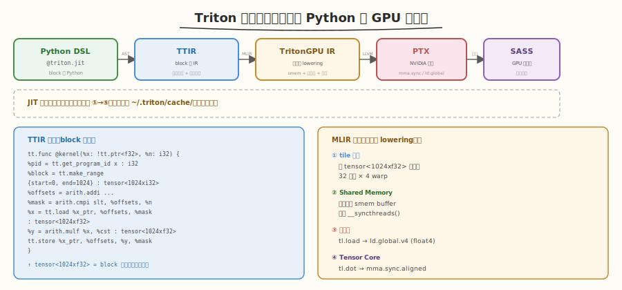
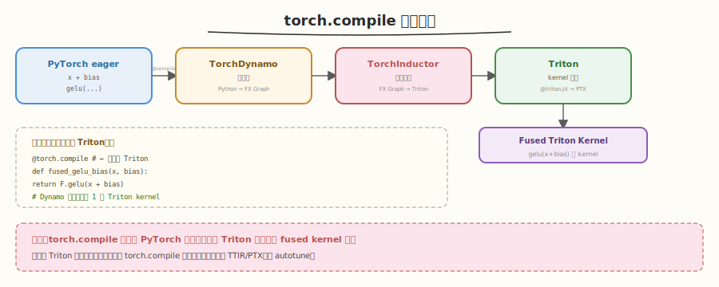
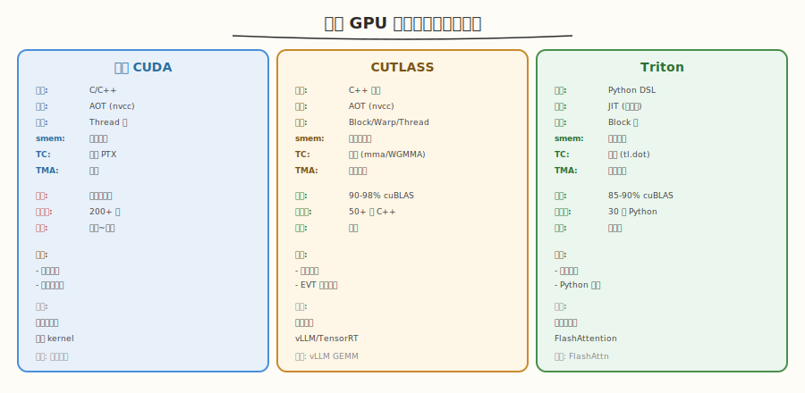
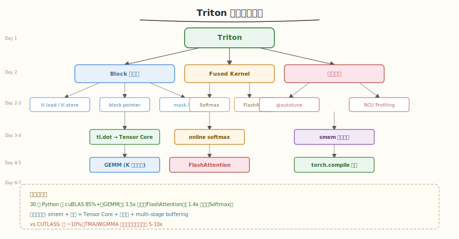

# Day 7：进阶专题与总结

## 🎯 目标

通过今天的学习，你将：

1. 理解 Triton 的编译流程细节——Triton IR → MLIR → LLVM IR → PTX 的完整链路
2. 了解 `torch.compile` 如何底层使用 Triton——PyTorch 2.0+ 的编译器集成
3. 知道如何用 Triton 实现自定义算子并注册到 PyTorch
4. 能完整对比 Triton vs CUTLASS vs 手写 CUDA，知道三者各自适用场景
5. 完成全部 10 道面试题复盘，形成完整的 Triton 知识图谱
6. 明确后续学习方向——从 Triton 到 `torch.compile`、FlashAttention-2/3、vLLM 源码

> 💡 **前置知识**：完成 Day 1-6（vector_add → block pointer → softmax → GEMM → FlashAttention → Profiling）
> ⚠️ **环境要求**：无（今天是概念理解 + 总结，无需编译运行）

---

## 核心概念

### 1.1 Triton 编译流程详解

Day 1 介绍了 Triton 的编译流程，今天深入每个阶段：



| 阶段 | 输入 | 输出 | 关键优化 | 代码量 |
|------|------|------|----------|--------|
| ① Python AST 解析 | `@triton.jit` 函数 | Triton IR (TTIR) | 类型推断、常量传播 | 前端 |
| ② MLIR TritonGPU 方言 | TTIR | TritonGPU IR | tile 分配、smem 分配、向量化 | 编译器核心 |
| ③ LLVM IR 生成 | TritonGPU IR | LLVM IR | 指令选择、寄存器分配 | 后端 |
| ④ PTX 生成 | LLVM IR | PTX | NVIDIA 指令映射 | LLVM NVPTX |
| ⑤ SASS 编译 | PTX | SASS | 驱动 JIT | CUDA 驱动 |

#### TTIR（Triton IR）示例

```python
# 用户代码
@triton.jit
def kernel(x_ptr, n, BLOCK_SIZE: tl.constexpr):
    pid = tl.program_id(0)
    offsets = pid * BLOCK_SIZE + tl.arange(0, BLOCK_SIZE)
    mask = offsets < n
    x = tl.load(x_ptr + offsets, mask=mask)
    tl.store(x_ptr + offsets, x * 2.0, mask=mask)
```

```text
# 对应的 TTIR（简化）
tt.func @kernel(%x_ptr: !tt.ptr<f32>, %n: i32) {
  %pid = tt.get_program_id x : i32
  %offsets = tt.splat %pid : i32
  %block = tt.make_range {start = 0, end = 1024} : tensor<1024xi32>
  %offsets2 = arith.muli %offsets, %c1024 : i32
  %final = arith.addi %offsets2, %block : tensor<1024xi32>
  %mask = arith.cmpi slt, %final, %n : tensor<1024xi1>
  %x = tt.load %x_ptr, %final, %mask : tensor<1024xf32>
  %doubled = arith.mulf %x, %cf32_2 : tensor<1024xf32>
  tt.store %x_ptr, %final, %doubled, %mask : tensor<1024xf32>
}
```

> 💡 **关键洞察**：TTIR 是 block 级的——`tensor<1024xf32>` 表示 1024 个元素的块，不涉及线程。MLIR 阶段才把 block 级操作 lowered 到线程级（分配给 32 个线程 × 32 个 warp 等）。

### 1.2 `torch.compile` 与 Triton

PyTorch 2.0+ 的 `torch.compile` 底层用 Triton 生成 GPU kernel：



```python
# PyTorch 2.0+ 的 torch.compile
import torch

@torch.compile  # ← 自动用 Triton 编译
def fused_gelu_bias(x, bias):
    return torch.nn.functional.gelu(x + bias)

# 等价于手写 Triton kernel，但用户不需要写 @triton.jit
# Dynamo 自动把 PyTorch eager 操作融合为 Triton kernel
```

| 层级 | 职责 | 说明 |
|------|------|------|
| **PyTorch eager** | 用户代码 | `x + bias` → `gelu(...)` |
| **TorchDynamo** | 图捕获 | 把 Python 执行追踪为计算图（FX Graph） |
| **TorchInductor** | 后端编译 | 把 FX Graph 编译为 Triton kernel（GPU）或 C++ 代码（CPU） |
| **Triton** | kernel 生成 | `@triton.jit` → PTX → SASS |

> 💡 **关键**：`torch.compile` 让普通 PyTorch 用户无需手写 Triton 就能获得 fused kernel 的性能——Dynamo 自动把多个 eager 操作融合为一个 Triton kernel。但理解 Triton 原理能帮你调试和优化 `torch.compile` 生成的代码。

### 1.3 自定义 Triton 算子注册

除了 `@triton.jit`，还可以把 Triton kernel 注册为 PyTorch 自定义算子：

```python
import torch
import triton
import triton.language as tl

@triton.jit
def my_kernel(x_ptr, y_ptr, n, BLOCK_SIZE: tl.constexpr):
    # ... kernel 代码 ...

class MyOp(torch.autograd.Function):
    @staticmethod
    def forward(ctx, x):
        y = torch.empty_like(x)
        n = x.numel()
        grid = (triton.cdiv(n, 1024),)
        my_kernel[grid](x, y, n, BLOCK_SIZE=1024)
        return y

    @staticmethod
    def backward(ctx, grad_y):
        # 自定义反向传播（也需要 Triton kernel）
        ...

# 使用
x = torch.randn(1000, device='cuda')
y = MyOp.apply(x)  # 像普通 PyTorch 操作一样使用
```

### 1.4 Triton vs CUTLASS vs 手写 CUDA



| 维度 | 手写 CUDA | CUTLASS | Triton |
|------|-----------|---------|--------|
| **语言** | C/C++ | C++ 模板 | Python DSL |
| **编译** | AOT (nvcc) | AOT (nvcc) | JIT (运行时) |
| **抽象层级** | Thread 级 | Block/Warp/Thread 三层 | Block 级 |
| **Shared Memory** | 完全手动 | 模板半自动 | 完全自动 |
| **Tensor Core** | 手写 PTX | 自动 (mma/WGMMA) | 自动 (tl.dot) |
| **Auto-tuning** | 无 | 编译期 | 运行时 |
| **TMA 支持** | 手动 | 原生 | 暂不支持 |
| **性能** | 取决于优化 | 90-98% cuBLAS | 85-90% cuBLAS |
| **代码量** | 200+ 行 | 50+ 行 C++ | 30 行 Python |
| **开发效率** | 数天~数周 | 数天 | 数小时 |
| **学习曲线** | 陡 | 极陡 | 平缓 |
| **适用人群** | 系统工程师 | 库开发者 | 算法工程师 |
| **代表项目** | 自研 kernel | vLLM/TensorRT | FlashAttention/vLLM |

> 💡 **选择决策树**：
> - 需要快速验证算法 / Python 生态 → **Triton**
> - 需要极致性能 + 复杂 Epilogue → **CUTLASS**
> - 需要完全控制 + 非标准操作 → **手写 CUDA**
> - 不想写 kernel，只要加速 → **`torch.compile`**（底层用 Triton）

---

## 面试要点

### 完整面试题复盘（10 题）

1. **Triton 是什么？它与 CUDA/CUTLASS 的定位有什么区别？**

<details>
<summary>点击查看答案</summary>

- Triton 是 OpenAI 开源的 GPU 编程语言，用 Python 语法写 GPU kernel
- 与 CUDA：CUDA 是 thread 级编程（手动管理 smem/同步），Triton 是 block 级编程（编译器自动管理）
- 与 CUTLASS：CUTLASS 是 C++ 模板（编译期优化），Triton 是 Python DSL（运行时 JIT + autotune）
- 定位：Triton 面向算法工程师（快速实现），CUTLASS 面向库开发者（极致性能），CUDA 面向系统工程师（完全控制）

</details>

2. **Triton 的 block 级编程是什么？与 CUDA thread 级有什么区别？**

<details>
<summary>点击查看答案</summary>

- Block 级编程：Triton 操作"一组元素"（block），用 `tl.arange(0, BLOCK_SIZE)` 一次性表示整个 block 的索引
- CUDA thread 级：每个线程用 `threadIdx` 确定自己处理哪个元素，操作的是标量
- 区别：
  - 索引：CUDA 用 `blockIdx * blockDim + threadIdx`，Triton 用 `pid * BLOCK_SIZE + tl.arange`
  - 加载：CUDA 每线程 `ld.global` 一个元素，Triton `tl.load` 一次加载整个 block
  - 同步：CUDA 手动 `__syncthreads()`，Triton 编译器自动
- Triton 隐藏了"block 内有几个线程、每个线程做什么"——编译器自动分配

</details>

3. **`tl.dot` 做了什么？为什么不用 `*` + `tl.sum`？**

<details>
<summary>点击查看答案</summary>

- `tl.dot(a, b)` 做 block 级矩阵乘法，编译器自动映射到 Tensor Core 的 `mma.sync` 指令
- 不用 `*` + `tl.sum`：
  - `*` 是逐元素乘法，不是矩阵乘法
  - `tl.dot` 内部用 Tensor Core，吞吐远超 FMA（989 TFLOPS vs ~50 TFLOPS）
  - 编译器自动处理 fragment 布局、ldmatrix 指令、累加器管理

</details>

4. **`@triton.autotune` 如何工作？与 CUTLASS 的 auto-tuning 有什么区别？**

<details>
<summary>点击查看答案</summary>

- Triton：运行时首次调用遍历所有 config，测量时间，选最优并缓存。按 `key`（如 M/N/K）缓存不同尺寸的最优配置
- CUTLASS：编译期遍历所有配置组合，选最优编译为二进制，运行时零开销但不可变
- 区别：Triton 运行时搜索（首次慢，灵活），CUTLASS 编译期搜索（编译慢，可预测）

</details>

5. **Fused softmax 为什么比 PyTorch eager 快？**

<details>
<summary>点击查看答案</summary>

- PyTorch eager 拆成 3-5 个 kernel，中间结果（max/exp/sum）落盘 Global Memory → 7 次 Global 读写
- Triton fused 在一个 kernel 中完成，中间结果在 Register 中 → 2 次 Global 读写
- Softmax 是 memory-bound，性能取决于 Global 读写次数 → 减少 3.5x 读写 = 加速 1.3-1.5x

</details>

6. **FlashAttention 的核心思想是什么？为什么用 Triton 实现最合适？**

<details>
<summary>点击查看答案</summary>

- 核心：online softmax + tiling，把 Q×K → softmax → ×V 融合为单 kernel，S/P 不落盘 Global Memory
- IO 复杂度从 O(N²) 降到 O(N²d²/M)
- Triton 最合适的原因：
  - Fused kernel（`@triton.jit` 天然支持）
  - `tl.dot` 自动 Tensor Core（Q×K 和 P×V）
  - `tl.max/exp/sum` 实现 online softmax
  - block 级变量在 Register 中（S/P 不落盘）
  - `@triton.autotune` 搜索 tile 配置

</details>

7. **Triton 的 Shared Memory 是如何管理的？与 CUDA 有什么区别？**

<details>
<summary>点击查看答案</summary>

- Triton：编译器**完全自动**管理——自动分配 smem、插入 `__syncthreads()`、处理 bank conflict
- CUDA：**完全手动**——声明 `__shared__`、手动同步、手动 padding/swizzle
- Triton 的设计哲学："Shared Memory 是编译器的责任，不是程序员的责任"
- 代价：无法手动精细控制 smem 布局（如自定义 swizzle 模式）

</details>

8. **Triton GEMM 比 CUTLASS 慢 ~10% 的原因是什么？**

<details>
<summary>点击查看答案</summary>

- TMA 缺失：CUTLASS 在 Hopper 用 TMA（硬件数据搬运），Triton 暂不支持
- Tensor Core 指令：CUTLASS 用 WGMMA（Hopper 专用），Triton 用通用 mma.m16n8k16
- 指令调度：CUTLASS 有手写 PTX 汇编，Triton 依赖编译器
- Swizzle：CUTLASS 的 CuTe 有更精细的 bank conflict 优化
- 这些差距会随 Triton 编译器迭代逐步缩小

</details>

9. **`torch.compile` 和 Triton 的关系是什么？**

<details>
<summary>点击查看答案</summary>

- `torch.compile`（PyTorch 2.0+）底层用 Triton 生成 GPU kernel
- 流程：PyTorch eager → TorchDynamo 捕获计算图 → TorchInductor 编译为 Triton kernel
- 用户不需要手写 `@triton.jit`——Dynamo 自动把多个 eager 操作融合为 Triton kernel
- 理解 Triton 原理能帮调试 `torch.compile` 生成的代码（如查看生成的 TTIR/PTX）

</details>

10. **如何用 NCU 诊断 Triton kernel 的性能瓶颈？**

<details>
<summary>点击查看答案</summary>

- 看 `dram__throughput`：< 50% → compute-bound；> 70% → memory-bound
- 看 Tensor Core 利用率：compute-bound 时应 > 60%
- 看 `sm__throughput`：< 70% → SM 未填满（增大 BLOCK_SIZE）
- 看 occupancy：低 → 寄存器过多（减小 BLOCK 或 num_warps）
- 用 `TRITON_PRINT_AUTOTUNING=1` 观察 autotune 搜索过程
- 典型：Triton GEMM DRAM 21% + Tensor 65% → compute-bound ✅

</details>

---

## 深入原理

### 本周知识图谱



### 一周学习回顾

| Day | 主题 | 核心概念 | 关键产出 |
|-----|------|----------|----------|
| 1 | 环境搭建 | block 级编程、`tl.load/store`、`mask`、JIT 编译 | `vector_add.py` |
| 2 | Block 编程 | 2D block pointer、`tl.sum/max`、`tl.where`、smem 自动管理 | `matrix_transpose.py`、`reduction.py` |
| 3 | Softmax | 数值稳定、fused kernel、online softmax、`other=-inf` | `softmax.py` |
| 4 | GEMM | `tl.dot`（Tensor Core）、`@triton.autotune`、GROUP_M、`num_stages` | `gemm.py` |
| 5 | FlashAttention | online softmax + tiling、acc rescale、IO 复杂度 | `flash_attention.py` |
| 6 | Profiling | NCU 指标、compute vs memory bound、autotune 量化 | `benchmark.py`、`report.md` |
| 7 | 进阶 + 总结 | Triton IR、`torch.compile`、vs CUTLASS、知识图谱 | 面试复盘 |

### Triton 的设计哲学

| 原则 | 体现 |
|------|------|
| **暴露 block 级，隐藏 thread 级** | `tl.arange` / `tl.load` / `tl.dot` 都是 block 级操作 |
| **编译器做脏活** | smem 分配、同步、向量化、Tensor Core 映射全自动 |
| **Python 优先** | Python 语法 + PyTorch tensor 集成 |
| **运行时调优** | `@triton.autotune` 按尺寸自动选最优配置 |
| **渐进式优化** | 先跑通 → 加 autotune → 调 BLOCK/warps/stages |

---

## 常见陷阱与最佳实践

### 本周所有陷阱汇总

| Day | 陷阱 | 解决方案 |
|-----|------|----------|
| 1 | 忘记 `mask` 导致越界 | 始终用 `mask = offsets < n` |
| 1 | `BLOCK_SIZE` 不是 2 的幂 | 用 `triton.next_power_of_2` |
| 1 | 忘记 warmup | 先调用几次触发 JIT 编译 |
| 2 | block pointer `order` 搞反 | RowMajor 用 `(1,0)` |
| 2 | `tl.trans` 后忘记调整 block_shape | 输出 block_ptr 也要转置 |
| 3 | `other=0.0` 导致 sum 偏大 | 必须用 `other=-inf` |
| 3 | BLOCK_SIZE < n_cols | 用 `next_power_of_2(n_cols)` |
| 3 | online softmax 忘记 rescale | acc 也要乘 `exp(m_old - m_new)` |
| 4 | 忘记 `lambda` grid | autotune 的 BLOCK 运行时才知道 |
| 4 | `tl.dot` 类型不匹配 | `p.to(v.dtype)` |
| 4 | acc 写回忘记 `.to(dtype)` | `acc.to(c_ptr.dtype.element_ty)` |
| 5 | FlashAttn 忘记 rescale acc | `acc = acc * alpha[:, None]` |
| 5 | 忘记乘 scale | `q = q * scale` 在循环外 |
| 6 | Profile 忘记跳过 autotune | `--launch-skip 10` |
| 6 | 用 `--set full` 太慢 | 先 `--set basic` |

### 最佳实践

| 实践 | 说明 |
|------|------|
| 先跑通再优化 | 先用默认 BLOCK_SIZE 确认正确，再 autotune |
| 始终用 mask | 即使 n 是 BLOCK_SIZE 的整数倍也保留 |
| warmup 再 benchmark | 首次含 JIT + autotune |
| 先 basic 后 full | NCU 先快速定位再深入 |
| 对比 PyTorch | 始终与 `torch.*` 对比验证正确性 |
| `TRITON_PRINT_AUTOTUNING` | 观察 autotune 搜索过程 |

---

## 今日总结

Day 7 我们完成了进阶专题速览和全周知识复盘：

1. **Triton 编译流程**：Python AST → TTIR（block 级）→ MLIR（线程级 lowering）→ LLVM IR → PTX → SASS
2. **`torch.compile`**：PyTorch 2.0+ 底层用 Triton，Dynamo 自动融合 eager 操作为 Triton kernel
3. **自定义算子**：`torch.autograd.Function` + `@triton.jit` 注册为 PyTorch 算子
4. **三方对比**：Triton（Python，85% cuBLAS，数小时）vs CUTLASS（C++，94%，数天）vs CUDA（C，取决于优化，数周）
5. **知识图谱**：环境 → block 编程 → softmax → GEMM → FlashAttention → Profiling → 进阶
6. **10 道面试题**：覆盖编程模型、auto-tuning、fused kernel、FlashAttention、smem 管理、性能分析

> 💡 **下一步建议**：
> - **实践方向**：用 `torch.compile` 加速现有 PyTorch 模型，对比手写 Triton 的性能
> - **源码方向**：阅读 [Triton 官方 FlashAttention 实现](https://github.com/triton-lang/triton/blob/main/python/tutorials/06-fused-attention.py)，对比简化版
> - **进阶方向**：学习 FlashAttention-2/3 论文，理解与简化版的差异
> - **生产方向**：阅读 vLLM 的 Triton kernel（如 `paged_attention`），理解生产级用法
> - **专题方向**：回到 CUTLASS 专题对比两种方案，或开始新的专题（如 TensorRT-LLM）

---

## 推荐资源

### Triton 进阶

| 资源 | 类型 | 优先级 | 说明 |
|------|------|--------|------|
| [Triton 官方 tutorials](https://triton-lang.org/main/getting-started/tutorials/index.html) | 官方 | ⭐ 必读 | 完整教程（01-06） |
| [Triton 论文 (2019)](https://www.eecs.harvard.edu/~mdiamond/triton.pdf) | 论文 | ⭐ 必读 | 设计哲学与编译器架构 |
| [torch.compile 文档](https://pytorch.org/docs/stable/generated/torch.compile.html) | 文档 | 📌 推荐 | PyTorch 编译器集成 |
| [FlashAttention 论文](https://arxiv.org/abs/2205.14135) | 论文 | 📌 推荐 | 核心算法 |
| [vLLM Triton kernel](https://github.com/vllm-project/vllm) | 源码 | 📎 参考 | 生产级 Triton 用法 |
| [Triton GitHub Issues](https://github.com/triton-lang/triton/issues) | 社区 | 📎 参考 | 问题排查 |

### 本周全部产出

| 文件 | Day | 说明 |
|------|-----|------|
| `kernels/vector_add.py` | 1 | 入门：向量加法 |
| `kernels/matrix_transpose.py` | 2 | 2D block pointer + tl.trans |
| `kernels/reduction.py` | 2 | block 级 reduce |
| `kernels/softmax.py` | 3 | fused softmax |
| `kernels/gemm.py` | 4 | GEMM + autotune + GROUP_M |
| `kernels/flash_attention.py` | 5 | FlashAttention 简化版 |
| `benchmark/benchmark.py` | 6 | 完整性能对比脚本 |
| `benchmark/report.md` | 6 | 性能报告模板 |
| `day1.md` ~ `day7.md` | 1-7 | 完整教程 |
