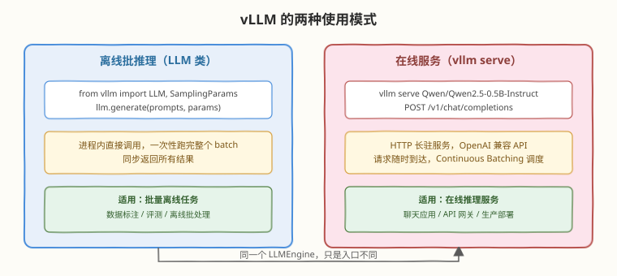
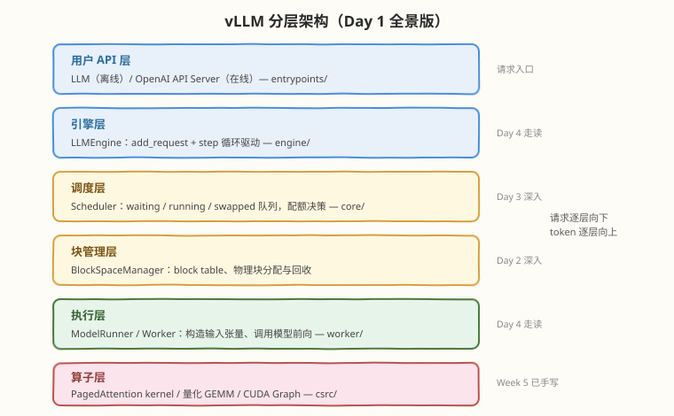

# Day 1：vLLM 快速上手与全景

## 🎯 目标

通过今天的学习，你将：

1. 搭建 vLLM 环境，跑通**离线批推理**（`LLM.generate()`）和**在线服务**（`vllm serve`）两种模式
2. 掌握 `LLM` / `SamplingParams` 两个核心 API 的常用参数
3. 理解三个最常用 Engine Args——`gpu_memory_utilization` / `max_model_len` / `dtype` 的含义与取舍
4. 建立 vLLM 六层架构的全景印象，知道每一层的职责和对应的源码目录
5. 浏览 vLLM 仓库结构，为 Day 4 的源码走读做准备

> 💡 **前置知识**：建议先完成 [Week 5 PagedAttention / Mini 引擎](../../daily/week5/README.md)，知道 KV Cache 是什么、prefill/decode 有什么区别——今天的"全景"会把这些概念落到真实引擎的架构图上
> ⚠️ **环境要求**：Linux + NVIDIA GPU（Compute Capability >= 7.0）、Python >= 3.9、CUDA >= 11.8；本日示例用 0.5B 小模型，显存 >= 2GB 即可跑通

---

## 为什么第一天先建立全景

很多人学 vLLM 的路径是：直接打开 GitHub 仓库 → 几十万行代码 → 劝退。或者反过来：`pip install vllm` → 跑通 demo → 以为会了 → 面试被问"Scheduler 在哪一层"就卡住。

今天的设计是**先用起来、再抬头看全景**：

| 学习方式 | 问题 | 今天的做法 |
|----------|------|------------|
| 直接读源码 | 没有全局地图，淹没在细节里 | 先建立六层架构图，Day 4 再按图走读 |
| 只跑 demo | 知其然不知其所以然 | demo 跑通后立刻追问"请求经过了哪几层" |
| 只看文档 | API 会背，但不知道背后机制 | 每个参数都关联到它影响的架构层 |

> 💡 **一句话总结**：Day 1 的目标不是"学会 vLLM"，而是"拿到一张 vLLM 的地图"——后面 6 天每天的深入，都是在这张地图上标注细节。

---

## 环境搭建

### 安装

```bash
# 建议先创建虚拟环境
python3 -m venv .venv && source .venv/bin/activate

# 安装 vLLM（会自动带上匹配版本的 torch）
pip install vllm
```

### 验证

```bash
# 验证安装与 GPU 可见性
python3 -c "import vllm; print('vllm', vllm.__version__)"
python3 -c "import torch; print('torch', torch.__version__, 'cuda', torch.cuda.is_available())"
```

```text
vllm 0.x.x
torch 2.x.x cuda True
```

### 下载测试模型

本专题统一用 `Qwen/Qwen2.5-0.5B-Instruct` 做示例——0.5B 参数，FP16 权重约 1GB，任何单卡都能跑：

```bash
# 首次运行时 vLLM 会自动从 HuggingFace 下载；也可提前手动下载
huggingface-cli download Qwen/Qwen2.5-0.5B-Instruct
```

> ⚠️ **网络提示**：国内访问 HuggingFace 慢，可设置镜像 `export HF_ENDPOINT=https://hf-mirror.com` 后再运行。

---

## 核心概念

### 1.1 两种使用模式：离线 vs 在线

vLLM 只有一个引擎（`LLMEngine`），但提供两个入口，对应两类完全不同的使用场景：



| 维度 | 离线批推理（`LLM` 类） | 在线服务（`vllm serve`） |
|------|------------------------|--------------------------|
| 入口 | Python 进程内直接调用 | HTTP 长驻服务（OpenAI 兼容 API） |
| 请求模式 | 一次性提交整个 batch，同步等待全部完成 | 请求随时到达，异步处理 |
| 调度 | 内部仍然是 Continuous Batching | Continuous Batching 价值最大化（请求到达时间错开） |
| 流式输出 | 不支持（一次返回全部） | 支持（SSE，`stream=True`） |
| 典型场景 | 数据标注、评测集批量打分、离线数据生成 | 聊天应用、API 服务、生产部署 |

> 💡 **关键认知**：不要以为离线模式就是"for 循环逐条 generate"——`llm.generate(prompts)` 接收的是**列表**，引擎内部会把它们组成 batch 并发处理，吞吐远高于逐条调用。这正是 vLLM 相比 HuggingFace `model.generate()` 的核心优势之一。

### 1.2 核心 API：`LLM` 与 `SamplingParams`

离线模式只涉及两个类：

| 类 | 职责 | 关键参数 |
|----|------|----------|
| `LLM` | 加载模型 + 持有引擎实例 | `model`、`gpu_memory_utilization`、`max_model_len`、`dtype`、`tensor_parallel_size` |
| `SamplingParams` | 控制单个请求的采样行为 | `temperature`、`top_p`、`top_k`、`max_tokens`、`stop`、`n`（每 prompt 采几个样本） |

`SamplingParams` 的采样参数与 HuggingFace 语义一致：

- `temperature=0`：贪心解码（取 argmax），输出确定
- `temperature>0`：温度采样，越大越随机
- `top_p`：核采样，只在累积概率前 p 的 token 中采样
- `max_tokens`：生成上限，**不含** prompt 长度

返回值是 `RequestOutput` 列表，每个元素的结构：

```text
RequestOutput
├── prompt            # 原始输入
├── prompt_token_ids  # prompt 的 token id
└── outputs[]         # CompletionOutput 列表（n>1 时多个）
    ├── text          # 生成的文本
    ├── token_ids     # 生成的 token id
    ├── finish_reason # "stop" / "length"
    └── cumulative_logprob
```

> ⚠️ **注意**：`outputs[0].text` 默认**不含 prompt**，只含新生成的部分——这与某些推理框架的返回习惯不同，拼日志时容易踩坑。

### 1.3 三个最常用 Engine Args

`LLM(...)` 和 `vllm serve` 共享同一套引擎参数（CLI 里下划线变连字符，如 `--gpu-memory-utilization`）。第一天只需要吃透三个：

#### `gpu_memory_utilization`（默认 0.9）

控制 vLLM 预分配多少比例的 GPU 显存。加载权重后，**剩余部分几乎全部划给 KV Cache 池**：

```text
单卡显存 24GB，gpu_memory_utilization=0.9：
├── 模型权重（0.5B × FP16）        ≈ 1 GB
├── 激活/CUDA Graph 等开销         ≈ 1-2 GB
└── KV Cache 池（PagedAttention 管理的物理块）≈ 18-19 GB
```

| 场景 | 建议值 |
|------|--------|
| 独占整卡跑服务 | 0.85-0.95（默认 0.9） |
| 与其他进程共享 GPU | 调低，如 0.5-0.6 |
| 显存紧张的小卡跑大模型 | 先确认权重能放下，再调低给 KV Cache 留多少算多少 |

> 💡 **为什么默认 0.9 这么高？** 因为 KV Cache 池越大，PagedAttention 能容纳的并发请求就越多，吞吐越高。vLLM 的设计假设是"这张卡归我独占"，所以激进预分配。这也意味着：**启动后 `nvidia-smi` 看到显存占满是正常现象**，不是泄漏。

#### `max_model_len`

单请求（prompt + 生成）允许的最大 token 数，默认取模型 config 的 `max_position_embeddings`：

| 设置 | 影响 |
|------|------|
| 调大 | 支持更长上下文，但 KV Cache 池压力增大，极端长序列可能挤占并发容量 |
| 调小 | 限制最大上下文，超长请求直接报错；某些场景下能让调度器做更乐观的决策 |

> ⚠️ **注意**：`max_model_len` 不能超过模型本身的上下文上限（除非配合 RoPE scaling 等外推技术）。把它当成"预算上限"而非"扩容开关"。

#### `dtype`

权重计算精度，默认 `"auto"`（读模型 config，通常 FP16/BF16）：

| 取值 | 说明 |
|------|------|
| `auto` | 跟随模型 config，绝大多数情况用这个 |
| `float16` / `bfloat16` | 显式指定；BF16 数值范围大、训练出身模型常用 |
| `float32` | 基本不用，显存翻倍无收益 |
| `float8` 等 | 属于量化路线，需配合 `quantization` 参数（Day 5） |

### 1.4 vLLM 分层架构全景

这是本周最重要的一张图。vLLM 从顶到底分六层，每一层对应仓库里的一块源码，也对应本周后面几天的一天：



| 层 | 关键类 / 目录 | 职责 | 深入日 |
|----|----------------|------|--------|
| **用户 API 层** | `entrypoints/` | 离线 `LLM` 类、在线 OpenAI Server，接收请求 | Day 1（今天） |
| **引擎层** | `LLMEngine`（`engine/`） | 持有请求队列，驱动 `step()` 循环 | Day 4 |
| **调度层** | `Scheduler`（`core/`） | 每个 step 决定跑哪些请求：waiting/running/swapped | Day 3 |
| **块管理层** | `BlockSpaceManager` | block table 维护、物理块分配回收 | Day 2 |
| **执行层** | `ModelRunner` / `Worker`（`worker/`） | 把调度结果变成输入张量，调用模型前向 | Day 4 |
| **算子层** | `csrc/` + attention backend | PagedAttention kernel、量化 GEMM、CUDA Graph | Week 5 已手写 |

> 💡 **记忆口诀**："入口接请求，引擎跑循环，调度定批次，块管给显存，执行算前向，算子出结果"。

#### 请求生命周期预览（30 秒版）

一次 `llm.generate()` 调用背后发生的事：

1. **API 层**：prompt 经 tokenizer 编码为 token ids，包装成请求交给引擎
2. **引擎层**：`add_request()` 把请求放入 waiting 队列；`step()` 循环开始
3. **调度层**：每个 step，`Scheduler` 按配额（`max_num_seqs`、token 预算）从 waiting 选请求进 running
4. **块管理层**：为选中的请求分配物理 KV block，建立 block table
5. **执行层**：`ModelRunner` 按 block table 构造输入，执行一次前向
6. **算子层**：PagedAttention kernel 读取离散的物理 block 完成注意力计算
7. 采样出一个 token → 回到第 3 步，直到所有请求完成

这个循环就是 **Continuous Batching**：每个 step 结束都重新调度，完成的请求退出、新请求补入——Day 3 会展开。

### 1.5 源码仓库导览

今天不需要读代码，只需要知道"哪层的东西放在哪个目录"：

| 目录 | 内容 | 对应层 |
|------|------|--------|
| `vllm/entrypoints/` | `llm.py`（离线 API）、`openai/`（Server 实现） | 用户 API 层 |
| `vllm/engine/` | `llm_engine.py`（引擎主循环） | 引擎层 |
| `vllm/core/`（或 `vllm/v1/core/`） | Scheduler、Block Manager | 调度层 + 块管理层 |
| `vllm/worker/` | Worker、ModelRunner | 执行层 |
| `vllm/model_executor/` | 各模型实现（llama.py、qwen2.py 等）、量化方法 | 执行层 |
| `vllm/attention/` | Attention backend 抽象与选择 | 算子层 |
| `csrc/` | CUDA/C++ kernel（PagedAttention、量化、RoPE 等） | 算子层 |
| `benchmarks/` | 官方压测脚本 | Day 7 用 |

> ⚠️ **版本提示**：vLLM 正经历 V0 → V1 引擎重构（`vllm/v1/` 目录），调度器与执行器组织方式有变化，不同版本的目录细节以所用版本的代码为准——但"六层"的逻辑分层是稳定的。

---

## 最小可运行示例：离线批推理

```python
# quickstart.py —— vLLM 最小离线推理示例
# 运行: python3 quickstart.py

from vllm import LLM, SamplingParams

prompts = [
    "用一句话解释 PagedAttention：",
    "CUDA 中 shared memory 的作用是",
    "1+1=",
]

# 小显存机器把 gpu_memory_utilization 调低，避免与其他进程冲突
llm = LLM(model="Qwen/Qwen2.5-0.5B-Instruct", gpu_memory_utilization=0.6)

sampling_params = SamplingParams(temperature=0.7, top_p=0.9, max_tokens=64)
outputs = llm.generate(prompts, sampling_params)

for output in outputs:
    print(f"prompt: {output.prompt!r}")
    print(f"generated: {output.outputs[0].text!r}")
    print(f"finish_reason: {output.outputs[0].finish_reason}")
```

```bash
python3 quickstart.py
```

```text
prompt: '用一句话解释 PagedAttention：'
generated: ' PagedAttention 是一种基于注意力机制的分页存储技术...'
finish_reason: stop
prompt: 'CUDA 中 shared memory 的作用是'
generated: ' 在 CUDA 中，shared memory 用于加速数据访问...'
finish_reason: stop
prompt: '1+1='
generated: '2'
finish_reason: stop
```

> 💡 **观察点**：三条 prompt 一次性传入，`generate()` 内部自动组 batch——注意总耗时远小于"逐条生成 × 3"。首次运行会有一次性开销（kernel 编译 / CUDA Graph 捕获），第二次启动明显更快。

---

## Server 模式实战

### 启动服务

```bash
vllm serve Qwen/Qwen2.5-0.5B-Instruct --gpu-memory-utilization 0.6
```

启动日志里值得关注的行：

```text
INFO ... Maximum concurrency for 4096 tokens per request: ~xx.xx
INFO ... Available KV cache memory: xx.xx GiB
INFO ... GPU KV cache size: xxx,xxx tokens
```

这三行直接告诉你：KV Cache 池有多大、能装多少 token、估算的最大并发——Day 2 学完 PagedAttention 后回看，你会知道这些数字就是"物理块数量 × block size"。

### 用 curl 验证（OpenAI 兼容 API）

```bash
# completions 接口
curl http://localhost:8000/v1/completions \
  -H "Content-Type: application/json" \
  -d '{
    "model": "Qwen/Qwen2.5-0.5B-Instruct",
    "prompt": "用一句话解释 Continuous Batching：",
    "max_tokens": 64
  }'

# chat completions 接口（聊天模型推荐用这个）
curl http://localhost:8000/v1/chat/completions \
  -H "Content-Type: application/json" \
  -d '{
    "model": "Qwen/Qwen2.5-0.5B-Instruct",
    "messages": [{"role": "user", "content": "你好"}],
    "max_tokens": 64
  }'
```

### 用 OpenAI Python SDK 调用

vLLM 的 Server 实现了 OpenAI API 协议，所以可以直接用官方 SDK——这意味着**已有的 OpenAI 应用改一行 base_url 就能迁移到自托管 vLLM**：

```python
# server_client.py —— 用 OpenAI SDK 调用 vLLM Server
# 运行: pip install openai && python3 server_client.py

from openai import OpenAI

client = OpenAI(base_url="http://localhost:8000/v1", api_key="EMPTY")

response = client.chat.completions.create(
    model="Qwen/Qwen2.5-0.5B-Instruct",
    messages=[{"role": "user", "content": "PagedAttention 解决了什么问题？"}],
    max_tokens=64,
    stream=False,
)
print(response.choices[0].message.content)
```

> 💡 **面试常考点**："OpenAI 兼容"意味着 `/v1/completions`、`/v1/chat/completions`、（部分版本还有）`/v1/embeddings` 等接口的**请求/响应 schema 与 OpenAI 一致**，包括 `stream=true` 的 SSE 流式返回格式。

---

## 常见陷阱与最佳实践

| 陷阱 | 现象 | 正确做法 |
|------|------|----------|
| 看到显存占满以为泄漏 | `nvidia-smi` 显示 90% 占用 | 正常——`gpu_memory_utilization` 预分配，调低即可 |
| 首次启动慢就中断 | 卡在编译/CUDA Graph 捕获几分钟 | 一次性开销，耐心等待；调试期可加 `enforce_eager=True` 跳过 CUDA Graph |
| `outputs[0].text` 找不到 prompt | 拼接日志时文本对不上 | 返回文本默认不含 prompt，自己拼 |
| 离线模式逐条 `generate([p])` | 吞吐极低 | 把整个列表一次传入，让引擎组 batch |
| 小卡直接拉大模型 | OOM 或 KV Cache 池为 0 | 换小模型 / 量化版本，或调低 `gpu_memory_utilization` 排查 |

> 💡 **最佳实践**：调试期固定 `temperature=0` 让输出可复现；压测前先用小模型跑通全链路，再换目标模型——0.5B 模型的行为与 70B 在架构层面完全一致。

---

## 面试要点

**Q：vLLM 相比 HuggingFace `model.generate()` 为什么快？**
> 三个层面：① **PagedAttention**——KV Cache 分页管理，显存浪费从 60-80% 降到 ~4%，同等显存能容纳 2-4 倍的并发请求；② **Continuous Batching**——iteration 级调度，请求完成即退出、新请求即时补入，GPU 不因等最慢序列而空转；③ **工程优化**——手写 CUDA kernel、CUDA Graph 消除 launch 开销、量化支持。前两个是架构创新，第三个是工程积累。HF `generate()` 是静态 batching + 连续显存预分配，为易用性而非吞吐设计。

**Q：`gpu_memory_utilization=0.9` 是什么意思？显存都被谁占了？**
> vLLM 启动时预分配 90% 的 GPU 显存归自己管理。其中模型权重占一小部分（如 7B FP16 约 14GB），剩余绝大部分划给 **KV Cache 池**——PagedAttention 把池子切成定长物理块按需分配。池子越大，能并发处理的请求越多、吞吐越高。所以启动后显存占满是设计行为，不是泄漏。多进程共享 GPU 时需要调低这个值。

**Q：离线 `LLM` 类和 `vllm serve` 有什么区别？底层是同一个引擎吗？**
> 是同一个 `LLMEngine`，只是入口不同。离线类适合批量任务（评测、数据生成），一次提交整个 prompt 列表，同步返回；Server 是 OpenAI 兼容的 HTTP 服务，请求异步到达、支持流式输出，适合在线应用。两者的调度、KV 管理、kernel 完全相同。

**Q：`max_model_len` 设大会怎样？**
> 它限制单请求 prompt + 生成的总 token 数上限。设大本身不额外占显存（KV block 是按需分配的），但意味着单个请求可能占用更多 KV block——极端长上下文请求多了，会挤占其他请求的块，降低并发。设小则超长请求直接拒绝。默认取模型 config 的上下文上限，一般不用改。

**Q：vLLM 启动日志里的 "GPU KV cache size: xxx tokens" 是什么？**
> KV Cache 池换算成 token 的容量。计算方法：`池显存 ÷ 每 token KV 字节数`，每 token KV 字节数 = $2 \times n_{\text{layers}} \times n_{\text{kv\_heads}} \times d_{\text{head}} \times$ dtype 字节数。这个数除以平均序列长度，大致就是能同时容纳的请求数上限。

---

## 今日小结

| 收获 | 具体内容 |
|------|----------|
| 两种模式 | 离线 `LLM.generate()`（批量、同步）vs `vllm serve`（在线、流式、OpenAI 兼容），同一个引擎 |
| 核心 API | `LLM`（引擎参数）+ `SamplingParams`（采样参数）；返回 `RequestOutput`，文本默认不含 prompt |
| 三个关键参数 | `gpu_memory_utilization`（KV 池大小）、`max_model_len`（单请求上限）、`dtype`（精度） |
| 架构全景 | 六层：API → 引擎 → 调度 → 块管理 → 执行 → 算子；每层对应源码目录 |
| 仓库地图 | `entrypoints/` `engine/` `core/` `worker/` `model_executor/` `attention/` `csrc/` |

**自测清单**（能答出才算过关）：

- [ ] 不看笔记画出六层架构，说出每层一个关键类
- [ ] 解释为什么启动后显存占满是正常的
- [ ] 说出离线模式和 Server 模式各自适合的场景
- [ ] 用一行 curl 验证本地 vLLM 服务

---

> 📌 **明日预告**：Day 2 深入六层中最具创新性的一层——块管理层。我们会精读 PagedAttention 的论文设计，画出 logical block → block table → physical block 的完整映射，并找到你在 [Week 5 Day 4](../../daily/week5/day4/README.md) 手写的 kernel 在 vLLM 源码（`csrc/`）中的工业版实现。
