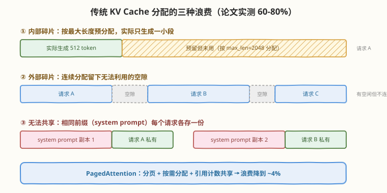
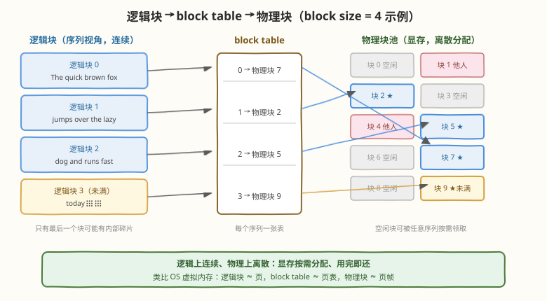
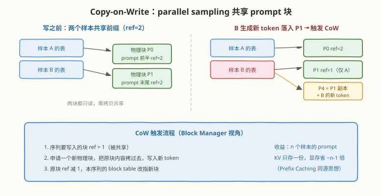

# Day 2：PagedAttention 原理——KV Cache 的分页管理

## 🎯 目标

通过今天的学习，你将：

1. 定量算清 KV Cache 的显存占用，理解它为什么是 LLM 推理的核心瓶颈
2. 说出传统 KV Cache 管理的三种浪费（内部碎片 / 外部碎片 / 无法共享）及其成因
3. 掌握 PagedAttention 的分页设计：逻辑块、物理块、block table、按需分配
4. 理解 PagedAttention kernel 如何在**物理离散**的 KV Cache 上完成注意力计算，且数学结果与连续存储完全等价
5. 掌握块共享与 Copy-on-Write 机制，理解 parallel sampling / beam search / 前缀共享为什么省显存
6. 能在 vLLM 源码中定位块管理与 PagedAttention kernel 的位置

> 💡 **前置知识**：[Week 5 Day 4 手写 PagedAttention kernel](../../daily/week5/day4/README.md)（有手写版做对照，今天会轻松很多）；[vLLM 论文精读](../../paper/vllm/README.md)（今天对应论文 §3-§4）
> ⚠️ **环境要求**：无新增依赖；示例脚本纯 Python 可跑

---

## 为什么 PagedAttention 是 vLLM 的灵魂

vLLM 论文（SOSP 2023）的题目就叫 *"Efficient Memory Management for Large Language Model Serving with PagedAttention"*——整篇论文只讲一件事：**KV Cache 的显存管理**。因为在高并发 serving 场景下，决定吞吐上限的不是算力，而是"显存里能同时塞下多少条序列的 KV Cache"。

| 视角 | 没有 PagedAttention | 有 PagedAttention |
|------|---------------------|-------------------|
| 显存利用率 | 60-80% 被浪费（预留不用、碎片、重复前缀） | 浪费 < 4% |
| 同等显存并发数 | 基线 | 提升 2-4 倍 |
| 吞吐（论文报告） | 基线 | 比 HF 高至 24×，比 TGI 高至 3.5× |
| 前缀共享 | 每个请求各存一份 | 引用计数共享 + CoW |

> 💡 **一句话总结**：PagedAttention 没有改变 attention 的数学，它改变的是 KV Cache 的**存储布局与分配方式**——把 OS 虚拟内存的思想搬进了 GPU 显存。

---

## 核心概念

### 2.1 回顾：KV Cache 有多大

Decode 阶段每生成一个 token，都要把该 token 在每层的 K、V 追加进缓存。每 token 的 KV 字节数：

$$\text{bytes/token} = 2 \times n_{\text{layers}} \times n_{\text{kv\_heads}} \times d_{\text{head}} \times \text{dtype 字节数}$$

以 LLaMA-7B（32 层、32 KV head、$d_{\text{head}}=128$、FP16）为例：

```text
2 × 32 × 32 × 128 × 2B = 512 KB / token
一条 2048 token 的序列 ≈ 1 GB
并发 32 条 ≈ 32 GB —— 超过一张 A100-40G 除掉权重后的全部余量
```

> ⚠️ **GQA 的收益就在这里**：LLaMA-2-70B 用 8 个 KV head（而非 64 个），每 token KV 直接除以 8。KV Cache 大小是推理时代际架构（MHA → GQA → MLA）演化的主要驱动力。

### 2.2 传统管理的三种浪费

PagedAttention 之前，框架为每个请求**按最大长度预留一块连续显存**（FasterTransformer、早期 TGI 的做法）。论文实测这种方案有 60-80% 的显存被浪费，来源有三：



| 浪费类型 | 成因 | 类比 |
|----------|------|------|
| **内部碎片** | 按 `max_len=2048` 预留，实际只生成 512，剩余 75% 永远闲置 | 酒店按"最长可能住 30 天"预收房费，实际住 3 天 |
| **外部碎片** | 各请求预留块大小不一、释放时间不同，空闲显存碎成无法利用的缝隙 | 停车场车位之间夹着停不进车的空档 |
| **无法共享** | 相同 system prompt、parallel sampling 的公共前缀，每个请求各存一份 | 同一本教材全班每人买一本，而不是共用 |

> 💡 **关键观察**：这三种浪费有一个共同根源——**分配粒度是"整条序列"且要求物理连续**。PagedAttention 的解法就是把粒度切小、解除连续性要求。

### 2.3 分页设计：逻辑块、物理块、block table

PagedAttention 把每个序列的 KV Cache 切成定长的**逻辑块**（block，默认 16 token），通过 **block table** 映射到显存池中的**物理块**——逻辑上连续，物理上离散：



与 OS 虚拟内存的对照：

| OS 虚拟内存 | PagedAttention | 说明 |
|-------------|----------------|------|
| 页（page） | 逻辑块（logical block） | 序列视角的定长切片，编号 0,1,2,... |
| 页表（page table） | block table | 每个序列一张，逻辑块号 → 物理块号 |
| 页帧（page frame） | 物理块（physical block） | 显存池中的定长槽位，全局共享、按需领取 |
| 按需调页 | 按需分配 | 生成到新块才分配，不再按 max_len 预留 |
| 写时复制（fork 共享页） | CoW（采样共享前缀） | ref > 1 的块被写入时先复制 |

**浪费率为什么降到 ~4%**：按需分配消除了"预留不用"，离散分配消除了外部碎片，唯一的剩余浪费是**每个序列最后一个未满块**的内部碎片。假设平均序列 1000+ token、块 16 token，最后一个块平均浪费 8 token，占比 < 1%；论文在各种负载下实测总浪费 < 4%。

#### block size 的取舍

| block size | 优点 | 缺点 |
|------------|------|------|
| 大（如 32/64） | block table 短、寻址开销小、kernel 内连续段长 | 最后一个块内部碎片变大，共享粒度变粗 |
| 小（如 8） | 碎片小、共享粒度细 | block table 长、元数据与寻址开销大 |

默认 16 是论文与工程实测的 sweet spot。物理块的字节数 = `block_size × bytes/token`，LLaMA-7B FP16 即 $16 \times 512\text{KB} = 8\text{MB}$。

### 2.4 PagedAttention kernel：离散的 KV 怎么算注意力

存储离散化后，attention kernel 不能再假设 K/V 是连续数组。PagedAttention kernel 的做法：

1. 每个线程块负责一个序列的一个 attention head
2. 通过该序列的 **block table 间接寻址**：第 $i$ 个逻辑块 → 物理块号 → 显存地址
3. 逐块读取 K，计算 $q \cdot k$，用 **online softmax** 跨块累加（正是 [Week 5 Day 4](../../daily/week5/day4/README.md) 手写版的结构）
4. 最后逐块读 V 加权求和

> 💡 **数学等价性**：PagedAttention 改变的只是"去哪里取数"，取到的数与连续存储**完全相同**。注意力结果与标准实现 bit 级一致——它是纯系统优化，不是近似算法。

kernel 针对 block size 模板化编译（block size 是编译期常量），K 的块内布局还做了向量化重排以利用显存带宽。这也解释了为什么 decode 的 attention 能接近 memory-bound 的理论下限。

### 2.5 块共享与 Copy-on-Write

分页带来的第二个红利：**块是天然的共享单元**。Block Manager 给每个物理块维护引用计数（ref count）：



| 场景 | 共享内容 | 收益 |
|------|----------|------|
| **Parallel sampling**（`n=4`） | 同一 prompt 的 4 个样本共享 prompt 全部块 | prompt KV 只存 1 份而非 4 份 |
| **Beam search** | 同一 beam 源的候选共享历史块 | beam 宽度越大省得越多 |
| **共享前缀 / 多轮对话** | 相同 system prompt 的请求共享前缀块 | Prefix Caching 的基础（Day 5） |

**CoW 触发时机**：共享块只读时零拷贝；当某序列要继续生成、新 token 需要写入一个 ref > 1 的块时——申请新物理块、拷贝原块内容、写入新 token、原块 ref 减 1、block table 改指新块。只有"最后一个未满的共享块"会被复制，已写满的共享块永远只读。

### 2.6 在源码中的位置

| 机制 | 源码位置（V0 / V1） | 对应概念 |
|------|---------------------|----------|
| 物理块池、ref count、分配回收 | `vllm/core/block_manager.py` / `vllm/v1/core/block_pool.py` + `kv_cache_manager.py` | §2.3、§2.5 |
| block table 维护 | `vllm/core/block/block_table.py` / V1 由 kv_cache_manager 内嵌 | §2.3 |
| PagedAttention CUDA kernel | `csrc/attention/attention_kernels.cu`（`paged_attention_v1/v2`） | §2.4 |
| Attention backend 抽象（V1） | `vllm/v1/attention/backends/`（FlashAttention / FlashInfer / Triton 均支持 paged KV） | §2.4 |
| KV Cache 显存规划与 profiling | `vllm/worker/` 中的 cache engine / V1 `kv_cache_utils` | §2.1 |

> ⚠️ **版本提示**：V1 引擎把"块管理"重构为 `kv_cache_manager`（统一支持 full attention / sliding window / Mamba 等不同 KV 布局），接口与 V0 的 `BlockSpaceManager` 不同，但"逻辑块-block table-物理块"的核心模型完全一致。Day 4 走读时以你安装版本的代码为准。

---

## 最小可运行示例：block table 模拟器

用一个 60 行的纯 Python 脚本模拟 Block Manager 的核心逻辑（按需分配、追加 token、CoW、释放），把今天的概念跑成代码：

```python
# block_table_sim.py —— PagedAttention 块管理模拟器
# 运行: python3 block_table_sim.py

BLOCK_SIZE = 4  # 教学用小块；vLLM 默认 16

class BlockManager:
    def __init__(self, num_blocks):
        self.free = list(range(num_blocks))   # 空闲物理块
        self.ref = {}                          # 物理块 -> 引用计数
        self.data = {}                         # 物理块 -> token 列表

    def alloc(self):
        assert self.free, "显存池耗尽（触发抢占，Day 3 主题）"
        b = self.free.pop(0)
        self.ref[b] = 1
        self.data[b] = []
        return b

class Sequence:
    def __init__(self, mgr, tokens):
        self.mgr = mgr
        self.table = []                        # block table：逻辑块 -> 物理块
        for t in tokens:
            self.append(t)

    def append(self, token):
        if not self.table or len(self.mgr.data[self.table[-1]]) == BLOCK_SIZE:
            self.table.append(self.mgr.alloc())
        self.mgr.data[self.table[-1]].append(token)

    def fork(self):
        """parallel sampling：共享现有全部块（ref +1）"""
        child = Sequence.__new__(Sequence)
        child.mgr, child.table = self.mgr, list(self.table)
        for b in child.table:
            self.mgr.ref[b] += 1
        return child

    def append_cow(self, token):
        """写入共享块时触发 Copy-on-Write"""
        last = self.table[-1]
        if self.mgr.ref[last] > 1:
            self.mgr.ref[last] -= 1
            new = self.mgr.alloc()
            self.mgr.data[new] = list(self.mgr.data[last])
            self.table[-1] = new
            print(f"  CoW: 物理块 {last} -> 复制为 {new}")
        self.append(token)

mgr = BlockManager(num_blocks=8)
a = Sequence(mgr, list("The quick brown fox jumps".split()))  # 5 token
print(f"A 生成 5 token, block table = {a.table}, P1 内容 = {mgr.data[1]}")

b = a.fork()  # 样本 B 共享 A 的前缀
print(f"B fork 后, P1 ref = {mgr.ref[1]}（共享，零拷贝）")

b.append_cow("over")  # B 继续生成，触发 CoW
print(f"CoW 后: A.table = {a.table}, B.table = {b.table}")
print(f"P1 ref = {mgr.ref[1]}, P2 内容 = {mgr.data[2]}")
```

```bash
python3 block_table_sim.py
```

```text
A 生成 5 token, block table = [0, 1], P1 内容 = ['jumps']
B fork 后, P1 ref = 2（共享，零拷贝）
  CoW: 物理块 1 -> 复制为 2
CoW 后: A.table = [0, 1], B.table = [0, 2]
P1 ref = 1, P2 内容 = ['jumps', 'over']
```

> 💡 **对照点**：`fork()` 对应 `SamplingParams(n=2)` 时 vLLM 的真实行为——prompt 块 ref +1；`append_cow()` 对应样本各自生成时的 CoW。真实的 Block Manager 还多了交换（swap）、抢占、前缀哈希（Prefix Caching）等逻辑，但骨架就是这个。

---

## 定量分析：显存数字算一遍

以 LLaMA-7B FP16、单卡 A100-40G、`gpu_memory_utilization=0.9` 为例：

```text
显存总预算                40 GB × 0.9 = 36 GB
模型权重                  ≈ 14 GB
激活 / CUDA Graph 等开销  ≈ 2 GB
KV Cache 池               ≈ 20 GB

每 token KV = 512 KB，每物理块（16 token）= 8 MB
物理块总数 ≈ 20 GB / 8 MB ≈ 2500 块 ≈ 40,000 token 容量
```

| 方案 | 一条 2048-token 序列的显存成本 | 同池可容纳序列数 |
|------|--------------------------------|------------------|
| 传统预留（max_len=4096） | 2 GB（不管实际生成多少） | ~10 条 |
| PagedAttention（实际 2048） | 1 GB + 未满块碎片 | ~20 条 |
| PagedAttention + n=4 采样共享 prompt（prompt 1024） | 1×prompt + 4×生成部分 | prompt 成本 ÷ 4 |

这解释了 Day 1 启动日志里那行 `GPU KV cache size: xxx,xxx tokens`——它就是"物理块数 × block size"，直接决定最大并发。

---

## 常见陷阱与最佳实践

| 陷阱 | 说明 | 正确认知 |
|------|------|----------|
| 以为 PagedAttention 是近似算法 | 看到"分页"以为牺牲了精度 | 纯存储布局优化，数学结果与连续存储 bit 级一致 |
| block size 越小越好 | 小粒度碎片少 | 块表变长、kernel 寻址与元数据开销增大，默认 16 是平衡点 |
| 共享块随时会被复制 | 担心共享带来频繁拷贝 | 只有"最后一个未满共享块"触发 CoW，写满块永远只读 |
| KV 池越大越好就拉满 0.99 | 忘记激活值/CUDA graph 也要显存 | 留有余量，OOM 多发生在长序列峰值激活 |
| 把 block table 当成全局一张 | 混淆逻辑/物理视图 | 每个序列一张 block table；全局共享的是物理块池 |

---

## 面试要点

**Q：PagedAttention 的核心思想是什么？和 OS 虚拟内存有什么异同？**
> 核心是把 KV Cache 从"按序列连续预留"改为"定长块 + 页表映射 + 按需分配"。与 OS 分页相同点：逻辑连续物理离散、按需分配、引用计数 + CoW 共享。不同点：① KV 块只追加写、无随机写，管理更简单 ② 换出目标是 CPU 内存（swap）或重算（recompute），不是磁盘 ③ 块内布局为 kernel 访存做了向量化重排，是软硬件协同设计。

**Q：为什么说 PagedAttention 把浪费降到 4% 以下？**
> 三种浪费逐一消除：内部碎片——按需分配，不再预留 max_len，只剩最后一个未满块（平均半个块，16 token 块对上千 token 序列占比 <1%）；外部碎片——物理块定长且全局共享，任何空闲块都能给任何序列用，不存在"不连续空隙"；重复前缀——引用计数共享 + CoW，prompt 只存一份。论文在真实负载 trace 上实测总浪费 < 4%。

**Q：PagedAttention 会改变 attention 的计算结果吗？**
> 不会。它只改变 K/V 的存储位置和寻址方式，kernel 通过 block table 间接取到的数值与连续存储完全相同，数学上是严格等价的系统层优化。面试时可以补一句：这也是它能无侵入接入任意模型的原因——模型本身完全不知道 KV 是分页存的。

**Q：block size 为什么默认 16？太大太小各有什么问题？**
> 块大：页表短、寻址开销小、kernel 连续访存段长，但末块内部碎片大、共享粒度粗（共享一段不想要的尾巴也得整块共享）；块小：碎片小、共享细，但页表长、元数据和间接寻址开销大，kernel 难以向量化。16 是论文与工程实测的平衡点，且作为编译期常量模板化进 kernel。

**Q：Parallel sampling（n=4）时 vLLM 怎么省显存？**
> 4 个样本共享同一份 prompt 的 KV 物理块（引用计数 = 4），各自生成阶段：写入最后一个未满共享块时触发 CoW，复制该块后各写各的；已写满的 prompt 块永远只读零拷贝。prompt 越长省得越多——prompt 1000 token 时，4 样本省掉的显存接近 3 份完整 prompt KV。

**Q：Decode 阶段的 attention 为什么能接近显存带宽下限？**
> Decode 每步只算 1 个 token 的 q，但要读全部历史 K/V——纯 memory-bound，理论耗时 = KV 字节数 ÷ HBM 带宽。PagedAttention kernel 按 block 连续段批量读 K/V、向量化加载、一个线程块负责一个 head 避免跨块同步，实际带宽利用接近硬件上限。这也是为什么 KV 量化（FP8/INT8）能近线性加速 decode——读的字节数直接减半（Day 5）。

**Q：PagedAttention 与 Prefix Caching 是什么关系？**
> Prefix Caching 建立在分页之上：把前缀的 block 内容做哈希，不同请求命中相同前缀块时直接复用物理块（ref +1），连 prefill 计算都省掉。没有分页，前缀共享要求物理连续，几乎不可能实现跨请求复用；有了分页，共享只是 block table 里填同一个物理块号。Day 5 会展开。

---

## 今日小结

| 收获 | 具体内容 |
|------|----------|
| 问题定量 | 每 token KV = $2 \times n_{\text{layers}} \times n_{\text{kv\_heads}} \times d_{\text{head}} \times$ dtype；7B FP16 ≈ 512KB/token |
| 三种浪费 | 内部碎片（预留不用）、外部碎片（不连续空隙）、无法共享（前缀重复），合计 60-80% |
| 分页设计 | 逻辑块（默认 16 token）→ block table → 物理块池；按需分配，浪费 < 4% |
| kernel | block table 间接寻址 + 块内 online softmax，数学严格等价，decode 接近带宽下限 |
| 共享机制 | ref count + CoW：parallel sampling / beam / 前缀共享，只有末块写入才复制 |
| 源码定位 | `core/block_manager.py`（V0）/ `v1/core/kv_cache_manager.py`、`csrc/attention/` |

**自测清单**：

- [ ] 不看笔记画出"逻辑块 → block table → 物理块"映射图，并标出浪费只发生在最后一个块
- [ ] 给定模型配置（层数、KV head、head dim、dtype），口算每 token KV 字节数
- [ ] 讲清 CoW 的触发条件与三步流程
- [ ] 说出 block size 过大/过小各自的代价

---

> 📌 **明日预告**：Day 3 进入调度层。块管理解决了"显存怎么省"，但"每个 step 让哪些请求上 GPU 跑"是另一个问题——Continuous Batching 的三队列状态机、token 预算、以及显存不足时的抢占（recompute vs swap），正是建立在今天的块机制之上：分页让换入换出足够便宜，调度才能足够激进。
