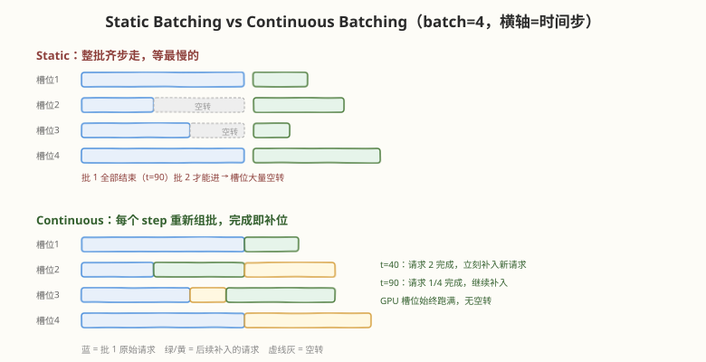
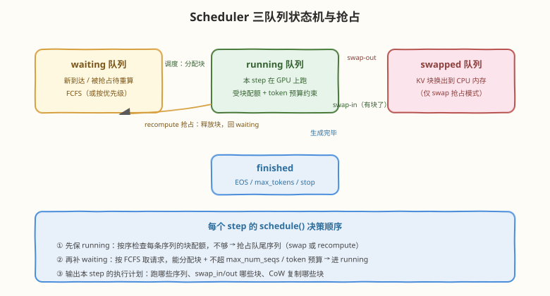

# Day 3：Continuous Batching 与调度器

## 🎯 目标

通过今天的学习，你将：

1. 说清 static batching 的两大浪费（槽位空转、延迟不均），理解 iteration-level scheduling 的破局思路
2. 掌握 vLLM Scheduler 的三队列状态机：waiting / running / swapped
3. 掌握两个核心调度配额：`max_num_seqs`（序列数上限）与 `max_num_batched_tokens`（token 预算）
4. 理解显存不足时的抢占机制，能对比 recompute 与 swap 两种策略的适用场景
5. 会设计调度参数扫描实验，观察吞吐 / TTFT / TPOT 的权衡曲线

> 💡 **前置知识**：Day 2 的块管理机制（调度决策的每一步都落到"能不能分到块"）；[Week 6 Day 2 手写 Continuous Batcher](../../daily/week6/day2/README.md)（教学简化版，今天对照读工业实现）
> ⚠️ **环境要求**：Day 1 的 vLLM 环境；实验部分需要能跑 `vllm serve`

---

## 为什么调度是 vLLM 的第二个核心创新

Day 2 解决了"显存怎么省"，但省下的显存要变成吞吐，还需要回答一个问题：**每个 decoding step，让哪些请求上 GPU 跑？** 这就是调度层的工作。PagedAttention 让"换入换出"足够便宜，调度器才能做得足够激进——两者是配套设计：

| 机制 | 解决什么 | 类比 |
|------|----------|------|
| PagedAttention（Day 2） | 显存利用率：请求能随时进、随时出 | OS 的内存分页 |
| Continuous Batching（今天） | 时间利用率：GPU 每个 step 都不空转 | OS 的时间片调度 |

> 💡 **一句话总结**：PagedAttention 是"空间"维度的优化，Continuous Batching 是"时间"维度的优化——合起来才让吞吐提升一个数量级。

---

## 核心概念

### 3.1 Static Batching 的问题

传统 serving（HF `generate()`、早期 Triton Inference Server）用 static batching：凑够一批请求 → 一起跑 → **整批全部结束**才放下一批。问题在于各请求的生成长度差异巨大：



| 浪费 | 成因 | 后果 |
|------|------|------|
| **槽位空转** | 短请求结束后，它的 batch 槽位陪着最长请求空跑 | GPU 有效利用率常低于 70% |
| **延迟不均** | 新请求必须等上一批最慢的结束才能开始 | 队首阻塞，TTFT 长尾严重 |

### 3.2 Continuous Batching：iteration 级调度

Continuous batching（Orca, OSDI 2022 提出的 iteration-level scheduling）把调度粒度从"一批"细化到"一个 step"：

- 每个 decoding step 结束，完成的请求**立即退出**，释放 KV 块
- waiting 队列中的请求**立即补入**空出的槽位
- GPU 槽位始终跑满，新请求最多等一个 step 就能开始

这个思想来自操作系统：static batching 是"批处理系统"，continuous batching 是"分时系统"。vLLM 把它与 PagedAttention 结合，论文报告在真实负载下吞吐比 HF 高至 24×、比当时的 TGI 高至 3.5×。

### 3.3 三队列状态机

vLLM 的 Scheduler 为每个请求维护三个状态（V0 明确分三个 deque，V1 合并了 swapped 语义但逻辑相同）：



| 状态 | 含义 | 进入条件 | 离开条件 |
|------|------|----------|----------|
| **waiting** | 已到达，尚未分配 KV 块 | 新请求到达；被 recompute 抢占 | 调度器给它分配到块 → running |
| **running** | 持有 KV 块，参与本 step 前向 | 从 waiting 调度进来；swap-in 完成 | 生成完 → finished；块不够被抢占 |
| **swapped** | KV 块被换出到 CPU 内存 | swap 模式抢占 | 有块了换回来 → running |

每个 step 的 `schedule()` 决策顺序（这是读源码时的主线）：

1. **先保 running**：遍历 running 队列，逐条检查"继续生成所需的块够不够"；不够就**抢占队尾**（最后到达的）序列，把它的块让给前面的序列
2. **再补 waiting**：按 FCFS 从 waiting 取请求，同时满足「能分配 prefill 所需块」+「不超 `max_num_seqs`」+「不超 token 预算」才准入
3. **输出执行计划**：本 step 跑哪些序列（含各自是 prefill 还是 decode）、swap_in/out 哪些块、CoW 复制哪些块，交给执行层

> 💡 **为什么抢占队尾？** FCFS 公平性：先来的请求已经跑了一半，沉没成本高；队尾请求刚进来，被抢占的损失最小。这与 OS 的"多级反馈队列"思路相通。

### 3.4 两个核心配额参数

| 参数 | 含义 | 调大 | 调小 |
|------|------|------|------|
| `max_num_seqs` | 单 step 最多并发多少条序列 | 并发高、吞吐潜力大；单请求 TPOT 变差 | 并发低、延迟稳；GPU 可能吃不饱 |
| `max_num_batched_tokens` | 单 step 最多处理多少 token（prefill 按 prompt 长度计） | prefill 大块进、TTFT 短；decode 的 ITL 被拉长 | ITL 平滑；长 prompt 被切片排队（即 Chunked Prefill，Day 5） |

两者的权衡本质是**吞吐 vs 延迟**：

- 吞吐优先（离线批处理）：两个都调大，让 GPU 每个 step 都塞满
- 延迟优先（在线对话）：`max_num_seqs` 按预期并发设，`max_num_batched_tokens` 调小，保证流式输出的 ITL 平滑

> ⚠️ **版本提示**：两个参数的默认值随版本变化较大（V0 与 V1 不同，且 V1 默认开启 chunked prefill 后 token 预算的意义有变化），以所用版本 `vllm serve --help` 和文档为准。

### 3.5 抢占：recompute vs swap

当 running 序列的 KV 块不够分时，调度器必须让一些序列让路。两种策略：

| 策略 | 做法 | 代价 | 适用 |
|------|------|------|------|
| **Recompute**（默认） | 释放该序列全部块，回 waiting；再次调度时重新 prefill | 重新计算 prompt 的算力 | 短 prompt、显存换时间 |
| **Swap** | KV 块整体拷贝到 CPU 内存，之后换回 | PCIe 传输带宽 + CPU 内存 | 长 prompt（重算太贵）、prefix 共享多 |

直觉判断：prefill 是 compute-bound、swap 是 bandwidth-bound——**prompt 越长，重算越贵，swap 越划算**；反之短 prompt 重算几乎免费。vLLM 用 `--preemption-mode`（V1）选择，默认 recompute。

### 3.6 在源码中的位置

| 机制 | 源码位置（V0 / V1） |
|------|---------------------|
| 调度主逻辑 `schedule()` | `vllm/core/scheduler.py` / `vllm/v1/core/sched/scheduler.py` |
| 三队列与状态迁移 | 同上文件中的 `_schedule_prefills` / `_schedule_running`（V0 拆分为多个内部函数） |
| 块配额检查 | 调用 Day 2 的 Block Manager：`can_allocate` / `allocate_slots` |
| 抢占实现 | V0：`_preempt()` + `PreemptionMode`；V1：调度器内直接处理 |
| 执行计划输出 | `SchedulerOutputs`：scheduled 序列、blocks_to_swap_in/out、blocks_to_copy（CoW） |

> 💡 **读码顺序建议**：先找到 `schedule()` 的出口（返回 `SchedulerOutputs`），再倒推"这个计划是怎么算出来的"——比从入口顺读清晰得多。Day 4 会把这条链完整走一遍。

---

## 最小可运行示例：static vs continuous 吞吐对比

用 40 行 Python 模拟两种调度方式，量化"等最慢序列"的代价：

```python
# scheduler_sim.py —— static vs continuous batching 模拟
# 运行: python3 scheduler_sim.py

import random

random.seed(7)

# 12 个请求，输出长度 20~100 token 不等（模拟真实负载的长度差异）
requests = [random.randint(20, 100) for _ in range(12)]
BATCH = 4

def static_batching(lens, batch):
    """整批齐步走：每批耗时 = 批内最长请求"""
    steps = busy = 0
    for i in range(0, len(lens), batch):
        group = lens[i:i + batch]
        steps += max(group)      # 等最慢的
        busy += sum(group)       # 有效计算
    return steps, busy

def continuous_batching(lens, batch):
    """iteration 级调度：完成即退出，waiting 立即补位"""
    running, waiting = list(lens[:batch]), list(lens[batch:])
    steps = busy = 0
    while running:
        running = [l - 1 for l in running]
        busy += len(running)
        steps += 1
        finished = [l for l in running if l <= 0]
        running = [l for l in running if l > 0]
        for _ in finished:                # 完成几个补几个
            if waiting:
                running.append(waiting.pop(0))
    return steps, busy

s_steps, s_busy = static_batching(requests, BATCH)
c_steps, c_busy = continuous_batching(requests, BATCH)
print(f"请求输出长度: {requests}")
print(f"static:     {s_steps} 步, 槽位利用率 {s_busy/(s_steps*BATCH):.1%}")
print(f"continuous: {c_steps} 步, 槽位利用率 {c_busy/(c_steps*BATCH):.1%}")
print(f"总步数减少 {(s_steps-c_steps)/s_steps:.1%} -> 吞吐提升约 {s_steps/c_steps:.2f}x")
```

```bash
python3 scheduler_sim.py
```

```text
请求输出长度: [61, 39, 70, 26, 29, 88, 32, 66, 94, 27, 84, 47]
static:     252 步, 槽位利用率 65.8%
continuous: 198 步, 槽位利用率 83.7%
总步数减少 21.4% -> 吞吐提升约 1.27x
```

> 💡 **观察点**：这个玩具模型只有 12 个请求、batch=4，提升 1.27×；真实负载下请求持续到达、长度差异更大（几十到几千 token），提升可达数倍——可以自己改 `requests` 的分布和 `BATCH` 验证。另外注意 continuous 的"补位"依赖 Day 2 的分页：新请求随时能拿到离散的块，否则"随时补位"只是空话。

---

## 实验：调度参数扫描

用 Day 1 部署的服务做一组对照实验（压测工具用 `vllm bench serve`，老版本仓库内为 `benchmarks/benchmark_serving.py`）：

```bash
# 基准：默认参数
vllm serve Qwen/Qwen2.5-0.5B-Instruct --gpu-memory-utilization 0.6

# 另开终端压测（固定请求分布，变量只有调度参数）
vllm bench serve \
  --model Qwen/Qwen2.5-0.5B-Instruct \
  --dataset-name sharegpt --num-prompts 200 \
  --save-result --result-filename baseline.json
```

扫描设计（每次只改一个变量，重启服务再压）：

| 实验组 | 参数 | 预期观察 |
|--------|------|----------|
| 基准 | 默认 | 记录 TTFT / TPOT / 吞吐基线 |
| A | `--max-num-seqs 32` | 高并发下吞吐下降，TPOT 改善 |
| B | `--max-num-seqs 512` | 吞吐上升但 TPOT 长尾变长 |
| C | `--max-num-batched-tokens 2048` | 长 prompt 被切片，ITL 更平滑，TTFT 略增 |

> 💡 **记录方式**：每组记三个数——**中位 TTFT、P99 TPOT、总吞吐（tok/s）**。画一张"参数 × 三指标"表格，Day 7 的完整压测报告会用到这套方法论。0.5B 模型在消费级显卡上也能跑出明显差异。

---

## 常见陷阱与最佳实践

| 陷阱 | 现象 | 正确做法 |
|------|------|----------|
| 盲目调大 `max_num_seqs` | 吞吐没升，TPOT 爆炸，还频繁抢占 | 并发上限受 KV 池约束，超过承载力的并发只会换来抢占开销 |
| 把 token 预算当"越大越好" | ITL 毛刺，流式输出卡顿 | 在线服务调小预算换平滑 ITL；离线吞吐优先再调大 |
| 生产环境不换压测数据集 | 用均匀长度测出漂亮数字 | 用真实分布（ShareGPT 等），长度差异正是 continuous batching 的红利来源 |
| 忽视抢占日志 | 延迟毛刺找不到原因 | 出现 `Preempted` / 重算日志说明并发超过 KV 池承载，该降 `max_num_seqs` 或加显存 |
| 以为 continuous batching 免费 | 认为调度零开销 | 每个 step 都有调度 + 块管理 CPU 开销，小模型小 batch 时占比可观（CUDA Graph 缓解，Day 5） |

---

## 面试要点

**Q：Continuous Batching 为什么能提升吞吐？**
> Static batching 整批齐步走，短请求结束后槽位陪最长请求空转，且新请求要等整批结束才能进。Continuous batching 把调度粒度细化到每个 decoding step：完成的请求立即退出释放 KV 块，waiting 请求立即补位。GPU 槽位始终跑满、新请求最多等一个 step。它提升的是"时间利用率"，与 PagedAttention 的"空间利用率"互补——分页让随时补位在显存上可行，两者结合论文报告吞吐比 HF 高至 24×。

**Q：vLLM 调度器每个 step 做什么决策？**
> 三步：① 保 running——按序检查每条 running 序列继续生成的块配额，不够则抢占队尾序列回收块；② 补 waiting——按 FCFS 取请求，同时满足块可分配、`max_num_seqs`、token 预算三个约束才准入；③ 生成执行计划（跑哪些序列、swap_in/out、CoW 复制）交给 ModelRunner。核心数据结构是 waiting/running/swapped 三个队列。

**Q：显存不足时 vLLM 怎么办？两种抢占策略怎么选？**
> 抢占（preemption）：让队尾序列让出 KV 块。Recompute（默认）——释放全部块回 waiting，再调度时重新 prefill，代价是算力；Swap——KV 块拷到 CPU 内存之后换回，代价是 PCIe 带宽。选择依据：prefill 是 compute-bound、swap 是 bandwidth-bound，所以 prompt 越长重算越贵、swap 越划算；短 prompt 或显存换时间场景用 recompute。

**Q：`max_num_seqs` 和 `max_num_batched_tokens` 分别约束什么？怎么调？**
> `max_num_seqs` 约束单 step 并发序列数——"多宽"；`max_num_batched_tokens` 约束单 step 处理的总 token 数（prefill 按 prompt 长度计入）——"多重"。吞吐优先（离线）两个都调大；延迟优先（在线流式）`max_num_batched_tokens` 调小让 ITL 平滑（长 prompt 自动切片，即 chunked prefill），`max_num_seqs` 按 SLA 并发设。注意并发超过 KV 池承载只会引发抢占，反而降吞吐。

**Q：Continuous Batching 对 TTFT 和 TPOT 分别有什么影响？**
> TTFT 改善明显：新请求最多等一个 step 就能进 batch（static 下要等整批）。TPOT 在重负载下略增：同 batch 序列多了，单步计算变大；但这是用单请求微小延迟换整体大吞吐的划算交易。长 prompt 直接进 batch 会拉高其他请求的 ITL——这正是 chunked prefill 要解决的问题（Day 5）。

**Q：为什么抢占选择队尾（最新到达）的请求？**
> FCFS 公平性 + 沉没成本：先到达的请求已跑了一半，抢占它浪费的算力多；队尾请求刚进 running，抢占损失最小。同时防止饥饿——老请求不会被反复抢占。这与 OS 调度中保护已运行较久进程的思路一致。

---

## 今日小结

| 收获 | 具体内容 |
|------|----------|
| 问题 | static batching：槽位空转（利用率常 < 70%）+ 队首阻塞 |
| 机制 | iteration-level scheduling：完成即退、waiting 即补，最多等一个 step |
| 状态机 | waiting → running → finished；抢占路径 running → swapped / waiting |
| 决策顺序 | 保 running（不够就抢占队尾）→ 补 waiting（三约束）→ 输出执行计划 |
| 配额 | `max_num_seqs`（宽度）、`max_num_batched_tokens`（token 预算），吞吐 vs 延迟 |
| 抢占 | recompute（默认，省显存费算力）vs swap（省算力费带宽），长 prompt 选 swap |
| 源码 | `core/scheduler.py` / `v1/core/sched/scheduler.py`，从 `SchedulerOutputs` 倒推 |

**自测清单**：

- [ ] 不看笔记画出三队列状态机，标出每条迁移边的触发条件
- [ ] 讲清 `schedule()` 的三步决策顺序，以及为什么是这个顺序
- [ ] 给定负载特征（长 prompt 多 / 短请求多），说出 recompute 和 swap 怎么选
- [ ] 完成至少一组调度参数扫描实验，记录三指标变化

---

> 📌 **明日预告**：Day 4 把前三天串起来——从 `llm.generate()` 的一行调用出发，沿 API 层 → 引擎层 → 调度层 → 块管理 → 执行层 → 算子层完整走读一次请求的生命周期，把每一层的关键类和数据结构钉在 Day 1 的架构图上。读完你会发现：vLLM 源码不再是几十万行的迷宫，而是一张你已经走过三遍的地图。
