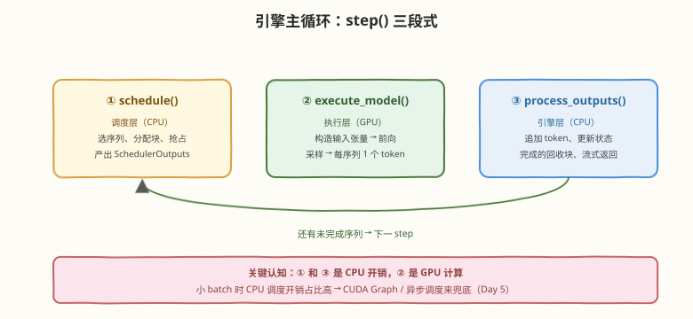
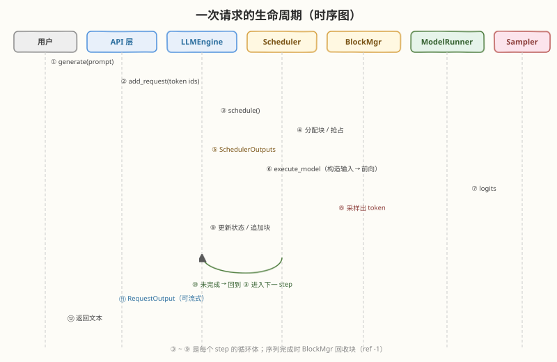

# Day 4：源码架构走读——一次请求的完整生命周期

## 🎯 目标

通过今天的学习，你将：

1. 掌握"从出口倒推、抓主线"的源码走读方法，不被 vLLM 几十万行代码淹没
2. 完整走通一次请求的主线：`generate()` → `add_request()` → `step()` 循环 → `schedule()` → `execute_model()` → 采样 → 状态更新
3. 掌握关键数据结构：`SequenceGroup` / `Request`、`SchedulerOutputs`、`slot_mapping`、`SamplerOutput`
4. 理解引擎的 CPU（调度）/ GPU（执行）分工，以及 V0 / V1 架构差异
5. 会用 DEBUG 日志在真实运行中观察调度决策

> 💡 **前置知识**：Day 1（六层架构图）、Day 2（块管理）、Day 3（调度决策）——今天只是把前三天的概念钉到具体的类和函数上
> ⚠️ **环境要求**：本地有一份 vLLM 源码（`git clone https://github.com/vllm-project/vllm`，或用 `pip show vllm` 找到 site-packages 里的安装目录直接读）；建议配合 IDE 跳转

---

## 为什么走读方法比走读本身重要

vLLM 仓库几十万行代码，直接顺读必然迷失。今天用的方法只有三条：

| 方法 | 说明 | 今天的应用 |
|------|------|------------|
| **从出口倒推** | 先找"这一步产出什么"，再倒推"它怎么算出来的" | 从 `SchedulerOutputs` 倒推 `schedule()` |
| **抓主线、放支线** | 只追"一次请求从进到出"，跳过 metrics、tracing、多 LoRA 等横切逻辑 | 主线之外的一律不点进去 |
| **概念先行** | 先有架构图，再去找每层的代码落点 | Day 1 的六层图就是今天的地图 |

> 💡 **一句话总结**：读源码不是"把代码看完"，而是"给已有的概念地图标注坐标"——你已经有地图了（前三天），今天只做标注。

---

## 走读准备

### 版本确认

```bash
python3 -c "import vllm; print(vllm.__version__)"
# 找到本地源码位置（site-packages 即一份完整源码）
python3 -c "import vllm, os; print(os.path.dirname(vllm.__file__))"
```

### V0 vs V1：走读前必须知道的事

vLLM 正经历 V0 → V1 引擎重构，两条线的类名和进程模型都不同：

| 维度 | V0 | V1 |
|------|----|----|
| 请求抽象 | `SequenceGroup`（一组 `Sequence`） | `Request`（扁平化） |
| 引擎文件 | `vllm/engine/llm_engine.py` | `vllm/v1/engine/`（`llm_engine.py` / `async_llm.py`） |
| 调度器 | `vllm/core/scheduler.py` | `vllm/v1/core/sched/scheduler.py` |
| 块管理 | `vllm/core/block_manager.py` | `vllm/v1/core/kv_cache_manager.py` |
| 进程模型 | 单进程为主 | API 进程 + EngineCore 进程（ZMQ 通信） |

> ⚠️ **走读纪律**：选定一个版本走到底，不要 V0/V1 混看——概念完全同构，但类名不同会让你怀疑人生。本文主线用通用概念描述，文件路径两个版本都给出。

---

## 核心走读

### 4.1 入口层：从 prompt 到请求

**离线路径**（`vllm/entrypoints/llm.py`）：

```text
LLM.generate(prompts, sampling_params)
  └── 对每个 prompt：tokenizer 编码 → token ids
  └── llm_engine.add_request(prompt_token_ids, sampling_params)
```

**在线路径**（`vllm/entrypoints/openai/serving_chat.py` 等）：HTTP 请求 → 同样的 add_request，只是多了 OpenAI schema 解析与 SSE 流式封装。

`add_request` 做的事：

1. 创建请求对象（V0：`SequenceGroup` 内含一条或多条 `Sequence`；V1：`Request`）
2. 记录到达时间（算 TTFT 用）、采样参数、优先级
3. 交给调度器放入 **waiting 队列**

> 💡 **为什么 V0 是 SequenceGroup？** 因为 `SamplingParams(n=4)`（parallel sampling）时，一个 prompt 对应多条共享前缀的序列，Group 是它们的容器——Day 2 的 CoW 就挂在 Group 的块表上。V1 把共享关系移交 kv_cache_manager，`Request` 得以扁平化。

### 4.2 引擎主循环：step() 三段式

引擎的核心就是一个循环（V0 `LLMEngine._run_engine_loop` / V1 `EngineCore` 主循环），每个 iteration 调用一次 `step()`，step 内部分三段：



```text
step():
  ① scheduler.schedule()        → SchedulerOutputs（CPU：调度决策）
  ② model_executor.execute_model(scheduler_outputs) → SamplerOutput（GPU：前向 + 采样）
  ③ process_model_outputs(...)  → 追加 token、更新状态、回收块、流式返回（CPU）
```

| 段 | 在哪执行 | 干什么 | 对应层 |
|----|----------|--------|--------|
| ① `schedule()` | CPU | Day 3 的三步决策：保 running、补 waiting、输出计划 | 调度层 + 块管理层 |
| ② `execute_model()` | GPU | 按执行计划构造输入、跑前向、采样 | 执行层 + 算子层 |
| ③ `process_outputs()` | CPU | token 落盘到序列、判断完成、释放块、通知 API 层 | 引擎层 |

> 💡 **性能视角**：① 和 ③ 是 Python/CPU 开销，② 是 GPU 计算。batch 小时 CPU 开销占比高——这就是 V1 引入异步调度（下一个 step 的调度与当前 step 的 GPU 计算重叠）和独立 EngineCore 进程的动机。

### 4.3 执行层：ModelRunner 如何构造一次前向

`execute_model()` 经 Worker 落到 ModelRunner（V0 `vllm/worker/model_runner.py` / V1 `vllm/v1/worker/gpu_model_runner.py`），核心三步：

**① 构造输入张量**（`prepare_input_tensors`）——把调度计划翻译成张量：

| 输入 | 含义 | 来源 |
|------|------|------|
| `input_tokens` | 本 step 参与计算的 token ids | prefill 是整段 prompt，decode 是上一步采出的 1 个 token |
| `positions` | 各 token 的位置编码下标 | 序列当前长度 |
| `block_tables` | 各序列的逻辑块 → 物理块映射 | Day 2 的 block table |
| `slot_mapping` | **每个新 token 的 KV 该写到物理池的哪个槽位** | 块号 × block_size + 块内偏移 |
| `seq_lens` / `context_lens` | 各序列长度（kernel 遍历 block table 的边界） | 序列状态 |

**② 模型前向**——`model_executor/models/` 下的模型实现（`llama.py`、`qwen2.py` 等）。Attention 层调用 backend（FlashAttention / FlashInfer / PagedAttention kernel），把 `block_tables` 和 `slot_mapping` 传给 kernel：

- **写**：本 step 新 token 的 K/V 按 `slot_mapping` 写入物理块槽位
- **读**：历史 K/V 按 `block_tables` 间接寻址读取（Day 2 的 PagedAttention kernel）

**③ 采样**（`Sampler` / V1 `vllm/v1/sample/`）——对每条序列取最后一个位置的 logits，依次应用：logits 处理（penalty 等）→ 温度缩放 → top-k / top-p 截断 → 采样或 argmax，产出每序列一个 token。

> 💡 **`slot_mapping` 是理解写路径的钥匙**：它是"逻辑位置 → 物理槽位"的逐 token 展开，公式就是 `slot = block_table[逻辑块号] × block_size + 块内偏移`。kernel 拿到它就能在离散物理块上随机写——这正是分页能工作的底层机制。

### 4.4 输出处理：token 落地与资源回收

`process_outputs`（V0 `_process_model_outputs` / V1 `scheduler.update_from_output` + output processor）做四件事：

1. **追加 token**：写入对应序列，序列长度 +1
2. **状态判断**：命中 EOS / `stop` / `max_tokens` → 标记完成
3. **资源回收**：完成序列的块 ref -1，归零的物理块回到空闲池（供 waiting 队列使用——这就是"完成即补位"的实现）
4. **通知返回**：增量 detokenize，离线模式累积到 `RequestOutput`，在线模式经 SSE 流式吐给客户端

### 4.5 完整时序

把 4.1–4.4 串起来，一次请求的完整生命周期：



### 4.6 关键数据结构清单

| 数据结构 | 版本 | 一句话职责 |
|----------|------|------------|
| `SequenceGroup` / `Request` | V0 / V1 | 一条请求的载体：token ids、状态、采样参数 |
| `SequenceStatus` | V0 | WAITING / RUNNING / SWAPPED / FINISHED_* |
| `PhysicalTokenBlock` | V0 | 物理块：块号 + ref count |
| `SchedulerOutputs` / `SchedulerOutput` | V0 / V1 | 调度计划：跑哪些序列、swap_in/out、CoW 复制 |
| `SequenceGroupMetadata` | V0 | 单条序列的执行信息：block_tables、token 数、采样参数 |
| `ModelInput` / attention metadata | 两版 | 前向输入：tokens、positions、block_tables、slot_mapping |
| `SamplerOutput` / `ModelRunnerOutput` | V0 / V1 | 采样结果：每序列一个新 token + logprob |

---

## 实践：用 DEBUG 日志观察一次真实请求

不必改代码，vLLM 自带足够详细的日志：

```bash
# DEBUG 级别跑 Day 1 的 quickstart
VLLM_LOGGING_LEVEL=DEBUG python3 quickstart.py 2>&1 | tee vllm_debug.log
```

观察清单（对着日志找，不同版本措辞略有差异）：

| 观察点 | 对应概念 |
|--------|----------|
| 启动时的 `GPU KV cache size: xxx tokens` | Day 2 的物理块池容量 |
| 请求加入 waiting / 被调度的记录 | Day 3 的三队列迁移 |
| 每个 step 的 batch 组成（几条 prefill、几条 decode） | §4.2 的 step 循环 |
| KV cache 使用率的周期性统计（`Engine ... Avg ...`） | 块池水位，接近 100% 时会看到抢占 |

> 💡 **进阶玩法**：在 site-packages 的源码里直接加一行 `print`（如 `schedule()` 的入口和出口各打一条），跑完删掉——site-packages 就是你的实验场，改坏了重装即可。这比纯阅读的理解效率高一个量级。

---

## 常见陷阱与最佳实践

| 陷阱 | 现象 | 正确做法 |
|------|------|----------|
| V0/V1 混看 | 类名对不上、找不到函数 | 先确认所用版本默认引擎，一条线走到底 |
| 支线沦陷 | 点进 metrics/tracing/多模态逻辑出不来 | 只追主线，横切逻辑全部跳过 |
| 忽视 CPU/GPU 边界 | 以为 execute_model 里都是 GPU 代码 | 输入构造、采样后处理都是 CPU 活，这是性能分析的关键分界 |
| 以为 add_request 会立刻跑 | 疑惑请求"卡住" | 请求先入 waiting，要等下一个 step 的 schedule 才可能被准入 |
| 死背类名 | 面试被问 V1 就懵 | 记概念（请求、调度计划、执行计划），类名按版本临场对应 |

---

## 面试要点

**Q：讲一次请求在 vLLM 里的完整生命周期。**
> ① API 层：prompt 编码为 token ids，`add_request` 创建请求对象放入 waiting 队列。② 引擎 step 循环：每 iteration 先 `schedule()`——保 running（不够块就抢占队尾）、按 FCFS + 配额从 waiting 补入、产出 SchedulerOutputs；再 `execute_model()`——ModelRunner 把计划翻译成 input_tokens/positions/block_tables/slot_mapping，模型前向，attention kernel 按 block table 读写离散的 KV 块，Sampler 采样出每序列一个 token；最后 `process_outputs`——追加 token、判断完成、完成序列的块 ref-1 回收、增量 detokenize 后（流式）返回。循环直到所有请求完成。

**Q：`slot_mapping` 是什么？解决什么问题？**
> 逐 token 的"逻辑位置 → 物理槽位"映射：`slot = block_table[逻辑块号] × block_size + 块内偏移`。PagedAttention 的 KV 物理上是离散的，kernel 写新 token 的 K/V 时不能按序列内偏移直接寻址——slot_mapping 就是写给 kernel 的"每个新 token 该写到显存池哪个格子"，是分页存储能落地的底层机制。

**Q：vLLM 的 CPU 开销在哪？怎么优化？**
> 每个 step 的 schedule()（Python 调度 + 块管理）和 process_outputs（状态更新 + detokenize）都是 CPU 开销，batch 小、step 频繁时占比可观。优化手段：① CUDA Graph 捕获前向，消除 launch 开销 ② V1 的异步调度——当前 step 在 GPU 上跑时，下一个 step 的调度已在 CPU 上并行做 ③ V1 把 EngineCore 放独立进程，API/detokenize 与引擎并行。

**Q：V0 的 SequenceGroup 为什么存在？**
> 为了 parallel sampling / beam search：`n=4` 时一个 prompt 派生 4 条序列，它们共享前缀 KV 块。SequenceGroup 是这组序列的容器，共享块表挂在 Group 级别，配合 Block Manager 的引用计数实现"prompt 只存一份 + CoW"。V1 把共享管理下沉到 kv_cache_manager（前缀哈希 + ref count），请求抽象才得以扁平化为单个 Request。

**Q：vLLM V1 相比 V0 架构上最大的变化是什么？**
> 三点：① **进程模型**——API 服务与 EngineCore 拆成两个进程，ZMQ 通信，CPU 的 tokenize/detokenize 与引擎循环并行；② **调度器简化**——chunked prefill 成为标配，prefill/decode 统一进 token 预算调度；③ **KV 管理统一**——kv_cache_manager 用统一抽象支持 full attention / sliding window / 混合架构，并内置前缀缓存。概念主线（分页 + 连续调度）不变，变的是工程组织。

**Q：detokenize 在哪里做？为什么不是每步都做完整的？**
> 在输出处理侧（V1 是 output processor / 独立线程），而且是**增量**的：每个 step 只 detokenize 新产生的那一个 token，拼到已有文本上。完整 detokenize 整个序列每步做一次是 $O(n^2)$ 的浪费；增量处理把每步开销降到 $O(1)$ 级别（个别 token 跨边界时需少量回溯）。

---

## 今日小结

| 收获 | 具体内容 |
|------|----------|
| 方法论 | 从出口倒推、抓主线放支线、概念先行找坐标 |
| 主线 | `generate` → `add_request`（入 waiting）→ step 循环：`schedule` → `execute_model` → `process_outputs` |
| 执行层 | input_tokens / positions / block_tables / **slot_mapping** 四件套；写按 slot_mapping、读按 block_tables |
| 输出处理 | 追加 token → 完成判断 → 块回收（完成即补位的实现）→ 增量 detokenize |
| 版本观 | V0（SequenceGroup / 单进程）vs V1（Request / EngineCore 进程 + 异步调度），概念同构 |
| 实践 | `VLLM_LOGGING_LEVEL=DEBUG` 观察真实调度；site-packages 就是实验场 |

**自测清单**：

- [ ] 不看笔记画出时序图（12 步），标出每步发生在哪一层
- [ ] 说出 step() 三段中哪些是 CPU 开销、哪些是 GPU 开销，及对应优化
- [ ] 写出 slot_mapping 的计算公式并解释它的作用
- [ ] 在自己安装的版本里找到 schedule() 与 execute_model() 的源码位置

---

> 📌 **明日预告**：Day 5 进入优化特性工具箱——Chunked Prefill 如何用统一 token 预算抹平 prefill 对 ITL 的冲击、Prefix Caching 如何在分页之上再做一层跨请求复用、CUDA Graph 如何消除小 batch 的 launch 开销、量化如何把 decode 的显存带宽压力再砍一半。每一个都是"问题 → 机制 → 开关 → 实测"四步走。
