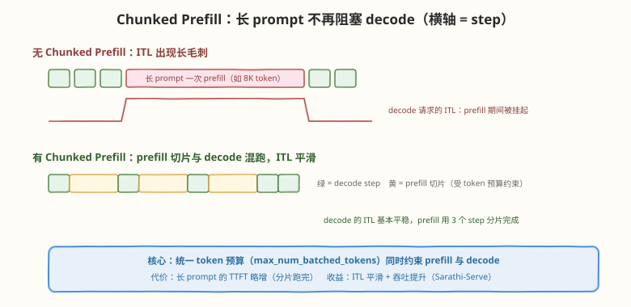
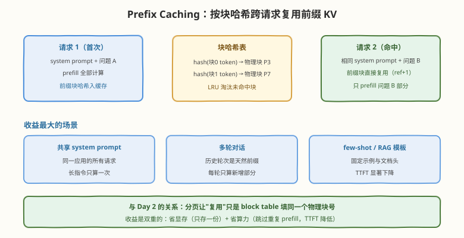
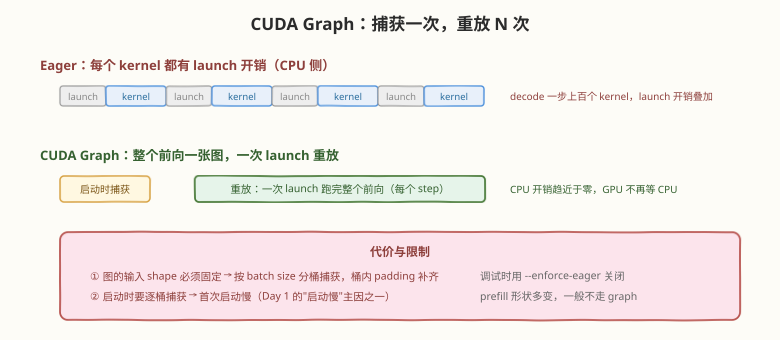

# Day 5：吞吐优化特性——Chunked Prefill / Prefix Caching / CUDA Graph / 量化

## 🎯 目标

通过今天的学习，你将：

1. 掌握四个生产级优化特性的"问题 → 机制 → 开关 → 实测"完整链路
2. 理解 Chunked Prefill 如何用统一 token 预算抹平 prefill 对 ITL 的冲击
3. 理解 Prefix Caching 如何在 PagedAttention 之上实现跨请求的前缀复用
4. 理解 CUDA Graph 消除 kernel launch 开销的机制与代价
5. 理清权重量化（GPTQ/AWQ/FP8）与 KV Cache 量化的区别、收益与精度代价

> 💡 **前置知识**：Day 2（块管理——Prefix Caching 的地基）、Day 3（token 预算——Chunked Prefill 的开关）、Day 4（CPU/GPU 开销分界——CUDA Graph 的动机）；量化部分可对照 [GPTQ 论文精读](../../paper/gptq/README.md)
> ⚠️ **环境要求**：Day 1 的 vLLM 环境；量化实验需额外下载量化版模型（如 AWQ  checkpoint）

---

## 今天的框架：每个特性四步走

前四天学的是 vLLM 的"骨架"，今天学的四个特性是"外挂"——它们各自解决一个具体的性能瓶颈，都可以独立开关。统一按四步走：

| 步 | 回答的问题 |
|----|------------|
| 问题 | 不优化时瓶颈在哪、怎么量化 |
| 机制 | 用什么思路解决、与前几天的机制如何配合 |
| 开关 | 哪个参数打开、默认值是什么 |
| 实测 | 怎么设计实验验证收益 |

---

## 核心概念

### 5.1 Chunked Prefill：长 prompt 不再阻塞 decode

**问题**：Day 3 说过调度按 token 预算组 batch。如果一个 8K token 的 prompt 一次性进 batch，这个 step 的计算量是 decode step 的几十倍——期间所有 decode 请求的 ITL 被拉出一条长毛刺，用户看到流式输出"卡了一下"。

**机制**（Sarathi-Serve, OSDI 2024）：把 prefill 切成不超过 token 预算的**切片**，每个 step 内 decode 请求与一小片 prefill **混跑**：



- `max_num_batched_tokens` 从"prefill 准入门槛"变成"prefill + decode 的统一预算"
- 长 prompt 分几个 step 跑完 prefill，中途不挡 decode 的路
- 本质是把 compute-bound 的 prefill "摊平"到 memory-bound 的 decode 空隙里——一个 step 内两种负载互补，GPU 利用率和 ITL 平滑度双赢

**开关**：V1 默认开启；V0 需 `--enable-chunked-prefill`，切片大小由 `--max-num-batched-tokens` 控制。

| 场景 | 建议 |
|------|------|
| 在线流式服务（ITL 敏感） | 开启，token 预算调小（如 2048） |
| 离线批量生成（只关心总吞吐） | 影响小，开关均可 |
| 超长上下文应用（RAG、文档问答） | 必开——长 prompt 是常态 |

### 5.2 Prefix Caching：跨请求的前缀复用

**问题**：同一应用的所有请求共享 system prompt；多轮对话每轮都重算全部历史；few-shot 模板反复 prefill 相同示例——这些重复前缀的 KV 每个请求都重新算、重复存。

**机制**：在 Day 2 的分页之上加一层**块级缓存**——每个写满的块按内容（token 序列）计算哈希，块释放后不立即回收，而是留在哈希表里；新请求的 prompt 逐块哈希匹配，命中就直接复用物理块（ref +1）：



| 收益 | 来源 |
|------|------|
| 省算力 | 命中前缀**跳过 prefill 计算**，TTFT 显著下降 |
| 省显存 | 相同前缀只存一份（同 Day 2 的共享机制，但跨越了请求边界） |

**开关**：`--enable-prefix-caching`（V1 默认开启，V0 需显式打开）；哈希表容量受 KV 池约束，LRU 淘汰。

> 💡 **为什么是"块"粒度而不是 token 粒度？** 哈希匹配以块为单位（默认 16 token），前缀长度需对齐到块边界才能完全命中——这是分页粒度的自然延伸，也是 prompt 工程里"把固定内容放在开头、变量内容放最后"的系统层理由。

### 5.3 CUDA Graph：消除 launch 开销

**问题**：Day 4 说过 step 的 ① ③ 是 CPU 开销。decode 每步只有 1 token/序列，GPU 计算极快，但一次前向要 launch 上百个 kernel——小 batch 时 **CPU launch 速度跟不上 GPU 执行速度**，GPU 在 kernel 间隙空转。

**机制**：启动时把"整个前向的 kernel 序列"捕获为一张 **CUDA Graph**，之后每个 decode step 只需一次 graph launch 即可重放全部 kernel：



**开关**：默认开启（decode 路径）；调试时用 `--enforce-eager` 关闭（这就是 Day 1"首次启动慢"的原因之一——启动时要按 batch size 分桶逐桶捕获）。

| 代价 | 说明 |
|------|------|
| shape 固定 | 图的输入形状编译期确定，按 batch size 分桶捕获、桶内 padding 补齐 |
| 启动变慢 | 逐桶捕获是一次性开销 |
| 只覆盖 decode | prefill 形状多变（prompt 长度任意），一般保持 eager |

### 5.4 量化：砍 decode 的显存带宽账单

**问题**：Day 2 反复说过 decode 是 memory-bound——每步要读全部权重 + 全部 KV Cache。让字节数减半，理论上 decode 就加速近一倍。量化就是直接砍字节数。

**两条独立路线**：

| 路线 | 量化对象 | 代表方案 | decode 收益 | 开关 |
|------|----------|----------|-------------|------|
| **权重量化** | 模型权重 | GPTQ / AWQ（W4A16）、FP8（W8A8） | 权重读取 1/4 ~ 1/2 | `--quantization gptq/awq/fp8`（需对应的量化 checkpoint） |
| **KV Cache 量化** | KV 缓存 | FP8（e4m3/e5m2） | KV 读取减半 + KV 池翻倍（并发翻倍） | `--kv-cache-dtype fp8`（无需换模型） |

| 方案 | 精度策略 | 特点 |
|------|----------|------|
| GPTQ | W4A16：权重 4bit、激活 FP16 | 逐层二阶误差补偿，需校准集（见 [GPTQ 论文精读](../../paper/gptq/README.md)） |
| AWQ | W4A16：保护显著权重通道 | 按激活分布选 1% 重要通道放大，鲁棒性更好 |
| FP8 W8A8 | 权重激活都 8bit | Hopper/Ada 有 FP8 Tensor Core，计算也能加速 |
| FP8 KV | 只压 KV Cache | 实现最简单、精度损失最小，长上下文场景收益最大 |

> ⚠️ **注意**：权重量化需要加载**对应的量化 checkpoint**（如 `Qwen/Qwen2.5-xB-Instruct-AWQ`），`--quantization` 只是告诉 vLLM 用什么反量化 kernel，不能把 FP16 模型当场量化。KV 量化不依赖 checkpoint，但 FP8 KV 需要较新的 GPU 才支持。

**为什么 decode 受益远大于 prefill**：prefill 是 compute-bound，瓶颈在算力不在带宽，权重压缩只省显存不省时间；decode 是 memory-bound，读的字节数直接决定耗时。所以量化本质上是**用少量精度换 decode 吞吐**，是推理侧特有的划算交易。

---

## 实验：特性开关 A/B 对比

固定模型与压测负载，每次只改一个开关（重启服务），记录总吞吐 / 中位 TTFT / P99 TPOT：

```bash
# 压测命令（每组实验复用）
vllm bench serve --model <模型> --dataset-name sharegpt \
  --num-prompts 200 --save-result --result-filename <组名>.json
```

| 实验组 | 服务启动参数 | 预期观察 |
|--------|--------------|----------|
| 基准 | 默认 | 基线三指标 |
| E1 关 chunked prefill | `--no-enable-chunked-prefill`（V1） | 长 prompt 请求期间 TPOT 毛刺变大 |
| E2 关 prefix caching | `--no-enable-prefix-caching`（V1） | 共享 system prompt 的负载下 TTFT 上升 |
| E3 eager 模式 | `--enforce-eager` | 小 batch 下 TPOT 上升（launch 开销裸露） |
| E4 KV 量化 | `--kv-cache-dtype fp8` | decode 吞吐上升，生成质量肉眼对比 |
| E5 权重量化 | 换 AWQ checkpoint + `--quantization awq` | 显存占用大降，decode 吞吐上升 |

> 💡 **实验设计要点**：E2 的负载要有重复前缀（比如所有请求带同一个 500-token system prompt）才能看到差异；E3 在小 batch（低并发）下差异最明显；E4/E5 要抽几条输出人工核对质量——吞吐数字之外，精度代价必须亲眼确认。

---

## 常见陷阱与最佳实践

| 陷阱 | 现象 | 正确做法 |
|------|------|----------|
| 以为量化是免费午餐 | 直接上 INT4 发现回答质量下降 | 量化后必须跑评测集对比；KV 量化（FP8）通常是精度损失最小、收益最直接的一步 |
| `--quantization` 配 FP16 模型 | 报错或行为异常 | 该参数只声明反量化方式，需搭配对应量化 checkpoint |
| prefix caching 没命中 | 开了特性 TTFT 没变化 | 检查前缀是否对齐块边界（16 token）、是否把可变内容放在了 prompt 开头 |
| eager 模式跑生产 | 用 `--enforce-eager` 上线，吞吐莫名低 | eager 只用于调试，生产恢复 CUDA Graph |
| token 预算一刀切 | 长 prompt 场景 TTFT 过长 | 按业务 prompt 长度分布调 `max_num_batched_tokens`，长上下文适当调大 |

---

## 面试要点

**Q：Chunked Prefill 解决什么问题？原理是什么？**
> 长 prompt 的 prefill 一次占满整个 step，期间 decode 请求 ITL 被拉长（流式输出卡顿）。Chunked Prefill 把 prefill 切成不超过 token 预算的片，与 decode 混跑：每个 step 内 decode 照常推进，prefill 分几步完成。本质是 compute-bound 负载填进 memory-bound 负载的空隙，ITL 平滑 + 吞吐提升，代价是长 prompt 的 TTFT 略增。vLLM V1 默认开启，预算是 `max_num_batched_tokens`。

**Q：Prefix Caching 和 PagedAttention 是什么关系？**
> Prefix Caching 建立在 PagedAttention 之上：分页把 KV 切成定长块后，块就成了可复用单元——对写满块的 token 内容做哈希，新请求的前缀逐块匹配，命中则 block table 直接指向已有物理块（ref +1），连 prefill 计算都跳过。没有分页，跨请求共享要求物理连续，基本不可行。收益是双重的：省显存 + 降 TTFT。典型受益场景：共享 system prompt、多轮对话、few-shot 模板。

**Q：CUDA Graph 为什么能加速 decode？有什么代价？**
> decode 每步计算量小但 kernel 数量多，CPU launch 开销会超过 GPU 执行时间，GPU 空转。CUDA Graph 启动时把整个前向捕获成一张图，每步一次 launch 重放全部 kernel，CPU 开销趋零。代价：输入 shape 必须固定（按 batch size 分桶捕获 + padding）、启动变慢、prefill 形状多变一般不覆盖。调试时用 `--enforce-eager` 关闭。

**Q：权重量化和 KV Cache 量化有什么区别？各自收益是什么？**
> 对象不同：权重量化（GPTQ/AWQ W4A16、FP8 W8A8）压缩模型权重，decode 时权重读取减半到 1/4，需对应量化 checkpoint；KV 量化（FP8）压缩 KV Cache，decode 的 attention 读带宽减半，同时 KV 池容量翻倍、并发上限翻倍，且不需要换模型。共同点：都主要利好 memory-bound 的 decode；prefill 是 compute-bound，收益很小。精度上 KV FP8 通常损失最小。

**Q：为什么量化对 prefill 加速不明显？**
> prefill 是 compute-bound：瓶颈在 Tensor Core 的矩阵乘算力，不在显存带宽。权重量化（W4A16）只减少权重读取的字节数，计算仍在 FP16 精度下进行（要先反量化），算力开销不变甚至略增。例外是 FP8 W8A8——在支持 FP8 Tensor Core 的硬件上计算本身也能加速，prefill 才跟着受益。

**Q：给你一个"共享 system prompt 的多轮对话"在线服务，你会开哪些特性？**
> ① Prefix Caching：system prompt 和历史轮次都是前缀，TTFT 直接受益 ② Chunked Prefill：多轮积累的长上下文切片进 batch，保护 ITL ③ FP8 KV Cache：长对话 KV 占比高，池容量翻倍支持更多并发会话 ④ CUDA Graph 保持默认开启。权重量化看显存余量决定——这套组合覆盖 TTFT、ITL、并发三个维度。

---

## 今日小结

| 特性 | 问题 | 机制一句话 | 开关 |
|------|------|------------|------|
| Chunked Prefill | 长 prompt 阻塞 decode ITL | prefill 切片与 decode 混跑，统一 token 预算 | V1 默认开；`--max-num-batched-tokens` 控片长 |
| Prefix Caching | 重复前缀重复算、重复存 | 块内容哈希 + ref count，跨请求复用 | `--enable-prefix-caching`（V1 默认开） |
| CUDA Graph | 小 batch launch 开销 > GPU 执行 | 前向捕获成图，每步一次 launch 重放 | 默认开；`--enforce-eager` 关闭 |
| 量化 | decode 的显存带宽账单 | 权重（GPTQ/AWQ/FP8）+ KV（FP8）两条路线 | `--quantization` / `--kv-cache-dtype fp8` |

**自测清单**：

- [ ] 能用"问题 → 机制 → 开关"三句话讲清每个特性
- [ ] 解释为什么四个特性都主要利好 decode / TTFT 而非 prefill 算力
- [ ] 给定业务场景（如长文档问答 / 高并发短对话），说出该开哪几个特性、为什么
- [ ] 完成至少两组 A/B 实验并记录三指标

---

> 📌 **明日预告**：Day 6 冲出单机——Tensor Parallel 怎么切权重、PP 与 TP 怎么选；然后回到单卡看解码侧的两个"加速外挂"：Speculative Decoding 用小模型猜、大模型验，把 memory-bound 的空闲算力变成吞吐；Structured Output 与 LoRA serving 则是生产部署的常客。
