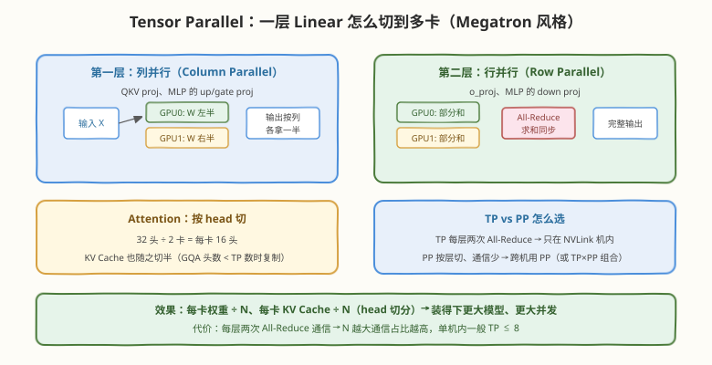
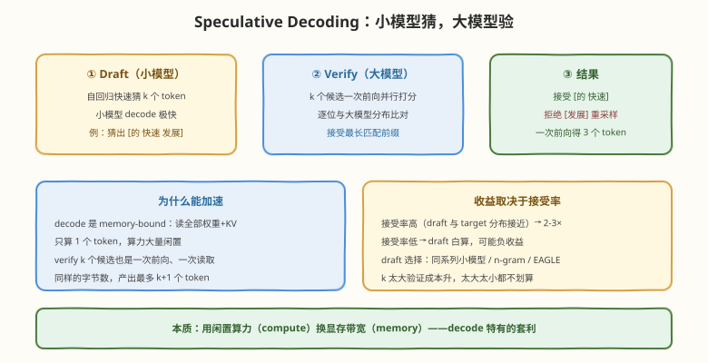

# Day 6：分布式与解码优化——TP/PP、Speculative Decoding、Structured Output、LoRA

## 🎯 目标

通过今天的学习，你将：

1. 理解 Tensor Parallel 的切分方式（列并行/行并行/按 head 切），会判断 TP 与 PP 的适用场景
2. 掌握 Speculative Decoding 的 draft-verify 机制，理解它为什么是 decode 特有的加速
3. 了解 Structured Output（guided decoding）的实现原理与使用方式
4. 了解 LoRA serving 的多租户部署模式
5. 完成一周实验数据的整理，为 Day 7 的压测报告做准备

> 💡 **前置知识**：Day 4 的执行层（TP 改的正是模型前向的权重布局）；Day 5 的量化（Speculative Decoding 与它同属 decode 加速工具箱）；TP 理论可参考 Megatron-LM 论文
> ⚠️ **环境要求**：TP 实验需要多卡（单卡可只看原理）；n-gram Speculative Decoding 无需额外模型，单卡可跑

---

## 核心概念

### 6.1 Tensor Parallel：把一层切到多卡

模型大到单卡装不下（或想切小每卡 KV 以换并发）时，vLLM 用 Megatron 风格的 Tensor Parallel 把**每一层**切到 N 张卡上：



**切分规则**（记两类就够了）：

| 层 | 切法 | 通信 |
|----|------|------|
| QKV proj、MLP 的 up/gate proj | **列并行**：权重按输出维度切半，各卡算一半输出 | 无（天然对齐下一层的行并行输入） |
| o_proj、MLP 的 down proj | **行并行**：权重按输入维度切半，各卡算部分和 | **All-Reduce** 求和 |
| Attention | 按 head 切：32 头 ÷ 2 卡 = 每卡 16 头 | 随 o_proj 的 All-Reduce |

**关键收益与代价**：

- 每卡权重 ÷ N，**每卡 KV Cache 也 ÷ N**（KV head 随 attention head 切分）——TP 不只为了装下模型，也是扩大单机并发的手段
- 代价是每层两次 All-Reduce，通信量与激活大小成正比——所以 **TP 只适合 NVLink 高速互联的单机内部**，跨机用 Pipeline Parallel（按层切、只在层边界通信），或 TP×PP 组合
- GQA 模型的坑：KV head 数 < TP 数时（如 8 个 KV head 切到 16 卡），KV 无法整切只能复制，显存收益打折

**开关**：`--tensor-parallel-size N`（TP）、`--pipeline-parallel-size M`（PP）。vLLM 会自动处理权重切分与通信，对上层完全透明——Day 1-5 学的所有机制（调度、分页、采样）在 TP 下行为不变，只是每步前向变成了多卡协同。

### 6.2 Speculative Decoding：用闲置算力换带宽

**问题**：decode 每步读全部权重 + KV Cache（memory-bound），却只算 1 个 token——GPU 算力大量闲置。能不能"读一次，产多个 token"？

**机制**：draft-verify 两阶段：



1. **Draft**：用小模型（或 n-gram、EAGLE 头等轻量方案）自回归猜 k 个候选 token——小模型 decode 极快
2. **Verify**：大模型把 k 个候选**拼成一条序列一次前向**（像 mini-prefill，compute-bound 的活），逐位比对分布，接受最长匹配前缀
3. **产出**：接受的 token + 拒绝位置重采样的 1 个，一次大模型前向最多得 k+1 个 token

| 要点 | 说明 |
|------|------|
| 为什么加速 | verify 与单步 decode 的显存读取量几乎相同（权重+KV 读一遍），但产出多个 token——把闲置算力换成了吞吐 |
| 数学等价性 | 拒绝采样保证输出分布与目标模型**严格一致**，不是近似 |
| 收益前提 | **接受率**：draft 与 target 分布越接近，平均接受越长；接受率太低时 draft 白算，可能负收益 |
| k 的选择 | k 大则验证成本高（序列长）、平均接受长度边际递减；典型 3-5 |

**vLLM 中的 draft 选择**：

| 方案 | 适用 | 备注 |
|------|------|------|
| 同系列小模型 | 有配套小模型（如 70B 配 7B） | 接受率最高 |
| **n-gram** | 无小模型可用；摘要、代码等重复度高的场景 | 用 prompt 自身的内容做查表猜测，零额外模型成本 |
| EAGLE / Medusa 头 | 追求更高接受率 | 需要对应权重，支持度随版本变化 |

**开关**：V1 用 `--speculative-config`（JSON 形式指定 draft 模型/方法与 `num_speculative_tokens`）；旧版为 `--speculative-model` + `--num-speculative-tokens`。以所用版本文档为准。

### 6.3 Structured Output：约束解码

**需求**：让模型输出严格的 JSON / 正则格式 / 枚举值（函数调用、信息抽取场景），而不是靠 prompt 求它守规矩。

**机制**（guided decoding）：把目标格式编译为状态机（如 JSON Schema → 语法自动机），**每个 decode step 用状态机算出合法 token 集合，给非法 token 的 logits 置 -inf**——模型只能采样合法 token，输出 100% 符合格式。

- vLLM 支持 JSON Schema、正则、choice、grammar 四种约束，通过 OpenAI API 的 `response_format` 或 `guided_*` 参数传入
- 后端实现（xgrammar / outlines 等）随版本演进，对吞吐的影响主要在每步的 mask 计算（CPU），通常可接受

### 6.4 LoRA Serving：一个底座，多套微调

**需求**：多个租户/业务共用同一个 base 模型，各自带一个小 LoRA adapter——每个都部署一份完整模型显存吃不消。

**机制**：vLLM 支持加载 base 模型后**动态挂载多个 LoRA adapter**，请求级指定用哪个 adapter，LoRA 权重以低秩矩阵形式注入对应层，推理时合并计算。

**开关**：`--enable-lora`、`--max-loras`（同时加载的 adapter 数上限）、`--max-lora-rank`；请求时通过 model 名指定 adapter。

| 场景 | 价值 |
|------|------|
| 多租户 SaaS | 一份底座显存，服务几十套微调 |
| A/B 测试 | 同实例切换 adapter 对比效果 |
| 个性化助手 | 每用户一个 LoRA，按需加载换出 |

---

## 实验

### E1：n-gram Speculative Decoding（单卡可跑）

无需额外模型，直接在现有服务上开启：

```bash
# V1 写法（旧版用 --speculative-model [ngram] --num-speculative-tokens 5）
vllm serve Qwen/Qwen2.5-0.5B-Instruct --gpu-memory-utilization 0.6 \
  --speculative-config '{"method": "ngram", "num_speculative_tokens": 5, "prompt_lookup_max": 4}'
```

压测对比开/关两组的 TPOT——注意选**重复度高的负载**（如摘要、翻译），n-gram 在开放闲聊上接受率低，可能看不到收益。

### E2：Structured Output

```bash
curl http://localhost:8000/v1/chat/completions \
  -H "Content-Type: application/json" \
  -d '{
    "model": "Qwen/Qwen2.5-0.5B-Instruct",
    "messages": [{"role": "user", "content": "介绍 CUDA，用 JSON 返回，字段：name、year、fields(数组)"}],
    "response_format": {
      "type": "json_schema",
      "json_schema": {
        "name": "tech",
        "schema": {"type": "object", "properties": {"name": {"type": "string"}, "year": {"type": "integer"}, "fields": {"type": "array", "items": {"type": "string"}}}, "required": ["name", "year", "fields"]}
      }
    }
  }'
```

多打几次，验证输出永远可被 `json.loads` 解析——这就是 logits mask 与"prompt 求稳"的本质区别。

### E3：Tensor Parallel（有多卡时）

```bash
# 双卡 TP（模型与 KV 都切半）
vllm serve Qwen/Qwen2.5-0.5B-Instruct --tensor-parallel-size 2

# 观察：启动日志中每张卡的权重与 KV 池大小减半
nvidia-smi  # 两张卡显存占用接近相等
```

> 💡 **晚间任务**（按周计划）：整理 Day 3 / Day 5 / Day 6 的实验数据——调度参数扫描、特性 A/B、spec decoding 对比，统一成"实验组 × TTFT / TPOT / 吞吐"的表格，明天直接写进压测报告。

---

## 常见陷阱与最佳实践

| 陷阱 | 现象 | 正确做法 |
|------|------|----------|
| 跨机开 TP | 吞吐不升反降 | TP 的 All-Reduce 只吃得起 NVLink；跨机用 PP |
| GQA 模型开大 TP | KV 显存没按预期下降 | KV head < TP 数时被复制，TP ≤ KV head 数才有完整 KV 收益 |
| 闲聊负载开 n-gram spec | 吞吐反而下降 | n-gram 只适合重复度高的负载；通用场景用同系列小模型做 draft |
| spec 的 k 调很大 | 验证成本吃掉收益 | 3-5 起步，按实测接受率调 |
| 以为 structured output 免费 | 高并发下 TPOT 略升 | 每步 mask 计算是 CPU 开销，极端高并发留意 |
| LoRA 当全量微调用 | 多 adapter 时显存超限 | 注意 `--max-loras` 上限与 rank 大小，adapter 也是显存 |

---

## 面试要点

**Q：Tensor Parallel 切的是哪些权重？每层需要几次通信？**
> Megatron 风格切分：QKV proj 和 MLP 第一层（up/gate）做列并行（按输出维度切），o_proj 和 MLP 第二层（down）做行并行（按输入维度切）；attention 按 head 切。列并行的输出天然是行并行的输入，所以每层只需在行并行后做两次 All-Reduce（attention 一次、MLP 一次）。收益是每卡权重和 KV Cache（随 head 切）都除以 N；代价是每层两次通信，所以 TP 只在 NVLink 单机内用，跨机用 PP。

**Q：TP 和 PP 怎么选？**
> TP 切层内权重，通信频繁（每层两次 All-Reduce），需要 NVLink 高带宽，适合单机内；PP 按层切分，只在层边界传激活，通信量小，适合跨机。实践中常组合：机内 TP（≤8）× 机间 PP。另外 TP 会随 head 切 KV Cache（GQA 的 KV head 数 < TP 数时退化为复制），PP 不切 KV 但每层副本只在自己段内。

**Q：Speculative Decoding 为什么能加速 decode？输出分布会变吗？**
> decode 是 memory-bound：每步读全部权重+KV 只产 1 个 token，算力闲置。Spec decoding 用小 draft 模型猜 k 个 token，大模型把候选拼成序列一次前向并行 verify（读一遍权重产出 k+1 个位置的 logits），接受最长匹配前缀、拒绝处按修正分布重采样。同样一次显存读取产出最多 k+1 个 token。拒绝采样保证输出分布与目标模型严格一致，是无损加速。收益取决于接受率，典型 2-3×；draft 与 target 分布差太远时可能负收益。

**Q：draft 模型有哪些选择？各适合什么场景？**
> ① 同系列小模型（70B 配 7B）：接受率最高，通用场景首选 ② n-gram：用 prompt 自身查表，零额外模型成本，适合摘要/代码/翻译等重复度高的场景，闲聊无效 ③ EAGLE/Medusa：在 target 上训轻量预测头，接受率高但需要额外权重。选择核心是"draft 成本 vs 接受率"的权衡。

**Q：Structured Output（guided decoding）是怎么实现格式约束的？**
> 把目标格式（JSON Schema / 正则 / grammar）编译为状态机，每个 decode step 根据当前状态算出合法 token 集合，在采样前给非法 token 的 logits 置 -inf。模型只能走合法路径，输出 100% 符合 schema——比"prompt 里要求输出 JSON"可靠得多。代价是每步的 mask 计算（CPU），vLLM 用 xgrammar 等后端把它做到开销可忽略。

**Q：多租户场景下一个 base 模型怎么服务几十套 LoRA？**
> vLLM 的 LoRA serving：base 模型加载一份，`--enable-lora` 后支持动态挂载多个 adapter（`--max-loras` 控制同时驻留数），请求级指定 adapter 名。LoRA 低秩矩阵在对应层与 base 权重合并计算，显存开销远小于部署多份完整模型。适合多租户 SaaS、A/B 测试、个性化场景。

---

## 今日小结

| 主题 | 一句话 | 开关 |
|------|--------|------|
| Tensor Parallel | 列并行 + 行并行 + 按 head 切，每层两次 All-Reduce，机内专用 | `--tensor-parallel-size N` |
| Pipeline Parallel | 按层切，通信少，跨机用 | `--pipeline-parallel-size M` |
| Speculative Decoding | 小模型猜 k 个，大模型一次前向验，无损加速 decode | `--speculative-config` |
| Structured Output | 格式编译为状态机，logits mask 保证 100% 合规 | `response_format` / `guided_*` |
| LoRA Serving | 一份底座动态挂多 adapter，请求级切换 | `--enable-lora --max-loras N` |

**自测清单**：

- [ ] 能画出 QKV proj（列并行）与 o_proj（行并行）的切分与通信位置
- [ ] 解释 spec decoding 的"一次前向产多 token"与输出无损的原因
- [ ] 说出 GQA 模型开 TP 时 KV Cache 收益打折的条件
- [ ] 完成 n-gram spec 与 structured output 两个实验

---

> 📌 **明日预告**：Day 7 收官——把本周所有实验数据汇总成一份完整的 benchmark 报告：`vllm bench` 压测不同并发下的 TTFT / TPOT / 吞吐曲线，用 Week 8 的方法论定位饱和点，对照 Week 6 手写 mini 引擎总结"教学版与工业版的差距"，并把六天内容浓缩成面试应答材料。
