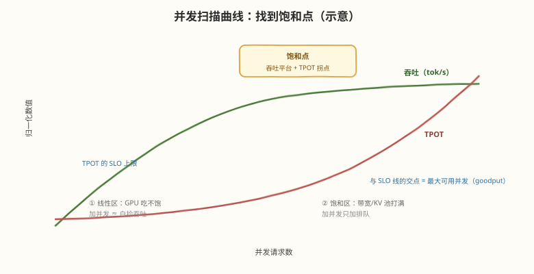
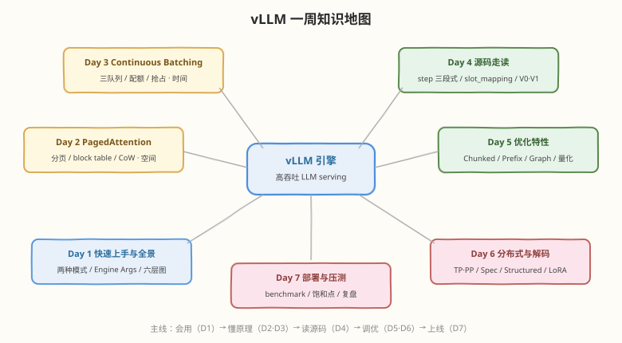

# Day 7：部署实战与 Benchmark——从压测到复盘

## 🎯 目标

通过今天的学习，你将：

1. 掌握 LLM serving 压测的核心指标体系（TTFT / TPOT / 吞吐 / goodput）与 `vllm bench` 的用法
2. 完成一次完整的并发扫描实验，找到服务的饱和点与最大可用并发
3. 学会用"吞吐平台 + TPOT 拐点"判读瓶颈类型（算力 / 带宽 / KV 池）
4. 对照 Week 6 的 mini 引擎，说清教学版与工业版的完整差距
5. 把本周六天的内容浓缩为面试应答材料，完成一周复盘

> 💡 **前置知识**：Day 1-6 全部；压测方法论衔接 [Week 8 Day 1 Benchmark 方法论](../../daily/week8/day1/README.md)，mini 引擎对照 [Week 6 Day 6 Benchmark](../../daily/week6/day6/README.md)
> ⚠️ **环境要求**：Day 1 部署的服务 + Day 3/5/6 的实验数据

---

## 核心概念

### 7.1 压测指标体系

LLM serving 的压测与传统 Web 服务不同——一个请求的耗时由两段异质阶段组成，必须分开度量：

| 指标 | 含义 | 对应阶段 | 用户感知 |
|------|------|----------|----------|
| **TTFT**（Time To First Token） | 请求到达到首 token 返回 | 排队 + prefill | "多久开始回答" |
| **TPOT**（Time Per Output Token） | 相邻 token 的平均间隔 | decode | "回答流得顺不顺" |
| **E2E Latency** | 整请求耗时 | TTFT + 生成 × TPOT | 总等待 |
| **Throughput** | 全系统 tok/s（input/output/total 分开看） | 整体 | 容量规划 |
| **Goodput** | 满足 SLO（如 TPOT < 50ms）的最大吞吐 | 整体 | 生产可用容量 |

> 💡 **为什么要看分位数**：平均数会掩盖长尾。生产看 P50（典型体验）+ P99（最差体验）——Day 3 的调度参数、Day 5 的 chunked prefill，优化的主要就是 P99。

### 7.2 压测工具与变量控制

```bash
# 启动服务（固定配置，作为被测对象）
vllm serve Qwen/Qwen2.5-0.5B-Instruct --gpu-memory-utilization 0.6

# 压测：固定数据集与请求数，只扫并发
vllm bench serve \
  --model Qwen/Qwen2.5-0.5B-Instruct \
  --dataset-name sharegpt --num-prompts 500 \
  --max-concurrency 16 \
  --save-result --result-filename c16.json
```

**变量控制纪律**（压测数据可比的前提）：

| 固定 | 只改 |
|------|------|
| 模型、硬件、服务配置 | 并发数（1 → 4 → 8 → 16 → 32 → 64） |
| 数据集与请求数（≥ 几百条，避免小样本噪声） | |
| 采样参数（建议 temperature=0 减少方差） | |

> ⚠️ **注意**：`--num-prompts` 太小时，服务还没进入稳态实验就结束了，曲线会虚高——请求数至少要能让高并发组跑满几分钟。

### 7.3 并发扫描：找到饱和点

把各并发组的三指标画成曲线，形态如下（示意图）：



**三段解读**：

| 区段 | 特征 | 瓶颈 | 对策 |
|------|------|------|------|
| ① 线性区 | 并发翻倍 → 吞吐近翻倍，TPOT 基本不变 | GPU 吃不饱（带宽/算力有余量） | 白捡的吞吐，继续加并发 |
| ② 饱和点 | 吞吐进入平台，TPOT 开始加速恶化 | memory-bound 饱和：KV 池打满或 HBM 带宽打满 | 这就是容量上限 |
| ③ 恶化区 | 吞吐不再涨甚至下降，出现抢占日志 | 并发超过 KV 池承载，调度器反复抢占 | 降并发 / 加显存 / 开量化 |

**SLO 定容量**：在 TPOT 曲线上画一条 SLO 线（如 P99 TPOT < 50ms），交点对应的并发就是**生产最大可用并发**——不是"能跑多少"，而是"达标能跑多少"。

**瓶颈判读清单**（饱和点到了，是哪类饱和？）：

| 观察 | 判读 |
|------|------|
| KV cache usage 接近 100% + 抢占日志 | **KV 池饱和** → 加显存 / FP8 KV / TP 切 KV |
| KV 池有余量 + `nvidia-smi` 显存带宽接近峰值 | **HBM 带宽饱和** → 权重量化 / FP8 KV / spec decoding |
| 带宽与 KV 都有余量 + SM 利用率高 | **算力饱和**（大 batch prefill 多） → chunked prefill 调参 / 更强卡 |

### 7.4 教学版 vs 工业版：mini 引擎差在哪

Week 6 你手写过 mini 引擎 v1 并做过 benchmark。把它与 vLLM 并排，差距就是本周每一天的主题：

| 能力 | mini 引擎（Week 6） | vLLM | 对应日 |
|------|---------------------|------|--------|
| KV 管理 | 简化连续分配/简单分页 | PagedAttention + CoW + Prefix Caching | Day 2 |
| 调度 | continuous batching 教学版 | 三队列 + 抢占 + token 预算 + 优先级 | Day 3 |
| 执行 | PyTorch eager 循环 | CUDA Graph + 手写 kernel + 异步调度 | Day 4/5 |
| Prefill 处理 | 整段进 batch | Chunked Prefill 混跑 | Day 5 |
| 精度路线 | FP16 only | GPTQ/AWQ/FP8 + KV 量化 | Day 5 |
| 规模 | 单卡单模型 | TP/PP 分布式 + LoRA 多租户 | Day 6 |
| 工程化 | 脚本 | OpenAI 兼容 API、流式、metrics、结构化输出 | Day 1/6 |

> 💡 **复盘的正确姿势**：mini 引擎不是"vLLM 的简化错误版"，而是"每个正确决策的最小实现"。逐行对上表时你会发现：**教学版回答"为什么需要这个机制"，工业版回答"这个机制做到生产级要付出什么"**——面试里能讲清后者，就是与背八股拉开差距的地方。

### 7.5 一周知识地图



一条主线串起七天：**会用（Day 1）→ 懂原理（Day 2 空间 / Day 3 时间）→ 读源码（Day 4）→ 调优（Day 5 特性 / Day 6 规模）→ 上线（Day 7）**。

---

## 实战：完整压测流程（今日主任务）

```bash
# 1. 部署：按 Day 1 流程起服务，记录启动日志中的 KV 池容量
vllm serve Qwen/Qwen2.5-0.5B-Instruct --gpu-memory-utilization 0.6

# 2. 扫描：6 组并发，每组同一数据集
for c in 1 4 8 16 32 64; do
  vllm bench serve --model Qwen/Qwen2.5-0.5B-Instruct \
    --dataset-name sharegpt --num-prompts 500 \
    --max-concurrency $c \
    --save-result --result-filename c$c.json
done

# 3. 汇总：从各组 JSON 中提取三指标
python3 -c "
import json
for c in [1, 4, 8, 16, 32, 64]:
    r = json.load(open(f'c{c}.json'))
    print(f'并发 {c:>3}: TTFT P50 {r[\"median_ttft_ms\"]:.0f}ms | '
          f'TPOT P99 {r[\"p99_tpot_ms\"]:.1f}ms | '
          f'吞吐 {r[\"output_token_throughput\"]:.0f} tok/s')
"
```

**压测报告模板**（今天的主要产出）：

```markdown
## 环境
- 硬件 / 模型 / dtype / vLLM 版本 / 关键 Engine Args
- KV 池容量（启动日志）

## 并发扫描结果
| 并发 | TTFT P50 | TTFT P99 | TPOT P50 | TPOT P99 | 吞吐(tok/s) |
|------|----------|----------|----------|----------|-------------|
| 1 / 4 / 8 / 16 / 32 / 64 | ... |

## 分析
- 饱和点：并发 N 处吞吐进入平台，原因是 ___（KV 池 / 带宽 / 算力）
- 最大可用并发（SLO: P99 TPOT < __ms）：___
- 与 Day 5 特性实验的交叉验证：___

## 结论
- 该服务在当前硬件上的容量结论与扩容建议
```

> ⚠️ **诚实记录**：上面的提取脚本里 JSON 字段名以实际输出为准（不同版本字段命名略有差异）——先看一眼 `c1.json` 里有什么再写提取逻辑。报告里**只写你真实跑出来的数字**，预期形态参考 §7.3 的示意图。

---

## 面试问答集：本周浓缩

把 Day 1-6 的 35+ 道面试题浓缩成"一条主线 + 五张牌"：

**主线（30 秒电梯陈述）**：
> vLLM 的核心是用 OS 思想解决 LLM serving 的资源利用率问题：PagedAttention 把 KV Cache 分页管理解决空间浪费（显存浪费 60-80% → <4%），Continuous Batching 做 iteration 级调度解决时间浪费（完成即补位），两者配合让吞吐比 HF 提升一个数量级；在此之上，chunked prefill、prefix caching、CUDA graph、量化、spec decoding 分别优化 ITL、TTFT、launch 开销与 decode 带宽。

**五张牌**（每个方向一道必答题，答案回顾对应日）：

| 方向 | 必答题 | 回顾 |
|------|--------|------|
| 原理 | PagedAttention 为什么能把浪费降到 4%？ | Day 2 |
| 调度 | schedule() 每个 step 的三步决策是什么？ | Day 3 |
| 源码 | 一次请求的完整生命周期？slot_mapping 是什么？ | Day 4 |
| 优化 | decode 是 memory-bound，有哪些手段？（量化/graph/spec 各一句话） | Day 5/6 |
| 生产 | 怎么给一个 vLLM 服务定容量？（并发扫描 + SLO + goodput） | 今天 |

---

## 结课自测

全部答出，本周才算真正结业：

- [ ] 不看笔记画出六层架构图 + 请求生命周期时序图（Day 1/4）
- [ ] 手推一个模型的每 token KV 字节数，并估算 KV 池能容纳的并发（Day 2）
- [ ] 讲清调度的三队列、三约束、两抢占策略（Day 3）
- [ ] 四个优化特性各自用"问题 → 机制 → 开关"三句话说清（Day 5）
- [ ] 解释 spec decoding 为什么无损、TP 为什么每层两次 All-Reduce（Day 6）
- [ ] 给出一份真实压测报告，含饱和点分析与容量结论（今天）

---

## 后续路线

本周是"入门"，往下三条深化路线：

| 路线 | 内容 | 入口 |
|------|------|------|
| **算子层** | PagedAttention/量化 kernel 的 CUDA 实现细节 | [Week 5 Day 4](../../daily/week5/day4/README.md) 手写版 → vLLM `csrc/` |
| **系统层** | PD 分离（prefill/decode 拆部署）、KV 跨节点传输（LMCache、Mooncake）、全局调度 | vLLM 生产部署文档、Sarathi-Serve / Splitwise 论文 |
| **对标框架** | SGLang（RadixAttention 前缀树）、TensorRT-LLM（NVIDIA 全栈）、llama.cpp（端侧） | 对比读，理解设计取舍 |

> 📌 **最后的话**：vLLM 迭代极快（V0→V1 重构就在一年内），具体参数和类名会过时，但本周建立的框架不会——**空间（分页）× 时间（调度）× 负载异质性（prefill/decode）**这三条轴线，是分析任何 LLM serving 系统的通用坐标系。遇到新框架、新论文，先问它在这三条轴上做了什么取舍，你就永远不会被名词淹没。
