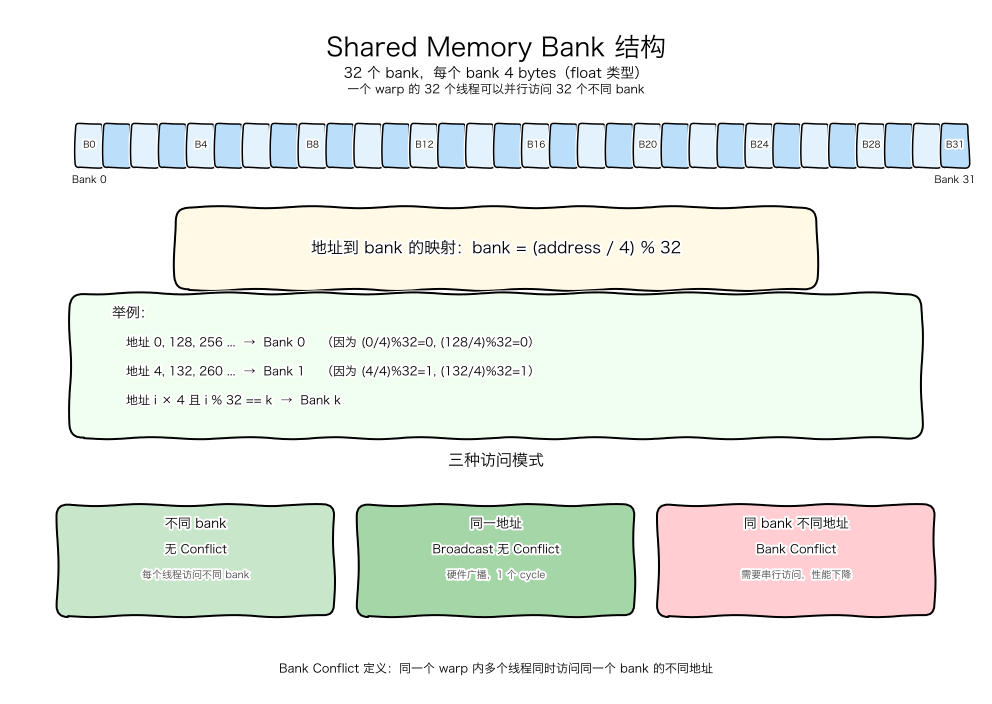
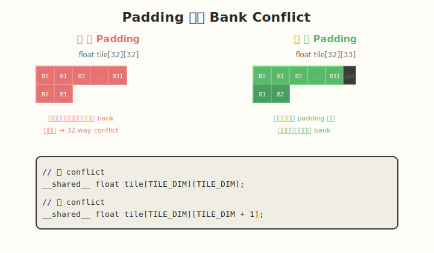

## Day 5：Bank Conflict 分析与实践

### 🎯 目标

通过今天的学习，你将：

1. 理解 Shared Memory 的 bank 结构
2. 能识别各种 bank conflict 模式
3. 掌握使用 padding 消除 bank conflict 的方法
4. 能用 Nsight Compute 检测 bank conflict
5. 理解 bank conflict 对性能的影响
6. 能把 bank conflict 优化应用到矩阵转置等实际场景

> 💡 **为什么重要**：Day 4 我们用 shared memory 做 tiling 优化，但如果 tile 设计不当，会引入 bank conflict，反而降低性能。bank conflict 是 shared memory 优化中最容易踩的坑之一。

---

### 学前导读：为什么 shared memory 需要 bank

Shared memory 位于 SM 内部，速度很快（~20-30 cycles）。为了支持高并发访问，它被分成多个 **bank**，每个 bank 可以独立读写。

**理想情况**：一个 warp 的 32 个线程同时访问 32 个不同的 bank，这样可以在 1 个 cycle 内完成。

**实际情况**：如果多个线程访问同一个 bank，就需要串行处理，这就是 **bank conflict**。

---

### 理论学习

#### 5.1 Shared Memory Bank 结构



- Shared memory 被划分为 **32 个 bank**（每 bank 4 bytes）。
- 地址到 bank 的映射公式：
 ```
 bank = (address / 4) % 32
 ```
- 一个 warp 内不同线程同时访问 **同一个 bank 的不同地址** 时，会发生 bank conflict。
- 访问同一个地址（broadcast）不会 conflict。

**举例**：
- 地址 0, 128, 256 都映射到 Bank 0（因为 `(0/4)%32=0`, `(128/4)%32=0`）
- 地址 4, 132, 260 都映射到 Bank 1
- 对于 `float` 数组，`tile[i][j]` 中固定 `j` 改变 `i` 时，如果 `j` 不变，所有元素都在同一个 bank

#### 5.2 Bank Conflict 的几种模式


**模式 1：无 Conflict（每个线程访问不同 bank）**
```cuda
// 线程 i 访问 bank i
float v = tile[threadIdx.x];
```
- 32 个线程访问 32 个不同 bank
- 1 个 cycle 完成

**模式 2：Broadcast（所有线程访问同一地址）**

```cuda
// 所有线程读同一个地址
float v = tile[0];
```

- 虽然这个地址属于 Bank 0，但 warp 内 32 个线程读的是**同一个地址**
- GPU 有专门的**广播（broadcast）机制**：把这个值一次性发送给所有线程
- **1 个 cycle 完成，不产生 bank conflict**

> **为什么同地址不算 conflict？**
> Bank conflict 的定义是：同一个 warp 内多个线程访问**同一个 bank 的不同地址**。
> 如果访问的是**同一个地址**，硬件会直接广播，不需要串行读取。

典型场景：
- 读取 shared memory 中的共享常量/标量（如 bias、scale）
- reduction 中读取某个 warp 的部分和
- 所有线程都需要同一个 tile 元素时

**一句话记忆**：同地址 → 广播（快，无 conflict）；同 bank 不同地址 → bank conflict（慢，串行）。

**模式 3：2-way Conflict**
```cuda
// 线程分成两组，访问两个不同地址但同一 bank
float v = tile[threadIdx.x % 2];
```
- 16 个线程访问 bank 0 的地址 0
- 16 个线程访问 bank 0 的地址 1？不对，%2 得到 0 或 1
- 实际上是 2 个地址，分别在 bank 0 和 bank 1
- 这是 2-way conflict

**模式 4：32-way Conflict（最坏情况）**
```cuda
// 所有线程访问同一个 bank 的不同地址
float v = tile[threadIdx.x * 32];
```
- 线程 0 访问地址 0 → bank 0
- 线程 1 访问地址 32 → bank 0
- 线程 2 访问地址 64 → bank 0
- ...
- 所有 32 个线程都访问 bank 0
- 需要 32 个 cycle 串行完成

#### 5.3 Padding 技术



**问题根源**：
在矩阵转置中，我们经常需要：
```cuda
__shared__ float tile[TILE_DIM][TILE_DIM];
```

然后按列读：`tile[threadIdx.x][i]`，这时同一列的所有元素都在同一个 bank。

**解决方法**：
在列维度加 1：
```cuda
#define TILE_DIM 32
__shared__ float tile[TILE_DIM][TILE_DIM + 1]; // +1 padding
```

**原理**：
- 原来 `tile[i][j]` 的地址是 `i * TILE_DIM + j`，同一列 `j` 固定时，地址间隔 `TILE_DIM * 4 = 128 bytes`，都是 bank 0
- 加 padding 后，地址是 `i * (TILE_DIM + 1) + j`，同一列相邻元素的地址差是 `33 * 4 = 132 bytes`
- `132 / 4 = 33`，`33 % 32 = 1`，所以相邻行同一列会错开 1 个 bank
- 这样 32 个线程访问同一列时，分别访问 32 个不同 bank

**Padding 的代价**：
- 少量 shared memory 浪费（这里浪费了 `32 * 4 = 128 bytes`）
- 但换来了无 conflict 的高速访问

---

### Coding 任务：Bank Conflict 对比实验

#### 任务 1：创建 bank_conflict.cu

创建文件 [kernels/bank_conflict.cu](kernels/bank_conflict.cu)：

```cuda
#include <cuda_runtime.h>
#include <stdio.h>
#include <stdlib.h>

#define TILE_DIM 32
#define BLOCK_ROWS 8

// 故意制造 bank conflict 的版本：tile[TILE_DIM][TILE_DIM]
__global__ void conflict_read(float* out, const float* in) {
 __shared__ float tile[TILE_DIM][TILE_DIM];

 int col = threadIdx.x;
 for (int row = 0; row < TILE_DIM; row += BLOCK_ROWS) {
 tile[row + threadIdx.y][col] = in[(row + threadIdx.y) * TILE_DIM + col];
 }
 __syncthreads();

 // 同一 warp 内线程访问同一 column，产生 bank conflict
 for (int row = 0; row < TILE_DIM; row += BLOCK_ROWS) {
 out[(row + threadIdx.y) * TILE_DIM + col] = tile[col][row + threadIdx.y];
 }
}

// 使用 padding 消除 bank conflict：tile[TILE_DIM][TILE_DIM + 1]
__global__ void no_conflict_read(float* out, const float* in) {
 __shared__ float tile[TILE_DIM][TILE_DIM + 1];

 int col = threadIdx.x;
 for (int row = 0; row < TILE_DIM; row += BLOCK_ROWS) {
 tile[row + threadIdx.y][col] = in[(row + threadIdx.y) * TILE_DIM + col];
 }
 __syncthreads();

 for (int row = 0; row < TILE_DIM; row += BLOCK_ROWS) {
 out[(row + threadIdx.y) * TILE_DIM + col] = tile[col][row + threadIdx.y];
 }
}

int main() {
 const int N = TILE_DIM * TILE_DIM;
 float *h_in = (float*)malloc(N * sizeof(float));
 float *h_out = (float*)malloc(N * sizeof(float));
 for (int i = 0; i < N; ++i) h_in[i] = (float)i;

 float *d_in, *d_out;
 cudaMalloc(&d_in, N * sizeof(float));
 cudaMalloc(&d_out, N * sizeof(float));
 cudaMemcpy(d_in, h_in, N * sizeof(float), cudaMemcpyHostToDevice);

 dim3 block(TILE_DIM, BLOCK_ROWS);
 dim3 grid(1, 1);

 conflict_read<<<grid, block>>>(d_out, d_in);
 cudaDeviceSynchronize();

 no_conflict_read<<<grid, block>>>(d_out, d_in);
 cudaDeviceSynchronize();

 printf("Bank conflict kernels finished. Use ncu to compare metrics.\n");

 free(h_in);
 free(h_out);
 cudaFree(d_in);
 cudaFree(d_out);
 return 0;
}
```

#### 任务 2：编译运行

```bash
nvcc -o bank_conflict kernels/bank_conflict.cu
./bank_conflict
```

#### 任务 3：使用 ncu 检测 bank conflict

```bash
ncu \
 --metrics \
 l1tex__data_bank_conflicts_pipe_lsu_mem_shared_op_ld.sum,\
 l1tex__data_bank_conflicts_pipe_lsu_mem_shared_op_st.sum,\
 sm__cycles_elapsed.avg,\
 sm__throughput.avg.pct_of_peak_sustained_elapsed \
 ./bank_conflict
```

**预期结果**：
- `conflict_read` 的 bank conflict 数值远高于 `no_conflict_read`
- `conflict_read` 的执行 cycles 明显更多

#### 任务 4：LeetGPU 在线题目 —— Reduction

**题目链接**：<https://leetgpu.com/challenges/reduction>

**题目概述**：

给定长度为 N 的浮点数组 input，计算所有元素的总和：sum = input[0] + input[1] + ... + input[N-1]。

**约束条件**：`1 ≤ N ≤ 100,000,000`，数组元素范围 `[-1000.0, 1000.0]`，结果不会溢出 float

**难度**：中等　**标签**：CUDA、Parallel Reduction、Shared Memory、Warp Shuffle、Bank Conflict

**与今日知识的关联**：

本题是并行归约的经典题，核心难点在于跨 warp 的归约需要 Shared Memory 中转，而这正是 bank conflict 的高发区。用 Day 5 学的 padding 技巧消除 conflict，用 ncu 对比优化前后 bank conflict 计数。

**解题思路**：

两阶段归约：grid-stride loop 做线程级累加 → Warp Shuffle 做 warp 内归约 → Shared Memory 中转 → Warp 0 做最终归约。关注 Shared Memory 访问模式是否产生 bank conflict。

**参考实现**：

```cuda
__global__ void reduction_kernel(const float* input, float* output, int N) {
 __shared__ float warpSums[32];

 int tid = blockIdx.x * blockDim.x + threadIdx.x;
 int lane = threadIdx.x & 31;
 int wid = threadIdx.x >> 5;

 // grid-stride 累加
 float sum = 0.0f;
 for (int i = tid; i < N; i += gridDim.x * blockDim.x)
 sum += input[i];

 // Warp 级归约 (Shuffle，无 bank conflict)
 for (int offset = 16; offset > 0; offset >>= 1)
 sum += __shfl_down_sync(0xFFFFFFFF, sum, offset);

 // warp 部分和写入 shared memory (这里注意 bank conflict)
 if (lane == 0) warpSums[wid] = sum;
 __syncthreads();

 // Warp 0 做最终归约
 if (wid == 0) {
 int numWarps = (blockDim.x + 31) / 32;
 sum = (lane < numWarps) ? warpSums[lane] : 0.0f;
 for (int offset = 16; offset > 0; offset >>= 1)
 sum += __shfl_down_sync(0xFFFFFFFF, sum, offset);
 if (lane == 0) output[blockIdx.x] = sum;
 }
}
```

> 💡 提交后在 [LeetGPU Reduction 题目](https://leetgpu.com/challenges/reduction)上记录通过耗时，用 ncu 对比不同 block size / tile size 的性能差异。完整题解见 [Reduction 题解](../../leetgpu/week1/day5/leetgpu-reduction-solution.md)。

#### 任务 5：LeetCode 面试题 —— 二叉树的最近公共祖先

**题目链接**：[236. 二叉树的最近公共祖先](https://leetcode.cn/problems/lowest-common-ancestor-of-a-binary-tree/)

**题目概述**：

给定二叉树及两个节点 `p` 和 `q`，找到它们的最近公共祖先（LCA）。

**与今日知识的关联**：

本题核心是**后序 DFS 递归**——左右子树分别查找，汇总结果做决策。这与今天 Bank Conflict 的思路呼应：bank conflict 是多个线程访问同一 bank 导致串行化，需要 padding 错开访问；LCA 递归是左右子树各自搜索再汇总，如果某侧找到就向上传递——都是**多路并行探索 + 汇总决策**的模式（GPU warp 内多 lane 并行 + reduce 汇总）。

**核心套路**：

```
dfs(root, p, q):
 if root==null or root==p or root==q: return root
 left = dfs(root.left, p, q)
 right = dfs(root.right, p, q)
 if left and right: return root // p,q 分布在两侧
 return left ?: right
```

> 💡 完整题解（含 C++/Python 参考代码、复杂度分析、面试要点）见 [二叉树的最近公共祖先题解](../../../leetcode/daily/week1/day5/二叉树的最近公共祖先.md)。

---

### 扩展实验

#### 实验 1：不同 stride 的 bank conflict

测试以下访问模式，观察 bank conflict 程度：

```cuda
// 访问模式 1：无 conflict
float v = tile[threadIdx.x];

// 访问模式 2：2-way conflict
float v = tile[threadIdx.x % 2];

// 访问模式 3：4-way conflict
float v = tile[threadIdx.x % 4];

// 访问模式 4：32-way conflict（最坏）
float v = tile[threadIdx.x * 32];
```

记录每个模式的 bank conflict 计数和执行时间。

#### 实验 2：应用到矩阵转置

回到 Day 4 的矩阵转置代码，把 tile 从：
```cuda
__shared__ float tile[TILE_DIM][TILE_DIM];
```
改为：
```cuda
__shared__ float tile[TILE_DIM][TILE_DIM + 1];
```

对比修改前后的：
- bank conflict 计数
- memory throughput
- 总执行时间

#### 实验 3：不同 padding 大小

尝试不同的 padding：
```cuda
__shared__ float tile[TILE_DIM][TILE_DIM + 1];
__shared__ float tile[TILE_DIM][TILE_DIM + 2];
__shared__ float tile[TILE_DIM][TILE_DIM + 4];
```

观察：
- 是否都能消除 bank conflict？
- 哪种 padding 的 shared memory 利用率最高？

### 验证 Checklist

- [ ] 理解 shared memory 的 bank 结构
- [ ] 能手动计算地址对应的 bank 编号
- [ ] 能识别 2-way、4-way、32-way bank conflict
- [ ] 实现 conflict 和 no-conflict 两个版本的 kernel
- [ ] Nsight Compute 中观察到 bank conflict 数值变化
- [ ] 冲突版本比无冲突版本慢 2x 以上
- [ ] 理解 padding 的原理和代价
- [ ] 能把 padding 应用到矩阵转置中

---

### 今日总结

Day 5 我们深入理解了 Shared Memory 的 bank conflict：

1. **Bank 结构**：32 个 bank，每 bank 4 bytes，地址映射为 `bank = (addr/4) % 32`
2. **Conflict 条件**：一个 warp 内多个线程访问同一 bank 的不同地址
3. **Broadcast 例外**：访问同一地址不 conflict
4. **Padding 技术**：在列维度加 1，让同一列的数据错开 bank
5. **检测方法**：用 Nsight Compute 的 `l1tex__data_bank_conflicts_pipe_lsu_mem_shared_op_ld.sum`
6. **实际应用**：矩阵转置等 shared memory tiling 场景必须考虑 bank conflict

掌握这些后，你才能安全地使用 shared memory 做性能优化，避免"优化了全局内存，却掉进 bank conflict 的坑"。

---

### 面试要点

1. **Shared memory 有多少个 bank？每个 bank 多大？**

<details>
<summary>点击查看答案</summary>

 - 32 个 bank，每个 bank 4 bytes（现代 GPU）

</details>


1. **什么样的访问模式会产生 bank conflict？**

<details>
<summary>点击查看答案</summary>

 - 一个 warp 内多个线程同时访问同一个 bank 的不同地址
 - 典型例子：`tile[threadIdx.x * 32]` 让所有线程访问 bank 0

</details>


1. **Padding 的代价是什么？**

<details>
<summary>点击查看答案</summary>

 - 少量 shared memory 浪费
 - 但换来无 conflict 的高速访问

</details>


1. **Broadcast 会产生 bank conflict 吗？**

<details>
<summary>点击查看答案</summary>

 - 不会。GPU 有专门的广播机制，一个 warp 内多个线程读同一地址是 1 个 cycle

</details>


1. **如何检测 bank conflict？**

<details>
<summary>点击查看答案</summary>

 - Nsight Compute：`l1tex__data_bank_conflicts_pipe_lsu_mem_shared_op_ld.sum`
 - 观察执行 cycles 和 shared memory throughput

</details>


1. **矩阵转置为什么要加 padding？**

<details>
<summary>点击查看答案</summary>

 - 无 padding 时，tile 同一列的数据都在同一个 bank
 - 转置时需要按列读取，导致 32-way bank conflict
 - 加 padding 后同一列数据错开 bank，避免 conflict

---

</details>

