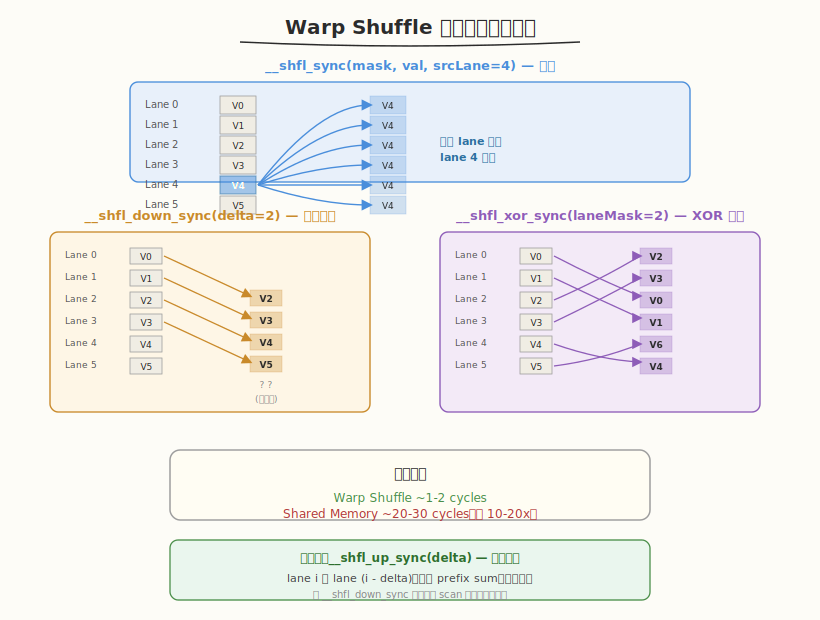
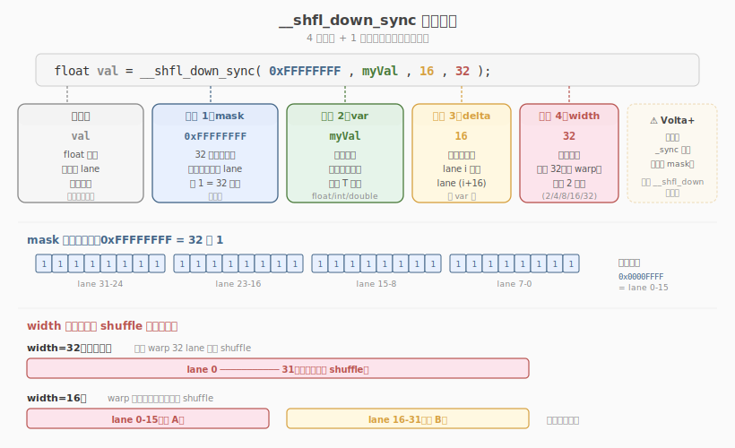
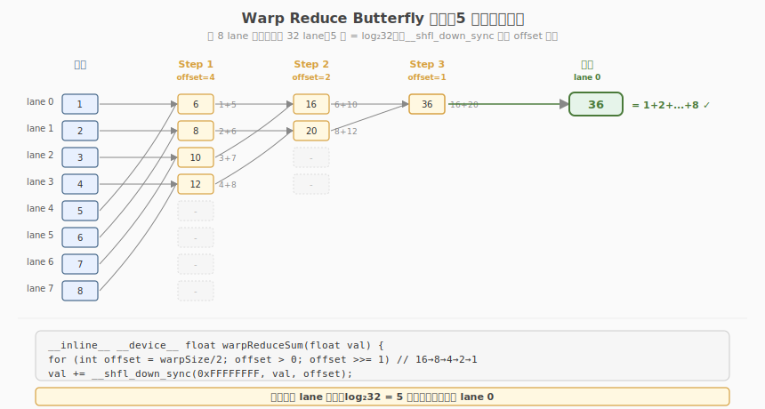

## Day 1：Warp Shuffle 原语与 Warp/Block Reduce

### 🎯 目标

通过今天的学习，你将：

1. 理解 Warp Shuffle 的硬件原理和相比 Shared Memory 的延迟优势
2. 掌握 `__shfl_sync`、`__shfl_up_sync`、`__shfl_down_sync`、`__shfl_xor_sync` 四个原语
3. 理解 Butterfly 模式归约的 5 步通信过程
4. 手写完整的 Warp Reduce + Block Reduce 两级归约 Kernel
5. 理解为什么需要两级归约，以及第二级归约为什么也用 Warp Shuffle

> 💡 **为什么重要**：Warp Shuffle 是手写 Reduce、Scan、GEMM 写回优化的标配技术，也是面试中「手写 Block Reduce」的核心考点。它比 Shared Memory 快一个数量级，是 GPU 内部最快的线程间通信方式。

---

### 学前导读：为什么需要 Warp 级通信

在 Week 1 中，我们学习了 Shared Memory 作为 block 内线程共享数据的手段。但在很多场景下，通信只发生在 **同一个 Warp 内的 32 个线程之间**，此时 Shared Memory 并不是最优选择。

#### Shared Memory 的局限

Shared Memory 虽然比 Global Memory 快得多（~20-30 cycles vs ~400-800 cycles），但它仍然有几个开销：

1. **需要同步**：写 Shared Memory 后必须调用 `__syncthreads()` 保证可见性
2. **需要两条指令**：先 store 到 Shared Memory，再 load 从 Shared Memory
3. **延迟仍有 20-30 cycles**：对于高频的 Warp 内通信，这个延迟不可忽略

#### Warp Shuffle 的优势

从 Blackwell 架构（Compute Capability 12.0）起，NVIDIA 引入了 Warp Shuffle 原语，允许同一 Warp 内的线程**直接交换寄存器数据**，无需经过 Shared Memory：

| 通信方式 | 延迟（周期） | 是否需要 `__syncthreads()` | 指令数 | 适用场景 |
|---------|------------|-------------------------|--------|---------|
| Shared Memory 中转 | ~20-30 cycles | 是（需同步） | ≥ 2 条（store + load） | Block 级通信（跨 Warp） |
| **Warp Shuffle 直连** | **~1-2 cycles** | **否（硬件同步）** | **1 条** | **Warp 内通信（32 线程）** |
| Register 直连 | ~0 cycles | 否 | 0 | 同一线程内复用 |

**核心洞察**：Shuffle 的延迟比 Shared Memory 低一个数量级，因为它直接通过 Warp 内部的专用交换网络传输数据，无需经过 Shared Memory 的读写路径。

> 💡 **一句话总结**：Warp Shuffle 是 GPU 内部最快的线程间通信方式，比 Shared Memory 快 10-20 倍，但仅限于同一 Warp 内的 32 个线程。

---

### 理论学习

#### 1.1 Warp Shuffle 四大家族



CUDA 提供了四个 Warp Shuffle 原语，分别对应不同的通信模式：

| 原语名称 | 函数签名 | 作用描述 | 使用场景 |
|---------|---------|---------|---------|
| `__shfl_sync` | `T __shfl_sync(unsigned mask, T var, int srcLane, int width=warpSize)` | 从 `srcLane` 线程读取 `var` 值 | 广播：线程 0 的结果广播给 Warp 内所有线程 |
| `__shfl_up_sync` | `T __shfl_up_sync(unsigned mask, T var, unsigned int delta, int width=warpSize)` | 从 `threadIdx-delta` 线程读取 | 前缀和：每个线程获取左侧 delta 距离线程的值 |
| `__shfl_down_sync` | `T __shfl_down_sync(unsigned mask, T var, unsigned int delta, int width=warpSize)` | 从 `threadIdx+delta` 线程读取 | 归约：Warp 内折半累加 |
| `__shfl_xor_sync` | `T __shfl_xor_sync(unsigned mask, T var, int laneMask, int width=warpSize)` | 从 `threadIdx ^ laneMask` 线程读取 | Butterfly 交换：归约、位反转排序 |

##### 四个原语的数据流向图

```
__shfl_sync(mask, val, srcLane=4):
 Lane: 0 1 2 3 4 5 6 7 ... 31
 数据: ? ? ? ? V4 ? ? ? ... ?
 结果: V4 V4 V4 V4 V4 V4 V4 V4 ... V4 ← 所有 lane 都得到 lane 4 的值

__shfl_up_sync(mask, val, delta=2):
 Lane: 0 1 2 3 4 5 6 7 ... 31
 数据: V0 V1 V2 V3 V4 V5 V6 V7 ... V31
 结果: V0 V1 V0 V1 V2 V3 V4 V5 ... V29 ← 每个 lane 从上方 delta 处取值

__shfl_down_sync(mask, val, delta=2):
 Lane: 0 1 2 3 4 5 6 7 ... 31
 数据: V0 V1 V2 V3 V4 V5 V6 V7 ... V31
 结果: V2 V3 V4 V5 V6 V7 V8 V9 ... ? ← 每个 lane 从下方 delta 处取值

__shfl_xor_sync(mask, val, laneMask=2):
 Lane: 0 1 2 3 4 5 6 7 ... 31
 交换: 2 3 0 1 6 7 4 5 ... 29 ← lane i 与 lane (i^2) 交换
```

#### 1.2 参数详解

以 `__shfl_down_sync` 为例，它有四个参数：



```cpp
float val = __shfl_down_sync(0xFFFFFFFF, myVal, 16, 32);
// ↑ ↑ ↑ ↑ ↑
// 返回值 mask var delta width
```

##### mask 参数详解

`mask` 是一个 32 位无符号整数，每一位对应 Warp 内的一个 lane（线程）：

- `0xFFFFFFFF`（全部 32 位为 1）：表示 Warp 内所有 32 个线程都参与
- `0x0000FFFF`：表示只有 lane 0-15 参与
- `0xFFFF0000`：表示只有 lane 16-31 参与

> ⚠️ **注意**：从 Blackwell 架构（CC 12.0）开始，必须使用 `_sync` 后缀版本（带显式 mask）。旧版 `__shfl_down`（无 mask）已被弃用，因为 Blackwell 引入了独立线程调度，需要显式指定哪些线程参与 shuffle。

##### width 参数详解

`width` 控制 shuffle 操作的分组宽度，必须是 2 的幂（2, 4, 8, 16, 32）：

```cpp
// width=32（默认）：整个 Warp 一起 shuffle
val = __shfl_down_sync(0xFFFFFFFF, val, 1, 32); // lane 0 读 lane 1

// width=16：Warp 分成两组（lane 0-15, lane 16-31），各自独立 shuffle
val = __shfl_down_sync(0xFFFFFFFF, val, 1, 16); // lane 0 读 lane 1，lane 16 读 lane 17
```

#### 1.3 Warp Reduce Butterfly 模式



Warp Reduce（求和）使用 `__shfl_down_sync` 实现折半累加，整个过程像蝴蝶展翅，因此称为 **Butterfly 模式**：

```
Step 1 (offset=16): lane0 <- lane0+lane16, lane1 <- lane1+lane17, ... lane15 <- lane15+lane31
Step 2 (offset=8): lane0 <- lane0+lane8, lane1 <- lane1+lane9, ... lane7 <- lane7+lane15
Step 3 (offset=4): lane0 <- lane0+lane4, lane1 <- lane1+lane5, ... lane3 <- lane3+lane7
Step 4 (offset=2): lane0 <- lane0+lane2, lane1 <- lane1+lane3
Step 5 (offset=1): lane0 <- lane0+lane1
Result: lane 0 持有 Warp 内 32 个线程的累加和
```

5 步操作（`log₂32 = 5`）即可完成 32 个线程的归约，每步只需 1 条 shuffle 指令。

对应的代码：

```cuda
__inline__ __device__ float warpReduceSum(float val) {
 #pragma unroll
 for (int offset = warpSize / 2; offset > 0; offset >>= 1) {
 val += __shfl_down_sync(0xFFFFFFFF, val, offset);
 }
 return val;
}
```

##### `__shfl_down_sync` vs `__shfl_xor_sync` 的区别

两者都能实现归约，但有一个关键区别：

| 原语 | 归约后哪些 lane 有结果 | 适用场景 |
|------|---------------------|---------|
| `__shfl_down_sync` | **只有 lane 0** 有最终结果 | 只需要一个结果的归约 |
| `__shfl_xor_sync` | **所有 lane** 都有最终结果 | 需要所有线程都知道归约结果的场景（如 broadcast） |

```cuda
// down 模式：只有 lane 0 有结果
__inline__ __device__ float warpReduceSum(float val) {
 for (int offset = 16; offset > 0; offset >>= 1)
 val += __shfl_down_sync(0xFFFFFFFF, val, offset);
 return val; // 只有 lane 0 的 val 是完整的
}

// xor 模式：所有 lane 都有结果
__inline__ __device__ float warpReduceSumAll(float val) {
 for (int offset = 16; offset > 0; offset >>= 1)
 val += __shfl_xor_sync(0xFFFFFFFF, val, offset);
 return val; // 所有 lane 的 val 都是完整的
}
```

#### 1.4 两级归约：Warp Reduce + Block Reduce


##### 为什么需要两级归约？

单个 Warp 只有 32 个线程。但一个 Block 可能有 1024 个线程（32 个 Warp）。Warp 级归约只解决 32 线程的汇总，Block 级需要将 32 个 Warp 的结果再做一次汇总。

##### 两级归约的执行流程

```
Block (1024 threads = 32 warps)
│
├── Step 1: 每个线程从 Global Memory 读取并做 per-thread 累加
│ (使用 grid-stride loop 处理大数组)
│
├── Step 2: Warp 级归约（每个 Warp 的 32 个线程累加到 lane 0）
│ 使用 __shfl_down_sync 的 butterfly 模式
│
├── Step 3: lane 0 将 Warp 的部分和写入 Shared Memory
│ warpSums[0], warpSums[1], ..., warpSums[31]
│ __syncthreads() ← 等待所有 Warp 完成
│
└── Step 4: Warp 0 做最终归约
 lane 0~31 读取 warpSums[0]~warpSums[31]
 再执行一次 warpReduceSum
 lane 0 写入最终结果到 Global Memory
```

##### 为什么第二级归约也用 Warp Shuffle？

因为 Warp 0 有 32 个 lane，正好处理最多 32 个 Warp 的部分和。用 `__shfl_down_sync` 做第二级归约比用 Shared Memory 循环更快。

> 💡 **核心记忆点**：两级归约 = Warp Shuffle（快路径，处理 32 线程）+ Shared Memory 中转（慢路径，处理跨 Warp）+ Warp 0 二次 Shuffle（最终汇总）。

---

### Coding 任务：手写 Warp Reduce Kernel

#### 任务 1：创建 warp_reduce.cu

创建文件 [kernels/warp_reduce.cu](kernels/warp_reduce.cu)：

```cuda
// warp_reduce.cu —— Warp 级 + Block 级两级归约完整实现
// 编译命令: nvcc -o warp_reduce warp_reduce.cu -O3 -arch=sm_120
// 运行命令: ./warp_reduce

#include <cuda_runtime.h>
#include <cstdio>
#include <cstdlib>
#include <cmath>
#include <ctime>

// --------------------------------------------------
// Warp 级归约：使用 __shfl_down_sync 折半累加
// --------------------------------------------------
__inline__ __device__ float warpReduceSum(float val) {
 #pragma unroll
 for (int offset = warpSize / 2; offset > 0; offset >>= 1) {
 val += __shfl_down_sync(0xFFFFFFFF, val, offset);
 }
 return val;
}

// --------------------------------------------------
// Warp 级归约（XOR 模式）：使用 __shfl_xor_sync
// 用途：when you need reduction result in ALL lanes, not just lane 0
// --------------------------------------------------
__inline__ __device__ float warpReduceSumXor(float val) {
 #pragma unroll
 for (int offset = warpSize / 2; offset > 0; offset >>= 1) {
 val += __shfl_xor_sync(0xFFFFFFFF, val, offset);
 }
 return val;
}

// --------------------------------------------------
// Block 级归约：每个 warp 先归约，然后 warp 0 做最终归约
// --------------------------------------------------
__global__ void blockReduceSum(const float* input, float* output, int n) {
 __shared__ float warpSums[32];

 int tid = blockIdx.x * blockDim.x + threadIdx.x;
 int lane = threadIdx.x % warpSize;
 int wid = threadIdx.x / warpSize;

 // Step 1: 每个线程从 global memory 读取并做 per-thread 累加
 float sum = 0.0f;
 #pragma unroll 4
 for (int i = tid; i < n; i += blockDim.x * gridDim.x) {
 sum += input[i];
 }

 // Step 2: Warp 级归约（每个 warp 的 32 个线程累加到 lane 0）
 sum = warpReduceSum(sum);

 // Step 3: lane 0 将 warp 的部分和写入 shared memory
 if (lane == 0) {
 warpSums[wid] = sum;
 }
 __syncthreads();

 // Step 4: Warp 0 做最终归约
 if (wid == 0) {
 int numWarps = (blockDim.x + warpSize - 1) / warpSize;
 sum = (lane < numWarps) ? warpSums[lane] : 0.0f;
 sum = warpReduceSum(sum);
 if (lane == 0) {
 output[blockIdx.x] = sum;
 }
 }
}

// --------------------------------------------------
// 多 block 版本：需要第二次 kernel 调用汇总
// --------------------------------------------------
float launchReduce(const float* d_input, float* d_temp, float* d_output,
 int n, int threadsPerBlock) {
 int blocks = (n + threadsPerBlock - 1) / threadsPerBlock;
 blocks = min(blocks, 1024);

 blockReduceSum<<<blocks, threadsPerBlock>>>(d_input, d_temp, n);
 cudaDeviceSynchronize();

 blockReduceSum<<<1, 256>>>(d_temp, d_output, blocks);
 cudaDeviceSynchronize();

 float result;
 cudaMemcpy(&result, d_output, sizeof(float), cudaMemcpyDeviceToHost);
 return result;
}

// --------------------------------------------------
// Host 辅助函数
// --------------------------------------------------
void initData(float* data, int n) {
 srand(42);
 for (int i = 0; i < n; i++) {
 data[i] = static_cast<float>(rand()) / RAND_MAX * 0.01f;
 }
}

float cpuReduceSum(const float* data, int n) {
 double sum = 0.0;
 for (int i = 0; i < n; i++) {
 sum += data[i];
 }
 return static_cast<float>(sum);
}

int main() {
 const int n = 1 << 22; // 4,194,304 个元素
 printf("=== Warp Shuffle Block Reduce ===\n");
 printf("Array size: %d (%.2f MB)\n", n, n * sizeof(float) / (1024.0 * 1024.0));

 float* h_input = (float*)malloc(n * sizeof(float));
 initData(h_input, n);

 float *d_input, *d_temp, *d_output;
 cudaMalloc(&d_input, n * sizeof(float));
 cudaMalloc(&d_temp, 1024 * sizeof(float));
 cudaMalloc(&d_output, sizeof(float));
 cudaMemcpy(d_input, h_input, n * sizeof(float), cudaMemcpyHostToDevice);

 cudaEvent_t start, stop;
 cudaEventCreate(&start);
 cudaEventCreate(&stop);

 cudaEventRecord(start);
 float gpuSum = launchReduce(d_input, d_temp, d_output, n, 256);
 cudaEventRecord(stop);
 cudaEventSynchronize(stop);

 float ms;
 cudaEventElapsedTime(&ms, start, stop);

 float cpuSum = cpuReduceSum(h_input, n);
 float diff = fabs(gpuSum - cpuSum);

 printf("GPU Sum: %.6f\n", gpuSum);
 printf("CPU Sum: %.6f\n", cpuSum);
 printf("Diff: %.6f (%s)\n", diff, diff < 1e-3 ? "PASS" : "FAIL");
 printf("Time: %.3f ms (%.2f GB/s bandwidth)\n",
 ms, n * sizeof(float) / (ms * 1e6));

 free(h_input);
 cudaFree(d_input); cudaFree(d_temp); cudaFree(d_output);
 cudaEventDestroy(start); cudaEventDestroy(stop);

 return 0;
}
```

#### 任务 2：编译与运行

```bash
# 编译（根据 GPU 架构选择 arch 参数）
# Blackwell (RTX 5090): sm_120
# Blackwell (RTX 5090): sm_120
# Blackwell (RTX 5090): sm_120
nvcc -o warp_reduce kernels/warp_reduce.cu -O3 -arch=sm_120

# 运行
./warp_reduce
```

**预期输出**：

```
=== Warp Shuffle Block Reduce ===
Array size: 4194304 (16.00 MB)
GPU Sum: 20973.4xxxx
CPU Sum: 20973.4xxxx
Diff: 0.00xxxx (PASS)
Time: 0.xxx ms (xx.xx GB/s bandwidth)
```

#### 任务 3：使用 ncu 查看 Warp Shuffle 效率

```bash
ncu \
 --metrics \
 sm__occupancy.avg.pct_of_peak_sustained_elapsed,\
 sm__throughput.avg.pct_of_peak_sustained_elapsed,\
 launch__registers_per_thread \
 ./warp_reduce
```

**观察重点**：
- Occupancy 应该较高（因为 kernel 使用的寄存器和 Shared Memory 都很少）
- 执行时间应该非常短（因为 Shuffle 延迟极低）

#### 为什么 grid-stride loop 能处理大数组？

代码中有这样一段循环：

```cuda
for (int i = tid; i < n; i += blockDim.x * gridDim.x) {
 sum += input[i];
}
```

这叫 **grid-stride loop**（网格步长循环）。当数组大小 `n` 远大于总线程数（`blockDim.x * gridDim.x`）时，每个线程需要处理多个元素。

```
假设 n = 4194304, threadsPerBlock = 256, blocks = 1024
总线程数 = 256 × 1024 = 262144
每个线程处理 n / 262144 ≈ 16 个元素

线程 0 处理: input[0], input[262144], input[524288], ...
线程 1 处理: input[1], input[262145], input[524289], ...
```

grid-stride loop 的好处：
1. **不限制数组大小**：无论 `n` 多大都能处理
2. **coalesced access**：相邻线程访问相邻地址（步长 = 1）
3. **自动负载均衡**：每个线程处理的元素数相近

#### 任务 4：LeetGPU 在线题目 —— Prefix Sum

**题目链接**：<https://leetgpu.com/challenges/prefix-sum>

**题目概述**：

给定长度为 N 的 32-bit 浮点数组 input，计算其 inclusive prefix sum：output[i] = input[0] + input[1] + ... + input[i]。

**约束条件**：`1 ≤ N ≤ 100,000,000`，数值范围 `[-1000.0, 1000.0]`，结果不会溢出 float

**难度**：中等　**标签**：CUDA、Scan、Prefix Sum、Warp Shuffle、__shfl_up_sync

**与今日知识的关联**：

本题是 scan（扫描）问题，核心是 `__shfl_up_sync` 原语的应用。Day 1 学了 `__shfl_down_sync` 做归约，本题用 `__shfl_up_sync` 做前缀和，两者是对称的 butterfly 操作。需要 block 内 scan + 跨 block 偏移累加。

**解题思路**：

三阶段：(1) block 内 exclusive scan 用 `__shfl_up_sync`（5 步 butterfly）+ Shared Memory 中转；(2) 对所有 block 的总和做一次 scan 得到全局偏移；(3) 把全局偏移加回 block 内每个元素。

**参考实现**：

```cuda
#define BLOCK_SIZE 256

// Warp 内 exclusive scan (Hillis-Steele), 使用 __shfl_up_sync
__inline__ __device__ float warp_exclusive_scan(float val) {
 float prefix = 0.0f;
 #pragma unroll
 for (int offset = 1; offset < 32; offset <<= 1) {
 float n = __shfl_up_sync(0xFFFFFFFF, val, offset);
 if (threadIdx.x % 32 >= offset)
 val += n;
 }
 // exclusive: 当前线程的 inclusive 和减去自身
 float inclusive = val;
 float prev = __shfl_up_sync(0xFFFFFFFF, inclusive, 1);
 return (threadIdx.x % 32 == 0) ? 0.0f : prev;
}
```

> 💡 提交后在 [LeetGPU Prefix Sum 题目](https://leetgpu.com/challenges/prefix-sum)上记录通过耗时，用 ncu 对比不同参数的性能差异。完整题解见 [Prefix Sum 题解](../../leetgpu/week2/day1/leetgpu-prefix-sum-solution.md)。

#### 任务 5：LeetCode 面试题 —— 两数之和

**题目链接**：[1. 两数之和](https://leetcode.cn/problems/two-sum/)

**题目概述**：

给定一个整数数组 `nums` 和一个整数 `target`，在数组中找出和为 `target` 的两个整数，返回它们的下标。每种输入只有一个答案，且不能使用同一元素两次。

**与今日知识的关联**：

本题核心套路是 **哈希表一次遍历**——边遍历边查补数 `target - nums[i]`，把 O(n²) 暴力双循环降到 O(n)。虽然不涉及 GPU/CUDA，但哈希表是算法面试最高频的数据结构之一，与今天"Warp Shuffle 做高效查表/广播"的思路形成对照：GPU 用硬件原语做 Warp 内通信，CPU 用哈希表做 O(1) 查找，本质都是"用额外空间换时间"。

**核心套路**：

```
遍历 nums[i] 时，检查 target - nums[i] 是否已在哈希表中：
 - 在 → 返回 {hash[target-nums[i]], i}
 - 不在 → 把 nums[i] → i 存入哈希表
```

> 💡 完整题解（含 C++/Python 参考代码、复杂度分析、面试要点）见 [两数之和题解](../../../leetcode/daily/week2/day1/两数之和.md)。

---

### 扩展实验

#### 实验 1：`__shfl_down_sync` vs `__shfl_xor_sync`

修改 `warpReduceSum`，分别使用 `__shfl_down_sync` 和 `__shfl_xor_sync`，在归约后打印所有 lane 的值：

```cuda
// 验证：down 模式只有 lane 0 有结果，xor 模式所有 lane 都有结果
sum = warpReduceSum(sum); // down 模式
if (lane < 4) printf("down: lane %d = %f\n", lane, sum);

sum = warpReduceSumXor(sum); // xor 模式
if (lane < 4) printf("xor: lane %d = %f\n", lane, sum);
```

**预期结果**：
- `down` 模式：只有 lane 0 有正确的累加和，其他 lane 的值是部分和
- `xor` 模式：所有 lane 都有相同的完整累加和

#### 实验 2：实现 Warp Reduce Max

将 `warpReduceSum` 改为求最大值的版本：

```cuda
__inline__ __device__ float warpReduceMax(float val) {
 #pragma unroll
 for (int offset = warpSize / 2; offset > 0; offset >>= 1) {
 val = fmaxf(val, __shfl_down_sync(0xFFFFFFFF, val, offset));
 }
 return val;
}
```

用这个函数找出数组中的最大元素，与 CPU 结果对比。

#### 实验 3：Segmented Warp Reduce

使用 mask 参数实现分组归约：同一个 Warp 内分两组（lane 0-15 和 lane 16-31），各自独立归约。

```cuda
// mask=0x0000FFFF 表示只激活 lane 0-15
// mask=0xFFFF0000 表示只激活 lane 16-31
float val = __shfl_down_sync(0x0000FFFF, val, offset); // lane 0-15 内部归约
float val = __shfl_down_sync(0xFFFF0000, val, offset); // lane 16-31 内部归约
```

思考：mask 参数的作用是什么？在什么场景下需要部分 Warp 参与？

### 验证 Checklist

- [ ] 能解释 `__shfl_down_sync` 四个参数的含义（mask, val, delta, width）
- [ ] 能画出 Warp 内 32 线程执行 shuffle butterfly 的 5 步通信图（offset=16→8→4→2→1）
- [ ] Warp Reduce 代码编译运行正确，GPU 结果与 CPU 对比误差 < 1e-3
- [ ] 能解释 `0xFFFFFFFF` 的含义：32 位掩码，激活 Warp 内所有 32 个 lane
- [ ] 能解释为什么两级归约需要 `__syncthreads()`（Warp 间同步点）
- [ ] 能说出 `__shfl_down_sync` 和 `__shfl_xor_sync` 的区别（down=单向偏移，xor=蝴蝶交换）
- [ ] 理解 Blackwell+ 架构必须使用 `_sync` 版本的原因（独立线程调度需要显式 mask）

---

### 今日总结

Day 1 我们掌握了 Warp Shuffle 这一 GPU 内最快的线程间通信原语：

1. **Warp Shuffle 四大家族**：`__shfl_sync`（广播）、`__shfl_up_sync`（前缀和）、`__shfl_down_sync`（归约）、`__shfl_xor_sync`（Butterfly 交换）
2. **延迟优势**：Shuffle 延迟 ~1-2 cycles，比 Shared Memory（~20-30 cycles）快 10-20 倍
3. **Butterfly 归约**：5 步 `__shfl_down_sync`（offset=16→8→4→2→1）完成 32 线程归约
4. **两级归约**：Warp 级 Shuffle → Shared Memory 中转 → Warp 0 二次 Shuffle
5. **grid-stride loop**：处理大数组的标准模式，保证 coalesced access
6. **mask 参数**：控制哪些 lane 参与 shuffle，可实现 segmented reduce

掌握这些后，你就拥有了手写高性能 Reduce、Scan、Broadcast 的核心工具。

---

### 面试要点

1. **`__shfl_down_sync(0xFFFFFFFF, val, 16)` 的四个参数分别是什么含义？`0xFFFFFFFF` 可以换成其他值吗？**

<details>
<summary>点击查看答案</summary>

 - 参数 1 `mask=0xFFFFFFFF`：32 位线程掩码，每一位对应一个 lane。`0xFFFFFFFF` 表示全部 32 个 lane 参与。可以换成其他值实现部分 Warp 操作（如 segmented reduce）
 - 参数 2 `val`：要传递的本线程变量值
 - 参数 3 `delta=16`：目标 lane 的偏移量，即读取 `(laneId + delta) % width` 线程的值
 - 参数 4（省略，默认 32）`width`：参与 shuffle 的宽度，默认 32（整个 Warp）
 - 注意：从 Blackwell 架构开始必须使用 `_sync` 后缀版本（显式 mask），旧版 `__shfl_down` 已被弃用

</details>


2. **为什么 Warp Shuffle 比 Shared Memory 更适合做 Warp 内归约？实际延迟差距有多大？**

<details>
<summary>点击查看答案</summary>

 - **延迟差距**：Shuffle 延迟约 1-2 cycles，Shared Memory 访问延迟约 20-30 cycles，差距约 10-20 倍
 - **原因 1（硬件路径）**：Shuffle 通过 Warp 内部的专用交换网络直接从源寄存器读取数据，不经过 Shared Memory 的读写路径
 - **原因 2（无需同步）**：Shuffle 在 Warp 内部是隐式同步的（SIMT 执行模型保证 Warp 内线程同步），不需要 `__syncthreads()`；Shared Memory 方式需要 `__syncthreads()` 保证数据可见性
 - **原因 3（指令数少）**：Shuffle 是一条指令完成读+交换；Shared Memory 需要至少两条指令（store + load）
 - **局限**：Shuffle 只适用于 Warp 内（最多 32 线程），跨 Warp 通信仍需 Shared Memory

</details>


3. **为什么需要两级归约？谁来做第二级归约？**

<details>
<summary>点击查看答案</summary>

 - 单个 Warp 只有 32 线程，一个 Block 可能有 1024 线程（32 个 Warp）。Warp 级归约只解决 32 线程的汇总
 - 第二级归约由 **Warp 0** 完成：lane 0~31 读取 Shared Memory 中 32 个 Warp 的部分和，再执行一次 `warpReduceSum`
 - 为什么用 Warp Shuffle 而不是 Shared Memory 循环？因为 Warp 0 有 32 个 lane，正好处理最多 32 个 Warp 的部分和，Shuffle 比 Shared Memory 循环更快

</details>


4. **`__shfl_down_sync` 和 `__shfl_xor_sync` 在归约场景下有什么区别？**

<details>
<summary>点击查看答案</summary>

 - `__shfl_down_sync`：归约后**只有 lane 0** 有最终结果，适合只需要一个结果的场景
 - `__shfl_xor_sync`：归约后**所有 lane** 都有相同的最终结果，适合需要所有线程都知道归约结果的场景（如 broadcast 归约结果给所有线程）

</details>


5. **grid-stride loop 是什么？为什么需要它？**

<details>
<summary>点击查看答案</summary>

 - grid-stride loop 让每个线程处理多个元素，步长为 `blockDim.x * gridDim.x`（总线程数）
 - 当数组大小远大于总线程数时，保证每个线程都能处理多个元素
 - 好处：不限制数组大小、保证 coalesced access、自动负载均衡

---

</details>

