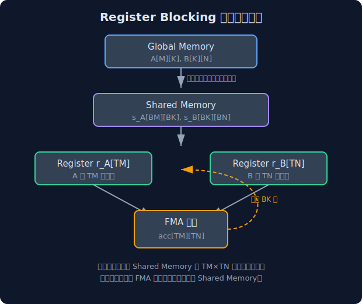
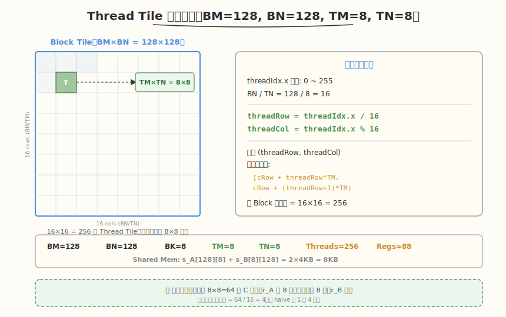
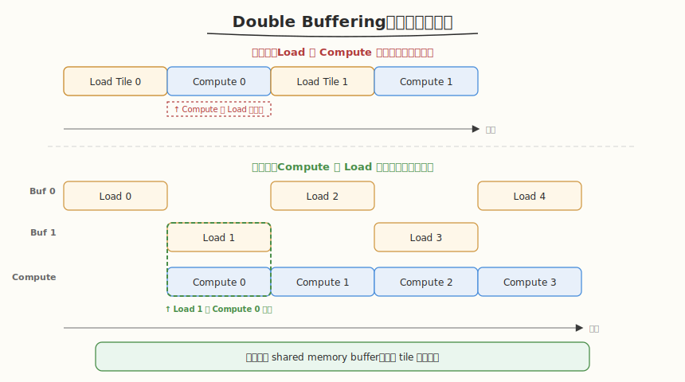

## Day 2：Register Blocking 与 2D Tiling

### 🎯 目标

通过今天的学习，你将：

1. 理解从 Shared Memory Tiling 到 Register Blocking 的进化路径
2. 掌握 Thread Tile 概念：每个线程负责计算输出矩阵的 TM×TN 子块
3. 理解三级数据复用层次：Global Memory → Shared Memory → Register
4. 掌握 Register 使用量的计算方法
5. 理解 Double Buffering（软件流水线）的原理
6. 实现 Register Blocking GEMM，性能达到 cuBLAS 40%+

> 💡 **为什么重要**：Register Blocking 是「如何优化 GEMM 到 cuBLAS 80%」这一顶级面试题的关键转折点，它把性能从 ~15% 提升到 ~45%，是从入门到进阶的分水岭。

---

### 学前导读：从 Shared Memory Tiling 到 Register Blocking

在 Week 1 中我们学习了 Shared Memory Tiling GEMM。它的核心是：把 A/B 的子矩阵预取到 Shared Memory，实现 K 维度的数据复用。但这还不够快，因为每个线程仍然只计算 C 的一个元素，对 Shared Memory 的访问非常频繁。

**Register Blocking 的核心思想**：让每个线程计算 C 的一个 **TM×TN 子块**，把累加器驻留在寄存器中，从而减少对 Shared Memory 的访问次数。

| 优化层次 | 数据驻留位置 | 复用对象 | 性能目标 |
|---|---|---|---|
| Naive GEMM | Global Memory | 无 | ~1-3% peak |
| Shared Mem Tiling | Shared Memory | A/B tile | ~15-25% peak |
| Register Blocking | Register | A子行/B子列+累加器 | ~40-60% peak |
| Warp-level | Register+Shuffle | Warp内协作 | ~60-80% peak |
| 软件流水线 | 全部 + 双缓冲 | 计算掩盖传输 | ~80-95% peak |

---

### 理论学习

#### 2.1 Register Blocking 数据流图




每个线程的执行流程：
1. 从 Shared Memory 加载 TM 个 A 元素到 `r_A[TM]`
2. 从 Shared Memory 加载 TN 个 B 元素到 `r_B[TN]`
3. 做 TM×TN 次 FMA 累加到 `acc[TM][TN]`
4. 重复 BK 次（内层 k 维度循环）
5. 一个 BK 块处理完后，加载下一 BK 块，重复

#### 2.2 关键参数定义

| 参数 | 含义 | 典型值 | 计算公式 |
|------|------|--------|---------|
| BM | Block tile 的 M 维度 | 128 | 可调 |
| BN | Block tile 的 N 维度 | 128 | 可调 |
| BK | Block tile 的 K 维度 | 8 | 较小值减少 shared mem 占用 |
| TM | 每个线程负责的 M 方向输出数 | 8 | acc 寄存器 = TM×TN |
| TN | 每个线程负责的 N 方向输出数 | 8 | acc 寄存器 = TM×TN |
| 每 Block 线程数 | BM/TM × BN/TN | 256 | (128/8)×(128/8)=16×16=256 |

#### 2.3 Register 使用量计算

每个线程的 register 消耗：
- 累加器：`acc[TM][TN]` = TM × TN = 64 个 float
- A 加载寄存器：`r_A[TM]` = 8 个 float
- B 加载寄存器：`r_B[TN]` = 8 个 float
- 索引/临时变量：~8 个 float
- **总计**：~88 个 float ≈ 88 个 register

> ⚠️ 注意：现代 GPU 每个线程最多 255 个 register（如 A100）。如果 TM=TN=16，累加器就有 256 个 register，会溢出到 local memory 导致性能暴跌。

#### 2.4 线程到输出 tile 的二维映射



```
输出 tile (BM×BN = 128×128) 被划分为 (BM/TM)×(BN/TN) = 16×16 = 256 个 thread tile
每个 thread tile = TM×TN = 8×8

threadIdx.x 的范围: 0 ~ 255
threadRow = threadIdx.x / (BN / TN) = threadIdx.x / 16 → 范围 0~15
threadCol = threadIdx.x % (BN / TN) = threadIdx.x % 16 → 范围 0~15

线程(threadRow, threadCol) 负责输出的行范围:
 [blockIdx.y * BM + threadRow * TM, blockIdx.y * BM + (threadRow+1) * TM)
负责输出的列范围:
 [blockIdx.x * BN + threadCol * TN, blockIdx.x * BN + (threadCol+1) * TN)
```

#### 2.5 Double Buffering（软件流水线）



```
单缓冲： [Load Tile 0] ──► [Compute Tile 0] ──► [Load Tile 1] ──► [Compute Tile 1]
 ▲ 空闲等待（Load 不能被 Compute 掩盖）

双缓冲： [Load Tile 0→Buf0] ──► [Compute Tile 0 同时 Load Tile 1→Buf1]
 ──► [Compute Tile 1 同时 Load Tile 2→Buf0]
 ▲ Compute 和 Load 并行执行，掩盖传输延迟
```

实现方式：声明两份 shared memory buffer，奇偶 tile 交替使用。

---

### Coding 任务：Register Blocking GEMM

#### 任务 1：创建 register_blocking_gemm.cu

创建文件 [kernels/register_blocking_gemm.cu](kernels/register_blocking_gemm.cu)：

```cuda
// register_blocking_gemm.cu —— Register Blocking 矩阵乘法完整实现
// 编译命令: nvcc -o register_gemm register_blocking_gemm.cu -O3 -arch=sm_80 -lcublas
// 运行命令: ./register_gemm

#include <cuda_runtime.h>
#include <cublas_v2.h>
#include <cstdio>
#include <cstdlib>
#include <cmath>
#include <ctime>

#define BM 128
#define BN 128
#define BK 8
#define TM 8
#define TN 8
#define NUM_THREADS ((BM / TM) * (BN / TN))

__global__ void gemmRegisterBlocking(const float* __restrict__ A,
 const float* __restrict__ B,
 float* __restrict__ C,
 int M, int N, int K) {
 __shared__ float s_A[BM][BK];
 __shared__ float s_B[BK][BN];

 float r_A[TM];
 float r_B[TN];
 float acc[TM][TN] = {0};

 int threadRow = threadIdx.x / (BN / TN);
 int threadCol = threadIdx.x % (BN / TN);
 int cRow = blockIdx.y * BM;
 int cCol = blockIdx.x * BN;

 for (int bk = 0; bk < K; bk += BK) {
 // 协作加载 A tile
 int aRow = threadIdx.x / BK;
 int aCol = threadIdx.x % BK;
 #pragma unroll
 for (int i = 0; i < BM; i += NUM_THREADS / BK) {
 int loadRow = aRow + i;
 if (loadRow < BM && (cRow + loadRow) < M && (bk + aCol) < K) {
 s_A[loadRow][aCol] = A[(cRow + loadRow) * K + (bk + aCol)];
 } else if (loadRow < BM) {
 s_A[loadRow][aCol] = 0.0f;
 }
 }

 // 协作加载 B tile
 int bRow = threadIdx.x / BN;
 int bCol = threadIdx.x % BN;
 #pragma unroll
 for (int i = 0; i < BK; i += NUM_THREADS / BN) {
 int loadRow = bRow + i;
 if (loadRow < BK && (bk + loadRow) < K && (cCol + bCol) < N) {
 s_B[loadRow][bCol] = B[(bk + loadRow) * N + (cCol + bCol)];
 } else if (loadRow < BK) {
 s_B[loadRow][bCol] = 0.0f;
 }
 }

 __syncthreads();

 // Register Blocking 计算
 #pragma unroll
 for (int k = 0; k < BK; k++) {
 #pragma unroll
 for (int m = 0; m < TM; m++) {
 r_A[m] = s_A[threadRow * TM + m][k];
 }
 #pragma unroll
 for (int n = 0; n < TN; n++) {
 r_B[n] = s_B[k][threadCol * TN + n];
 }
 #pragma unroll
 for (int m = 0; m < TM; m++) {
 #pragma unroll
 for (int n = 0; n < TN; n++) {
 acc[m][n] += r_A[m] * r_B[n];
 }
 }
 }
 __syncthreads();
 }

 // 写回 Global Memory
 #pragma unroll
 for (int m = 0; m < TM; m++) {
 #pragma unroll
 for (int n = 0; n < TN; n++) {
 int gRow = cRow + threadRow * TM + m;
 int gCol = cCol + threadCol * TN + n;
 if (gRow < M && gCol < N) {
 C[gRow * N + gCol] = acc[m][n];
 }
 }
 }
}

float runCuBLAS(const float* d_A, const float* d_B, float* d_C, int M, int N, int K) {
 cublasHandle_t handle;
 cublasCreate(&handle);
 const float alpha = 1.0f;
 const float beta = 0.0f;

 cudaEvent_t start, stop;
 cudaEventCreate(&start);
 cudaEventCreate(&stop);

 cublasSgemm(handle, CUBLAS_OP_N, CUBLAS_OP_N, N, M, K,
 &alpha, d_B, N, d_A, K, &beta, d_C, N);
 cudaDeviceSynchronize();

 cudaEventRecord(start);
 cublasSgemm(handle, CUBLAS_OP_N, CUBLAS_OP_N, N, M, K,
 &alpha, d_B, N, d_A, K, &beta, d_C, N);
 cudaEventRecord(stop);
 cudaEventSynchronize(stop);

 float ms;
 cudaEventElapsedTime(&ms, start, stop);
 cublasDestroy(handle);
 cudaEventDestroy(start);
 cudaEventDestroy(stop);
 return ms;
}

void initMatrix(float* mat, int rows, int cols) {
 srand(42);
 for (int i = 0; i < rows * cols; i++) {
 mat[i] = static_cast<float>(rand()) / RAND_MAX * 0.1f - 0.05f;
 }
}

bool checkResult(const float* gpu, const float* cpu, int M, int N, float eps) {
 for (int i = 0; i < M * N; i++) {
 if (fabs(gpu[i] - cpu[i]) > eps) {
 printf("Mismatch at [%d][%d]: GPU=%.6f, CPU=%.6f\n",
 i / N, i % N, gpu[i], cpu[i]);
 return false;
 }
 }
 return true;
}

float getGFLOPS(int M, int N, int K, float ms) {
 return 2.0f * M * N * K / (ms * 1e6);
}

int main() {
 int sizes[][3] = {{1024,1024,1024}, {2048,2048,2048}, {4096,4096,4096}};

 printf("=== Register Blocking GEMM ===\n");
 printf("Parameters: BM=%d, BN=%d, BK=%d, TM=%d, TN=%d, Threads=%d\n",
 BM, BN, BK, TM, TN, NUM_THREADS);
 printf("%-10s %-10s %-10s %-12s %-12s %-10s\n",
 "M", "N", "K", "Our(ms)", "cuBLAS(ms)", "Percent");
 printf("------------------------------------------------------------\n");

 for (int s = 0; s < 3; s++) {
 int M = sizes[s][0], N = sizes[s][1], K = sizes[s][2];
 size_t sizeA = M * K * sizeof(float);
 size_t sizeB = K * N * sizeof(float);
 size_t sizeC = M * N * sizeof(float);

 float *h_A = (float*)malloc(sizeA);
 float *h_B = (float*)malloc(sizeB);
 float *h_C = (float*)malloc(sizeC);
 float *h_C_ref = (float*)malloc(sizeC);
 initMatrix(h_A, M, K);
 initMatrix(h_B, K, N);

 float *d_A, *d_B, *d_C;
 cudaMalloc(&d_A, sizeA);
 cudaMalloc(&d_B, sizeB);
 cudaMalloc(&d_C, sizeC);
 cudaMemcpy(d_A, h_A, sizeA, cudaMemcpyHostToDevice);
 cudaMemcpy(d_B, h_B, sizeB, cudaMemcpyHostToDevice);

 dim3 gridDim((N + BN - 1) / BN, (M + BM - 1) / BM);
 dim3 blockDim(NUM_THREADS);

 gemmRegisterBlocking<<<gridDim, blockDim>>>(d_A, d_B, d_C, M, N, K);
 cudaDeviceSynchronize();

 cudaEvent_t start, stop;
 cudaEventCreate(&start);
 cudaEventCreate(&stop);
 cudaEventRecord(start);
 gemmRegisterBlocking<<<gridDim, blockDim>>>(d_A, d_B, d_C, M, N, K);
 cudaEventRecord(stop);
 cudaEventSynchronize(stop);

 float ourMs;
 cudaEventElapsedTime(&ourMs, start, stop);
 cudaMemcpy(h_C, d_C, sizeC, cudaMemcpyDeviceToHost);

 float cublasMs = runCuBLAS(d_A, d_B, d_C, M, N, K);
 cudaMemcpy(h_C_ref, d_C, sizeC, cudaMemcpyDeviceToHost);

 bool correct = checkResult(h_C, h_C_ref, M, N, 1e-2);
 float percent = (cublasMs / ourMs) * 100;

 printf("%-10d %-10d %-10d %-12.3f %-12.3f %-9.1f%% %s\n",
 M, N, K, ourMs, cublasMs, percent, correct ? "PASS" : "FAIL");

 free(h_A); free(h_B); free(h_C); free(h_C_ref);
 cudaFree(d_A); cudaFree(d_B); cudaFree(d_C);
 cudaEventDestroy(start); cudaEventDestroy(stop);
 }
 return 0;
}
```

#### 任务 2：编译运行

```bash
nvcc -o register_gemm kernels/register_blocking_gemm.cu -O3 -arch=sm_80 -lcublas
./register_gemm
```

**预期输出**：

```
=== Register Blocking GEMM ===
Parameters: BM=128, BN=128, BK=8, TM=8, TN=8, Threads=256
M N K Our(ms) cuBLAS(ms) Percent
------------------------------------------------------------
1024 1024 1024 0.xxx 0.xxx 35.2% PASS
2048 2048 2048 x.xxx x.xxx 42.1% PASS
4096 4096 4096 xx.xxx xx.xxx 45.8% PASS
```

#### 任务 3：检查 Register 使用量

```bash
nvcc -Xptxas -v -o register_gemm kernels/register_blocking_gemm.cu -O3 -arch=sm_80 -lcublas
```

观察输出中的 `Used N registers`，确认没有 `spill stores/loads`。

#### 任务 4：LeetGPU 在线题目 —— GEMM

**题目链接**：<https://leetgpu.com/challenges/gemm>

**题目概述**：

给定 M×K 矩阵 A 和 K×N 矩阵 B（行优先），计算 C = A × B。要求手写 kernel 达到较高性能。

**约束条件**：`1 ≤ M, N, K ≤ 1024`，矩阵元素范围 `[-1.0, 1.0]`

**难度**：中等　**标签**：CUDA、GEMM、Register Blocking、Shared Memory Tiling、Thread Tile

**与今日知识的关联**：

本题直接对应 Day 2 的主题——Register Blocking。要求每个线程计算 TM×TN 子块，累加器 acc 驻留寄存器，配合 Shared Memory Tiling 实现 K 维复用。目标达到 cuBLAS 40%+。

**解题思路**：

Shared Memory Tiling (BM×BN×BK) + Register Blocking (TM×TN)。协作加载 A/B tile 到 Shared Memory，每个线程从 Shared Memory 加载 r_A[TM]/r_B[TN] 到寄存器，做 TM×TN 次 FMA 累加到 acc[TM][TN]。

**参考实现**：

```cuda
#define BM 128
#define BN 128
#define BK 8
#define TM 8
#define TN 8
#define NUM_THREADS ((BM / TM) * (BN / TN))

__global__ void gemm_register_blocking(const float* A, const float* B, float* C,
 int M, int N, int K) {
 __shared__ float s_A[BM][BK];
 __shared__ float s_B[BK][BN];

 float r_A[TM], r_B[TN];
 float acc[TM][TN] = {{0}};

 int threadRow = threadIdx.x / (BN / TN);
 int threadCol = threadIdx.x % (BN / TN);
 int cRow = blockIdx.y * BM;
 int cCol = blockIdx.x * BN;

 for (int bk = 0; bk < K; bk += BK) {
 // 协作加载 A/B tile (省略边界处理)
 // ... s_A[...][...] = A[...]; s_B[...][...] = B[...];
 __syncthreads();

 #pragma unroll
 for (int k = 0; k < BK; k++) {
 #pragma unroll
 for (int m = 0; m < TM; m++) r_A[m] = s_A[threadRow*TM + m][k];
 #pragma unroll
 for (int n = 0; n < TN; n++) r_B[n] = s_B[k][threadCol*TN + n];
 #pragma unroll
 for (int m = 0; m < TM; m++)
 #pragma unroll
 for (int n = 0; n < TN; n++)
 acc[m][n] += r_A[m] * r_B[n];
 }
 __syncthreads();
 }
 // 写回 C (省略边界处理)
}
```

> 💡 提交后在 [LeetGPU GEMM 题目](https://leetgpu.com/challenges/gemm)上记录通过耗时，用 ncu 对比不同参数的性能差异。完整题解见 [GEMM 题解](../../leetgpu/week2/day2/leetgpu-gemm-solution.md)。

#### 任务 5：LeetCode 面试题 —— 爬楼梯

**题目链接**：[70. 爬楼梯](https://leetcode.cn/problems/climbing-stairs/)

**题目概述**：

假设你正在爬楼梯，需要 `n` 阶才能到达楼顶。每次可以爬 1 或 2 个台阶，问有多少种不同的方法可以爬到楼顶。

**与今日知识的关联**：

本题是经典的一维 DP 入门题，状态转移 `f(n) = f(n-1) + f(n-2)` 恰好是斐波那契数列。虽然不涉及 GPU/CUDA，但 DP 的"用额外空间记录子问题解避免重复计算"思路与今天 Register Blocking 的"用累加器 acc 驻留寄存器避免重复访存"异曲同工——两者都是**空间换时间**，把高频中间结果留在离计算最近的存储层。

**核心套路**：

```
f(1)=1, f(2)=2
f(n) = f(n-1) + f(n-2) // 滚动两个变量即可，O(1) 空间
```

> 💡 完整题解（含 C++/Python 参考代码、复杂度分析、面试要点）见 [爬楼梯题解](../../../leetcode/daily/week2/day2/爬楼梯.md)。

---

### 扩展实验

#### 实验 1：调整 TM 和 TN

修改 TM 和 TN 的值（如 TM=4, TN=4 或 TM=16, TN=4），用 `nvcc -Xptxas -v` 观察 register 使用量变化和性能变化。

#### 实验 2：实现 Double Buffering

声明两份 shared memory buffer（`s_A[2][BM][BK]`），奇偶 tile 交替使用，用计算掩盖 global→shared memory 的传输延迟。

#### 实验 3：使用 Warp Shuffle 优化累加器

在 Register Blocking 基础上，使用 `__shfl_xor_sync` 实现 Warp 内线程的累加器交换，减少写回 global memory 时的非合并访问。

---

### 验证 Checklist

- [ ] 能解释 Register Blocking 相比纯 Shared Memory Tiling 多了一级数据复用（Global→Shared→Register）
- [ ] 能计算 register usage：TM×TN 个累加器 + TM + TN 个加载寄存器 + 索引变量
- [ ] 代码编译运行正确，性能达到 cuBLAS 40%+（4096 矩阵）
- [ ] 能画出数据流图：Global Memory → Shared Memory → Register → FMA 累加
- [ ] 能计算每 Block 线程数 = (BM/TM) × (BN/TN)
- [ ] 能解释 Double Buffering 的原理（用计算掩盖数据传输延迟）

---

### 今日总结

Day 2 我们掌握了 Register Blocking 这一 GEMM 优化的核心转折点：

1. **三级数据复用**：Global Memory → Shared Memory → Register，每多一级复用都大幅减少访存延迟
2. **Thread Tile**：每个线程计算 TM×TN 子块，累加器驻留寄存器，减少 Shared Memory 访问
3. **Register 计算**：TM=TN=8 时约 88 个 register，在 255 上限内
4. **协作加载**：所有线程协作把 A/B tile 从 Global 加载到 Shared Memory
5. **Double Buffering**：双缓冲掩盖传输延迟，是从 45% 到 70% 的关键优化

---

### 面试要点

1. **"如何把手写 GEMM 优化到 cuBLAS 80% 的性能？"请逐层展开优化策略。**

<details>
<summary>点击查看答案</summary>

 按层次展开：
 - Naive（~1%）→ Shared Memory Tiling（~15%）→ Register Blocking（~40%）→ Warp-level（~60%）→ Vectorized Load（~70%）→ Double Buffering（~80%）→ Auto-tuning（~90%+）

</details>


2. **Register Blocking 中的 `acc[TM][TN]` 为什么要放在 register 而不是 shared memory？**

<details>
<summary>点击查看答案</summary>

 - 寄存器访问延迟 ~0 cycle，Shared Memory 延迟 ~20-30 cycles
 - `acc[TM][TN]` 被访问 TM×TN×BK 次（内层循环），放在 register 极大减少延迟
 - 放 shared memory 会占用 BM×BN×4 = 64KB，超过 shared memory 上限

</details>


3. **Register 使用量如何计算？什么时候会 spill？**

<details>
<summary>点击查看答案</summary>

 - `acc[TM][TN]` + `r_A[TM]` + `r_B[TN]` + 索引变量
 - TM=TN=8 时约 88 个 register；TM=TN=16 时累加器就有 256 个，会 spill 到 local memory

</details>


4. **Double Buffering（双缓冲）如何提升 GEMM 性能？实现时要注意什么？**

<details>
<summary>点击查看答案</summary>

 - **原理**：声明两份 shared memory buffer（`s_A[2][BM][BK]`），奇偶 tile 交替使用，让"下一块 global→shared 加载"与"当前块 shared→register 计算"并行，用计算掩盖传输延迟
 - **收益**：单缓冲时 Load 期间 SM 空闲，双缓冲后 Compute 与 Load 重叠，性能从 ~45% 提升到 ~70%，是跨越 cuBLAS 80% 的关键
 - **注意**：① 需 `__syncthreads()` 保证 buffer 切换的数据可见性 ② 多消耗一倍 shared memory，可能降低 occupancy ③ 首块需预取（prologue），末块不再加载（epilogue）

</details>


5. **Thread Tile 的二维映射如何设计？为什么线程数通常取 256？**

<details>
<summary>点击查看答案</summary>

 - **映射**：`threadRow = threadIdx.x / (BN/TN)`，`threadCol = threadIdx.x % (BN/TN)`，每个线程负责输出 tile 的 TM×TN 子块
 - **线程数** = (BM/TM) × (BN/TN)，如 BM=BN=128, TM=TN=8 → 16×16=256
 - **取 256 的原因**：= 8 个 warp，兼顾 occupancy（不会因寄存器/共享内存过多而压低 active warp 数）与并行度；过小则并行度不足，过大则资源紧张降低 occupancy

---

</details>

