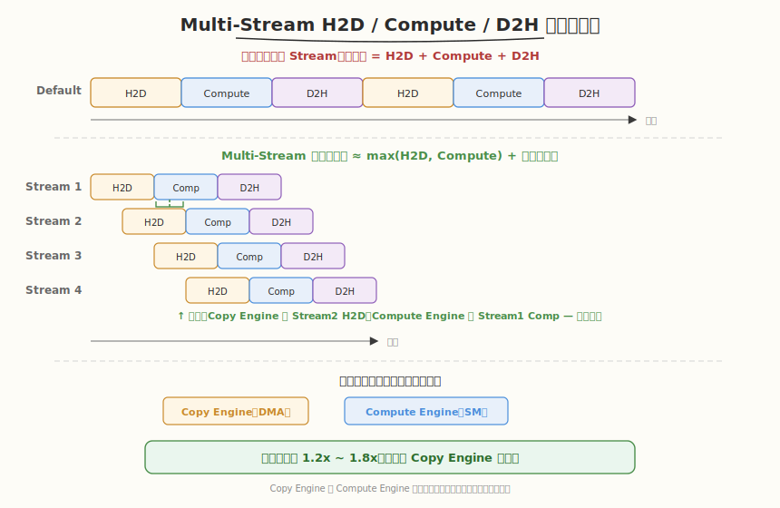
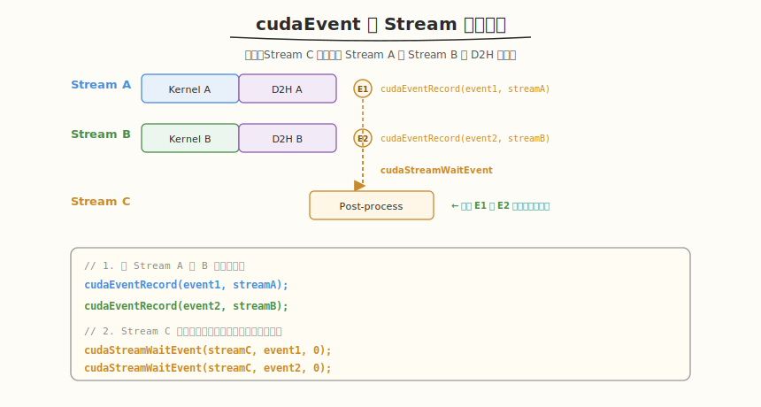

## Day 3：CUDA Streams 与异步执行

### 🎯 目标

通过今天的学习，你将：

1. 理解 CUDA Stream 异步执行模型
2. 掌握 Default Stream 的隐式同步行为及其"坑"
3. 掌握多 Stream 并行策略与 `cudaMemcpyAsync` 的使用
4. 理解 Pinned Memory 对异步传输的必要性
5. 实现多 Stream H2D/Compute/D2H 重叠流水线
6. 能使用 `cudaEvent` 管理跨 Stream 依赖

> 💡 **为什么重要**：多 Stream 异步执行是提升端到端吞吐的关键技术。理解 Default Stream 的隐式同步行为，能避免"看似创建了多 Stream 却没有任何并发"的性能陷阱。

---

### 学前导读：为什么需要异步执行

CPU 和 GPU 是独立的计算资源。如果所有操作都同步执行（CPU 提交后等 GPU 完成），CPU 大量时间在空等。异步执行让 CPU 提交任务后立即返回，GPU 在后台执行，二者并行工作。

更进一步，GPU 内部有独立的硬件引擎：**Copy Engine**（负责 H2D/D2H 传输）和 **Compute Engine**（负责 Kernel 执行）。如果安排得当，拷贝和计算可以同时进行，这就是 Multi-Stream 重叠流水线的核心。

---

### 理论学习

#### 3.1 Stream 的本质

Stream 是 GPU 上操作（Kernel 执行、内存拷贝）的队列。同一个 Stream 内的操作按 FIFO 顺序执行，不同 Stream 之间的操作可以并发（只要资源允许）。

```
Stream 1: [H2D拷贝1] → [Kernel1] → [D2H拷贝1]
Stream 2: [H2D拷贝2] → [Kernel2] → [D2H拷贝2]
           ↑ H2D拷贝2可以与Kernel1并发执行（copy engine和compute unit独立）
```

#### 3.2 Default Stream 的"坑"


| 特性 | Default Stream (Stream 0) | Explicit Stream |
|------|-------------------------|-----------------|
| 创建方式 | 隐式存在，无需创建 | `cudaStreamCreate(&stream)` |
| 同步行为 | **隐式同步所有其他 Stream** | 只同步本 Stream 的操作 |
| 与 Host 关系 | `cudaMemcpy` 阻塞 Host | `cudaMemcpyAsync` 非阻塞 Host |
| 适用场景 | 简单程序、调试 | 生产环境、性能优化 |

**Default Stream 的隐式同步规则（极易出错）**：
- 规则 1：Default Stream 上的操作会等待所有其他 Stream 的先前操作完成
- 规则 2：其他 Stream 上的操作会等待 Default Stream 的先前操作完成
- **后果**：即使创建了多 Stream，只要在 Default Stream 上做一次 `cudaMemcpy`，所有并发都被打断

**解决方案**：始终使用 `cudaStreamNonBlocking` 标志创建 Stream，或编译时加 `--default-stream per-thread`。

```cuda
// 创建不与 Default Stream 同步的 Stream（推荐做法）
cudaStream_t stream;
cudaStreamCreateWithFlags(&stream, cudaStreamNonBlocking);
```

#### 3.3 `cudaMemcpy` vs `cudaMemcpyAsync`

| 函数 | 同步性 | 是否可指定 Stream | 内存要求 | 使用场景 |
|------|--------|----------------|---------|---------|
| `cudaMemcpy` | **同步**（阻塞 Host 直到完成） | 否（Default Stream） | 任意内存 | 简单程序 |
| `cudaMemcpyAsync` | **异步**（立即返回） | 是 | 必须使用 **pinned 内存** | 多 Stream 并发 |

**Pinned Memory（页锁定内存）**：通过 `cudaMallocHost` 分配，不会被 OS 换出到磁盘，支持 DMA 直接传输。

> 为什么 `cudaMemcpyAsync` 需要 Pinned Memory？因为异步传输使用 DMA 引擎直接访问内存，如果内存被 OS 换出到磁盘，DMA 无法访问。普通 pageable 内存会被 CUDA 驱动先复制到临时 pinned buffer，导致异步退化为同步。

#### 3.4 多 Stream 重叠流水线



```
无 Stream（顺序）： [H2D拷贝] ──► [Kernel计算] ──► [D2H拷贝]
                   总计 = H2D + Compute + D2H

Multi-Stream（重叠）：
  Stream1: [H2D chunk1] ──► [Kernel chunk1] ──► [D2H chunk1]
  Stream2:        [H2D chunk2] ──► [Kernel chunk2] ──► [D2H chunk2]
  Stream3:               [H2D chunk3] ──► [Kernel chunk3] ──► [D2H chunk3]
  Stream4:                      [H2D chunk4] ──► [Kernel chunk4] ──► [D2H chunk4]
                   ↑ H2D与Kernel重叠，Kernel与D2H重叠
                   总计 ≈ max(H2D + D2H, Compute) + 流水线填充
```

#### 3.5 cudaEvent 跨 Stream 依赖



当 Stream 间存在数据依赖时，用 Event 实现精确同步：

```cuda
cudaEvent_t event;
cudaEventCreate(&event);

// Stream A 中记录事件
cudaEventRecord(event, streamA);

// Stream B 等待该事件
cudaStreamWaitEvent(streamB, event, 0);
```

---

### 昇腾对照

| CUDA 概念 | 昇腾 CANN 对应 | 对照说明 |
|---------|------------|---------|
| `cudaStreamCreate` | `aclrtCreateStream` | 函数语义完全一致 |
| `cudaStreamSynchronize` | `aclrtSynchronizeStream` | 等待流中所有操作完成 |
| `cudaMemcpyAsync` | `aclrtMemcpyAsync` | 异步内存拷贝，都需要 pinned memory |
| Default Stream 隐式同步 | 昇腾 Stream 默认行为 | 类似机制 |
| `cudaMallocHost`（Pinned Memory） | `aclrtMallocHost` | 页锁定内存，用于 DMA 传输 |
| Copy Engine + Compute Engine | 昇腾 DMA 引擎 + AI Core | 硬件架构类似，都支持拷贝与计算并发 |

---

### Coding 任务：Multi-Stream 重叠流水线

#### 任务 1：创建 multi_stream_pipeline.cu

创建文件 [kernels/multi_stream_pipeline.cu](kernels/multi_stream_pipeline.cu)：

```cuda
// multi_stream_pipeline.cu —— 多 Stream 重叠流水线完整实现
// 编译命令: nvcc -o multi_stream multi_stream_pipeline.cu -O3 -arch=sm_120
// 运行命令: ./multi_stream

#include <cuda_runtime.h>
#include <cstdio>
#include <cstdlib>
#include <cmath>

__global__ void vecAdd(const float* A, const float* B, float* C, int n) {
    int i = blockIdx.x * blockDim.x + threadIdx.x;
    if (i < n) {
        float sum = A[i] + B[i];
        for (int j = 0; j < 100; j++) {
            sum = sum * 0.999f + 0.001f;
        }
        C[i] = sum;
    }
}

// 顺序版本（baseline）
float sequentialVersion(float* h_A, float* h_B, float* h_C,
                         float* d_A, float* d_B, float* d_C,
                         int totalSize, int chunkSize) {
    int numChunks = (totalSize + chunkSize - 1) / chunkSize;
    cudaEvent_t start, stop;
    cudaEventCreate(&start);
    cudaEventCreate(&stop);
    cudaEventRecord(start);

    for (int i = 0; i < numChunks; i++) {
        int offset = i * chunkSize;
        int currSize = (offset + chunkSize <= totalSize) ? chunkSize : (totalSize - offset);
        size_t bytes = currSize * sizeof(float);

        cudaMemcpy(d_A + offset, h_A + offset, bytes, cudaMemcpyHostToDevice);
        cudaMemcpy(d_B + offset, h_B + offset, bytes, cudaMemcpyHostToDevice);

        int threads = 256;
        int blocks = (currSize + threads - 1) / threads;
        vecAdd<<<blocks, threads>>>(d_A + offset, d_B + offset, d_C + offset, currSize);

        cudaMemcpy(h_C + offset, d_C + offset, bytes, cudaMemcpyDeviceToHost);
    }

    cudaEventRecord(stop);
    cudaEventSynchronize(stop);
    float ms;
    cudaEventElapsedTime(&ms, start, stop);
    cudaEventDestroy(start);
    cudaEventDestroy(stop);
    return ms;
}

// Multi-Stream 重叠版本
float multiStreamVersion(float* h_A, float* h_B, float* h_C,
                          float* d_A, float* d_B, float* d_C,
                          int totalSize, int chunkSize, int nStreams) {
    int numChunks = (totalSize + chunkSize - 1) / chunkSize;
    cudaStream_t* streams = new cudaStream_t[nStreams];
    for (int i = 0; i < nStreams; i++) {
        cudaStreamCreateWithFlags(&streams[i], cudaStreamNonBlocking);
    }

    cudaEvent_t start, stop;
    cudaEventCreate(&start);
    cudaEventCreate(&stop);
    cudaEventRecord(start);

    for (int i = 0; i < numChunks; i++) {
        int streamIdx = i % nStreams;
        int offset = i * chunkSize;
        int currSize = (offset + chunkSize <= totalSize) ? chunkSize : (totalSize - offset);
        size_t bytes = currSize * sizeof(float);

        cudaMemcpyAsync(d_A + offset, h_A + offset, bytes,
                        cudaMemcpyHostToDevice, streams[streamIdx]);
        cudaMemcpyAsync(d_B + offset, h_B + offset, bytes,
                        cudaMemcpyHostToDevice, streams[streamIdx]);

        int threads = 256;
        int blocks = (currSize + threads - 1) / threads;
        vecAdd<<<blocks, threads, 0, streams[streamIdx]>>>(
            d_A + offset, d_B + offset, d_C + offset, currSize);

        cudaMemcpyAsync(h_C + offset, d_C + offset, bytes,
                        cudaMemcpyDeviceToHost, streams[streamIdx]);
    }

    for (int i = 0; i < nStreams; i++) {
        cudaStreamSynchronize(streams[i]);
    }

    cudaEventRecord(stop);
    cudaEventSynchronize(stop);
    float ms;
    cudaEventElapsedTime(&ms, start, stop);

    for (int i = 0; i < nStreams; i++) {
        cudaStreamDestroy(streams[i]);
    }
    delete[] streams;
    cudaEventDestroy(start);
    cudaEventDestroy(stop);
    return ms;
}

int main() {
    const int totalSize = 1 << 24;  // 16,777,216 个元素
    const int chunkSize = 1 << 18;  // 262,144 个元素 per chunk
    const int nStreams = 4;

    printf("=== Multi-Stream Overlap Pipeline ===\n");
    printf("Total size: %d (%.2f MB)\n", totalSize,
           totalSize * sizeof(float) / (1024.0 * 1024.0));
    printf("Chunk size: %d (%.2f MB)\n", chunkSize,
           chunkSize * sizeof(float) / (1024.0 * 1024.0));
    printf("Num chunks: %d, Num streams: %d\n\n",
           (totalSize + chunkSize - 1) / chunkSize, nStreams);

    size_t totalBytes = totalSize * sizeof(float);
    float *h_A, *h_B, *h_C_seq, *h_C_multi;
    cudaMallocHost(&h_A, totalBytes);
    cudaMallocHost(&h_B, totalBytes);
    cudaMallocHost(&h_C_seq, totalBytes);
    cudaMallocHost(&h_C_multi, totalBytes);

    srand(42);
    for (int i = 0; i < totalSize; i++) {
        h_A[i] = static_cast<float>(rand()) / RAND_MAX;
        h_B[i] = static_cast<float>(rand()) / RAND_MAX;
    }

    float *d_A, *d_B, *d_C;
    cudaMalloc(&d_A, totalBytes);
    cudaMalloc(&d_B, totalBytes);
    cudaMalloc(&d_C, totalBytes);

    printf("Running sequential version...\n");
    float seqMs = sequentialVersion(h_A, h_B, h_C_seq, d_A, d_B, d_C, totalSize, chunkSize);
    printf("Sequential: %.3f ms\n\n", seqMs);

    printf("Running multi-stream version (nStreams=%d)...\n", nStreams);
    float multiMs = multiStreamVersion(h_A, h_B, h_C_multi, d_A, d_B, d_C,
                                        totalSize, chunkSize, nStreams);
    printf("Multi-Stream: %.3f ms\n\n", multiMs);

    bool correct = true;
    for (int i = 0; i < totalSize; i++) {
        if (fabs(h_C_seq[i] - h_C_multi[i]) > 1e-5) {
            correct = false;
            break;
        }
    }

    float speedup = seqMs / multiMs;
    printf("=== Performance Summary ===\n");
    printf("Sequential:   %.3f ms\n", seqMs);
    printf("Multi-Stream: %.3f ms\n", multiMs);
    printf("Speedup:      %.2fx\n", speedup);
    printf("Result check: %s\n", correct ? "PASS" : "FAIL");

    cudaFreeHost(h_A); cudaFreeHost(h_B);
    cudaFreeHost(h_C_seq); cudaFreeHost(h_C_multi);
    cudaFree(d_A); cudaFree(d_B); cudaFree(d_C);

    return 0;
}
```

#### 任务 2：编译运行

```bash
nvcc -o multi_stream kernels/multi_stream_pipeline.cu -O3 -arch=sm_120
./multi_stream
```

**预期输出**：

```
=== Multi-Stream Overlap Pipeline ===
...
=== Performance Summary ===
Sequential:   xxx.xxx ms
Multi-Stream: xx.xxx ms
Speedup:      1.2x ~ 1.8x
Result check: PASS
```

#### 任务 3：使用 nsys 观察多 Stream 重叠

```bash
nsys profile -o multi_stream_timeline ./multi_stream
```

用 Nsight Systems GUI 打开 `.nsys-rep` 文件，在 Timeline 视图中观察不同 Stream 的操作条是否有重叠区域。

#### 任务 4：LeetGPU 在线题目 —— Convolution

**题目链接**：<https://leetgpu.com/challenges/convolution>

**题目概述**：

给定输入矩阵 input 和一个 K×K 的卷积核 kernel，计算 2D 卷积输出。要求用多 Stream 分块并行处理大矩阵。

**约束条件**：`1 ≤ M, N ≤ 8192`，`1 ≤ K ≤ 15`（K 为奇数），元素范围 `[-1.0, 1.0]`

**难度**：中等　**标签**：CUDA、Convolution、CUDA Streams、Halo Exchange、Shared Memory

**与今日知识的关联**：

本题是 CUDA Streams 的典型应用场景——大矩阵分块，每块 H2D/Compute/D2H 在独立 Stream 上重叠执行。每个 chunk 的卷积计算用 Shared Memory 做 halo exchange。

**解题思路**：

把矩阵按行分块，每块用独立 Stream 处理：`cudaMemcpyAsync` H2D + kernel launch + `cudaMemcpyAsync` D2H。用 pinned memory 保证异步传输生效，Copy Engine 和 Compute Engine 重叠。

**参考实现**：

```cuda
#define K_RADIUS 3
#define K_SIZE (2 * K_RADIUS + 1)

__global__ void conv2d(const float* input, const float* kernel, float* output,
                       int width, int height) {
    __shared__ float tile[BLOCK_SIZE + K_SIZE - 1][BLOCK_SIZE + K_SIZE - 1];

    int tx = threadIdx.x, ty = threadIdx.y;
    int gx = blockIdx.x * BLOCK_SIZE + tx;
    int gy = blockIdx.y * BLOCK_SIZE + ty;

    // 加载含 halo 的 tile (省略边界处理)
    // tile[ty][tx] = input[(gy - K_RADIUS) * width + (gx - K_RADIUS)];
    __syncthreads();

    float sum = 0.0f;
    #pragma unroll
    for (int ky = 0; ky < K_SIZE; ky++) {
        #pragma unroll
        for (int kx = 0; kx < K_SIZE; kx++) {
            sum += tile[ty + ky][tx + kx] * kernel[ky * K_SIZE + kx];
        }
    }
    if (gx < width && gy < height) output[gy * width + gx] = sum;
}

// Host: 多 Stream 分块
// for each chunk:
//   cudaMemcpyAsync(d_chunk, h_chunk, ..., stream[i % N]);
//   conv2d<<<grid, block, 0, stream[i % N]>>>(...);
//   cudaMemcpyAsync(h_out, d_out, ..., stream[i % N]);
```

> 💡 提交后在 [LeetGPU Convolution 题目](https://leetgpu.com/challenges/convolution)上记录通过耗时，用 ncu 对比不同参数的性能差异。完整题解见 [Convolution 题解](../../LeetGPU/leetgpu-convolution-solution.md)。

---

### 扩展实验

#### 实验 1：对比 NonBlocking 标志

修改代码使用 `cudaStreamCreate`（不带 NonBlocking 标志）代替 `cudaStreamCreateWithFlags`，观察性能差异。

#### 实验 2：实现 cudaEvent 跨 Stream 依赖

添加第三个处理 Stream（Stream C），它必须在 Stream A 和 Stream B 的 D2H 都完成后才能开始。使用 `cudaEventRecord` + `cudaStreamWaitEvent`。

#### 实验 3：调整 Stream 数量和 Chunk 大小

测试不同 nStreams（1, 2, 4, 8）和 chunkSize 下的加速比，找到最优配置。

---

### 验证 Checklist

- [ ] 能解释 Default Stream 的隐式同步行为及其危害
- [ ] 能画出 Multi-Stream 时间线：4 个 Stream 的 H2D→Compute→D2H 流水线重叠
- [ ] 代码正确实现了 H2D/Compute/D2H 的 overlap，速度比顺序版本有提升
- [ ] 能解释 `cudaMemcpyAsync` 为什么需要 Pinned Memory（DMA 要求）
- [ ] 能写出 `cudaStreamCreateWithFlags(&stream, cudaStreamNonBlocking)` 的完整用法
- [ ] 能理解 `cudaEventRecord` + `cudaStreamWaitEvent` 的跨 Stream 依赖管理
- [ ] 能对照昇腾 CANN 的 Stream API（aclrtCreateStream 等）写出对应代码
- [ ] 能使用 `nsys profile` 捕获并分析多 Stream timeline

---

### 今日总结

Day 3 我们掌握了 CUDA Stream 异步执行模型：

1. **Stream 是 GPU 操作的队列**：同 Stream 内 FIFO，跨 Stream 可并发
2. **Default Stream 的坑**：隐式同步所有 Explicit Stream，一处 `cudaMemcpy` 就打断全部并发
3. **Pinned Memory**：`cudaMemcpyAsync` 的必要条件，DMA 直接访问需要页锁定内存
4. **多 Stream 重叠**：利用 Copy Engine 和 Compute Engine 独立性，实现 H2D/Compute/D2H 流水线
5. **cudaEvent**：管理跨 Stream 依赖的精确同步工具

---

### 面试要点

1. **CUDA 的 Default Stream 有什么"坑"？在什么情况下会意外导致性能下降？**

   - 隐式同步规则：Default Stream 上的操作会等待所有其他 Stream 的先前操作完成，反之亦然
   - 陷阱场景：创建了多 Stream 做并发优化，但某处调用了 `cudaMemcpy`（默认走 Default Stream），导致所有 Stream 的并发被打断
   - 解决方案：全部使用 Explicit Stream + `cudaMemcpyAsync`，或 `cudaStreamCreateWithFlags(&stream, cudaStreamNonBlocking)`

2. **`cudaMemcpyAsync` 相比 `cudaMemcpy` 需要什么额外条件？为什么必须使用 Pinned Memory？**

   - 必须使用 Pinned Memory（page-locked），因为异步传输使用 DMA 引擎直接访问内存
   - 如果内存被 OS 换出到磁盘，DMA 无法访问，驱动会先复制到临时 pinned buffer，导致异步退化为同步
   - 分配方式：用 `cudaMallocHost` 或 `cudaHostAlloc` 代替 `malloc`

---
