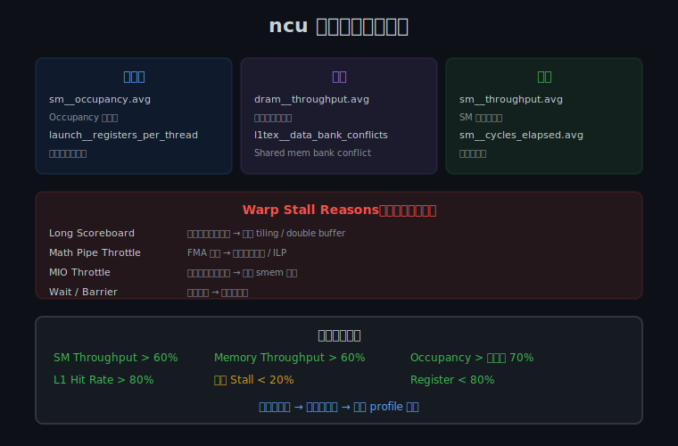

## Day 4：Nsight Compute 性能分析

### 🎯 目标

通过今天的学习，你将：

1. 掌握 Nsight Compute（`ncu`）的命令行用法和常用参数
2. 理解关键性能指标的含义和正常范围
3. 能用 Roofline 模型判断 kernel 是 compute-bound 还是 memory-bound
4. 掌握 Warp Stall Reasons 的分类和对应的优化方法
5. 能对 Register Blocking GEMM 进行完整的瓶颈分析
6. 建立「Profile → 识别瓶颈 → 优化 → 重新 Profile 验证」的完整优化闭环

> 💡 **为什么重要**：前面的理论学习告诉你「应该怎么做」，而 Profiling 告诉你「实际情况是什么」。没有 Profiling，优化就是盲人摸象。Nsight 是 AI Infra 工程师的「听诊器」，面试中「如何分析 Kernel 性能瓶颈」是标准高频题。

---

### 学前导读：为什么需要 Profiling

写 CUDA 代码时，我们经常会有各种假设：

- 「这个 kernel 应该是 memory-bound」
- 「加了 shared memory 应该会更快」
- 「这个优化应该能提升 2 倍」

但真实 GPU 执行时，情况可能完全不同。Profiling 的作用就是：

- **验证假设**：实际瓶颈到底在哪里
- **量化性能**：用数字说话，而不是感觉
- **发现隐藏问题**：如 bank conflict、low occupancy、launch overhead 等
- **指导优化方向**：避免在无效方向上浪费时间

> **Profiling 的黄金法则**：不要猜测，要测量。

---

### 理论学习

#### 4.1 Nsight 工具家族

NVIDIA 提供了两个主要的 profiling 工具，各有分工：

##### Nsight Compute（`ncu`）

- **粒度**：单个 kernel
- **用途**：分析 kernel 内部的详细硬件指标
- **适用场景**：
 - 判断 kernel 是 memory-bound 还是 compute-bound
 - 查看 occupancy、register usage、shared memory
 - 分析 memory throughput、compute throughput
 - 查看 bank conflict、cache hit rate
 - 生成 Roofline 图

##### Nsight Systems（`nsys`）

- **粒度**：整个应用
- **用途**：分析时间线、CPU/GPU 交互、kernel launch overhead
- **适用场景**：
 - 找到最耗时的 kernel
 - 分析 CPU 和 GPU 的并行情况
 - 查看 kernel launch overhead
 - 分析多个 stream 的并行执行
 - 端到端 latency 分析

**使用流程**：

```
1. 先用 nsys 找到最耗时的 kernel
2. 再用 ncu 深入分析该 kernel
3. 根据分析结果优化
4. 重复 profiling 验证效果
```

#### 4.2 `ncu` 命令行基础

```bash
# 基本用法：profile 一个 kernel
ncu -o report.ncu-rep ./my_kernel

# 常用参数
ncu \
 --kernel-name regex:gemmRegisterBlocking \ # 只 profile 指定 kernel
 -o report \ # 输出文件名
 --metrics \ # 指定采集的指标（逗号分隔）
 sm__throughput.avg.pct_of_peak_sustained_elapsed, # SM 计算利用率
 dram__throughput.avg.pct_of_peak_sustained_elapsed, # 显存带宽利用率
 l1tex__t_sectors_pipe_lsu_mem_global_op_ld.sum, # L1/纹理缓存加载扇区数
 l1tex__t_sectors_pipe_lsu_mem_global_op_st.sum # L1/纹理缓存存储扇区数
 ./my_program

# 查看报告
ncu-ui report.ncu-rep # GUI 方式
ncu --page details -i report.ncu-rep # 命令行方式
```

> 💡 **编译建议**：profiling 时建议加 `-g -lineinfo` 编译选项，保留调试信息，这样 ncu 的 Source View 能关联到源代码行。

```bash
nvcc -o gemm_profile register_blocking_gemm.cu -O3 -arch=sm_80 -lcublas -g -lineinfo
```

#### 4.3 关键性能指标



| 指标名称 | 正常范围 | 含义 | 优化方向 |
|---------|---------|------|---------|
| **SM Throughput** | > 60% 为良好 | SM 计算单元利用率 | 低 → 增加 occupancy 或指令级并行 |
| **Memory Throughput** | > 60% 为良好 | 显存带宽利用率 | 低 → 检查 coalesced access |
| **Achieved Occupancy** | 理论值的 70-100% | 实际 warp 占用率 | 低 → 减少 register/shared memory 使用 |
| **Warp Stall Reasons** | 每项 < 20% | warp 阻塞原因分布 | 根据 stall 原因针对性优化 |
| **L1/TEX Hit Rate** | > 80% 为良好 | L1 缓存命中率 | 低 → 优化内存访问模式 |
| **IPC** | 架构相关 | 每周期执行指令数 | 低 → 检查依赖链和发射瓶颈 |
| **Register Pressure** | < 80% 为良好 | 寄存器使用压力 | 高 → 减少寄存器变量 |

#### 4.4 Warp Stall Reasons 详解


Warp Stall 是指 warp 因为等待某种资源而无法执行下一条指令。ncu 会报告各种 stall 原因的占比：

| Stall Reason | 含义 | 优化方法 |
|-------------|------|---------|
| **Long Scoreboard** | 全局内存加载延迟等待 | 增加 thread tile 大小，增加指令级并行 |
| **Math Pipe Throttle** | 数学单元（FMA）过载 | 减少 FMA 依赖链，增加独立指令 |
| **MIO Throttle** | 内存指令发射瓶颈 | 减少 shared memory 访问次数 |
| **Wait** | 显式 `__syncthreads()` 等待 | 减少同步点，或使用 warp 级同步 |
| **Barrier** | 同步屏障等待 | 优化线程负载均衡 |
| **LG Throttle** | 加载/存储队列满 | 减少 global memory 访问频率 |

> 💡 **核心思路**：找到占比最高的 stall reason，针对性优化。Long Scoreboard 高 → 内存延迟问题；Math Pipe Throttle 高 → 计算依赖链问题。

#### 4.5 Roofline 模型

Roofline 模型是判断 kernel 瓶颈类型的核心工具：

```
 GFLOPS
 │
 │ ╱ 计算峰值（水平线，由 SM 数量和频率决定）
 │ ╱
 │ ╱
 │ ╱
 │ ╱
 │╱ 带宽限制斜线（斜率 = 带宽 × 计算强度）
 └──────────────────────────────►
 计算强度（FLOP/Byte）
```

- **Arithmetic Intensity (AI)** = FLOPs / bytes（每字节做多少次浮点运算）
- AI 低 → **memory-bound**（位于斜线区域，优化内存访问）
- AI 高 → **compute-bound**（位于平顶区域，优化计算吞吐量）
- 两线交点 = **平衡点**（A100 约 25 FLOP/byte）

**如何用 Roofline 指导优化**：

| Roofline 位置 | 瓶颈类型 | 优化方向 |
|-------------|---------|---------|
| 斜线下方（低 AI） | memory-bound | coalescing、shared memory、vectorized load |
| 平顶下方（高 AI） | compute-bound | Tensor Core、指令优化、减少 stall |
| 两线交点附近 | balanced | 两者都接近峰值，难以大幅优化 |

---

### Coding 任务：Profile Register Blocking GEMM

#### 任务 1：编译 GEMM 并生成 Profile 报告

```bash
# 编译（保留调试信息以便 Source View 关联）
nvcc -o gemm_profile kernels/register_blocking_gemm.cu \
 -O3 -arch=sm_80 -lcublas -g -lineinfo

# 运行 Nsight Compute profile
ncu \
 --kernel-name regex:gemmRegisterBlocking \
 -o gemm_profile_report \
 --metrics \
sm__throughput.avg.pct_of_peak_sustained_elapsed,\
dram__throughput.avg.pct_of_peak_sustained_elapsed,\
l1tex__t_sectors_pipe_lsu_mem_global_op_ld.sum,\
l1tex__t_sectors_pipe_lsu_mem_global_op_st.sum,\
smsp__warps_eligible.sum.per_cycle,\
smsp__average_warps_issue_stalled_long_scoreboard.pct \
 ./gemm_profile 2>&1 | tee ncu_output.txt

# 导出为 CSV（便于命令行查看）
ncu --csv --page details -i gemm_profile_report.ncu-rep > gemm_profile.csv
```

#### 任务 2：分析任务清单

拿到 ncu 报告后，按以下清单分析：

1. **读取 SM Throughput 和 Memory Throughput**，判断是 compute-bound 还是 memory-bound
 - Memory Throughput >> SM Throughput → memory-bound
 - SM Throughput >> Memory Throughput → compute-bound
1. **读取 Achieved Occupancy**，判断 SM 利用率是否充分（目标 > 70%）
2. **查看 Warp Stall Reasons**，找出主要 stall 原因
3. **对比 L1/TEX Hit Rate**，判断缓存效率
4. **打开 ncu-ui → Source 视图**，定位最耗时的代码行

#### 任务 3：案例分析

假设 ncu 输出如下指标：

```
SM Throughput: 45.2%
Memory Throughput: 78.5%
Achieved Occupancy: 56.3%
L1/TEX Hit Rate: 82.1%
Warp Stall Long Scoreboard: 35.2% ← 高！
Warp Stall Math Pipe Throttle: 12.1%
Register Pressure: 72%
```

**解读过程**：

1. Memory Throughput(78.5%) > SM Throughput(45.2%) → **Memory Bound**
2. Roofline 位置：在斜线下方，计算强度不够高
3. Stall Reason：Long Scoreboard 35.2% → 全局内存加载延迟是主要瓶颈
4. Achieved Occupancy 56.3% → 偏低，可能 register 太多导致 occupancy 下降

**优化方向**：

| Profile 发现 | 尝试优化 | 预期效果 |
|------------|---------|---------|
| Memory Throughput 高，SM Throughput 低 | 增大 TM×TN（如 8×8→16×8） | 提升计算强度 |
| Long Scoreboard Stall 高 | 引入 Double Buffering | 掩盖内存延迟 |
| Achieved Occupancy 低 | 减少 register 使用（减小 TM 或 TN） | 提升 warp occupancy |
| L1 Hit Rate 低 | 检查 coalesced access 模式 | 提升缓存效率 |

#### 任务 4：优化实验与对比验证


基于 Profile 结果，选择一项优化进行实验，然后重新 profile 对比：

```bash
# 优化后重新 profile
ncu --kernel-name regex:gemmRegisterBlocking -o gemm_profile_v2 \
 --metrics sm__throughput.avg.pct_of_peak_sustained_elapsed,\
dram__throughput.avg.pct_of_peak_sustained_elapsed \
 ./gemm_profile_v2

# 对比两次结果，确认优化是否有效
```

#### 任务 5：LeetGPU 在线题目 —— Softmax

**题目链接**：<https://leetgpu.com/challenges/softmax>

**题目概述**：

给定长度为 N 的浮点数组 input（或 batch 的多行），计算 softmax：output[i] = exp(input[i]) / Σ exp(input[j])。

**约束条件**：`1 ≤ N ≤ 1,000,000`，支持 batch 维度，元素范围 `[-10.0, 10.0]`

**难度**：中等　**标签**：CUDA、Softmax、Profiling、Memory-bound、Three-pass

**与今日知识的关联**：

本题是典型的 memory-bound kernel，适合用 Day 4 学的 Nsight Compute 做完整 profiling。用 ncu 分析 memory throughput、occupancy、warp stall reasons，判断瓶颈在内存带宽还是计算，并据此优化。

**解题思路**：

三遍扫描法：(1) 求 max（数值稳定性）；(2) 求 exp(x-max) 的 sum；(3) 归一化。每遍都是一次全局内存读取。用 ncu 观察 dram throughput，判断是否 memory-bound，再用 fusion（online softmax）减少访存次数。

**参考实现**：

```cuda
__global__ void softmax_kernel(const float* input, float* output, int N) {
 int idx = blockIdx.x * blockDim.x + threadIdx.x;
 if (idx >= N) return;

 // Pass 1: 求 max
 float max_val = -INFINITY;
 for (int i = 0; i < N; i++)
 max_val = fmaxf(max_val, input[i]);

 // Pass 2: 求 sum(exp(x - max))
 float sum = 0.0f;
 for (int i = 0; i < N; i++) {
 sum += expf(input[i] - max_val);
 }

 // Pass 3: 归一化
 output[idx] = expf(input[idx] - max_val) / sum;
}

// profiling 命令:
// ncu --set full --metrics dram__throughput.avg.pct_of_peak_sustained_elapsed,\
// sm__throughput.avg.pct_of_peak_sustained_elapsed,\
// sm__occupancy.avg.pct_of_peak_sustained_elapsed ./softmax
```

> 💡 提交后在 [LeetGPU Softmax 题目](https://leetgpu.com/challenges/softmax)上记录通过耗时，用 ncu 对比不同参数的性能差异。完整题解见 [Softmax 题解](../../leetgpu/week2/day4/leetgpu-softmax-solution.md)。

#### 任务 6：LeetCode 面试题 —— 合并两个有序链表

**题目链接**：[21. 合并两个有序链表](https://leetcode.cn/problems/merge-two-sorted-lists/)

**题目概述**：

将两个升序链表 `list1` 和 `list2` 合并为一个新的升序链表。

**与今日知识的关联**：

本题核心是**哑节点 + 双指针归并**——用一个 dummy 头简化边界处理，两个指针分别遍历两条链表取较小者接上。这与今天 Profiling 的"先建立 baseline 再逐层定位瓶颈"思路呼应：归并是"逐步比较取最优"，profiling 是"逐步对比找最慢"，都是**有序推进 + 增量决策**的工作模式。

**核心套路**：

```
dummy 哑节点 + tail 尾指针；遍历两链表，每次取较小者接到 tail 后；
处理剩余；返回 dummy.next
```

> 💡 完整题解（含 C++/Python 参考代码、复杂度分析、面试要点）见 [合并两个有序链表题解](../../../leetcode/daily/week2/day4/合并两个有序链表.md)。

---

### 扩展实验

#### 实验 1：使用 nsys 分析 Timeline

```bash
nsys profile -o timeline_report ./gemm_profile
```

用 Nsight Systems GUI 打开 `.nsys-rep`，观察：
- H2D memcpy、Kernel、D2H memcpy 的时间占比
- 多个 kernel 的执行顺序
- CPU 和 GPU 的并行情况

#### 实验 2：云 GPU 环境下的 Profiling 替代方案

| 场景 | 解决方案 |
|------|---------|
| 只有命令行 ncu | `ncu --csv --page details -i report.ncu-rep > report.csv` 导出 CSV 分析 |
| 无 ncu 权限 | 使用 `nvprof`（旧版）或代码中嵌入 `cudaEvent` 手动计时 |
| 纯云环境 | ncu 导出报告后下载到本地用 ncu-ui 打开 |

#### 实验 3：Profile Day 1 的 Warp Reduce Kernel

对 Day 1 的 `warp_reduce.cu` 运行 ncu，对比它与 GEMM 的指标差异：
- Warp Reduce 的 SM Throughput 和 Memory Throughput 分别是多少？
- 哪个 stall reason 占比最高？
- 为什么 Reduce kernel 的 occupancy 通常很高？

### 验证 Checklist

- [ ] 能独立运行 ncu 并导出报告（命令行 + GUI）
- [ ] 能解读 SM Throughput 和 Memory Throughput 判断瓶颈类型
- [ ] 能说出 3 个常见 Warp Stall Reason 及对应的优化方法
- [ ] 能画出 Roofline 模型并解释自己的 kernel 在什么位置
- [ ] 能在 ncu-ui 的 Source 视图中定位最耗时的代码行
- [ ] 理解云 GPU 环境下 ncu 的替代使用方案
- [ ] 完成一次「Profile → 识别瓶颈 → 优化 → 重新 Profile 验证」的完整循环

---

### 今日总结

Day 4 我们掌握了 Nsight Compute 性能分析工具：

1. **ncu 命令行**：`--metrics` 指定指标、`--kernel-name` 过滤 kernel、`-o` 导出报告
2. **关键指标**：SM Throughput、Memory Throughput、Achieved Occupancy、Warp Stall Reasons
3. **Roofline 模型**：计算强度判断 memory-bound vs compute-bound，平衡点 = 峰值算力 / 峰值带宽
4. **Warp Stall 分析**：Long Scoreboard 高 → 内存延迟；Math Pipe Throttle 高 → 计算依赖链
5. **优化闭环**：Profile → 识别瓶颈 → 针对性优化 → 重新 Profile 验证

掌握这些后，你就拥有了「用数据说话」的优化能力，而不是靠猜测调参。

---

### 面试要点

1. **「如何分析一个 CUDA Kernel 的性能瓶颈？」请给出完整的分析流程。**

<details>
<summary>点击查看答案</summary>

 1. **工具选择**：ncu 做 kernel 级分析 + nsys 做系统级 Timeline 分析
 2. **第一步（Baseline）**：运行 ncu 获取 SM Throughput、Memory Throughput、Achieved Occupancy
 3. **第二步（Roofline 定位）**：根据两个 Throughput 判断 kernel 在 Roofline 上的位置
 - Memory Throughput >> SM Throughput → Memory Bound → 优化内存访问
 - SM Throughput >> Memory Throughput → Compute Bound → 优化计算吞吐量
 1. **第三步（Stall 分析）**：查看 Warp Stall Reasons，定位具体阻塞原因
 - Long Scoreboard 高 → 全局内存延迟 → 增加 tiling、vectorized load、double buffering
 - Math Pipe Throttle 高 → FMA 依赖链 → 增加指令级并行
 - MIO Throttle 高 → Shared Memory 瓶颈 → 减少 shared memory 访问
 1. **第四步（验证）**：优化后重新 profile，对比指标变化确认效果

</details>


2. **Achieved Occupancy 低于理论值的可能原因有哪些？如何排查？**

<details>
<summary>点击查看答案</summary>

 - **Register 溢出**：每线程 register 过多 → ncu 查看 `launch__registers_per_thread`，与架构限制对比
 - **Shared Memory 不足**：每 block smem 过多 → 计算 `s_A + s_B` 用量，与 SM 上限对比
 - **Block Size 不合理**：非 32 倍数或不在甜蜜区 → 检查 `blockDim.x`
 - **Grid Size 不足**：总 block 数 < SM 数 × 每 SM 最大 block 数 → 比较 gridDim 和 SM 数量
 - **同步开销**：过多 `__syncthreads()` 导致 warp 空闲等待

</details>


3. **Roofline 模型怎么解读？平衡点是什么？**

<details>
<summary>点击查看答案</summary>

 - 计算强度 = FLOPs / Bytes，平衡点 = Peak FLOP/s / Peak Bandwidth
 - A100 平衡点约 25 FLOP/byte：AI < 25 → memory-bound，AI > 25 → compute-bound
 - 优化方向：斜线区域优化内存访问，平顶区域优化计算

</details>


4. **`ncu` 的 Source View 有什么用？需要什么编译条件？**

<details>
<summary>点击查看答案</summary>

 - Source View 能将硬件指标关联到源代码行，精确定位最耗时的代码
 - 需要编译时加 `-g -lineinfo` 保留调试信息
 - 例如：能看到第 45 行的 `acc[m][n] += r_A[m] * r_B[n]` 占了 60% 的执行时间

</details>


5. **Memory-bound 和 Compute-bound 的优化方向有什么本质区别？如何用 ncu 数据支撑判断？**

<details>
<summary>点击查看答案</summary>

 - **本质区别**：memory-bound 受限于数据搬运（喂不饱计算单元），优化方向是减少 HBM 读写（tiling、向量化、fusion）；compute-bound 受限于算力（算不过来），优化方向是提升计算吞吐（Tensor Core、ILP、指令调度）
 - **ncu 判断**：看 `dram__throughput` 与 `sm__throughput` 的占比——DRAM ≫ SM → memory-bound；SM ≫ DRAM → compute-bound；两者都低 → latency-bound（可能是同步或依赖链）
 - **Roofline 验证**：算 AI = FLOPs/Bytes，与 Ridge Point（A100 ≈ 12.6-25）比较，AI < Ridge → memory-bound
 - **常见误区**：只看绝对耗时不算 AI，容易误判。例如 Softmax 耗时短但 AI≈0.375 仍是 memory-bound

---

</details>

