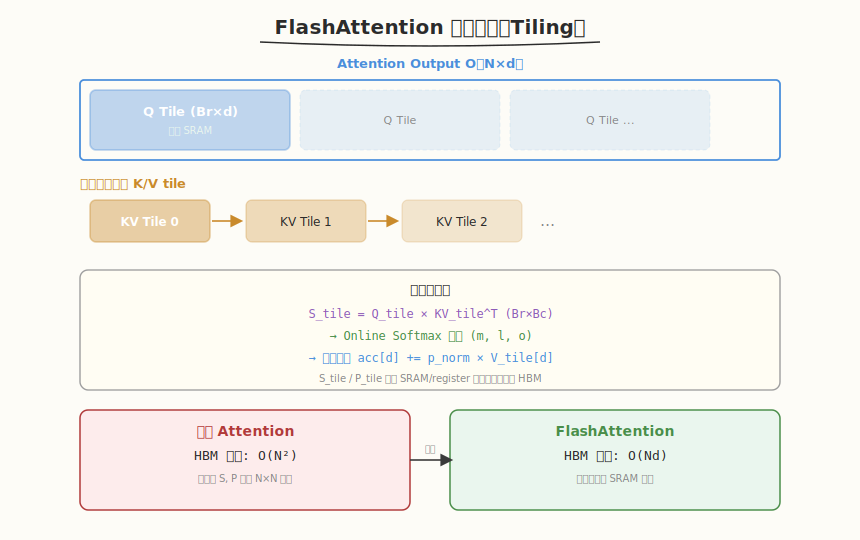

## Day 5：FlashAttention CUDA 实现（简化版）

### 🎯 目标

通过今天的学习，你将：

1. 理解标准 Attention 的 O(N²) HBM 访问瓶颈
2. 掌握 FlashAttention 的核心创新：分块（Tiling）+ Online Softmax
3. 能完整推导 Online Softmax 三个更新公式（m_new, l_new, o_new）
4. 理解 `exp(m - m_new)` 缩放因子的作用
5. 手写简化版 FlashAttention Forward Kernel
6. 能对照昇腾 CANN 理解 FlashAttention 的跨平台一致性

> 💡 **为什么重要**：FlashAttention 是推理优化的第一考点，大模型 Infra 面试标配。它不是靠减少 FLOPS 加速（计算量相同），而是靠**减少 HBM 数据移动**——这体现了 AI Infra 的核心原则：减少数据移动比减少计算更重要。

---

### 学前导读：标准 Attention 的问题


#### 标准 Attention 计算

```
S = Q × K^T      (N×N 矩阵，O(N²) 显存)
P = softmax(S)   (N×N 矩阵，O(N²) 显存)
O = P × V        (输出，O(N×d) 显存)
```

#### HBM 访问瓶颈

以 N=4096, d=64 为例，标准 Attention 的 HBM 读写量：

```
读 Q:  N×d = 262K
读 K:  N×d = 262K
写 S:  N×N = 16M    ← O(N²) 瓶颈
读 S:  N×N = 16M
写 P:  N×N = 16M    ← O(N²) 瓶颈
读 P:  N×N = 16M
读 V:  N×d = 262K
写 O:  N×d = 262K
总计 HBM 读写: ~48M elements ≈ 192MB
```

**核心问题**：S 和 P 两个 N×N 中间矩阵必须写入 HBM 再读回，导致 O(N²) 的 HBM 访问。

#### FlashAttention 的核心洞察

> 不需要把 S 和 P 完整写入 HBM。通过分块计算，在 SRAM（Shared Memory）中完成 softmax 和输出累加，HBM 访问降为 O(N)。

---

### 理论学习

#### 5.1 分块策略（Tiling）



FlashAttention 将 Q/K/V 分块装入 SRAM，在片上完成计算：

```
┌──────────────────────────────────────────┐
│           Attention Output O (N×d)        │
│  ┌────────┐ ┌────────┐ ┌────────┐       │
│  │ Q Tile │ │ Q Tile │ │ Q Tile │  ...   │  Br rows each
│  │ Br×d   │ │ Br×d   │ │ Br×d   │       │
│  └───┬────┘ └────┬───┘ └───┬────┘       │
│      └────────────┼─────────┘              │
│                   ▼                        │
│  K,V iterate:    ┌────────┐               │
│                  │ KV Tile│  Bc rows each  │
│                  │ Bc×d   │                │
│                  └────────┘               │
└──────────────────────────────────────────┘

外循环：遍历 Q tile（行方向，步长 Br）
  内循环：遍历 KV tile（行方向，步长 Bc）
    每步计算：S_tile = Q_tile × KV_tile^T  (Br×Bc)
              在线更新 softmax 和输出累加
```

**关键**：Q tile 驻留在 SRAM 中（不移动），K/V tile 逐块滑入。每计算完一个 KV tile，立即更新 running softmax 状态和输出累加器。

**分块大小约束**：`Br×d + Bc×d×2 + Br×Bc ≤ SRAM 容量`，这决定了 Br 和 Bc 的选择。

#### 5.2 Online Softmax 三公式推导


这是 FlashAttention 的核心创新，也是面试必考的白板推导题。

##### 标准 Softmax 回顾

```
y_i = exp(x_i - m) / l
where m = max(x_j)   (全局最大值)
      l = Σ exp(x_j - m)   (全局求和)
```

**分块计算的问题**：每个 KV tile 只能看到部分 x_j，不知道全局 max，无法直接做 softmax。

##### Online Softmax 解决方案

维护 running 状态 `(m, l, o)`，每处理一个新块时增量更新：

- `m`：已处理所有块的 running maximum
- `l`：已处理所有块的 running sum（以 m 为参考点的指数和）
- `o`：已处理所有块的 running output（部分加权和）

**初始状态**：`m = -inf, l = 0, o = 0`（零向量）

##### 推导过程

处理新块 `x_j` 时，新块有自己的局部最大值。全局 max 从 `m` 更新到 `m_new = max(m, max(x_j))`。

当全局 max 变化时，之前的所有 exp 值需要重新缩放（因为 softmax 的减 max 参考点变了）：

```
旧值以 m 为参考：exp(x_old - m)
新参考点是 m_new：exp(x_old - m_new) = exp(x_old - m) × exp(m - m_new)

所以之前的 sum 需要缩放：l_new_partial = l × exp(m - m_new)
新块的 sum：sum(exp(x_j - m_new))
```

由此得到三个更新公式：

**公式 1 — Max 更新**：
```
m_new = max(m, max(x_j))
```
含义：全局 max 可能是之前的 m，也可能是新块中的某个值。

**公式 2 — Sum 更新**：
```
l_new = l × exp(m - m_new) + Σ exp(x_j - m_new)
```
含义：
- `l × exp(m - m_new)`：将之前的 running sum 从旧参考点 m 缩放到新参考点 m_new
- `Σ exp(xj - m_new)`：新块的指数和，直接以 m_new 为参考

**公式 3 — Output 更新**：
```
o_new = o × (l × exp(m - m_new) / l_new) + (exp(x_j - m_new) / l_new) × v_j
```
含义：
- `o × (l × exp(m - m_new) / l_new)`：将之前累积的输出按新的概率分布重新归一化
- `(exp(x_j - m_new) / l_new) × v_j`：新块的贡献，以新的全局概率权重加权 V

**最终输出**（所有 KV tile 处理完后）：
```
O_final = o / l   （最后做一次归一化）
```

##### 关键理解点

1. 三个公式是**递推的**：每次新块到来时，用旧 `(m, l, o)` 和新块 `(x_j, v_j)` 计算新 `(m_new, l_new, o_new)`
2. `exp(m - m_new)` 是**关键缩放因子**，保证全局参考点一致
3. 整个过程 HBM 访问量为 **O(N)**，因为不需要存储中间 S 和 P 矩阵

---

### 昇腾对照

| CUDA/FlashAttention 概念 | 昇腾 CANN 对应 | 对照说明 |
|---------|------------|---------|
| SRAM（Shared Memory） | L0 Buffer / UB | Q-tile 驻留 SRAM ≈ 昇腾 L0 Buffer 常驻数据 |
| HBM（Global Memory） | DDR/HBM | 都面临容量大但带宽低的问题 |
| Online Softmax 递推 | 昇腾 softmax 算子分块实现 | 昇腾 softmax 同样使用 running max/sum 策略 |
| Q-tile 驻留不动 | L0 Buffer 预加载 Q | 昇腾 Cube Unit 计算前将 Q 预加载到 L0 Buffer |
| FlashAttention Tiling | Cube Unit 分块计算 | 昇腾 Cube Unit 天然做分块矩阵乘 |
| 分块大小 Br×Bc | 昇腾 UB 容量决定 | 两者都受限于片上 SRAM 容量 |

| 维度 | CUDA FlashAttention | 昇腾 FlashAttention |
|------|-------------------|-------------------|
| 片上缓存 | Shared Memory (48-164KB/SM) | L0 Buffer (UB) + L1 Buffer |
| Q-tile 驻留 | Shared Memory 中常驻 | L0 Buffer 中预加载 |
| K/V-tile 加载 | Global → Shared Memory 逐块 | L1 Buffer → L0 Buffer 逐块 |
| 计算单元 | SM (FMA 指令) | Cube Core (MAC 阵列) |
| Softmax 递推 | Warp 级/线程级手动实现 | Vector Unit 内置支持 |
| 带宽瓶颈 | HBM 带宽 (~1.5TB/s on A100) | HBM 带宽 (~1.6-2.0TB/s on 910) |
| 实现复杂度 | 高（需手写 Kernel） | 中（CANN 内置 FlashAttention 算子） |

---

### Coding 任务：FlashAttention 简化版 Forward Kernel

#### 任务 1：创建 flash_attention.cu

创建文件 [kernels/flash_attention.cu](kernels/flash_attention.cu)：

```cuda
// flash_attention.cu —— FlashAttention 简化版 Forward Kernel
// 编译命令: nvcc -o flash_attention flash_attention.cu -O3 -arch=sm_80
// 运行命令: ./flash_attention

#include <cuda_runtime.h>
#include <cstdio>
#include <cstdlib>
#include <cmath>
#include <algorithm>

#define Br 64   // Q tile 的行数（SRAM 可容纳）
#define Bc 64   // K/V tile 的行数（SRAM 可容纳）
#define D 64    // Head dimension

#define NUM_THREADS_X Bc   // 64
#define NUM_THREADS_Y 4    // Br/NUM_THREADS_Y = 64/4 = 16

__global__ void flashAttentionFwd(const float* __restrict__ Q,
                                    const float* __restrict__ K,
                                    const float* __restrict__ V,
                                    float* __restrict__ O,
                                    int N, int numHeads) {
    __shared__ float s_Q[Br][D];    // Q tile: Br×D
    __shared__ float s_K[Bc][D];    // K tile: Bc×D
    __shared__ float s_V[Bc][D];    // V tile: Bc×D
    __shared__ float s_S[Br][Bc];   // S = Q×K^T partial: Br×Bc

    int batch = blockIdx.z;
    int head = blockIdx.y;
    int qTileRow = blockIdx.x * Br;

    int tid_x = threadIdx.x;
    int tid_y = threadIdx.y;

    int bhOffset = ((batch * numHeads + head) * N);

    // 每个线程维护的 running 状态（按 Q 行）
    float m = -1e30f;   // running max
    float l = 0.0f;     // running sum
    float acc[D] = {0}; // running output accumulator

    // Step 1: 加载 Q tile 到 Shared Memory
    for (int i = tid_y; i < Br; i += NUM_THREADS_Y) {
        int qRow = qTileRow + i;
        for (int d = tid_x; d < D; d += NUM_THREADS_X) {
            if (qRow < N) {
                s_Q[i][d] = Q[bhOffset * D + qRow * D + d];
            } else {
                s_Q[i][d] = 0.0f;
            }
        }
    }
    __syncthreads();

    // Step 2: 内循环遍历 K/V tile
    for (int kvStart = 0; kvStart < N; kvStart += Bc) {
        // 2a: 加载 K 和 V tile
        for (int i = tid_y; i < Bc; i += NUM_THREADS_Y) {
            int kvRow = kvStart + i;
            for (int d = tid_x; d < D; d += NUM_THREADS_X) {
                if (kvRow < N) {
                    s_K[i][d] = K[bhOffset * D + kvRow * D + d];
                    s_V[i][d] = V[bhOffset * D + kvRow * D + d];
                } else {
                    s_K[i][d] = 0.0f;
                    s_V[i][d] = 0.0f;
                }
            }
        }
        __syncthreads();

        // 2b: 计算 S_tile = Q_tile × K_tile^T (Br×Bc)
        for (int qi = tid_y; qi < Br; qi += NUM_THREADS_Y) {
            for (int ki = tid_x; ki < Bc; ki += NUM_THREADS_X) {
                float s_val = 0.0f;
                #pragma unroll
                for (int d = 0; d < D; d++) {
                    s_val += s_Q[qi][d] * s_K[ki][d];
                }
                s_S[qi][ki] = s_val;
            }
        }
        __syncthreads();

        // 2c: Online Softmax 更新（每个 Q 行独立处理）
        for (int qi = tid_y; qi < Br && (qTileRow + qi) < N; qi += NUM_THREADS_Y) {
            if (tid_x == 0) {
                // 公式1: 计算新块的局部 max
                float m_prev = m;
                float m_new = m_prev;
                for (int c = 0; c < Bc && (kvStart + c) < N; c++) {
                    m_new = fmaxf(m_new, s_S[qi][c]);
                }

                // 公式2: 更新 running sum
                float l_scale = expf(m_prev - m_new);
                float l_new = l * l_scale;

                float p[Bc];
                for (int c = 0; c < Bc && (kvStart + c) < N; c++) {
                    p[c] = expf(s_S[qi][c] - m_new);
                    l_new += p[c];
                }

                // 公式3: 更新 running output
                float o_scale = (l * l_scale) / l_new;
                for (int d = 0; d < D; d++) {
                    acc[d] = acc[d] * o_scale;
                }
                for (int c = 0; c < Bc && (kvStart + c) < N; c++) {
                    float p_norm = p[c] / l_new;
                    for (int d = 0; d < D; d++) {
                        acc[d] += p_norm * s_V[c][d];
                    }
                }

                m = m_new;
                l = l_new;
            }
        }
        __syncthreads();
    }

    // Step 3: 写回最终结果
    for (int qi = tid_y; qi < Br && (qTileRow + qi) < N; qi += NUM_THREADS_Y) {
        if (tid_x == 0) {
            for (int d = 0; d < D; d++) {
                int outRow = qTileRow + qi;
                O[bhOffset * D + outRow * D + d] = acc[d];
            }
        }
    }
}

// CPU 参考实现（标准 Attention，用于验证正确性）
void cpuAttention(const float* Q, const float* K, const float* V,
                  float* O, int N, int D) {
    float* S = (float*)malloc(N * N * sizeof(float));
    for (int i = 0; i < N; i++) {
        for (int j = 0; j < N; j++) {
            float sum = 0;
            for (int d = 0; d < D; d++)
                sum += Q[i * D + d] * K[j * D + d];
            S[i * N + j] = sum;
        }
    }
    for (int i = 0; i < N; i++) {
        float maxVal = S[i * N];
        for (int j = 1; j < N; j++)
            maxVal = fmaxf(maxVal, S[i * N + j]);
        float sum = 0;
        for (int j = 0; j < N; j++) {
            S[i * N + j] = expf(S[i * N + j] - maxVal);
            sum += S[i * N + j];
        }
        for (int j = 0; j < N; j++)
            S[i * N + j] /= sum;
    }
    for (int i = 0; i < N; i++) {
        for (int d = 0; d < D; d++) {
            float sum = 0;
            for (int j = 0; j < N; j++)
                sum += S[i * N + j] * V[j * D + d];
            O[i * D + d] = sum;
        }
    }
    free(S);
}

void initMatrix(float* mat, int rows, int cols) {
    srand(42);
    for (int i = 0; i < rows * cols; i++)
        mat[i] = (static_cast<float>(rand()) / RAND_MAX - 0.5f) * 0.2f;
}

bool checkResult(const float* gpu, const float* cpu, int n, float eps) {
    for (int i = 0; i < n; i++) {
        if (fabs(gpu[i] - cpu[i]) > eps) {
            printf("Mismatch at %d: GPU=%.6f, CPU=%.6f\n", i, gpu[i], cpu[i]);
            return false;
        }
    }
    return true;
}

int main() {
    const int N = 256;
    const int D = 64;
    const int batchSize = 1;
    const int numHeads = 1;

    printf("=== FlashAttention Simplified Forward ===\n");
    printf("Config: N=%d, D=%d, batch=%d, heads=%d\n", N, D, batchSize, numHeads);
    printf("SRAM usage per block: %.2f KB\n",
           (Br * D + Bc * D * 2 + Br * Bc) * sizeof(float) / 1024.0);

    size_t totalElements = batchSize * numHeads * N * D;
    size_t bytes = totalElements * sizeof(float);

    float *h_Q = (float*)malloc(bytes);
    float *h_K = (float*)malloc(bytes);
    float *h_V = (float*)malloc(bytes);
    float *h_O = (float*)malloc(bytes);
    float *h_O_CPU = (float*)malloc(bytes);

    initMatrix(h_Q, batchSize * numHeads * N, D);
    initMatrix(h_K, batchSize * numHeads * N, D);
    initMatrix(h_V, batchSize * numHeads * N, D);

    float *d_Q, *d_K, *d_V, *d_O;
    cudaMalloc(&d_Q, bytes);
    cudaMalloc(&d_K, bytes);
    cudaMalloc(&d_V, bytes);
    cudaMalloc(&d_O, bytes);
    cudaMemcpy(d_Q, h_Q, bytes, cudaMemcpyHostToDevice);
    cudaMemcpy(d_K, h_K, bytes, cudaMemcpyHostToDevice);
    cudaMemcpy(d_V, h_V, bytes, cudaMemcpyHostToDevice);

    dim3 gridDim((N + Br - 1) / Br, numHeads, batchSize);
    dim3 blockDim(NUM_THREADS_X, NUM_THREADS_Y);

    printf("Grid: (%d, %d, %d), Block: (%d, %d)\n",
           gridDim.x, gridDim.y, gridDim.z, blockDim.x, blockDim.y);

    cudaEvent_t start, stop;
    cudaEventCreate(&start);
    cudaEventCreate(&stop);

    cudaEventRecord(start);
    flashAttentionFwd<<<gridDim, blockDim>>>(d_Q, d_K, d_V, d_O, N, numHeads);
    cudaEventRecord(stop);
    cudaEventSynchronize(stop);

    float ms;
    cudaEventElapsedTime(&ms, start, stop);
    cudaMemcpy(h_O, d_O, bytes, cudaMemcpyDeviceToHost);

    cpuAttention(h_Q, h_K, h_V, h_O_CPU, N, D);
    bool correct = checkResult(h_O, h_O_CPU, totalElements, 1e-3);

    printf("GPU Time: %.3f ms\n", ms);
    printf("Result check: %s\n", correct ? "PASS" : "FAIL");

    free(h_Q); free(h_K); free(h_V); free(h_O); free(h_O_CPU);
    cudaFree(d_Q); cudaFree(d_K); cudaFree(d_V); cudaFree(d_O);
    cudaEventDestroy(start); cudaEventDestroy(stop);

    return 0;
}
```

#### 任务 2：编译运行

```bash
nvcc -o flash_attention kernels/flash_attention.cu -O3 -arch=sm_80
./flash_attention
```

**预期输出**：

```
=== FlashAttention Simplified Forward ===
Config: N=256, D=64, batch=1, heads=1
SRAM usage per block: 40.00 KB
Grid: (4, 1, 1), Block: (64, 4)
GPU Time: x.xxx ms
Result check: PASS
```

#### 任务 3：验证 SRAM 使用量

代码中打印了 SRAM 使用量。验证计算：

```
s_Q[Br][D] = 64×64×4 = 16 KB
s_K[Bc][D] = 64×64×4 = 16 KB
s_V[Bc][D] = 64×64×4 = 16 KB
s_S[Br][Bc] = 64×64×4 = 16 KB
总计 = 64 KB（在 A100 的 164 KB shared memory 限制内）
```

#### 任务 4：LeetGPU 在线题目 —— Attention

**题目链接**：<https://leetgpu.com/challenges/attention>

**题目概述**：

给定 Query (M×d)、Key (N×d)、Value (N×d)，计算 Scaled Dot-Product Attention：Attention(Q,K,V) = softmax(Q·K^T / √d) · V。

**约束条件**：`1 ≤ M, N ≤ 4096`，`1 ≤ d ≤ 128`，元素范围 `[-1.0, 1.0]`

**难度**：困难　**标签**：CUDA、Attention、Online Softmax、FlashAttention、分块计算

**与今日知识的关联**：

本题直接对应 Day 5 的主题——FlashAttention。标准实现会把 S=QK^T 和 P=softmax(S) 写回 HBM（O(N²) 访存）；FlashAttention 用 Online Softmax 分块计算，S/P 不落 HBM（O(Nd) 访存）。

**解题思路**：

分块计算：Q tile 驻留 SRAM，K/V tile 逐块滑入。用 Online Softmax 三公式增量更新 m/l/o：m_new=max(m,mj); l_new=l*exp(m-m_new)+Σexp(xj-m_new); o_new=...。

**参考实现**：

```cuda
#define BLOCK_M 64
#define BLOCK_N 64

__global__ void flash_attention(const float* Q, const float* K, const float* V,
                                float* O, int M, int N, int d) {
    // Q tile 驻留寄存器/SRAM
    float q_tile[BLOCK_M][d];  // 简化,实际用 shared memory

    float m_i[BLOCK_M];  // running max
    float l_i[BLOCK_M];  // running sum
    float o_i[BLOCK_M][d];  // running output

    // 初始化
    for (int i = 0; i < BLOCK_M; i++) {
        m_i[i] = -INFINITY;
        l_i[i] = 0.0f;
        for (int j = 0; j < d; j++) o_i[i][j] = 0.0f;
    }

    // 遍历 K/V tiles
    for (int kv_start = 0; kv_start < N; kv_start += BLOCK_N) {
        // 加载 K/V tile, 计算 S = Q * K^T
        // s_ji = Q[i] · K[j] / sqrt(d)

        // Online Softmax 更新
        // m_new = max(m_i, max(s_j))
        // l_new = l_i * exp(m_i - m_new) + sum(exp(s_j - m_new))
        // o_new = o_i * (l_i * exp(m_i - m_new) / l_new)
        //       + (exp(s_j - m_new) / l_new) * V[j]

        // (省略具体实现, 见 Day 5 教程的完整 kernel)
    }

    // 写回 O
}
```

> 💡 提交后在 [LeetGPU Attention 题目](https://leetgpu.com/challenges/attention)上记录通过耗时，用 ncu 对比不同参数的性能差异。完整题解见 [Attention 题解](../../leetgpu/week2/day5/leetgpu-softmax-attention-solution.md)。

#### 任务 5：LeetCode 面试题 —— 二叉树的层序遍历

**题目链接**：[102. 二叉树的层序遍历](https://leetcode.cn/problems/binary-tree-level-order-traversal/)

**题目概述**：

给定二叉树根节点 `root`，返回其节点值的层序遍历结果（逐层从左到右，每层一个子数组）。

**与今日知识的关联**：

本题核心是 **BFS 队列**——用队列逐层处理节点，每层批量进出。这与今天 FlashAttention 的 **tiling 分块**思路一致：FlashAttention 把 N 个 key/value 分成一块块 KV tile 逐块滑入 SRAM 处理，BFS 把树分成一层层逐层处理。两者都是**把全局问题切成块/层，用缓冲区（队列/SRAM）承载当前块，逐块推进**的流水线化思维。

**核心套路**：

```
队列存当前层节点；每轮取队列全部节点（=当前层），
记录值，把子节点入队（=下一层）；重复直到队空
```

> 💡 完整题解（含 C++/Python 参考代码、复杂度分析、面试要点）见 [二叉树的层序遍历题解](../../../leetcode/daily/week2/day5/二叉树的层序遍历.md)。

---

### 扩展实验

#### 实验 1：手动推导 Online Softmax

假设已处理块的 `m=2.0, l=3.0`，新块的值为 `[3.0, 1.0, 4.0]`，计算新的 `m_new, l_new`。

> 提示：
> - `m_new = max(2.0, max(3.0, 1.0, 4.0)) = 4.0`
> - `l_scale = exp(2.0 - 4.0) = exp(-2.0) ≈ 0.135`
> - `l_new = 3.0 × 0.135 + exp(3.0-4.0) + exp(1.0-4.0) + exp(4.0-4.0)`
> - `= 0.406 + 0.368 + 0.050 + 1.0 = 1.824`

#### 实验 2：增大序列长度对比 HBM 访问量

修改测试尺寸到 N=1024 或 N=2048，对比 FlashAttention 和标准 Attention 的理论 HBM 访问量：

| N | 标准 Attention HBM | FlashAttention HBM | 加速比 |
|---|---|---|---|
| 256 | O(N²+Nd) | O(Nd) | ~N/d |
| 1024 | | | |
| 2048 | | | |

> FlashAttention 的 HBM 访问 = O(Nd)（只读 Q/K/V，只写 O）；标准 Attention = O(N²+Nd)。

#### 实验 3：用 ncu 分析 FlashAttention Kernel

```bash
nvcc -o flash_attn_profile kernels/flash_attention.cu -O3 -arch=sm_80 -g -lineinfo
ncu --kernel-name regex:flashAttentionFwd \
    --metrics sm__throughput.avg.pct_of_peak_sustained_elapsed,\
dram__throughput.avg.pct_of_peak_sustained_elapsed,\
sm__occupancy.avg.pct_of_peak_sustained_elapsed \
    ./flash_attn_profile
```

观察 FlashAttention 是 memory-bound 还是 compute-bound，对比标准 Attention 的指标。

---

### 常见错误与调试

| 问题 | 原因 | 解决 |
|------|------|------|
| 结果误差大 | exp 溢出 | 确保减 max 后再 exp；初始化数据用小值 |
| SRAM 超限 | Br/Bc 太大 | 减小 Br 或 Bc，确保 `Br×D + Bc×D×2 + Br×Bc ≤ shared mem` |
| Online softmax 结果不对 | 缩放因子计算错误 | 检查 `exp(m - m_new)` 的方向，确保旧值缩放到新参考点 |
| Kernel 只有一个线程做 softmax | `tid_x == 0` 限制了并行度 | 这是简化版的局限，完整版用 warp shuffle 并行化 |
| 大序列时性能不如预期 | 简化版未优化 | 完整版需要 warp shuffle + double buffering + 向量化加载 |

---

### 验证 Checklist

- [ ] 能推导出 Online Softmax 的三个更新公式（m_new, l_new, o_new）
- [ ] 能理解每个公式中 `exp(m - m_new)` 缩放因子的作用（统一参考点）
- [ ] FlashAttention Kernel 编译运行正确，小尺寸测试通过（与 CPU 对比误差 < 1e-3）
- [ ] 能解释 FlashAttention 的 HBM 访问复杂度为什么是 O(Nd) 而非 O(N²)
- [ ] 能画出 FlashAttention 的 tiling 示意图（Q tile 驻留 SRAM，K/V tile 逐块滑入）
- [ ] 能对照昇腾的 L0 Buffer 解释 SRAM 驻留策略的一致性
- [ ] 能计算 SRAM 使用量：`Br×D + Bc×D×2 + Br×Bc`，确认不超过 shared memory 上限
- [ ] 能解释 FlashAttention 的加速来源（减少 HBM 访问，而非减少计算量）

---

### 今日总结

Day 5 我们掌握了 FlashAttention 的核心思想和实现：

1. **标准 Attention 的瓶颈**：S 和 P 两个 N×N 中间矩阵导致 O(N²) HBM 访问
2. **FlashAttention 的核心**：分块 Tiling + Online Softmax，在 SRAM 中完成所有中间计算
3. **Online Softmax 三公式**：`m_new = max(m, max(xj))`、`l_new = l×exp(m-m_new) + Σexp(xj-m_new)`、`o_new = o×(l×exp(m-m_new)/l_new) + (exp(xj-m_new)/l_new)×vj`
4. **关键缩放因子**：`exp(m - m_new)` 保证全局参考点一致
5. **HBM 复杂度**：从 O(N²) 降到 O(Nd)，长序列加速 2-4x
6. **加速来源**：不是 FLOPS 减少（计算量相同），而是数据移动减少

---

### 面试要点

1. **FlashAttention 为什么快？请从 HBM 访问量的角度分析。**

   - **核心问题**：标准 Attention 需要存储和读取 S=Q×K^T 和 P=softmax(S) 两个 N×N 中间矩阵，HBM 访问量为 O(N²)
   - **FlashAttention 方案**：通过分块 tiling + online softmax，在 SRAM 中完成所有中间计算，不需要将 S 和 P 写入 HBM
   - **HBM 访问对比**：标准 = O(N² + Nd)；FlashAttention = O(Nd)（只读 Q/K/V，只写 O）
   - **速度来源**：不是 FLOPS 减少了（计算量相同），而是**数据移动减少了**——减少数据移动比减少计算更重要
   - **实际加速**：长序列（N>2048）时加速明显（2-4x），因为 HBM 带宽是瓶颈

2. **请完整推导 Online Softmax 的三个更新公式，并解释每个公式的含义。**

   ```
   状态：(m, l, o) —— running max、running sum、running output
   新块：(xj, vj) —— 新的 KV tile 的 score 和 value

   公式1 - Max 更新：
     m_new = max(m, max(xj))
     含义：全局 max 可能是之前的 m，也可能是新块中的某个值

   公式2 - Sum 更新：
     l_new = l × exp(m - m_new) + Σ exp(xj - m_new)
     含义：l × exp(m - m_new) 将旧 sum 从旧参考点 m 缩放到新参考点 m_new；
           Σ exp(xj - m_new) 是新块的指数和

   公式3 - Output 更新：
     o_new = o × (l × exp(m - m_new) / l_new) + (exp(xj - m_new) / l_new) × vj
     含义：前半部分将旧输出按新概率重新归一化；后半部分是新块贡献

   关键点：exp(m - m_new) 是统一参考点的缩放因子
   ```

3. **FlashAttention 的分块大小 Br×Bc 如何确定？**

   - 受限于 SRAM（Shared Memory）容量：`Br×D + Bc×D×2 + Br×Bc ≤ SRAM 容量`
   - A100 shared memory 最多 164 KB/SM
   - 典型值：Br=Bc=64, D=64 时 SRAM 使用约 40 KB
   - 分块太小 → 循环次数多；分块太大 → SRAM 超限或 occupancy 下降

4. **`exp(m - m_new)` 这个缩放因子为什么重要？**

   - Softmax 需要减去全局 max 保证数值稳定性
   - 分块计算时每个块只看到局部数据，全局 max 是递推更新的
   - 当 max 从 m 变为 m_new 时，之前所有 exp 值的参考点都变了
   - `exp(m - m_new)` 就是把旧值从参考点 m 缩放到新参考点 m_new 的因子
   - 没有它，不同块计算的概率无法统一到同一个归一化基

5. **FlashAttention 在 Prefill 和 Decode 阶段的表现有何不同？为什么 Decode 仍受益？**

   - **Prefill**：序列长 N 大，标准 Attention 的 O(N²) S/P 物化是主要瓶颈，FlashAttention 把 IO 从 O(N²) 降到 O(Nd)，加速 2-4x 最明显
   - **Decode**：M=1，没有 N×N 矩阵，标准 Attention 退化为 1×N，S/P 本就不大。但 FlashAttention 仍受益——它把 softmax+PV 融合在 SRAM 里，减少 kernel launch 数量和中间 HBM 读写，配合 KV Cache 优化 decode 的 memory-bound
   - **关键洞察**：Prefill 的收益主要来自"消除 O(N²) 物化"，Decode 的收益主要来自"kernel fusion 减少 HBM 往返"，两者瓶颈不同但 FlashAttention 都能覆盖

---
