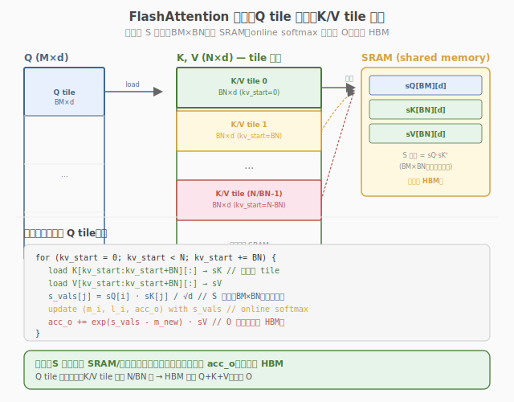

## Day 4：FlashAttention-2 论文与源码差异

### 🎯 目标

通过今天的学习，你将：

1. 理解 FlashAttention-2 相对 FA1 的三大关键改进：**减少 non-matmul FLOPs**、**更好的 work partitioning**、**更高的 occupancy**<br>
2. 掌握 FA2 的 **warp group 子块划分**策略，对比 Day 2 的"每 warp 若干 Q 行"划分<br>
3. 理解 **seq 并行 vs head 并行**的 trade-off，知道什么时候该用 seq 并行<br>
4. 能列出 FA1 vs FA2 的至少 5 个关键差异，解释每个改进的收益来源<br>
5. 能基于 FA2 思想优化 Day 2 手写 Kernel 的至少一项（warp group 分工或减少同步）<br>

> 💡 **为什么重要**：FA2 是当前 FlashAttention 的主流版本，面试中"FA1 vs FA2 区别"是高频追问。Day 3 我们读了官方源码的结构，今天聚焦 FA2 的算法改进——理解"为什么 FA2 比 FA1 快约 2x"，是从"读过源码"到"理解演进"的关键一步。明天把 FA 集成到 Mini 引擎时，会用今天学到的 work partitioning 思想评估集成效果。

---

### 学前导读：FA1 跑对了，但为什么还能更快

Day 3 读官方源码时我们注意到，FA1 的 warp 分工是"所有 warp 共同完成一个 Q tile"，这导致跨 warp 之间存在冗余的 softmax 统计量同步。FA2 的核心洞察是：**如果把 Q tile 在行方向进一步划分给不同 warp groups，每个 group 独立完成自己子块的全部 online softmax，就能消除跨 group 同步**。

| 维度 | FA1 的问题 | FA2 的改进 | 收益 |
|------|-----------|-----------|------|
| Non-matmul FLOPs | softmax/rescale 跨 warp 冗余 | warp group 内独立完成 | ~2x 减少 |
| Work partitioning | 按 Q tile，warp 共享 | 按 Q tile 子块 + seq 并行 | 更高并行度 |
| Warp 同步 | 较多 block 级同步 | warp group 内自治 | 更少同步点 |
| Occupancy | register/smem 压力大 | 优化用量，更多 block 驻留 | 更高 occupancy |

> 💡 **一句话总结**：FA2 不是算法变了（三公式不变），而是把"谁做什么"重新分配——让 warp group 自治，减少不必要的通信和重复计算。这跟管理学一样：减少跨团队同步，让小组自治，效率更高。

---

### 理论学习

#### 4.1 FA1 的不足


FA1 存在三个效率问题：

```
FA1 的问题：
1. 不同 warp group 之间存在冗余的 softmax 统计量同步
2. 非 matmul 计算（online softmax 的 reduce/rescale）没有充分并行
3. Q tile 行 block 内部的 warp 分工不够细，导致部分 warp 空闲
```

##### 问题 1：跨 warp 冗余同步

FA1 中，一个 Block 的所有 warp 共同处理 Q tile。每个 warp 计算部分 S=QK^T，然后需要跨 warp 汇总 max 和 sum——这引入了 `__syncthreads` 和 shared memory 中转。

##### 问题 2：Non-matmul FLOPs 占比高

FA1 的 non-matmul FLOPs（softmax 的 exp/sum/rescale）与 matmul FLOPs 之比约为 1:10。在现代 GPU 上，matmul 有 Tensor Core 加速（吞吐远超 FMA），而 non-matmul 只能跑标量指令——non-matmul 成了瓶颈。

#### 4.2 FA2 改进一：减少 Non-Matmul FLOPs



FA2 的核心改进：**让一个 warp group 负责输出 tile 的一个子块（sub-tile），在 group 内部独立完成该子块的全部 online softmax 计算**。

```
FA1: Block 内所有 warp 共享 Q tile → 跨 warp 同步 max/sum
FA2: Block 内 warp groups 各管子块 → group 内自治，无需跨 group 同步

效果：
 FA1: non-matmul : matmul ≈ 1:10
 FA2: non-matmul : matmul ≈ 1:20 或更少
```

##### 为什么减少 non-matmul 很重要？

现代 GPU 的 Tensor Core matmul 吞吐远超标量 FMA（A100 上 FP16 matmul 312 TFLOPS vs FP32 FMA 19.5 TFLOPS，16x 差距）。因此即使 non-matmul FLOPs 只占 10%，它的执行时间可能占 50%+——因为标量指令慢 16x。FA2 把 non-matmul 减半，直接缩小了这个瓶颈。

#### 4.3 FA2 改进二：更好的 Work Partitioning

```
FA1 的 work partitioning：
 - 一个 Block 处理一个 Q tile
 - Block 内 warps 共同完成整个 Q tile
 - 并行维度: Batch × Head × Q tile

FA2 的 work partitioning：
 - 一个 Block 仍处理一个 Q tile
 - 但将 Q tile 在行方向划分给不同 warp groups
 - 新增 seq 并行维度: 一个 head 的序列可分多个 block
```

##### 三层并行维度

| 并行维度 | FA1 | FA2 | 说明 |
|---------|-----|-----|------|
| Batch × Head | ✅ `blockIdx.z/y` | ✅ | 首选，天然无依赖 |
| Sequence length | ❌ | ✅ 新增 | 长 sequence 分多个 block |
| Warp group 内部 | 简单共享 | ✅ 子块自治 | 减少跨 warp 同步 |

##### Seq 并行 vs Head 并行

```
Head 并行（Batch/Head 维度）：
 - 不同 head 在不同 block 上并行
 - 优点：自然，不需要同步
 - 缺点：head 数少时（如 8 头），并行度不够

Seq 并行（Sequence 长度维度）：
 - 同一个 head 的序列分成多个 block 并行
 - 优点：增加并行度，尤其适合长序列
 - 缺点：需要处理 Q tile 边界（但 FA 的 tiling 天然支持）
```

**选择策略**：先充分利用 Batch × Head 并行（gridDim.y × gridDim.z）。如果 B×H 不够大（如小 batch 推理），再开启 seq 并行。

#### 4.4 FA2 改进三：更高的 Occupancy

```
FA1: register 和 shared memory 使用较大，每 SM 可能只跑 1 个 block
FA2: 优化用量，每 SM 可跑 2-3 个 block → occupancy 提升
```

FA2 通过以下方式减少资源占用：
- warp group 自治减少了 shared memory 中转缓冲
- 更紧凑的 register 复用（子块划分让 acc 更小）
- 减少同步点 → 编译器有更多优化空间

#### 4.5 FA1 vs FA2 关键差异总结

| 维度 | FlashAttention-1 | FlashAttention-2 |
|------|------------------|------------------|
| Non-matmul 并行 | 不够充分（跨 warp 共享） | warp group 内独立完成 |
| Work partitioning | 按 Q tile，warp 共享 | 按 Q tile 子块 + seq 并行 |
| Warp 同步 | 较多 block 级 `__syncthreads` | 较少（group 内自治） |
| Occupancy | 较低（1 block/SM） | 较高（2-3 blocks/SM） |
| Non-matmul:matmul 比 | ~1:10 | ~1:20 |
| 反向传播 | 支持 | 更高效 |
| 长序列收益 | 好 | 更好 |
| 整体加速（vs FA1） | 基准 | ~2x |

---

### Coding 任务：基于 FA2 思想优化手写 Kernel

#### 任务 1：阅读 FA2 论文 Section 3

**论文**："FlashAttention-2: Faster Attention with Better Parallelism and Work Partitioning" (Dao, 2023)

**地址**：https://arxiv.org/abs/2307.08691

**阅读范围**：
- Section 3.1：减少 non-matmul FLOPs（warp group 子块划分）
- Section 3.2：更好的 work partitioning（seq 并行）

**记录要点**：在 [notes/fa2_paper_notes.md](notes/fa2_paper_notes.md) 中记录 FA2 的三大改进和你的理解。

#### 任务 2：修改 Day 2 Kernel 的 warp 分工

将 Day 2 的 `flash_attention_v2.cu` 修改为 FA2 风格的 warp group 划分：

```cuda
// Day 2 原版：每 warp 负责 ROWS_PER_WARP 行
// FA2 风格：把 warps 分成 groups，每 group 负责一个子块

// 修改示例：ROWS_PER_WARP 从 8 改为 4，增加 warp 间并行度
constexpr int WARPS_PER_BLOCK_FA2 = 16; // 16 warps = 512 threads
constexpr int ROWS_PER_WARP_FA2 = Br / WARPS_PER_BLOCK_FA2; // 64/16 = 4
// 每 warp 负责更少的行，但更多 warp 并行
// acc 从 [8][64] 缩小到 [4][64]，register 压力降低
```

编译运行，对比修改前后的 latency 和 register 使用量：

```bash
# 编译原版
nvcc -o flash_attention_v2 day2/kernels/flash_attention_v2.cu -O3 -arch=sm_80 -Xptxas -v

# 编译 FA2 风格版
nvcc -o flash_attention_fa2 kernels/flash_attention_fa2.cu -O3 -arch=sm_80 -Xptxas -v

# 对比 register 使用量（-Xptxas -v 输出）
# 预期：FA2 版 register/thread 更少，occupancy 更高
```

#### 任务 3：用 ncu 对比 occupancy 和同步开销

```bash
ncu --metrics \
 sm__occupancy.avg.pct_of_peak_sustained_elapsed,\
 sm__throughput.avg.pct_of_peak_sustained_elapsed,\
 launch__registers_per_thread \
 --kernel-name regex:flashAttention \
 ./flash_attention_v2 # 原版

ncu --metrics \
 sm__occupancy.avg.pct_of_peak_sustained_elapsed,\
 sm__throughput.avg.pct_of_peak_sustained_elapsed,\
 launch__registers_per_thread \
 --kernel-name regex:flashAttention \
 ./flash_attention_fa2 # FA2 风格版
```

**观察重点**：

| 指标 | 原版 (Day 2) | FA2 风格版 | 预期变化 |
|------|-------------|-----------|---------|
| Registers/thread | ~88-120 | ~60-80 | ↓（acc 更小） |
| Occupancy | ~50-75% | ~60-85% | ↑（register 减少后更多 block 驻留） |
| SM Throughput | ~30-40% | ~35-45% | ↑（并行度更高） |

#### 任务 4：LeetGPU 在线题目 —— Batched Matrix Multiplication

**题目链接**：<https://leetgpu.com/challenges/batched-matrix-multiplication>

**题目概述**：

给定 B 组矩阵，每组 A[M×K] 和 B[K×N]，计算 C = A×B for each batch。约束 `1 ≤ B ≤ 128`，`1 ≤ M,N,K ≤ 512`，元素范围 `[-1.0, 1.0]`。

**难度**：中等　**标签**：CUDA、Batched Kernel、GEMM、Register Blocking

**与今日知识的关联**：

FlashAttention-2 相比 FA1 的一大改进是 **更好的 work partitioning**：把 batch 维和 head 维提升到 grid 的最高维度，让每个 thread block 处理更小的子任务，从而减少同步、提高 occupancy。本题 Batched Matrix Multiplication 正是练习这种"多维 grid + batch offset 寻址"的最简场景——用 `blockIdx.z` 区分 batch，`blockIdx.x/y` 处理 M/N tile，与 FA2 官方 kernel 的 launch 策略同构。

**解题思路**：

1. `gridDim.z = B`（batch 维度），一个 kernel 并行处理所有 batch
2. batch offset 寻址：`A[batch * M * K]`、`B[batch * K * N]`、`C[batch * M * N]`
3. 每个 batch 内部复用单矩阵 GEMM 的 Shared Memory Tiling + Register Blocking
4. 对比串行启动 B 个 kernel vs 单个 batched kernel 的 launch overhead

**参考实现**（框架）：

```cuda
// batched_gemm.cu —— Batched GEMM（batch 维用 gridDim.z）
// 编译命令: nvcc -o batched_gemm batched_gemm.cu -O3 -arch=sm_80

#include <cuda_runtime.h>
#include <cstdio>

#define BM 64
#define BN 64
#define BK 16
#define TM 4
#define TN 4

__global__ void batched_gemm_kernel(const float* A, const float* B, float* C,
                                    int M, int N, int K, int batch_stride_A,
                                    int batch_stride_B, int batch_stride_C) {
    int batch = blockIdx.z;
    const float* A_b = A + batch * batch_stride_A;
    const float* B_b = B + batch * batch_stride_B;
    float* C_b = C + batch * batch_stride_C;

    // 每个 thread block 负责 C[BM][BN] 的子块
    int bx = blockIdx.x * BN;
    int by = blockIdx.y * BM;

    __shared__ float s_A[BM][BK];
    __shared__ float s_B[BK][BN];

    float acc[TM][TN] = {0.0f};

    for (int k = 0; k < K; k += BK) {
        // 协作加载 A[by:by+BM, k:k+BK] 到 s_A
        // 协作加载 B[k:k+BK, bx:bx+BN] 到 s_B
        __syncthreads();

        // 寄存器累加
        for (int kk = 0; kk < BK; ++kk) {
            for (int m = 0; m < TM; ++m) {
                for (int n = 0; n < TN; ++n) {
                    // acc[m][n] += s_A[...][kk] * s_B[kk][...];
                }
            }
        }
        __syncthreads();
    }

    // 写回 C_b
}
```

> 💡 提交后在 [LeetGPU Batched GEMM 题目](https://leetgpu.com/challenges/batched-matrix-multiplication)上记录通过耗时，重点观察 batch size 增大时 latency 的增长曲线。完整题解（含 batched kernel launch、batch offset 寻址、与单矩阵 GEMM 的对比）见 [Batched Matrix Multiplication 题解](../../leetgpu/week4/day4/leetgpu-batched-matrix-multiplication-solution.md)。

#### 任务 5：LeetCode 面试题 —— 最小覆盖子串

**题目链接**：[76. 最小覆盖子串](https://leetcode.cn/problems/minimum-window-substring/)

**题目概述**：

给定字符串 `s` 和 `t`，返回 `s` 中涵盖 `t` 所有字符的最小子串。如不存在返回空串。

**与今日知识的关联**：

本题核心是**滑动窗口 + 双指针**——右指针扩展窗口直到满足条件，左指针收缩窗口直到不满足。这与 FA2 的 **seq 并行 vs head 并行选择**思路呼应：滑动窗口是"动态调整窗口大小找最优"，FA2 的并行维度选择是"动态调整并行度找最优"——都是**在约束边界上做动态调整**的工程思维。

**核心套路**：

```
右指针扩展直到窗口含 t 全部字符；左指针收缩直到刚不满足；记录最小窗口
用 need/have 两个哈希表 O(1) 判断是否满足
```

> 💡 完整题解（含 C++/Python 参考代码、复杂度分析、面试要点）见 [最小覆盖子串题解](../../../leetcode/daily/week4/day4/最小覆盖子串.md)。

---

### 扩展实验

#### 实验 1：手动计算 non-matmul FLOPs

对于 N=1024, d=64, Br=Bc=128，计算 FA1 和 FA2 的 non-matmul FLOPs 占比。

> 提示：matmul FLOPs = 2×N²×d（QK^T + PV）。non-matmul = exp/add/rescale，约 3×N×(N/Bc) 次。FA2 通过 group 自治减半。

#### 实验 2：实现 seq 并行

修改 Day 2 Kernel，当 B×H 较小时（如 B=1, H=1），在 x 维度使用更多 block 处理同一个 head 的不同 Q tile 段。

> 提示：FA 的 tiling 天然支持——每个 block 处理 Br 行 Q，不同 block 处理不同段，无需额外同步。

#### 实验 3：对比 FA1 和 FA2 官方性能

如果环境允许（`pip install flash-attn`），用官方 FA1 和 FA2 跑同一组 N/B/H/d，记录加速比。

> 提示：长序列（N=4096+）时 FA2 优势最明显，因为 seq 并行和 reduced non-matmul 的收益随 N 增长。

---

### 今日总结

Day 4 我们深入理解了 FlashAttention-2 相对 FA1 的三大改进：

1. **减少 non-matmul FLOPs**：warp group 子块划分，让 softmax/rescale 在 group 内独立完成，non-matmul:matmul 从 1:10 降到 1:20
2. **更好的 work partitioning**：新增 seq 并行维度，长序列下并行度更高；warp group 自治减少跨 group 同步
3. **更高的 occupancy**：优化 register/smem 用量，每 SM 从 1 block 提升到 2-3 blocks
4. **核心思想**：算法不变（三公式不变），改进全在"谁做什么"——减少跨团队同步，让小组自治
5. **Seq 并行 vs Head 并行**：先用 Batch×Head 并行，不够时再开 seq 并行；长序列场景 seq 并行收益最大
6. **实践验证**：修改 Day 2 Kernel 的 warp 分工（ROWS_PER_WARP 减小），用 ncu 验证 occupancy 提升

掌握这些后，你就理解了 FlashAttention 从 FA1 到 FA2 的演进逻辑。明天把 FA 集成到 Mini 引擎，做端到端性能对比。

---

### 面试要点

1. **FlashAttention-2 相比 FlashAttention-1 有哪些关键改进？**

<details>
<summary>点击查看答案</summary>

 1. **减少 non-matmul FLOPs**：通过 warp group 子块划分，让 softmax/rescale 计算在 warp group 内独立完成，减少冗余。non-matmul:matmul 从 1:10 降到 1:20
 2. **更好的 work partitioning**：除了 batch/head 并行，还引入 sequence 长度方向并行，提高长序列下的并行度
 3. **更高的 occupancy**：优化 register 和 shared memory 使用，每个 SM 可驻留更多 block（1→2-3）
 4. **更少的 warp 同步**：减少 block 级同步点，warp group 内自治
 5. **反向传播更高效**

</details>


1. **FlashAttention-2 中，seq 并行和 head 并行有什么区别？什么时候用 seq 并行？**

<details>
<summary>点击查看答案</summary>

 - **Head 并行**：不同 attention head 在不同 block 上并行，天然无依赖，是首选
 - **Seq 并行**：同一个 head 的序列分成多个 block 并行，增加并行度
 - **使用时机**：当 batch×head 数量不足以填满 GPU 时使用 seq 并行，尤其长序列场景
 - **注意**：seq 并行需要处理 Q tile 的边界，但 FlashAttention 的 tiling 天然适合这种划分

</details>


1. **为什么减少 non-matmul FLOPs 对性能影响这么大？**

<details>
<summary>点击查看答案</summary>

 - 现代 GPU 的 Tensor Core matmul 吞吐远超标量 FMA（A100 FP16 matmul 312 TFLOPS vs FP32 FMA 19.5 TFLOPS，16x 差距）
 - 即使 non-matmul FLOPs 只占总 FLOPs 的 10%，它的执行时间可能占 50%+——因为标量指令慢 16x
 - FA2 把 non-matmul 减半，直接缩小了这个瓶颈
 - FA2 论文目标：让 non-matmul 占比降到 ~1:20，使 matmul 主导

</details>


1. **FA2 的 warp group 子块划分与 FA1 的 warp 共享有什么具体区别？**

<details>
<summary>点击查看答案</summary>

 - FA1：一个 Block 的所有 warp 共同处理 Q tile，跨 warp 需要同步 max/sum（`__syncthreads` + shared memory 中转）
 - FA2：把 Q tile 在行方向划分给不同 warp groups，每个 group 独立完成自己子块的全部 online softmax
 - 区别：FA2 的 group 内自治，消除跨 group 同步；acc 更小（子块行数少），register 压力降低
 - 收益：non-matmul FLOPs 减半 + occupancy 提升 + 同步点减少

 - 核心一致：都是"减少跨组同步，让计算单元自治"

</details>


1. **如果让你继续优化 FlashAttention（FA3 方向），你会怎么做？**

<details>
<summary>点击查看答案</summary>

 - **异步量化**：在 KV tile 加载时就做量化（FP16→INT8），减少 HBM 带宽
 - **更细粒度的 seq 并行**：结合 KV block 级并行，类似 PagedAttention 的分块
 - **Tensor Core 利用率**：确保 QK^T 和 PV 的 GEMM 形状适合 WMMA（M/N/K 对齐 16）
 - **减少 register spilling**：用 `__launch_bounds__` 控制编译器寄存器分配
 - **硬件感知调度**：根据 SM 数量、L2 cache 大小动态选择 Br/Bc

</details>

