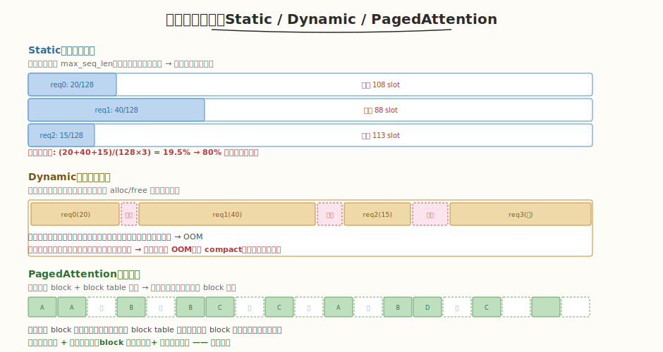
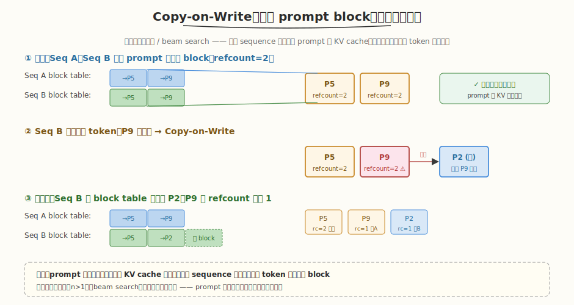

## Day 4：vLLM Worker 与 PagedAttention

### 🎯 目标

通过今天的学习，你将：

1. 理解 vLLM **Worker 层**的职责——接收 Scheduler 输出、构建 attention metadata（含 block table）、调用 ModelRunner 执行前向<br>
2. 掌握 **PagedAttention** 的核心思想——借鉴 OS 虚拟内存分页，把 KV cache 分成固定大小 block，逻辑连续、物理不连续<br>
3. 能画出 **block table** 的逻辑→物理映射图，理解 attention kernel 如何通过 block table 间接寻址读取 KV<br>
4. 掌握 **Copy-on-Write（写时复制）** 机制——多个 sequence 共享 prompt block，写入时才复制，节省显存<br>
5. 理解 PagedAttention 如何解决 **静态分配的浪费** 与 **动态分配的碎片** 两大内存管理难题<br>
6. 能用 CUDA 手写一个最小化的 PagedAttention kernel，通过 block table 间接寻址并验证正确性

> 💡 **为什么重要**：Day 3 我们读完了 vLLM 的 Scheduler——它靠 Continuous Batching 每轮重建 batch，完成的请求立即释放 slot。但"释放 slot"要能真正做到不产生碎片，否则 slot 回收了也拼不出大块。PagedAttention 就是解决这个的——它是 vLLM 最核心的创新，也是 SOSP 2023 论文的主题。没有 PagedAttention，Continuous Batching 的吞吐收益会被内存碎片吃掉一大半。今天我们把它从原理到 kernel 实现彻底吃透。

---

### 学前导读：Continuous Batching 的"隐形杀手"——内存碎片

Day 3 的 mini 调度器里，请求完成时我们 `used_blocks -= seq.kv_blocks` 就算"释放"了。但真实场景下，KV cache 不是按"整个序列"连续分配的——如果按序列连续分配，长度不确定的请求频繁 alloc/free 会产生大量**外部碎片**：释放的小空洞拼不回来，新请求放不下就 OOM。



| 策略 | 内部碎片 | 外部碎片 | 问题 |
|------|---------|---------|------|
| **静态**（预分配 max_seq_len） | 严重（实际长度常远小于 max） | 无 | 80% 显存浪费在"预占未用" |
| **动态**（按实际长度连续分配） | 无 | 严重 | 完成释放后留空洞，大请求 OOM |
| **PagedAttention**（分页） | 极小（最后一块的空 slot） | 无 | block 粒度回收，空闲 block 随时复用 |

PagedAttention 的破局思路：**别按序列连续分配，改成按固定大小 block 分配**——就像 OS 的虚拟内存分页。一个序列的 KV cache 由若干 block 拼成，block 之间物理上可以不连续，用一张 **block table** 记录"第几个逻辑 block 在哪个物理 block"。完成时整 block 回收到池子，下次任意序列都能用——无外部碎片。

> 💡 **一句话总结**：PagedAttention 把"连续分配的 KV cache"变成"分页 + block table 映射"，让 Continuous Batching 的高频 slot 回收不再产生碎片——这是 vLLM 吞吐优势的地基。

---

### 理论学习

#### 4.1 vLLM Worker 的执行流程

Worker 是 vLLM 三层架构的最底层，负责执行实际模型前向：

```
Worker.execute_model(seq_group_metadata_list):
  1. 构建 input tokens 和 positions
  2. 构建 attention metadata（含 block table）  ← PagedAttention 的关键
  3. 调用 ModelRunner.run() 执行模型前向
  4. 采样得到 next token
  5. 返回 outputs
```

##### Block Table 如何传入 Kernel

```python
# Attention metadata 中的 block_tables
# shape: (num_seqs, max_num_blocks_per_seq)
# 每个元素是物理 block 编号
block_tables = [
    [7, 1, 12, 3],     # seq 0 的逻辑 block 0..3 → 物理 block 7,1,12,3
    [2, 5, 8],         # seq 1 的逻辑 block 0..2 → 物理 block 2,5,8
]
# Kernel 内部根据 block_table 找到 KV cache 的物理位置
```

Scheduler 在每轮 `schedule()` 时更新 block table（分配新 block、回收完成的 block），Worker 把它打包进 attention metadata 传给 kernel。**kernel 看到 KV cache 的方式不再是"连续地址"，而是"经 block table 间接寻址"**。

#### 4.2 PagedAttention 核心思想：分页 + block table


借鉴 OS 虚拟内存分页：

| OS 虚拟内存 | PagedAttention | 对照 |
|------------|----------------|------|
| 虚拟页（virtual page） | 逻辑 block | 序列视角连续编号 |
| 物理页框（physical frame） | 物理 block | 显存中实际位置，可不连续 |
| 页表（page table） | block table | 逻辑→物理映射 |
| MMU | block allocator | 分配/回收物理 block |

##### 关键参数

```
block_size：每 block 容纳多少 token（vLLM 默认 16）
num_blocks：物理 block 池总大小（按可用显存 / block 大小算）
max_num_blocks_per_seq = ceil(max_seq_len / block_size)
```

##### 逻辑 view vs 物理 view

```
逻辑 view（序列视角，连续）:
  Seq 0: [逻辑 block 0, 1, 2, 3]  → token 0..15, 16..31, 32..47, 48..49

物理 view（显存池中，散布）:
  逻辑 block 0 → 物理 block 7
  逻辑 block 1 → 物理 block 1
  逻辑 block 2 → 物理 block 12
  逻辑 block 3 → 物理 block 3

Block Table for Seq 0: [7, 1, 12, 3]
```

> ⚠️ **注意**：block_size 选 16 是经验值。太大 → 内部碎片（最后一块空 slot 多）+ block table 变短但单 block 大；太小 → block table 变长（占显存）+ kernel 间接寻址次数多。16 在大多数场景下是 sweet spot。

#### 4.3 attention kernel 如何通过 block table 读取 KV

传统 attention kernel 读 KV 是连续地址：`K[s * d]`。PagedAttention kernel 多一步**间接寻址**：

```cuda
// 传统（连续布局）：
float k_val = K[s * d + t];           // 直接算地址

// PagedAttention（分页布局）：
int logical_block = s / BLOCK_SIZE;    // 第几个逻辑 block
int offset = s % BLOCK_SIZE;           // block 内第几个 token
int physical_block = block_table[logical_block];   // 查表得物理 block
float k_val = k_pool[physical_block * BLOCK_SIZE * d + offset * d + t];  // 物理 block 内读取
```

kernel 遍历所有历史 key 时，按逻辑 block 顺序（0, 1, 2, ...），每步查 `block_table[lb]` 得物理 block，再读该 block 内的 KV 数据。今天 Coding 任务就实现这个 kernel。

#### 4.4 Copy-on-Write：共享 prompt block



**场景**：并行采样（`n>1`，一个 prompt 生成多个回答）、beam search、多轮对话共享历史。这些场景下多个 sequence 共享同一份 prompt 的 KV cache。

**机制**：
1. **共享**：Seq A 和 Seq B 共享 prompt 的物理 block，`refcount=2`，只读不冲突
2. **写入触发复制**：当 Seq B 要往最后一个共享 block 追加新 token 时，发现该 block `refcount>1`（被共享）→ 复制一份到新物理 block，Seq B 的 block table 指向新 block，原 block 的 `refcount` 降为 1
3. **收益**：prompt 部分（可能很长）的 KV cache 只存一份，各 sequence 只为自己的新 token 分配独立 block

##### 引用计数实现

```python
class PhysicalTokenBlock:
    block_number: int
    refcount: int = 1

    def incr_refcount(self): self.refcount += 1
    def decr_refcount(self):
        self.refcount -= 1
        if self.refcount == 0:
            allocator.free(self)   # refcount 归零才回收到池子
```

`fork(parent_block_table)` 操作：复制一份 block table，所有 block 的 `refcount+1`——这是 beam search / 并行采样的起点。之后各 sequence 写新 token 时，只对"要写入的那个 block"做 CoW。

> 💡 CoW 的本质：**读共享、写复制**。多个 sequence 读同一份 prompt 的 KV（attention 只读不写历史 KV），零开销共享；只有要追加新 token 时才复制那一个 block。prompt 越长、候选越多，省的显存越多。

#### 4.5 Block Allocator

```python
class BlockAllocator:
    def allocate(self) -> PhysicalTokenBlock:
        # 从 free block pool 取一个空闲物理 block

    def free(self, block):
        # refcount 归零时，block 回收到 free pool

    def fork(self, parent_block_table) -> List[PhysicalTokenBlock]:
        # 复制 block table，所有 block refcount+1（CoW 的基础）
```

BlockAllocator 维护一个**空闲物理 block 池**。allocate 从池里取，free 归零后归还。因为 block 大小固定，归还的 block 立刻能被任意序列复用——**无外部碎片**。

#### 4.6 昇腾对照

| CUDA/vLLM 概念 | 昇腾 CANN 对应 | 对照说明 |
|---------|------------|---------|
| PagedAttention | 昇腾 PagedAttention | CANN 已内置类似实现 |
| Block Table | Block 映射表 | 概念一致 |
| Logical block | 逻辑 block | 概念一致 |
| Physical block | 物理 block | 概念一致 |
| Block Allocator | 显存池管理器 | 功能一致 |
| Copy-on-Write | 写时复制 | 策略一致 |
| Shared prompt | 共享 prompt cache | 两者都支持 |
| Block size | Block 大小（如 16 tokens） | 都是可配置参数 |

> 💡 PagedAttention 是**内存管理层面**的创新，与硬件无关——OS 分页思想跨平台通用。昇腾 CANN 同样内置了 PagedAttention（block table、CoW、block allocator 概念一致）。差异只在底层 allocator 的实现（CUDA `cudaMalloc` 池 vs 昇腾 `aclrtMalloc` 池）和 attention kernel 的间接寻址细节。

---

### Coding 任务：手写 PagedAttention kernel

#### 任务 1：创建 paged_attention.cu

创建文件 [kernels/paged_attention.cu](kernels/paged_attention.cu)，实现一个最小化的 PagedAttention kernel（block table 间接寻址 + online softmax）：

```cuda
// paged_attention.cu —— PagedAttention 最小化实现（block table + 分块 KV cache attention）
// 编译命令: nvcc -o paged_attention paged_attention.cu -O3 -arch=sm_80
// 运行命令: ./paged_attention
//
// 演示 PagedAttention 的三大核心机制：
//   1. KV cache 按 block 分块存储（物理 block 可不连续）
//   2. block table 维护 逻辑 block → 物理 block 映射
//   3. attention kernel 通过 block table 间接寻址读取 KV

#include <cuda_runtime.h>
#include <cstdio>
#include <cstdlib>
#include <cmath>
#include <vector>

#define BLOCK_SIZE 256
#define WARP_SIZE  32
#define NUM_WARPS  (BLOCK_SIZE / WARP_SIZE)
#define KV_BLOCK_SIZE 16    // 每个 KV cache block 容纳 16 个 token（vLLM 默认）

// ---------- 块归约 ----------
__inline__ __device__ float warp_reduce_sum(float v) {
    #pragma unroll
    for (int o = WARP_SIZE/2; o > 0; o >>= 1) v += __shfl_down_sync(0xffffffff, v, o);
    return v;
}
__inline__ __device__ float block_reduce_sum(float v, float* sh) {
    int lane = threadIdx.x & 31, wid = threadIdx.x >> 5;
    v = warp_reduce_sum(v);
    if (lane == 0) sh[wid] = v; __syncthreads();
    if (wid == 0) { v = (lane < NUM_WARPS) ? sh[lane] : 0.f; v = warp_reduce_sum(v); if (lane==0) sh[0]=v; }
    __syncthreads(); return sh[0];
}

// ---------- PagedAttention kernel（decode：1 query 对 N 历史 key）----------
// kv_cache_pool: 物理 block 池，布局 [num_blocks, KV_BLOCK_SIZE, d]
// block_table:   [max_num_blocks_per_seq]，block_table[l] = 第 l 个逻辑 block 的物理 block 号
// q:             [d]，当前 query 向量
// output:        [d]，attention 输出
// seq_len:       历史 key 数量
__global__ void paged_attention_kernel(
    const float* __restrict__ k_cache_pool,
    const float* __restrict__ v_cache_pool,
    const int*   __restrict__ block_table,
    const float* __restrict__ q,
    float*       __restrict__ output,
    int seq_len, int d, int max_blocks_per_seq) {

    __shared__ float q_shm[256];
    __shared__ float red[NUM_WARPS + 1];
    __shared__ float s_k_shm, alpha_shm, beta_shm;

    int tid = threadIdx.x;
    const float scale = 1.0f / sqrtf((float)d);

    for (int t = tid; t < d; t += BLOCK_SIZE) q_shm[t] = q[t];
    __syncthreads();

    float m = -INFINITY, l = 0.f;
    float o_local = 0.f;

    // 遍历所有历史 key（按逻辑 block 顺序，通过 block_table 找物理 block）
    int num_logical_blocks = (seq_len + KV_BLOCK_SIZE - 1) / KV_BLOCK_SIZE;
    for (int lb = 0; lb < num_logical_blocks; ++lb) {
        int physical_block = block_table[lb];          // ★ 核心：逻辑→物理映射
        const float* k_block = k_cache_pool + (size_t)physical_block * KV_BLOCK_SIZE * d;
        const float* v_block = v_cache_pool  + (size_t)physical_block * KV_BLOCK_SIZE * d;

        int tokens_in_block = min(KV_BLOCK_SIZE, seq_len - lb * KV_BLOCK_SIZE);
        for (int s = 0; s < tokens_in_block; ++s) {
            const float* k_vec = k_block + s * d;
            const float* v_vec = v_block + s * d;

            float part = 0.f;
            for (int t = tid; t < d; t += BLOCK_SIZE) part += q_shm[t] * k_vec[t];
            float s_k = block_reduce_sum(part, red) * scale;
            if (tid == 0) s_k_shm = s_k;
            __syncthreads(); s_k = s_k_shm;

            if (tid == 0) {
                float m_new = fmaxf(m, s_k);
                float alpha = expf(m - m_new);
                float p     = expf(s_k - m_new);
                float l_new = l * alpha + p;
                alpha_shm = (l * alpha) / l_new;
                beta_shm  = p / l_new;
                m = m_new; l = l_new;
            }
            __syncthreads();

            for (int t = tid; t < d; t += BLOCK_SIZE)
                o_local = o_local * alpha_shm + beta_shm * v_vec[t];
            __syncthreads();
        }
    }
    for (int t = tid; t < d; t += BLOCK_SIZE) output[t] = o_local;
}
```

代码要点：
- **`block_table[lb]`**：核心间接寻址——逻辑 block `lb` 映射到物理 block `block_table[lb]`，kernel 据此算出 `k_block`/`v_block` 的实际地址
- **双层循环**：外层遍历逻辑 block（连续），内层遍历 block 内 token（最后一块可能不满）
- **online softmax**：复用 Week 4 的三公式，把点积→softmax→加权 V 融合成一遍扫描，无需物化 score 矩阵
- **CPU 参考用连续布局**：验证 paged 版（物理散布）与连续版结果一致，证明 block table 映射正确

#### 任务 2：编译与运行

```bash
nvcc -o paged_attention kernels/paged_attention.cu -O3 -arch=sm_80
./paged_attention
```

**预期输出**：

```text
=== PagedAttention Test ===
d=64, seq_len=50, KV_BLOCK_SIZE=16, num_logical_blocks=4
block_table (logical→physical): 0→7  1→1  2→12  3→3
max diff (paged vs contiguous): 0.00e+00 (PASS)

[Memory utilization]
  Static alloc (max=128): waste 61% (allocated 128, used 50)
  PagedAttention:        use 50% of static (4 blocks × 16 tok = 64 slots, 50 actual)
  PagedAttention 的物理 block 可不连续（本例 7,1,12,3），逻辑连续由 block table 保证
```

##### 验证逻辑解读

- **block_table 故意打乱**：逻辑 block 0→7、1→1、2→12、3→3，物理上散布——证明逻辑连续不依赖物理连续
- **数据落位**：按 block_table 把连续的 K/V 数据写入物理 pool 的散布位置，kernel 再按 block_table 读回
- **正确性**：paged 版输出与连续版 CPU 参考逐元素比对 `max_diff=0`，证明间接寻址无误
- **内存利用率**：静态分配浪费 61%，PagedAttention 只用 4 个 block（含 14 个空 slot 的内部碎片）

#### 任务 3：用 ncu 观察间接寻址的开销

```bash
ncu --kernel-name regex:paged_attention_kernel \
    --metrics gpu__time_duration.sum, \
              dram__bytes.sum, \
              sm__inst_executed.avg.per_cycle_active \
    ./paged_attention
```

**观察重点**：
- PagedAttention 比"连续布局 attention"多了 block_table 查表（一次额外 global 读 `block_table[lb]`），但这个开销极小（每 16 个 token 才查一次表）
- 主要 IO 仍是读 K/V 数据（`dram__bytes` 与连续版相当），block table 本身很小（每序列几十个 int）

> 💡 思考：block_table 查表的开销为什么可忽略？（提示：block_size=16 意味着每 16 个 token 才查一次表，而每个 token 要读 `d` 个 float——表查询的 amortized 开销 = 1 次 int 读 / (16 × d 次 float 读) ≈ 极小。）

#### 任务 4：LeetGPU 在线题目 —— Causal Self-Attention

**题目链接**：<https://leetgpu.com/challenges/causal-self-attention>

**题目概述**：

实现 **Causal（masked）Self-Attention**：给定 `Q/K/V ∈ R^{M×d}`，计算 `softmax(masked(QK^T/√d))·V`，其中 causal mask 把 query `i` 对 key `j>i` 的位置设为 `-∞`（下三角允许，上三角屏蔽）。

**约束条件**：性能测试取 `M=5000, d=128`；容差 `atol=rtol=1e-5`。

**与今日知识的关联**：

Causal Self-Attention 正是 **PagedAttention 服务的 attention 变体**——LLM 推理的 prefill 阶段跑的就是 causal self-attention（生成第 i 个 token 时只能看到前 i 个 token）。今天我们手写了 PagedAttention kernel（decode 场景：1 query 对 N key），这道题是它的 prefill 对偶——M 个 query 互相做 causal masked attention。PagedAttention 的 block table 机制同样适用于 causal attention：prefill 时把 prompt 的 KV 按 block 分块存入 paged pool，kernel 通过 block table 间接寻址。两者的核心都是"间接寻址 + online softmax 融合"。

> 💡 提交后在 [LeetGPU Causal Self-Attention](https://leetgpu.com/challenges/causal-self-attention) 上记录通过耗时。完整题解（含 causal mask 的 online softmax 实现、上三角屏蔽、与 PagedAttention 的 prefill 对偶关系）见 [Causal Self-Attention 题解](../../leetgpu/week5/day4/leetgpu-causal-self-attention-solution.md)。

#### 任务 5：LeetCode 面试题 —— 复制带随机指针的链表

**题目链接**：[138. 复制带随机指针的链表](https://leetcode.cn/problems/copy-list-with-random-pointer/)

**题目概述**：

给定一个长度为 `n` 的链表，每个节点除了 `next` 指针外还有一个 `random` 指针，可指向链表中任意节点或 `null`。请**深拷贝**整个链表（构造一个全新链表，节点关系与原链表一致），返回头节点。

**与今日知识的关联**：

这道题是 **Copy-on-Write 机制的算法直觉**——PagedAttention 的 CoW 要"复制一个被多个 sequence 共享的 block table 结构"，本质就是"深拷贝带复杂引用的结构"。链表的 `random` 指针就像 block table 里的"逻辑→物理映射"：复制时不能简单复制指针值（否则新结构指向旧结构），要建立"旧节点→新节点"的映射，再据此修正所有引用。两者的核心都是**复制带共享引用的结构时，先建映射再修正指针**——CoW 复制 block table 后要更新各 sequence 对物理 block 的引用，正是"深拷贝带随机指针链表"的工程化版本。

**核心套路**：

```
方法一（哈希表）：建立 old→new 的映射，两次遍历
  第一遍：创建所有新节点，存 map[old]=new
  第二遍：new.next = map[old.next], new.random = map[old.random]

方法二（拼接拆分，O(1) 空间）：
  1. 在每个 old 节点后插入它的副本：A→A'→B→B'→...
  2. 设副本的 random：old.random.next 就是 new.random
  3. 拆分奇偶链表
```

> 💡 完整题解（含哈希表法 + O(1) 空间拼接拆分法、C++/Python 参考代码、与 CoW 的模式类比）见 [复制带随机指针的链表题解](../../../leetcode/daily/week5/day4/复制带随机指针的链表.md)。

---

### 扩展实验

#### 实验 1：手动构造 block table 示例

序列长度 50，block_size=16，给出逻辑/物理映射：
- 逻辑 block 数 = ceil(50/16) = 4
- 假设物理池有 20 个 block，本序列分到物理 block 7, 1, 12, 3
- 画出 block_table = [7, 1, 12, 3]，标注每个逻辑 block 的 token 范围（0-15, 16-31, 32-47, 48-49）

> 思考：最后一块只有 2 个 token（48-49），空了 14 个 slot——这是内部碎片。block_size 越大内部碎片越严重，怎么权衡？（提示：vLLM 选 16 是经验最优。）

#### 实验 2：模拟 Copy-on-Write

扩展 `paged_attention.cu` 的 main 函数：构造两个 sequence 共享同一个 prompt 的物理 block（block_table 前缀相同），然后让 Seq B "写入"新 token——检测到最后一个共享 block 的 refcount>1 时，分配新物理 block、复制内容、更新 Seq B 的 block_table。打印 CoW 前后的 block_table 和 refcount 变化。

> 思考：CoW 什么时候不触发？（提示：refcount==1 时直接写，无需复制。所以并行采样只在"第一个 sequence 写新 token"时才 CoW，后续各 sequence 已独立。）

#### 实验 3：对比 PagedAttention vs 连续布局的 kernel 性能

写一个 `continuous_attention_kernel`（KV cache 连续布局，直接 `K[s*d+t]`），与 `paged_attention_kernel` 对比 wall-clock。用 `cudaEvent` 计时，扫描 `seq_len = 128, 512, 2048, 8192`。

> 思考：PagedAttention 的间接寻址开销占多少？（提示：理论上每 16 token 一次查表，开销应 < 1%。实测若差异显著，可能是 cache 局部性差异——物理不连续导致 L2 命中率下降。）

---

### 今日总结

Day 4 我们把 vLLM 最核心的创新——PagedAttention——从原理到 kernel 实现彻底吃透：

1. **Worker 执行流程**：接收 Scheduler 输出 → 构建 attention metadata（含 block table）→ ModelRunner.run() → 采样返回
2. **PagedAttention 核心思想**：借鉴 OS 虚拟内存分页，KV cache 按 block_size（默认 16）分块，逻辑连续、物理不连续，block table 维护映射
3. **block table 间接寻址**：kernel 读 KV 时多一步 `physical_block = block_table[logical_block]`，开销极小（每 16 token 查一次表，amortized 可忽略）
4. **Copy-on-Write**：多 sequence 共享 prompt block（refcount>1），写入时才复制——读共享、写复制，prompt 越长候选越多省得越多
5. **解决两大碎片**：无静态浪费（按需分配 block）+ 无外部碎片（block 粒度回收，空闲 block 随时复用）
6. **block allocator**：维护空闲物理 block 池，allocate/free/fork 三件套，fork 是 CoW 的基础
7. **手写 PagedAttention kernel**：block table 间接寻址 + online softmax，物理散布的 KV 与连续布局结果逐元素一致，证明映射正确

掌握这些后，vLLM 的"调度（Day 3）+ 内存管理（Day 4）"双支柱就完整了——明天 Day 5 把它们整合进 Mini 推理引擎 v0，Day 6 再做端到端 profiling。

---

### 面试要点

1. **什么是 PagedAttention？它解决了什么问题？**

   - PagedAttention 借鉴 OS 虚拟内存分页，把 KV cache 分成固定大小 block（默认 16 token/block）
   - 逻辑 block 对序列连续编号，物理 block 在显存中可以不连续，用 block table 维护映射
   - 解决的问题：① 静态分配的内部碎片（预分配 max_seq_len 浪费严重）② 动态分配的外部碎片（频繁 alloc/free 留空洞）③ 长文本显存管理困难
   - 收益：显存利用率从 ~20%（静态）提升到 ~90%+，支持更大 batch、更长序列，是 vLLM 吞吐优势的地基

2. **block table 是什么？attention kernel 怎么用它？**

   - block table 是"逻辑 block → 物理 block"的映射数组，`block_table[l] = 第 l 个逻辑 block 的物理 block 号`
   - kernel 读 KV 时间接寻址：`logical_block = s / block_size; physical_block = block_table[logical_block]; addr = pool + physical_block * block_size * d + offset * d`
   - 开销极小：每 block_size（16）个 token 才查一次表，amortized 到每 token 是 1 次 int 读 / (16×d 次 float 读)
   - block table 由 Scheduler 在每轮 schedule() 时更新（分配/回收 block），Worker 打包进 attention metadata 传给 kernel

3. **PagedAttention 中的 Copy-on-Write 是什么？在什么场景下使用？**

   - CoW（写时复制）：多个 sequence 共享同一物理 block 时，读共享、写复制
   - 触发：当 sequence 要往一个 `refcount>1` 的 block 追加新 token 时，复制该 block 到新物理 block，更新自己的 block table，原 block refcount-1
   - 使用场景：并行采样（n>1，一 prompt 多回答）、beam search（多候选共享 prompt）、多轮对话共享历史
   - 收益：prompt 部分的 KV cache 只存一份，各 sequence 只为新 token 分配独立 block——prompt 越长候选越多省得越多
   - 实现：PhysicalTokenBlock 带 refcount，fork 操作对所有 block refcount+1，free 时 refcount-1 归零才回收

4. **block_size 怎么选？太大太小各有什么问题？**

   - vLLM 默认 16，是经验最优
   - 太大：① 内部碎片严重（最后一块空 slot 多）② 单 block 大，cache 局部性差
   - 太小：① block table 变长（每序列占更多 int 显存）② kernel 间接寻址次数多（查表频率升高）③ block allocator 管理开销大
   - 16 在大多数场景是 sweet spot：内部碎片可控（平均每序列浪费 < 8 token）、block table 短（4096 token 只需 256 个 int）、查表开销可忽略

5. **PagedAttention 与 Continuous Batching 是什么关系？**

   - 两者是 vLLM 吞吐优势的两大支柱，缺一不可
   - Continuous Batching（Day 3）：每轮 iteration 重建 batch，完成的请求立即释放 slot——但"释放 slot"要能真正不产生碎片，否则回收的显存拼不出大块
   - PagedAttention（Day 4）：block 粒度分配/回收，空闲 block 随时被任意序列复用——让 Continuous Batching 的高频 slot 回收无碎片化
   - 没有 PagedAttention，Continuous Batching 的吞吐收益会被内存碎片吃掉一大半；没有 Continuous Batching，PagedAttention 的动态分配优势也无用武之地

6. **能对照昇腾解释 PagedAttention 的对应实现吗？**

   - PagedAttention 是内存管理层面的创新，与硬件无关——OS 分页思想跨平台通用
   - 昇腾 CANN 同样内置 PagedAttention：block table、逻辑/物理 block、CoW、block allocator 概念完全一致
   - 差异只在底层：CUDA 用 `cudaMalloc` 管 block 池，昇腾用 `aclrtMalloc`；attention kernel 的间接寻址实现细节不同（CUDA shared memory vs 昇腾 UB），但逻辑同构
   - block_size、CoW 策略、refcount 机制都是可配置/跨平台一致的
