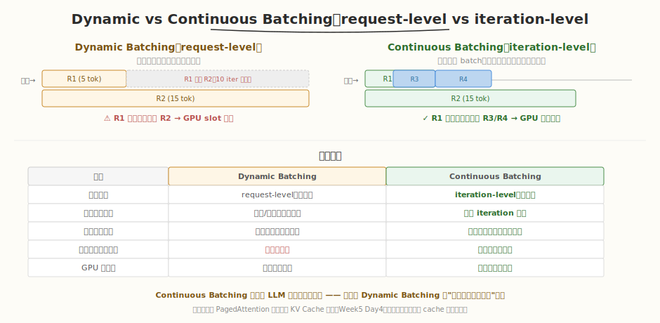
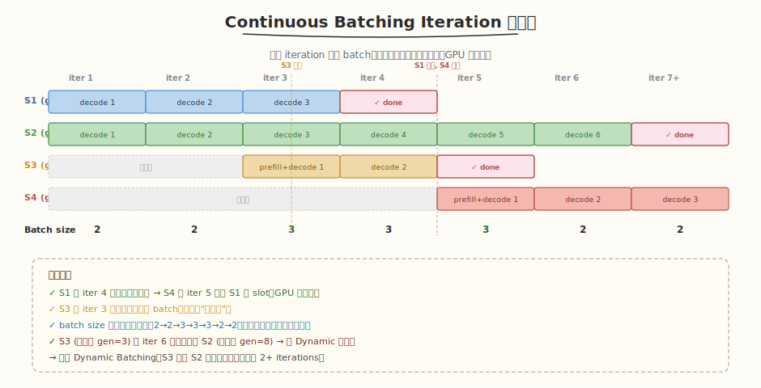
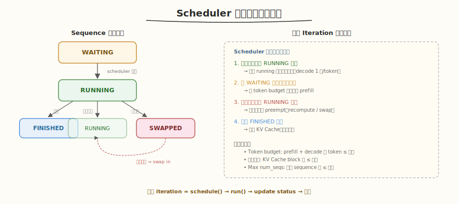

## Day 2：Continuous Batching

### 🎯 目标

通过今天的学习，你将：

1. 理解 **Dynamic Batching 的致命缺陷**——request-level 聚合导致长请求阻塞短请求，完成的请求必须等整批结束<br>
2. 掌握 **Continuous Batching** 的核心思想——iteration-level 调度，每轮重建 batch，完成即走、新请求随时插入<br>
3. 能画出 **iteration 时间线**，理解 batch size 如何随请求加入/退出动态变化<br>
4. 理解 **Scheduler 状态机**（WAITING → RUNNING → FINISHED/SWAPPED）与每轮调度决策的 4 个步骤<br>
5. 掌握 **Prefill + Decode 混合调度**的原理与挑战——token budget 分配、latency 抖动、chunked prefill<br>
6. 用 Python 手写一个 **ContinuousBatcher**，实测请求动态加入/退出，验证短请求不被长请求阻塞

> 💡 **为什么重要**：Day 1 的 Dynamic Batching 解决了"凑批"问题，但它有个致命缺陷：一个 batch 里所有请求一起开始一起结束——生成 5 个 token 的短请求要等生成 100 个 token 的长请求。Continuous Batching 把调度粒度从 request-level 降到 iteration-level，每轮重建 batch，完成的立即退出、新请求随时插入。这是现代 LLM 推理服务（vLLM、TensorRT-LLM）的核心技术，也是面试必考题。Week 5 Day 3 我们读过 vLLM 的 Continuous Batching 概念，今天亲手实现它。

---

### 学前导读：Dynamic Batching 的"长请求阻塞"问题

Day 1 的 Dynamic Batcher 把请求凑成一批一起 forward。但 LLM 是自回归生成——每个请求的生成长度不同且事先不确定。当 batch 里有一个长请求（gen=100）和多个短请求（gen=5）时：

```
Batch = [R1(gen=5), R2(gen=100)]
  iter 1-5: R1 和 R2 都在 decode
  iter 6:   R1 完成了！但 R2 还在跑...
  iter 6-100: R1 的 GPU slot 空等 R2 → 95 iterations 的浪费
```

| 维度 | Dynamic Batching | Continuous Batching |
|------|-----------------|---------------------|
| 调度粒度 | request-level（整批） | **iteration-level**（每轮） |
| 请求加入 | 凑满/超时后整批加入 | **任意 iteration** 加入 |
| 请求退出 | 整批完成后一起退出 | **完成即退出**（不等他人） |
| 短请求等待长请求 | 是（阻塞） | **否**（独立退出） |
| GPU 利用率 | 中（有空等） | **高**（始终满载） |

> 💡 **一句话总结**：Continuous Batching = 把 Dynamic 的"整批一起跑完"改成"每轮 iteration 重建 batch"——完成的退出、新请求插入，GPU 始终满载。它是现代 LLM 推理服务的核心技术。

---

### 理论学习

#### 2.1 Continuous Batching 核心思想



```
Iteration-level scheduling：
  - 每个 iteration 都重新构建 batch
  - 新请求可以在任意 iteration 加入
  - 完成的请求可以在任意 iteration 退出
  - 不再存在"一个 batch 一起结束"的概念

效果：
  - GPU 始终满负荷运行
  - 短请求不会被长请求阻塞
  - Throughput 和 latency 都更好
```

##### 核心区别：request-level vs iteration-level

| 概念 | Dynamic Batching | Continuous Batching |
|------|-----------------|---------------------|
| 调度单位 | 一个 request batch | 一个 **iteration**（单步 decode） |
| batch 生命周期 | 从开始到整批完成 | **单轮**，下轮重建 |
| 完成处理 | 整批完成后统一返回 | **完成即返回**，立即释放 slot |
| 新请求 | 等下一批 | **当前 iteration 即可加入** |

#### 2.2 Iteration 时间线



```
Time 0:  Batch = [S1_prefill, S2_prefill]           ← 2 个请求同时 prefill
Time 1:  S1, S2 进入 decode
         Batch = [S1_decode, S2_decode]
Time 2:  新请求 S3 到达
         Batch = [S1_decode, S2_decode, S3_prefill]  ← S3 立刻加入
Time 3:  S1 生成结束（gen=4，短请求）
         Batch = [S2_decode, S3_decode]              ← S1 退出，S3 接替
Time 4:  新请求 S4 到达
         Batch = [S2_decode, S3_decode, S4_prefill]  ← S4 填入 S1 的 slot
Time 5:  S3 生成结束（gen=3，比 S2 早完成）
         Batch = [S2_decode, S4_decode]              ← S3 退出，不等 S2
...
```

##### 关键观察

1. **S1 在 iter 4 完成，立即退出** → S4 在 iter 5 填入 S1 的 slot（GPU 不空等）
2. **S3 在 iter 3 到达，立刻加入** batch（不需等"下一批"）
3. **batch size 动态变化**：2→2→3→3→3→2→2（完成的退出、新请求加入）
4. **S3 (短请求) 不等 S2 (长请求)** → 比 Dynamic 节省等待

#### 2.3 Scheduler 状态机



##### Sequence 状态转换

```
         ┌─────────────┐
         │   WAITING   │  ← 请求到达，等待调度
         └──────┬──────┘
                │ scheduler 选择（token budget 允许）
                ▼
         ┌─────────────┐
         │   RUNNING   │  ← 正在 prefill / decode
         └──────┬──────┘
                │
       ┌───────┼───────┐
       ▼       ▼       ▼
  FINISHED  SWAPPED  RUNNING (next iter)
  (完成退出) (被抢占)  (继续 decode)
```

##### 每轮调度决策

Scheduler 每轮需要决定 4 件事：

1. **继续运行哪些 RUNNING 请求**（保留 running 队列中的序列，decode 1 步）
2. **从 WAITING 加入哪些新请求**（在 token budget 允许时做 prefill）
3. **是否抢占某些 RUNNING 请求**（显存不足时 preempt）
4. **处理 FINISHED 请求**（释放 KV Cache、返回结果）

约束条件：
- **Token budget**：prefill + decode 总 token 数 ≤ 上限
- **显存预算**：KV Cache block 数 ≤ 上限
- **Max num_seqs**：并发 sequence 数 ≤ 上限

#### 2.4 Prefill + Decode 混合调度

```
Continuous Batching 可以混合 prefill 和 decode：
  - 一个 iteration 中同时处理：
    - 新请求的 prefill（一次性处理多个 prompt tokens）
    - 正在生成的请求的 decode（每次 1 个 token）
  - 这是 vLLM 和许多现代推理系统的标准做法

挑战：
  - Prefill 和 decode 的计算特征不同（prefill compute-bound, decode memory-bound）
  - Prefill 会"打断" decode 的 smooth latency
  - 需要 token budget 控制每轮的计算量

解决方案：Chunked Prefill
  - 将长 prompt 的 prefill 拆成多个小 chunk
  - 每个 chunk 与 decode 请求一起执行
  - 平滑 latency，避免长 prompt 阻塞
```

| 挑战 | 原因 | 解决方案 |
|------|------|---------|
| Token budget 分配 | prefill 消耗大量 budget，影响 decode | 限制每轮 prefill token 数 |
| 内存需求 | prefill 需要临时 KV Cache 空间 | 动态 block 分配 |
| Latency 抖动 | prefill 加入时 decode latency 突增 | chunked prefill 平滑 |

#### 2.5 昇腾对照

| CUDA/推理概念 | 昇腾 CANN 对应 | 对照说明 |
|---------|------------|---------|
| Continuous Batching | 动态批处理 / Inflight Batching | 概念完全一致 |
| Iteration-level scheduling | Iteration 级调度 | 一致 |
| Request-level scheduling | Request 级调度 | 一致 |
| Prefill + Decode 混合 | 混合调度 | 昇腾推理框架同样支持 |
| Token budget | Token 预算 | 一致 |
| Sequence 动态加入/退出 | 请求动态加入/退出 | 一致 |

> 💡 Continuous Batching 是**系统调度层面**的创新，与硬件无关——无论 CUDA 还是昇腾，都是"每轮 iteration 重建 batch"。差异只在底层 forward 的 kernel 实现。

---

### Coding 任务：手写 Continuous Batcher

#### 任务 1：创建 continuous_batcher.py

创建文件 [kernels/continuous_batcher.py](kernels/continuous_batcher.py)，实现 iteration-level 调度：

```python
# continuous_batcher.py —— Continuous Batching 实现（iteration-level 调度）
# 运行命令: python continuous_batcher.py
# 依赖: 仅标准库

import time
import threading
from collections import deque
from enum import Enum
from typing import List, Dict


class SeqStatus(Enum):
    WAITING = "waiting"
    RUNNING = "running"
    FINISHED = "finished"


class Sequence:
    """一个推理序列（对应 vLLM 的 Sequence）"""
    def __init__(self, seq_id: int, prompt_len: int, max_new_tokens: int = 10):
        self.seq_id = seq_id
        self.prompt_len = prompt_len
        self.max_new_tokens = max_new_tokens
        self.generated_count = 0
        self.status = SeqStatus.WAITING
        self.start_iter = -1
        self.finish_iter = -1
        self.done_event = threading.Event()

    def append_token(self):
        self.generated_count += 1
        if self.generated_count >= self.max_new_tokens:
            self.status = SeqStatus.FINISHED
            self.done_event.set()


class ContinuousBatcher:
    """Continuous Batcher：每轮 iteration 重新构建 batch"""

    def __init__(self, max_token_budget: int = 50, max_num_seqs: int = 8):
        self.max_token_budget = max_token_budget
        self.max_num_seqs = max_num_seqs
        self.waiting_queue: deque[Sequence] = deque()
        self.running: Dict[int, Sequence] = {}
        self.lock = threading.Lock()
        self.stop_event = threading.Event()
        self.worker_thread = threading.Thread(target=self._worker_loop, daemon=True)
        self.worker_thread.start()
        self.iteration = 0

    def submit(self, seq: Sequence):
        with self.lock:
            self.waiting_queue.append(seq)

    def _schedule(self) -> List[Sequence]:
        """每轮调度：保留 running + 从 waiting 补入（token budget 约束）"""
        batch = []
        token_budget = self.max_token_budget
        with self.lock:
            # 1. 移除已完成的 running 序列
            finished_ids = [sid for sid, s in self.running.items()
                           if s.status == SeqStatus.FINISHED]
            for sid in finished_ids:
                self.running.pop(sid)
            # 2. 保留正在运行的序列（decode 每步消耗 1 token budget）
            for seq in self.running.values():
                if token_budget >= 1 and len(batch) < self.max_num_seqs:
                    batch.append(seq)
                    token_budget -= 1
            # 3. 从 waiting 补入新请求（prefill 消耗 prompt_len token budget）
            still_waiting = deque()
            for seq in self.waiting_queue:
                cost = seq.prompt_len
                if token_budget >= cost and len(batch) < self.max_num_seqs:
                    seq.status = SeqStatus.RUNNING
                    seq.start_iter = self.iteration + 1
                    self.running[seq.seq_id] = seq
                    batch.append(seq)
                    token_budget -= cost
                else:
                    still_waiting.append(seq)
            self.waiting_queue = still_waiting
        return batch

    def _run_iteration(self, batch: List[Sequence]):
        """运行一个 iteration：每个序列生成 1 个 token"""
        forward_time = 0.002 + 0.0005 * len(batch)
        time.sleep(forward_time)
        for seq in batch:
            if seq.status == SeqStatus.RUNNING:
                seq.append_token()
                if seq.status == SeqStatus.FINISHED:
                    seq.finish_iter = self.iteration + 1

    def _worker_loop(self):
        while not self.stop_event.is_set():
            batch = self._schedule()
            if batch:
                self.iteration += 1
                self._run_iteration(batch)
            else:
                time.sleep(0.001)
```

代码要点：
- **`_schedule()`**：每轮调度的核心——①移除已完成序列 → ②保留 running（decode）→ ③从 waiting 补入新请求（prefill），受 token budget 约束
- **`_run_iteration()`**：每轮 forward，每个序列生成 1 个 token；完成的序列设置 `FINISHED` 状态
- **与 Day 1 Dynamic Batcher 的区别**：Dynamic 的 `_collect_batch` 凑满一批发一次；Continuous 的 `_schedule` 每轮都调用，完成即走、新请求随时加入

#### 任务 2：运行并观察 iteration 时间线

```bash
python kernels/continuous_batcher.py
```

**预期输出**（节选）：

```text
Submitting 3 sequences with staggered arrival...

  S1 submitted: prompt=3, gen=4
  S2 submitted: prompt=5, gen=8 (long request)
  S3 submitted: prompt=2, gen=3  (arrives during S1/S2 decode, short)

 Iter  BatchSize                                   States   Finished
----------------------------------------------------------------------
    1          2                   S1(decode), S2(decode)          0
    2          2                   S1(decode), S2(decode)          0
    3          3       S1(decode), S2(decode), S3(decode)          0
    4          3         S1(done), S2(decode), S3(decode)          1
    5          2                     S2(decode), S3(done)          1
    6          1                               S2(decode)          0
    ...
    8          1                                 S2(done)          1

=== Continuous vs Dynamic Batching Comparison ===
  Continuous: S3 (短请求) 在 iter 6 完成，立即退出，不等待 S2
  Dynamic:    S1,S2,S3 同 batch 开始，S3 完成后要等 S2（到 iter 9）
  S3 等待节省: 3 iterations
```

##### 观察重点

1. **S3 在 iter 3 加入**：S1/S2 正在 decode 时 S3 到达，立刻被调度加入（不需等"下一批"）
2. **S1 在 iter 4 完成**：立即退出，iter 5 的 batch size 从 3 降到 2
3. **S3 在 iter 6 完成**：短请求（gen=3）先于 S2（gen=8）完成，**不等 S2**
4. **batch size 动态变化**：2→2→3→3→2→1→1→1（完成退出、新请求加入）
5. **对比 Dynamic**：S3 节省 3 个 iteration 的等待（Dynamic 下 S3 要等 S2 到 iter 9）

#### 任务 3：对比 Dynamic Batcher

修改 `main()`，同时运行 Day 1 的 DynamicBatcher 和今天的 ContinuousBatcher，对比相同请求集合的总完成时间和 S3 的等待 iterations。

> 思考：Continuous Batching 在什么场景下优势最大？（提示：请求长度方差越大，Dynamic 的空等越多，Continuous 的收益越大。）

#### 任务 4：LeetGPU 在线题目 —— Max Subarray Sum

**题目链接**：<https://leetgpu.com/challenges/max-subarray-sum>

**题目概述**：

给定长度为 N 的 int32 数组和窗口大小 `window_size`，求所有长度恰好为 `window_size` 的连续子数组的**最大和**。

**约束条件**：`1 ≤ N ≤ 50000`，`1 ≤ window_size ≤ N`；性能测试取 `N=50000, window_size=25000`。

**与今日知识的关联**：

这道题的**滑动窗口**思想与 Continuous Batching 的 iteration-level 调度同构——窗口在数据上滑动，每步加入一个新元素、移出一个旧元素，正是 Continuous Batching "每轮加入新请求、移出完成请求"的微缩版。Continuous Batcher 的 `_schedule()` 维护一个"活动窗口"（running 序列集合），每轮有新请求滑入（prefill）、完成请求滑出（FINISHED），窗口大小（batch size）动态变化。这道题的 GPU 实现用 prefix sum 或滑动窗口累加，对应推理系统里 token budget 的窗口控制。

> 💡 提交后在 [LeetGPU Max Subarray Sum](https://leetgpu.com/challenges/max-subarray-sum) 上记录通过耗时。完整题解（含滑动窗口 kernel、prefix sum 优化、与 Continuous Batching 窗口调度的类比）见 [Max Subarray Sum 题解](../../leetgpu/week6/day2/leetgpu-max-subarray-sum-solution.md)。

#### 任务 5：LeetCode 面试题 —— 有效括号

**题目链接**：[20. 有效括号](https://leetcode.cn/problems/valid-parentheses/)

**题目概述**：

给定一个只包含 `(`、`)`、`{`、`}`、`[`、`]` 的字符串 `s`，判断字符串是否有效（括号正确闭合、顺序正确、类型匹配）。

**与今日知识的关联**：

有效括号的**栈匹配**（push 开括号、pop 闭括号匹配）与 Continuous Batching 的序列生命周期管理同构——每个请求加入 batch 是"push"，完成退出是"pop"，必须正确匹配（FIFO/栈序）。Scheduler 的 running 队列就是一个栈/队列：新请求 push 进来，完成的 pop 出去，中间的序列持续 decode。有效括号要求"后入先出"的匹配（最近的开括号先匹配），对应 Continuous Batching 中"最近加入的请求先完成退出的场景"（短请求 gen 少先完成）。两者都是**动态集合的入/出管理**。

**核心套路**：

```
遇到开括号 → push 入栈
遇到闭括号 → 检查栈顶是否匹配 → 匹配则 pop，不匹配则 invalid
最终栈空 → valid
```

> 💡 完整题解（含 C++/Python 参考代码、栈匹配图解、与 Continuous Batching 序列入/出管理的类比）见 [有效括号题解](../../../leetcode/daily/week6/day2/有效括号.md)。

---

### 扩展实验

#### 实验 1：实现 preemption

当 token budget 不足时，抢占最后加入的 running 序列（LIFO），将其状态设回 WAITING，释放其 KV Cache 预算。测试：提交超过 max_num_seqs 的请求，观察抢占行为。

> 思考：被抢占的请求重新调度时，是重新 prefill 还是恢复 KV Cache？（提示：Recomputation 重 prefill，Swapping 保留 cache 换出到 CPU。Week 5 Day 3 详讲。）

#### 实验 2：实现优先级调度

给 `Sequence` 加 `priority` 字段，修改 `_schedule()` 按优先级排序：高优先级请求优先加入 batch、低优先级请求先被抢占。测试：高优先级短请求后到但先完成。

> 思考：优先级调度可能产生什么问题？（提示：低优先级 starvation 饥死。解决：aging 老化策略。）

#### 实验 3：实现 prefill + decode 混合调度

修改 `_schedule()`，在同一轮 iteration 中同时处理新请求的 prefill 和 running 的 decode，用 token budget 分配：prefill 消耗 `prompt_len`，decode 消耗 1。测试：长 prompt 的 prefill 不阻塞短 decode。

> 思考：混合调度时 prefill 的 latency 抖动怎么解决？（提示：chunked prefill，拆成小块。Day 4 详讲。）

---

### 今日总结

Day 2 我们把 Dynamic Batching 的 request-level 聚合升级为 Continuous Batching 的 iteration-level 调度：

1. **Dynamic 的缺陷**：request-level 聚合，长请求阻塞短请求，完成的必须等整批结束 → GPU slot 空等
2. **Continuous 核心思想**：iteration-level 调度，每轮重建 batch，完成即走、新请求随时插入 → GPU 始终满载
3. **Iteration 时间线**：batch size 随请求加入/退出动态变化（2→3→2→1...），短请求先完成不等长请求
4. **Scheduler 状态机**：WAITING → RUNNING → FINISHED/SWAPPED，每轮决策 4 步（保留 running / 补入 waiting / 抢占 / 释放 finished）
5. **Prefill + Decode 混合**：一个 iteration 同时处理新请求 prefill 和 running 的 decode，挑战是 token budget 分配和 latency 抖动
6. **Chunked Prefill**：长 prompt 拆成小 chunk 与 decode 交错，平滑 latency（Day 4 详讲）
7. **手写 ContinuousBatcher**：实测 S3（短请求）在 iter 6 完成，比 Dynamic 节省 3 个 iteration 等待

掌握这些后，你就有了现代 LLM 推理服务的核心技术——明天 Day 3 深入 vLLM Scheduler 源码，看它的 `schedule()` 具体怎么实现 iteration-level 调度、preemption 和 swapping。

---

### 面试要点

1. **Continuous Batching 和 Dynamic Batching 有什么区别？为什么 Continuous Batching 更适合 LLM 推理？**

   - **Dynamic Batching**：request-level，请求一起开始一起结束，一个长请求会阻塞整个 batch
   - **Continuous Batching**：iteration-level，每轮重新构建 batch，请求可动态加入和退出
   - **为什么更适合 LLM**：LLM 生成长度差异大（有人问一句话，有人输入长文档），Dynamic 下短请求要等长请求；Continuous 让 GPU 始终满载，吞吐和延迟都更好，还能混合 prefill 和 decode

2. **Continuous Batching 中，如何混合 Prefill 和 Decode？有什么挑战？**

   - **混合方式**：每轮 scheduler 同时选择新请求做 prefill + 正在生成的做 decode
   - **挑战 1：Token budget 分配**——prefill 消耗大量 token budget，影响 decode 的 smooth latency
   - **挑战 2：内存需求**——prefill 需要临时 KV Cache 空间
   - **挑战 3：Latency 抖动**——prefill 请求加入时 decode 的 latency 突增
   - **解决**：chunked prefill（拆小块）、限制每轮 prefill token 数、优先保证 decode 节奏

3. **Continuous Batching 的 Scheduler 每轮需要做哪些决策？**

   - ① 继续运行哪些 RUNNING 请求（保留 running 队列的 decode）
   - ② 从 WAITING 加入哪些新请求（在 token budget 允许时做 prefill）
   - ③ 是否抢占某些 RUNNING 请求（显存不足时 preempt）
   - ④ 处理 FINISHED 请求（释放 KV Cache、返回结果）
   - 约束：token budget（总 token ≤ 上限）、显存预算（KV Cache block ≤ 上限）、max_num_seqs

4. **Continuous Batching 为什么需要 PagedAttention？**

   - Continuous Batching 每轮有请求完成退出、新请求加入——KV Cache 需要频繁分配/释放
   - 如果用连续分配，频繁 alloc/free 产生外部碎片——完成的请求释放的小空洞拼不回来，新请求放不下就 OOM
   - PagedAttention 的 block 粒度分配/回收让 slot 回收无碎片化——空闲 block 随时被任意序列复用
   - 没有 PagedAttention，Continuous Batching 的吞吐收益被碎片吃掉大半；两者是 vLLM 的双支柱

5. **Continuous Batching 中，短请求的完成时间比 Dynamic Batching 快多少？**

   - 取决于请求长度方差。极端例子：batch=[R1(gen=5), R2(gen=100)]
     - Dynamic：R1 在 iter 5 生成完，但要等 R2 到 iter 100 才能退出 → R1 空等 95 iterations
     - Continuous：R1 在 iter 5 生成完，立即退出 → R1 节省 95 iterations
   - 实际场景（请求长度方差大）下，Continuous 的吞吐通常比 Dynamic 高 2-8x
   - 请求长度方差越小（所有请求等长），Continuous 的优势越小（退化为 Dynamic）

6. **能对照昇腾解释 Continuous Batching 的跨平台一致性吗？**

   - Continuous Batching 是系统调度层面的概念，与硬件无关——无论 CUDA 还是昇腾，都是"每轮 iteration 重建 batch"
   - 昇腾推理框架（MindIE 等）同样支持 iteration 级调度 / Inflight Batching，概念完全一致
   - 差异只在底层 forward 的 kernel 实现：CUDA 调 cuBLAS/cuDNN，昇腾调 AscendC 算子
   - token budget / max_num_seqs / preemption 等调度参数跨平台通用
