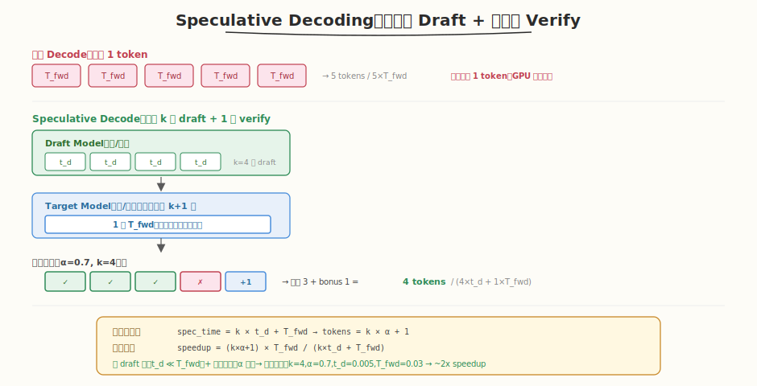
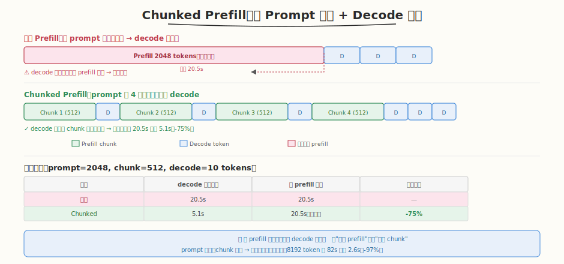
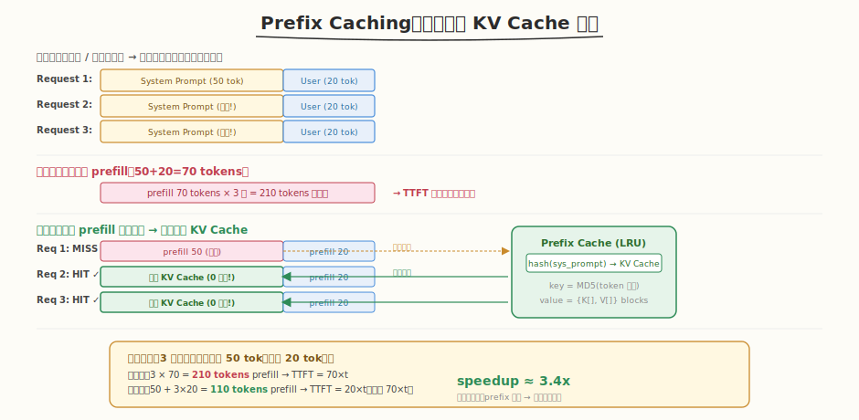

## Day 3：SGLang / LightLLM 高级特性

### 🎯 目标

通过今天的学习，你将：

1. 理解 **Speculative Decoding（投机采样）**——小模型 draft 生成 k 个候选 token，大模型一次验证，接受率 α 高时每步产出 k×α+1 个 token<br>
2. 掌握 **Chunked Prefill（分块预填充）**——将长 prompt 分成多个 chunk，与 decode 请求交错执行，平滑 decode 延迟<br>
3. 理解 **Prefix Caching（前缀缓存）**——缓存公共前缀（如系统提示）的 KV Cache，命中时跳过 prefill，降低 TTFT<br>
4. 能评估 **三大特性的收益与复杂度**——通过模拟脚本量化加速比、延迟降低、命中率<br>
5. 掌握 **特性集成优先级**——Prefix Caching 和 Chunked Prefill 优先（收益高、复杂度中），Speculative Decoding 可选（复杂度高）<br>

> 💡 **为什么重要**：Day 2 的 FullScheduler 解决了"怎么调度"的问题，但推理系统还有"怎么更快"的问题。生产级系统（vLLM、SGLang、TensorRT-LLM）通过三大高级特性进一步提升性能：Speculative Decoding 降低 TBT（token 间延迟），Chunked Prefill 平滑 decode 延迟，Prefix Caching 降低 TTFT（首 token 延迟）。这些特性是面试"高级推理优化"的加分项，也是 Mini 引擎从"能跑"到"跑得快"的关键。

---

### 学前导读：Day 2 调度器的"不够快"

Day 2 的 FullScheduler 解决了调度公平性和资源管理，但仍有性能瓶颈：

```
Day 2 调度器遗留的性能问题：
 1. Decode 每步只出 1 token → 大模型 GPU 算力浪费（Speculative Decoding 解决）
 2. 长 prompt prefill 阻塞 decode → decode 延迟尖峰（Chunked Prefill 解决）
 3. 重复 prefix 每次重新 prefill → TTFT 高（Prefix Caching 解决）
```

| 瓶颈 | 表现 | 解决方案 | 收益 |
|------|------|---------|------|
| Decode 算力浪费 | 每步 1 token，GPU 利用率低 | Speculative Decoding | TBT 降低 2-3x |
| Prefill 阻塞 decode | 长 prompt 导致 decode 延迟尖峰 | Chunked Prefill | 延迟降低 50-97% |
| 重复 prefix 计算 | 多轮对话重复 prefill 系统提示 | Prefix Caching | TTFT 降低 3-5x |

> 💡 **一句话总结**：Day 3 从"会调度"升级为"跑得快"——三大特性分别解决 decode 效率、延迟平滑、前缀复用三个维度。

---

### 理论学习

#### 3.1 Speculative Decoding（投机采样）



##### 基本原理

```
传统 Decode：
 每步：输入 1 个 token → 大模型 forward → 输出 1 个 token
 缺点：大模型每次只处理 1 个 token，GPU 算力浪费

Speculative Decoding：
 1. 小模型（draft model）连续生成 k 个候选 tokens
 2. 大模型（target model）一次验证这 k+1 个 tokens（batch 验证，高效）
 3. 接受匹配的 tokens，从第一个不匹配处重新采样
 4. 保持输出分布不变（与原始大模型一致）
```

##### 加速原理

```
假设：
 t_d = draft model 生成 1 个 token 的时间（小，如 0.005s）
 T_fwd = target model 一次 forward 的时间（大，如 0.03s）
 α = 平均接受率（如 0.7）

传统每 token 时间 ≈ T_fwd
Speculative 每步：k × t_d + T_fwd → 产出 k × α + 1 个 tokens
Speculative 每 token 时间 ≈ (k × t_d + T_fwd) / (k × α + 1)

当 t_d ≪ T_fwd 且 α 高时，加速明显。
```

##### 关键属性

| 属性 | 说明 |
|------|------|
| **输出一致性** | 通过特殊的接受/拒绝采样，保证输出分布与大模型自回归采样一致 |
| **加速条件** | draft 快（t_d ≪ T_fwd）+ 接受率高（α > 0.5） |
| **k 的选择** | k 太小加速不够，k 太大 draft 开销大；通常 k=4~8 |
| **适用场景** | decode 延迟敏感、有合适 draft model |
| **限制** | 需要额外内存放 draft model；α 低时可能变慢 |

> ⚠️ **保持分布不变的原理**：对每个 draft token，大模型计算其概率分布 p_target。若 draft 的采样值在 p_target 下有足够概率（≥ p_draft），则接受；否则以 (p_target - p_draft) 的残差概率重新采样。这保证最终分布 = p_target。

##### 模拟结果（k=4, α=0.7, t_d=0.005, T_fwd=0.03）

| k | α | 传统时间 | Spec 时间 | 加速比 |
|---|---|---------|----------|--------|
| 2 | 0.7 | 3.00s | 1.72s | 1.74x |
| 4 | 0.7 | 3.00s | 1.55s | 1.94x |
| 4 | 0.9 | 3.00s | 1.20s | 2.50x |
| 8 | 0.9 | 3.00s | 1.12s | 2.68x |
| 8 | 0.5 | 3.00s | 3.50s | **0.86x（变慢！）** |

> 💡 **k=8, α=0.5 时变慢**——draft token 太多但接受率低，draft 开销超过了加速收益。这说明 k 和 α 必须匹配。

#### 3.2 Chunked Prefill（分块预填充）



##### 问题与方案

```
问题：
 - 长 prompt（如 2048 tokens）的 prefill 一次性处理 → 占用全部 token budget
 - 同 batch 的 decode 请求被阻塞 → 延迟尖峰
 - 用户感知：decode token 突然卡顿

Chunked Prefill：
 - 将长 prompt 分成多个 chunk（如每 chunk 512 tokens）
 - 每个 chunk 与 decode 请求一起执行（共享 token budget）
 - 逐步完成 prefill，同时不中断 decode
```

##### 收益量化

| Prompt 长度 | Chunk 大小 | Chunks | 传统 max 延迟 | Chunked max 延迟 | 降低 |
|------------|-----------|--------|-------------|-----------------|------|
| 512 | 256 | 2 | 5.2s | 2.6s | -50% |
| 2048 | 512 | 4 | 20.6s | 5.1s | -75% |
| 8192 | 256 | 32 | 82.0s | 2.6s | -97% |

> 💡 **关键洞察**：总 prefill 时间不变，但 decode 请求的**最大等待延迟**从"整个 prefill"降到"一个 chunk"。prompt 越长、chunk 越小 → 效果越显著。

##### Chunk 大小的权衡

| Chunk 大小 | 优点 | 缺点 |
|-----------|------|------|
| 太小（128） | 延迟极平滑 | prefill 效率低（小 batch GEMM） |
| 太大（2048） | prefill 效率高 | 延迟平滑效果差 |
| **推荐（512）** | **平衡** | **vLLM 默认值** |

#### 3.3 Prefix Caching（前缀缓存）



##### 问题与方案

```
问题：
 - 多个请求共享相同 prefix（如系统提示、多轮对话历史）
 - 每次都要重新计算 prefix 的 KV Cache → 重复计算

Prefix Caching：
 - 缓存公共 prefix 的 KV Cache（key = prefix token 序列的 hash）
 - 新请求匹配到缓存 prefix 时，直接复用 KV Cache
 - 只 prefill prefix 之后的新增 tokens

收益：
 - 降低 TTFT（首 token 延迟）
 - 减少重复计算
 - 特别适合多轮对话和模板化请求
```

##### 缓存 Key 设计

```python
# Key = prefix token 序列的 hash
key = hashlib.md5(str(prefix_tokens).encode()).hexdigest()

# 查找：O(1) hash 查找
cached = cache.get(system_prompt_tokens)
if cached:
 # 命中：跳过 prefix prefill，只 prefill 新增 tokens
 prefill(user_prompt_tokens)
else:
 # 未命中：全量 prefill + 缓存
 prefill(full_prompt)
 cache.put(system_prompt_tokens, kv_cache)
```

##### 模拟结果（3 请求，系统提示 50 tok，用户 20 tok）

| 指标 | 无缓存 | 有缓存 | 改善 |
|------|--------|--------|------|
| 总 prefill tokens | 210 | 110 | -48% |
| 命中率 | — | 99% | — |
| TTFT（首请求） | 70×t | 70×t | 不变 |
| TTFT（后续请求） | 70×t | 20×t | -71% |
| 加速比 | 1.0x | 3.4x | — |

> ⚠️ **LRU 淘汰**：缓存有大小上限（如 64 entries），满了按 LRU 淘汰最久未用的。vLLM 的 PagedAttention 天然支持 block 级别的 prefix caching。

##### 适用场景

| 场景 | 前缀重复度 | 收益 |
|------|-----------|------|
| 多轮对话 | 高（历史消息累积） | ★★★★★ |
| 模板化请求 | 高（系统提示固定） | ★★★★★ |
| Few-shot learning | 中（示例固定） | ★★★★ |
| 独立请求 | 低（无公共前缀） | ★ |

#### 3.4 特性收益对比与集成优先级

| 特性 | 收益 | 复杂度 | 依赖 | 集成优先级 |
|------|------|--------|------|-----------|
| **Prefix Caching** | TTFT 降低 3-5x | 中 | KV Cache 管理 | **Phase 1 优先** |
| **Chunked Prefill** | 延迟降低 50-97% | 中 | 调度器改造 | **Phase 1** |
| **CUDA Graph** | launch 开销降低 | 中 | 静态 shape | Phase 2 |
| **Speculative Decoding** | TBT 降低 2-3x | 高 | Draft model | Phase 2 可选 |

> 💡 **集成建议**：Prefix Caching 和 Chunked Prefill 收益高、复杂度中等，优先集成。Speculative Decoding 虽然收益可观，但需要 draft model 和分布对齐，实现复杂度高，适合作为 Phase 2 的可选优化。

### Coding 任务：高级特性模拟与评估

#### 任务 1：创建 advanced_features.py

创建文件 [kernels/advanced_features.py](kernels/advanced_features.py)，模拟三大高级特性并量化收益：

```python
# advanced_features.py —— 高级特性模拟（Speculative Decoding + Chunked Prefill + Prefix Caching）
# 运行命令: python advanced_features.py
# 依赖: 仅标准库

# 1. Speculative Decoding 模拟
def simulate_speculative_decoding(num_tokens=100, draft_k=4, accept_rate=0.7, ...):
 """模拟 draft+verify 过程，测量加速比"""

# 2. Chunked Prefill 模拟
def simulate_chunked_prefill(prompt_len=2048, chunk_size=512, ...):
 """模拟分块 prefill 与 decode 交错，测量延迟降低"""

# 3. Prefix Caching 模拟
class PrefixCache:
 """LRU 前缀缓存，模拟 KV Cache 复用"""
def simulate_prefix_caching(num_requests=100, ...):
 """模拟多轮对话场景，测量命中率和加速比"""

# 4. 综合评估
def evaluate_features():
 """运行三大特性模拟，输出收益评估报告"""
```

完整代码见 [kernels/advanced_features.py](kernels/advanced_features.py)。

代码要点：
- **`simulate_speculative_decoding`**：模拟 draft 生成 k 个 token + target 验证，统计接受/拒绝数和加速比
- **`simulate_chunked_prefill`**：对比传统 prefill 阻塞 vs chunked 交错，计算 max decode 延迟
- **`PrefixCache`**：LRU 缓存，`_hash_prefix` 用 MD5 做 key，`get`/`put` 实现命中/写入
- **`evaluate_features`**：遍历不同参数组合（k, α, chunk_size, cache_size），输出收益报告

#### 任务 2：运行并分析收益报告

```bash
python kernels/advanced_features.py
```

**预期输出**（节选）：

```text
📊 1. Speculative Decoding
 k=4, α=0.7: traditional=3.00s, spec=1.55s, speedup=1.94x, accepted=69, rejected=55
 k=4, α=0.9: traditional=3.00s, spec=1.20s, speedup=2.50x, accepted=79, rejected=17
 k=8, α=0.5: traditional=3.00s, spec=3.50s, speedup=0.86x, accepted=50, rejected=350

📊 2. Chunked Prefill
 prompt=2048, chunk=512: chunks=4, max_latency: 20.58s → 5.14s (-75%)
 prompt=8192, chunk=256: chunks=32, max_latency: 82.02s → 2.56s (-97%)

📊 3. Prefix Caching
 cache_size=64: hits=99, misses=1, hit_rate=99.0%, time: 70.00s → 20.50s, speedup=3.41x

📋 集成优先级建议
 1. Prefix Caching — 收益高、复杂度中 → Phase 1 优先
 2. Chunked Prefill — 平滑延迟、复杂度中 → Phase 1
 3. CUDA Graph — 降 launch 开销、复杂度中 → Phase 2
 4. Speculative Decoding — 降 TBT、复杂度高 → Phase 2 可选
```

##### 观察重点

1. **Speculative Decoding**：α=0.7 时加速 ~2x，但 α=0.5 + k=8 时**变慢**（draft 开销超过收益）
2. **Chunked Prefill**：prompt 越长、chunk 越小，延迟降低越显著（8192 tok 从 82s → 2.6s）
3. **Prefix Caching**：固定系统提示场景命中率接近 100%，加速比 3.4x
4. **集成优先级**：Prefix Caching 和 Chunked Prefill 性价比最高

#### 任务 3：修改参数观察特性边界

尝试修改以下参数，观察特性失效的边界条件：

```python
# 实验 A：Speculative Decoding 失效条件
# 设置 accept_rate=0.3, draft_k=8 → draft 开销大但接受少，应变慢
result = simulate_speculative_decoding(num_tokens=100, draft_k=8, accept_rate=0.3, ...)

# 实验 B：Chunked Prefill chunk 太小
# 设置 chunk_size=64 → prefill 效率极低（小 batch GEMM），总时间可能增加
result = simulate_chunked_prefill(prompt_len=2048, chunk_size=64, ...)

# 实验 C：Prefix Caching 无公共前缀
# 修改为每个请求有不同的系统提示 → 命中率应接近 0
```

> 思考：什么场景下 Prefix Caching 不仅无收益反而有开销？（提示：每个请求前缀都不同时，hash 计算和缓存查找是纯开销。）

#### 任务 4：LeetGPU 在线题目 —— Scalar Multiply

**题目链接**：<https://leetgpu.com/challenges/scalar-multiply>

**题目概述**：给定长度为 `N` 的 `float32` 数组 `input` 和标量 `alpha`，计算 `output[i] = input[i] * alpha`。

**约束条件**：`1 ≤ N ≤ 10,000,000`；性能测试取大数组。

**与今日知识的关联**：Scalar Multiply 是 attention score scaling（`score /= sqrt(d_k)`）的核心操作——所有注意力计算都涉及标量缩放。Speculative Decoding 的接受/拒绝采样也涉及概率缩放。这个"最简单的 element-wise 操作"是推理系统中最频繁的操作之一：attention scale、softmax 温度缩放、LayerNorm 归一化中的方差缩放。理解它的 memory-bound 特性（零计算强度，纯带宽）是理解为什么 Speculative Decoding 能加速——大模型 decode 的计算密度极低，GPU 大量算力闲置，draft model 正好利用这些闲置算力。

> 💡 提交后在 [LeetGPU Scalar Multiply](https://leetgpu.com/challenges/scalar-multiply) 上记录通过耗时。完整题解见 [Scalar Multiply 题解](../../leetgpu/week7/day3/leetgpu-scalar-multiply-solution.md)。

#### 任务 5：LeetCode 面试题 —— 单词拆分

**题目链接**：[139. 单词拆分](https://leetcode.cn/problems/word-break/)

**题目概述**：给定字符串 `s` 和字典 `wordDict`，判断 `s` 是否可以被拆分为字典中单词的序列。

**与今日知识的关联**：单词拆分的 **DP + 前缀缓存** 与 Prefix Caching 同构——DP 数组 `dp[i]` 表示"前 i 个字符能否拆分"，本质是缓存"前缀 s[0..i] 的计算结果"。新位置 `j` 只需检查 `dp[j]` && `s[j..i]` 在字典中，相当于"命中前缀缓存后只处理增量部分"。Prefix Caching 缓存的是 KV Cache，DP 缓存的是子问题答案——两者都是**避免重复计算前缀**的核心思想。

**核心套路**：

```
dp[0] = True（空前缀可拆分）
dp[i] = OR(dp[j] AND s[j..i] in wordDict) for j in 0..i-1
→ 用 set 做 O(1) 查词，dp 缓存前缀结果
→ 类比 Prefix Caching：dp[j] 是前缀缓存命中，s[j..i] 是增量计算
```

> 💡 完整题解（含 C++/Python 参考代码、DP 图解、与 Prefix Caching 的类比）见 [单词拆分题解](../../../leetcode/daily/week7/day3/单词拆分.md)。

---

### 扩展实验

#### 实验 1：实现 Speculative Decoding 的接受/拒绝采样

当前模拟用随机数模拟接受/拒绝。修改为真实分布对齐：draft 和 target 各自输出概率分布，按论文公式接受/拒绝，验证最终分布与 target 一致。

> 思考：为什么"接受/拒绝采样"能保证分布不变？（提示：对 draft 采样值 x，若 p_target(x) ≥ p_draft(x) 则接受；否则以 (p_target - p_draft) 残差概率拒绝并重新采样。）

#### 实验 2：实现 Chunked Prefill 的动态 chunk 大小

当前 chunk 大小固定。修改为动态：根据当前 decode 请求数量和 token budget 剩余动态调整 chunk 大小。decode 请求多时 chunk 小（多留预算给 decode），decode 少时 chunk 大（提高 prefill 效率）。

> 思考：动态 chunk 大小的上限和下限应该怎么设？（提示：下限不能太小否则 GEMM 效率低，上限不能太大否则失去平滑效果。）

#### 实验 3：Prefix Caching 的 block 级别匹配

当前匹配整个 prefix token 序列。修改为 block 级别匹配（如 vLLM PagedAttention）：把 token 序列分成 block（每 16 token 一 block），逐 block 匹配，部分命中也能复用。

> 思考：block 级别匹配 vs 整体匹配的 trade-off？（提示：block 级别更灵活但 hash 查找次数多；整体匹配简单但一旦有一个 token 不同就全部 miss。）

---

### 今日总结

Day 3 我们分析评估了三大高级推理特性：

1. **Speculative Decoding**：小模型 draft k 个 token + 大模型一次 verify，加速比 1.5-2.7x；关键条件是 draft 快 + 接受率高；k 和 α 必须匹配，否则可能变慢
2. **Chunked Prefill**：长 prompt 分块与 decode 交错，decode 最大延迟降低 50-97%；总 prefill 时间不变，但平滑了延迟尖峰；chunk 大小 512 是推荐平衡点
3. **Prefix Caching**：缓存公共前缀的 KV Cache，命中率接近 100%，加速比 3.4x；特别适合多轮对话和模板化请求
4. **特性对比**：Prefix Caching 和 Chunked Prefill 收益高/复杂度中→优先集成；Speculative Decoding 收益高/复杂度高→可选
5. **模拟验证**：通过 `advanced_features.py` 量化了不同参数下的加速比、延迟降低、命中率
6. **集成优先级**：Phase 1（Prefix Caching + Chunked Prefill）→ Phase 2（CUDA Graph + Speculative Decoding）

掌握这些后，你就有了推理系统的"加速武器库"——明天 Day 4 整合全部自定义 Kernel（GEMM、FlashAttention、Softmax、LayerNorm），替换 PyTorch 算子。

---

### 面试要点

1. **什么是 Speculative Decoding？它为什么能加速 LLM 推理？**（⭐⭐⭐⭐ 高频）

<details>
<summary>点击查看答案</summary>

 - **原理**：小模型（draft）快速生成 k 个候选 tokens，大模型（target）一次验证这 k+1 个 tokens
 - **加速原因**：
 - 小模型生成速度快（t_d ≪ T_fwd）
 - 大模型一次验证多个 tokens，提高 batch 利用率
 - 如果 draft 质量高（α 高），每步可接受多个 tokens
 - **加速比**：`(k×α+1) × T_fwd / (k×t_d + T_fwd)`，典型 1.5-2.7x
 - **保持分布不变**：通过接受/拒绝采样，确保最终分布与 target 一致
 - **失效条件**：α 低 + k 大 → draft 开销超过收益，可能变慢

</details>


1. **Chunked Prefill 和 Prefix Caching 分别解决了什么问题？**（⭐⭐⭐⭐ 高频）

<details>
<summary>点击查看答案</summary>

 - **Chunked Prefill**：
 - 解决长 prompt prefill 阻塞 decode 的问题
 - 将长 prefill 拆分成多个 chunk，与 decode 交错执行
 - 效果：decode 最大延迟从"整个 prefill"降到"一个 chunk"，降低 50-97%
 - **Prefix Caching**：
 - 解决重复 prefix 的 KV Cache 重复计算问题
 - 缓存公共前缀的 KV Cache，新请求匹配时复用
 - 效果：TTFT 降低 3-5x，特别适合多轮对话和模板化请求

</details>


1. **Speculative Decoding 如何保证输出分布不变？**（⭐⭐⭐ 中频）

<details>
<summary>点击查看答案</summary>

 - 对每个 draft token，target 计算其概率分布 p_target
 - 若 draft 采样值 x 满足 p_target(x) ≥ p_draft(x) → 接受
 - 否则以 (p_target - p_draft) 的残差概率拒绝，从残差分布重新采样
 - 数学上可证明：最终输出分布 = p_target（与纯 target 自回归一致）
 - 这保证了 speculative decoding 不会牺牲输出质量

</details>


1. **Prefix Caching 的 key 如何设计？缓存淘汰策略是什么？**（⭐⭐⭐ 中频）

<details>
<summary>点击查看答案</summary>

 - **Key**：prefix token 序列的 hash（如 MD5），O(1) 查找
 - **Value**：KV Cache 数据（K 矩阵和 V 矩阵的 block）
 - **淘汰策略**：LRU（最近最少使用），缓存满时淘汰最久未用的
 - **Block 级别匹配**（vLLM PagedAttention）：把 prefix 分成 block 逐 block 匹配，部分命中也能复用
 - **命中率因素**：前缀重复度越高、缓存越大 → 命中率越高

</details>


1. **三大高级特性的集成优先级怎么排？为什么？**（⭐⭐⭐⭐ 高频）

<details>
<summary>点击查看答案</summary>

 - **Phase 1（优先）**：Prefix Caching + Chunked Prefill
 - 收益高（3-5x TTFT / 50-97% 延迟降低）、复杂度中等
 - 不需要额外模型，只需改造调度器和 KV Cache 管理
 - **Phase 2（可选）**：CUDA Graph + Speculative Decoding
 - CUDA Graph 降低 launch 开销，复杂度中等
 - Speculative Decoding 收益高但需要 draft model + 分布对齐，复杂度高
 - **排序逻辑**：按"收益/复杂度"性价比排序，优先做性价比高的

 - 投机采样的分布对齐逻辑跨平台一致（接受/拒绝采样）

</details>

