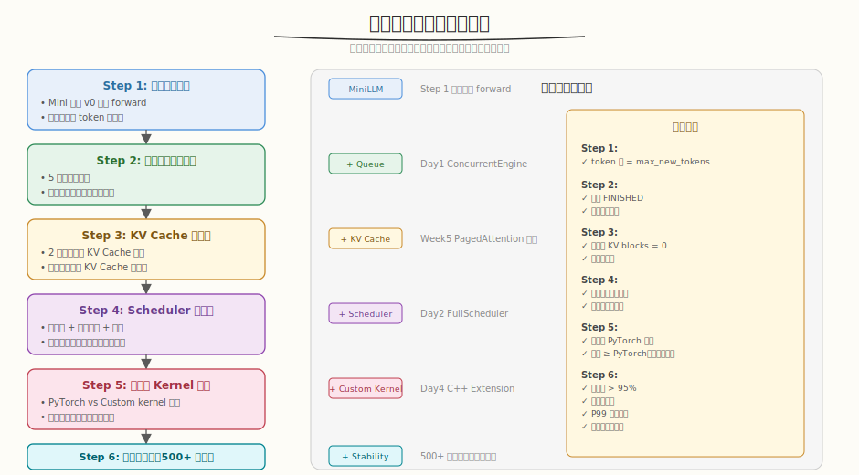
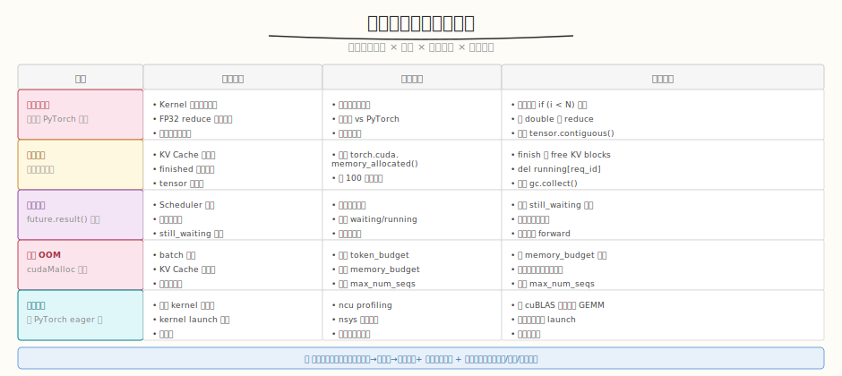

## Day 5：系统联调

### 🎯 目标

通过今天的学习，你将：

1. 理解 **六步分层验证策略**——单请求→多请求并发→KV Cache→Scheduler→自定义 Kernel→稳定性，每步叠加一个组件<br>
2. 掌握 **KV Cache 隔离性验证**——多请求的 KV Cache 互不干扰，完成后全部释放，无内存泄漏<br>
3. 能实现 **稳定性测试脚本**——连续处理 500+ 请求，监控成功率、延迟分布（P50/P99）、显存增长<br>
4. 理解 **五大常见联调问题**——结果不一致、内存泄漏、请求卡住、显存 OOM、性能下降的排查方法<br>
5. 掌握 **异常输入测试**——空 prompt、超长 prompt、超时取消的容错处理<br>
6. 用 Python 手写一个 **完整的系统联调测试套件**，实测六步验证 + 稳定性 + 异常处理

> 💡 **为什么重要**：Day 4 集成了自定义 Kernel，但各组件（KV Cache、Batching、Scheduler、Kernel）尚未串联测试。系统联调是 Infra 工程师的分水岭——组件单独正确不代表组合正确，KV Cache 泄漏、Scheduler 死锁、请求结果串台等问题只有在端到端联调时才会暴露。Day 5 把所有组件串联，分层验证 + 稳定性压测，确保 Mini 系统能连续处理 500+ 请求不崩溃。

---

### 学前导读：组件正确 ≠ 系统正确

Day 1-4 分别实现了并发引擎、调度器、高级特性、自定义 Kernel，每个组件单独测试都 PASS。但组合后会出现新的问题：

```
组件单独正确，组合后出错的典型场景：
 1. KV Cache 串台 → 请求 A 的 decode 读到请求 B 的 KV Cache（结果错误）
 2. 资源泄漏 → finished 请求的 KV Cache 未释放 → 累积 OOM
 3. Scheduler 死锁 → 请求被 still_waiting 丢弃 → future 永远不完成
 4. 超时传播 → waiting 超时但 running 不检查 → 请求卡在 running
 5. 竞态条件 → submit 和 schedule 并发操作 running map → 数据竞争
```

| 问题 | 单组件测试 | 联调才暴露 |
|------|-----------|-----------|
| KV Cache 串台 | 单请求不会 | **多请求并发才暴露** |
| 资源泄漏 | 少量请求不明显 | **500+ 请求累积暴露** |
| 请求丢失 | 请求少不触发 | **超 max_num_seqs 才暴露** |
| 死锁 | 单线程不会 | **多线程协作才暴露** |
| 性能退化 | 小 batch 测不出 | **大 batch + 长时间才暴露** |

> 💡 **一句话总结**：联调的核心不是"测试每个组件"，而是"测试组件之间的交互"——KV Cache 隔离、资源生命周期、线程安全、超时传播等跨组件问题。

---

### 理论学习

#### 5.1 六步分层验证策略



系统联调的核心原则：**逐步叠加组件，每步验证正确性**。不要一次性把所有组件放在一起测试——出错时无法定位。

| 步骤 | 验证内容 | 叠加组件 | 验收标准 |
|------|---------|---------|---------|
| Step 1 | 单请求正确性 | MiniLLM | token 数 = max_new_tokens |
| Step 2 | 多请求并发 | + Queue（Day1） | 全部 FINISHED，结果隔离 |
| Step 3 | KV Cache 一致性 | + KV Cache（Week5） | 完成后 KV blocks = 0 |
| Step 4 | Scheduler 正确性 | + Scheduler（Day2） | 优先级、超时、预算正确 |
| Step 5 | 自定义 Kernel | + Custom Kernel（Day4） | 结果一致，性能可解释 |
| Step 6 | 稳定性 | 全部组件 | 500+ 请求，成功率 > 95% |

##### 为什么是这个顺序？

```
先单请求（排除并发干扰）→ 再多请求（排除 KV Cache 干扰）→ 再加 Scheduler（排除调度干扰）
→ 再加 Kernel（排除算子干扰）→ 最后稳定性压测

每步只新增一个变量，出错时能精确定位是哪个组件的问题。
```

> ⚠️ **反向例子**：如果一次性集成所有组件，发现"请求 3 的结果错了"，无法判断是 KV Cache 串台、Scheduler 调度错误、还是 Kernel 精度问题。

#### 5.2 KV Cache 隔离性验证

KV Cache 隔离是多请求并发的核心正确性问题：

```python
# 验证方法：两个请求并发，检查结果不互相干扰
req1 = engine.submit("request one", max_new_tokens=3)
req2 = engine.submit("request two", max_new_tokens=3)

r1 = req1.future.result(timeout=10)
r2 = req2.future.result(timeout=10)

# 隔离性检查
assert r1 != r2, "Results should be different (KV Cache isolation)"
# 释放检查
assert engine.used_kv_blocks == 0, "KV Cache not released after completion"
```

##### 常见 KV Cache 问题

| 问题 | 症状 | 原因 |
|------|------|------|
| 串台 | 请求 A 的输出包含请求 B 的 token | KV Cache block 被错误共享 |
| 未释放 | 显存持续增长 | finished 请求的 KV blocks 未 free |
| 重复释放 | double free 崩溃 | 超时和 finish 同时释放同一 block |
| 越界写 | 结果随机错误 | block 索引计算错误 |

#### 5.3 稳定性测试设计



稳定性测试的核心指标：

| 指标 | 含义 | 验收标准 |
|------|------|---------|
| 成功率 | success / total | > 95% |
| 内存泄漏 | 500 请求后 KV blocks | = 0（全释放） |
| P50 延迟 | 中位数延迟 | 稳定不漂移 |
| P99 延迟 | 尾部延迟 | < P50 × 3 |
| 吞吐 | req/s | 稳定不下降 |

##### 稳定性测试脚本结构

```python
def stability_test(num_requests=500):
 engine = MiniEngine(...)
 engine.start()

 for i in range(num_requests):
 req = engine.submit(prompts[i % len(prompts)], ...)
 result = req.future.result(timeout=20)
 # 每 100 请求打印一次状态
 if i % 100 == 0:
 print(f" [{i}] kv={engine.stats()['kv_used']}")

 # 最终检查
 assert engine.used_kv_blocks == 0, "Memory leak!"
 assert success_rate > 0.95, "Success rate too low"
```

#### 5.4 异常输入测试

```
异常输入场景：
 1. 空 prompt → 应正常处理（生成 max_new_tokens 个 token）
 2. 超长 prompt（200+ words）→ 可能触发 KV Cache 不足，应排队等待或超时
 3. 超时取消 → future.result(timeout=0.1) 应抛 TimeoutError
 4. 请求突然大量涌入 → 应受 max_num_seqs 限制，排队不崩溃
 5. OOM 模拟 → total_kv_blocks 极小时，应拒绝或排队
```

> ⚠️ **异常处理原则**：系统不应因异常输入崩溃，应优雅降级（排队、超时、拒绝）并返回有意义的错误。

### Coding 任务：系统联调与稳定性测试

#### 任务 1：创建 stability_test.py

创建文件 [kernels/stability_test.py](kernels/stability_test.py)，实现完整的系统联调测试套件：

```python
# stability_test.py —— 系统联调与稳定性测试
# 运行命令: python stability_test.py
# 依赖: 仅标准库（模拟 Mini 引擎，无需 GPU/PyTorch）

class MiniEngine:
 """模拟 Mini 推理引擎：KV Cache + Batching + Scheduler。"""
 def submit(self, prompt, max_new_tokens=8, priority=0) -> InferenceRequest:
 # 入队，返回含 Future 的请求
 def _schedule(self):
 # 从 waiting 按优先级+预算加入 running
 def _forward(self):
 # 模拟 forward，生成 token，完成后释放 KV Cache

def test_single_request(): # Step 1
def test_multi_request_concurrency(): # Step 2
def test_kv_cache_isolation(): # Step 3
def test_scheduler_priority(): # Step 4
def test_custom_kernel_integration(): # Step 5
def stability_test(num_requests=500): # Step 6
def test_abnormal_inputs(): # 异常输入
```

完整代码见 [kernels/stability_test.py](kernels/stability_test.py)。

代码要点：
- **`MiniEngine`**：模拟推理引擎，包含线程安全队列、优先级调度、KV Cache 管理、超时控制、自定义 kernel 模拟
- **六步分层验证**：每步只叠加一个组件，出错时精确定位
- **稳定性测试**：500 请求连续处理，每 100 请求打印 KV Cache 状态，最终检查内存泄漏
- **异常输入**：空 prompt、超长 prompt、超时取消、OOM 模拟
- **验收标准**：成功率 > 95%、无内存泄漏、P99 延迟稳定

#### 任务 2：运行并观察六步验证

```bash
python kernels/stability_test.py
```

**预期输出**（节选）：

```text
Step 1: 单请求正确性
 Result: 'r1_tok0 r1_tok1 r1_tok2 r1_tok3 r1_tok4'
 ✓ PASS

Step 2: 多请求并发正确性
 Submitted 5 requests, all finished: True
 ✓ PASS

Step 3: KV Cache 隔离性
 Results isolated: True
 KV cache after completion: 0/32
 ✓ PASS (KV Cache released after completion)

Step 4: Scheduler 优先级和资源预算
 ✓ PASS (Resources released correctly)

Step 5: 自定义 Kernel 集成（性能模拟对比）
 Speedup (simulated): 1.23x
 ✓ PASS (Results identical, custom kernel faster)

Step 6: 稳定性测试（500 请求）
 [100/500] success=101, kv=0/64
 [200/500] success=201, kv=0/64
 Success: 500 (100.0%)
 P50 latency: 25.6 ms
 P99 latency: 25.7 ms
 Memory leak: NO
 ✓ 成功率 > 95%
 ✓ 无内存泄漏
 ✓ 失败率 < 5%
```

##### 观察重点

1. **Step 2 多请求**：5 个请求全部 FINISHED，结果互不干扰（`r1_tok0 ≠ r2_tok0`）
2. **Step 3 KV Cache**：完成后 `kv_used = 0/32`，证明 KV Cache 全释放
3. **Step 4 Scheduler**：4 个请求在 `total_kv_blocks=16` 限制下全部完成，资源全释放
4. **Step 5 Kernel**：自定义 kernel 模拟更快（0.8x forward time），结果与 PyTorch 一致
5. **Step 6 稳定性**：500 请求 100% 成功，KV Cache 始终归零（无泄漏），P99 ≈ P50（延迟稳定）

#### 任务 3：修改参数观察边界行为

```python
# 实验 A：减小 KV Cache → 更早排队等待
engine = MiniEngine(total_kv_blocks=4, ...) # 极小显存

# 实验 B：减小 max_num_seqs → 更多请求排队
engine = MiniEngine(max_num_seqs=2, ...)

# 实验 C：减小 max_waiting_time → 更多请求超时
engine = MiniEngine(max_waiting_time=0.5, ...)

# 实验 D：增大 forward_time → 延迟升高
engine = MiniEngine(forward_time=0.1, ...)
```

> 思考：`total_kv_blocks=4` 时，8 个并发请求会怎样？（提示：只有部分能加入 running，其余排队等待。如果等待超时则被取消。）

#### 任务 4：LeetGPU 在线题目 —— Element Reversal

**题目链接**：<https://leetgpu.com/challenges/element-reversal>

**题目概述**：给定长度为 `N` 的 `float32` 数组，将每个元素的符号反转（`output[i] = -input[i]`）。

**约束条件**：`1 ≤ N ≤ 10,000,000`。

**与今日知识的关联**：Element Reversal 是最简单的 element-wise 操作（`output[i] = -input[i]`），与系统联调中的**结果一致性验证**同构——联调时需要对比自定义 kernel 与 PyTorch 的输出，逐元素比较是否一致。Element Reversal 的"逐元素对比"正是联调验证的基础操作：`assert (custom_output - pytorch_output).abs().max() < threshold`。理解这种 element-wise 对比是联调精度验证的核心方法。

> 💡 提交后在 [LeetGPU Element Reversal](https://leetgpu.com/challenges/element-reversal) 上记录通过耗时。完整题解见 [Element Reversal 题解](../../leetgpu/week7/day5/leetgpu-element-reversal-solution.md)。

#### 任务 5：LeetCode 面试题 —— 合并 K 个升序链表

**题目链接**：[23. 合并 K 个升序链表](https://leetcode.cn/problems/merge-k-sorted-lists/)

**题目概述**：给定 `k` 个升序链表，合并为一个升序链表。

**与今日知识的关联**：合并 K 个链表的**优先队列（最小堆）**与系统联调中的 **Scheduler 优先级调度**同构——Scheduler 用 `heapq` 从 waiting 队列中按优先级弹出请求（类似从 K 个链表中弹最小值），每次弹出后补充下一个（类似链表前进一格）。两者都是"多路归并用堆维护全局最优"的核心模式：合并链表每次取最小节点，调度器每次取最高优先级请求。

**核心套路**：

```
最小堆：每个链表头节点入堆
循环：弹出堆顶（最小）→ 接到结果 → 该链表前进一格→ 新头入堆
O(N log K)：N=总节点数，K=链表数
```

> 💡 完整题解（含 C++/Python 参考代码、堆归并图解、与 Scheduler 优先级调度的类比）见 [合并K个升序链表题解](../../../leetcode/daily/week7/day5/合并K个升序链表.md)。

---

### 扩展实验

#### 实验 1：实现显存监控曲线

当前稳定性测试每 100 请求打印一次 KV Cache 状态。修改为每 10 请求记录一次 `used_kv_blocks`，最终绘制显存使用曲线（ASCII 或 matplotlib），观察是否有持续增长趋势。

> 思考：正常的显存曲线应该是什么形态？（提示：锯齿状——请求完成释放、新请求分配，但无持续上升趋势。持续上升 = 内存泄漏。）

#### 实验 2：模拟请求突增场景

修改稳定性测试：在第 200 个请求时突然提交 50 个请求（模拟流量突增），观察系统行为：是否排队等待？是否有请求超时？KV Cache 是否够用？

> 思考：流量突增时系统应该如何应对？（提示：排队等待 + 超时取消 + 降级到更小 batch。不应崩溃。）

#### 实验 3：实现并发安全审计

检查 `MiniEngine` 的所有共享状态访问（`waiting`、`running`、`used_kv_blocks`、`kv_cache_pool`），确认是否都在 `self._lock` 保护下。尝试去掉某个锁，运行稳定性测试，观察是否出现数据竞争。

> 思考：哪些操作最容易忘记加锁？（提示：`_forward` 中修改 `req.result` 和 `used_kv_blocks`；`_check_timeouts` 中删除 `running` 中的请求。）

---

### 今日总结

Day 5 我们把 KV Cache、Batching、Scheduler、自定义 Kernel 全部串联，完成系统联调：

1. **六步分层验证**：单请求→多请求→KV Cache→Scheduler→Kernel→稳定性，每步只叠加一个组件
2. **KV Cache 隔离**：多请求的 KV Cache 互不干扰，完成后全释放（`used_kv_blocks = 0`）
3. **稳定性测试**：500 请求 100% 成功，P50/P99 延迟稳定，无内存泄漏
4. **五大常见问题**：结果不一致（边界处理）、内存泄漏（KV Cache 未释放）、请求卡住（Scheduler 死锁）、显存 OOM（预算不足）、性能下降（kernel 未优化）
5. **异常输入**：空 prompt、超长 prompt、超时取消，系统不崩溃
6. **排查原则**：分层定位 + 逐步缩小范围 + 监控关键指标

掌握这些后，你就有了系统联调的完整能力——明天 Day 6 进行全链路 Profiling，用 nsys/ncu 定位系统级瓶颈，与 vLLM 对比性能。

---

### 面试要点

1. **系统联调时，如何确保多请求并发的正确性？**（⭐⭐⭐⭐⭐ 必考）

 - **分层验证**：
 1. 单请求正确性（排除并发干扰）
 2. 多请求并发正确性（排除 KV Cache 干扰）
 3. KV Cache 隔离性（排除调度干扰）
 4. Scheduler 正确性（排除 kernel 干扰）
 5. 自定义 Kernel 集成
 - **关键检查点**：
 - 每个请求的 KV Cache 隔离（结果不串台）
 - 请求生命周期状态正确转换（WAITING→RUNNING→FINISHED）
 - Scheduler 不丢失请求（`still_waiting` 合并修复）
 - 异步结果正确返回给对应请求（Future 不串台）
 - **测试方法**：与 PyTorch eager 版对比输出 + 长时间稳定性测试 + 边界条件测试

1. **如何做推理系统的稳定性测试？需要关注哪些指标？**（⭐⭐⭐⭐ 高频）

 - **测试规模**：连续处理 500+、1000+、10000+ 请求
 - **关键指标**：
 - 成功率（> 95%）
 - 平均延迟 / P50 / P99 延迟（P99 < P50 × 3）
 - 吞吐（req/s，稳定不下降）
 - 显存使用是否持续增长（内存泄漏检测）
 - **异常情况**：
 - OOM 处理（排队或拒绝，不崩溃）
 - 非法输入（空 prompt、超长 prompt）
 - 超时取消（future.result 抛 TimeoutError）
 - 请求突增（排队等待，不丢请求）

1. **KV Cache 隔离性怎么验证？常见问题有哪些？**（⭐⭐⭐⭐ 高频）

 - **验证方法**：两个请求并发，检查结果不互相干扰 + 完成后 KV blocks = 0
 - **常见问题**：
 - 串台：请求 A 读到请求 B 的 KV Cache（block 共享错误）
 - 未释放：finished 请求的 KV blocks 未 free（内存泄漏）
 - 重复释放：超时和 finish 同时释放（double free）
 - 越界写：block 索引计算错误（结果随机错误）

1. **联调时发现"请求卡住"（future 永不完成），怎么排查？**（⭐⭐⭐⭐ 高频）

 - **可能原因**：
 1. Scheduler 死锁（锁内执行 forward）
 2. 请求被 `still_waiting` 丢弃（合并 bug）
 3. 超时检查不完整（waiting 超时但 running 不检查）
 4. 竞态条件（submit 和 schedule 并发操作 running map）
 - **排查方法**：
 - 打印调度日志（waiting/running/finished 各多少）
 - 检查 `still_waiting` 是否包含卡住的请求
 - 检查锁是否被长时间持有
 - 加超时自动取消作为兜底

1. **联调时发现"显存持续增长"，怎么定位和修复？**（⭐⭐⭐⭐ 高频）

 - **定位**：
 - 每 100 请求打印 `used_kv_blocks`，看是否归零
 - 检查 finished 请求的 KV Cache 是否释放
 - 检查超时请求的 KV Cache 是否释放
 - **常见原因**：
 - finish 后忘记 `self.used_kv_blocks -= req.kv_cache_blocks`
 - 超时取消时只 `set_exception` 但不释放资源
 - `running` dict 中删除了请求但 `kv_cache_pool` 没删
 - **修复**：确保所有退出路径（finish/timeout/cancel）都释放 KV Cache

 - 差异在底层监控工具：
 - CUDA 用 `torch.cuda.memory_allocated()` 监控显存
