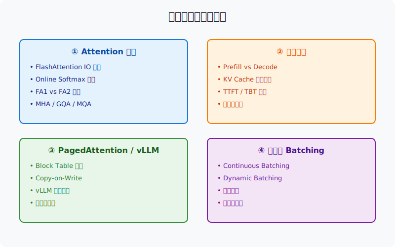
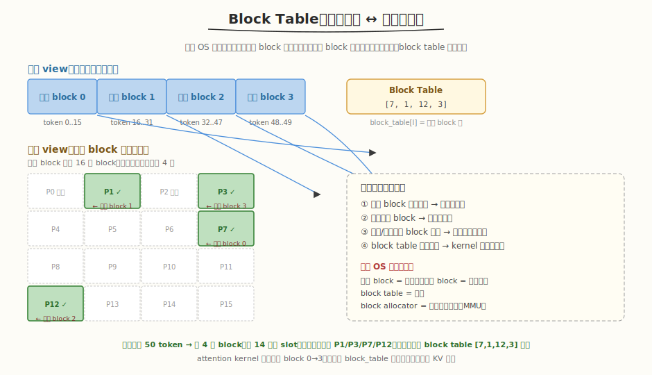
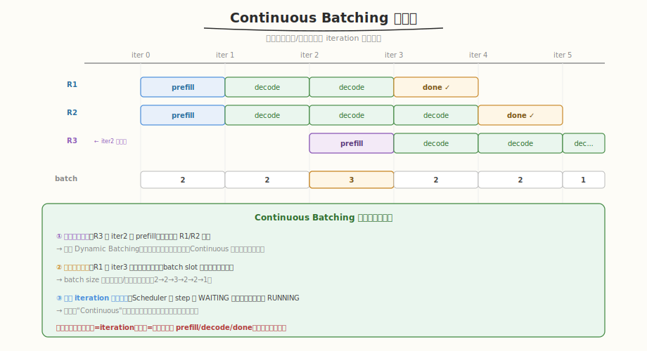

## Day 4：高频面试题进阶篇

### 🎯 目标

通过今天的学习，你将：

1. 掌握 **Attention 优化三件套**——FlashAttention 的 IO 优势、online softmax 推导、FA1 vs FA2 差异<br>
2. 理解 **推理系统核心矛盾**——Prefill vs Decode、KV Cache 显存压力、TTFT/TBT 优化目标<br>
3. 讲清楚 **PagedAttention 设计**——block table、逻辑连续物理离散、copy-on-write、碎片消除<br>
4. 复述 **vLLM 架构与调度**——LLMEngine/Scheduler/Worker 分层、Continuous Batching、抢占策略<br>
5. 能回答 **2 道场景设计题**——长文本推理优化、LLM 推理服务架构<br>
6. 产出一份 **进阶篇面试题自问自答笔记**，每道题限时 5 分钟口述并录音回放

> 💡 **为什么重要**：Day 3 的基础篇帮你拿到入场券，Day 4 的进阶篇决定你能否进入下一轮。FlashAttention、KV Cache、PagedAttention、Continuous Batching 是 AI Infra 面试的“分水岭”问题——答得清楚说明你真的做过推理系统，答得模糊会被直接归到“只会背概念”。

---

### 学前导读：为什么进阶篇是面试分水岭

面试官问基础题是为了“排除不会的人”，问进阶题是为了“区分懂的人和精通的人”。

```
基础题（Day 3）                进阶题（Day 4）
"SM 是什么？"                  "FlashAttention 为什么能减少 IO？"
"Occupancy 怎么算？"            "PagedAttention 的 block 多大合适？"
"__syncthreads 是干嘛的？"      "Continuous Batching 怎么解决生成长度不均？"
```

| 考察层级 | 进阶题特征 | 面试官想听到什么 |
|----------|-----------|-----------------|
| 原理层 | 推导 online softmax | 能写出三公式并解释缩放因子 |
| 系统层 | 讲清 vLLM 架构 | 能说清模块职责和数据流 |
| 优化层 | 长文本推理怎么优化 | 能给出 3-5 条具体手段并讲出 trade-off |
| 设计层 | 设计 LLM 推理服务 | 能从请求接入到 GPU 调度完整展开 |

> 💡 **一句话总结**：进阶篇不是考记忆力，而是考你是否能把“算法原理 → 系统设计 → 工程 trade-off”串成一条线。

---

### 理论学习

#### 1.1 进阶篇知识地图



进阶篇覆盖四大主题，每个主题 3-4 个高频考点：

| 主题 | 核心考点 | 面试高频度 |
|------|---------|-----------|
| **① Attention 优化** | FlashAttention IO 分析、online softmax 推导、FA1 vs FA2、GQA/MQA/MHA | ⭐⭐⭐⭐⭐ |
| **② 推理系统** | Prefill vs Decode、KV Cache 显存、TTFT/TBT、量化 | ⭐⭐⭐⭐⭐ |
| **③ vLLM / PagedAttention** | block table、copy-on-write、内存碎片、调度状态机 | ⭐⭐⭐⭐⭐ |
| **④ 调度与 Batching** | Continuous vs Dynamic Batching、抢占策略、优先级调度 | ⭐⭐⭐⭐⭐ |

#### 1.2 Attention 优化

##### FlashAttention 为什么快


标准 Attention 需要把 `S = QK^T` 和 `P = softmax(S)` 两个 `N×N` 矩阵写回 HBM：

```text
IO(标准 Attention) = O(N²)   # N 为序列长度
IO(FlashAttention) = O(Nd)   # d 为 head dim，通常 d << N
```

FlashAttention 的关键不是减少 FLOPs，而是**把计算搬到 SRAM，减少 HBM 往返**。它通过两个技术实现：

1. **Tiling**：把 Q/K/V 切成小块加载到 shared memory，在片上完成 softmax 和加权求和
2. **Online Softmax**：分块计算时维护 running max 和 running sum，避免先完整 softmax 再求和

##### Online Softmax 三公式

```text
m_new = max(m_old, max(x_j))                                       (1)
l_new = l_old × exp(m_old - m_new) + Σ exp(x_j - m_new)             (2)
o_new = o_old × (l_old × exp(m_old - m_new) / l_new)                (3)
        + Σ (exp(x_j - m_new) / l_new) × v_j
```

- `m`：当前已见元素的最大值（参考点）
- `l`：当前已见元素 softmax 分母的和
- `o`：当前已见元素的加权输出
- `exp(m_old - m_new)`：把旧参考点统一到新参考点的缩放因子

> ⚠️ 面试常考：为什么需要 `exp(m_old - m_new)`？答：因为不同 block 的 softmax 参考点不同，必须统一参考点才能正确累加。

##### FlashAttention-1 vs FlashAttention-2

| 维度 | FA1 | FA2 |
|------|-----|-----|
| non-matmul FLOPs | 较多（online softmax 在主循环外） | 更少（融合到 warp 组） |
| work partitioning | block 级 | warp group 级，减少同步 |
| 同步点 | 每 tile 结束需同步 | 更少 |
| occupancy | 一般 | 更高 |
| 训练/推理 | 主要优化训练 | 对推理 decode 更友好 |

##### MHA / GQA / MQA

| 结构 | K/V 共享方式 | 显存占用 | 生成质量 |
|------|-------------|---------|---------|
| MHA | 每个 head 独立 K/V | 最大 | 最好 |
| GQA | 每 group 共享 K/V | 中等 | 接近 MHA |
| MQA | 所有 head 共享一组 K/V | 最小 | 可能下降 |

> 💡 工程上 LLaMA2-70B 用 GQA，在显存和质量之间取平衡。

#### 1.3 推理系统核心问题

##### Prefill vs Decode

| 阶段 | 输入形状 | 计算特征 | 瓶颈 | 优化目标 |
|------|---------|---------|------|---------|
| **Prefill** | `(B, N_prompt, d)` | 可并行 | compute-bound | TTFT（首 token 延迟） |
| **Decode** | `(B, 1, d)` | 自回归串行 | memory-bound | TBT（相邻 token 间隔） |

Decode 阶段 M=1，GEMM 退化，arithmetic intensity 极低，瓶颈在读取权重和 KV Cache。

##### KV Cache 显存压力

```text
每 token KV Cache ≈ 2 × layers × heads × d_head × bytes
例如 LLaMA2-7B：2 × 32 × 32 × 128 × 2B ≈ 1 MB/token (FP16)
4k 序列单请求 ≈ 4 GB，batch=16 ≈ 64 GB
```

优化方向：

1. **量化**：INT8/INT4 KV Cache，显存减半或四分之一
2. **分页**：PagedAttention 避免碎片和 over-allocation
3. **压缩**：滑动窗口 attention、H2O 等稀疏策略
4. **offload**：长序列 KV Cache 换到 CPU/SSD

#### 1.4 PagedAttention



核心设计：

- 把 KV Cache 分成固定大小 block（如 16 tokens）
- 每个请求维护一个 **block table**：逻辑 block id → 物理 block id
- 物理 block 可以不连续，由 allocator 按需分配
- 支持 **copy-on-write**：prefix 共享时多个请求指向同一块物理 block，写时复制

解决的问题：

| 问题 | 传统 KV Cache | PagedAttention |
|------|--------------|----------------|
| 内存碎片 | 预分配最大长度，大量浪费 | 按需分配 block |
| 动态长度 | 需要 contiguous 内存 | 逻辑连续即可 |
| Prefix 共享 | 复制多份 | copy-on-write 共享 |

#### 1.5 vLLM 架构与调度


```text
User Request
    ↓
LLMEngine  （请求生命周期管理）
    ↓
Scheduler  （每轮选请求、分配 block、处理抢占）
    ↓
Worker     （进程/线程，管理 GPU）
    ↓
Model Runner （执行 forward）
```

请求状态机：

```text
WAITING  →  RUNNING  →  FINISHED
             ↓    ↑
           SWAPPED （显存不足时被抢占）
```

##### Continuous Batching



- **Dynamic Batching**：request-level，一批请求一起开始、一起结束，生成长度不一时 GPU 空转
- **Continuous Batching**：iteration-level，每轮 forward 后重新组装 batch，完成的请求退出、新请求加入

> 💡 Continuous Batching 是 vLLM 高吞吐的关键，也是面试“为什么 vLLM 比传统服务快”的标准答案。

##### 抢占策略

| 策略 | 做法 | 优点 | 缺点 |
|------|------|------|------|
| **Recompute** | 丢弃 KV Cache，之后重算 prompt | 通常更快 | 浪费算力 |
| **Swap** | KV Cache 换出到 CPU | 不浪费算力 | CPU↔GPU 带宽受限 |

vLLM 默认 **Recompute**，因为大部分情况下重算比 swap 快。

---

### Coding 任务：进阶篇面试题自问自答笔记

#### 任务 1：创建 interview_advanced.py

创建文件 [kernels/interview_advanced.py](kernels/interview_advanced.py)，将 12 道进阶篇高频题整理为可自测的 Q&A 系统：

```python
# interview_advanced.py —— 进阶篇面试题自测系统
# 运行命令: python interview_advanced.py
# 依赖: 仅标准库

import random

QUESTIONS = [
    {
        "id": 1,
        "topic": "Attention 优化",
        "question": "FlashAttention 为什么比标准 Attention 快？",
        "answer": (
            "标准 Attention 物化 S=QK^T 和 P=softmax(S) 两个 N×N 矩阵到 HBM，IO 是 O(N²)\n"
            "FlashAttention 通过 tiling + online softmax 在 SRAM 中完成计算，IO 是 O(Nd)"
        ),
        "freq": 5,
    },
    # ... 共 12 道题
]

# 完整代码见 kernels/interview_advanced.py
```

完整代码见 [kernels/interview_advanced.py](kernels/interview_advanced.py)。

代码要点：
- **12 道题** 覆盖四大主题（Attention 优化 3 题 + 推理系统 3 题 + vLLM/调度 3 题 + 场景题 3 题）
- **自测模式**：随机抽题 → 口述答案 → 按回车看参考 → 自评
- **高频度标记**：`freq` 字段（3-5 星），5 星 = 必考
- **交互式**：`input()` 暂停让你口述，模拟真实面试节奏

#### 任务 2：运行自测系统

```bash
python kernels/interview_advanced.py
```

**预期输出**（节选）：

```text
=== AI Infra 面试进阶篇自测系统 ===
共 12 道题

命令：
  list  — 列出所有题目
  test  — 随机抽 5 题自测（默认）
  test N — 随机抽 N 题自测

输入命令: test 5

=== 进阶篇面试自测（随机 5 题）===

[1/5] ⭐⭐⭐⭐⭐ [Attention 优化]
Q: FlashAttention 为什么比标准 Attention 快？
口述答案后按回车查看参考...
A: 标准 Attention 物化 S=QK^T 和 P=softmax(S) 两个 N×N 矩阵到 HBM，IO 是 O(N²)
FlashAttention 通过 tiling + online softmax 在 SRAM 中完成计算，IO 是 O(Nd)
```

##### 观察重点

1. **限时 5 分钟**：每道题口述不超过 5 分钟，超时说明理解不深
2. **录音回放**：录下自己的口述，回放找卡壳点和口头禅
3. **追问答法**：每道题准备 1 个 follow-up 答案，例如讲完 FlashAttention 后立刻能讲 FA1 vs FA2

#### 任务 3：白板推导 online softmax

不看资料，在纸上完整写出 online softmax 三公式，并解释：

1. 为什么需要维护 `m` 和 `l` 两个状态？
2. `exp(m_old - m_new)` 的物理意义是什么？
3. 如果直接对每个 block 做 softmax 再相加，错在哪里？

> 思考：标准 softmax 的分母是全局 `Σ exp(x_i)`，online softmax 的分母是“统一参考点后的局部和累加”，这是 FlashAttention 能在 SRAM 完成计算的核心。

#### 任务 4：LeetGPU 在线题目 —— Sliding Window Self-Attention

**题目链接**：<https://leetgpu.com/challenges/sliding-window-self-attention>

**题目概述**：给定输入序列 `X ∈ R^(N×d)`，实现 **Sliding Window Self-Attention**：每个位置 `i` 的 query 只与左侧窗口 `[max(0, i-W+1), i]` 内的 `W` 个 key 做 attention，输出 `O ∈ R^(N×d)`。

**与今日知识的关联**：今日进阶篇核心主题之一是**长文本推理优化**。标准 Attention 的 `O(N²)` IO 在长序列下不可接受，而 Sliding Window Attention 通过固定局部窗口把复杂度降到 `O(N·W)`，是 Longformer、StreamingLLM 等长上下文方案的基础。面试中回答"长文本怎么优化"时，能讲清局部窗口 Attention 的 kernel 实现、显存收益和精度 trade-off，是加分项。

> 💡 提交后在 [LeetGPU Sliding Window Self-Attention](https://leetgpu.com/challenges/sliding-window-self-attention) 上记录通过耗时。完整题解见 [Sliding Window Self-Attention 题解](../../leetgpu/week8/day4/leetgpu-sliding-window-self-attention-solution.md)。

#### 任务 5：LeetCode 面试题 —— 编辑距离

**题目链接**：[72. 编辑距离](https://leetcode.cn/problems/edit-distance/)

**题目概述**：给定两个字符串 `word1` 和 `word2`，返回把 `word1` 转换成 `word2` 所使用的最少操作数（插入/删除/替换）。

**与今日知识的关联**：编辑距离在 LLM 推理系统中有直接应用——**Speculative Decoding Verification** 中 draft token 与 target token 的对齐、**Beam Search** 中候选序列的去重比较，本质上都是序列间的编辑距离问题。此外，编辑距离的 `O(m×n)` 二维 DP 与 Attention Score 矩阵计算同构（两序列逐位置交互），GPU 分块并行化思路相同。面试中"二维 DP 状态转移"和"空间优化"是高频考点。

**核心套路**：

```python
# 二维 DP：dp[i][j] = word1[0..i-1] → word2[0..j-1] 的最少操作数
m, n = len(word1), len(word2)
dp = [[0] * (n + 1) for _ in range(m + 1)]
for i in range(m + 1): dp[i][0] = i
for j in range(n + 1): dp[0][j] = j

for i in range(1, m + 1):
    for j in range(1, n + 1):
        if word1[i-1] == word2[j-1]:
            dp[i][j] = dp[i-1][j-1]          # 字符相同，无操作
        else:
            dp[i][j] = 1 + min(
                dp[i-1][j-1],   # 替换
                dp[i-1][j],     # 删除
                dp[i][j-1]      # 插入
            )
return dp[m][n]
```

> 💡 完整题解（含二维 DP 与滚动数组 O(n) 空间优化、最优路径回溯、与 speculative decoding 的关联）见 [编辑距离题解](../../../leetcode/daily/week8/day4/编辑距离.md)。

---

### 扩展实验

#### 实验 1：限时口述 vLLM 架构

不看资料，限时 5 分钟，从用户请求进入开始，口述 LLMEngine → Scheduler → Worker → Model Runner 的完整数据流，并说明请求状态机。录音回放，检查是否漏掉 block table 或抢占策略。

> 思考：哪个模块你讲得最模糊？针对那一模块重读 Week5/Week6 对应教程。

#### 实验 2：用数字解释 KV Cache 压力

选一个你熟悉的模型（如 LLaMA2-7B/13B/70B），计算：

1. 单请求 4k/8k 序列的 KV Cache 显存占用
2. batch=8/16/32 时的总显存
3. INT8 量化后能省多少显存

> 思考：为什么 Decode 阶段 batch 越大越能隐藏权重读取延迟？（提示：同一权重被多个请求共享，amortize 读取成本。）

#### 实验 3：设计题 mock

选一道场景题（“长文本推理优化”或“设计 LLM 推理服务”），准备 3 分钟版本和 10 分钟版本：

- **3 分钟版本**：给出 5 个关键词，每个词一句话解释
- **10 分钟版本**：从请求接入、调度、KV Cache、Attention、量化、监控完整展开

> 思考：面试官最可能在哪个点打断追问？提前准备 2-3 个 follow-up。

---

### 今日总结

Day 4 我们系统复习了 AI Infra 面试进阶篇的四大主题：

1. **Attention 优化**：FlashAttention 通过 tiling + online softmax 把 IO 从 `O(N²)` 降到 `O(Nd)`；FA2 比 FA1 减少了 non-matmul FLOPs 和同步点；MHA/GQA/MQA 是显存与质量的 trade-off
2. **推理系统**：Prefill compute-bound 关注 TTFT，Decode memory-bound 关注 TBT；KV Cache 是显存瓶颈，量化/分页/压缩/offload 是四大优化方向
3. **PagedAttention**：block table 实现逻辑连续物理离散，copy-on-write 支持 prefix 共享，解决碎片和 over-allocation
4. **vLLM 调度**：LLMEngine → Scheduler → Worker → Model Runner；Continuous Batching 在 iteration 级别动态组 batch；抢占默认 Recompute
5. **自测系统**：12 道进阶题覆盖四大主题，随机抽题 + 限时口述 + 录音回放
6. **Sliding Window Self-Attention**：长文本优化典型 CUDA 题，理解局部窗口 Attention 的 IO 收益与实现要点
7. **课程表**：拓扑排序与调度依赖同构，训练算法基本功

掌握这些后，你就有了面试进阶篇的“深度弹药”——明天 Day 5 进入 Mock 面试，把知识转化为可表达的面试语言。

---

### 面试要点

1. **FlashAttention 为什么比标准 Attention 快？**（⭐⭐⭐⭐⭐ 必考）

<details>
<summary>点击查看答案</summary>

 - 标准 Attention 需要把 `S=QK^T` 和 `P=softmax(S)` 两个 `N×N` 矩阵写回 HBM，IO 是 `O(N²)`
 - FlashAttention 用 tiling 把 Q/K/V 切成小块加载到 SRAM，在片上完成 softmax 和加权求和
 - 配合 online softmax 维护 running max 和 running sum，避免物化完整 N×N 矩阵
 - IO 降为 `O(Nd)`，速度来自减少数据移动而非减少 FLOPs
 - 长序列、小 head dim 时收益最大

</details>


2. **推导 online softmax 的三个公式。**（⭐⭐⭐⭐⭐ 必考）

<details>
<summary>点击查看答案</summary>

 ```text
 m_new = max(m_old, max(x_j))
 l_new = l_old × exp(m_old - m_new) + Σ exp(x_j - m_new)
 o_new = o_old × (l_old × exp(m_old - m_new) / l_new) + Σ (exp(x_j - m_new) / l_new) × v_j
 ```

 - `m`：当前已见元素最大值（参考点）
 - `l`：统一参考点后的 softmax 分母累加和
 - `o`：统一参考点后的加权输出累加和
 - `exp(m_old - m_new)`：把旧参考点统一到新参考点的缩放因子
 - 作用：分块计算时不需要等所有 block 到齐，可以边算边更新

</details>


3. **Prefill 和 Decode 的区别？各自优化目标？**（⭐⭐⭐⭐⭐ 必考）

<details>
<summary>点击查看答案</summary>

 - **Prefill**：输入完整 prompt，形状 `(B, N_prompt, d)`，可并行，compute-bound
   - 优化目标：**TTFT**（Time To First Token），用 FlashAttention 降低 attention IO
 - **Decode**：自回归逐 token 生成，形状 `(B, 1, d)`，M=1 导致 GEMM 退化，memory-bound
   - 优化目标：**TBT**（Time Between Tokens），用 KV Cache + Continuous Batching 提升吞吐
 - Decode 的 arithmetic intensity 极低，瓶颈在权重和 KV Cache 读取

</details>


4. **PagedAttention 解决了什么问题？核心设计是什么？**（⭐⭐⭐⭐⭐ 必考）

<details>
<summary>点击查看答案</summary>

 - **解决问题**：KV Cache 静态/动态分配造成的显存碎片和浪费，以及 contiguous 内存要求
 - **核心设计**：
   - 把 KV Cache 分成固定大小 block（如 16 tokens）
   - 每个请求维护 block table：逻辑 block → 物理 block
   - 物理 block 可以不连续，allocator 按需分配
   - 支持 copy-on-write，多个请求共享同一块物理 block，写时复制
 - **收益**：消除碎片、支持动态长度、支持 prefix 共享、提高显存利用率

</details>


5. **Continuous Batching 和 Dynamic Batching 的区别？为什么 LLM 更适合 Continuous？**（⭐⭐⭐⭐⭐ 必考）

<details>
<summary>点击查看答案</summary>

 - **Dynamic Batching**：request-level，一批请求一起开始、一起结束
   - 问题：LLM 生成长度差异大，先完成的请求要等后完成的，GPU 空转
 - **Continuous Batching**：iteration-level，每轮 forward 后重新组装 batch
   - 完成的请求退出，新请求加入，GPU 几乎不空转
 - **为什么 LLM 更适合 Continuous**：生成长度不可预测且差异大，iteration 级调度能最大化 GPU 利用率
 - vLLM 的高吞吐主要来自 Continuous Batching + PagedAttention

</details>
