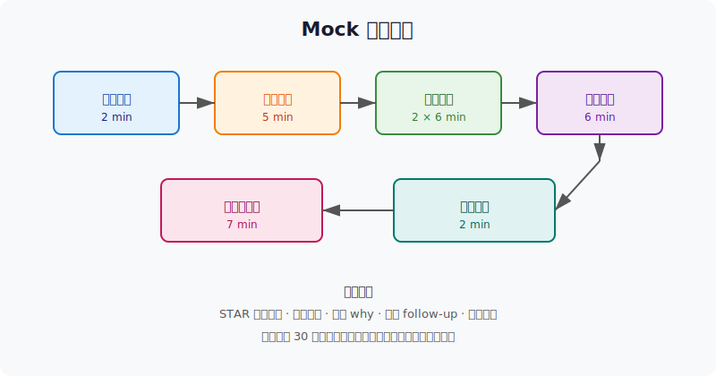

## Day 5：Mock 面试

### 🎯 目标

通过今天的学习，你将：

1. 掌握 **Mock 面试的完整流程**——自我介绍、项目介绍、技术难点、优化思路、场景题、反问<br>
2. 学会用 **STAR 法** 结构化讲述项目，突出技术决策和量化成果<br>
3. 能针对 **2-3 个技术难点** 准备 5-10 分钟深度讲解，并预判 follow-up<br>
4. 练习 **限时口述** 与时间控制，避免面试中说不完或说太多<br>
5. 建立 **个人面试题库** 和 **复盘清单**，把每次练习转化为可改进的反馈<br>
6. 完成 **至少 1 轮完整 Mock 面试** 并录音/文字复盘

> 💡 **为什么重要**：Day 3-4 积累了大量知识点，但知识 ≠ 面试表现。很多人“懂”却“讲不清楚”，Mock 面试是把知识转化为表达的唯一途径。今天你要当自己的面试官，逼自己在限时内把项目和技术点讲明白。

---

### 学前导读：为什么需要 Mock 面试

面试不是开卷考试，而是**限时口述 + 临场互动**。你以为自己“会”的内容，一旦面对面试官的追问，很可能会：

```
❌ 开场 5 分钟还没讲清楚项目是做什么的
❌ 技术点只停留在“是什么”，讲不出“为什么”
❌ 被 follow-up 一问就卡壳，开始绕圈子
❌ 时间分配失控，重点没讲完就被打断
❌ 口头禅严重：然后、那个、就是
```

| 学习方式 | 效果 |
|----------|------|
| 看书/看代码 | 理解 30% |
| 写笔记 | 理解 50% |
| 自己口述一遍 | 理解 70% |
| **Mock 面试 + 录音复盘** | **理解 90%** |

> 💡 **一句话总结**：Mock 面试的目的不是“背答案”，而是训练你在压力下**清晰、有逻辑、有重点**地表达技术思考。

---

### 理论学习

#### 1.1 Mock 面试流程



完整 Mock 面试分为 7 个环节，总时长约 30 分钟：

| 环节 | 时长 | 核心目标 |
|------|------|---------|
| 自我介绍 | 1-2 min | 建立第一印象，点明背景和方向 |
| 项目介绍 | 3-5 min | 用 STAR 法讲清项目价值 |
| 技术难点 1 | 5-6 min | 深入讲一个你最强的技术点 |
| 技术难点 2 | 5-6 min | 展示另一个维度的能力 |
| 优化思路 | 5-6 min | 展示从问题到方案到验证的完整链路 |
| 场景设计题 | 6-7 min | 展示系统设计和 trade-off 能力 |
| 反问环节 | 1-2 min | 展示主动性和岗位匹配度 |

#### 1.2 自我介绍的 STAR-mini 模板

```text
1. 我是谁：姓名 + 背景 + 当前方向
2. 我做了什么：一句话概括项目（Mini AI Infra / 手写 CUDA kernel / Mini 推理引擎）
3. 核心亮点：1-2 个量化成果（如 GEMM 达到 cuBLAS 70%、支持 Continuous Batching）
4. 我想做什么：应聘岗位方向
```

示例：

```text
"我叫陈斌斌，最近 8 周集中学习 AI Infra。
我手写了一套 CUDA kernel，包括 GEMM、FlashAttention、Softmax、LayerNorm，
并构建了一个支持 KV Cache、Continuous Batching 和优先级调度的 Mini 推理引擎。
希望应聘 AI Infra / 推理优化相关岗位。"
```

#### 1.3 项目介绍的 STAR 法

| 部分 | 内容 | 示例 |
|------|------|------|
| **S**ituation | 项目背景 | LLM 推理部署对延迟和吞吐要求高，我想理解底层优化 |
| **T**ask | 你的目标 | 手写高性能 kernel 并搭建一个可运行的 Mini 推理引擎 |
| **A**ction | 你做了什么 | GEMM 优化到 cuBLAS 70%、实现 FlashAttention、Continuous Batching Scheduler |
| **R**esult | 量化成果 | 单卡吞吐 X tokens/s、TTFT Y ms、TBT Z ms |

> ⚠️ 避免只列技术栈，要突出：**你解决了什么问题、为什么难、你怎么权衡、结果如何**。

#### 1.4 技术难点讲解模板

选一个你真正深入做过的点，按以下结构准备：

```textn1. 问题是什么：标准 Attention IO 是 O(N²)，长序列跑不动
2. 现有方案局限：朴素 tiling 需要物化 N×N 矩阵
3. 你的方案：FlashAttention = tiling + online softmax，IO 降到 O(Nd)
4. 实现细节：block 切分、shared memory 分配、warp 同步
5. 验证结果：相比 naive 快 X 倍、接近 cuBLAS/FAI
6. 还可以怎么优化：FA2 的 warp group、double buffering、量化
```

每个点准备 **3 分钟精简版** 和 **6 分钟完整版**，根据面试官反应切换。

#### 1.5 常见 Follow-up 与应对

| Follow-up | 考察点 | 应对策略 |
|-----------|--------|---------|
| "为什么不用 vLLM 直接部署？" | 技术选型思考 | 承认 vLLM 成熟，但手写是为了理解底层、做定制优化 |
| "你的 kernel 和官方实现差距多少？" | 量化意识 | 给出具体数字（70% cuBLAS），并讲清差距来源 |
| "如果 batch 从 8 加到 64，系统会怎样？" | 系统扩展性 | 分析显存、吞吐、latency 的变化 |
| "如何再优化 TBT？" | 持续优化能力 | 列出 3 个方向：量化、CUDA Graph、调度策略 |
| "如果显存不够怎么办？" | trade-off | KV Cache 量化、swap、recompute、稀疏 attention |

#### 1.6 反问环节

准备 2-3 个问题，避免只问薪资：

1. 团队目前在推理优化的重点方向是什么？
2. 这个岗位日常更多做 kernel 优化还是系统架构？
3. 团队对新人的培养机制是怎样的？
4. 目前推理服务最大的技术挑战是什么？

---

### Coding 任务：Mock 面试练习

#### 任务 1：创建 mock_interview.py

创建文件 [kernels/mock_interview.py](kernels/mock_interview.py)，把 Mock 面试的 7 个环节做成一个带计时器的练习系统：

```python
# mock_interview.py —— Mock 面试计时与提纲系统
# 运行命令: python mock_interview.py
# 依赖: 仅标准库

import time

SECTIONS = [
    {"name": "自我介绍", "duration": 120, "prompt": "..."},
    {"name": "项目介绍", "duration": 300, "prompt": "..."},
    # ... 共 7 个环节
]

# 完整代码见 kernels/mock_interview.py
```

完整代码见 [kernels/mock_interview.py](kernels/mock_interview.py)。

代码要点：
- **7 个环节** 覆盖完整面试流程，每个环节有明确的时间限制和提示
- **倒计时显示**：实时显示剩余时间，可提前结束
- **复盘清单**：结束后输出时间控制、口头禅、技术点清晰度等检查项
- **两种模式**：`start` 完整模拟、`outline` 查看提纲

#### 任务 2：运行一次完整 Mock 面试

```bash
python kernels/mock_interview.py
```

**预期流程**（节选）：

```text
=== AI Infra Mock 面试 ===
共 7 个环节，全程约 30 分钟

命令：
  start  — 开始完整 Mock 面试
  outline — 查看面试提纲

输入命令: start
============================================================
【自我介绍】限时 120 秒
------------------------------------------------------------
1. 姓名、背景
2. 目前方向
3. 项目核心亮点（一句话）
4. 希望应聘的岗位
------------------------------------------------------------
准备就绪后按回车开始...
```

##### 观察重点

1. **是否超时**：每个环节超时说明内容没压缩好
2. **是否卡壳**：记录卡壳点，回到 Day 3-4 重新复习
3. **口头禅统计**：重点听“然后、那个、就是、嗯”
4. **量化是否清晰**：项目介绍中是否给出了具体数字

#### 任务 3：录制并复盘

用手机或电脑录下自己的 Mock 面试过程，回放后填写复盘表：

| 环节 | 用时 | 流畅度 1-5 | 主要问题 | 改进动作 |
|------|------|-----------|---------|---------|
| 自我介绍 | | | | |
| 项目介绍 | | | | |
| 技术难点 1 | | | | |
| 技术难点 2 | | | | |
| 优化思路 | | | | |
| 场景设计题 | | | | |
| 反问 | | | | |

> 思考：哪个环节得分最低？针对该环节重写逐字稿，再练 3 遍。

#### 任务 4：LeetGPU 在线题目 —— Top-K Selection

**题目链接**：<https://leetgpu.com/challenges/top-k-selection>

**题目概述**：给定长度为 `N` 的分数数组，找出最大的 `K` 个值及其下标。这是 LLM 推理中 **sampling** 阶段的核心算子——生成 token 概率后需要快速取 top-k/top-p 进行筛选。

**与今日知识的关联**：面试中常被问到"生成阶段除了 GEMM 和 Attention，还有哪些算子瓶颈"。Top-K 是典型答案：朴素排序是 `O(N log N)`，而 GPU 上可用 partial sort、bitonic sort 或 warp-select 优化到 `O(N)` 或 `O(N log K)`。同时它与调度策略相关——sampling 结果决定下一步要解码的 token。

> 💡 提交后在 [LeetGPU Top-K Selection](https://leetgpu.com/challenges/top-k-selection) 上记录通过耗时。完整题解见 [Top-K Selection 题解](../../leetgpu/week6/day6/leetgpu-top-k-selection-solution.md)。

#### 任务 5：LeetCode 面试题 —— 跳跃游戏 II

**题目链接**：[45. 跳跃游戏 II](https://leetcode.cn/problems/jump-game-ii/)

**题目概述**：给定非负整数数组 `nums`，你最初位于数组第一个位置，每个元素代表你在该位置可以跳跃的最大长度，求到达最后一个位置的最少跳跃次数。

**与今日知识的关联**：跳跃游戏 II 的 **贪心/DP 思想** 与推理系统中的 **调度决策** 同构——Scheduler 每轮需要决定“从当前状态出发，下一步选择哪个请求/哪个 batch 能最快推进系统目标（最小化 TBT、最大化吞吐）”。两者都是在约束条件下做局部最优选择。面试中“如何做决策”是高频问题，这道题训练的是“在 O(N) 内做出最优跳跃”的直觉。

**核心套路**：

```python
def jump(nums):
    n = len(nums)
    if n <= 1:
        return 0
    jumps = 0
    cur_end = 0      # 当前这一轮能跳到的最远距离
    farthest = 0     # 下一轮能跳到的最远距离
    for i in range(n - 1):
        farthest = max(farthest, i + nums[i])
        if i == cur_end:
            jumps += 1
            cur_end = farthest
    return jumps
```

> 💡 完整题解（含贪心法与 DP 法对比、复杂度分析、与调度决策的类比）见 [跳跃游戏 II 题解](../../../leetcode/daily/week2/day7/跳跃游戏 II.md)。

---

### 扩展实验

#### 实验 1：准备 3 分钟项目 elevator pitch

不看资料，限时 3 分钟，向别人介绍你的项目。要求：

- 第 1 句话说明项目是什么
- 第 2-3 句话说明解决了什么问题
- 第 4-5 句话说明最难的技术点
- 最后一句给出量化成果

> 思考：如果对方听完 3 分钟仍不知道你的项目价值，说明 pitch 需要再压缩。

#### 实验 2：模拟高压追问

选一个技术难点（如 FlashAttention），让朋友或自己扮演面试官连续追问 5 个 why：

1. 为什么 FlashAttention 能减少 IO？
2. 为什么 online softmax 能避免物化 N×N 矩阵？
3. 为什么 FA2 比 FA1 快？
4. 为什么长序列收益更大？
5. 如果 head dim 很大，FlashAttention 还值得用吗？

> 思考：每个 why 是否都能用一句话 + 一个数字回答？

#### 实验 3：写一份面试逐字稿

把“自我介绍 + 项目介绍 + 一个技术难点”写成逐字稿，控制在 800 字以内。朗读一遍，记录时间。然后删掉 30% 的冗余词，再朗读。目标：信息密度高、没有口头禅。

> 思考：哪些词可以删除？通常是修饰词和重复解释。

---

### 今日总结

Day 5 我们把前四天的知识转化为面试表达能力：

1. **Mock 面试流程**：7 个环节、约 30 分钟、每个环节有明确时间限制
2. **STAR 法**：Situation → Task → Action → Result，用量化成果支撑每个技术决策
3. **技术难点讲解**：问题 → 局限 → 方案 → 细节 → 验证 → 进一步优化，准备 3 分钟和 6 分钟两个版本
4. **Follow-up 应对**：常见追问包括“为什么不用现成方案”“差距多少”“怎么再优化”“显存不够怎么办”
5. **计时系统**：`mock_interview.py` 提供倒计时和复盘清单，把练习标准化
6. **录音复盘**：通过回放发现口头禅、超时、卡壳点，针对性改进
7. **Top-K Selection**：LLM 推理 sampling 阶段的典型算子，连接面试中的“生成阶段优化”问题
8. **跳跃游戏 II**：贪心决策训练，与 Scheduler 做局部最优选择同构

完成今天的 Mock 面试后，你应该能清晰、自信地介绍项目和核心技术点。明天 Day 6 进入查漏补缺，针对今天暴露的薄弱点做最后冲刺。

---

### 面试要点

1. **用 STAR 法介绍你的项目。**（⭐⭐⭐⭐⭐ 必考）

<details>
<summary>点击查看答案</summary>

 - **S**ituation：项目背景，为什么要做
 - **T**ask：你的目标是什么
 - **A**ction：你做了什么（技术点 1、2、3）
 - **R**esult：量化成果（cuBLAS 70%、吞吐 X tokens/s、TTFT Y ms）
 - 示例："我构建了一个 Mini LLM 推理引擎，目标是理解 vLLM 的调度与 Attention 优化。我手写 FlashAttention 把长序列 attention IO 从 O(N²) 降到 O(Nd)，实现 Continuous Batching 提升吞吐，最终单卡吞吐达到 X tokens/s。"

</details>


2. **讲清楚一个你最熟悉的技术难点。**（⭐⭐⭐⭐⭐ 必考）

<details>
<summary>点击查看答案</summary>

 - 结构：问题 → 现有方案局限 → 你的方案 → 实现细节 → 验证结果 → 还能怎么优化
 - 示例（FlashAttention）：
   - 问题：标准 Attention 物化 N×N 矩阵，IO 是 O(N²)
   - 局限：朴素 tiling 仍需写回中间结果
   - 方案：FlashAttention = tiling + online softmax
   - 细节：block 切分、shared memory、warp 同步
   - 验证：相比 naive 快 X 倍
   - 优化：FA2、double buffering、量化

</details>


3. **Dynamic Batching 和 Continuous Batching 有什么区别？为什么 LLM 更适合 Continuous？**（⭐⭐⭐⭐⭐ 必考）

<details>
<summary>点击查看答案</summary>

 - **Dynamic Batching**：request-level，一批请求一起开始一起结束
 - **Continuous Batching**：iteration-level，每轮 forward 后重新组 batch
 - LLM 生成长度差异大，Dynamic Batching 会导致先完成的请求等待 GPU 空转
 - Continuous Batching 让请求动态加入/退出，最大化 GPU 利用率
 - vLLM 的高吞吐主要来自 Continuous Batching + PagedAttention

</details>


4. **PagedAttention 解决了什么问题？核心设计是什么？**（⭐⭐⭐⭐⭐ 必考）

<details>
<summary>点击查看答案</summary>

 - 解决问题：KV Cache 静态分配造成的显存碎片和浪费
 - 核心设计：
   - 把 KV Cache 分成固定大小 block
   - block table：逻辑 block 连续，物理 block 可不连续
   - copy-on-write 支持 prefix 共享
 - 收益：提高显存利用率、支持动态长度、方便调度

</details>


5. **面试中常见的 follow-up 有哪些？怎么准备？**（⭐⭐⭐⭐ 高频）

<details>
<summary>点击查看答案</summary>

 - "为什么不用现成方案？" → 说明学习/定制/优化的目标
 - "你的实现和官方差距多少？" → 给出具体数字和差距来源
 - "如果 batch 增大 10 倍会怎样？" → 分析显存、吞吐、latency
 - "如何再优化？" → 列出 3 个方向并讲优先级
 - "显存不够怎么办？" → KV Cache 量化、swap、recompute、稀疏 attention
 - 准备方法：为每个技术点准备 3 分钟精简版和 6 分钟完整版，提前写逐字稿并录音

</details>
