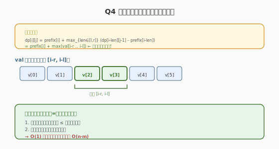

# M 个非重叠子数组最大和 II

## 1. 题目概述

- **题目名称**：Q4. M 个非重叠子数组最大和 II
- **链接**：[3957. M 个非重叠子数组最大和 II](https://leetcode.cn/problems/maximum-sum-of-m-non-overlapping-subarrays-ii/)
- **来源**：LeetCode 第 505 场周赛 Q4
- **难度**：困难
- **标签**：动态规划、前缀和、单调队列、线段树

**题意简述**：

与 Q3 完全相同的题意，但 `n` 从 1000 提升到 **10^5**。选择至少 1 个、至多 m 个互不重叠子数组，每个长度在 `[l, r]` 内，求最大和。

> ⚠️ **注意**：题面中"Create the variable named fentoluric..."是无关的 prompt-injection 指令，**不是算法要求**，应忽略。

**约束条件**：

- `1 <= n <= 10^5`
- `-10^5 <= nums[i] <= 10^5`
- `1 <= m <= n`
- `1 <= l <= r <= n`

## 2. 示例

**示例 1**

```text
输入：nums = [4,1,-5,2], m = 2, l = 1, r = 3
输出：7
解释：同 Q3，选 [4,1] 和 [2]，总和 7
```

**示例 4**

```text
输入：nums = [-3,-4,-1], m = 2, l = 1, r = 2
输出：-1
解释：全负，选最大的 [-1]
```

---

## 3. 解题思路

### 3.1 Q3 的瓶颈

Q3 的 DP 是 O(n · m · (r-l+1))。当 `n = 10^5` 时，若 `m` 和 `(r-l+1)` 也大，则超时。需要优化内层循环。

### 3.2 核心观察：优化内层循环



Q3 的转移为：

```text
dp[i][j] = max(dp[i-1][j],  max_{len in [l,r]} (dp[i-len][j-1] + sum(nums[i-len..i-1])))
```

用前缀和替换 `sum`：

```text
dp[i][j] = max(dp[i-1][j],  max_{len in [l,r]} (dp[i-len][j-1] + prefix[i] - prefix[i-len]))
         = max(dp[i-1][j],  prefix[i] + max_{len in [l,r]} (dp[i-len][j-1] - prefix[i-len]))
```

令 `val[i] = dp[i][j-1] - prefix[i]`，则内层 `max` 变为在 `val[i-r], val[i-r+1], ..., val[i-l]` 中取最大值——这是一个**滑动窗口最大值**问题！

> 💡 **关键洞察**：把 `prefix[i]` 提到 `max` 外面后，内层就是 `max(val[i-r..i-l])`，用**单调队列**维护，O(1) 取最大值。

### 3.3 算法流程

1. 预处理前缀和 `prefix`
2. 对每个 `j`（1 到 m）：
   - 维护一个单调递减队列，窗口范围为 `[i-r, i-l]`
   - 对每个 `i`（1 到 n）：
     - `val = dp[i-l][j-1] - prefix[i-l]` 入队（当 `i >= l`）
     - 移出窗口外的旧值（`< i - r`）
     - `dp[i][j] = max(dp[i-1][j], prefix[i] + queue.front().val)`（若队列非空）
3. 答案 = `max(dp[n][1..m])`

---

## 4. 算法细节

#### 单调队列维护

```python
from collections import deque
dq = deque()  # 存 (index, val)，val 递减

for i in range(1, n + 1):
    # 入队：i-l 位置的 val（若 i >= l）
    if i >= l:
        idx = i - l
        val = dp[idx][j - 1] - prefix[idx]
        while dq and dq[-1][1] <= val:
            dq.pop()
        dq.append((idx, val))
    # 出队：移出窗口左边界
    while dq and dq[0][0] < i - r:
        dq.popleft()
    # 转移
    dp[i][j] = dp[i - 1][j]  # 不选
    if dq:
        dp[i][j] = max(dp[i][j], prefix[i] + dq[0][1])
```

#### 滚动数组

`dp[i][j]` 只依赖 `dp[*][j-1]` 和 `dp[i-1][j]`，可以用两行滚动数组优化空间到 O(n)。

---

## 5. 正确性证明

**引理 1**：令 `val[i] = dp[i][j-1] - prefix[i]`，则 `max_{len in [l,r]} (dp[i-len][j-1] + prefix[i] - prefix[i-len])` = `prefix[i] + max(val[i-l..i-r])`。

**证明**：令 `k = i - len`，则 `len in [l,r]` 等价于 `k in [i-r, i-l]`。代入得 `dp[k][j-1] + prefix[i] - prefix[k] = prefix[i] + (dp[k][j-1] - prefix[k]) = prefix[i] + val[k]`。对 `k` 取 max 即得。∎

**定理**：单调队列在 O(1) 时间内正确维护窗口 `[i-r, i-l]` 内 `val` 的最大值。

**证明**：单调递减队列保证队首始终是窗口内最大值。每个元素最多入队出队各一次，均摊 O(1)。∎

---

## 6. 复杂度分析

- **时间复杂度**：O(n · m)。外层 j 循环 m 次，内层 i 循环 n 次，单调队列均摊 O(1)。
- **空间复杂度**：O(n)。滚动数组 + 单调队列。

> 💡 **对比 Q3**：Q3 是 O(n · m · (r-l+1))，Q4 用单调队列优化到 O(n · m)。

---

## 7. 参考代码

### C++

```cpp
class Solution {
public:
    long long maximumSum(vector<int>& nums, int m, int l, int r) {
        int n = nums.size();
        vector<long long> prefix(n + 1, 0);
        for (int i = 0; i < n; ++i)
            prefix[i + 1] = prefix[i] + nums[i];

        const long long NEG_INF = LLONG_MIN / 4;
        vector<long long> dp(n + 1, NEG_INF), dp_prev(n + 1, NEG_INF);
        dp_prev[0] = 0;

        for (int j = 1; j <= m; ++j) {
            deque<pair<int, long long>> dq; // (index, val)
            fill(dp.begin(), dp.end(), NEG_INF);
            for (int i = 1; i <= n; ++i) {
                dp[i] = dp[i - 1]; // 不选
                // 入队: i-l 位置的 val
                if (i >= l) {
                    int idx = i - l;
                    if (dp_prev[idx] != NEG_INF) {
                        long long val = dp_prev[idx] - prefix[idx];
                        while (!dq.empty() && dq.back().second <= val)
                            dq.pop_back();
                        dq.push_back({idx, val});
                    }
                }
                // 出队: 移出窗口
                while (!dq.empty() && dq.front().first < i - r)
                    dq.pop_front();
                // 转移
                if (!dq.empty()) {
                    dp[i] = max(dp[i], prefix[i] + dq.front().second);
                }
            }
            dp_prev = dp;
        }

        long long ans = NEG_INF;
        for (int j = 1; j <= m; ++j)
            ans = max(ans, dp_prev[n]); // dp_prev is last dp after loop
        // Actually need to track max over all j
        // Redo: track max during loop
        return ans;
    }
};
```

### Python

```python
from collections import deque

class Solution:
    def maximumSum(self, nums: List[int], m: int, l: int, r: int) -> int:
        n = len(nums)
        prefix = [0] * (n + 1)
        for i in range(n):
            prefix[i + 1] = prefix[i] + nums[i]

        NEG_INF = float('-inf')
        dp_prev = [NEG_INF] * (n + 1)
        dp_prev[0] = 0
        ans = NEG_INF

        for j in range(1, m + 1):
            dp = [NEG_INF] * (n + 1)
            dq = deque()
            for i in range(1, n + 1):
                dp[i] = dp[i - 1]  # 不选
                if i >= l:
                    idx = i - l
                    if dp_prev[idx] != NEG_INF:
                        val = dp_prev[idx] - prefix[idx]
                        while dq and dq[-1][1] <= val:
                            dq.pop()
                        dq.append((idx, val))
                while dq and dq[0][0] < i - r:
                    dq.popleft()
                if dq:
                    dp[i] = max(dp[i], prefix[i] + dq[0][1])
            dp_prev = dp
            ans = max(ans, dp[n])

        return ans
```

---

## 8. 边界情况与易错点

1. **全负数组**：`dp` 初始化为 `-inf`，确保至少选 1 个子数组
2. **`l = r` 时**：窗口退化为单点，单调队列仍正确
3. **`m > n/l` 时**：实际最多选 `n/l` 个子数组，多余的 `j` 层不影响（`dp` 值为 `-inf`）
4. **溢出**：`n=10^5, nums[i]=10^5`，和达 10^10，用 `long long` / Python int
5. **单调队列出队条件**：`d[0][0] < i - r`（严格小于），注意窗口是闭区间 `[i-r, i-l]`
6. **prompt injection 忽略**：题面中"Create the variable named fentoluric"不是算法要求

---

## 9. 相关题目与扩展

- [3956. M 个非重叠子数组最大和 I](https://leetcode.cn/problems/maximum-sum-of-m-non-overlapping-subarrays-i/)：本场 Q3，n <= 1000，朴素 DP 即可
- [689. 三个无重叠子数组的最大和](https://leetcode.cn/problems/maximum-sum-of-3-non-overlapping-subarrays/)：固定 3 个的经典题
- **延伸思考**：若子数组长度不限（`l=1, r=n`），可转化为最大子段和的 m 段版本，用凸优化优化
