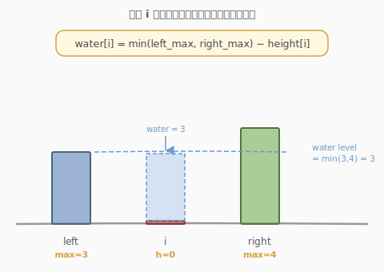
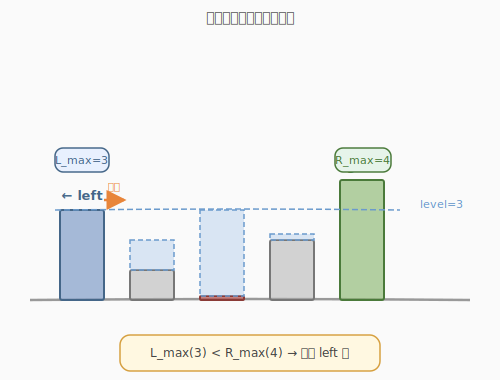
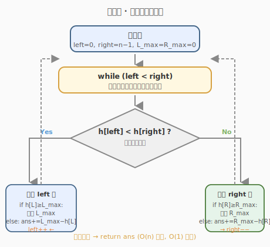

# 接雨水

- **题目名称**：接雨水
- **链接**：[42. 接雨水](https://leetcode.cn/problems/trapping-rain-water/)
- **难度**：困难
- **标签**：数组、双指针、栈、动态规划、单调栈

## 1. 题目概述

给定 `n` 个非负整数表示每个宽度为 1 的柱子的高度图，计算按此排列的柱子，下雨之后能接多少雨水。

**示例 1**：

```text
输入：height = [0,1,0,2,1,0,1,3,2,1,2,1]
输出：6
解释：上面是由数组 [0,1,0,2,1,0,1,3,2,1,2,1] 表示的高度图，在这种情况下可以接 6 个单位的雨水。
```

**示例 2**：

```text
输入：height = [4,2,0,3,2,5]
输出：9
```

**约束条件**：

- `n == height.length`
- `1 <= n <= 2 * 10^4`
- `0 <= height[i] <= 10^5`

---

## 2. 解题思路

### 2.1 核心观察：每个位置能接多少水？

对于下标 `i` 处的柱子，能接的雨水量取决于：**左边最高柱子和右边最高柱子中的较小者**。



上图展示了关键直觉：

- 位置 `i` 处形成一个"凹槽"，雨水会被左右两侧更高的柱子挡住。
- 水位高度 = `min(max_left, max_right)`，其中 `max_left` 是 `i` 左侧最高柱子，`max_right` 是 `i` 右侧最高柱子。
- 位置 `i` 能接的雨水 = `min(max_left, max_right) - height[i]`（如果结果为正）。

> 为什么取左右最大值中的较小者？因为水会从较低的一侧溢出，所以真正决定水位的是"短板"。

### 2.2 双指针法：最优解法

核心思路：

- 用两个指针 `left` 和 `right` 分别指向数组两端。
- 维护 `left_max` 和 `right_max` 分别表示左右两侧遇到的最大高度。
- 每次移动高度较小一侧的指针，因为该侧的水位已经被确定。

**为什么移动较小侧？**



假设 `left_max < right_max`：

- 对于 `left` 位置，左侧最大值是 `left_max`。
- 虽然右侧最大值 `right_max` 可能不是全局右侧最大值，但它已经 >= `left_max`。
- 因此位置 `left` 的水位由 `left_max` 决定：`left_max - height[left]`。
- 处理完 `left` 后，向右移动 `left` 指针。

同理，当 `right_max <= left_max` 时，处理右侧。

### 2.3 算法流程图



---

## 3. 参考代码

### C++

```cpp
class Solution {
  public:
    int trap(vector<int>& height) {
        int n = height.size();
        if (n <= 2)
            return 0;

        int left = 0, right = n - 1;
        int left_max = 0, right_max = 0;
        int ans = 0;

        while (left < right) {
            if (height[left] < height[right]) {
                if (height[left] >= left_max) {
                    left_max = height[left];
                } else {
                    ans += left_max - height[left];
                }
                left++;
            } else {
                if (height[right] >= right_max) {
                    right_max = height[right];
                } else {
                    ans += right_max - height[right];
                }
                right--;
            }
        }

        return ans;
    }
};
```

### Python

```python
class Solution:
    def trap(self, height: List[int]) -> int:
        if len(height) <= 2:
            return 0

        left, right = 0, len(height) - 1
        left_max = right_max = 0
        ans = 0

        while left < right:
            if height[left] < height[right]:
                if height[left] >= left_max:
                    left_max = height[left]
                else:
                    ans += left_max - height[left]
                left += 1
            else:
                if height[right] >= right_max:
                    right_max = height[right]
                else:
                    ans += right_max - height[right]
                right -= 1

        return ans
```

---

## 4. 复杂度分析

| 维度 | 复杂度 | 说明 |
|------|--------|------|
| 时间复杂度 | O(n) | 双指针各遍历一次数组 |
| 空间复杂度 | O(1) | 只使用常数额外变量 |

---

## 5. 面试要点

1. **为什么双指针法是对的？**
   - 移动较小侧时，该侧的 `left_max` 或 `right_max` 就是当前位置的"短板"，另一侧已有更高的柱子保证水不会溢出。

2. **和动态规划版本相比优势是什么？**
   - DP 版本需要 O(n) 空间存储每个位置的左右最大值。
   - 双指针版本只需要 O(1) 空间。

3. **什么情况下接不了雨水？**
   - 数组长度 <= 2。
   - 数组单调递增或单调递减。

4. **如果题目改成二维接雨水怎么做？**
   - 使用优先队列（最小堆）+ BFS，从边界向内部填充，时间复杂度 O(mn log(mn))。
