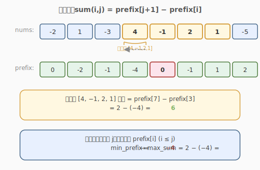
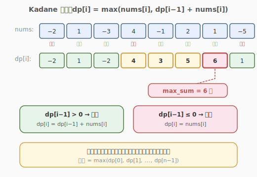
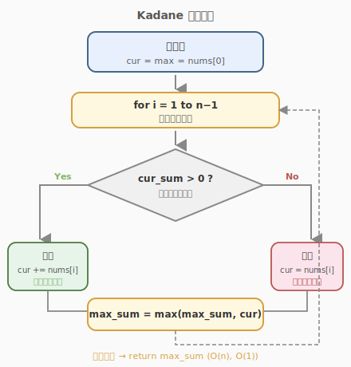
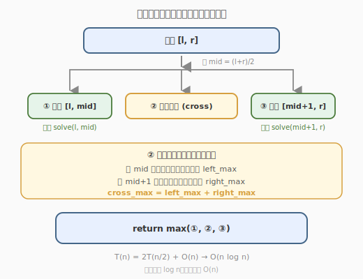

# 最大子数组和

- **题目名称**：最大子数组和
- **链接**：[53. 最大子数组和](https://leetcode.cn/problems/maximum-subarray/)
- **难度**：中等
- **标签**：数组、分治、动态规划、贪心

## 1. 题目概述

给你一个整数数组 `nums`，找到一个具有最大和的连续子数组（子数组最少包含一个元素），返回其最大和。

**示例 1**：

```text
输入：nums = [-2,1,-3,4,-1,2,1,-5,4]
输出：6
解释：连续子数组 [4,-1,2,1] 的和最大，为 6。
```

**示例 2**：

```text
输入：nums = [1]
输出：1
```

**示例 3**：

```text
输入：nums = [5,4,-1,7,8]
输出：23
```

**约束条件**：

- `1 <= nums.length <= 10^5`
- `-10^4 <= nums[i] <= 10^4`

---

## 2. 解题思路

### 2.1 暴力思路

枚举所有子数组 `[i, j]`，计算其和并取最大值。时间复杂度 `O(n^2)`，会超时。

### 2.2 核心观察：前缀和



子数组 `[i, j]` 的和可以表示为：

```text
sum(i, j) = prefix[j + 1] - prefix[i]
```

其中 `prefix[k]` 表示 `nums[0..k-1]` 的和。

要最大化 `sum(i, j)`，对于每个 `j`，需要找到最小的 `prefix[i]`（`i <= j`）。这样可以将问题转化为：遍历前缀和数组，维护当前最小前缀和。

**时间复杂度**：`O(n)`，**空间复杂度**：`O(n)`。

### 2.3 贪心 / Kadane 算法：最优解法

Kadane 算法的核心思想：

> 如果当前子数组和为负数，那么它只会拖累后面的元素，不如从下一个元素重新开始。



定义 `dp[i]` 为以 `nums[i]` 结尾的最大子数组和：

```text
dp[i] = max(nums[i], dp[i-1] + nums[i])
```

- 如果 `dp[i-1] > 0`，则把 `nums[i]` 接在现有子数组后面更优。
- 如果 `dp[i-1] <= 0`，则从 `nums[i]` 重新开始一个子数组更优。

最终答案就是所有 `dp[i]` 中的最大值。

### 2.4 算法流程图



---

## 3. 参考代码

### C++

```cpp
class Solution {
public:
    int maxSubArray(vector<int>& nums) {
        int n = nums.size();
        int cur_sum = nums[0];
        int max_sum = nums[0];

        for (int i = 1; i < n; i++) {
            if (cur_sum > 0) {
                cur_sum += nums[i];
            } else {
                cur_sum = nums[i];
            }
            max_sum = max(max_sum, cur_sum);
        }

        return max_sum;
    }
};
```

### Python

```python
class Solution:
    def maxSubArray(self, nums: List[int]) -> int:
        cur_sum = max_sum = nums[0]

        for num in nums[1:]:
            cur_sum = max(num, cur_sum + num)
            max_sum = max(max_sum, cur_sum)

        return max_sum
```

---

## 4. 复杂度分析

| 维度 | 复杂度 | 说明 |
|------|--------|------|
| 时间复杂度 | O(n) | 只需要遍历数组一次 |
| 空间复杂度 | O(1) | 只使用常数额外变量 |

---

## 5. 扩展：分治法

这道题也可以用分治法解决，时间复杂度 `O(n log n)`，主要用于考察递归和区间合并能力。



对于区间 `[l, r]`，最大子数组和可能来自三个位置：

1. 完全在左半区间 `[l, mid]`。
2. 完全在右半区间 `[mid+1, r]`。
3. 跨越中点，包含 `mid` 和 `mid+1`。

第三种情况需要从 `mid` 向左求最大后缀和，从 `mid+1` 向右求最大前缀和。

### 分治法 C++ 代码

```cpp
class Solution {
public:
    int maxSubArray(vector<int>& nums) {
        return divide(nums, 0, nums.size() - 1);
    }

private:
    int divide(vector<int>& nums, int l, int r) {
        if (l == r) return nums[l];
        int mid = l + (r - l) / 2;

        int left_max = divide(nums, l, mid);
        int right_max = divide(nums, mid + 1, r);
        int cross_max = cross(nums, l, mid, r);

        return max({left_max, right_max, cross_max});
    }

    int cross(vector<int>& nums, int l, int mid, int r) {
        int left_sum = INT_MIN, cur = 0;
        for (int i = mid; i >= l; i--) {
            cur += nums[i];
            left_sum = max(left_sum, cur);
        }

        int right_sum = INT_MIN;
        cur = 0;
        for (int i = mid + 1; i <= r; i++) {
            cur += nums[i];
            right_sum = max(right_sum, cur);
        }

        return left_sum + right_sum;
    }
};
```

---

## 6. 面试要点

1. **Kadane 算法的状态转移方程是什么？**
   - `dp[i] = max(nums[i], dp[i-1] + nums[i])`，表示以 `i` 结尾的最大子数组和。

2. **为什么负数时要重新开始？**
   - 如果前面的和为负，加上它会使得后面的子数组和变小，不如从当前元素重新开始。

3. **如果数组全为负数，答案是什么？**
   - 最大的那个负数（因为子数组至少包含一个元素）。

4. **如何输出最大子数组的起止位置？**
   - 维护 `start` 和 `end`，当 `cur_sum` 重新从当前元素开始时更新 `start`，当 `max_sum` 更新时更新 `end`。
