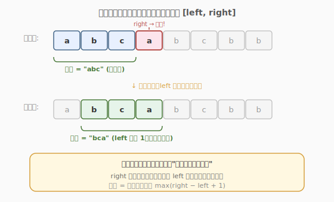
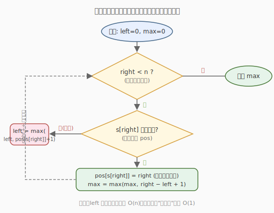
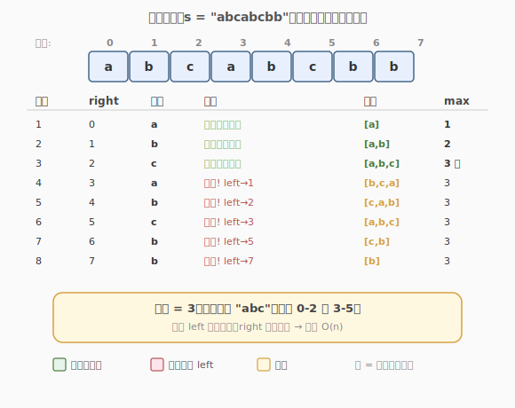

# 无重复字符的最长子串

- **题目名称**：无重复字符的最长子串
- **链接**：[3. 无重复字符的最长子串](https://leetcode.cn/problems/longest-substring-without-repeating-characters/)
- **难度**：中等
- **标签**：哈希表、字符串、滑动窗口

## 1. 题目概述

给定一个字符串 `s`，请你找出其中不含有重复字符的**最长子串**的长度。

**示例 1**：

```text
输入：s = "abcabcbb"
输出：3
解释：因为无重复字符的最长子串是 "abc"，所以其长度为 3。
```

**示例 2**：

```text
输入：s = "bbbbb"
输出：1
解释：因为无重复字符的最长子串是 "b"，所以其长度为 1。
```

**示例 3**：

```text
输入：s = "pwwkew"
输出：3
解释：因为无重复字符的最长子串是 "wke"，所以其长度为 3。
     注意，答案必须是子串的长度，"pwke" 是一个子序列，不是子串。
```

**约束条件**：

- `0 <= s.length <= 5 * 10^4`
- `s` 由英文字母、数字、符号和空格组成

---

## 2. 解题思路

### 2.1 暴力思路

枚举所有子串 `[i, j]`，检查其中是否含有重复字符，记录最长长度。时间复杂度 `O(n^3)`（枚举 `O(n^2)` × 检查 `O(n)`），必然超时。

### 2.2 核心观察：滑动窗口



关键直觉是维护一个**无重复字符的窗口** `[left, right]`：

- `right` 指针不断右移，把新字符纳入窗口。
- 一旦 `s[right]` 已经在窗口中出现过，就把 `left` 跳到「该重复字符上次出现位置的下一位」，把重复字符踢出窗口。
- 窗口始终保持无重复，答案就是窗口宽度的最大值 `max(right - left + 1)`。

> 为什么 `left` 可以直接「跳」而不是一步步挪？因为窗口内既然已有 `s[right]`，在旧位置之前的所有起点都必然包含这个重复字符，逐一收缩只是浪费时间。用哈希表记录每个字符的**最新下标**，就能让「查找重复」和「定位 left」都变成 `O(1)`。

### 2.3 算法流程图



整体只有一重循环，`left` 和 `right` 都只增不减，因此总移动次数不超过 `2n`。

### 2.4 示例演算



上表逐步展示了 `s = "abcabcbb"` 的完整执行过程：

- 前 3 步窗口不断扩张，`max` 达到 `3`（子串 `"abc"`）。
- 第 4 步 `right=3` 遇到 `'a'` 重复，`left` 从 `0` 跳到 `1`，窗口变为 `"bca"`。
- 后续每次遇到重复都把 `left` 跳过旧位置，窗口宽度始终不超过 `3`。
- 最终答案为 `3`。

---

## 3. 参考代码

### C++（哈希表记录最新下标）

```cpp
class Solution {
  public:
    int lengthOfLongestSubstring(string s) {
        unordered_map<char, int> pos; // 字符 -> 最新下标
        int left = 0, max_len = 0;

        for (int right = 0; right < s.size(); right++) {
            char c = s[right];
            if (pos.count(c) && pos[c] >= left) {
                left = pos[c] + 1; // 跳过重复字符
            }
            pos[c] = right;
            max_len = max(max_len, right - left + 1);
        }

        return max_len;
    }
};
```

### Python

```python
class Solution:
    def lengthOfLongestSubstring(self, s: str) -> int:
        pos = {}            # 字符 -> 最新下标
        left = 0
        max_len = 0

        for right, c in enumerate(s):
            if c in pos and pos[c] >= left:
                left = pos[c] + 1
            pos[c] = right
            max_len = max(max_len, right - left + 1)

        return max_len
```

> ⚠️ **注意 `pos[c] >= left` 这个条件**：哈希表里可能记录着窗口之外的旧下标，必须确认重复字符确实在当前窗口 `[left, right]` 内，才需要移动 `left`，否则会误伤。

---

## 4. 复杂度分析

| 维度 | 复杂度 | 说明 |
|------|--------|------|
| 时间复杂度 | O(n) | `left`、`right` 各至多遍历一次，哈希表操作 O(1) |
| 空间复杂度 | O(min(m, n)) | `m` 为字符集大小；哈希表最多存字符集大小 |

---

## 5. 扩展：数组代替哈希表

当字符集较小时（如仅 ASCII），可用定长数组代替 `unordered_map`，常数更小：

```cpp
class Solution {
  public:
    int lengthOfLongestSubstring(string s) {
        int idx[128];
        memset(idx, -1, sizeof(idx));
        int left = 0, max_len = 0;

        for (int right = 0; right < s.size(); right++) {
            char c = s[right];
            if (idx[c] >= left) {
                left = idx[c] + 1;
            }
            idx[c] = right;
            max_len = max(max_len, right - left + 1);
        }

        return max_len;
    }
};
```

---

## 6. 面试要点

1. **滑动窗口的本质是什么？**

   - 用两个指针维护一个满足条件的区间，`right` 扩张探索、`left` 收缩修正。当「窗口的单调性」成立（`left`、`right` 都只增不减）时，复杂度从暴力的 `O(n^2)` 降到 `O(n)`。

2. **为什么 `left` 要用 `max(left, pos[c]+1)` 或判断 `pos[c] >= left`？**

   - 哈希表里可能保留着窗口之外的旧下标。如果不判断就直接 `left = pos[c] + 1`，可能把 `left` 往回挪，导致窗口里重新混入重复字符。

3. **如果题目要求返回最长子串本身（而非长度）怎么做？**

   - 在更新 `max_len` 时同时记录对应的 `start`，最后返回 `s.substr(start, max_len)`。

4. **滑动窗口和双指针是一回事吗？**

   - 滑动窗口是双指针的一种特例：双指针的 `left`、`right` 可以相向移动（如接雨水），也可以同向移动；滑动窗口专指**同向移动**且维护区间性质的模式。本题是同向双指针。

5. **字符集很大（如 Unicode）时会有什么问题？**

   - 数组方案不再适用（空间爆炸），必须用哈希表；时间复杂度不变，但常数增大。面试中可主动提及这一权衡。
