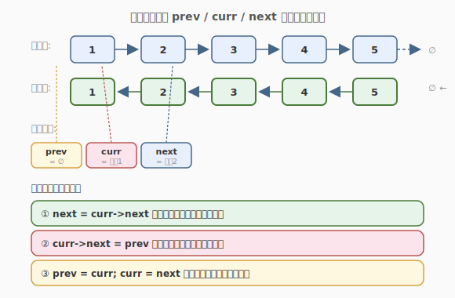
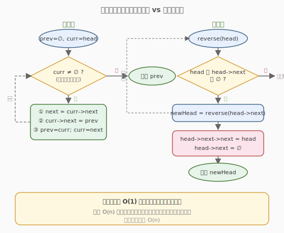
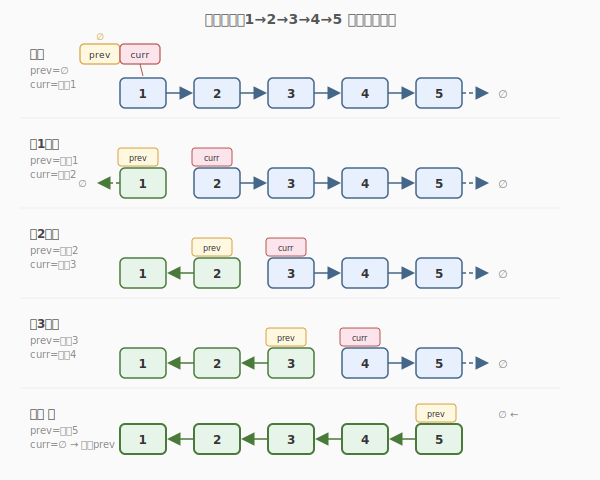

# 反转链表

- **题目名称**：反转链表
- **链接**：[206. 反转链表](https://leetcode.cn/problems/reverse-linked-list/)
- **难度**：简单
- **标签**：链表、指针操作、递归

## 1. 题目概述

给你单链表的头节点 `head`，请你反转链表，并返回反转后的链表的头节点。

**示例 1**：

```text
输入：head = [1,2,3,4,5]
输出：[5,4,3,2,1]
```

**示例 2**：

```text
输入：head = [1,2]
输出：[2,1]
```

**示例 3**：

```text
输入：head = []
输出：[]
```

**约束条件**：

- 链表中节点数目范围 `[0, 5000]`
- `-5000 <= Node.val <= 5000`

**进阶要求**：链表可以选用迭代或递归方式完成，两种方式都要掌握。

---

## 2. 解题思路

### 2.1 暴力思路：把值存下来再倒填

遍历链表把所有 `val` 存入数组，反转数组后再依次写回链表节点。虽然能用，但：

- 需要 `O(n)` 额外空间。
- 只改值不改指针，没有真正"反转链表"，面试官通常不满意。
- 一旦节点带额外信息（如随机指针），这种方法直接失效。

正确做法是**修改指针指向**，把整条链"掉头"。

### 2.2 核心观察：三指针迭代



关键直觉：用三个指针 `prev`、`curr`、`next`，逐个节点把它的 `next` 指针从"向后"改成"向前"。每轮循环只做三件事：

1. **`next = curr->next`**：先把下一个节点存住，否则改指针后就找不到后半截链表了。
2. **`curr->next = prev`**：让当前节点掉头，指向"已经反转好的前半截"。
3. **`prev = curr; curr = next`**：两个指针整体右移一格，进入下一轮。

当 `curr` 走到 `nullptr` 时，`prev` 恰好停在原链表的最后一个节点，也就是反转后的新头节点。

> 💡 为什么要先存 `next`？因为第 ② 步一旦把 `curr->next` 改成 `prev`，原本指向的下一个节点就"断开"了，必须提前用 `next` 接住，否则后续节点全部丢失。

### 2.3 算法流程图



迭代法和递归法都能完成反转，但本质不同：

| 维度 | 迭代法 | 递归法 |
|------|--------|--------|
| 思路 | 从头到尾逐个掉头 | 先递归反转后半段，再处理当前节点 |
| 空间 | O(1) | O(n)（调用栈） |
| 长链表 | 安全 | 可能栈溢出 |
| 代码量 | 略长 | 简洁 |

> 💡 **一句话总结**：面试默认写迭代法（O(1) 空间、不会爆栈）；递归法作为思路展示，体现对"子问题"的理解。

### 2.4 示例演算



以 `1→2→3→4→5` 为例，每轮循环后绿色节点表示"已反转"部分，蓝色节点表示"待处理"部分：

- **第 1 轮**：节点 1 的 `next` 从指向 2 改为指向 `∅`，`prev` 移到节点 1，`curr` 移到节点 2。
- **第 2 轮**：节点 2 的 `next` 改为指向节点 1，此时已反转段为 `2→1→∅`。
- **第 3 轮**：节点 3 掉头指向节点 2，已反转段为 `3→2→1→∅`。
- ……以此类推，直到 `curr` 走到 `∅`，`prev` 停在节点 5，即为新头节点。

整个过程每轮把一个节点从"待处理"挪到"已反转"，`prev` 始终是已反转段的头。

---

## 3. 参考代码

### C++（迭代法，推荐）

```cpp
/**
 * Definition for singly-linked list.
 * struct ListNode {
 *     int val;
 *     ListNode *next;
 *     ListNode() : val(0), next(nullptr) {}
 *     ListNode(int x) : val(x), next(nullptr) {}
 *     ListNode(int x, ListNode *next) : val(x), next(next) {}
 * };
 */
class Solution {
  public:
    ListNode* reverseList(ListNode* head) {
        ListNode* prev = nullptr;
        ListNode* curr = head;
        while (curr != nullptr) {
            ListNode* next = curr->next; // ① 存住下一个
            curr->next = prev;           // ② 掉头
            prev = curr;                 // ③ 右移
            curr = next;
        }
        return prev; // curr 为空时，prev 即新头
    }
};
```

### Python（迭代法）

```python
class Solution:
    def reverseList(self, head: Optional[ListNode]) -> Optional[ListNode]:
        prev = None
        curr = head
        while curr:
            nxt = curr.next   # ① 存住下一个
            curr.next = prev  # ② 掉头
            prev = curr       # ③ 右移
            curr = nxt
        return prev
```

---

## 4. 复杂度分析

| 维度 | 复杂度 | 说明 |
|------|--------|------|
| 时间复杂度 | O(n) | 每个节点访问一次，循环 n 次 |
| 空间复杂度 | O(1) | 只用 prev/curr/next 三个指针 |

---

## 5. 扩展：递归法

递归的思路是「先反转后面的子链表，再把当前节点接到尾部」。代码极简但需要理解递归栈：

```cpp
class Solution {
  public:
    ListNode* reverseList(ListNode* head) {
        // 递归终止：空链表或只剩一个节点
        if (head == nullptr || head->next == nullptr) {
            return head;
        }
        // 先反转 head->next 开始的子链表，newHead 是反转后的头
        ListNode* newHead = reverseList(head->next);
        // 此时 head->next 是子链表反转后的尾节点
        head->next->next = head; // 让尾节点指回 head
        head->next = nullptr;    // head 自己变成新的尾
        return newHead;
    }
};
```

**关键理解点**：递归到最深处返回最后一个节点（新头），回溯时每一层都把当前节点接到已反转段的末尾。`head->next->next = head` 这一句是核心——`head->next` 此时是子链表反转后的尾，让它指向 `head`，就把 `head` 也接进反转段了。

> ⚠️ **注意**：递归法空间复杂度 `O(n)`（调用栈深度为 n），链表超过几千个节点时可能栈溢出，面试中作为"另一种思路"回答即可，默认实现用迭代法。

---

## 6. 面试要点

1. **为什么必须先存 `next` 再改 `curr->next`？**

   - `curr->next = prev` 会覆盖掉原本指向下一个节点的指针，如果不提前用 `next` 保存，后续节点就再也找不到了，链表直接断成两截。

2. **循环结束时 `prev` 一定指向新头吗？**

   - 是的。循环在 `curr == nullptr` 时退出，而 `prev` 在上一轮刚被赋值为 `curr`（即原链表最后一个非空节点），正好是反转后的头节点。空链表时 `prev` 一开始就是 `nullptr`，也正确。

3. **迭代法和递归法各自的空间复杂度？**

   - 迭代 `O(1)`（只用常数指针）；递归 `O(n)`（调用栈深度为 n）。所以长链表首选迭代，避免栈溢出。

4. **递归法中 `head->next->next = head` 为什么成立？**

   - 递归调用 `reverseList(head->next)` 返回后，`head->next` 仍是原子链表的第二个节点，但它现在成了反转后子链表的**尾节点**。让尾节点的 `next` 指回 `head`，就把 `head` 接到了反转段的末尾。

5. **如果要求只反转链表的一部分（如 LeetCode 92 反转链表 II）怎么做？**

   - 先定位到待反转段的前驱 `pre` 和起点 `start`，对 `[left, right]` 区间用同样的三指针迭代法局部反转，最后把三段（前段、反转段、后段）重新接上。核心掉头逻辑完全复用本题。

6. **本题和「反转链表 II」「K 个一组翻转链表」的关系？**

   - 本题是它们的"原子操作"。区间反转 = 定位区间 + 局部套用本题迭代；K 个一组翻转 = 每组套用本题迭代。掌握本题的三指针模板，后续两题只是加边界处理。

---

## 7. 同类练习题
- [92. 反转链表 II](https://leetcode.cn/problems/reverse-linked-list-ii/)：反转指定区间
- [25. K 个一组翻转链表](https://leetcode.cn/problems/reverse-nodes-in-k-group/)：分段翻转
- [24. 两两交换链表中的节点](https://leetcode.cn/problems/swap-nodes-in-pairs/)：成对翻转
